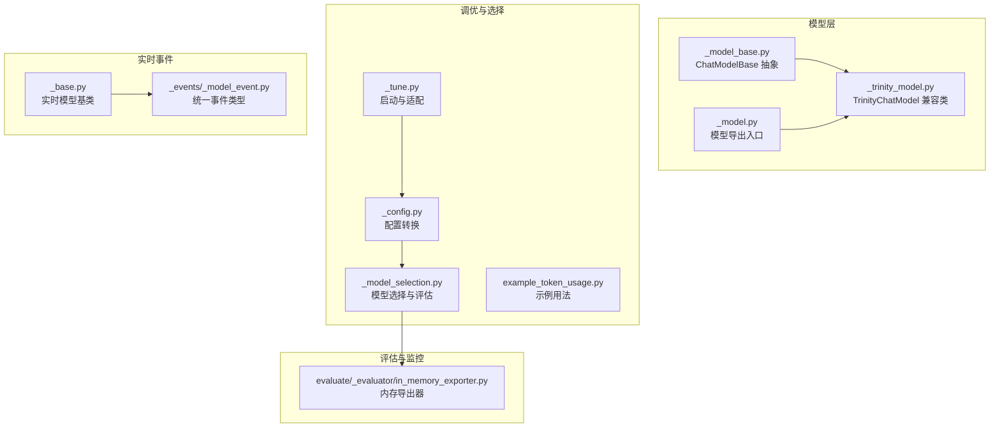
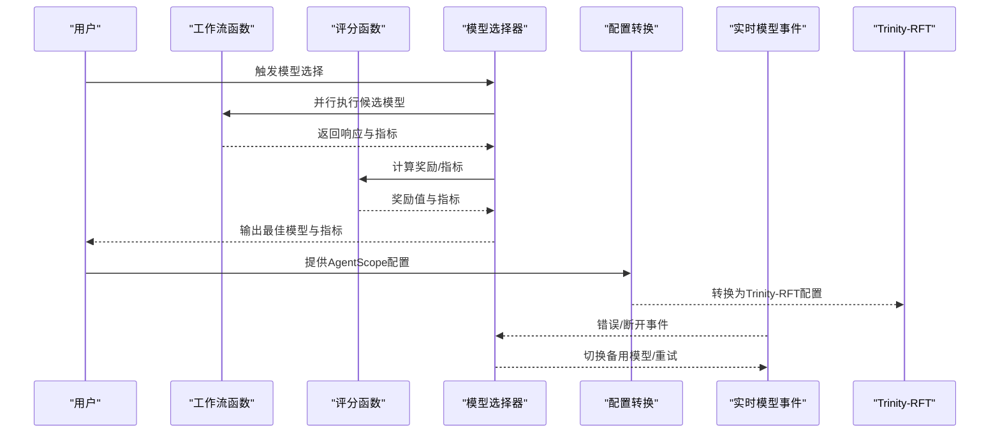
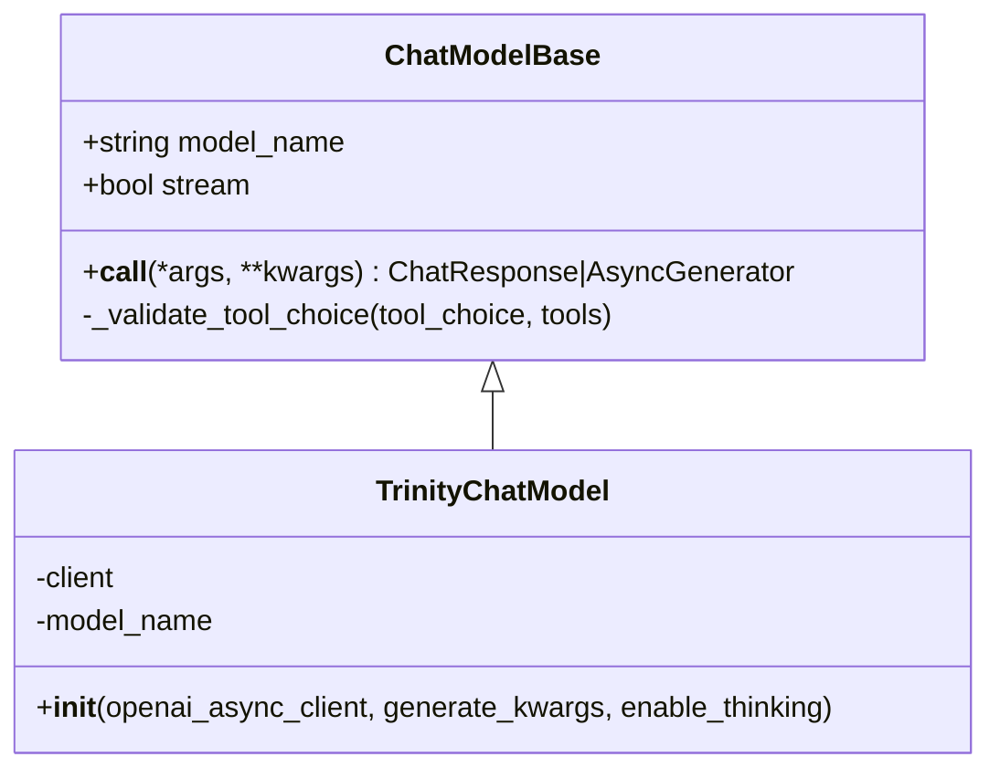
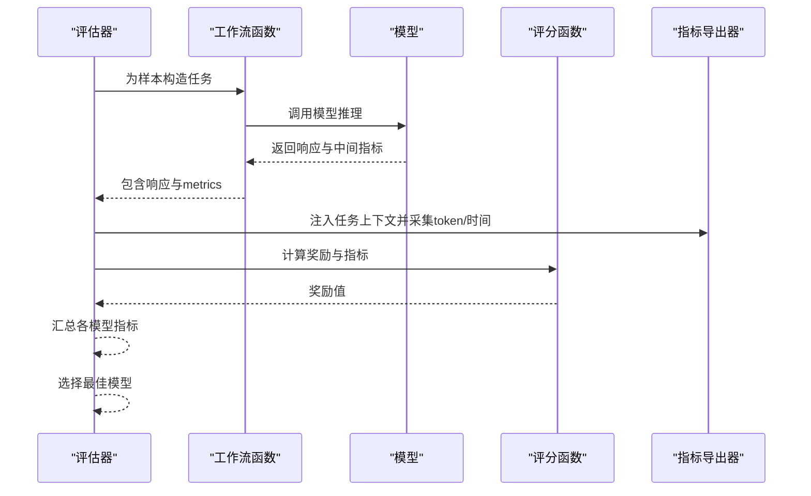
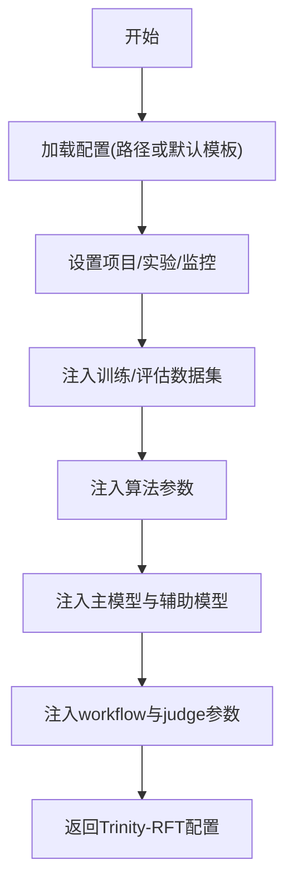
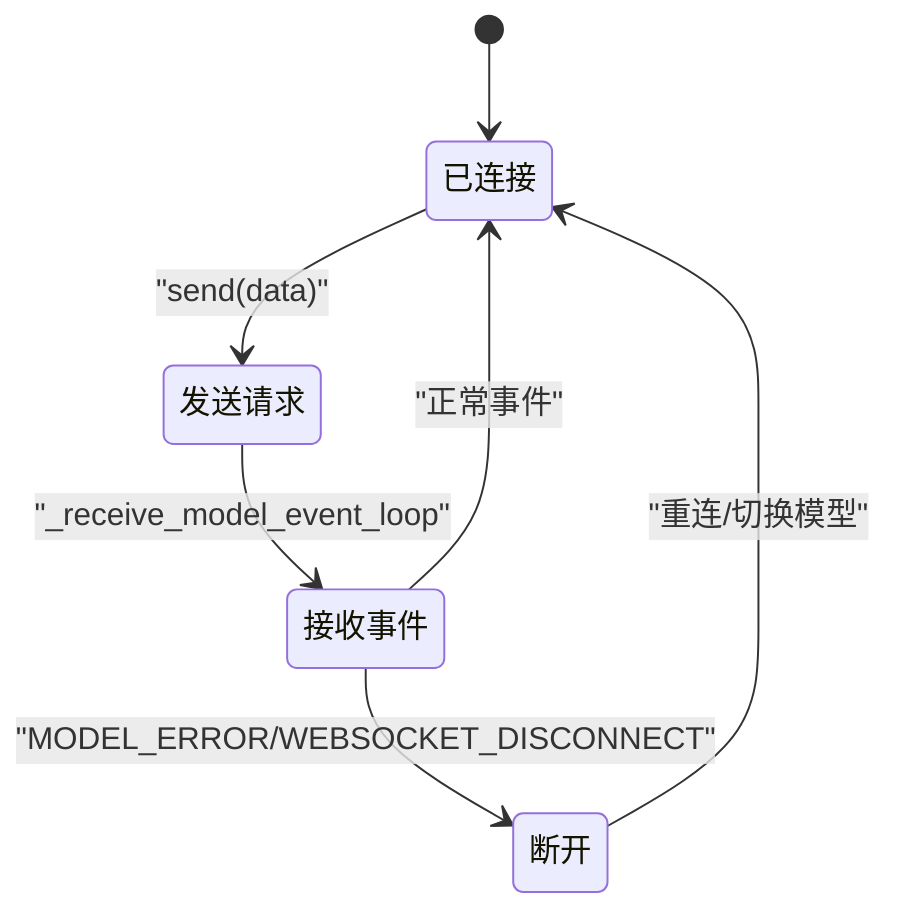
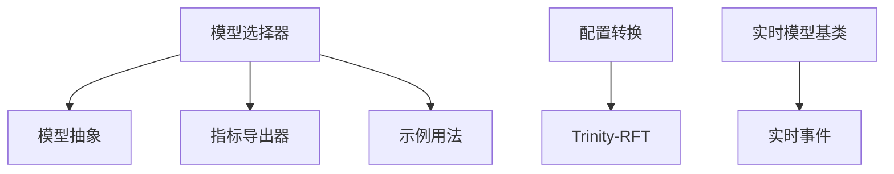

# Trinity多模型协调器

<cite>
**本文引用的文件**
- [model/_trinity_model.py](file://src/agentscope/model/_trinity_model.py)
- [model/__init__.py](file://src/agentscope/model/__init__.py)
- [model/_model_base.py](file://src/agentscope/model/_model_base.py)
- [tuner/_config.py](file://src/agentscope/tuner/_config.py)
- [tuner/_tune.py](file://src/agentscope/tuner/_tune.py)
- [tuner/model_selection/_model_selection.py](file://src/agentscope/tuner/model_selection/_model_selection.py)
- [tuner/model_selection/example_token_usage.py](file://examples/tuner/model_selection/example_token_usage.py)
- [tuner/_model.py](file://src/agentscope/tuner/_model.py)
- [realtime/_events/_model_event.py](file://src/agentscope/realtime/_events/_model_event.py)
- [realtime/_base.py](file://src/agentscope/realtime/_base.py)
- [evaluate/_evaluator/in_memory_exporter.py](file://src/agentscope/evaluate/_evaluator/in_memory_exporter.py)
- [examples/tuner/model_selection/README.md](file://examples/tuner/model_selection/README.md)
</cite>

## 目录
1. [简介](#简介)
2. [项目结构](#项目结构)
3. [核心组件](#核心组件)
4. [架构总览](#架构总览)
5. [详细组件分析](#详细组件分析)
6. [依赖分析](#依赖分析)
7. [性能考虑](#性能考虑)
8. [故障排查指南](#故障排查指南)
9. [结论](#结论)
10. [附录](#附录)

## 简介
本技术文档围绕Trinity多模型协调器在AgentScope中的集成与应用展开，重点阐述以下方面：
- 多模型协同工作机制：模型选择策略、并发评估、指标聚合与决策。
- 负载均衡与故障转移：基于事件驱动的实时模型连接管理与错误事件处理。
- 自动化模型切换机制：以性能监控、延迟检测、质量评估为核心的闭环反馈。
- 统一接口设计理念：模型抽象、参数标准化、响应合并与跨平台兼容。
- 部署与配置指南：权重分配、优先级设置、资源调度与Trinity-RFT配置对接。
- 实际使用场景：通过Trinity实现智能选择与动态切换的端到端流程。

## 项目结构
Trinity多模型协调器在AgentScope中主要由以下模块构成：
- 模型层：统一的聊天模型抽象与具体厂商实现（如OpenAI、DashScope、Gemini等），以及面向Trinity-RFT的兼容适配类。
- 调优与选择：模型选择子模块，支持并行评估、指标采集与最佳模型挑选。
- 配置转换：将AgentScope侧的调优配置转换为Trinity-RFT可识别的配置对象。
- 实时事件：统一的实时模型事件类型与事件解析，支撑故障转移与会话生命周期管理。
- 评估导出：基于OpenTelemetry的内存导出器，用于统计token用量与执行时间等关键指标。

**图表来源**
- [model/_model_base.py:13-44](file://src/agentscope/model/_model_base.py#L13-L44)
- [model/_trinity_model.py:21-68](file://src/agentscope/model/_trinity_model.py#L21-L68)
- [model/__init__.py:13-22](file://src/agentscope/model/__init__.py#L13-L22)
- [tuner/_tune.py:38-62](file://src/agentscope/tuner/_tune.py#L38-L62)
- [tuner/_config.py:20-121](file://src/agentscope/tuner/_config.py#L20-L121)
- [tuner/model_selection/_model_selection.py:75-241](file://src/agentscope/tuner/model_selection/_model_selection.py#L75-L241)
- [realtime/_events/_model_event.py:13-344](file://src/agentscope/realtime/_events/_model_event.py#L13-L344)
- [realtime/_base.py:13-174](file://src/agentscope/realtime/_base.py#L13-L174)
- [evaluate/_evaluator/in_memory_exporter.py:38-74](file://src/agentscope/evaluate/_evaluator/in_memory_exporter.py#L38-L74)

**章节来源**
- [model/_model_base.py:13-78](file://src/agentscope/model/_model_base.py#L13-L78)
- [model/_trinity_model.py:1-68](file://src/agentscope/model/_trinity_model.py#L1-L68)
- [model/__init__.py:13-22](file://src/agentscope/model/__init__.py#L13-L22)
- [tuner/_tune.py:38-62](file://src/agentscope/tuner/_tune.py#L38-L62)
- [tuner/_config.py:20-181](file://src/agentscope/tuner/_config.py#L20-L181)
- [tuner/model_selection/_model_selection.py:75-404](file://src/agentscope/tuner/model_selection/_model_selection.py#L75-L404)
- [realtime/_events/_model_event.py:13-344](file://src/agentscope/realtime/_events/_model_event.py#L13-L344)
- [realtime/_base.py:13-174](file://src/agentscope/realtime/_base.py#L13-L174)
- [evaluate/_evaluator/in_memory_exporter.py:38-74](file://src/agentscope/evaluate/_evaluator/in_memory_exporter.py#L38-L74)

## 核心组件
- 模型抽象与统一接口
  - ChatModelBase定义了异步推理接口与工具调用校验逻辑，确保不同厂商模型具备一致的调用契约。
  - 具体模型实现（如OpenAI、DashScope、Gemini等）均遵循该抽象，便于在统一调度层进行替换与编排。
- 模型选择与评估
  - select_model提供并行评估能力，支持限制并发度、聚合指标、记录执行时间与token用量，并输出最佳模型及汇总指标。
  - 内置judge函数可按平均耗时或token消耗等指标进行排序，辅助自动化决策。
- 配置转换与Trinity-RFT对接
  - _to_trinity_config将AgentScope的workflow、judge、数据集、算法与模型配置映射为Trinity-RFT的Config对象，支持默认模板与路径加载。
- 实时事件与故障转移
  - ModelEvents统一了会话生命周期、响应生成、音频/文本转写、工具调用、错误与WebSocket事件，为故障检测与自动切换提供信号基础。
  - RealtimeModelBase封装连接建立、消息接收循环与事件解析，便于在异常时触发重连或切换备用模型。
- 监控与指标采集
  - InMemoryExporter通过OpenTelemetry收集任务级token用量与调用次数，select_model在评估过程中注入execution_time与token统计，形成闭环反馈。

**章节来源**
- [model/_model_base.py:13-78](file://src/agentscope/model/_model_base.py#L13-L78)
- [tuner/model_selection/_model_selection.py:75-404](file://src/agentscope/tuner/model_selection/_model_selection.py#L75-L404)
- [tuner/_config.py:20-121](file://src/agentscope/tuner/_config.py#L20-L121)
- [realtime/_events/_model_event.py:13-344](file://src/agentscope/realtime/_events/_model_event.py#L13-L344)
- [realtime/_base.py:13-174](file://src/agentscope/realtime/_base.py#L13-L174)
- [evaluate/_evaluator/in_memory_exporter.py:38-74](file://src/agentscope/evaluate/_evaluator/in_memory_exporter.py#L38-L74)

## 架构总览
下图展示了从“工作流函数”到“模型选择与Trinity-RFT配置”的整体链路，以及实时事件对故障转移的支持。

**图表来源**
- [tuner/model_selection/_model_selection.py:75-241](file://src/agentscope/tuner/model_selection/_model_selection.py#L75-L241)
- [tuner/_config.py:20-121](file://src/agentscope/tuner/_config.py#L20-L121)
- [realtime/_events/_model_event.py:13-344](file://src/agentscope/realtime/_events/_model_event.py#L13-L344)

## 详细组件分析

### 组件A：模型抽象与统一接口
- 设计要点
  - ChatModelBase定义异步推理接口与工具调用模式校验，保证不同模型在调用层具有一致性。
  - 兼容类TrinityChatModel继承自OpenAIChatModel，保留原有行为的同时接入Trinity-RFT客户端实例，实现无缝迁移。
- 关键流程
  - 初始化阶段校验客户端属性完整性，避免运行期错误。
  - 可选启用“思考”能力并通过模板参数传递至生成过程。
- 适用范围
  - 支持在多模型选择、工作流编排与实时会话中作为统一抽象使用。

**图表来源**
- [model/_model_base.py:13-78](file://src/agentscope/model/_model_base.py#L13-L78)
- [model/_trinity_model.py:21-68](file://src/agentscope/model/_trinity_model.py#L21-L68)

**章节来源**
- [model/_model_base.py:13-78](file://src/agentscope/model/_model_base.py#L13-L78)
- [model/_trinity_model.py:18-68](file://src/agentscope/model/_trinity_model.py#L18-L68)
- [model/__init__.py:13-22](file://src/agentscope/model/__init__.py#L13-L22)

### 组件B：模型选择与自动化切换
- 设计要点
  - select_model支持并发评估，通过信号量控制最大并发线程数，避免资源争抢。
  - 使用OpenTelemetry与InMemoryExporter采集token用量与执行时间，作为质量与性能指标输入。
  - judge函数返回奖励值，选择平均奖励最高的模型；内置avg_time_judge与avg_token_consumption_judge便于快速落地。
- 关键流程
  - 加载数据集并限制样本数量（可选）。
  - 为每个样本创建任务，使用语义化baggage标识任务与重复轮次，确保指标可追踪。
  - 将workflow输出与metrics合并传入judge，得到可比较的奖励值。
  - 汇总各模型的奖励与指标，输出最佳模型与指标字典。
- 自动化切换建议
  - 在实时会话中监听MODEL_ERROR与WEBSOCKET_DISCONNECT事件，结合select_model结果动态切换备用模型。
  - 对高延迟或高token消耗的模型实施降权或限流策略。

**图表来源**
- [tuner/model_selection/_model_selection.py:304-404](file://src/agentscope/tuner/model_selection/_model_selection.py#L304-L404)
- [evaluate/_evaluator/in_memory_exporter.py:38-74](file://src/agentscope/evaluate/_evaluator/in_memory_exporter.py#L38-L74)

**章节来源**
- [tuner/model_selection/_model_selection.py:75-404](file://src/agentscope/tuner/model_selection/_model_selection.py#L75-L404)
- [examples/tuner/model_selection/example_token_usage.py:77-107](file://examples/tuner/model_selection/example_token_usage.py#L77-L107)
- [examples/tuner/model_selection/README.md:15-24](file://examples/tuner/model_selection/README.md#L15-L24)

### 组件C：配置转换与Trinity-RFT对接
- 设计要点
  - _to_trinity_config负责将训练/评估配置、数据集、算法与模型信息映射到Trinity-RFT的Config对象。
  - 支持从路径加载或使用默认模板，自动填充实验名称与监控类型。
  - 将workflow与judge参数注入Taskset与默认workflow类型，确保Trinity-RFT侧可直接调用。
- 关键流程
  - 加载配置（路径或默认模板）。
  - 设置项目名、实验名、监控类型等顶层字段。
  - 注入训练/评估数据集、算法参数与主/辅助模型配置。
  - 返回可直接交给Trinity-RFT执行器使用的配置对象。

**图表来源**
- [tuner/_config.py:20-121](file://src/agentscope/tuner/_config.py#L20-L121)
- [tuner/_config.py:124-181](file://src/agentscope/tuner/_config.py#L124-L181)

**章节来源**
- [tuner/_config.py:20-181](file://src/agentscope/tuner/_config.py#L20-L181)
- [tuner/_tune.py:38-62](file://src/agentscope/tuner/_tune.py#L38-L62)

### 组件D：实时事件与故障转移
- 设计要点
  - ModelEvents定义了统一的事件类型，覆盖会话生命周期、响应生成、音频/文本转写、工具调用、错误与WebSocket事件。
  - RealtimeModelBase封装连接建立、消息接收循环与事件解析，便于在异常时触发重连或切换备用模型。
- 故障转移建议
  - 监听MODEL_ERROR与WEBSOCKET_DISCONNECT事件，结合select_model结果动态选择可用模型。
  - 对频繁断开的上游服务实施熔断与退避策略，降低抖动影响。

**图表来源**
- [realtime/_base.py:134-174](file://src/agentscope/realtime/_base.py#L134-L174)
- [realtime/_events/_model_event.py:13-344](file://src/agentscope/realtime/_events/_model_event.py#L13-L344)

**章节来源**
- [realtime/_events/_model_event.py:13-344](file://src/agentscope/realtime/_events/_model_event.py#L13-L344)
- [realtime/_base.py:13-174](file://src/agentscope/realtime/_base.py#L13-L174)

## 依赖分析
- 组件耦合
  - 模型选择器依赖模型抽象与评估导出器，形成“工作流→指标采集→评分→决策”的闭环。
  - 配置转换器依赖Trinity-RFT的配置对象，将AgentScope侧的高层配置映射到底层执行器。
  - 实时事件与实时模型基类共同构成故障检测与恢复的基础。
- 外部依赖
  - datasets库用于加载评估数据集。
  - OpenTelemetry用于指标采集与上下文传播。
  - websockets用于实时模型的WebSocket通信。

**图表来源**
- [tuner/model_selection/_model_selection.py:75-404](file://src/agentscope/tuner/model_selection/_model_selection.py#L75-L404)
- [tuner/_config.py:20-121](file://src/agentscope/tuner/_config.py#L20-L121)
- [realtime/_base.py:13-174](file://src/agentscope/realtime/_base.py#L13-L174)
- [realtime/_events/_model_event.py:13-344](file://src/agentscope/realtime/_events/_model_event.py#L13-L344)

**章节来源**
- [tuner/model_selection/_model_selection.py:75-404](file://src/agentscope/tuner/model_selection/_model_selection.py#L75-L404)
- [tuner/_config.py:20-121](file://src/agentscope/tuner/_config.py#L20-L121)
- [realtime/_base.py:13-174](file://src/agentscope/realtime/_base.py#L13-L174)

## 性能考虑
- 并发与限流
  - 使用信号量控制模型评估的最大并发度，避免GPU/CPU与网络带宽过载。
  - 对高延迟模型实施降权或限流策略，保障整体吞吐。
- 指标采集
  - 通过OpenTelemetry与InMemoryExporter采集token用量与执行时间，作为性能与成本优化依据。
- 资源调度
  - 在Trinity-RFT配置中合理设置runner_per_model、batch_size与同步策略，平衡收敛速度与稳定性。

## 故障排查指南
- 常见问题
  - 模型初始化失败：检查TrinityChatModel是否正确传入Trinity-RFT提供的AsyncOpenAI实例，确保其具备model_path属性。
  - 评估中断：确认datasets库已安装，数据集路径与split正确；关注select_model中的异常处理日志。
  - 实时连接异常：检查WebSocket URL与头部配置，监听MODEL_ERROR与WEBSOCKET_DISCONNECT事件，必要时切换备用模型。
- 定位手段
  - 查看模型选择器的日志输出，定位失败样本与异常堆栈。
  - 使用InMemoryExporter查看token用量与调用次数，辅助定位热点模型。
  - 在实时模型基类中增加连接状态与错误码打印，便于快速定位网络问题。

**章节来源**
- [model/_trinity_model.py:43-49](file://src/agentscope/model/_trinity_model.py#L43-L49)
- [tuner/model_selection/_model_selection.py:172-179](file://src/agentscope/tuner/model_selection/_model_selection.py#L172-L179)
- [realtime/_events/_model_event.py:318-332](file://src/agentscope/realtime/_events/_model_event.py#L318-L332)

## 结论
Trinity多模型协调器通过统一的模型抽象、完善的评估与配置转换机制，以及实时事件驱动的故障转移能力，在AgentScope中实现了高性能、可扩展且可运维的多模型协同方案。结合自动化模型选择与动态切换，可在复杂业务场景中实现更优的性能与成本表现。

## 附录
- 使用场景示例
  - 模型选择：参考示例脚本，使用avg_token_consumption_judge或avg_time_judge完成自动化模型筛选。
  - 配置对接：通过_TinkerConfig与算法参数，将AgentScope配置转换为Trinity-RFT可执行的配置对象。
  - 实时会话：在实时模型事件基础上实现故障检测与自动切换，提升系统鲁棒性。

**章节来源**
- [examples/tuner/model_selection/example_token_usage.py:77-107](file://examples/tuner/model_selection/example_token_usage.py#L77-L107)
- [examples/tuner/model_selection/README.md:15-24](file://examples/tuner/model_selection/README.md#L15-L24)
- [tuner/_config.py:20-121](file://src/agentscope/tuner/_config.py#L20-L121)