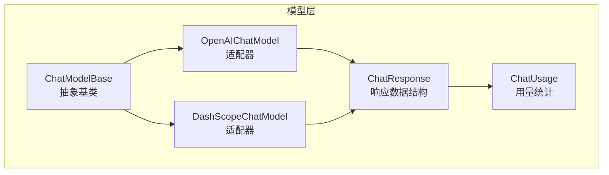
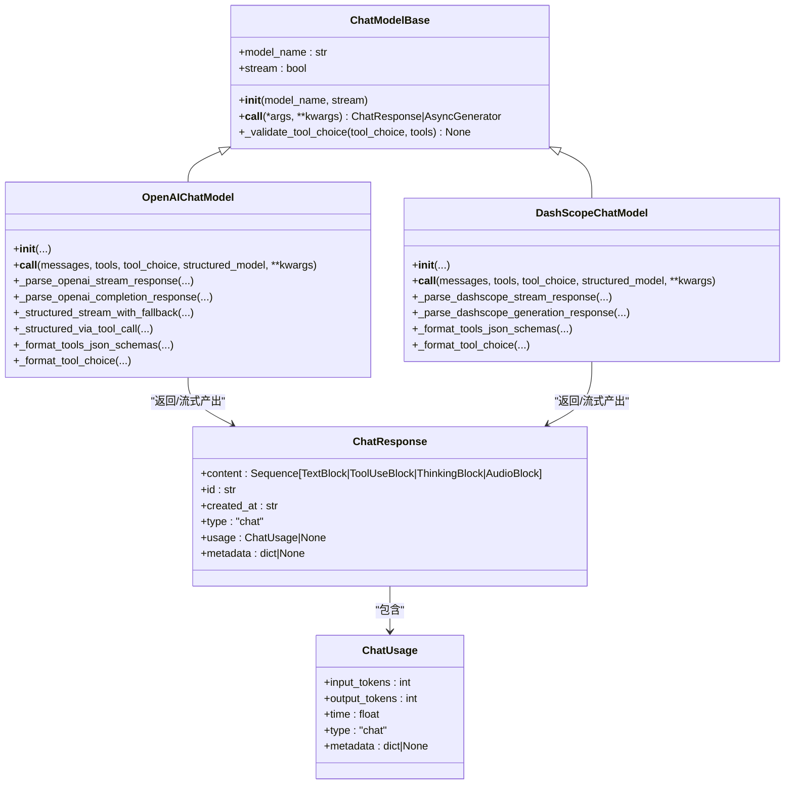
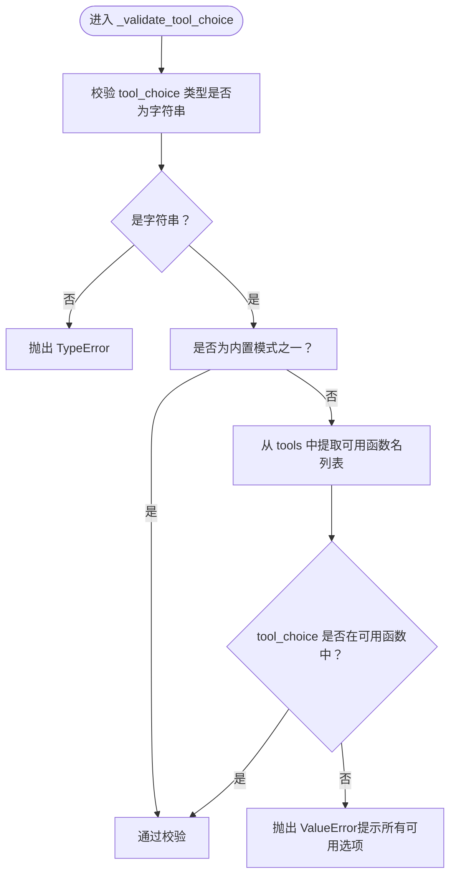
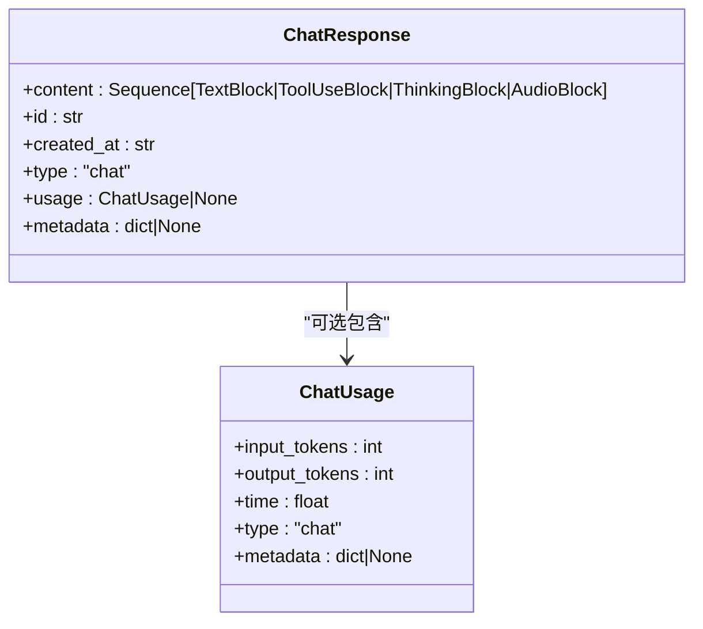
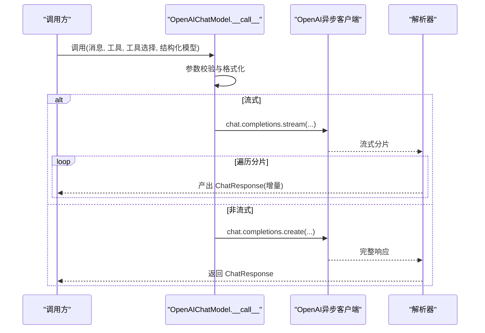
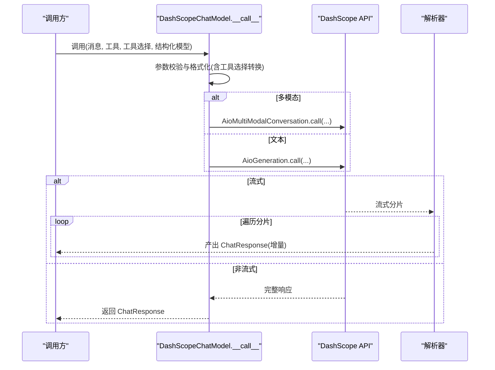
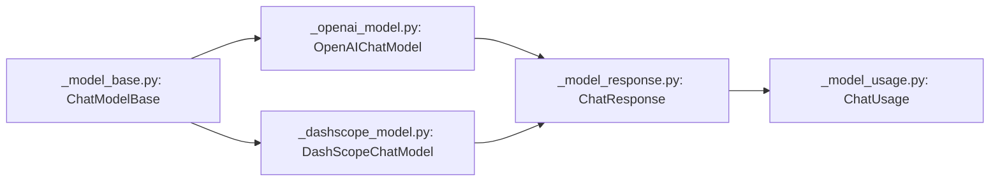

# 模型基类架构

<cite>
**本文引用的文件**
- [src/agentscope/model/_model_base.py](file://src/agentscope/model/_model_base.py)
- [src/agentscope/model/_model_response.py](file://src/agentscope/model/_model_response.py)
- [src/agentscope/model/_model_usage.py](file://src/agentscope/model/_model_usage.py)
- [src/agentscope/model/_openai_model.py](file://src/agentscope/model/_openai_model.py)
- [src/agentscope/model/_dashscope_model.py](file://src/agentscope/model/_dashscope_model.py)
- [src/agentscope/model/__init__.py](file://src/agentscope/model/__init__.py)
</cite>

## 目录
1. [引言](#引言)
2. [项目结构](#项目结构)
3. [核心组件](#核心组件)
4. [架构总览](#架构总览)
5. [详细组件分析](#详细组件分析)
6. [依赖分析](#依赖分析)
7. [性能考虑](#性能考虑)
8. [故障排查指南](#故障排查指南)
9. [结论](#结论)
10. [附录：扩展新模型适配器指南](#附录扩展新模型适配器指南)

## 引言
本文件面向AgentScope的“模型基类架构”，系统性阐述ChatModelBase抽象基类的设计理念与实现要点，覆盖统一接口、异步调用、流式输出、响应标准化、工具选择参数校验、错误处理与使用统计等主题，并提供可直接落地的扩展指南与参考路径，帮助开发者快速、安全地接入新的模型适配器。

## 项目结构
AgentScope的模型层位于src/agentscope/model目录，核心由以下模块组成：
- 抽象基类：ChatModelBase（定义统一接口与通用能力）
- 响应数据结构：ChatResponse（标准化内容块、标识、时间戳、用量、元数据）
- 使用统计：ChatUsage（输入/输出token与时延）
- 具体实现：OpenAI、DashScope、Anthropic、Ollama、Gemini、Trinity等适配器
- 导出入口：model/__init__.py

图表来源
- [src/agentscope/model/_model_base.py:13-78](file://src/agentscope/model/_model_base.py#L13-L78)
- [src/agentscope/model/_model_response.py:19-43](file://src/agentscope/model/_model_response.py#L19-L43)
- [src/agentscope/model/_model_usage.py:9-27](file://src/agentscope/model/_model_usage.py#L9-L27)
- [src/agentscope/model/_openai_model.py:71-795](file://src/agentscope/model/_openai_model.py#L71-L795)
- [src/agentscope/model/_dashscope_model.py:51-643](file://src/agentscope/model/_dashscope_model.py#L51-L643)

章节来源
- [src/agentscope/model/__init__.py:1-23](file://src/agentscope/model/__init__.py#L1-L23)

## 核心组件
- ChatModelBase：定义统一的异步调用接口与工具选择参数校验逻辑，派生类需实现异步__call__以返回ChatResponse或流式生成器。
- ChatResponse：标准化响应载体，包含内容块序列、唯一标识、创建时间、类型、用量与元数据。
- ChatUsage：标准化用量信息，记录输入/输出token与耗时，并保留原始用量对象作为元数据。
- 具体适配器：OpenAIChatModel、DashScopeChatModel等在统一基类之上完成消息格式化、工具调用、流式解析与错误处理。

章节来源
- [src/agentscope/model/_model_base.py:13-78](file://src/agentscope/model/_model_base.py#L13-L78)
- [src/agentscope/model/_model_response.py:19-43](file://src/agentscope/model/_model_response.py#L19-L43)
- [src/agentscope/model/_model_usage.py:9-27](file://src/agentscope/model/_model_usage.py#L9-L27)

## 架构总览
下图展示了模型基类与具体适配器之间的继承与组合关系，以及异步调用与流式输出的典型流程。

图表来源
- [src/agentscope/model/_model_base.py:13-78](file://src/agentscope/model/_model_base.py#L13-L78)
- [src/agentscope/model/_openai_model.py:71-795](file://src/agentscope/model/_openai_model.py#L71-L795)
- [src/agentscope/model/_dashscope_model.py:51-643](file://src/agentscope/model/_dashscope_model.py#L51-L643)
- [src/agentscope/model/_model_response.py:19-43](file://src/agentscope/model/_model_response.py#L19-L43)
- [src/agentscope/model/_model_usage.py:9-27](file://src/agentscope/model/_model_usage.py#L9-L27)

## 详细组件分析

### ChatModelBase 抽象基类
- 统一接口：异步__call__返回ChatResponse或异步生成器，确保上层调用一致性。
- 工具选择参数校验：_validate_tool_choice对tool_choice进行严格校验，支持模式["auto","none","required"]与函数名匹配。
- 关键字段：model_name、stream用于配置与行为控制。

图表来源
- [src/agentscope/model/_model_base.py:46-78](file://src/agentscope/model/_model_base.py#L46-L78)

章节来源
- [src/agentscope/model/_model_base.py:13-78](file://src/agentscope/model/_model_base.py#L13-L78)

### ChatResponse 数据结构与标准化
- 内容块：支持文本、工具调用、思考、音频等多种块类型，便于多模态与工具交互场景。
- 标识与时间：自动生成id与创建时间，便于追踪与审计。
- 类型与元数据：固定type为"chat"，metadata承载结构化解析结果或额外上下文。
- 用量：可选的ChatUsage对象，统一记录token与耗时。

图表来源
- [src/agentscope/model/_model_response.py:19-43](file://src/agentscope/model/_model_response.py#L19-L43)
- [src/agentscope/model/_model_usage.py:9-27](file://src/agentscope/model/_model_usage.py#L9-L27)

章节来源
- [src/agentscope/model/_model_response.py:19-43](file://src/agentscope/model/_model_response.py#L19-L43)
- [src/agentscope/model/_model_usage.py:9-27](file://src/agentscope/model/_model_usage.py#L9-L27)

### OpenAIChatModel 实现要点
- 异步调用：基于OpenAI异步客户端，支持流式与非流式两种路径。
- 流式解析：_parse_openai_stream_response按增量拼接文本、思考、音频与工具调用，支持实时工具输入修复。
- 结构化输出：支持response_format与工具回退两种方式；失败时自动降级为工具调用。
- 工具选择：兼容OpenAI的tool_choice模式，必要时转换为函数名。
- 错误处理：捕获BadRequestError并进行降级与日志提示。

图表来源
- [src/agentscope/model/_openai_model.py:175-343](file://src/agentscope/model/_openai_model.py#L175-L343)
- [src/agentscope/model/_openai_model.py:345-560](file://src/agentscope/model/_openai_model.py#L345-L560)

章节来源
- [src/agentscope/model/_openai_model.py:71-795](file://src/agentscope/model/_openai_model.py#L71-L795)

### DashScopeChatModel 实现要点
- 多模态统一：根据模型名或显式开关自动选择Generation或Multimodal API。
- 流式解析：_parse_dashscope_stream_response聚合文本、思考与工具调用，支持增量工具输入修复。
- 工具选择：DashScope不支持"required"，会自动转换为"auto"。
- 结构化输出：通过工具回退实现，与OpenAI一致的降级策略。

图表来源
- [src/agentscope/model/_dashscope_model.py:162-298](file://src/agentscope/model/_dashscope_model.py#L162-L298)
- [src/agentscope/model/_dashscope_model.py:300-486](file://src/agentscope/model/_dashscope_model.py#L300-L486)

章节来源
- [src/agentscope/model/_dashscope_model.py:51-643](file://src/agentscope/model/_dashscope_model.py#L51-L643)

## 依赖分析
- 继承关系：OpenAIChatModel、DashScopeChatModel均继承自ChatModelBase，复用统一接口与工具选择校验。
- 数据结构依赖：ChatResponse依赖ChatUsage与多种消息块类型；各适配器在解析阶段构建这些对象。
- 导出入口：model/__init__.py集中导出基类与适配器，便于外部按需导入。

图表来源
- [src/agentscope/model/_model_base.py:13-78](file://src/agentscope/model/_model_base.py#L13-L78)
- [src/agentscope/model/_openai_model.py:71-795](file://src/agentscope/model/_openai_model.py#L71-L795)
- [src/agentscope/model/_dashscope_model.py:51-643](file://src/agentscope/model/_dashscope_model.py#L51-L643)
- [src/agentscope/model/_model_response.py:19-43](file://src/agentscope/model/_model_response.py#L19-L43)
- [src/agentscope/model/_model_usage.py:9-27](file://src/agentscope/model/_model_usage.py#L9-L27)

章节来源
- [src/agentscope/model/__init__.py:1-23](file://src/agentscope/model/__init__.py#L1-L23)

## 性能考虑
- 流式输出：优先启用流式以降低首字节延迟，提升交互体验；解析器按增量产出响应。
- 工具输入修复：在流式模式下开启实时JSON修复可减少等待，但需权衡CPU开销。
- 结构化输出：优先使用API原生结构化能力；不支持时采用工具回退，避免重复请求。
- 用量统计：在流式场景中按分片累计token与耗时，保证统计准确性。

## 故障排查指南
- 工具选择参数错误
  - 现象：抛出TypeError或ValueError
  - 排查：确认tool_choice为字符串；若为函数名，确保存在于tools中；若为模式，仅允许["auto","none","required"]
  - 参考路径：[src/agentscope/model/_model_base.py:46-78](file://src/agentscope/model/_model_base.py#L46-L78)
- OpenAI结构化输出失败
  - 现象：response_format被拒绝，触发降级
  - 排查：查看日志警告并确认模型是否支持response_format；后续调用将直接走工具回退
  - 参考路径：[src/agentscope/model/_openai_model.py:310-326](file://src/agentscope/model/_openai_model.py#L310-L326)
- DashScope工具选择不支持"required"
  - 现象：自动转换为"auto"并发出弃用警告
  - 排查：调整tool_choice为"auto"/"none"或指定函数名
  - 参考路径：[src/agentscope/model/_dashscope_model.py:230-240](file://src/agentscope/model/_dashscope_model.py#L230-L240)

章节来源
- [src/agentscope/model/_model_base.py:46-78](file://src/agentscope/model/_model_base.py#L46-L78)
- [src/agentscope/model/_openai_model.py:310-326](file://src/agentscope/model/_openai_model.py#L310-L326)
- [src/agentscope/model/_dashscope_model.py:230-240](file://src/agentscope/model/_dashscope_model.py#L230-L240)

## 结论
ChatModelBase通过统一接口与参数校验，为多厂商模型提供了稳定一致的抽象；结合ChatResponse与ChatUsage的标准化设计，使得上层应用无需关心底层差异即可实现流式对话、工具调用与结构化输出。OpenAI与DashScope等适配器展示了如何在该架构下高效集成异步调用、流式解析与错误降级，为扩展更多模型提供清晰范式。

## 附录：扩展新模型适配器指南
- 继承与初始化
  - 继承ChatModelBase，调用super().__init__(model_name, stream)完成基类初始化
  - 在__init__中完成SDK客户端初始化与参数校验
  - 参考路径：[src/agentscope/model/_model_base.py:22-36](file://src/agentscope/model/_model_base.py#L22-L36)，[src/agentscope/model/_openai_model.py:74-174](file://src/agentscope/model/_openai_model.py#L74-L174)
- 实现异步调用
  - 实现async def __call__(...)，接收messages、tools、tool_choice、structured_model等参数
  - 在内部完成参数校验、格式化与SDK调用
  - 若支持流式，返回AsyncGenerator[ChatResponse, None]；否则返回ChatResponse
  - 参考路径：[src/agentscope/model/_model_base.py:38-44](file://src/agentscope/model/_model_base.py#L38-L44)，[src/agentscope/model/_dashscope_model.py:162-298](file://src/agentscope/model/_dashscope_model.py#L162-L298)
- 响应解析与标准化
  - 将SDK响应解析为内容块序列（文本/工具/思考/音频等），构造ChatResponse
  - 解析并填充ChatUsage（input_tokens、output_tokens、time）
  - 参考路径：[src/agentscope/model/_openai_model.py:561-681](file://src/agentscope/model/_openai_model.py#L561-L681)，[src/agentscope/model/_dashscope_model.py:487-591](file://src/agentscope/model/_dashscope_model.py#L487-L591)
- 工具选择参数校验
  - 调用self._validate_tool_choice(tool_choice, tools)进行参数校验
  - 参考路径：[src/agentscope/model/_model_base.py:46-78](file://src/agentscope/model/_model_base.py#L46-L78)
- 错误处理与降级
  - 对API不支持的功能（如DashScope的"required"）进行模式转换与告警
  - 对结构化输出失败进行降级（如OpenAI的工具回退）
  - 参考路径：[src/agentscope/model/_dashscope_model.py:230-240](file://src/agentscope/model/_dashscope_model.py#L230-L240)，[src/agentscope/model/_openai_model.py:310-326](file://src/agentscope/model/_openai_model.py#L310-L326)
- 导出与测试
  - 在model/__init__.py中注册新适配器，确保__all__包含新类
  - 编写单元测试覆盖异步调用、流式解析、工具选择与错误场景
  - 参考路径：[src/agentscope/model/__init__.py:13-22](file://src/agentscope/model/__init__.py#L13-L22)