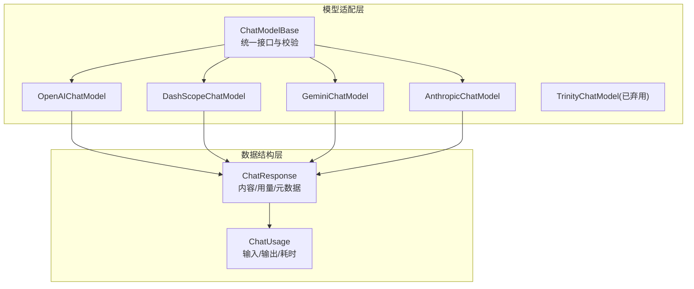
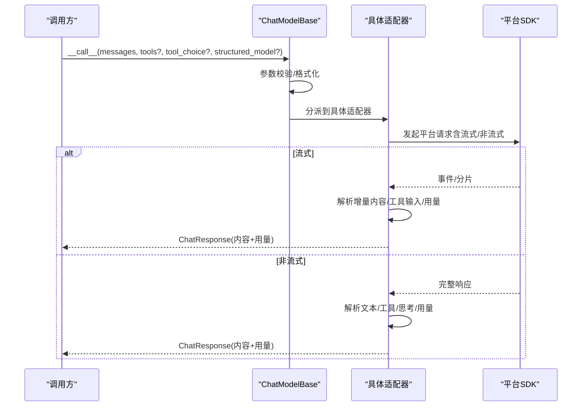
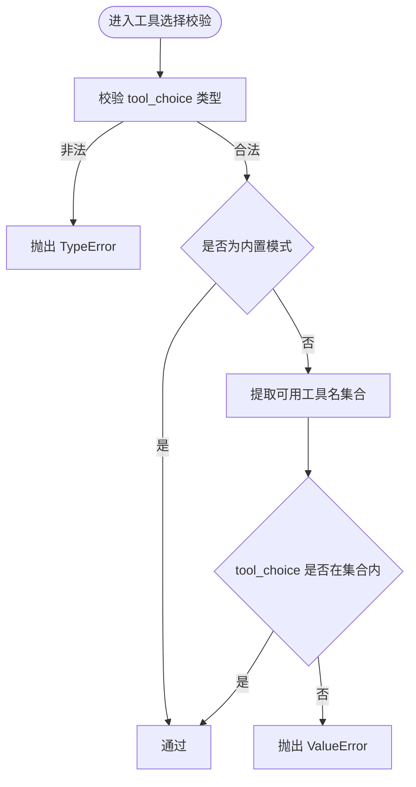
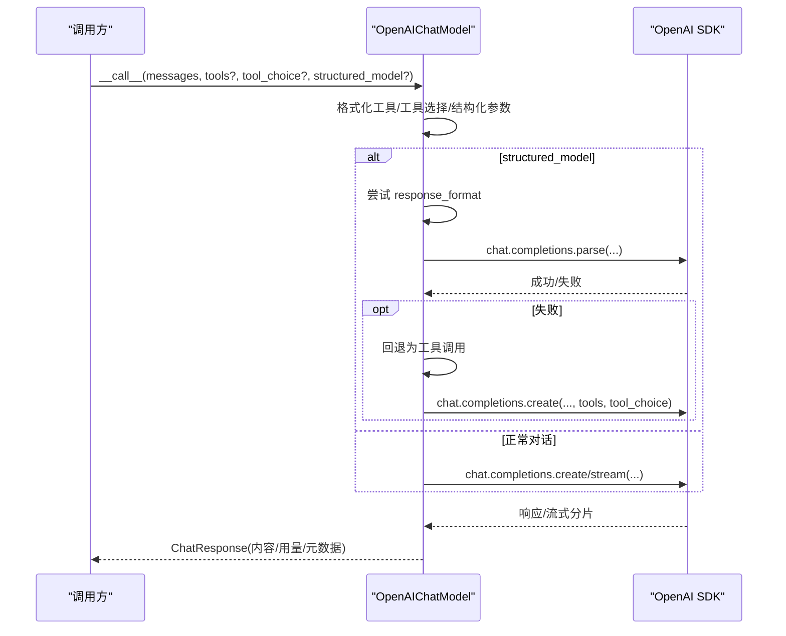
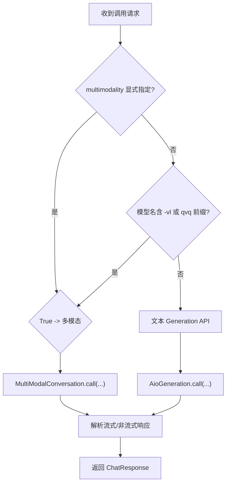
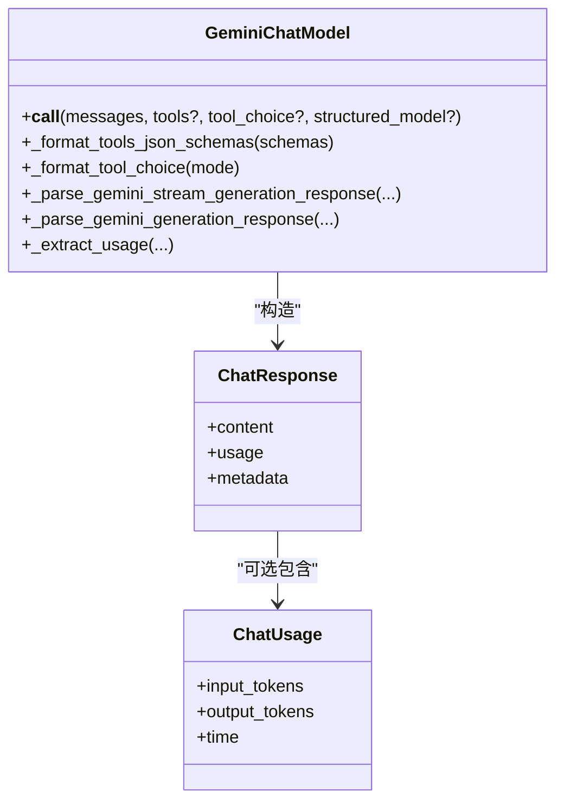
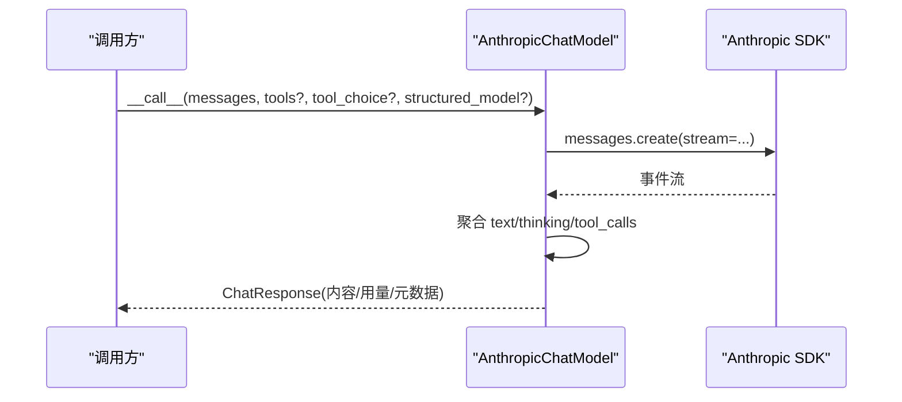
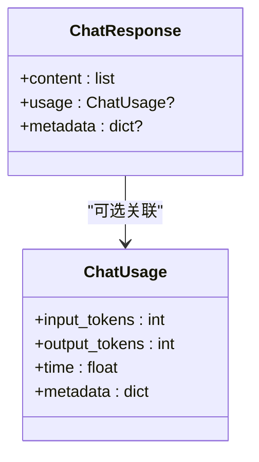
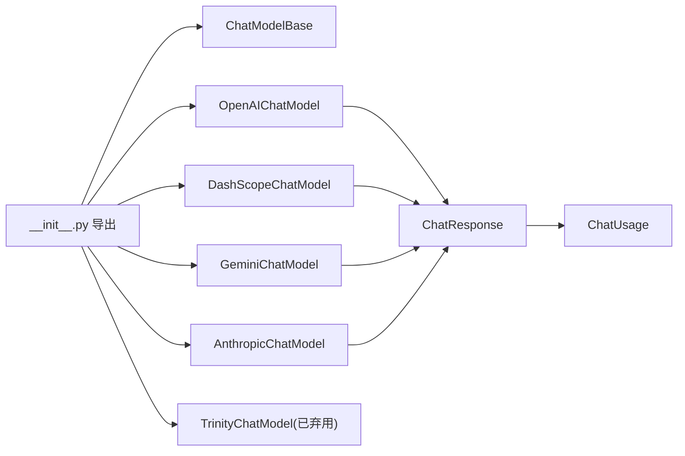

# 模型适配器

<cite>
**本文引用的文件**
- [模型模块入口](file://src/agentscope/model/__init__.py)
- [模型基类](file://src/agentscope/model/_model_base.py)
- [模型响应数据结构](file://src/agentscope/model/_model_response.py)
- [模型用量数据结构](file://src/agentscope/model/_model_usage.py)
- [OpenAI 适配器](file://src/agentscope/model/_openai_model.py)
- [DashScope 适配器](file://src/agentscope/model/_dashscope_model.py)
- [Gemini 适配器](file://src/agentscope/model/_gemini_model.py)
- [Anthropic 适配器](file://src/agentscope/model/_anthropic_model.py)
- [Trinity 模型（已弃用）](file://src/agentscope/model/_trinity_model.py)
- [OpenAI 单元测试](file://tests/model_openai_test.py)
- [DashScope 单元测试](file://tests/model_dashscope_test.py)
- [Gemini 单元测试](file://tests/model_gemini_test.py)
- [Anthropic 单元测试](file://tests/model_anthropic_test.py)
</cite>

## 目录
1. [简介](#简介)
2. [项目结构](#项目结构)
3. [核心组件](#核心组件)
4. [架构总览](#架构总览)
5. [详细组件分析](#详细组件分析)
6. [依赖关系分析](#依赖关系分析)
7. [性能与成本考量](#性能与成本考量)
8. [故障排除指南](#故障排除指南)
9. [结论](#结论)
10. [附录：最佳实践与示例](#附录最佳实践与示例)

## 简介
本文件面向 AgentScope 的“模型适配器”体系，系统性阐述统一模型抽象、跨平台适配器实现、响应标准化处理、使用统计与成本估算、以及配置与运维最佳实践。读者可据此在不同大模型平台（如 OpenAI、DashScope、Gemini、Anthropic）之间平滑切换，并获得一致的调用体验与可观测性。

## 项目结构
模型适配器位于 agentscope/model 子包中，采用“统一基类 + 平台适配器”的分层设计：
- 统一抽象：ChatModelBase 定义统一接口与通用校验逻辑
- 响应与用量：ChatResponse、ChatUsage 提供标准化输出与统计
- 平台适配：OpenAI、DashScope、Gemini、Anthropic 各自实现平台差异
- 入口导出：通过 __init__.py 对外暴露统一 API

图示来源
- [模型模块入口:1-23](file://src/agentscope/model/__init__.py#L1-L23)
- [模型基类:13-78](file://src/agentscope/model/_model_base.py#L13-L78)
- [模型响应数据结构:19-43](file://src/agentscope/model/_model_response.py#L19-L43)
- [模型用量数据结构:9-27](file://src/agentscope/model/_model_usage.py#L9-L27)
- [OpenAI 适配器:71-795](file://src/agentscope/model/_openai_model.py#L71-L795)
- [DashScope 适配器:51-643](file://src/agentscope/model/_dashscope_model.py#L51-L643)
- [Gemini 适配器:115-674](file://src/agentscope/model/_gemini_model.py#L115-L674)
- [Anthropic 适配器:40-608](file://src/agentscope/model/_anthropic_model.py#L40-L608)
- [Trinity 模型（已弃用）:18-68](file://src/agentscope/model/_trinity_model.py#L18-L68)

章节来源
- [模型模块入口:1-23](file://src/agentscope/model/__init__.py#L1-L23)

## 核心组件
- 统一基类 ChatModelBase
  - 职责：定义异步调用签名、流式开关、工具选择参数校验
  - 关键点：工具选择模式校验、工具名合法性检查
- 响应数据结构 ChatResponse
  - 职责：承载文本、工具调用、思考块、音频等多模态内容；携带用量与元数据
- 用量数据结构 ChatUsage
  - 职责：记录输入/输出 token 与耗时，统一统计口径
- 平台适配器
  - OpenAI：支持结构化输出、推理努力、流式工具输入修复、Qwen-omni 音频格式兼容
  - DashScope：自动选择文本/多模态 API、思维模式、流式工具输入修复
  - Gemini：JSON Schema 展开（$ref/$defs）、函数调用配置、流式/非流式解析
  - Anthropic：思维块、工具调用、流式事件解析、结构化输出回退

章节来源
- [模型基类:13-78](file://src/agentscope/model/_model_base.py#L13-L78)
- [模型响应数据结构:19-43](file://src/agentscope/model/_model_response.py#L19-L43)
- [模型用量数据结构:9-27](file://src/agentscope/model/_model_usage.py#L9-L27)
- [OpenAI 适配器:71-795](file://src/agentscope/model/_openai_model.py#L71-L795)
- [DashScope 适配器:51-643](file://src/agentscope/model/_dashscope_model.py#L51-L643)
- [Gemini 适配器:115-674](file://src/agentscope/model/_gemini_model.py#L115-L674)
- [Anthropic 适配器:40-608](file://src/agentscope/model/_anthropic_model.py#L40-L608)

## 架构总览
下图展示统一调用流程与平台差异处理：

图示来源
- [模型基类:38-44](file://src/agentscope/model/_model_base.py#L38-L44)
- [OpenAI 适配器:175-343](file://src/agentscope/model/_openai_model.py#L175-L343)
- [DashScope 适配器:162-298](file://src/agentscope/model/_dashscope_model.py#L162-L298)
- [Gemini 适配器:201-304](file://src/agentscope/model/_gemini_model.py#L201-L304)
- [Anthropic 适配器:136-273](file://src/agentscope/model/_anthropic_model.py#L136-L273)

## 详细组件分析

### 统一基类与工具选择校验
- 工具选择模式支持：auto、none、required；或指定具体工具名
- 校验逻辑：确保 tool_choice 类型正确、且工具名在可用列表中
- 异常处理：类型不匹配抛 TypeError，非法值抛 ValueError

图示来源
- [模型基类:46-78](file://src/agentscope/model/_model_base.py#L46-L78)

章节来源
- [模型基类:46-78](file://src/agentscope/model/_model_base.py#L46-L78)

### OpenAI 适配器
- 统一接口：支持消息、工具、工具选择、结构化输出
- 结构化输出：优先使用 response_format；若平台不支持则回退至工具调用
- 流式处理：支持增量文本、思考、音频、工具输入修复
- 特殊兼容：Qwen-omni 音频数据格式转换

图示来源
- [OpenAI 适配器:175-343](file://src/agentscope/model/_openai_model.py#L175-L343)
- [OpenAI 适配器:683-757](file://src/agentscope/model/_openai_model.py#L683-L757)

章节来源
- [OpenAI 适配器:71-795](file://src/agentscope/model/_openai_model.py#L71-L795)
- [OpenAI 单元测试:19-491](file://tests/model_openai_test.py#L19-L491)

### DashScope 适配器
- 自动 API 选择：根据模型名或显式标志选择 Generation 或 MultiModalConversation
- 思维模式：仅部分模型支持，开启时强制流式
- 工具选择：仅支持 auto/none，required 将被转换为 auto
- 流式处理：增量聚合文本、思考、工具输入，支持最终补全修复

图示来源
- [DashScope 适配器:162-298](file://src/agentscope/model/_dashscope_model.py#L162-L298)
- [DashScope 适配器:300-591](file://src/agentscope/model/_dashscope_model.py#L300-L591)

章节来源
- [DashScope 适配器:51-643](file://src/agentscope/model/_dashscope_model.py#L51-L643)
- [DashScope 单元测试:30-546](file://tests/model_dashscope_test.py#L30-L546)

### Gemini 适配器
- JSON Schema 展开：递归解析 $ref/$defs，生成 Gemini 可接受的 function_declarations
- 函数调用配置：支持 AUTO/NONE/ANY 与特定函数名
- 流式/非流式：统一解析 candidates.parts 中的 text、thought、function_call
- 用量提取：从 usage_metadata 计算 input/output tokens

图示来源
- [Gemini 适配器:201-304](file://src/agentscope/model/_gemini_model.py#L201-L304)
- [Gemini 适配器:336-547](file://src/agentscope/model/_gemini_model.py#L336-L547)
- [模型响应数据结构:19-43](file://src/agentscope/model/_model_response.py#L19-L43)
- [模型用量数据结构:9-27](file://src/agentscope/model/_model_usage.py#L9-L27)

章节来源
- [Gemini 适配器:115-674](file://src/agentscope/model/_gemini_model.py#L115-L674)
- [Gemini 单元测试:94-514](file://tests/model_gemini_test.py#L94-L514)

### Anthropic 适配器
- 思维块：支持 thinking_delta 与 signature
- 工具调用：支持 auto/none/any 与指定函数名
- 流式事件：message_start/content_block_start/content_block_delta/message_delta
- 结构化输出：通过工具调用回退实现

图示来源
- [Anthropic 适配器:136-273](file://src/agentscope/model/_anthropic_model.py#L136-L273)
- [Anthropic 适配器:362-549](file://src/agentscope/model/_anthropic_model.py#L362-L549)

章节来源
- [Anthropic 适配器:40-608](file://src/agentscope/model/_anthropic_model.py#L40-L608)
- [Anthropic 单元测试:51-504](file://tests/model_anthropic_test.py#L51-L504)

### 使用统计与成本估算
- 统一统计：ChatUsage 记录 input_tokens、output_tokens、time
- 响应封装：ChatResponse 可选包含 ChatUsage
- 成本估算：建议基于平台官方价格表进行估算（示例：输入单价 × input_tokens + 输出单价 × output_tokens）

图示来源
- [模型用量数据结构:9-27](file://src/agentscope/model/_model_usage.py#L9-L27)
- [模型响应数据结构:19-43](file://src/agentscope/model/_model_response.py#L19-L43)

章节来源
- [模型用量数据结构:9-27](file://src/agentscope/model/_model_usage.py#L9-L27)
- [模型响应数据结构:19-43](file://src/agentscope/model/_model_response.py#L19-L43)

### 结构化输出与错误处理
- OpenAI：优先 response_format，不支持时回退工具调用；流式消费时捕获 BadRequest 并透明回退
- DashScope/Gemini/Anthropic：通过工具调用实现结构化输出
- 错误处理：平台异常统一包装为 RuntimeError 或按平台语义抛错；日志记录关键信息

章节来源
- [OpenAI 适配器:683-757](file://src/agentscope/model/_openai_model.py#L683-L757)
- [DashScope 适配器:593-643](file://src/agentscope/model/_dashscope_model.py#L593-L643)
- [Gemini 适配器:549-674](file://src/agentscope/model/_gemini_model.py#L549-L674)
- [Anthropic 适配器:578-608](file://src/agentscope/model/_anthropic_model.py#L578-L608)

## 依赖关系分析
- 模块导出：__init__.py 暴露 ChatModelBase、ChatResponse、各平台适配器
- 适配器间耦合：均继承自 ChatModelBase，内部依赖各自平台 SDK
- 数据结构解耦：ChatResponse/ChatUsage 作为纯数据载体，便于上层统一处理

图示来源
- [模型模块入口:1-23](file://src/agentscope/model/__init__.py#L1-L23)
- [模型基类:13-78](file://src/agentscope/model/_model_base.py#L13-L78)
- [模型响应数据结构:19-43](file://src/agentscope/model/_model_response.py#L19-L43)
- [模型用量数据结构:9-27](file://src/agentscope/model/_model_usage.py#L9-L27)

章节来源
- [模型模块入口:1-23](file://src/agentscope/model/__init__.py#L1-L23)

## 性能与成本考量
- 流式优先：在需要低延迟与增量反馈时启用流式，减少首字节时间
- 工具输入修复：流式工具输入修复可提前触发工具执行，但会增加解析开销
- 用量统计：统一使用 ChatUsage，便于横向比较与成本控制
- 平台差异：不同平台对结构化输出支持不同，需权衡功能与兼容性

## 故障排除指南
- 工具选择错误
  - 现象：抛出类型或取值错误
  - 排查：确认 tool_choice 类型与可用工具名集合
- DashScope 思维模式与流式
  - 现象：开启 enable_thinking 时强制流式
  - 排查：检查初始化参数与日志提示
- Gemini JSON Schema 报错
  - 现象：$ref/$defs 不被支持
  - 排查：使用内置展开逻辑或简化 schema
- OpenAI response_format 不支持
  - 现象：BadRequestError
  - 排查：自动回退为工具调用；确认模型能力范围
- 流式工具输入解析
  - 现象：中间 JSON 不完整导致解析失败
  - 排查：启用流式工具输入修复；或关闭以等待最终块

章节来源
- [模型基类:46-78](file://src/agentscope/model/_model_base.py#L46-L78)
- [DashScope 适配器:123-129](file://src/agentscope/model/_dashscope_model.py#L123-L129)
- [Gemini 适配器:36-113](file://src/agentscope/model/_gemini_model.py#L36-L113)
- [OpenAI 适配器:310-326](file://src/agentscope/model/_openai_model.py#L310-L326)
- [Anthropic 适配器:494-516](file://src/agentscope/model/_anthropic_model.py#L494-L516)

## 结论
AgentScope 的模型适配器体系通过统一基类与标准化响应，屏蔽了多家平台的差异，实现了“一处适配、多处运行”。结合完善的流式处理、工具输入修复与用量统计，既保证了易用性，也兼顾了可观测性与性能优化空间。

## 附录：最佳实践与示例

- 最佳实践
  - 统一使用 ChatResponse/ChatUsage 进行输出与统计
  - 在需要低延迟场景启用流式；在需要稳定解析时可关闭流式工具输入修复
  - 结构化输出优先考虑平台原生支持；不支持时使用工具调用回退
  - API 密钥与客户端参数通过环境变量或配置中心管理，避免硬编码
  - 为不同平台设置合理的超时与重试策略（由上层框架或业务侧实现）

- 集成示例（路径参考）
  - OpenAI：见单元测试中的调用与断言
    - [OpenAI 单元测试:59-181](file://tests/model_openai_test.py#L59-L181)
  - DashScope：见单元测试中的多模态与思维模式
    - [DashScope 单元测试:441-466](file://tests/model_dashscope_test.py#L441-L466)
  - Gemini：见单元测试中的嵌套 schema 展开
    - [Gemini 单元测试:391-448](file://tests/model_gemini_test.py#L391-L448)
  - Anthropic：见单元测试中的思维块与工具调用
    - [Anthropic 单元测试:166-212](file://tests/model_anthropic_test.py#L166-L212)

- 性能对比分析（方法论）
  - 指标：首字节时间、吞吐量、工具调用触发延迟、内存占用
  - 方法：固定 prompt 与工具集，在相同硬件与网络条件下分别调用各平台适配器
  - 注意：不同平台对结构化输出的支持差异会影响对比结果，建议分别测试原生与回退路径

- 故障排除清单
  - 工具选择报错：核对工具名与模式
  - DashScope 思维模式：确认模型支持与流式开启
  - Gemini $ref 报错：使用内置展开或简化 schema
  - OpenAI 回退：确认模型是否支持 response_format
  - 流式解析异常：检查中间 JSON 修复与最终块补全