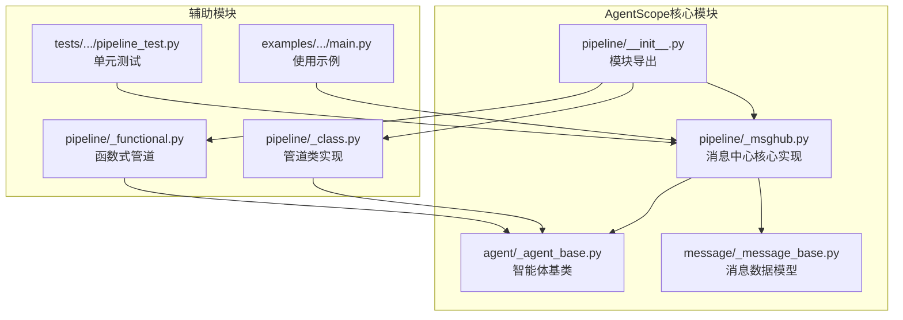
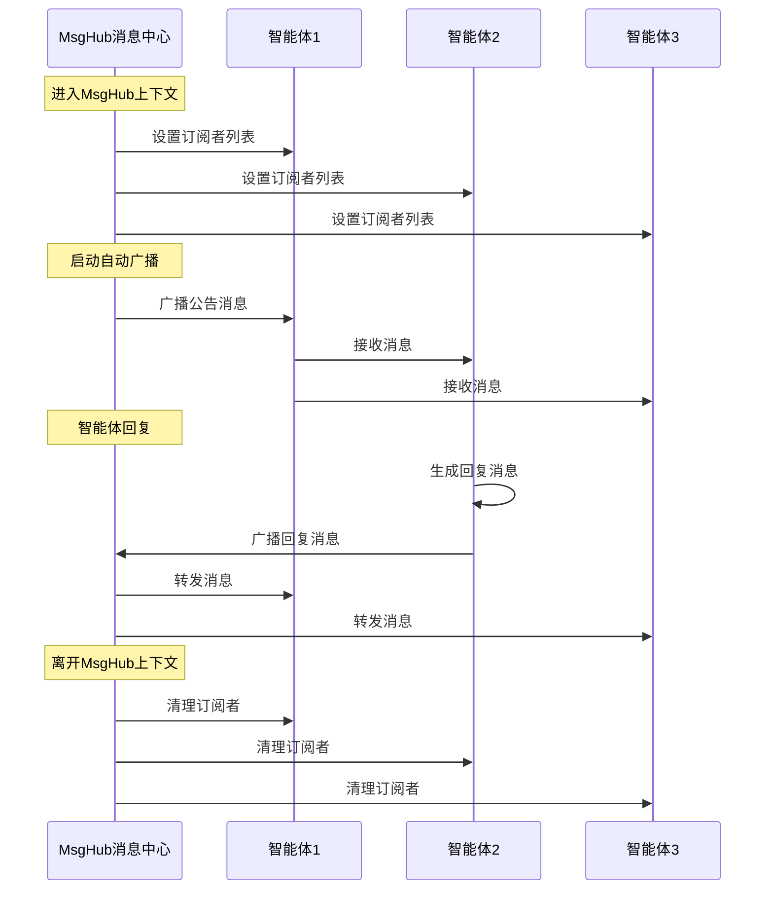
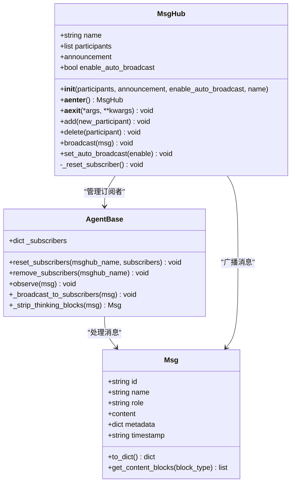
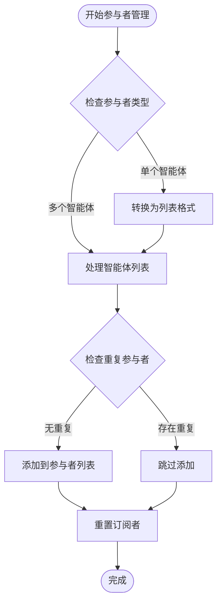
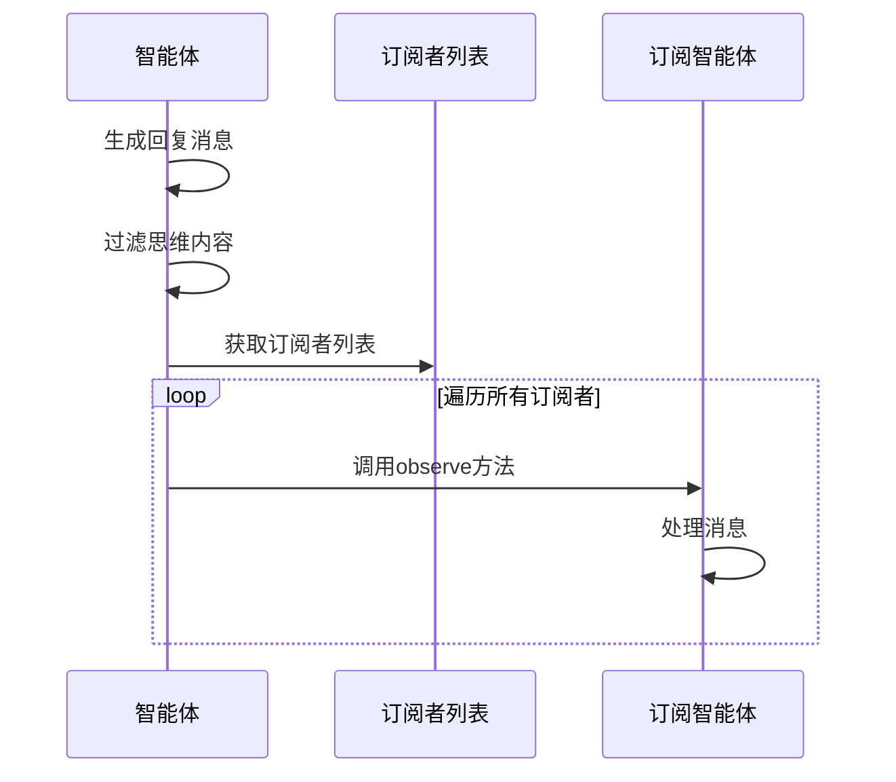
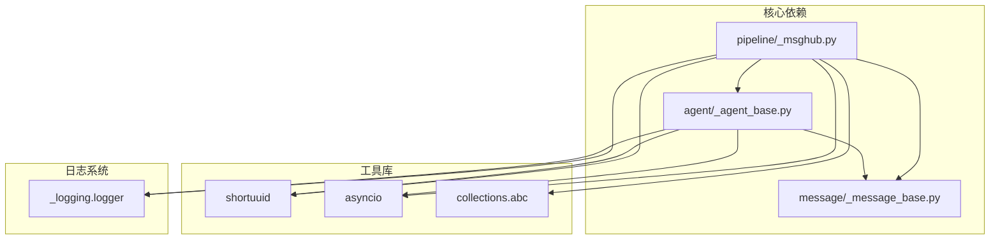

# MsgHub消息中心

<cite>
**本文档引用的文件**
- [pipeline/_msghub.py](file://src/agentscope/pipeline/_msghub.py)
- [agent/_agent_base.py](file://src/agentscope/agent/_agent_base.py)
- [message/_message_base.py](file://src/agentscope/message/_message_base.py)
- [pipeline/__init__.py](file://src/agentscope/pipeline/__init__.py)
- [pipeline/_class.py](file://src/agentscope/pipeline/_class.py)
- [pipeline/_functional.py](file://src/agentscope/pipeline/_functional.py)
- [examples/workflows/multiagent_conversation/main.py](file://examples/workflows/multiagent_conversation/main.py)
- [docs/tutorial/zh_CN/src/task_pipeline.py](file://docs/tutorial/zh_CN/src/task_pipeline.py)
- [tests/pipeline_test.py](file://tests/pipeline_test.py)
</cite>

## 目录
1. [简介](#简介)
2. [项目结构](#项目结构)
3. [核心组件](#核心组件)
4. [架构概览](#架构概览)
5. [详细组件分析](#详细组件分析)
6. [依赖关系分析](#依赖关系分析)
7. [性能考虑](#性能考虑)
8. [故障排除指南](#故障排除指南)
9. [结论](#结论)
10. [附录](#附录)

## 简介

AgentScope的MsgHub消息中心是一个专为多智能体系统设计的消息管理和通信枢纽。它提供了一个优雅的解决方案，用于在多个智能体之间进行消息广播、路由和管理，支持动态参与者管理、自动广播机制和灵活的消息分发策略。

MsgHub的核心设计理念是简化多智能体之间的通信复杂度，通过自动化的消息传播机制，让开发者能够专注于业务逻辑而非通信细节。它支持多种消息分发模式，包括广播、定向发送和组播处理，并提供了完善的参与者生命周期管理功能。

## 项目结构

AgentScope的MsgHub消息中心位于pipeline模块中，与AgentBase智能体基类和Msg消息类紧密集成。整个架构采用模块化设计，确保了高内聚低耦合的代码组织。



**图表来源**
- [pipeline/_msghub.py:1-157](file://src/agentscope/pipeline/_msghub.py#L1-L157)
- [agent/_agent_base.py:1-775](file://src/agentscope/agent/_agent_base.py#L1-L775)
- [message/_message_base.py:1-242](file://src/agentscope/message/_message_base.py#L1-L242)

**章节来源**
- [pipeline/_msghub.py:1-157](file://src/agentscope/pipeline/_msghub.py#L1-L157)
- [pipeline/__init__.py:1-22](file://src/agentscope/pipeline/__init__.py#L1-L22)

## 核心组件

### MsgHub主类

MsgHub是消息中心的核心控制器，负责管理智能体参与者和消息分发。它实现了异步上下文管理器协议，提供了简洁的API接口。

**主要特性：**
- 异步上下文管理器支持
- 自动广播机制
- 动态参与者管理
- 消息分发策略
- 生命周期管理

### AgentBase智能体基类

智能体基类提供了消息接收、回复生成和订阅管理的核心功能。每个智能体都维护着自己的订阅者列表，用于接收来自MsgHub的消息。

**关键功能：**
- 订阅者管理系统
- 消息广播机制
- 思维内容过滤
- 钩子函数支持

### Msg消息类

消息类定义了多智能体通信的数据结构，支持文本、工具调用、图像、音频等多种内容块类型。

**消息属性：**
- 唯一标识符
- 发送者名称
- 角色分类
- 内容块集合
- 元数据信息
- 时间戳记录

**章节来源**
- [pipeline/_msghub.py:14-157](file://src/agentscope/pipeline/_msghub.py#L14-L157)
- [agent/_agent_base.py:30-775](file://src/agentscope/agent/_agent_base.py#L30-L775)
- [message/_message_base.py:21-242](file://src/agentscope/message/_message_base.py#L21-L242)

## 架构概览

MsgHub消息中心采用事件驱动的架构模式，通过智能体间的订阅-发布机制实现高效的消息传播。



**图表来源**
- [pipeline/_msghub.py:73-87](file://src/agentscope/pipeline/_msghub.py#L73-L87)
- [agent/_agent_base.py:469-486](file://src/agentscope/agent/_agent_base.py#L469-L486)

### 消息分发策略

MsgHub实现了多种消息分发策略，满足不同的应用场景需求：

**1. 自动广播机制**
- 智能体回复时自动广播
- 思维内容自动过滤
- 实时消息传播

**2. 手动广播模式**
- 显式调用广播方法
- 灵活的消息控制
- 批量消息处理

**3. 动态参与者管理**
- 实时添加新参与者
- 动态移除参与者
- 参与者状态变更处理

**章节来源**
- [pipeline/_msghub.py:130-156](file://src/agentscope/pipeline/_msghub.py#L130-L156)
- [agent/_agent_base.py:701-730](file://src/agentscope/agent/_agent_base.py#L701-L730)

## 详细组件分析

### MsgHub类详细分析

MsgHub类是消息中心的核心实现，提供了完整的多智能体通信管理功能。



**图表来源**
- [pipeline/_msghub.py:14-157](file://src/agentscope/pipeline/_msghub.py#L14-L157)
- [agent/_agent_base.py:30-775](file://src/agentscope/agent/_agent_base.py#L30-L775)
- [message/_message_base.py:21-242](file://src/agentscope/message/_message_base.py#L21-L242)

#### 初始化过程分析

MsgHub的初始化过程涉及多个关键步骤：

1. **参数验证和配置**
   - 验证参与者序列的有效性
   - 设置自动广播标志
   - 生成唯一的消息中心名称

2. **订阅者重置**
   - 为每个参与者设置订阅者列表
   - 排除自身以避免循环广播
   - 建立双向通信通道

3. **公告消息处理**
   - 检查是否存在公告消息
   - 自动广播给所有参与者
   - 支持批量消息处理

**章节来源**
- [pipeline/_msghub.py:42-81](file://src/agentscope/pipeline/_msghub.py#L42-L81)

#### 参与者动态管理

MsgHub提供了灵活的参与者管理功能，支持运行时的动态调整。



**图表来源**
- [pipeline/_msghub.py:95-128](file://src/agentscope/pipeline/_msghub.py#L95-L128)

**章节来源**
- [pipeline/_msghub.py:95-128](file://src/agentscope/pipeline/_msghub.py#L95-L128)

### AgentBase智能体基类分析

智能体基类为所有智能体实现提供了统一的接口和基础设施。

#### 订阅者管理系统

智能体维护着复杂的订阅者关系网络，这是实现消息广播的关键机制。

**订阅者存储结构：**
- 键：消息中心名称
- 值：订阅该消息中心的智能体列表
- 支持多消息中心并存

**订阅者重置流程：**
1. 清空现有订阅者映射
2. 为每个消息中心建立新的订阅者列表
3. 排除当前智能体自身
4. 确保订阅者列表的完整性

#### 消息广播机制

智能体的广播机制实现了高效的多对多消息传播。



**图表来源**
- [agent/_agent_base.py:469-486](file://src/agentscope/agent/_agent_base.py#L469-L486)

**章节来源**
- [agent/_agent_base.py:701-730](file://src/agentscope/agent/_agent_base.py#L701-L730)
- [agent/_agent_base.py:469-514](file://src/agentscope/agent/_agent_base.py#L469-L514)

### Msg消息类分析

消息类定义了多智能体通信的标准数据格式，支持丰富的多媒体内容。

#### 内容块系统

消息的内容采用块状结构设计，支持多种媒体类型的组合。

**支持的内容类型：**
- 文本块：纯文本内容
- 工具使用块：工具调用描述
- 工具结果块：工具执行结果
- 图像块：图片数据
- 音频块：音频数据
- 视频块：视频数据

**内容块处理流程：**
1. **内容类型验证**
   - 确保内容符合预期格式
   - 支持字符串和块列表两种形式

2. **块提取和过滤**
   - 按类型提取特定内容块
   - 支持多类型内容的组合提取

3. **文本内容聚合**
   - 将多个文本块合并为单一字符串
   - 支持自定义分隔符

**章节来源**
- [message/_message_base.py:149-229](file://src/agentscope/message/_message_base.py#L149-L229)

## 依赖关系分析

MsgHub消息中心的依赖关系相对简单且清晰，体现了良好的模块化设计原则。



**图表来源**
- [pipeline/_msghub.py:4-11](file://src/agentscope/pipeline/_msghub.py#L4-L11)
- [agent/_agent_base.py:3-27](file://src/agentscope/agent/_agent_base.py#L3-L27)

### 外部依赖分析

MsgHub的外部依赖非常有限，主要包含：

**必需依赖：**
- `shortuuid`：生成唯一标识符
- `asyncio`：异步编程支持
- `collections.abc`：序列类型检查

**可选依赖：**
- `_logging`：日志记录功能
- `typing`：类型提示支持

### 内部模块依赖

MsgHub与AgentScope框架的其他模块形成了紧密的集成关系：

**向上依赖：**
- AgentBase智能体基类
- Msg消息数据模型
- 日志系统模块

**向下依赖：**
- 无直接向下依赖
- 通过智能体接口间接影响

**章节来源**
- [pipeline/_msghub.py:1-12](file://src/agentscope/pipeline/_msghub.py#L1-L12)
- [agent/_agent_base.py:1-27](file://src/agentscope/agent/_agent_base.py#L1-L27)

## 性能考虑

MsgHub消息中心在设计时充分考虑了性能优化和扩展性要求。

### 异步消息处理

MsgHub采用完全异步的消息处理机制，避免了阻塞操作对整体性能的影响。

**异步优势：**
- 非阻塞消息广播
- 并发消息处理
- 事件循环集成
- 资源高效利用

### 内存管理优化

智能体的订阅者管理采用了内存友好的设计：

**内存优化策略：**
- 按需分配订阅者列表
- 及时清理无效订阅关系
- 避免内存泄漏
- 支持大规模智能体集群

### 消息过滤机制

为了提高传输效率，MsgHub实现了智能的消息过滤机制：

**过滤规则：**
- 自动移除思维内容块
- 支持批量消息处理
- 减少不必要的数据传输
- 保护内部推理信息

## 故障排除指南

### 常见问题诊断

**问题1：消息未正确广播**
- 检查MsgHub上下文是否正确激活
- 验证智能体的订阅者设置
- 确认自动广播功能已启用

**问题2：参与者无法接收消息**
- 检查参与者ID的唯一性
- 验证订阅者列表的完整性
- 确认智能体的observe方法实现

**问题3：性能问题**
- 监控消息队列长度
- 检查异步任务的执行状态
- 分析CPU和内存使用情况

### 调试技巧

**调试方法：**
1. 启用详细日志记录
2. 使用单元测试验证功能
3. 监控消息传播路径
4. 分析异常堆栈信息

**章节来源**
- [pipeline/_msghub.py:121-125](file://src/agentscope/pipeline/_msghub.py#L121-L125)
- [agent/_agent_base.py:724-730](file://src/agentscope/agent/_agent_base.py#L724-L730)

## 结论

AgentScope的MsgHub消息中心为多智能体系统提供了一个强大而灵活的通信基础设施。通过自动化的消息广播机制、动态的参与者管理和高效的异步处理能力，MsgHub显著降低了多智能体应用的开发复杂度。

**主要优势：**
- 简洁的API设计，易于使用
- 完善的生命周期管理
- 灵活的消息分发策略
- 良好的性能表现
- 强大的扩展能力

**适用场景：**
- 多智能体对话系统
- 协作式AI应用
- 实时通信平台
- 智能体编排工作流

MsgHub的设计充分体现了现代异步编程的最佳实践，为构建复杂的多智能体应用奠定了坚实的基础。

## 附录

### 使用示例

#### 基础对话管理

```python
# 创建智能体实例
alice = ReActAgent(name="Alice", ...)
bob = ReActAgent(name="Bob", ...)
charlie = ReActAgent(name="Charlie", ...)

# 启动消息中心
async with MsgHub(
    participants=[alice, bob, charlie],
    announcement=Msg("system", "大家好，请自我介绍", "system")
) as hub:
    # 自动消息传播的对话
    await alice()
    await bob()
    await charlie()
```

#### 动态参与者管理

```python
# 创建初始消息中心
async with MsgHub(participants=[alice, bob]) as hub:
    # 添加新参与者
    hub.add(charlie)
    
    # 移除参与者
    hub.delete(bob)
    
    # 手动广播消息
    await hub.broadcast(Msg("system", "会议继续", "system"))
```

#### 高级配置选项

```python
# 禁用自动广播，仅使用手动广播
async with MsgHub(
    participants=[alice, bob, charlie],
    enable_auto_broadcast=False
) as hub:
    # 手动控制消息传播
    await alice()
    await hub.broadcast(Msg("system", "Alice的回复", "system"))
    await hub.broadcast(Msg("system", "Alice的回复", "system"))
```

### 最佳实践建议

**性能优化：**
- 合理控制参与者数量
- 使用批量消息处理
- 监控内存使用情况
- 实施适当的超时机制

**安全性考虑：**
- 验证消息内容的合法性
- 实施访问控制机制
- 保护敏感信息传输
- 监控异常行为模式

**可扩展性设计：**
- 支持动态参与者管理
- 实现消息持久化机制
- 提供审计和追踪功能
- 设计故障恢复策略