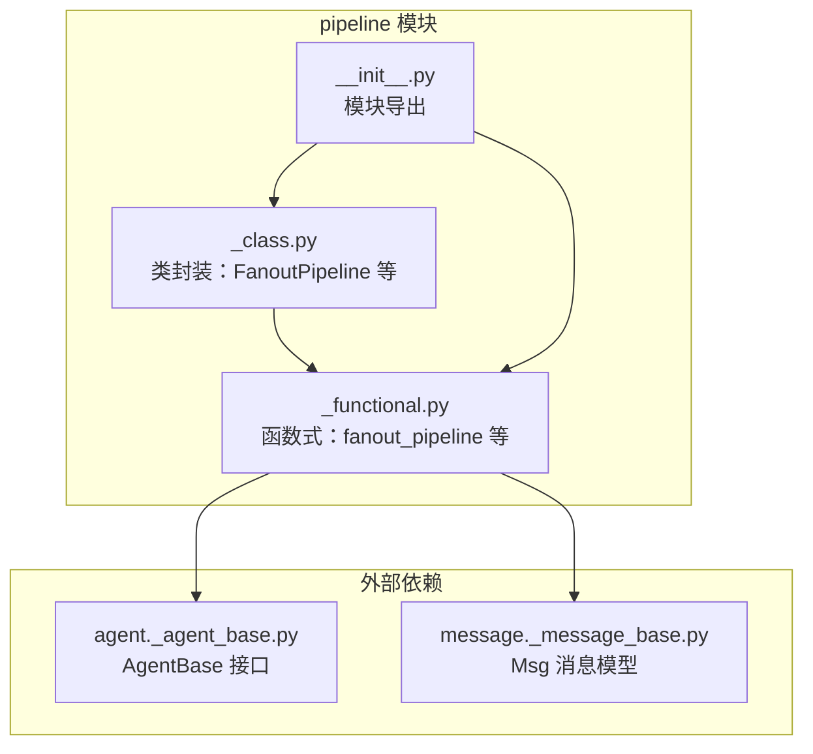
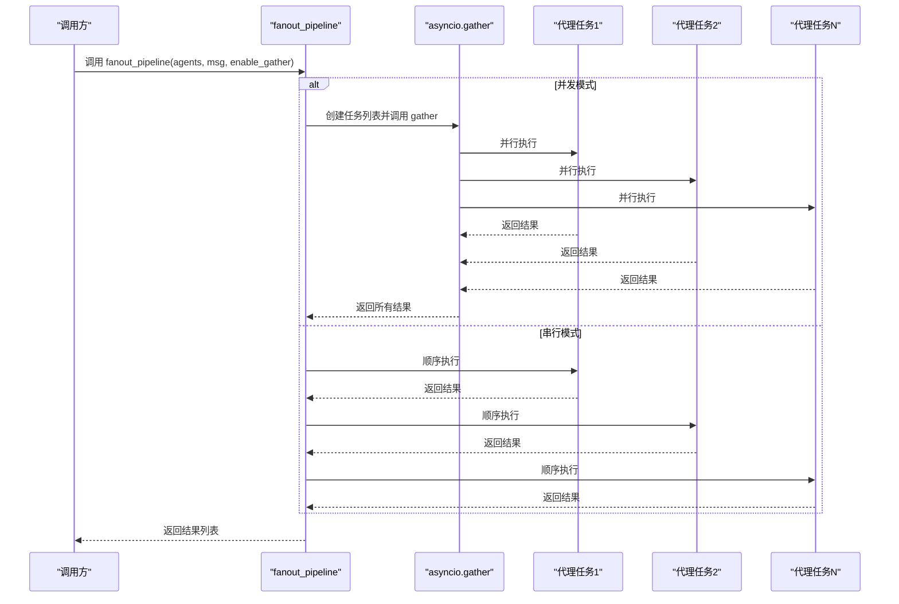
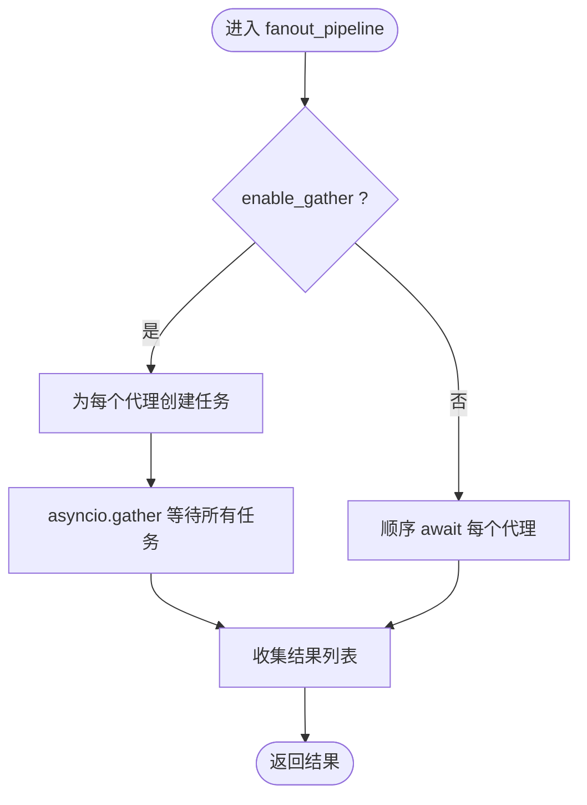
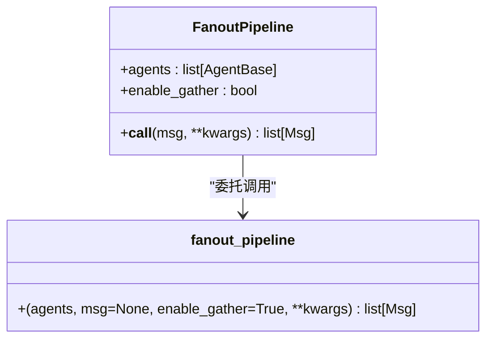
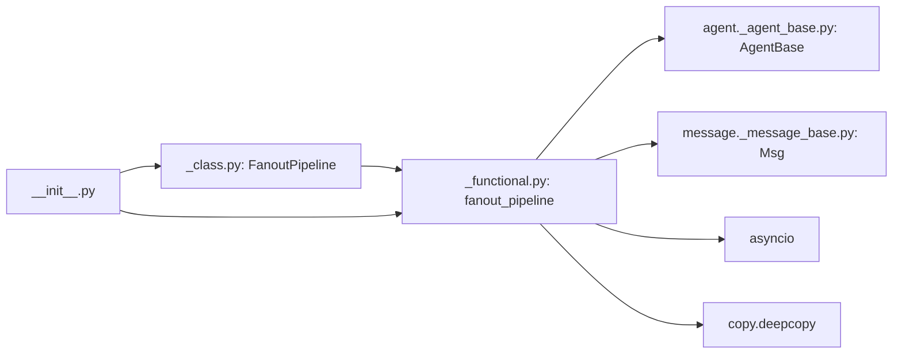

# 并行流水线

<cite>
**本文引用的文件列表**
- [fanout_pipeline 实现（函数式）](file://src/agentscope/pipeline/_functional.py)
- [FanoutPipeline 类实现](file://src/agentscope/pipeline/_class.py)
- [管道模块导出入口](file://src/agentscope/pipeline/__init__.py)
- [并行流水线单元测试](file://tests/pipeline_test.py)
- [并发多视角讨论示例](file://examples/workflows/multiagent_concurrent/main.py)
- [并发智能体教程示例](file://docs/tutorial/zh_CN/src/workflow_concurrent_agents.py)
- [AgentBase 基类定义](file://src/agentscope/agent/_agent_base.py)
- [消息 Msg 类定义](file://src/agentscope/message/_message_base.py)
</cite>

## 目录
1. [简介](#简介)
2. [项目结构与定位](#项目结构与定位)
3. [核心组件](#核心组件)
4. [架构总览](#架构总览)
5. [详细组件分析](#详细组件分析)
6. [依赖关系分析](#依赖关系分析)
7. [性能与并发特性](#性能与并发特性)
8. [最佳实践与使用指南](#最佳实践与使用指南)
9. [故障排查](#故障排查)
10. [结论](#结论)
11. [附录：使用示例路径](#附录使用示例路径)

## 简介
本文件系统性介绍 AgentScope 的并行流水线能力，重点围绕 fanout_pipeline 函数及其类封装 FanoutPipeline 的设计与实现，涵盖：
- 并发执行机制与资源管理
- 结果收集与异常传播
- enable_gather 参数的作用与并发/串行差异
- asyncio.gather() 的使用方式（任务创建、异常处理、超时控制）
- 深度复制机制与消息隔离
- 最佳实践（负载均衡、资源限制、性能监控）
- 典型使用场景与示例路径

## 项目结构与定位
并行流水线位于 pipeline 子模块中，提供函数式与类两种调用形态，并通过模块导出统一对外暴露。

图表来源
- [管道模块导出入口:1-23](file://src/agentscope/pipeline/__init__.py#L1-L23)
- [FanoutPipeline 类实现:1-91](file://src/agentscope/pipeline/_class.py#L1-L91)
- [fanout_pipeline 实现（函数式）:1-193](file://src/agentscope/pipeline/_functional.py#L1-L193)

章节来源
- [管道模块导出入口:1-23](file://src/agentscope/pipeline/__init__.py#L1-L23)

## 核心组件
- fanout_pipeline（函数式）：将同一输入分发给多个代理，支持并发或串行执行，返回各代理输出列表。
- FanoutPipeline（类封装）：可复用的并行流水线对象，支持配置 enable_gather。
- AgentBase：代理基类，提供异步 reply/observe 等接口。
- Msg：消息载体，包含内容、角色、元数据等字段。

章节来源
- [fanout_pipeline 实现（函数式）:47-104](file://src/agentscope/pipeline/_functional.py#L47-L104)
- [FanoutPipeline 类实现:43-90](file://src/agentscope/pipeline/_class.py#L43-L90)
- [AgentBase 基类定义:30-200](file://src/agentscope/agent/_agent_base.py#L30-L200)
- [消息 Msg 类定义:21-100](file://src/agentscope/message/_message_base.py#L21-L100)

## 架构总览
并行流水线的核心流程如下：
- 输入消息（或 None）经深度复制后分发给每个代理
- 若启用并发（enable_gather=True），使用 asyncio.gather 并行等待所有任务完成
- 若禁用并发（enable_gather=False），按顺序依次执行
- 收集各代理输出，返回列表

图表来源
- [fanout_pipeline 实现（函数式）:96-104](file://src/agentscope/pipeline/_functional.py#L96-L104)

## 详细组件分析

### fanout_pipeline 设计与实现
- 输入参数
  - agents：代理列表
  - msg：消息或 None
  - enable_gather：是否并发执行
  - **kwargs：传递给每个代理的额外关键字参数
- 并发执行
  - 使用 asyncio.create_task 为每个代理创建任务
  - 使用 asyncio.gather 合并等待，统一收集结果
- 串行执行
  - 使用列表推导式顺序 await 每个代理
- 深度复制
  - 对 msg 进行深拷贝，确保各代理独立修改不互相影响
- 异常传播
  - gather 默认会在任一任务抛错时取消其他任务并传播异常；串行模式下异常会阻断后续执行

图表来源
- [fanout_pipeline 实现（函数式）:96-104](file://src/agentscope/pipeline/_functional.py#L96-L104)

章节来源
- [fanout_pipeline 实现（函数式）:47-104](file://src/agentscope/pipeline/_functional.py#L47-L104)

### FanoutPipeline 类封装
- 初始化
  - 接收 agents 与 enable_gather
- 调用
  - 将调用委托给 fanout_pipeline，保持一致行为
- 复用性
  - 可多次调用，适合固定拓扑的并行流水线

图表来源
- [FanoutPipeline 类实现:43-90](file://src/agentscope/pipeline/_class.py#L43-L90)
- [fanout_pipeline 实现（函数式）:47-104](file://src/agentscope/pipeline/_functional.py#L47-L104)

章节来源
- [FanoutPipeline 类实现:43-90](file://src/agentscope/pipeline/_class.py#L43-L90)

### 深度复制与消息隔离
- 每次执行前对 msg 进行深拷贝，避免不同代理之间共享可变状态
- 测试覆盖了并发与串行模式下，各代理对原始输入的独立修改不会相互影响

章节来源
- [fanout_pipeline 实现（函数式）:96-104](file://src/agentscope/pipeline/_functional.py#L96-L104)
- [并行流水线单元测试:267-311](file://tests/pipeline_test.py#L267-L311)

### 并发 vs 串行差异
- 性能
  - 并发模式下，多个代理同时执行，整体吞吐更高
  - 串行模式下，按顺序执行，资源占用更稳定
- 异常处理
  - 并发模式下，任一任务异常会触发 gather 取消其他任务并传播异常
  - 串行模式下，异常会阻断后续代理执行
- 资源竞争
  - 并发模式可能引发资源争用，需配合资源限制与监控
  - 串行模式天然避免资源竞争

章节来源
- [并行流水线单元测试:267-311](file://tests/pipeline_test.py#L267-L311)

### asyncio.gather() 的使用要点
- 任务创建
  - 使用 asyncio.create_task 包装每个代理的协程
- 异常处理
  - gather 会在任一任务异常时取消其他任务并抛出异常
  - 如需捕获单个任务异常，应在任务内部自行 try/except 或使用自定义策略
- 超时控制
  - 可结合 asyncio.wait_for 对整体 gather 设置超时
  - 注意：超时会取消未完成任务，需要在上层处理取消异常

章节来源
- [fanout_pipeline 实现（函数式）:96-104](file://src/agentscope/pipeline/_functional.py#L96-L104)

## 依赖关系分析
- fanout_pipeline 依赖
  - AgentBase：代理接口
  - Msg：消息模型
  - asyncio：并发执行
  - copy.deepcopy：消息隔离
- 导出关系
  - 模块通过 __all__ 暴露 FanoutPipeline、fanout_pipeline、stream_printing_messages 等

图表来源
- [fanout_pipeline 实现（函数式）:1-193](file://src/agentscope/pipeline/_functional.py#L1-L193)
- [FanoutPipeline 类实现:1-91](file://src/agentscope/pipeline/_class.py#L1-L91)
- [管道模块导出入口:1-23](file://src/agentscope/pipeline/__init__.py#L1-L23)

章节来源
- [管道模块导出入口:1-23](file://src/agentscope/pipeline/__init__.py#L1-L23)

## 性能与并发特性
- 并发优势
  - 提升吞吐量，缩短端到端时延
  - 适合 I/O 密集型代理（如网络请求、文件读写）
- 风险与注意事项
  - 资源争用：数据库连接、GPU/CPU 资源、网络带宽
  - 异常放大：任一代理失败可能影响整体
  - 内存峰值：并发任务同时持有深拷贝消息
- 监控建议
  - 记录每个代理的耗时、错误率
  - 观察队列长度与任务堆积情况
  - 在关键节点打点统计

[本节为通用性能指导，无需特定文件引用]

## 最佳实践与使用指南
- 负载均衡
  - 将相似复杂度的代理均匀分布，避免热点代理拖慢整体
  - 对 I/O 密集代理优先采用并发
- 资源限制
  - 控制并发度上限，避免资源过载
  - 对共享资源（如限流接口）加锁或令牌桶
- 结果聚合策略
  - 顺序聚合：适用于需要严格顺序依赖的场景
  - 并行聚合：适用于独立计算，最后汇总
- 深度复制与状态隔离
  - 确保每次执行前对输入进行深拷贝，防止代理间状态污染
- 异常处理
  - 并发模式下建议在代理内部捕获异常并返回安全结果
  - 上层对 gather 异常进行分类处理（如重试、降级）
- 超时与可观测性
  - 为关键代理设置超时
  - 记录关键指标（QPS、P95/P99、错误码分布）

[本节为通用指导，无需特定文件引用]

## 故障排查
- 并发异常导致整体失败
  - 现象：任一代理报错，其他代理被取消
  - 处理：在代理内部 try/except 并返回兜底消息；或在上层对 gather 异常进行捕获与恢复
- 消息污染/状态共享
  - 现象：多个代理修改同一对象导致结果异常
  - 处理：确认已对输入进行深拷贝；检查代理内部是否持有全局可变状态
- 资源耗尽
  - 现象：内存飙升、CPU 占满、连接池耗尽
  - 处理：降低并发度、增加资源配额、引入限流与熔断
- 串行模式性能瓶颈
  - 现象：代理串行导致整体延迟高
  - 处理：评估是否可并行化；优化慢代理逻辑

章节来源
- [并行流水线单元测试:267-311](file://tests/pipeline_test.py#L267-L311)
- [fanout_pipeline 实现（函数式）:96-104](file://src/agentscope/pipeline/_functional.py#L96-L104)

## 结论
AgentScope 的并行流水线通过 fanout_pipeline 与 FanoutPipeline 提供了简洁而强大的并发执行能力。其核心在于：
- 明确的并发/串行切换（enable_gather）
- 深度复制保障消息隔离
- asyncio.gather 统一的结果收集与异常传播
配合合理的资源限制与监控策略，可在多代理场景中显著提升吞吐与响应速度。

[本节为总结，无需特定文件引用]

## 附录：使用示例路径
- 并发多视角讨论示例（含 asyncio.gather 与 fanout_pipeline 对比）
  - [并发多视角讨论示例:67-93](file://examples/workflows/multiagent_concurrent/main.py#L67-L93)
- 并发智能体教程示例（基础并发）
  - [并发智能体教程示例:34-42](file://docs/tutorial/zh_CN/src/workflow_concurrent_agents.py#L34-L42)
- 单元测试（覆盖并发/串行、空代理列表、None 输入等）
  - [并行流水线单元测试:267-377](file://tests/pipeline_test.py#L267-L377)

章节来源
- [并发多视角讨论示例:67-93](file://examples/workflows/multiagent_concurrent/main.py#L67-L93)
- [并发智能体教程示例:34-42](file://docs/tutorial/zh_CN/src/workflow_concurrent_agents.py#L34-L42)
- [并行流水线单元测试:267-377](file://tests/pipeline_test.py#L267-L377)