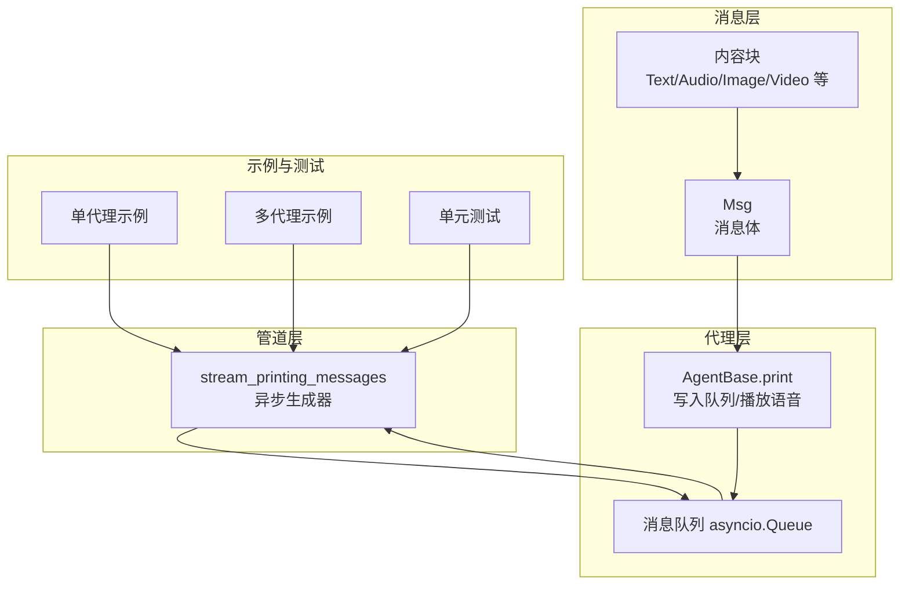
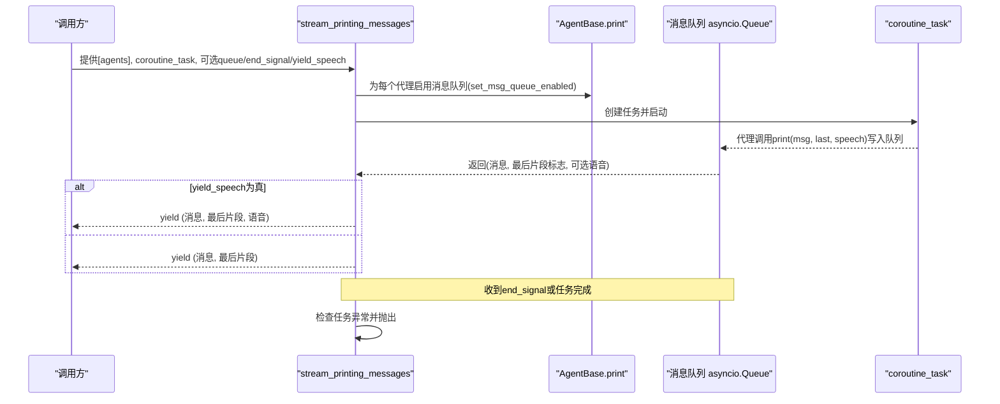
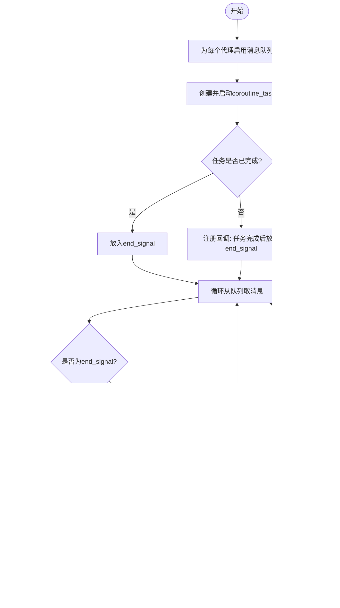
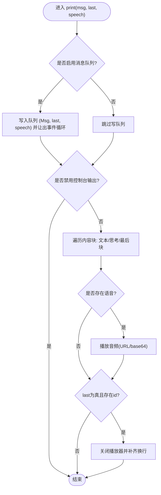
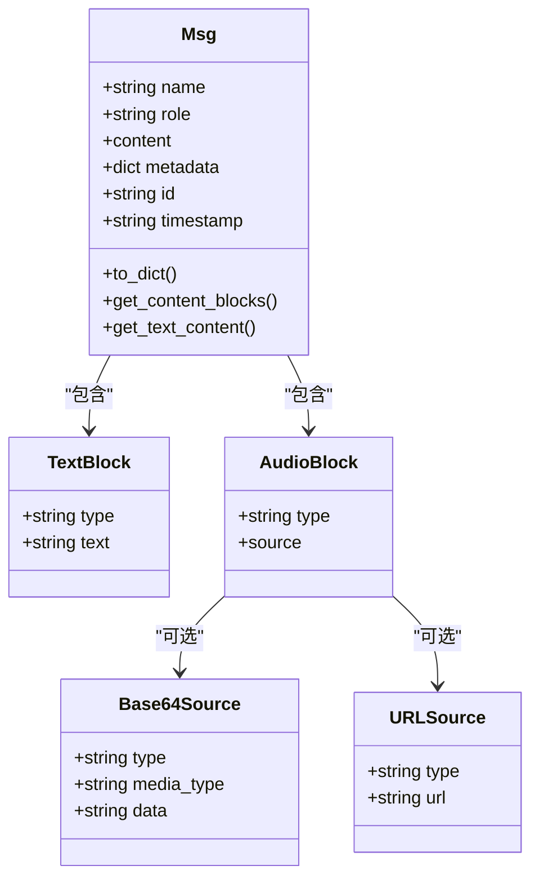
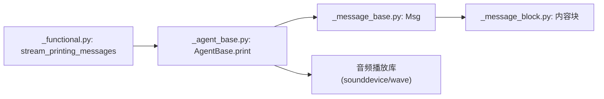

# 流式消息处理

<cite>
**本文引用的文件**
- [src/agentscope/pipeline/_functional.py](file://src/agentscope/pipeline/_functional.py)
- [src/agentscope/agent/_agent_base.py](file://src/agentscope/agent/_agent_base.py)
- [src/agentscope/message/_message_base.py](file://src/agentscope/message/_message_base.py)
- [src/agentscope/message/_message_block.py](file://src/agentscope/message/_message_block.py)
- [examples/functionality/stream_printing_messages/single_agent.py](file://examples/functionality/stream_printing_messages/single_agent.py)
- [examples/functionality/stream_printing_messages/multi_agent.py](file://examples/functionality/stream_printing_messages/multi_agent.py)
- [tests/pipeline_test.py](file://tests/pipeline_test.py)
- [src/agentscope/pipeline/_msghub.py](file://src/agentscope/pipeline/_msghub.py)
</cite>

## 目录
1. [简介](#简介)
2. [项目结构](#项目结构)
3. [核心组件](#核心组件)
4. [架构总览](#架构总览)
5. [详细组件分析](#详细组件分析)
6. [依赖分析](#依赖分析)
7. [性能考虑](#性能考虑)
8. [故障排查指南](#故障排查指南)
9. [结论](#结论)
10. [附录：使用示例与最佳实践](#附录使用示例与最佳实践)

## 简介
本文件围绕 AgentScope 的流式消息处理能力，系统性解析 stream_printing_messages 函数的实现原理与使用方法，重点覆盖以下主题：
- 消息队列机制与异步生成器的协作
- 流式输出控制与“最后片段”标记
- 代理消息捕获、队列管理与信号处理
- end_signal 结束机制与异常传播
- yield_speech 参数的用法与语音消息处理
- 多模态消息（文本、音频、图像等）在流中的聚合与展示
- 实时聊天、多模态消息处理与异常处理的完整示例
- 性能优化建议与调试技巧

## 项目结构
与流式消息处理直接相关的代码主要分布在如下模块：
- pipeline 层：提供 stream_printing_messages 异步生成器，负责从代理打印的消息中汇聚并逐片产出
- agent 层：提供 AgentBase.print 接口，将消息写入内部队列，并可选播放语音
- message 层：定义 Msg 与各类内容块（文本、音频、图像、视频等），支撑多模态消息
- examples 与 tests：提供单代理与多代理的流式示例，以及针对 end_signal 与异常传播的测试

图表来源
- [src/agentscope/pipeline/_functional.py:107-193](file://src/agentscope/pipeline/_functional.py#L107-L193)
- [src/agentscope/agent/_agent_base.py:205-404](file://src/agentscope/agent/_agent_base.py#L205-L404)
- [src/agentscope/message/_message_base.py:21-241](file://src/agentscope/message/_message_base.py#L21-L241)
- [src/agentscope/message/_message_block.py:1-129](file://src/agentscope/message/_message_block.py#L1-L129)
- [examples/functionality/stream_printing_messages/single_agent.py:1-63](file://examples/functionality/stream_printing_messages/single_agent.py#L1-L63)
- [examples/functionality/stream_printing_messages/multi_agent.py:1-63](file://examples/functionality/stream_printing_messages/multi_agent.py#L1-L63)
- [tests/pipeline_test.py:379-439](file://tests/pipeline_test.py#L379-L439)

章节来源
- [src/agentscope/pipeline/_functional.py:107-193](file://src/agentscope/pipeline/_functional.py#L107-L193)
- [src/agentscope/agent/_agent_base.py:205-404](file://src/agentscope/agent/_agent_base.py#L205-L404)
- [src/agentscope/message/_message_base.py:21-241](file://src/agentscope/message/_message_base.py#L21-L241)
- [src/agentscope/message/_message_block.py:1-129](file://src/agentscope/message/_message_block.py#L1-L129)
- [examples/functionality/stream_printing_messages/single_agent.py:1-63](file://examples/functionality/stream_printing_messages/single_agent.py#L1-L63)
- [examples/functionality/stream_printing_messages/multi_agent.py:1-63](file://examples/functionality/stream_printing_messages/multi_agent.py#L1-L63)
- [tests/pipeline_test.py:379-439](file://tests/pipeline_test.py#L379-L439)

## 核心组件
- stream_printing_messages：接收一组代理与一个协程任务，启用统一消息队列，执行任务并在队列中逐片产出消息；遇到 end_signal 时停止；任务完成后检查异常并抛出
- AgentBase.print：将消息写入队列，格式为 (Msg, 是否最后片段, 语音块)，并可选播放语音；在非控制台输出模式下仍会写队列以便外部消费
- Msg 与内容块：支持文本、思考、工具调用、工具结果、图像、音频、视频等多模态内容块，消息具备唯一 id，用于同一流水线内消息聚合
- 语音处理：支持 URL 与 base64 两种音频源，按流式增量播放并缓存状态，直至最后片段清理资源

章节来源
- [src/agentscope/pipeline/_functional.py:107-193](file://src/agentscope/pipeline/_functional.py#L107-L193)
- [src/agentscope/agent/_agent_base.py:205-404](file://src/agentscope/agent/_agent_base.py#L205-L404)
- [src/agentscope/message/_message_base.py:21-241](file://src/agentscope/message/_message_base.py#L21-L241)
- [src/agentscope/message/_message_block.py:1-129](file://src/agentscope/message/_message_block.py#L1-L129)

## 架构总览
下面的序列图展示了从代理打印消息到外部消费端获取流式片段的完整链路。

图表来源
- [src/agentscope/pipeline/_functional.py:107-193](file://src/agentscope/pipeline/_functional.py#L107-L193)
- [src/agentscope/agent/_agent_base.py:205-228](file://src/agentscope/agent/_agent_base.py#L205-L228)

## 详细组件分析

### 组件一：stream_printing_messages 异步生成器
- 功能要点
  - 为传入的代理启用统一消息队列，确保所有代理的打印消息进入同一队列
  - 启动传入的协程任务，若任务已结束则立即放入 end_signal；否则在回调中放入 end_signal
  - 循环从队列取出消息，遇到 end_signal 则退出；否则按需返回三元组（含语音）或二元组（不含语音）
  - 任务完成后检查异常并抛出，保证异常不被吞掉
- 关键参数
  - agents：代理列表
  - coroutine_task：待执行的协程
  - queue：可选自定义队列
  - end_signal：结束信号，默认 "[END]"
  - yield_speech：是否返回语音块
- 流式语义
  - “最后片段”仅表示当前消息的某一分片是否是该消息的最后一个分片，而非整个生成器的结束
  - 具有相同 id 的消息被视为同一消息的不同分片，由 last 标志区分

图表来源
- [src/agentscope/pipeline/_functional.py:107-193](file://src/agentscope/pipeline/_functional.py#L107-L193)

章节来源
- [src/agentscope/pipeline/_functional.py:107-193](file://src/agentscope/pipeline/_functional.py#L107-L193)

### 组件二：AgentBase.print 消息捕获与语音播放
- 写队列逻辑
  - 当未禁用消息队列时，将 (deepcopy(Msg), last, speech) 写入队列
  - 写队列后主动让出事件循环，避免生产者独占 CPU
- 控制台输出
  - 若禁用控制台输出，则跳过终端打印，但仍写队列
  - 否则按内容块类型进行文本/思考/最后块的处理与打印
- 语音播放
  - 支持 URL 与 base64 两种音频源
  - 对 base64 音频采用流式增量播放，并缓存播放器与前缀数据
  - 在 last 且存在对应 id 的流中，清理播放器与换行处理

图表来源
- [src/agentscope/agent/_agent_base.py:205-404](file://src/agentscope/agent/_agent_base.py#L205-L404)

章节来源
- [src/agentscope/agent/_agent_base.py:205-404](file://src/agentscope/agent/_agent_base.py#L205-L404)

### 组件三：消息模型与多模态内容块
- Msg
  - 包含 name、role、content、metadata、timestamp、id 等字段
  - content 可为纯文本或内容块序列
  - 提供 get_content_blocks、get_text_content 等便捷方法
- 内容块
  - TextBlock、ThinkingBlock、ImageBlock、AudioBlock、VideoBlock、ToolUseBlock、ToolResultBlock
  - AudioBlock 支持 Base64Source 与 URLSource
- 作用
  - 为流式消息提供统一载体，支持文本增量与语音同步播放

图表来源
- [src/agentscope/message/_message_base.py:21-241](file://src/agentscope/message/_message_base.py#L21-L241)
- [src/agentscope/message/_message_block.py:1-129](file://src/agentscope/message/_message_block.py#L1-L129)

章节来源
- [src/agentscope/message/_message_base.py:21-241](file://src/agentscope/message/_message_base.py#L21-L241)
- [src/agentscope/message/_message_block.py:1-129](file://src/agentscope/message/_message_block.py#L1-L129)

### 组件四：end_signal 结束机制与异常传播
- 结束机制
  - 生成器在收到字符串类型的 end_signal 时停止
  - 若 coroutine_task 已完成，立即放入 end_signal
  - 否则在任务回调中放入 end_signal
- 异常传播
  - 生成器在退出前检查任务异常，若有则抛出，确保上层感知代理内部错误

章节来源
- [src/agentscope/pipeline/_functional.py:168-192](file://src/agentscope/pipeline/_functional.py#L168-L192)
- [tests/pipeline_test.py:411-439](file://tests/pipeline_test.py#L411-L439)

### 组件五：yield_speech 参数与语音消息处理
- 行为差异
  - yield_speech 为 False（默认）：生成器仅返回 (Msg, last)
  - yield_speech 为 True：生成器返回 (Msg, last, speech)，其中 speech 可为单个 AudioBlock 或其列表
- 代理侧配合
  - 调用 print(msg, last, speech) 时传入语音块，即可在流中携带语音
  - 代理内部对 URL/base64 音频进行流式播放与缓存

章节来源
- [src/agentscope/pipeline/_functional.py:144-156](file://src/agentscope/pipeline/_functional.py#L144-L156)
- [src/agentscope/agent/_agent_base.py:205-262](file://src/agentscope/agent/_agent_base.py#L205-L262)

### 组件六：消息去重与聚合（基于 id）
- 设计要点
  - 每条消息具有唯一 id
  - 具有相同 id 的消息被视为同一消息的不同分片
  - last 标志指示该分片是否为该消息的最后一个分片
- 实践意义
  - 外部消费者可按 id 聚合显示，避免重复与闪烁
  - 语音播放也按 id 进行缓存与清理

章节来源
- [src/agentscope/pipeline/_functional.py:122-129](file://src/agentscope/pipeline/_functional.py#L122-L129)
- [src/agentscope/message/_message_base.py:66](file://src/agentscope/message/_message_base.py#L66)

## 依赖分析
- 组件耦合
  - stream_printing_messages 依赖 asyncio.Queue 与 AgentBase 的消息队列接口
  - AgentBase.print 依赖 Msg 与内容块类型，同时依赖音频播放库（播放 URL/base64 音频）
- 外部依赖
  - 音频播放依赖 sounddevice、wave 等第三方库
- 潜在风险
  - 队列阻塞：若消费者处理慢，可能导致队列积压
  - 语音播放阻塞：音频播放可能占用系统资源，需谨慎并发

图表来源
- [src/agentscope/pipeline/_functional.py:107-193](file://src/agentscope/pipeline/_functional.py#L107-L193)
- [src/agentscope/agent/_agent_base.py:205-404](file://src/agentscope/agent/_agent_base.py#L205-L404)
- [src/agentscope/message/_message_base.py:21-241](file://src/agentscope/message/_message_base.py#L21-L241)
- [src/agentscope/message/_message_block.py:1-129](file://src/agentscope/message/_message_block.py#L1-L129)

章节来源
- [src/agentscope/pipeline/_functional.py:107-193](file://src/agentscope/pipeline/_functional.py#L107-L193)
- [src/agentscope/agent/_agent_base.py:205-404](file://src/agentscope/agent/_agent_base.py#L205-L404)
- [src/agentscope/message/_message_base.py:21-241](file://src/agentscope/message/_message_base.py#L21-L241)
- [src/agentscope/message/_message_block.py:1-129](file://src/agentscope/message/_message_block.py#L1-L129)

## 性能考虑
- 队列容量与背压
  - 默认队列容量为 100；可根据并发与消费速率调整
  - 建议在高并发场景下评估内存占用与延迟
- 事件循环让出
  - print 写队列后主动让出事件循环，有助于避免生产者饥饿
- 语音播放
  - base64 音频采用增量播放，注意系统音频设备与缓冲区设置
  - 多代理并发语音播放时，建议限制并发数量或合并播放
- 异常与结束
  - 使用 end_signal 与任务异常检查，确保及时释放资源与停止消费

## 故障排查指南
- 症状：生成器永不结束
  - 检查是否正确传入 coroutine_task，或是否在代理中显式放入 end_signal
  - 确认任务回调是否触发放入 end_signal
- 症状：异常被吞掉
  - 确保使用 stream_printing_messages 的返回值进行消费，不要忽略异常
- 症状：语音未播放
  - 检查 print 是否传入了 speech 参数
  - 确认音频源类型（URL/base64）与网络/编码正确
- 症状：消息重复或闪烁
  - 按消息 id 聚合显示，确保 last 标志正确传递

章节来源
- [src/agentscope/pipeline/_functional.py:168-192](file://src/agentscope/pipeline/_functional.py#L168-L192)
- [tests/pipeline_test.py:411-439](file://tests/pipeline_test.py#L411-L439)

## 结论
stream_printing_messages 通过统一消息队列与异步生成器，实现了对代理打印消息的流式采集与分发。结合 AgentBase.print 的消息捕获与语音播放能力，以及 Msg/内容块的多模态支持，能够满足实时聊天、多模态交互与异常处理等复杂场景。end_signal 与异常检查保障了流程可控与可观测性；按 id 聚合与 last 标志使前端渲染更稳定。建议在高并发与高负载场景下关注队列容量、事件循环让出与音频播放策略，以获得更佳的性能与用户体验。

## 附录：使用示例与最佳实践
- 单代理流式消息
  - 示例路径：[examples/functionality/stream_printing_messages/single_agent.py](file://examples/functionality/stream_printing_messages/single_agent.py)
  - 关键点：禁用控制台输出，使用 stream_printing_messages 获取 (Msg, last) 流
- 多代理流式消息
  - 示例路径：[examples/functionality/stream_printing_messages/multi_agent.py](file://examples/functionality/stream_printing_messages/multi_agent.py)
  - 关键点：结合 MsgHub 管理参与者顺序发言，统一消费流
- 语音消息处理
  - 在代理中调用 print(msg, last, speech) 传入 AudioBlock
  - 使用 yield_speech=True 获取 (Msg, last, speech) 三元组
- 异常与结束
  - 使用 end_signal 控制结束；任务异常会在生成器退出后抛出
  - 参考测试用例：[tests/pipeline_test.py](file://tests/pipeline_test.py)

章节来源
- [examples/functionality/stream_printing_messages/single_agent.py:1-63](file://examples/functionality/stream_printing_messages/single_agent.py#L1-L63)
- [examples/functionality/stream_printing_messages/multi_agent.py:1-63](file://examples/functionality/stream_printing_messages/multi_agent.py#L1-L63)
- [tests/pipeline_test.py:379-439](file://tests/pipeline_test.py#L379-L439)