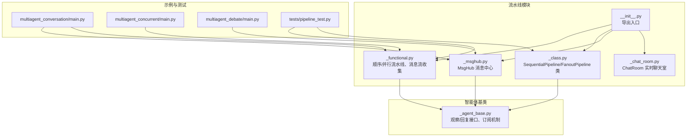
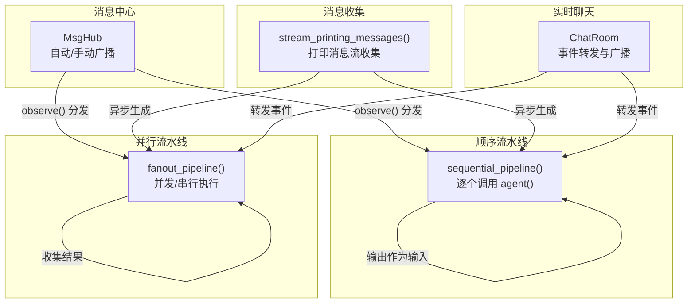
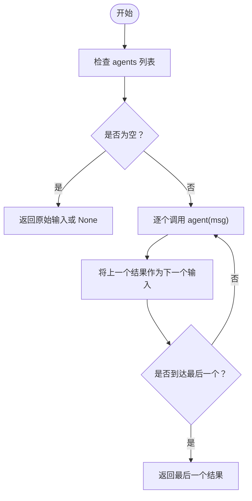
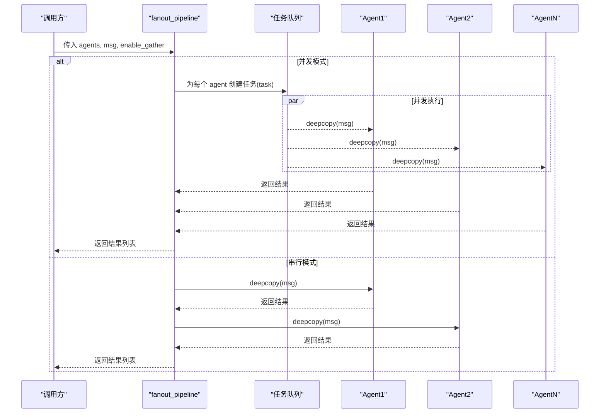
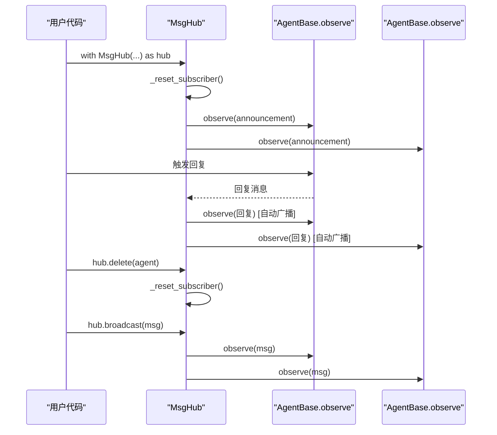
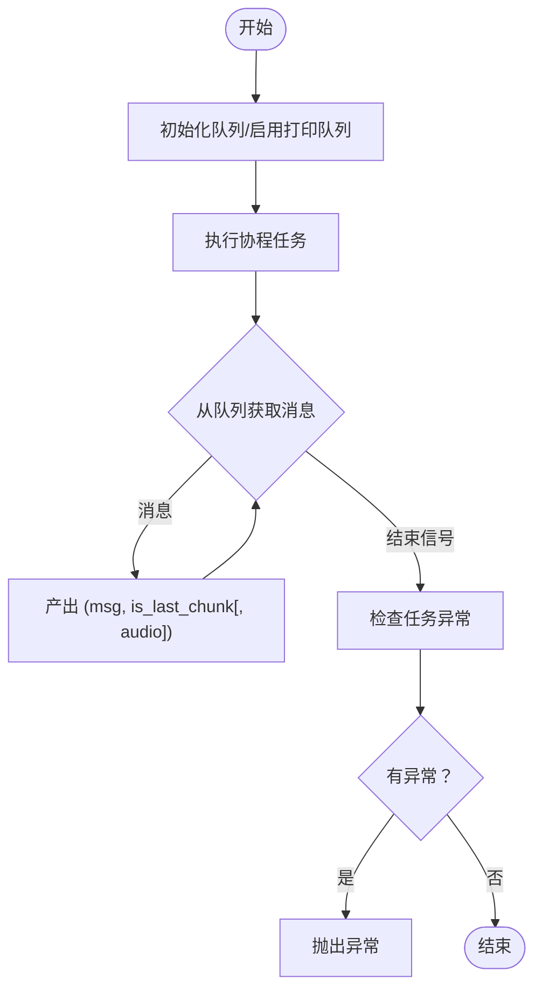
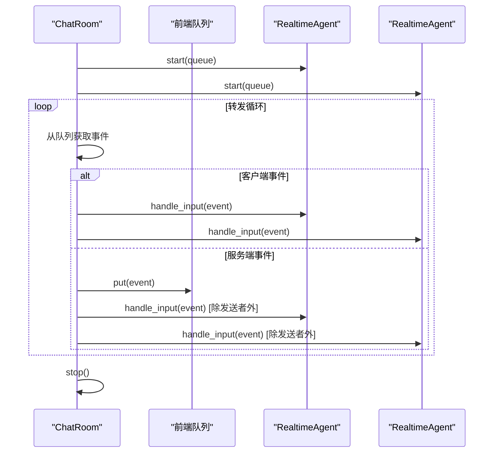
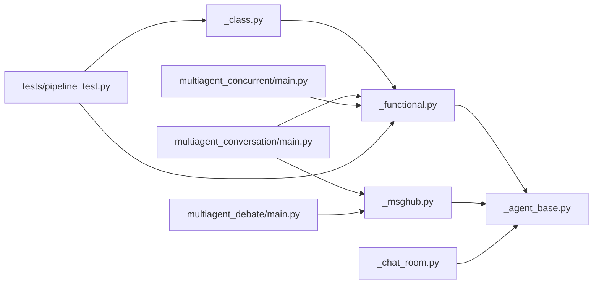

# 流水线系统

<cite>
**本文引用的文件**   
- [src/agentscope/pipeline/__init__.py](file://src/agentscope/pipeline/__init__.py)
- [src/agentscope/pipeline/_functional.py](file://src/agentscope/pipeline/_functional.py)
- [src/agentscope/pipeline/_class.py](file://src/agentscope/pipeline/_class.py)
- [src/agentscope/pipeline/_msghub.py](file://src/agentscope/pipeline/_msghub.py)
- [src/agentscope/pipeline/_chat_room.py](file://src/agentscope/pipeline/_chat_room.py)
- [src/agentscope/agent/_agent_base.py](file://src/agentscope/agent/_agent_base.py)
- [examples/workflows/multiagent_conversation/main.py](file://examples/workflows/multiagent_conversation/main.py)
- [examples/workflows/multiagent_concurrent/main.py](file://examples/workflows/multiagent_concurrent/main.py)
- [examples/workflows/multiagent_debate/main.py](file://examples/workflows/multiagent_debate/main.py)
- [tests/pipeline_test.py](file://tests/pipeline_test.py)
</cite>

## 目录
1. [简介](#简介)
2. [项目结构](#项目结构)
3. [核心组件](#核心组件)
4. [架构总览](#架构总览)
5. [详细组件分析](#详细组件分析)
6. [依赖分析](#依赖分析)
7. [性能考虑](#性能考虑)
8. [故障排查指南](#故障排查指南)
9. [结论](#结论)
10. [附录](#附录)

## 简介
本技术文档围绕 AgentScope 的流水线系统，系统性阐述顺序流水线与并行流水线的实现机制、消息中心 MsgHub 的多智能体对话管理能力、消息收集器的采集与分发策略，并给出工作流编排的高级用法（条件分支、循环控制、异常处理）与性能优化建议。文档同时提供 API 参考与调试指南，帮助开发者快速上手并构建复杂的多智能体协作流程。

## 项目结构
流水线系统位于 agentscope/pipeline 模块，核心文件包括：
- 功能函数：顺序/并行流水线、消息流收集
- 类封装：顺序/并行流水线类
- 消息中心：MsgHub 多智能体广播与订阅
- 聊天室：实时语音聊天室抽象
- 示例与测试：覆盖典型场景与边界行为

**图表来源**
- [src/agentscope/pipeline/__init__.py:1-23](file://src/agentscope/pipeline/__init__.py#L1-L23)
- [src/agentscope/pipeline/_functional.py:1-193](file://src/agentscope/pipeline/_functional.py#L1-L193)
- [src/agentscope/pipeline/_class.py:1-91](file://src/agentscope/pipeline/_class.py#L1-L91)
- [src/agentscope/pipeline/_msghub.py:1-157](file://src/agentscope/pipeline/_msghub.py#L1-L157)
- [src/agentscope/pipeline/_chat_room.py:1-98](file://src/agentscope/pipeline/_chat_room.py#L1-L98)
- [src/agentscope/agent/_agent_base.py:1-200](file://src/agentscope/agent/_agent_base.py#L1-L200)
- [examples/workflows/multiagent_conversation/main.py:1-81](file://examples/workflows/multiagent_conversation/main.py#L1-L81)
- [examples/workflows/multiagent_concurrent/main.py:1-94](file://examples/workflows/multiagent_concurrent/main.py#L1-L94)
- [examples/workflows/multiagent_debate/main.py:1-131](file://examples/workflows/multiagent_debate/main.py#L1-L131)
- [tests/pipeline_test.py:1-200](file://tests/pipeline_test.py#L1-L200)

**章节来源**
- [src/agentscope/pipeline/__init__.py:1-23](file://src/agentscope/pipeline/__init__.py#L1-L23)

## 核心组件
- 顺序流水线：按序执行多个智能体，前一智能体输出作为下一智能体输入，最终返回最后一个智能体的结果。
- 并行流水线：将相同输入分发给多个智能体，支持并发（gather）或串行执行，返回各智能体结果列表。
- 消息中心 MsgHub：为一组智能体建立订阅关系，支持自动广播与手动广播，动态增删参与者。
- 消息收集器 stream_printing_messages：捕获智能体打印的消息流，按块产出，支持可选语音附件。
- 聊天室 ChatRoom：面向实时语音的多智能体广播与事件转发。

**章节来源**
- [src/agentscope/pipeline/_functional.py:10-193](file://src/agentscope/pipeline/_functional.py#L10-L193)
- [src/agentscope/pipeline/_class.py:10-91](file://src/agentscope/pipeline/_class.py#L10-L91)
- [src/agentscope/pipeline/_msghub.py:14-157](file://src/agentscope/pipeline/_msghub.py#L14-L157)
- [src/agentscope/pipeline/_chat_room.py:10-98](file://src/agentscope/pipeline/_chat_room.py#L10-L98)

## 架构总览
流水线系统以“智能体-消息”为核心，通过函数式与类封装两种方式组织执行；MsgHub 提供跨智能体的消息广播与订阅；ChatRoom 承载实时语音场景下的事件分发。

**图表来源**
- [src/agentscope/pipeline/_functional.py:10-193](file://src/agentscope/pipeline/_functional.py#L10-L193)
- [src/agentscope/pipeline/_msghub.py:73-157](file://src/agentscope/pipeline/_msghub.py#L73-L157)
- [src/agentscope/pipeline/_chat_room.py:30-98](file://src/agentscope/pipeline/_chat_room.py#L30-L98)

## 详细组件分析

### 顺序流水线
- 执行模型：遍历 agents 列表，依次调用每个智能体的异步回复方法，前一结果作为后一输入。
- 输入输出：支持单消息、消息列表与 None；空列表直接返回原始消息或 None。
- 错误传播：任一智能体抛出异常会中断后续执行并向上抛出。

**图表来源**
- [src/agentscope/pipeline/_functional.py:10-44](file://src/agentscope/pipeline/_functional.py#L10-L44)

**章节来源**
- [src/agentscope/pipeline/_functional.py:10-44](file://src/agentscope/pipeline/_functional.py#L10-L44)
- [tests/pipeline_test.py:150-238](file://tests/pipeline_test.py#L150-L238)

### 并行流水线
- 并发控制：默认使用 asyncio.gather 并发执行；可通过参数切换为串行。
- 资源管理：对输入进行深拷贝，避免共享状态导致的竞态；并发模式下统一等待所有任务完成。
- 结果聚合：返回各智能体的输出列表，保持与 agents 对应的顺序。

**图表来源**
- [src/agentscope/pipeline/_functional.py:47-104](file://src/agentscope/pipeline/_functional.py#L47-L104)

**章节来源**
- [src/agentscope/pipeline/_functional.py:47-104](file://src/agentscope/pipeline/_functional.py#L47-L104)
- [tests/pipeline_test.py:267-358](file://tests/pipeline_test.py#L267-L358)

### MsgHub 消息中心
- 自动广播：进入上下文后重置订阅关系，启用自动广播；退出时清理订阅。
- 手动广播：通过 broadcast 方法向所有参与者发送消息。
- 动态参与者：支持添加/删除参与者，内部重置订阅以保证一致性。
- 与智能体交互：智能体通过 observe 接收消息；订阅键由 MsgHub 名称标识。

**图表来源**
- [src/agentscope/pipeline/_msghub.py:73-157](file://src/agentscope/pipeline/_msghub.py#L73-L157)
- [src/agentscope/agent/_agent_base.py:185-200](file://src/agentscope/agent/_agent_base.py#L185-L200)

**章节来源**
- [src/agentscope/pipeline/_msghub.py:14-157](file://src/agentscope/pipeline/_msghub.py#L14-L157)
- [src/agentscope/agent/_agent_base.py:165-169](file://src/agentscope/agent/_agent_base.py#L165-L169)

### 消息收集器 stream_printing_messages
- 工作原理：为指定智能体开启消息队列，执行协程任务并将打印消息逐块产出；支持可选语音附件。
- 异常处理：在消费完所有消息后检查任务异常并抛出，确保上层感知失败。
- 使用场景：适合需要实时展示/记录智能体输出的流式对话。

**图表来源**
- [src/agentscope/pipeline/_functional.py:107-193](file://src/agentscope/pipeline/_functional.py#L107-L193)

**章节来源**
- [src/agentscope/pipeline/_functional.py:107-193](file://src/agentscope/pipeline/_functional.py#L107-L193)
- [tests/pipeline_test.py:379-400](file://tests/pipeline_test.py#L379-L400)

### ChatRoom 实时聊天室
- 连接与启动：为每个实时智能体建立连接，启动转发循环。
- 事件分发：区分客户端事件与服务端事件，仅将服务端事件转发至前端与其他智能体；避免回音。
- 停止与清理：关闭所有智能体连接并取消转发任务。

**图表来源**
- [src/agentscope/pipeline/_chat_room.py:30-98](file://src/agentscope/pipeline/_chat_room.py#L30-L98)

**章节来源**
- [src/agentscope/pipeline/_chat_room.py:10-98](file://src/agentscope/pipeline/_chat_room.py#L10-L98)

## 依赖分析
- 组件耦合
  - 顺序/并行流水线依赖智能体基类的异步回复接口。
  - MsgHub 依赖智能体的 observe 接口与订阅机制。
  - ChatRoom 依赖实时智能体与事件类型。
- 外部依赖
  - asyncio：并发控制与任务管理。
  - shortuuid：为 MsgHub 生成唯一名称。
  - logging：日志记录（如删除不存在参与者时的警告）。

**图表来源**
- [src/agentscope/pipeline/_functional.py:1-10](file://src/agentscope/pipeline/_functional.py#L1-L10)
- [src/agentscope/pipeline/_class.py:1-8](file://src/agentscope/pipeline/_class.py#L1-L8)
- [src/agentscope/pipeline/_msghub.py:1-12](file://src/agentscope/pipeline/_msghub.py#L1-L12)
- [src/agentscope/pipeline/_chat_room.py:1-8](file://src/agentscope/pipeline/_chat_room.py#L1-L8)
- [src/agentscope/agent/_agent_base.py:1-28](file://src/agentscope/agent/_agent_base.py#L1-L28)
- [examples/workflows/multiagent_conversation/main.py:1-12](file://examples/workflows/multiagent_conversation/main.py#L1-L12)
- [examples/workflows/multiagent_concurrent/main.py:1-12](file://examples/workflows/multiagent_concurrent/main.py#L1-L12)
- [examples/workflows/multiagent_debate/main.py:1-19](file://examples/workflows/multiagent_debate/main.py#L1-L19)
- [tests/pipeline_test.py:1-16](file://tests/pipeline_test.py#L1-L16)

**章节来源**
- [src/agentscope/pipeline/_functional.py:1-10](file://src/agentscope/pipeline/_functional.py#L1-L10)
- [src/agentscope/pipeline/_class.py:1-8](file://src/agentscope/pipeline/_class.py#L1-L8)
- [src/agentscope/pipeline/_msghub.py:1-12](file://src/agentscope/pipeline/_msghub.py#L1-L12)
- [src/agentscope/pipeline/_chat_room.py:1-8](file://src/agentscope/pipeline/_chat_room.py#L1-L8)
- [src/agentscope/agent/_agent_base.py:1-28](file://src/agentscope/agent/_agent_base.py#L1-L28)

## 性能考虑
- 并发策略
  - 并行流水线默认并发执行，适合 I/O 密集型任务；串行模式用于资源受限或需严格顺序的场景。
  - 注意深拷贝开销，对大消息或复杂对象可评估是否必要。
- 资源管理
  - 合理设置并发度上限，避免过多任务争抢 CPU/网络带宽。
  - 在 ChatRoom 中区分客户端与服务端事件，减少不必要的广播。
- 输出与日志
  - stream_printing_messages 会持续消费队列，注意前端消费速度与内存占用。
  - 生产环境可禁用控制台输出以降低 I/O 开销。

[本节为通用指导，无需特定文件来源]

## 故障排查指南
- 顺序流水线
  - 现象：中间智能体异常导致后续不执行。
  - 处理：捕获异常并记录上下文；必要时在上游插入容错逻辑。
  - 参考测试：顺序流水线空输入与空列表的行为验证。
- 并行流水线
  - 现象：并发模式下部分任务失败但其他已完成。
  - 处理：使用 gather 的默认行为收集全部结果；对异常进行分类处理或重试。
  - 参考测试：并发/串行模式与空列表、None 输入的覆盖。
- MsgHub
  - 现象：删除不存在的参与者无效果或告警。
  - 处理：确认参与者 ID 与实例一致；删除后重新重置订阅。
- stream_printing_messages
  - 现象：异常未被上层感知。
  - 处理：在消费结束后检查任务异常并显式抛出。

**章节来源**
- [tests/pipeline_test.py:150-238](file://tests/pipeline_test.py#L150-L238)
- [tests/pipeline_test.py:267-358](file://tests/pipeline_test.py#L267-L358)
- [src/agentscope/pipeline/_msghub.py:112-126](file://src/agentscope/pipeline/_msghub.py#L112-L126)
- [src/agentscope/pipeline/_functional.py:189-193](file://src/agentscope/pipeline/_functional.py#L189-L193)

## 结论
AgentScope 的流水线系统以简洁的函数式与类封装提供顺序与并行执行能力，结合 MsgHub 的订阅广播机制与 ChatRoom 的实时事件分发，能够支撑从简单对话到复杂多智能体协作的多样化场景。通过合理的并发控制、资源管理与异常处理策略，可在保证性能的同时提升系统的稳定性与可观测性。

[本节为总结，无需特定文件来源]

## 附录

### API 参考
- 顺序流水线
  - 函数：sequential_pipeline(agents, msg)
  - 类：SequentialPipeline(agents).__call__(msg)
- 并行流水线
  - 函数：fanout_pipeline(agents, msg, enable_gather=True, **kwargs)
  - 类：FanoutPipeline(agents, enable_gather=True).__call__(msg, **kwargs)
- 消息中心
  - 类：MsgHub(participants, announcement=None, enable_auto_broadcast=True, name=None)
  - 方法：add(new_participant), delete(participant), broadcast(msg), set_auto_broadcast(enable)
- 消息收集
  - 函数：stream_printing_messages(agents, coroutine_task, queue=None, end_signal="[END]", yield_speech=False)
- 实时聊天室
  - 类：ChatRoom(agents)
  - 方法：start(outgoing_queue), stop(), handle_input(event)

**章节来源**
- [src/agentscope/pipeline/__init__.py:5-22](file://src/agentscope/pipeline/__init__.py#L5-L22)
- [src/agentscope/pipeline/_functional.py:10-193](file://src/agentscope/pipeline/_functional.py#L10-L193)
- [src/agentscope/pipeline/_class.py:10-91](file://src/agentscope/pipeline/_class.py#L10-L91)
- [src/agentscope/pipeline/_msghub.py:42-157](file://src/agentscope/pipeline/_msghub.py#L42-L157)
- [src/agentscope/pipeline/_chat_room.py:15-98](file://src/agentscope/pipeline/_chat_room.py#L15-L98)

### 典型使用示例与场景
- 多智能体对话（MsgHub + 顺序流水线）
  - 场景：参与者自我介绍、动态离场与广播。
  - 参考：examples/workflows/multiagent_conversation/main.py
- 并行多视角讨论（fanout_pipeline 并发）
  - 场景：多个智能体并行执行并统计耗时。
  - 参考：examples/workflows/multiagent_concurrent/main.py
- 多智能体辩论（MsgHub + 结构化输出）
  - 场景：辩论双方在 MsgHub 内广播观点，主持人独立评估。
  - 参考：examples/workflows/multiagent_debate/main.py

**章节来源**
- [examples/workflows/multiagent_conversation/main.py:38-81](file://examples/workflows/multiagent_conversation/main.py#L38-L81)
- [examples/workflows/multiagent_concurrent/main.py:67-94](file://examples/workflows/multiagent_concurrent/main.py#L67-L94)
- [examples/workflows/multiagent_debate/main.py:85-131](file://examples/workflows/multiagent_debate/main.py#L85-L131)

### 高级工作流编排建议
- 条件分支
  - 在智能体内部根据消息内容或状态决定下一步动作；若需跨智能体决策，可引入协调者智能体并通过 MsgHub 广播。
- 循环控制
  - 使用 while 循环包装 MsgHub 上下文，直到满足终止条件（如结构化输出字段为真）。
- 异常处理
  - 在 stream_printing_messages 后检查任务异常；在并行流水线中对个别任务失败进行降级或重试。

[本节为通用指导，无需特定文件来源]