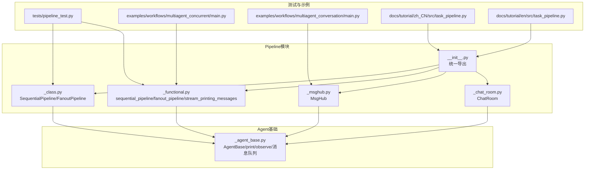
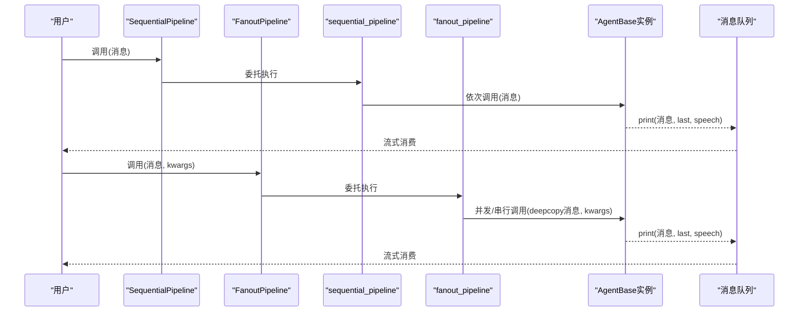
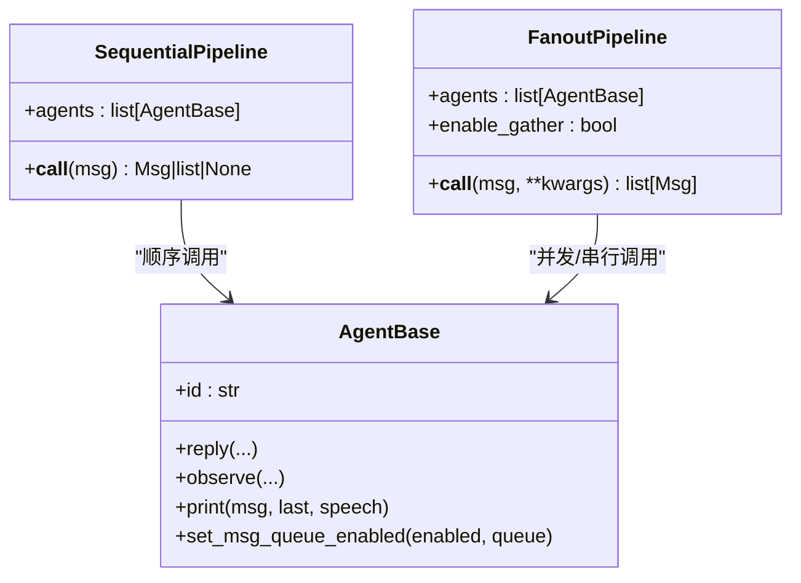
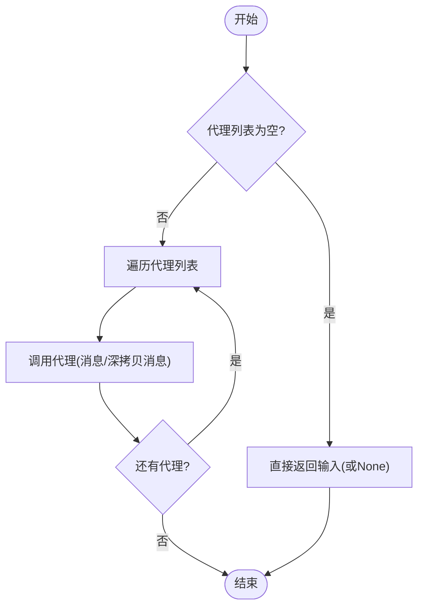
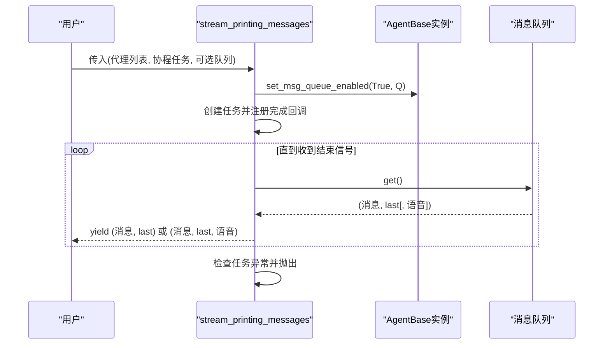
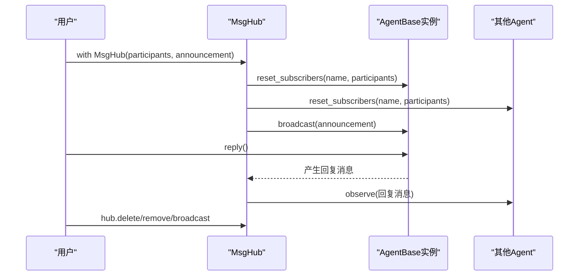
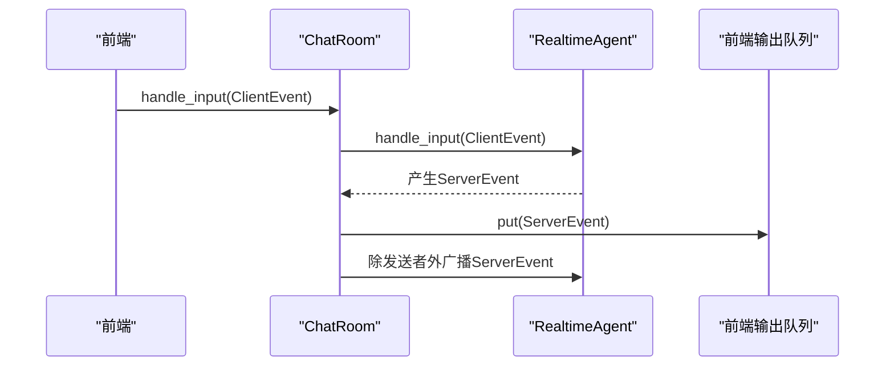
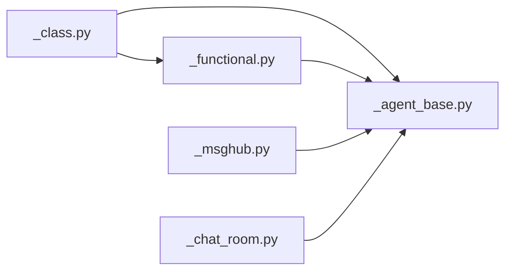

# 类式流水线

<cite>
**本文引用的文件**   
- [src/agentscope/pipeline/__init__.py](file://src/agentscope/pipeline/__init__.py)
- [src/agentscope/pipeline/_class.py](file://src/agentscope/pipeline/_class.py)
- [src/agentscope/pipeline/_functional.py](file://src/agentscope/pipeline/_functional.py)
- [src/agentscope/pipeline/_msghub.py](file://src/agentscope/pipeline/_msghub.py)
- [src/agentscope/pipeline/_chat_room.py](file://src/agentscope/pipeline/_chat_room.py)
- [src/agentscope/agent/_agent_base.py](file://src/agentscope/agent/_agent_base.py)
- [tests/pipeline_test.py](file://tests/pipeline_test.py)
- [examples/workflows/multiagent_concurrent/main.py](file://examples/workflows/multiagent_concurrent/main.py)
- [examples/workflows/multiagent_conversation/main.py](file://examples/workflows/multiagent_conversation/main.py)
- [docs/tutorial/zh_CN/src/task_pipeline.py](file://docs/tutorial/zh_CN/src/task_pipeline.py)
- [docs/tutorial/en/src/task_pipeline.py](file://docs/tutorial/en/src/task_pipeline.py)
</cite>

## 目录
1. [引言](#引言)
2. [项目结构](#项目结构)
3. [核心组件](#核心组件)
4. [架构总览](#架构总览)
5. [详细组件分析](#详细组件分析)
6. [依赖分析](#依赖分析)
7. [性能考虑](#性能考虑)
8. [故障排查指南](#故障排查指南)
9. [结论](#结论)
10. [附录](#附录)

## 引言
本文件面向AgentScope的类式流水线系统，围绕Pipeline模块进行系统化技术说明。重点涵盖：
- 面向对象的流水线管理：SequentialPipeline与FanoutPipeline类的设计与生命周期
- 配置化执行：参数化策略（如并发/串行）、动态入参传递
- 生命周期控制：异步上下文、订阅广播、消息队列与流式输出
- 类式与函数式流水线的差异与优势：状态保持、配置复用、扩展性
- 组件组织：代理列表管理、执行策略、结果处理
- 完整使用示例：复杂工作流、动态配置更新、运行时调整
- 序列化与反序列化：持久化与恢复的可行性与建议
- 调试工具、监控指标与性能分析
- 最佳实践与常见问题

## 项目结构
Pipeline相关代码集中在agentscope/pipeline目录，对外通过__init__.py统一导出；配套的Agent基类在agentscope/agent中，提供print、observe、消息队列等能力；测试与示例分别位于tests与examples。

**图表来源**
- [src/agentscope/pipeline/__init__.py:1-23](file://src/agentscope/pipeline/__init__.py#L1-L23)
- [src/agentscope/pipeline/_class.py:1-91](file://src/agentscope/pipeline/_class.py#L1-L91)
- [src/agentscope/pipeline/_functional.py:1-193](file://src/agentscope/pipeline/_functional.py#L1-L193)
- [src/agentscope/pipeline/_msghub.py:1-157](file://src/agentscope/pipeline/_msghub.py#L1-L157)
- [src/agentscope/pipeline/_chat_room.py:1-98](file://src/agentscope/pipeline/_chat_room.py#L1-L98)
- [src/agentscope/agent/_agent_base.py:1-200](file://src/agentscope/agent/_agent_base.py#L1-L200)

**章节来源**
- [src/agentscope/pipeline/__init__.py:1-23](file://src/agentscope/pipeline/__init__.py#L1-L23)

## 核心组件
- 类式流水线
  - SequentialPipeline：面向对象的顺序流水线，支持复用与多次调用
  - FanoutPipeline：面向对象的扇出流水线，支持并发/串行策略与默认参数
- 函数式流水线
  - sequential_pipeline：顺序执行，链式传递消息
  - fanout_pipeline：同输入分发至多代理，支持gather/串行两种执行模式
  - stream_printing_messages：将代理print的中间消息转为异步生成器
- 消息中枢
  - MsgHub：异步上下文管理器，自动广播/订阅，动态增删参与者
- 实时聊天室
  - ChatRoom：多实时代理广播与前端事件转发

**章节来源**
- [src/agentscope/pipeline/_class.py:10-91](file://src/agentscope/pipeline/_class.py#L10-L91)
- [src/agentscope/pipeline/_functional.py:10-193](file://src/agentscope/pipeline/_functional.py#L10-L193)
- [src/agentscope/pipeline/_msghub.py:14-157](file://src/agentscope/pipeline/_msghub.py#L14-L157)
- [src/agentscope/pipeline/_chat_room.py:10-98](file://src/agentscope/pipeline/_chat_room.py#L10-L98)

## 架构总览
类式流水线以AgentBase为执行单元，通过函数式流水线实现具体调度逻辑；MsgHub负责跨代理广播；ChatRoom负责实时代理间事件转发与前端对接。整体采用异步非阻塞模型，支持并发与流式输出。

**图表来源**
- [src/agentscope/pipeline/_class.py:27-90](file://src/agentscope/pipeline/_class.py#L27-L90)
- [src/agentscope/pipeline/_functional.py:10-104](file://src/agentscope/pipeline/_functional.py#L10-L104)
- [src/agentscope/agent/_agent_base.py:205-275](file://src/agentscope/agent/_agent_base.py#L205-L275)

## 详细组件分析

### 类式流水线：SequentialPipeline 与 FanoutPipeline
- 设计要点
  - 通过__call__方法暴露统一入口，便于复用与多次执行
  - FanoutPipeline支持enable_gather参数切换并发/串行
  - 两者均委托底层函数式实现，保证行为一致性
- 生命周期
  - 初始化：保存代理列表与策略参数
  - 执行：按策略调度，返回最终结果或聚合结果
  - 复用：同一实例可多次调用，适合模板化工作流
- 与函数式对比
  - 类式：状态保持（代理列表、策略），适合配置复用与运行时调整
  - 函数式：一次性调用，简洁直观，适合脚手架式流程

**图表来源**
- [src/agentscope/pipeline/_class.py:10-91](file://src/agentscope/pipeline/_class.py#L10-L91)
- [src/agentscope/agent/_agent_base.py:197-222](file://src/agentscope/agent/_agent_base.py#L197-L222)

**章节来源**
- [src/agentscope/pipeline/_class.py:10-91](file://src/agentscope/pipeline/_class.py#L10-L91)

### 函数式流水线：sequential_pipeline 与 fanout_pipeline
- sequential_pipeline
  - 顺序遍历代理，前一代理输出作为下一代理输入
  - 支持空代理列表与None输入的边界处理
- fanout_pipeline
  - 默认并发（asyncio.gather）分发相同输入至多代理
  - 支持enable_gather=False串行执行
  - 使用deepcopy确保各代理独立状态

**图表来源**
- [src/agentscope/pipeline/_functional.py:10-44](file://src/agentscope/pipeline/_functional.py#L10-L44)

**章节来源**
- [src/agentscope/pipeline/_functional.py:10-104](file://src/agentscope/pipeline/_functional.py#L10-L104)

### 流式消息捕获：stream_printing_messages
- 功能
  - 通过启用消息队列，将代理print的中间消息汇聚为异步生成器
  - 支持是否携带语音块的产出
  - 以“结束信号”控制生成器退出，并在异常时抛出
- 使用场景
  - 实时可视化、调试、日志采集
  - 与协程任务配合，捕获执行过程中的打印消息

**图表来源**
- [src/agentscope/pipeline/_functional.py:107-193](file://src/agentscope/pipeline/_functional.py#L107-L193)
- [src/agentscope/agent/_agent_base.py:750-775](file://src/agentscope/agent/_agent_base.py#L750-L775)

**章节来源**
- [src/agentscope/pipeline/_functional.py:107-193](file://src/agentscope/pipeline/_functional.py#L107-L193)
- [src/agentscope/agent/_agent_base.py:205-275](file://src/agentscope/agent/_agent_base.py#L205-L275)
- [src/agentscope/agent/_agent_base.py:750-775](file://src/agentscope/agent/_agent_base.py#L750-L775)

### 消息中枢：MsgHub
- 设计
  - 异步上下文管理器，进入时重置订阅，可选广播公告
  - 自动广播：任一参与者回复后，自动广播给其他订阅者
  - 动态管理：add/delete/broadcast
- 生命周期
  - __aenter__: 重置订阅并广播公告
  - __aexit__: 可选择清理订阅
  - 运行期：动态增删参与者不影响历史消息

**图表来源**
- [src/agentscope/pipeline/_msghub.py:73-139](file://src/agentscope/pipeline/_msghub.py#L73-L139)
- [src/agentscope/agent/_agent_base.py:719-731](file://src/agentscope/agent/_agent_base.py#L719-L731)

**章节来源**
- [src/agentscope/pipeline/_msghub.py:14-157](file://src/agentscope/pipeline/_msghub.py#L14-L157)
- [src/agentscope/agent/_agent_base.py:185-203](file://src/agentscope/agent/_agent_base.py#L185-L203)

### 实时聊天室：ChatRoom
- 设计
  - 管理多个实时代理，统一启动/停止
  - 内部队列汇聚事件，区分客户端事件与服务端事件
  - 服务端事件广播至除发送者外的其他代理，并推送到前端队列
- 生命周期
  - start：为每个代理设置输出队列并启动转发循环
  - stop：关闭连接并取消转发任务
  - handle_input：接收前端事件并分发

**图表来源**
- [src/agentscope/pipeline/_chat_room.py:30-98](file://src/agentscope/pipeline/_chat_room.py#L30-L98)

**章节来源**
- [src/agentscope/pipeline/_chat_room.py:10-98](file://src/agentscope/pipeline/_chat_room.py#L10-L98)

## 依赖分析
- 组件耦合
  - 类式流水线依赖函数式实现，职责清晰：类负责状态与复用，函数负责具体调度
  - MsgHub依赖AgentBase的订阅/广播接口，形成松耦合的消息传播
  - ChatRoom依赖RealtimeAgent与事件类型，关注实时交互
- 外部依赖
  - asyncio：并发与队列
  - shortuuid：生成唯一Hub名称
  - 日志模块：记录警告与错误

**图表来源**
- [src/agentscope/pipeline/_class.py:1-91](file://src/agentscope/pipeline/_class.py#L1-L91)
- [src/agentscope/pipeline/_functional.py:1-193](file://src/agentscope/pipeline/_functional.py#L1-L193)
- [src/agentscope/pipeline/_msghub.py:1-157](file://src/agentscope/pipeline/_msghub.py#L1-L157)
- [src/agentscope/pipeline/_chat_room.py:1-98](file://src/agentscope/pipeline/_chat_room.py#L1-L98)
- [src/agentscope/agent/_agent_base.py:1-200](file://src/agentscope/agent/_agent_base.py#L1-L200)

**章节来源**
- [src/agentscope/pipeline/__init__.py:5-22](file://src/agentscope/pipeline/__init__.py#L5-L22)

## 性能考虑
- 并发策略
  - FanoutPipeline默认并发（asyncio.gather）提升I/O密集型吞吐
  - 串行模式避免外部服务压力与确定性执行
- 深拷贝成本
  - 分发时对输入消息进行深拷贝，确保代理独立状态，但会增加内存与CPU开销
- 流式输出
  - 消息队列与yield控制事件循环让渡，避免生产者独占
- 实时代理
  - ChatRoom使用队列与任务分离，避免阻塞；注意任务取消与资源释放

[本节为通用指导，不直接分析具体文件]

## 故障排查指南
- 流式消息异常
  - stream_printing_messages会在任务完成后检查异常并抛出，即使已产出部分消息
  - 建议在消费侧捕获并记录消息历史，定位异常位置
- 并发与串行
  - 若出现外部服务限流或状态竞争，切换enable_gather=False
- 订阅广播
  - 新增参与者不会收到历史消息；若需历史同步，显式broadcast
- 资源清理
  - ChatRoom.stop应确保任务取消与代理连接关闭

**章节来源**
- [src/agentscope/pipeline/_functional.py:189-193](file://src/agentscope/pipeline/_functional.py#L189-L193)
- [src/agentscope/pipeline/_chat_room.py:85-88](file://src/agentscope/pipeline/_chat_room.py#L85-L88)
- [tests/pipeline_test.py:411-439](file://tests/pipeline_test.py#L411-L439)

## 结论
类式流水线通过封装状态与策略，显著提升了配置复用与运行时调整能力；函数式流水线则提供简洁直观的执行语义。二者与MsgHub、ChatRoom协同，覆盖从顺序编排、并行分发到实时交互的全场景需求。结合流式输出与异步并发，可构建高性能、可观测、可维护的多智能体工作流。

[本节为总结，不直接分析具体文件]

## 附录

### 使用示例与最佳实践
- 复杂工作流构建
  - 顺序编排：SequentialPipeline或sequential_pipeline串联多代理
  - 并行分发：FanoutPipeline或fanout_pipeline收集多视角输出
  - 动态参与者：MsgHub的add/delete/broadcast灵活管理
- 动态配置更新
  - 类式流水线实例可重复调用，适配不同输入与上下文
  - FanoutPipeline支持kwargs透传，便于注入不同参数
- 运行时调整
  - 切换enable_gather以平衡性能与稳定性
  - 通过stream_printing_messages实现实时可观测性
- 示例参考
  - 并行多视角讨论：[examples/workflows/multiagent_concurrent/main.py:67-94](file://examples/workflows/multiagent_concurrent/main.py#L67-L94)
  - 多智能体对话与MsgHub：[examples/workflows/multiagent_conversation/main.py:38-81](file://examples/workflows/multiagent_conversation/main.py#L38-L81)
  - 教程示例（中文）：[docs/tutorial/zh_CN/src/task_pipeline.py:228-284](file://docs/tutorial/zh_CN/src/task_pipeline.py#L228-L284)
  - 教程示例（英文）：[docs/tutorial/en/src/task_pipeline.py:233-289](file://docs/tutorial/en/src/task_pipeline.py#L233-L289)

**章节来源**
- [examples/workflows/multiagent_concurrent/main.py:67-94](file://examples/workflows/multiagent_concurrent/main.py#L67-L94)
- [examples/workflows/multiagent_conversation/main.py:38-81](file://examples/workflows/multiagent_conversation/main.py#L38-L81)
- [docs/tutorial/zh_CN/src/task_pipeline.py:228-284](file://docs/tutorial/zh_CN/src/task_pipeline.py#L228-L284)
- [docs/tutorial/en/src/task_pipeline.py:233-289](file://docs/tutorial/en/src/task_pipeline.py#L233-L289)

### 序列化与反序列化（持久化与恢复）
- 现状
  - AgentScope未提供内置的流水线对象序列化/反序列化API
  - 可序列化的对象由tracing模块的工具函数处理，但主要用于追踪与日志
- 建议
  - 对于可复用的流水线配置，建议以“代理列表+策略参数”的形式持久化
  - 在恢复时重建类式流水线实例并注入配置，再按需复用
  - 对于运行时产生的中间状态（如消息队列），建议通过外部存储或事件回放恢复

**章节来源**
- [src/agentscope/tracing/_utils.py:15-54](file://src/agentscope/tracing/_utils.py#L15-L54)

### 调试工具与监控指标
- 调试
  - stream_printing_messages：捕获print中间结果，便于观测执行过程
  - set_console_output_enabled：生产环境可禁用控制台输出，减少噪声
  - set_msg_queue_enabled：启用消息队列以支持流式消费
- 监控
  - 建议在代理内部埋点统计耗时、调用次数、异常率
  - 使用MsgHub广播关键事件，集中观测全局状态
  - ChatRoom中对ServerEvent进行计数与延迟统计

**章节来源**
- [src/agentscope/agent/_agent_base.py:738-775](file://src/agentscope/agent/_agent_base.py#L738-L775)
- [src/agentscope/pipeline/_functional.py:107-193](file://src/agentscope/pipeline/_functional.py#L107-L193)
- [src/agentscope/pipeline/_msghub.py:73-81](file://src/agentscope/pipeline/_msghub.py#L73-L81)