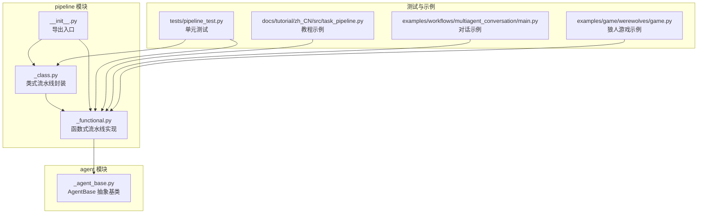
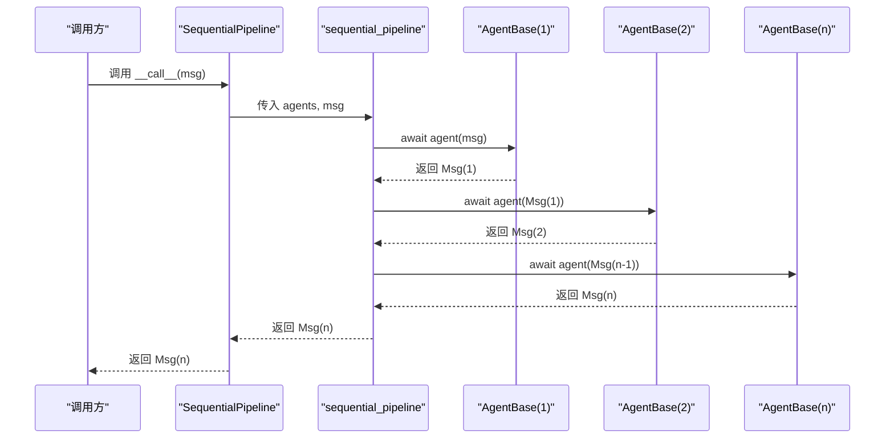
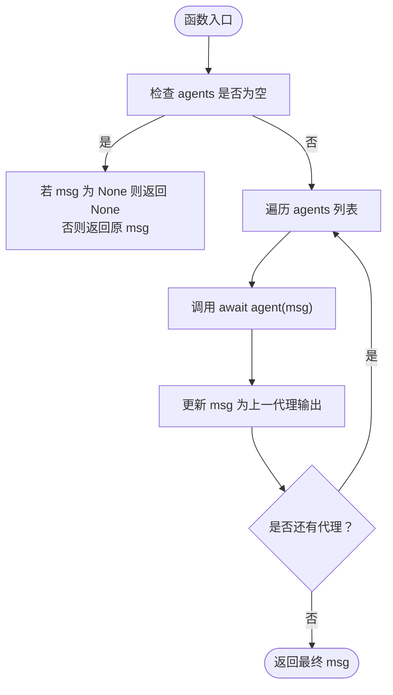
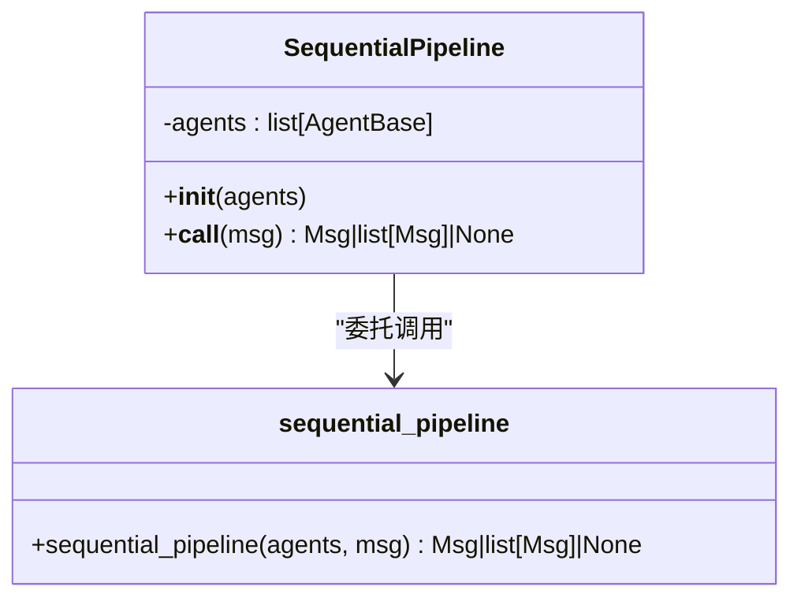
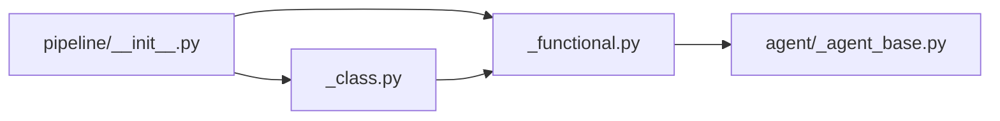

# 顺序流水线

<cite>
**本文引用的文件**   
- [src/agentscope/pipeline/_functional.py](file://src/agentscope/pipeline/_functional.py)
- [src/agentscope/pipeline/_class.py](file://src/agentscope/pipeline/_class.py)
- [src/agentscope/pipeline/__init__.py](file://src/agentscope/pipeline/__init__.py)
- [src/agentscope/agent/_agent_base.py](file://src/agentscope/agent/_agent_base.py)
- [tests/pipeline_test.py](file://tests/pipeline_test.py)
- [docs/tutorial/zh_CN/src/task_pipeline.py](file://docs/tutorial/zh_CN/src/task_pipeline.py)
- [examples/workflows/multiagent_conversation/main.py](file://examples/workflows/multiagent_conversation/main.py)
- [examples/game/werewolves/game.py](file://examples/game/werewolves/game.py)
</cite>

## 目录
1. [简介](#简介)
2. [项目结构](#项目结构)
3. [核心组件](#核心组件)
4. [架构总览](#架构总览)
5. [详细组件分析](#详细组件分析)
6. [依赖分析](#依赖分析)
7. [性能考量](#性能考量)
8. [故障排查指南](#故障排查指南)
9. [结论](#结论)
10. [附录](#附录)

## 简介
本文件系统化阐述 AgentScope 的顺序流水线能力，围绕 sequential_pipeline 函数与 SequentialPipeline 类展开，重点说明：
- 代理链式调用与消息传递机制
- 前一个代理的输出如何作为下一个代理的输入
- 状态管理与消息对象的生命周期
- 错误传播、异常处理、中断恢复与调试技巧
- 性能优化、内存管理与并发注意事项
- 完整使用示例与常见问题解答

## 项目结构
顺序流水线相关代码位于 pipeline 子模块，配合 agent 基类与 message 数据结构协同工作。

**图表来源**
- [src/agentscope/pipeline/_functional.py:1-193](file://src/agentscope/pipeline/_functional.py#L1-L193)
- [src/agentscope/pipeline/_class.py:1-91](file://src/agentscope/pipeline/_class.py#L1-L91)
- [src/agentscope/pipeline/__init__.py:1-23](file://src/agentscope/pipeline/__init__.py#L1-L23)
- [src/agentscope/agent/_agent_base.py:1-200](file://src/agentscope/agent/_agent_base.py#L1-L200)
- [tests/pipeline_test.py:1-439](file://tests/pipeline_test.py#L1-L439)
- [docs/tutorial/zh_CN/src/task_pipeline.py:1-284](file://docs/tutorial/zh_CN/src/task_pipeline.py#L1-L284)
- [examples/workflows/multiagent_conversation/main.py:1-81](file://examples/workflows/multiagent_conversation/main.py#L1-L81)
- [examples/game/werewolves/game.py:280-364](file://examples/game/werewolves/game.py#L280-L364)

**章节来源**
- [src/agentscope/pipeline/__init__.py:1-23](file://src/agentscope/pipeline/__init__.py#L1-L23)
- [src/agentscope/pipeline/_functional.py:1-193](file://src/agentscope/pipeline/_functional.py#L1-L193)
- [src/agentscope/pipeline/_class.py:1-91](file://src/agentscope/pipeline/_class.py#L1-L91)
- [src/agentscope/agent/_agent_base.py:1-200](file://src/agentscope/agent/_agent_base.py#L1-L200)

## 核心组件
- 函数式顺序流水线：sequential_pipeline，按序调用每个代理，前一代理输出作为下一代理输入，最终返回最后一个代理的输出。
- 类式顺序流水线：SequentialPipeline，面向复用场景，内部委托给函数式实现。
- 代理接口：AgentBase，定义代理的调用协议（__call__ 即为 await agent(msg) 的入口），并提供 observe/print 等能力。
- 消息模型：Msg，作为流水线中传递的数据载体，支持元数据扩展。

关键行为与契约：
- 输入为空时直接返回空；空代理列表时返回原消息对象。
- 顺序执行，不进行深拷贝，避免重复复制带来的额外开销。
- 异常沿调用链向上传播，由上层捕获与处理。

**章节来源**
- [src/agentscope/pipeline/_functional.py:10-44](file://src/agentscope/pipeline/_functional.py#L10-L44)
- [src/agentscope/pipeline/_class.py:10-41](file://src/agentscope/pipeline/_class.py#L10-L41)
- [src/agentscope/agent/_agent_base.py:197-200](file://src/agentscope/agent/_agent_base.py#L197-L200)

## 架构总览
顺序流水线的执行路径如下：

**图表来源**
- [src/agentscope/pipeline/_class.py:27-40](file://src/agentscope/pipeline/_class.py#L27-L40)
- [src/agentscope/pipeline/_functional.py:42-44](file://src/agentscope/pipeline/_functional.py#L42-L44)
- [src/agentscope/agent/_agent_base.py:197-200](file://src/agentscope/agent/_agent_base.py#L197-L200)

## 详细组件分析

### 函数式顺序流水线：sequential_pipeline
- 实现要点
  - 遍历代理列表，依次调用 await agent(msg)，并将上一代理输出赋值给 msg，作为下一次调用的输入。
  - 若输入为 None 或代理列表为空，则按约定返回 None 或原消息对象。
- 复杂度
  - 时间复杂度 O(N·T)，N 为代理数量，T 为单代理平均耗时。
  - 空间复杂度 O(1)，仅持有当前消息引用。
- 注意事项
  - 不进行深拷贝，避免不必要的内存与时间开销。
  - 异常会沿调用链冒泡，需在上层进行 try/except 捕获与处理。

**图表来源**
- [src/agentscope/pipeline/_functional.py:42-44](file://src/agentscope/pipeline/_functional.py#L42-L44)

**章节来源**
- [src/agentscope/pipeline/_functional.py:10-44](file://src/agentscope/pipeline/_functional.py#L10-L44)

### 类式顺序流水线：SequentialPipeline
- 设计目的：便于复用与配置，内部直接委托给函数式实现。
- 关键点
  - 保存 agents 列表，__call__ 内部调用 sequential_pipeline。
  - 适合多次复用同一序列，减少重复构造成本。

**图表来源**
- [src/agentscope/pipeline/_class.py:10-41](file://src/agentscope/pipeline/_class.py#L10-L41)
- [src/agentscope/pipeline/_functional.py:10-44](file://src/agentscope/pipeline/_functional.py#L10-L44)

**章节来源**
- [src/agentscope/pipeline/_class.py:10-41](file://src/agentscope/pipeline/_class.py#L10-L41)

### 代理接口：AgentBase
- 关键方法
  - __call__：作为流水线入口，内部通常委托到 reply/observe 等方法。
  - reply：生成回复消息。
  - observe：接收消息但不生成回复。
  - print：用于流式输出中间消息（与 stream_printing_messages 配合）。
- 与流水线的关系
  - 流水线通过 await agent(msg) 触发代理执行，前一代理输出即为下一代理输入。

**章节来源**
- [src/agentscope/agent/_agent_base.py:185-200](file://src/agentscope/agent/_agent_base.py#L185-L200)

### 使用示例与最佳实践

- 基础顺序流水线
  - 教程示例展示了如何用 sequential_pipeline 串联多个 ReActAgent，实现顺序对话。
  - 示例路径：[docs/tutorial/zh_CN/src/task_pipeline.py:161-172](file://docs/tutorial/zh_CN/src/task_pipeline.py#L161-L172)

- 多智能体对话工作流
  - 在对话示例中，先通过 MsgHub 广播公告，再用 sequential_pipeline 顺序驱动各参与方发言。
  - 示例路径：[examples/workflows/multiagent_conversation/main.py:48-62](file://examples/workflows/multiagent_conversation/main.py#L48-L62)

- 复杂场景：狼人游戏
  - 游戏流程中，讨论阶段使用 sequential_pipeline 对存活玩家顺序执行，投票阶段改用 fanout_pipeline 并结合结构化输出。
  - 示例路径：[examples/game/werewolves/game.py:280-317](file://examples/game/werewolves/game.py#L280-L317)

- 单元测试验证
  - 测试覆盖了空代理列表、None 输入、单代理、不同顺序组合等边界情况。
  - 示例路径：[tests/pipeline_test.py:150-263](file://tests/pipeline_test.py#L150-L263)

**章节来源**
- [docs/tutorial/zh_CN/src/task_pipeline.py:145-172](file://docs/tutorial/zh_CN/src/task_pipeline.py#L145-L172)
- [examples/workflows/multiagent_conversation/main.py:38-76](file://examples/workflows/multiagent_conversation/main.py#L38-L76)
- [examples/game/werewolves/game.py:280-317](file://examples/game/werewolves/game.py#L280-L317)
- [tests/pipeline_test.py:150-263](file://tests/pipeline_test.py#L150-L263)

## 依赖分析
- 模块导出
  - pipeline/__init__.py 统一导出 MsgHub、SequentialPipeline、sequential_pipeline、FanoutPipeline、fanout_pipeline、stream_printing_messages、ChatRoom。
- 顺序流水线依赖
  - 依赖 AgentBase 的 __call__ 协议与消息类型 Msg。
  - 顺序流水线本身不引入额外外部库，仅使用 Python 内置异步机制。

**图表来源**
- [src/agentscope/pipeline/__init__.py:5-12](file://src/agentscope/pipeline/__init__.py#L5-L12)
- [src/agentscope/pipeline/_functional.py:6-7](file://src/agentscope/pipeline/_functional.py#L6-L7)
- [src/agentscope/pipeline/_class.py:5-7](file://src/agentscope/pipeline/_class.py#L5-L7)

**章节来源**
- [src/agentscope/pipeline/__init__.py:1-23](file://src/agentscope/pipeline/__init__.py#L1-L23)
- [src/agentscope/pipeline/_functional.py:1-10](file://src/agentscope/pipeline/_functional.py#L1-L10)
- [src/agentscope/pipeline/_class.py:1-8](file://src/agentscope/pipeline/_class.py#L1-L8)

## 性能考量
- 顺序执行的吞吐
  - sequential_pipeline 采用串行调用，避免并发带来的锁竞争与上下文切换开销，适合 CPU 密集或需要确定性顺序的场景。
- 内存与拷贝
  - 不对消息进行深拷贝，减少内存与时间开销；若代理需要修改消息内容，请确保在代理内部安全地更新。
- 并发对比
  - 若存在 I/O 密集型子任务，可考虑 fanout_pipeline 并发执行，或在上层使用 asyncio.gather 自行编排。
- 资源控制
  - 对外部服务的访问应加限流或熔断策略，避免顺序流水线被下游阻塞。

[本节为通用性能建议，不直接分析特定文件，故无“章节来源”]

## 故障排查指南
- 常见问题
  - 代理未实现 reply：AgentBase 的 reply 为抽象方法，必须在子类中实现，否则会抛出未实现异常。
  - 输入为空：当 msg 为 None 且 agents 为空时，返回 None；当 agents 为空但 msg 非空时，返回原消息对象。
  - 异常传播：任一代理抛出异常将沿调用链向上冒泡，应在调用处使用 try/except 捕获并记录日志。
- 调试技巧
  - 使用 stream_printing_messages 捕获代理打印的中间消息，辅助定位问题。
  - 在代理内部使用 observe 订阅广播消息，确认消息是否正确到达。
- 单元测试参考
  - 测试覆盖了空代理列表、None 输入、单代理、不同顺序组合等边界情况，可对照定位问题。

**章节来源**
- [src/agentscope/agent/_agent_base.py:197-200](file://src/agentscope/agent/_agent_base.py#L197-L200)
- [tests/pipeline_test.py:191-263](file://tests/pipeline_test.py#L191-L263)

## 结论
顺序流水线为 AgentScope 提供了简洁而强大的多代理编排能力：以最小的抽象代价实现链式调用、消息传递与状态延续。通过函数式与类式两种形态，既能满足一次性脚手架式使用，也能满足可复用的工程化需求。配合 MsgHub、fanout_pipeline 与 stream_printing_messages，可覆盖从简单对话到复杂工作流的广泛场景。

[本节为总结性内容，不直接分析特定文件，故无“章节来源”]

## 附录

### API 参考
- sequential_pipeline(agents: list[AgentBase], msg: Msg | list[Msg] | None = None) -> Msg | list[Msg] | None
  - 顺序执行代理列表，前一代理输出作为下一代理输入，返回最后一个代理输出。
- SequentialPipeline(agents: list[AgentBase])
  - 类式封装，提供可复用的顺序流水线实例。
  - __call__(msg: Msg | list[Msg] | None = None) -> Msg | list[Msg] | None

**章节来源**
- [src/agentscope/pipeline/_functional.py:10-44](file://src/agentscope/pipeline/_functional.py#L10-L44)
- [src/agentscope/pipeline/_class.py:10-41](file://src/agentscope/pipeline/_class.py#L10-L41)

### 使用示例索引
- 教程示例：顺序流水线基础用法
  - [docs/tutorial/zh_CN/src/task_pipeline.py:161-172](file://docs/tutorial/zh_CN/src/task_pipeline.py#L161-L172)
- 多智能体对话工作流
  - [examples/workflows/multiagent_conversation/main.py:48-62](file://examples/workflows/multiagent_conversation/main.py#L48-L62)
- 狼人游戏顺序执行讨论阶段
  - [examples/game/werewolves/game.py:280-294](file://examples/game/werewolves/game.py#L280-L294)

**章节来源**
- [docs/tutorial/zh_CN/src/task_pipeline.py:145-172](file://docs/tutorial/zh_CN/src/task_pipeline.py#L145-L172)
- [examples/workflows/multiagent_conversation/main.py:38-76](file://examples/workflows/multiagent_conversation/main.py#L38-L76)
- [examples/game/werewolves/game.py:280-317](file://examples/game/werewolves/game.py#L280-L317)