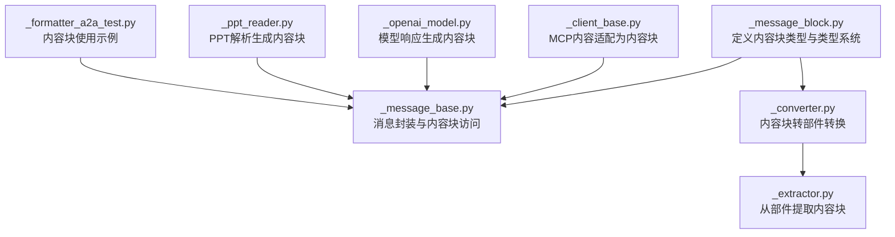
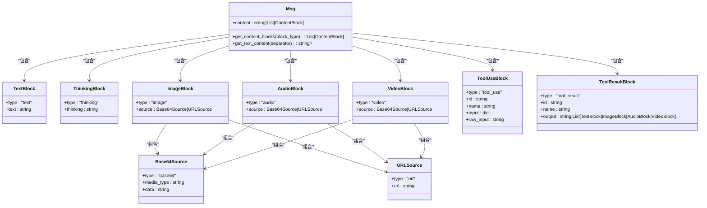
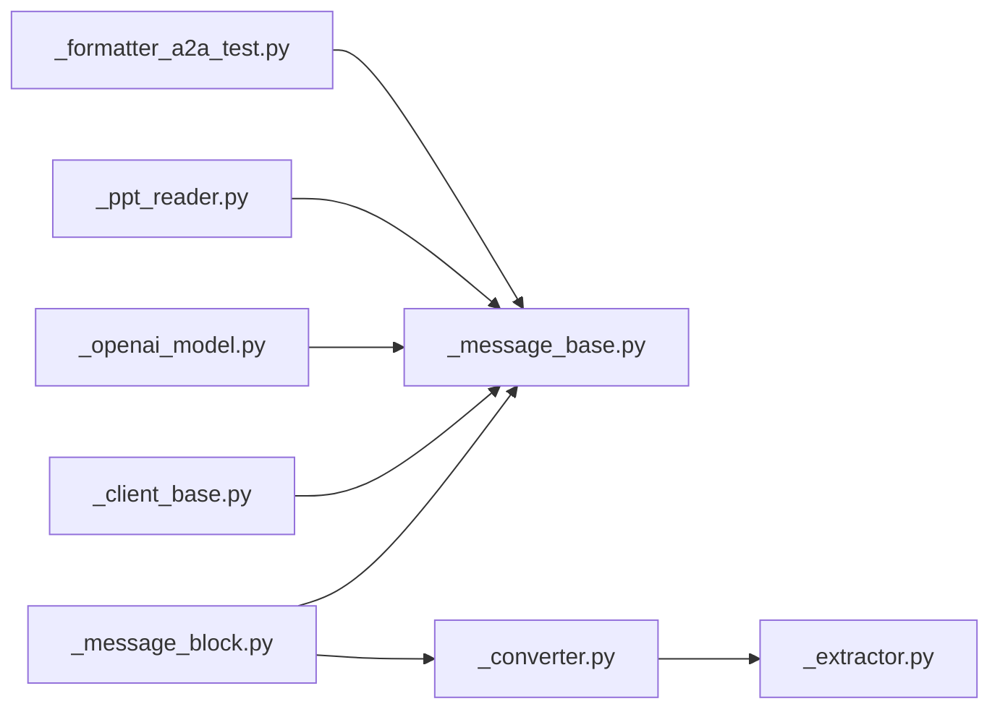
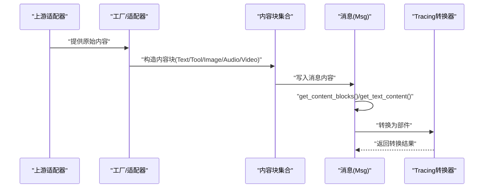

# 内容块系统

<cite>
**本文引用的文件**
- [消息块定义 _message_block.py](file://src/agentscope/message/_message_block.py)
- [消息基础类 _message_base.py](file://src/agentscope/message/_message_base.py)
- [MCP 客户端基类 _client_base.py](file://src/agentscope/mcp/_client_base.py)
- [A2A 格式化器测试 _formatter_a2a_test.py](file://tests/formatter_a2a_test.py)
- [追踪转换器 _converter.py](file://src/agentscope/tracing/_converter.py)
- [追踪提取器 _extractor.py](file://src/agentscope/tracing/_extractor.py)
- [OpenAI 模型实现 _openai_model.py](file://src/agentscope/model/_openai_model.py)
- [PPT 阅读器 _ppt_reader.py](file://src/agentscope/rag/_reader/_ppt_reader.py)
</cite>

## 目录
1. [引言](#引言)
2. [项目结构](#项目结构)
3. [核心组件](#核心组件)
4. [架构总览](#架构总览)
5. [详细组件分析](#详细组件分析)
6. [依赖分析](#依赖分析)
7. [性能考虑](#性能考虑)
8. [故障排查指南](#故障排查指南)
9. [结论](#结论)
10. [附录](#附录)

## 引言
本文件面向 AgentScope 的内容块系统，系统性阐述 ContentBlock 基类设计、多态结构与类型系统，以及各类内容块（TextBlock、ToolUseBlock、ToolResultBlock、ImageBlock、AudioBlock、VideoBlock）的职责边界与数据模型。同时，结合消息封装 Msg 的使用方式，说明内容块在消息传递中的创建、访问与转换流程，并给出验证与转换逻辑的最佳实践。

## 项目结构
内容块系统主要由以下模块构成：
- 消息块定义：定义 TypedDict 类型的各内容块类型及类型联合、类型字面量
- 消息基础类：对内容块进行统一访问、筛选与文本抽取
- 工厂与适配：将外部来源（如 MCP、模型响应）转换为内容块
- 转换与验证：将内容块转换为其他协议部件（如 tracing），并进行字段校验
- 使用示例：测试与集成点展示内容块的实际用法

图表来源
- [消息块定义 _message_block.py:1-129](file://src/agentscope/message/_message_block.py#L1-L129)
- [消息基础类 _message_base.py:1-242](file://src/agentscope/message/_message_base.py#L1-L242)
- [追踪转换器 _converter.py:56-120](file://src/agentscope/tracing/_converter.py#L56-L120)
- [追踪提取器 _extractor.py:1-450](file://src/agentscope/tracing/_extractor.py#L1-L450)
- [MCP 客户端基类 _client_base.py:48-102](file://src/agentscope/mcp/_client_base.py#L48-L102)
- [OpenAI 模型实现 _openai_model.py:454-492](file://src/agentscope/model/_openai_model.py#L454-L492)
- [PPT 阅读器 _ppt_reader.py:356-592](file://src/agentscope/rag/_reader/_ppt_reader.py#L356-L592)
- [A2A 格式化器测试 _formatter_a2a_test.py:50-249](file://tests/formatter_a2a_test.py#L50-L249)

章节来源
- [消息块定义 _message_block.py:1-129](file://src/agentscope/message/_message_block.py#L1-L129)
- [消息基础类 _message_base.py:1-242](file://src/agentscope/message/_message_base.py#L1-L242)

## 核心组件
- 内容块类型系统
  - ContentBlockTypes：限定内容块类型字面量集合，覆盖 text、thinking、tool_use、tool_result、image、audio、video
  - ContentBlock：内容块联合类型，包含上述所有块类型
- 具体内容块
  - 文本块 TextBlock：包含 type 与 text 字段
  - 思考块 ThinkingBlock：包含 type 与 thinking 字段
  - 工具调用块 ToolUseBlock：包含 type、id、name、input、raw_input
  - 工具结果块 ToolResultBlock：包含 type、id、name、output（字符串或内容块列表）
  - 多媒体块 ImageBlock/AudioBlock/VideoBlock：均包含 type 与 source（Base64Source 或 URLSource）
  - 数据源 Base64Source：包含 type、media_type、data
  - 数据源 URLSource：包含 type、url

章节来源
- [消息块定义 _message_block.py:9-129](file://src/agentscope/message/_message_block.py#L9-L129)

## 架构总览
内容块系统采用“类型即契约”的设计：通过 TypedDict 约束字段与类型，配合 Msg 的统一访问接口，形成“创建—存储—筛选—转换”的闭环。外部来源（MCP、模型响应等）通过适配层转换为内容块；Tracing 层可将内容块转换为通用部件，用于可观测性与日志提取。

图表来源
- [消息块定义 _message_block.py:9-129](file://src/agentscope/message/_message_block.py#L9-L129)
- [消息基础类 _message_base.py:21-242](file://src/agentscope/message/_message_base.py#L21-L242)

## 详细组件分析

### ContentBlock 基类与类型系统
- 设计要点
  - 使用 TypedDict 定义每种内容块的字段与必填约束，确保运行时与静态检查一致
  - 通过 ContentBlockTypes 限制类型枚举，避免非法类型污染
  - 通过 ContentBlock 联合类型统一消息内容的类型表达
- 复杂度与性能
  - 类型检查发生在构造与访问阶段，开销极低
  - 由于是静态类型定义，不引入额外运行时对象实例化成本

章节来源
- [消息块定义 _message_block.py:120-129](file://src/agentscope/message/_message_block.py#L120-L129)

### 文本块 TextBlock
- 职责与字段
  - 表达纯文本内容，type 固定为 "text"，text 为字符串
- 使用场景
  - 作为消息内容的基础单元，或在工具调用后返回纯文本结果
- 访问与转换
  - Msg.get_text_content 可聚合多个文本块为单一字符串

章节来源
- [消息块定义 _message_block.py:9-16](file://src/agentscope/message/_message_block.py#L9-L16)
- [消息基础类 _message_base.py:123-147](file://src/agentscope/message/_message_base.py#L123-L147)

### 思考块 ThinkingBlock
- 职责与字段
  - 表达模型内部思考过程，type 固定为 "thinking"，thinking 为字符串
- 使用场景
  - 在推理链中插入中间思考片段，便于调试与审计

章节来源
- [消息块定义 _message_block.py:18-24](file://src/agentscope/message/_message_block.py#L18-L24)

### 工具调用块 ToolUseBlock
- 职责与字段
  - 描述一次工具调用，包含 id、name、input（JSON 对象）、raw_input（原始字符串）
- 使用场景
  - 模型输出工具调用指令，供执行器解析与调用
- 注意事项
  - input 必须为对象，raw_input 保留原始字符串以便回放与调试

章节来源
- [消息块定义 _message_block.py:79-92](file://src/agentscope/message/_message_block.py#L79-L92)

### 工具结果块 ToolResultBlock
- 职责与字段
  - 描述工具调用结果，包含 id、name、output（字符串或内容块列表）
- 使用场景
  - 将工具返回值以统一结构回传给模型，支持多模态结果嵌套

章节来源
- [消息块定义 _message_block.py:94-107](file://src/agentscope/message/_message_block.py#L94-L107)

### 图像块 ImageBlock
- 职责与字段
  - 表达图像内容，type 固定为 "image"，source 支持 Base64Source 或 URLSource
- 使用场景
  - 图片 URL 直接展示或 Base64 内嵌传输
- 转换与验证
  - 转换为 tracing 部件时，根据 source 类型映射为 uri 或 blob，并校验 media_type 与字段完整性

章节来源
- [消息块定义 _message_block.py:49-57](file://src/agentscope/message/_message_block.py#L49-L57)
- [追踪转换器 _converter.py:56-120](file://src/agentscope/tracing/_converter.py#L56-L120)
- [追踪提取器 _extractor.py:1-450](file://src/agentscope/tracing/_extractor.py#L1-L450)

### 音频块 AudioBlock
- 职责与字段
  - 表达音频内容，type 固定为 "audio"，source 支持 Base64Source 或 URLSource
- 使用场景
  - 语音合成、语音识别等多模态交互
- 转换与验证
  - 转换为 tracing 部件时，按 source 类型映射为 uri 或 blob，并进行字段校验

章节来源
- [消息块定义 _message_block.py:59-67](file://src/agentscope/message/_message_block.py#L59-L67)
- [追踪转换器 _converter.py:56-120](file://src/agentscope/tracing/_converter.py#L56-L120)

### 视频块 VideoBlock
- 职责与字段
  - 表达视频内容，type 固定为 "video"，source 支持 Base64Source 或 URLSource
- 使用场景
  - 视频理解、视频生成等任务
- 转换与验证
  - 转换为 tracing 部件时，按 source 类型映射为 uri 或 blob，并进行字段校验

章节来源
- [消息块定义 _message_block.py:69-77](file://src/agentscope/message/_message_block.py#L69-L77)
- [追踪转换器 _converter.py:56-120](file://src/agentscope/tracing/_converter.py#L56-L120)

### 工厂模式与类型映射
- 类型到类的映射
  - 通过 isinstance 判断外部内容类型，映射到对应内容块构造（如 TextBlock、ImageBlock、AudioBlock）
- 适配来源
  - MCP 客户端：将 TextContent/ImageContent/AudioContent/EmbeddedResource 转换为内容块
  - OpenAI 模型：将工具调用、文本、音频等转换为内容块
  - RAG/PPT 解析：将表格、文本、图片等转换为内容块
- 最佳实践
  - 明确 source 类型（base64/url），保证 media_type 与 data/url 字段齐全
  - 对未知类型进行日志记录与跳过，避免破坏整体流程

章节来源
- [MCP 客户端基类 _client_base.py:48-102](file://src/agentscope/mcp/_client_base.py#L48-L102)
- [OpenAI 模型实现 _openai_model.py:454-492](file://src/agentscope/model/_openai_model.py#L454-L492)
- [PPT 阅读器 _ppt_reader.py:356-592](file://src/agentscope/rag/_reader/_ppt_reader.py#L356-L592)

### 验证与转换逻辑
- 类型检查
  - ContentBlockTypes 限定类型范围，避免非法类型进入后续处理
- 数据格式标准化
  - 统一 source 结构（Base64Source/URLSource），确保 media_type 与 data/url 存在
- 转换规则
  - tracing 转换：根据 source.type 将内容块映射为 uri/blob，并设置 modality
  - 错误处理：缺失字段或无效类型返回空值，避免异常传播
- 测试覆盖
  - 单元测试覆盖 URL 缺失字段、Base64 缺失字段、无效 source 类型等边界情况

章节来源
- [消息块定义 _message_block.py:26-77](file://src/agentscope/message/_message_block.py#L26-L77)
- [追踪转换器 _converter.py:56-120](file://src/agentscope/tracing/_converter.py#L56-L120)
- [追踪提取器 _extractor.py:1-450](file://src/agentscope/tracing/_extractor.py#L1-L450)
- [A2A 格式化器测试 _formatter_a2a_test.py:50-249](file://tests/formatter_a2a_test.py#L50-L249)

### 创建、访问与转换的使用示例与最佳实践
- 创建
  - 文本块：直接构造 TextBlock 并设置 text
  - 工具调用块：构造 ToolUseBlock，填充 id/name/input/raw_input
  - 工具结果块：构造 ToolResultBlock，填充 id/name/output
  - 多媒体块：根据来源选择 Base64Source 或 URLSource，设置 media_type/data 或 url
- 访问
  - Msg.get_content_blocks 支持按类型筛选或全量返回
  - Msg.get_text_content 可将多个文本块合并为字符串
- 转换
  - 将内容块转换为 tracing 部件，用于日志与可观测性
  - 在不同协议间转换（如 A2A）时，遵循各协议的部件规范
- 最佳实践
  - 保持 source 字段完整，避免后续转换失败
  - 对工具调用输入使用结构化对象，便于执行器解析
  - 对多模态结果进行分块组织，提升可读性与处理效率

章节来源
- [消息基础类 _message_base.py:101-229](file://src/agentscope/message/_message_base.py#L101-L229)
- [A2A 格式化器测试 _formatter_a2a_test.py:50-249](file://tests/formatter_a2a_test.py#L50-L249)

## 依赖分析
- 内聚性
  - 消息块定义集中于 _message_block.py，职责清晰，与其他模块解耦
- 耦合性
  - Msg 依赖内容块类型系统，但不关心具体来源
  - Tracing 转换器依赖内容块类型系统，实现跨协议转换
  - 外部适配器（MCP、模型）通过 isinstance 进行类型判断，耦合度低
- 循环依赖
  - 未发现循环依赖，模块边界明确

图表来源
- [消息块定义 _message_block.py:1-129](file://src/agentscope/message/_message_block.py#L1-L129)
- [消息基础类 _message_base.py:1-242](file://src/agentscope/message/_message_base.py#L1-L242)
- [追踪转换器 _converter.py:56-120](file://src/agentscope/tracing/_converter.py#L56-L120)
- [追踪提取器 _extractor.py:1-450](file://src/agentscope/tracing/_extractor.py#L1-L450)
- [MCP 客户端基类 _client_base.py:48-102](file://src/agentscope/mcp/_client_base.py#L48-L102)
- [OpenAI 模型实现 _openai_model.py:454-492](file://src/agentscope/model/_openai_model.py#L454-L492)
- [PPT 阅读器 _ppt_reader.py:356-592](file://src/agentscope/rag/_reader/_ppt_reader.py#L356-L592)
- [A2A 格式化器测试 _formatter_a2a_test.py:50-249](file://tests/formatter_a2a_test.py#L50-L249)

## 性能考虑
- 类型检查成本极低，主要开销在于消息序列化与转换
- 多媒体数据（base64）体积较大，建议优先使用 URLSource 以降低内存占用
- 批量内容块访问时，尽量复用 Msg.get_content_blocks 的筛选结果，减少重复遍历

## 故障排查指南
- 常见问题
  - 缺少 type 字段：导致无法识别内容块类型
  - source 缺失或字段不完整：转换为 tracing 部件时返回空值
  - 未知类型：被忽略并记录警告，需检查上游适配器
- 排查步骤
  - 检查内容块是否符合 TypedDict 约束
  - 校验 source 类型与字段是否齐全
  - 查看日志中关于“Unsupported content type”或“Skipping this content”的提示
- 修复建议
  - 为 source 补充 media_type、data 或 url
  - 将未知类型映射到已支持的类型，或扩展适配器

章节来源
- [MCP 客户端基类 _client_base.py:77-102](file://src/agentscope/mcp/_client_base.py#L77-L102)
- [追踪转换器 _converter.py:56-120](file://src/agentscope/tracing/_converter.py#L56-L120)

## 结论
内容块系统通过 TypedDict 定义清晰的类型契约，结合 Msg 的统一访问接口与 Tracing 的跨协议转换能力，实现了多模态内容在 AgentScope 内部的标准化表达与高效流转。工厂适配层将外部来源无缝接入，验证与转换逻辑保障了数据一致性与健壮性。遵循本文的最佳实践，可在复杂多模态场景中稳定地构建与扩展内容块应用。

## 附录
- 关键流程图：内容块创建与转换

图表来源
- [MCP 客户端基类 _client_base.py:48-102](file://src/agentscope/mcp/_client_base.py#L48-L102)
- [消息基础类 _message_base.py:101-229](file://src/agentscope/message/_message_base.py#L101-L229)
- [追踪转换器 _converter.py:56-120](file://src/agentscope/tracing/_converter.py#L56-L120)