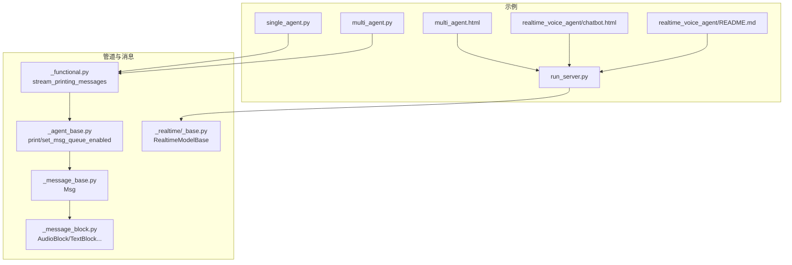
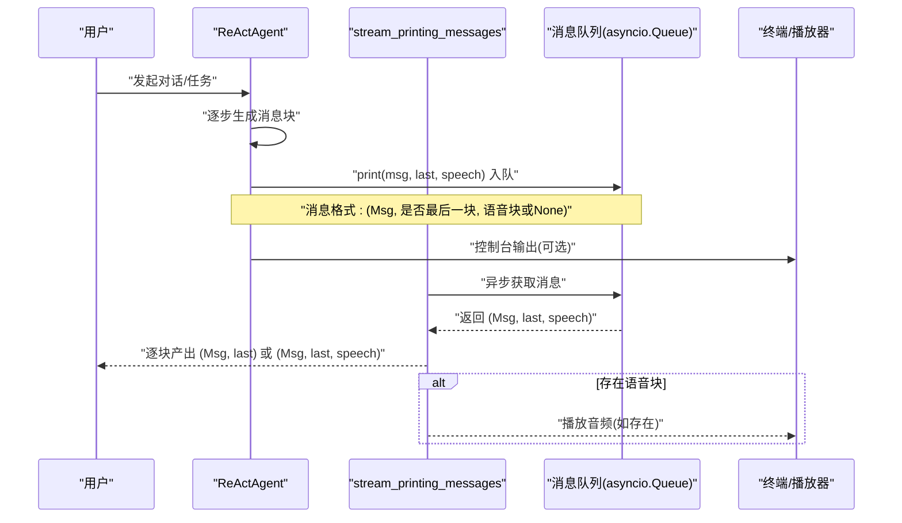
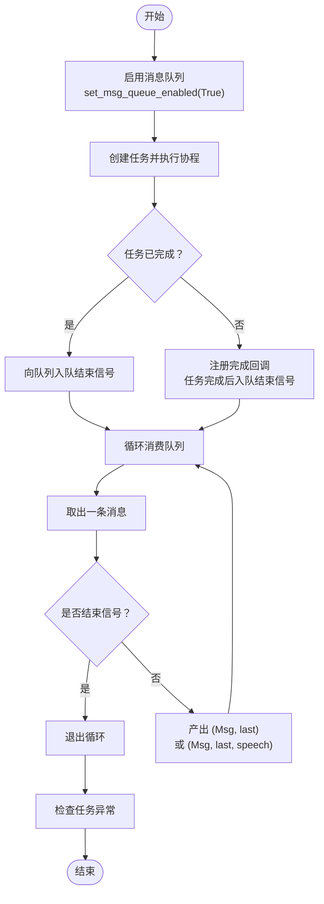
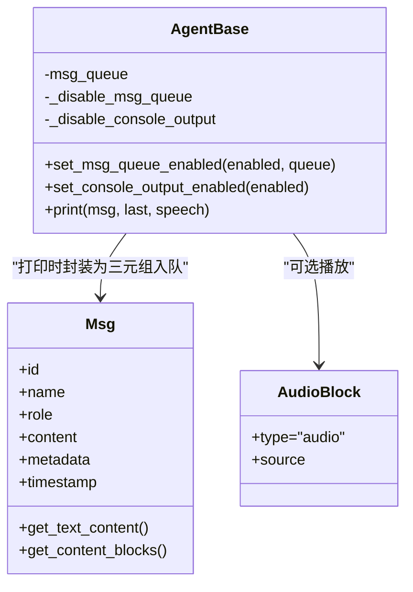
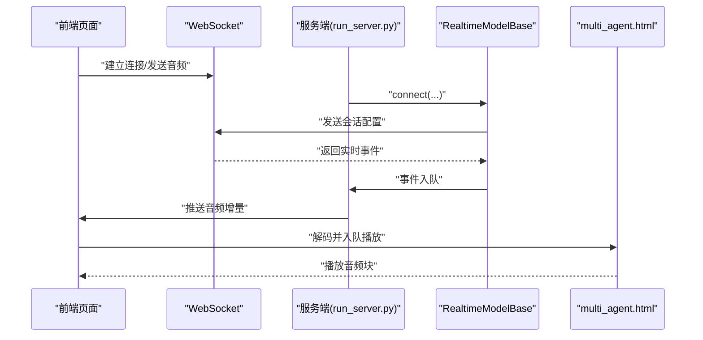
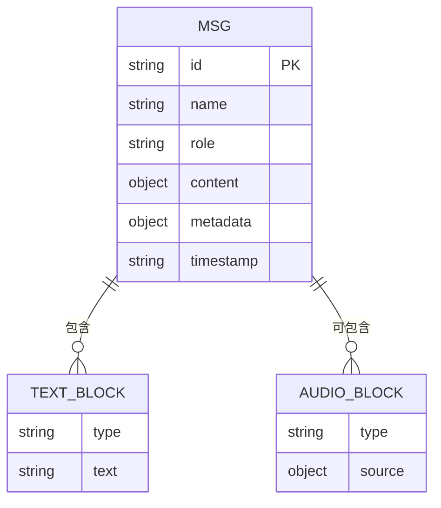
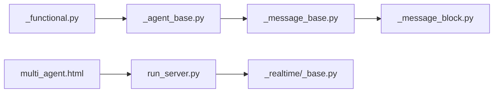

# 流式消息输出

<cite>
**本文引用的文件**
- [README.md](file://examples/functionality/stream_printing_messages/README.md)
- [single_agent.py](file://examples/functionality/stream_printing_messages/single_agent.py)
- [multi_agent.py](file://examples/functionality/stream_printing_messages/multi_agent.py)
- [_functional.py](file://src/agentscope/pipeline/_functional.py)
- [_agent_base.py](file://src/agentscope/agent/_agent_base.py)
- [_message_base.py](file://src/agentscope/message/_message_base.py)
- [_message_block.py](file://src/agentscope/message/_message_block.py)
- [_base.py](file://src/agentscope/realtime/_base.py)
- [multi_agent.html](file://examples/workflows/multiagent_realtime/multi_agent.html)
- [run_server.py](file://examples/workflows/multiagent_realtime/run_server.py)
- [README.md](file://examples/agent/realtime_voice_agent/README.md)
- [chatbot.html](file://examples/agent/realtime_voice_agent/chatbot.html)
- [pipeline_test.py](file://tests/pipeline_test.py)
</cite>

## 目录
1. [引言](#引言)
2. [项目结构](#项目结构)
3. [核心组件](#核心组件)
4. [架构总览](#架构总览)
5. [详细组件分析](#详细组件分析)
6. [依赖分析](#依赖分析)
7. [性能考虑](#性能考虑)
8. [故障排查指南](#故障排查指南)
9. [结论](#结论)
10. [附录](#附录)

## 引言
本技术文档聚焦于 AgentScope 的流式消息输出系统，系统性阐述流式消息的概念、应用场景与实现机制，包括实时数据传输、增量响应与用户体验优化；详解流式输出的实现路径（消息增量生成、缓冲区管理、状态同步策略）；对比流式消息与普通消息的数据结构与处理流程差异；给出配置项与控制参数说明；并通过多智能体并发输出与单智能体连续输出的实际示例，提供可操作的最佳实践与性能优化建议。

## 项目结构
围绕流式消息输出的关键文件与模块如下：
- 流式打印管道：src/agentscope/pipeline/_functional.py 中的 stream_printing_messages
- 智能体消息接口：src/agentscope/agent/_agent_base.py 中的 print 与消息队列启用逻辑
- 消息与内容块定义：src/agentscope/message/_message_base.py 与 _message_block.py
- 实时模型基础：src/agentscope/realtime/_base.py（WebSocket 连接与事件循环）
- 示例：examples/functionality/stream_printing_messages 下的单/多智能体示例
- 多智能体实时音频示例：examples/workflows/multiagent_realtime 与 examples/agent/realtime_voice_agent

**图示来源**
- [single_agent.py:1-63](file://examples/functionality/stream_printing_messages/single_agent.py#L1-L63)
- [multi_agent.py:1-63](file://examples/functionality/stream_printing_messages/multi_agent.py#L1-L63)
- [_functional.py:107-193](file://src/agentscope/pipeline/_functional.py#L107-L193)
- [_agent_base.py:200-399](file://src/agentscope/agent/_agent_base.py#L200-L399)
- [_message_base.py:21-242](file://src/agentscope/message/_message_base.py#L21-L242)
- [_message_block.py:1-129](file://src/agentscope/message/_message_block.py#L1-L129)
- [_base.py:1-174](file://src/agentscope/realtime/_base.py#L1-L174)
- [multi_agent.html:911-1074](file://examples/workflows/multiagent_realtime/multi_agent.html#L911-L1074)
- [run_server.py:151-189](file://examples/workflows/multiagent_realtime/run_server.py#L151-L189)
- [README.md:1-98](file://examples/agent/realtime_voice_agent/README.md#L1-L98)
- [chatbot.html:931-1144](file://examples/agent/realtime_voice_agent/chatbot.html#L931-L1144)

**章节来源**
- [README.md:1-28](file://examples/functionality/stream_printing_messages/README.md#L1-L28)
- [_functional.py:107-193](file://src/agentscope/pipeline/_functional.py#L107-L193)
- [_agent_base.py:200-399](file://src/agentscope/agent/_agent_base.py#L200-L399)
- [_message_base.py:21-242](file://src/agentscope/message/_message_base.py#L21-L242)
- [_message_block.py:1-129](file://src/agentscope/message/_message_block.py#L1-L129)
- [_base.py:1-174](file://src/agentscope/realtime/_base.py#L1-L174)
- [single_agent.py:1-63](file://examples/functionality/stream_printing_messages/single_agent.py#L1-L63)
- [multi_agent.py:1-63](file://examples/functionality/stream_printing_messages/multi_agent.py#L1-L63)
- [multi_agent.html:911-1074](file://examples/workflows/multiagent_realtime/multi_agent.html#L911-L1074)
- [run_server.py:151-189](file://examples/workflows/multiagent_realtime/run_server.py#L151-L189)
- [README.md:1-98](file://examples/agent/realtime_voice_agent/README.md#L1-L98)
- [chatbot.html:931-1144](file://examples/agent/realtime_voice_agent/chatbot.html#L931-L1144)

## 核心组件
- 流式打印管道：stream_printing_messages 负责在执行协程任务期间收集并逐条产出智能体打印的消息，支持按消息 id 聚合同一消息的多个增量块，并通过可选的语音块一并产出。
- 智能体打印接口：AgentBase.print 将消息入队（若启用消息队列），并在控制台输出文本与思考块；同时支持播放附加的音频块。
- 消息与内容块：Msg 定义消息结构（含 id、时间戳、角色、内容块等）；内容块类型包括文本、图像、音频、工具调用与结果等。
- 实时模型基础：RealtimeModelBase 提供 WebSocket 连接、接收事件循环与解析 API 消息的能力，支撑实时语音/音频流场景。

**章节来源**
- [_functional.py:107-193](file://src/agentscope/pipeline/_functional.py#L107-L193)
- [_agent_base.py:200-399](file://src/agentscope/agent/_agent_base.py#L200-L399)
- [_message_base.py:21-242](file://src/agentscope/message/_message_base.py#L21-L242)
- [_message_block.py:1-129](file://src/agentscope/message/_message_block.py#L1-L129)
- [_base.py:1-174](file://src/agentscope/realtime/_base.py#L1-L174)

## 架构总览
下图展示了从智能体打印消息到流式产出的整体链路，以及与实时模型/前端播放的衔接。

**图示来源**
- [_functional.py:107-193](file://src/agentscope/pipeline/_functional.py#L107-L193)
- [_agent_base.py:200-399](file://src/agentscope/agent/_agent_base.py#L200-L399)

## 详细组件分析

### 组件A：流式打印管道 stream_printing_messages
- 功能要点
  - 接收一组智能体与一个协程任务，启用统一消息队列以捕获所有智能体的打印消息。
  - 任务完成后向队列发送结束信号，消费端据此退出。
  - 逐条产出消息元组，支持是否携带语音块。
  - 对异常进行透传，保证错误不被吞没。
- 关键行为
  - 启用消息队列：set_msg_queue_enabled(True, queue)
  - 任务完成回调：任务完成后向队列放入结束信号
  - 消费循环：持续从队列取消息，遇到结束信号即终止
  - 异常处理：任务结束后检查异常并抛出

**图示来源**
- [_functional.py:107-193](file://src/agentscope/pipeline/_functional.py#L107-L193)

**章节来源**
- [_functional.py:107-193](file://src/agentscope/pipeline/_functional.py#L107-L193)
- [pipeline_test.py:396-438](file://tests/pipeline_test.py#L396-L438)

### 组件B：智能体打印接口 print 与消息队列
- 功能要点
  - print(msg, last, speech)：当消息队列启用时，将消息三元组入队；随后根据 last 参数决定是否输出最后块；同时播放语音块。
  - set_msg_queue_enabled(enabled, queue=None)：启用/禁用消息队列，支持复用外部队列；默认队列容量为 100。
  - 控制台输出：可选择关闭控制台输出，避免生产环境日志混乱。
- 数据结构
  - 入队元素：(Msg, last, speech)，其中 last 标识该增量块是否为某消息的最后一个块；speech 可为单个或多个音频块。
  - Msg 包含 id、name、role、content、metadata、timestamp 等字段；content 可为字符串或内容块列表。

**图示来源**
- [_agent_base.py:200-399](file://src/agentscope/agent/_agent_base.py#L200-L399)
- [_message_base.py:21-242](file://src/agentscope/message/_message_base.py#L21-L242)
- [_message_block.py:59-67](file://src/agentscope/message/_message_block.py#L59-L67)

**章节来源**
- [_agent_base.py:200-399](file://src/agentscope/agent/_agent_base.py#L200-L399)
- [_message_base.py:21-242](file://src/agentscope/message/_message_base.py#L21-L242)
- [_message_block.py:1-129](file://src/agentscope/message/_message_block.py#L1-L129)

### 组件C：实时模型基础与音频流
- 功能要点
  - RealtimeModelBase：负责与实时模型 API 建立 WebSocket 连接，维护接收事件循环，解析 API 返回并入队统一事件。
  - 多智能体实时音频示例：前端通过 WebSocket 接收音频增量，使用 Web Audio API 缓冲与播放；后端服务端聚合多个智能体的音频块并标记完成状态。
- 关键流程
  - 连接：connect(outgoing_queue, instructions, tools)
  - 接收：_receive_model_event_loop(outgoing_queue)
  - 解析：parse_api_message(message) -> ModelEvents
  - 前端播放：将 base64 音频解码为 Float32Array，按块写入输出流，空闲时填充静音，队列清空且标记完成后停止。

**图示来源**
- [_base.py:1-174](file://src/agentscope/realtime/_base.py#L1-L174)
- [run_server.py:151-189](file://examples/workflows/multiagent_realtime/run_server.py#L151-L189)
- [multi_agent.html:911-1074](file://examples/workflows/multiagent_realtime/multi_agent.html#L911-L1074)
- [README.md:1-98](file://examples/agent/realtime_voice_agent/README.md#L1-L98)
- [chatbot.html:931-1144](file://examples/agent/realtime_voice_agent/chatbot.html#L931-L1144)

**章节来源**
- [_base.py:1-174](file://src/agentscope/realtime/_base.py#L1-L174)
- [run_server.py:151-189](file://examples/workflows/multiagent_realtime/run_server.py#L151-L189)
- [multi_agent.html:911-1074](file://examples/workflows/multiagent_realtime/multi_agent.html#L911-L1074)
- [README.md:1-98](file://examples/agent/realtime_voice_agent/README.md#L1-L98)
- [chatbot.html:931-1144](file://examples/agent/realtime_voice_agent/chatbot.html#L931-L1144)

### 组件D：消息与内容块数据模型
- Msg：统一消息载体，支持字符串内容或内容块列表；提供文本提取与内容块过滤能力。
- 内容块：TextBlock、ThinkingBlock、ImageBlock、AudioBlock、VideoBlock、ToolUseBlock、ToolResultBlock。
- 应用：流式消息通常由多个文本块组成，最终由 last 标记标识完整消息；音频块用于实时语音/音频流播放。

**图示来源**
- [_message_base.py:21-242](file://src/agentscope/message/_message_base.py#L21-L242)
- [_message_block.py:9-129](file://src/agentscope/message/_message_block.py#L9-L129)

**章节来源**
- [_message_base.py:21-242](file://src/agentscope/message/_message_base.py#L21-L242)
- [_message_block.py:1-129](file://src/agentscope/message/_message_block.py#L1-L129)

## 依赖分析
- 流式打印管道依赖智能体的消息队列与打印接口，产出格式为 (Msg, last) 或 (Msg, last, speech)。
- 智能体依赖消息类与内容块类型，打印时将消息封装为三元组入队。
- 实时模型基础依赖 WebSocket 客户端与事件解析，前端依赖 Web Audio API 进行播放。

**图示来源**
- [_functional.py:107-193](file://src/agentscope/pipeline/_functional.py#L107-L193)
- [_agent_base.py:200-399](file://src/agentscope/agent/_agent_base.py#L200-L399)
- [_message_base.py:21-242](file://src/agentscope/message/_message_base.py#L21-L242)
- [_message_block.py:1-129](file://src/agentscope/message/_message_block.py#L1-L129)
- [_base.py:1-174](file://src/agentscope/realtime/_base.py#L1-L174)
- [run_server.py:151-189](file://examples/workflows/multiagent_realtime/run_server.py#L151-L189)
- [multi_agent.html:911-1074](file://examples/workflows/multiagent_realtime/multi_agent.html#L911-L1074)

**章节来源**
- [_functional.py:107-193](file://src/agentscope/pipeline/_functional.py#L107-L193)
- [_agent_base.py:200-399](file://src/agentscope/agent/_agent_base.py#L200-L399)
- [_message_base.py:21-242](file://src/agentscope/message/_message_base.py#L21-L242)
- [_message_block.py:1-129](file://src/agentscope/message/_message_block.py#L1-L129)
- [_base.py:1-174](file://src/agentscope/realtime/_base.py#L1-L174)
- [run_server.py:151-189](file://examples/workflows/multiagent_realtime/run_server.py#L151-L189)
- [multi_agent.html:911-1074](file://examples/workflows/multiagent_realtime/multi_agent.html#L911-L1074)

## 性能考虑
- 队列容量与背压
  - 默认消息队列容量为 100，可在 set_msg_queue_enabled 中传入自定义队列以精细控制容量与行为。
  - 当消费者处理速度慢于生产者时，队列可能积压；可通过降低模型/工具调用的输出速率或增加消费者并发缓解。
- 事件循环让渡
  - print 中在入队后主动让渡控制权，避免生产者独占事件循环，提升整体吞吐。
- 前端音频播放
  - 使用 ScriptProcessorNode 分块播放，按需填充静音，减少卡顿；空闲检测与及时停止可节省资源。
- I/O 与网络
  - 实时模型的 WebSocket 接收循环采用异步迭代，解析与入队分离，降低阻塞风险。
- 内存管理
  - 音频块采用 base64 字符串增量拼接，缓存播放器与前缀数据；在消息结束时清理播放器与前缀，避免泄漏。
- 错误恢复
  - 流式管道在消费完成后检查任务异常并抛出，确保上层感知；实时模型连接支持取消与关闭，便于重连与资源回收。

[本节为通用性能建议，无需特定文件引用]

## 故障排查指南
- 症状：流式输出未见增量
  - 检查是否调用 set_msg_queue_enabled(True, queue) 启用消息队列
  - 确认智能体在打印时传入 last=False 以表示非最终块
- 症状：异常被吞没
  - stream_printing_messages 在消费完成后检查任务异常并抛出；若未见异常，请确认任务是否正确 await
- 症状：音频播放卡顿或无声
  - 检查前端是否正确解码 base64 并按块写入；确认空闲时填充静音与及时停止
- 症状：实时模型连接失败
  - 检查 WebSocket 地址与请求头配置；确认会话配置已发送

**章节来源**
- [_functional.py:107-193](file://src/agentscope/pipeline/_functional.py#L107-L193)
- [_agent_base.py:200-399](file://src/agentscope/agent/_agent_base.py#L200-L399)
- [pipeline_test.py:396-438](file://tests/pipeline_test.py#L396-L438)
- [_base.py:1-174](file://src/agentscope/realtime/_base.py#L1-L174)

## 结论
AgentScope 的流式消息输出体系以统一的消息队列与打印接口为核心，结合流式管道与内容块模型，实现了从智能体到终端/播放器的增量交付。配合实时模型与前端播放，可构建低延迟、高体验的多模态交互。通过合理的队列容量、事件循环让渡、音频缓冲与异常透传，系统在复杂场景下仍能保持稳定与高效。

[本节为总结性内容，无需特定文件引用]

## 附录

### 实际应用示例与最佳实践
- 单智能体连续输出
  - 步骤：创建 ReActAgent，启用模型流式输出，调用 set_console_output_enabled(false) 避免终端混杂输出，使用 stream_printing_messages 异步遍历 (Msg, last)。
  - 参考：examples/functionality/stream_printing_messages/single_agent.py
- 多智能体并发输出
  - 步骤：使用 MsgHub 管理参与者，通过 stream_printing_messages 获取所有智能体的打印增量；根据消息 id 聚合同一消息的不同块。
  - 参考：examples/functionality/stream_printing_messages/multi_agent.py
- 多智能体实时音频
  - 步骤：服务端 RealtimeAgent 通过 WebSocket 推送音频增量；前端 multi_agent.html 解码并排队播放；run_server.py 聚合多个智能体的音频块并标记完成。
  - 参考：examples/workflows/multiagent_realtime/run_server.py、examples/workflows/multiagent_realtime/multi_agent.html
- 实时语音对话
  - 步骤：前端 chatbot.html 采集麦克风 PCM 数据，按块编码后通过 WebSocket 发送；后端实时模型解析并回推音频增量。
  - 参考：examples/agent/realtime_voice_agent/README.md、examples/agent/realtime_voice_agent/chatbot.html

**章节来源**
- [single_agent.py:1-63](file://examples/functionality/stream_printing_messages/single_agent.py#L1-L63)
- [multi_agent.py:1-63](file://examples/functionality/stream_printing_messages/multi_agent.py#L1-L63)
- [run_server.py:151-189](file://examples/workflows/multiagent_realtime/run_server.py#L151-L189)
- [multi_agent.html:911-1074](file://examples/workflows/multiagent_realtime/multi_agent.html#L911-L1074)
- [README.md:1-98](file://examples/agent/realtime_voice_agent/README.md#L1-L98)
- [chatbot.html:931-1144](file://examples/agent/realtime_voice_agent/chatbot.html#L931-L1144)

### 配置选项与控制参数
- 流式打印管道
  - agents：智能体列表
  - coroutine_task：待执行的协程任务
  - queue：可选的共享队列实例
  - end_signal：结束信号字符串，默认 "[END]"
  - yield_speech：是否产出语音块
- 智能体消息队列
  - set_msg_queue_enabled(enabled, queue=None)：启用/禁用消息队列，支持传入自定义队列
  - 默认队列容量：100
- 实时模型
  - WebSocket 连接参数：URL、头部、采样率等
  - 会话配置：instructions、tools 等

**章节来源**
- [_functional.py:107-193](file://src/agentscope/pipeline/_functional.py#L107-L193)
- [_agent_base.py:750-774](file://src/agentscope/agent/_agent_base.py#L750-L774)
- [_base.py:1-174](file://src/agentscope/realtime/_base.py#L1-L174)