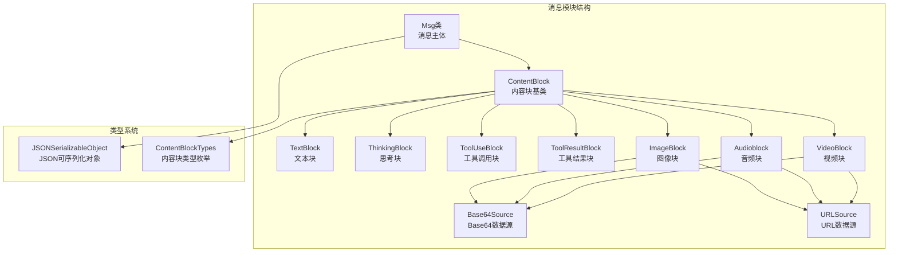
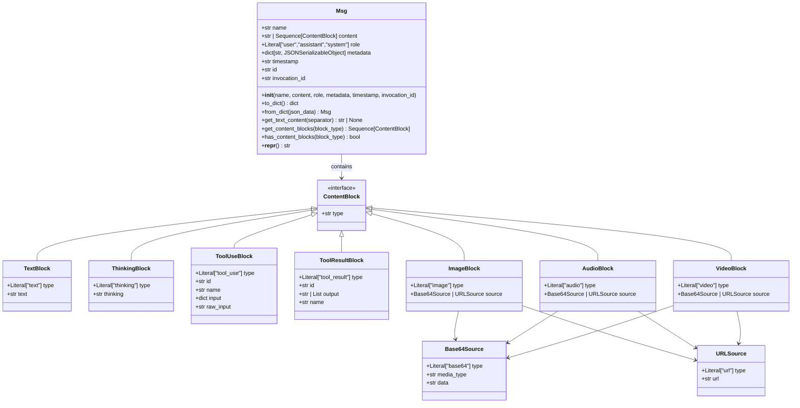
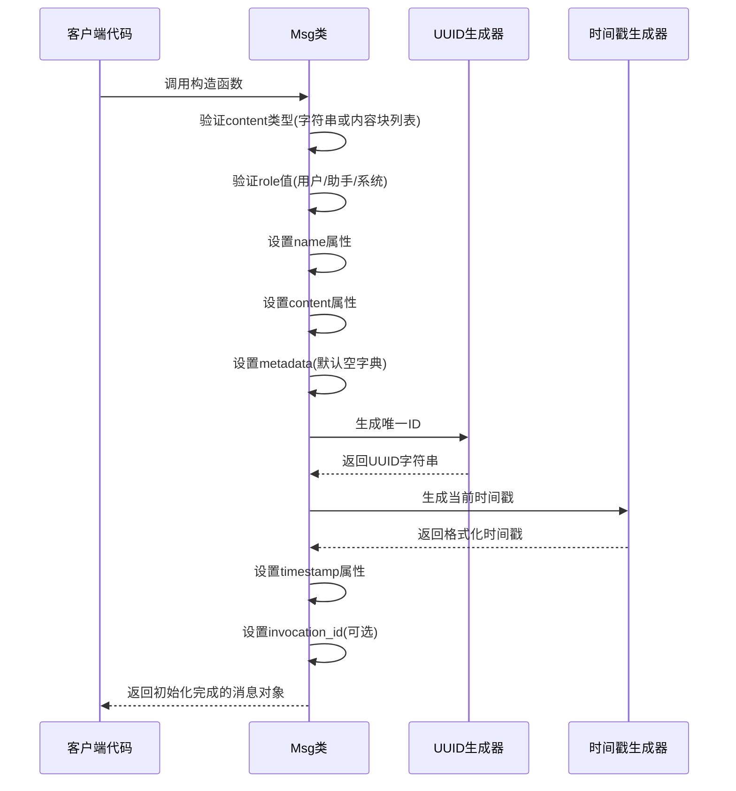
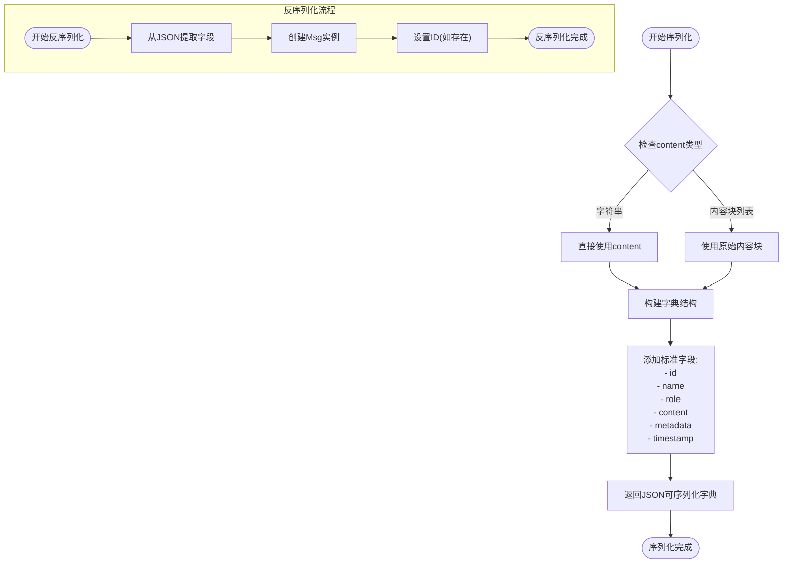
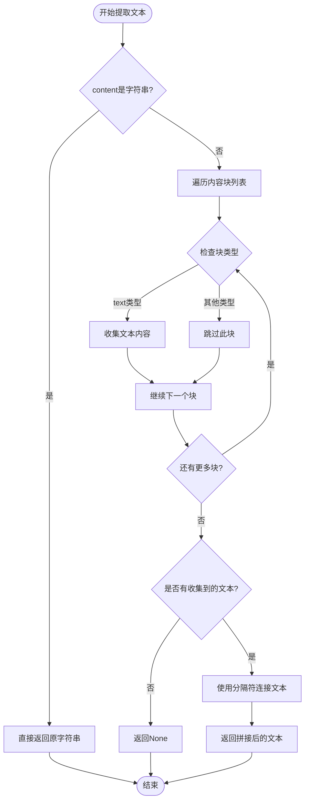
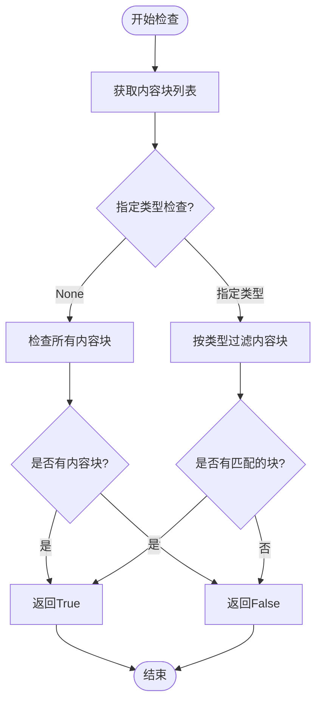
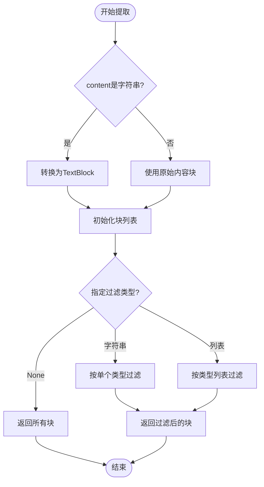
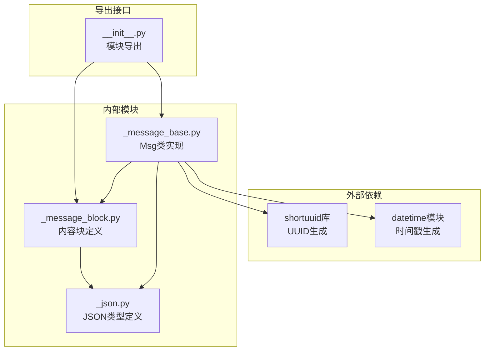

# 消息类设计

<cite>
**本文档引用的文件**
- [_message_base.py](file://src/agentscope/message/_message_base.py)
- [_message_block.py](file://src/agentscope/message/_message_block.py)
- [__init__.py](file://src/agentscope/message/__init__.py)
- [quickstart_message.py](file://docs/tutorial/zh_CN/src/quickstart_message.py)
- [_json.py](file://src/agentscope/types/_json.py)
</cite>

## 目录
1. [简介](#简介)
2. [项目结构](#项目结构)
3. [核心组件](#核心组件)
4. [架构概览](#架构概览)
5. [详细组件分析](#详细组件分析)
6. [依赖关系分析](#依赖关系分析)
7. [性能考虑](#性能考虑)
8. [故障排除指南](#故障排除指南)
9. [结论](#结论)

## 简介

AgentScope消息类(Msg)是该框架的核心数据结构，用于支持多模态数据、工具API、信息存储/交换和提示构建。Msg类设计遵循简洁性、可扩展性和类型安全性的原则，为AI代理系统提供了统一的消息抽象层。

该消息类支持多种内容格式，包括纯文本、多模态内容块、推理过程、工具调用和结果等，为复杂的AI交互场景提供了灵活的数据承载能力。

## 项目结构

AgentScope的消息系统主要由以下组件构成：

**图表来源**
- [_message_base.py:21-242](file://src/agentscope/message/_message_base.py#L21-L242)
- [_message_block.py:9-129](file://src/agentscope/message/_message_block.py#L9-L129)

**章节来源**
- [_message_base.py:1-242](file://src/agentscope/message/_message_base.py#L1-L242)
- [_message_block.py:1-129](file://src/agentscope/message/_message_block.py#L1-L129)

## 核心组件

### Msg类概述

Msg类是AgentScope消息系统的核心，提供了统一的消息抽象接口。其设计特点包括：

- **多模态支持**：支持纯文本和复杂内容块的混合内容
- **类型安全**：使用Python类型注解确保运行时类型正确性
- **序列化友好**：内置JSON序列化和反序列化支持
- **灵活的块处理**：提供内容块的提取、过滤和转换功能

### 主要属性设计

Msg类的核心属性设计体现了明确的职责分离和清晰的数据结构：

| 属性名 | 类型 | 必需性 | 描述 |
|--------|------|--------|------|
| `name` | `str` | 必需 | 消息发送者的名称/身份标识 |
| `content` | `str | Sequence[ContentBlock]` | 必需 | 消息内容，支持纯文本或内容块列表 |
| `role` | `Literal["user", "assistant", "system"]` | 必需 | 发送者角色，限制为预定义的三种角色 |
| `metadata` | `dict[str, JSONSerializableObject] | None` | 可选 | 元数据字典，用于结构化输出和额外信息 |
| `timestamp` | `str | None` | 可选 | 创建时间戳，默认自动生成 |
| `id` | `str` | 自动生成 | 唯一消息标识符，使用UUID生成 |
| `invocation_id` | `str | None` | 可选 | 相关的API调用ID，用于追踪 |

**章节来源**
- [_message_base.py:24-74](file://src/agentscope/message/_message_base.py#L24-L74)

## 架构概览

消息系统的整体架构采用分层设计，从基础的数据结构到高级的功能特性：

**图表来源**
- [_message_base.py:21-242](file://src/agentscope/message/_message_base.py#L21-L242)
- [_message_block.py:9-129](file://src/agentscope/message/_message_block.py#L9-L129)

## 详细组件分析

### 初始化过程与参数验证

Msg类的初始化过程体现了严格的数据验证和合理的默认值设置：

**图表来源**
- [_message_base.py:24-74](file://src/agentscope/message/_message_base.py#L24-L74)

初始化过程的关键特性：

1. **严格的类型验证**：确保content参数必须是字符串或内容块列表
2. **角色约束**：强制要求role必须是预定义的三个值之一
3. **默认值处理**：metadata默认为空字典，timestamp默认自动生成
4. **唯一标识**：使用shortuuid库生成全局唯一的消息ID

**章节来源**
- [_message_base.py:24-74](file://src/agentscope/message/_message_base.py#L24-L74)

### 序列化和反序列化实现

Msg类提供了完整的JSON序列化支持，确保消息可以在不同组件间安全传输：

**图表来源**
- [_message_base.py:75-99](file://src/agentscope/message/_message_base.py#L75-L99)

序列化方法的特点：

- **to_dict()方法**：将消息对象转换为JSON友好的字典结构
- **from_dict()类方法**：从JSON数据恢复消息对象
- **字段完整性**：包含所有必要信息，支持完全重建

**章节来源**
- [_message_base.py:75-99](file://src/agentscope/message/_message_base.py#L75-L99)

### 文本内容提取功能

get_text_content()方法提供了灵活的文本内容提取和拼接功能：

**图表来源**
- [_message_base.py:123-147](file://src/agentscope/message/_message_base.py#L123-L147)

文本提取的策略：

1. **简单字符串**：直接返回原始字符串内容
2. **多块内容**：自动识别所有text类型的块
3. **灵活分隔**：支持自定义分隔符，默认使用换行符
4. **空值处理**：如果没有文本内容，返回None

**章节来源**
- [_message_base.py:123-147](file://src/agentscope/message/_message_base.py#L123-L147)

### 内容块检查机制

has_content_blocks()方法提供了快速的内容块存在性检查：

**图表来源**
- [_message_base.py:101-121](file://src/agentscope/message/_message_base.py#L101-L121)

检查机制的优势：

- **类型安全**：支持所有预定义的内容块类型
- **灵活性**：可选择检查特定类型或任意内容块
- **性能优化**：基于长度判断，避免不必要的遍历

**章节来源**
- [_message_base.py:101-121](file://src/agentscope/message/_message_base.py#L101-L121)

### 内容块提取功能

get_content_blocks()方法提供了强大的内容块过滤和转换能力：

**图表来源**
- [_message_base.py:198-229](file://src/agentscope/message/_message_base.py#L198-L229)

提取功能的特性：

1. **智能转换**：字符串内容自动转换为TextBlock
2. **类型过滤**：支持单类型和多类型过滤
3. **类型安全**：使用Python类型注解确保返回类型正确
4. **灵活返回**：支持不同粒度的内容块提取

**章节来源**
- [_message_base.py:198-229](file://src/agentscope/message/_message_base.py#L198-L229)

## 依赖关系分析

消息系统各组件间的依赖关系体现了清晰的模块化设计：

**图表来源**
- [_message_base.py:8-18](file://src/agentscope/message/_message_base.py#L8-L18)
- [_message_block.py:5-6](file://src/agentscope/message/_message_block.py#L5-L6)
- [__init__.py:4-16](file://src/agentscope/message/__init__.py#L4-L16)

依赖关系的特点：

- **最小依赖**：仅依赖必要的外部库
- **类型安全**：通过类型注解确保接口契约
- **模块化**：清晰的模块边界和职责分离

**章节来源**
- [_message_base.py:8-18](file://src/agentscope/message/_message_base.py#L8-L18)
- [__init__.py:4-16](file://src/agentscope/message/__init__.py#L4-L16)

## 性能考虑

消息类在设计时充分考虑了性能优化：

### 内存效率
- **惰性处理**：内容块的提取和转换只在需要时进行
- **类型缓存**：使用类型注解减少运行时类型检查开销
- **字符串优化**：纯文本内容直接存储，避免不必要的包装

### 计算效率
- **快速检查**：has_content_blocks()方法通过长度判断实现O(1)检查
- **早期返回**：get_text_content()在找到第一个文本块后继续遍历，但避免重复处理
- **批量操作**：get_content_blocks()支持批量过滤，减少多次遍历

### 序列化性能
- **直接映射**：to_dict()方法提供直接的字段映射，避免复杂的转换逻辑
- **延迟计算**：from_dict()方法只在需要时解析嵌套结构

## 故障排除指南

### 常见问题及解决方案

**问题1：内容类型错误**
- **症状**：初始化时抛出断言错误
- **原因**：content参数不是字符串也不是内容块列表
- **解决**：确保content参数符合类型注解要求

**问题2：角色值无效**
- **症状**：初始化时断言失败
- **原因**：role参数不在允许的值集合中
- **解决**：使用"user"、"assistant"或"system"之一

**问题3：序列化兼容性问题**
- **症状**：to_dict()返回的对象无法被JSON库处理
- **原因**：metadata中包含非JSON可序列化对象
- **解决**：确保metadata只包含JSONPrimitive或JSONSerializableObject

**问题4：内容块类型不匹配**
- **症状**：get_content_blocks()返回意外结果
- **原因**：内容块的type字段与期望不符
- **解决**：检查内容块的type字段设置

**章节来源**
- [_message_base.py:54-62](file://src/agentscope/message/_message_base.py#L54-L62)
- [_message_base.py:75-99](file://src/agentscope/message/_message_base.py#L75-L99)

## 结论

AgentScope消息类(Msg)通过精心设计的架构和实现，为AI代理系统提供了强大而灵活的消息抽象能力。其核心优势包括：

1. **类型安全**：完整的类型注解确保运行时正确性
2. **多模态支持**：灵活的内容格式支持各种AI应用场景
3. **序列化友好**：内置的JSON支持简化了消息传输和存储
4. **性能优化**：高效的算法和数据结构设计
5. **易于扩展**：清晰的接口设计支持未来功能扩展

该消息类的设计充分体现了现代软件工程的最佳实践，为构建复杂的AI代理系统奠定了坚实的基础。