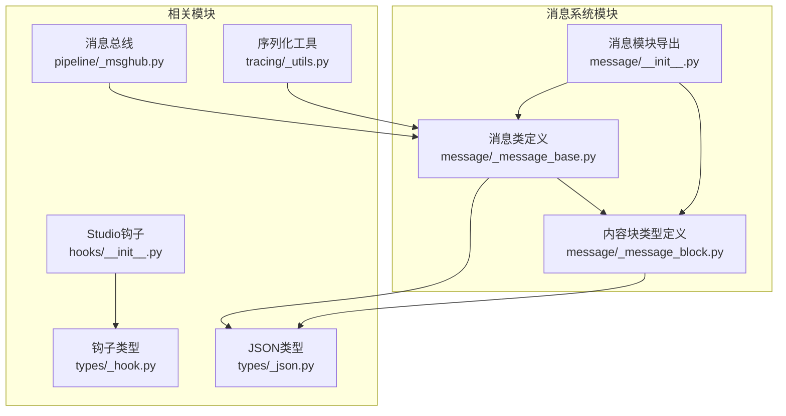
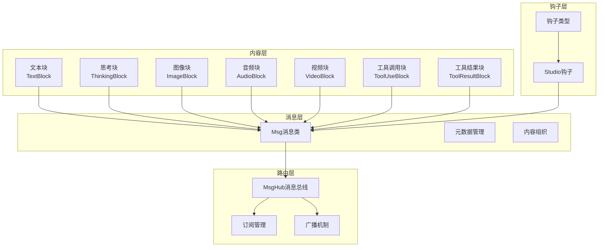
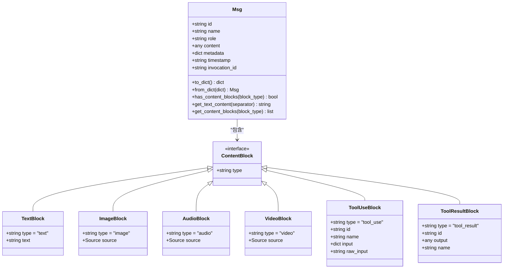
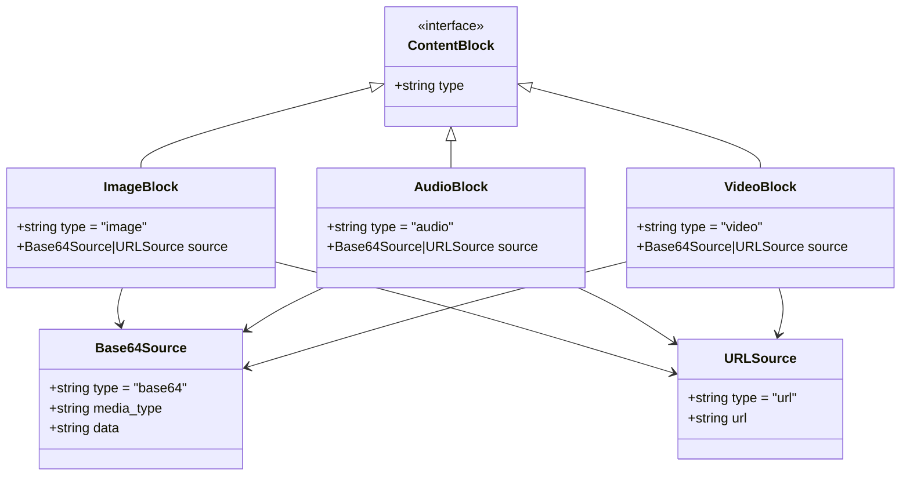
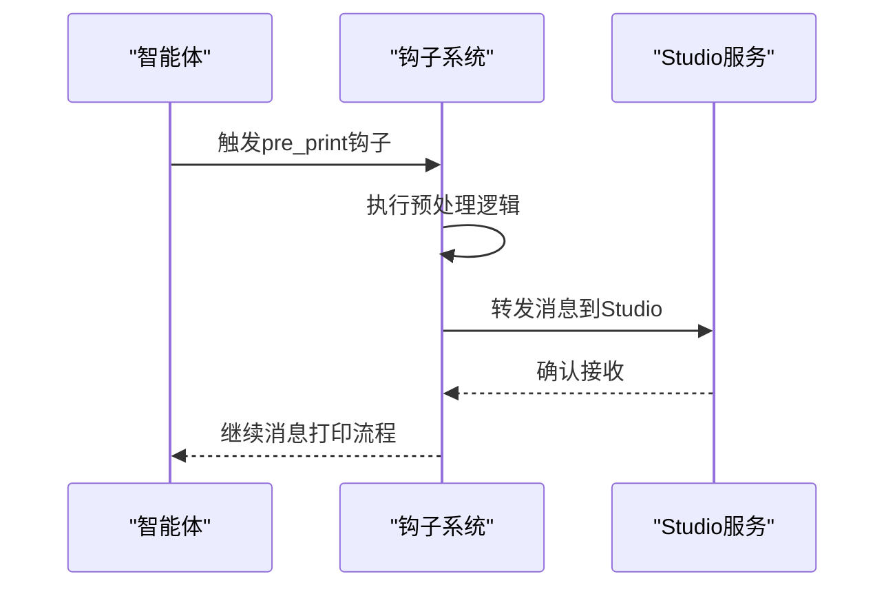
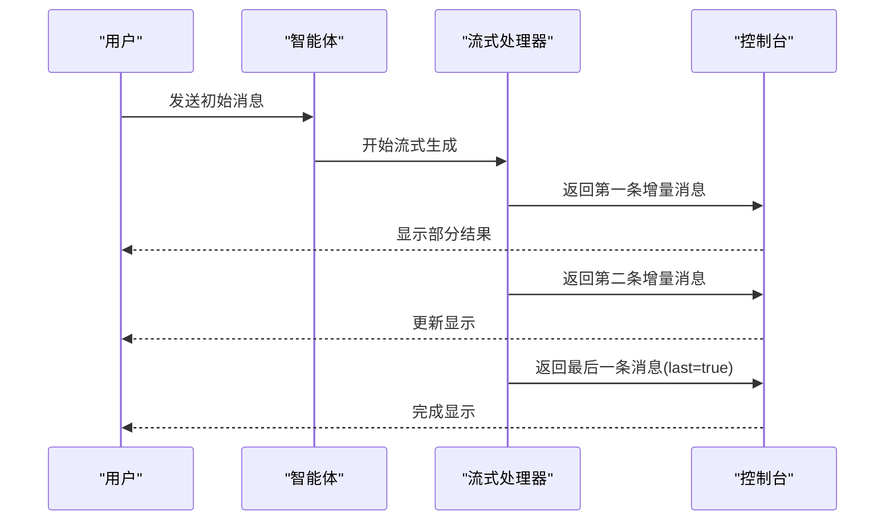
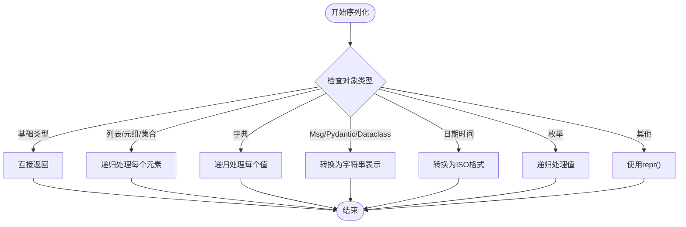
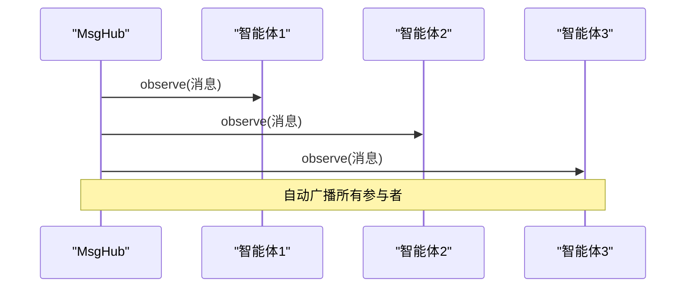
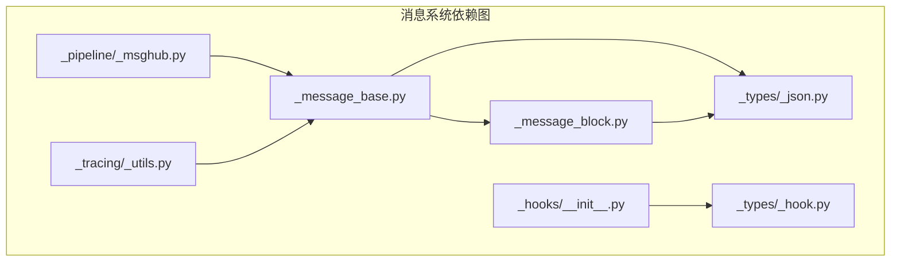

# 消息系统

<cite>
**本文引用的文件**
- [消息模块导出](file://src/agentscope/message/__init__.py)
- [消息类定义](file://src/agentscope/message/_message_base.py)
- [内容块类型定义](file://src/agentscope/message/_message_block.py)
- [钩子类型定义](file://src/agentscope/types/_hook.py)
- [JSON可序列化类型](file://src/agentscope/types/_json.py)
- [Studio钩子](file://src/agentscope/hooks/__init__.py)
- [消息总线](file://src/agentscope/pipeline/_msghub.py)
- [消息序列化工具](file://src/agentscope/tracing/_utils.py)
- [单智能体流式打印示例](file://examples/functionality/stream_printing_messages/single_agent.py)
- [多智能体流式打印示例](file://examples/functionality/stream_printing_messages/multi_agent.py)
- [单智能体流式打印测试](file://tests/pipeline_test.py)
- [Gemini格式化器媒体块处理](file://src/agentscope/formatter/_gemini_formatter.py)
- [Ollama格式化器工具结果图片处理](file://tests/formatter_ollama_test.py)
- [Gemini格式化器工具结果图片处理](file://tests/formatter_gemini_test.py)
</cite>

## 目录
1. [简介](#简介)
2. [项目结构](#项目结构)
3. [核心组件](#核心组件)
4. [架构概览](#架构概览)
5. [详细组件分析](#详细组件分析)
6. [依赖分析](#依赖分析)
7. [性能考虑](#性能考虑)
8. [故障排除指南](#故障排除指南)
9. [结论](#结论)
10. [附录](#附录)

## 简介
本文件为AgentScope消息系统的完整技术文档，重点涵盖以下方面：
- Msg消息类的设计架构：消息结构、元数据管理、内容组织方式
- ContentBlock内容块的多模态支持：文本、图像、音频、视频内容块的实现机制、格式转换、渲染处理
- 消息钩子机制：钩子的注册、执行时机、数据传递
- 流式消息输出：增量传输、缓冲管理、状态同步
- 消息序列化：JSON编码、跨进程传输
- 消息路由：智能体间的消息传递、广播机制、过滤规则
- 使用示例与最佳实践

## 项目结构
消息系统位于agentscope/message包中，核心文件包括消息类定义、内容块类型定义以及相关的工具模块。

**图表来源**
- [消息模块导出:1-32](file://src/agentscope/message/__init__.py#L1-L32)
- [消息类定义:1-242](file://src/agentscope/message/_message_base.py#L1-L242)
- [内容块类型定义:1-129](file://src/agentscope/message/_message_block.py#L1-L129)

**章节来源**
- [消息模块导出:1-32](file://src/agentscope/message/__init__.py#L1-L32)

## 核心组件
消息系统由三个核心组件构成：
- Msg消息类：统一的消息载体，支持字符串内容和多模态内容块
- ContentBlock内容块：多模态内容的标准化表示
- 消息总线MsgHub：智能体间的消息广播与订阅

**章节来源**
- [消息类定义:21-242](file://src/agentscope/message/_message_base.py#L21-L242)
- [内容块类型定义:9-129](file://src/agentscope/message/_message_block.py#L9-L129)
- [消息总线:14-157](file://src/agentscope/pipeline/_msghub.py#L14-L157)

## 架构概览
消息系统采用分层设计，从底层的内容块到上层的消息类，再到消息总线的路由功能，形成完整的消息处理链路。

**图表来源**
- [内容块类型定义:9-129](file://src/agentscope/message/_message_block.py#L9-L129)
- [消息类定义:21-242](file://src/agentscope/message/_message_base.py#L21-L242)
- [消息总线:14-157](file://src/agentscope/pipeline/_msghub.py#L14-L157)
- [钩子类型定义:5-25](file://src/agentscope/types/_hook.py#L5-L25)

## 详细组件分析

### Msg消息类设计
Msg是消息系统的核心类，负责封装消息的所有属性和行为。

#### 数据结构设计
Msg类包含以下关键字段：
- 基础信息：id、name、role、timestamp
- 内容：content（支持字符串或内容块列表）
- 元数据：metadata字典
- 调用标识：invocation_id

#### 内容组织机制
Msg提供了多种内容访问和操作方法：

**图表来源**
- [消息类定义:21-242](file://src/agentscope/message/_message_base.py#L21-L242)
- [内容块类型定义:9-129](file://src/agentscope/message/_message_block.py#L9-L129)

#### 序列化机制
Msg提供完整的JSON序列化支持：
- to_dict()：将消息对象转换为字典格式
- from_dict()：从字典数据恢复消息对象
- 支持嵌套内容块的递归序列化

**章节来源**
- [消息类定义:75-99](file://src/agentscope/message/_message_base.py#L75-L99)

### ContentBlock内容块多模态支持
内容块系统支持七种不同类型的多模态内容：

#### 文本内容块
TextBlock是最基础的内容块类型，用于承载纯文本内容。

#### 思考内容块
ThinkingBlock用于表示智能体的内部思考过程，通常在消息广播时会被过滤掉。

#### 多媒体内容块
ImageBlock、AudioBlock、VideoBlock支持两种源类型：
- Base64Source：直接嵌入的Base64编码数据
- URLSource：远程资源链接

**图表来源**
- [内容块类型定义:26-76](file://src/agentscope/message/_message_block.py#L26-L76)

#### 工具交互内容块
ToolUseBlock和ToolResultBlock专门用于智能体工具调用的输入输出表示。

**章节来源**
- [内容块类型定义:79-129](file://src/agentscope/message/_message_block.py#L79-L129)

### 消息钩子机制
AgentScope实现了灵活的钩子系统，支持在消息生命周期的关键节点插入自定义逻辑。

#### 钩子类型体系
钩子系统支持多种执行时机：
- 预回复钩子：pre_reply
- 后回复钩子：post_reply  
- 预打印钩子：pre_print
- 后打印钩子：post_print
- 预观察钩子：pre_observe
- 后观察钩子：post_observe
- ReAct扩展钩子：pre_reasoning、post_reasoning、pre_acting、post_acting

#### Studio钩子集成
系统提供了与AgentScope Studio的集成钩子：
- as_studio_forward_message_pre_print_hook：在消息打印前转发到Studio
- 自动注册机制：通过_equip_as_studio_hooks函数完成钩子绑定

**图表来源**
- [Studio钩子:17-29](file://src/agentscope/hooks/__init__.py#L17-L29)
- [钩子类型定义:5-25](file://src/agentscope/types/_hook.py#L5-L25)

**章节来源**
- [Studio钩子:1-30](file://src/agentscope/hooks/__init__.py#L1-L30)
- [钩子类型定义:1-26](file://src/agentscope/types/_hook.py#L1-L26)

### 流式消息输出实现
AgentScope提供了完整的流式消息处理能力，支持增量传输和状态同步。

#### 流式处理流程

**图表来源**
- [单智能体流式打印示例:54-59](file://examples/functionality/stream_printing_messages/single_agent.py#L54-L59)
- [多智能体流式打印示例:55-59](file://examples/functionality/stream_printing_messages/multi_agent.py#L55-L59)

#### 关键特性
- 增量传输：支持模型API的流式响应
- 状态同步：通过last参数指示消息是否为最终版本
- 多智能体协作：支持多个智能体的并发流式输出

**章节来源**
- [单智能体流式打印示例:1-63](file://examples/functionality/stream_printing_messages/single_agent.py#L1-L63)
- [多智能体流式打印示例:1-63](file://examples/functionality/stream_printing_messages/multi_agent.py#L1-L63)
- [单智能体流式打印测试:379-400](file://tests/pipeline_test.py#L379-L400)

### 消息序列化处理
系统提供了完善的消息序列化机制，确保消息可以在不同组件间正确传输。

#### 序列化策略

**图表来源**
- [消息序列化工具:15-54](file://src/agentscope/tracing/_utils.py#L15-L54)

#### 跨进程传输
- JSON兼容性：所有序列化结果都是JSON可序列化的
- 类型安全：通过JSONSerializableObject约束确保传输安全
- 错误处理：对不可序列化对象提供降级处理

**章节来源**
- [消息序列化工具:15-54](file://src/agentscope/tracing/_utils.py#L15-L54)
- [JSON可序列化类型:14-21](file://src/agentscope/types/_json.py#L14-L21)

### 消息路由设计
MsgHub提供了智能体间的消息广播与订阅机制。

#### 广播机制

**图表来源**
- [消息总线:130-139](file://src/agentscope/pipeline/_msghub.py#L130-L139)

#### 订阅管理
- 动态订阅：支持运行时添加或删除参与者
- 过滤规则：自动过滤思考块内容
- 生命周期管理：上下文管理器自动清理订阅关系

**章节来源**
- [消息总线:73-81](file://src/agentscope/pipeline/_msghub.py#L73-L81)
- [消息总线:89-108](file://src/agentscope/pipeline/_msghub.py#L89-L108)
- [消息总线:130-157](file://src/agentscope/pipeline/_msghub.py#L130-L157)

## 依赖分析

**图表来源**
- [消息类定义:1-242](file://src/agentscope/message/_message_base.py#L1-L242)
- [内容块类型定义:1-129](file://src/agentscope/message/_message_block.py#L1-L129)
- [JSON可序列化类型:1-22](file://src/agentscope/types/_json.py#L1-L22)
- [钩子类型定义:1-26](file://src/agentscope/types/_hook.py#L1-L26)
- [Studio钩子:1-30](file://src/agentscope/hooks/__init__.py#L1-L30)
- [消息总线:1-157](file://src/agentscope/pipeline/_msghub.py#L1-L157)
- [消息序列化工具:1-54](file://src/agentscope/tracing/_utils.py#L1-L54)

**章节来源**
- [消息类定义:1-242](file://src/agentscope/message/_message_base.py#L1-L242)
- [内容块类型定义:1-129](file://src/agentscope/message/_message_block.py#L1-L129)

## 性能考虑
- 内存优化：内容块采用TypedDict定义，减少内存开销
- 序列化效率：针对常见类型提供快速路径，避免不必要的转换
- 广播优化：批量消息处理，减少重复序列化
- 流式处理：增量传输避免大对象的完整缓存

## 故障排除指南
- 消息内容类型错误：确保content参数为字符串或内容块列表
- 序列化失败：检查自定义对象是否可转换为JSON兼容格式
- 钩子未生效：确认钩子类型是否在supported_hook_types中
- 流式输出异常：验证模型API的流式支持配置

**章节来源**
- [消息类定义:54-57](file://src/agentscope/message/_message_base.py#L54-L57)
- [Studio钩子:688-700](file://src/agentscope/hooks/__init__.py#L688-L700)

## 结论
AgentScope消息系统通过模块化设计实现了强大的多模态消息处理能力。其核心优势包括：
- 灵活的内容块系统支持丰富的多模态内容
- 完整的钩子机制提供可扩展的插件架构
- 高效的流式处理满足实时交互需求
- 强大的消息路由支持复杂的多智能体协作场景

## 附录

### 使用示例
系统提供了完整的使用示例，展示各种消息处理场景的最佳实践。

**章节来源**
- [单智能体流式打印示例:21-63](file://examples/functionality/stream_printing_messages/single_agent.py#L21-L63)
- [多智能体流式打印示例:27-63](file://examples/functionality/stream_printing_messages/multi_agent.py#L27-L63)

### 最佳实践
- 内容块优先：优先使用内容块而非纯文本进行多模态表达
- 钩子谨慎使用：避免在钩子中执行耗时操作影响消息传递性能
- 流式处理：对于长文本生成启用流式模式提升用户体验
- 序列化安全：确保自定义对象具有明确的序列化策略