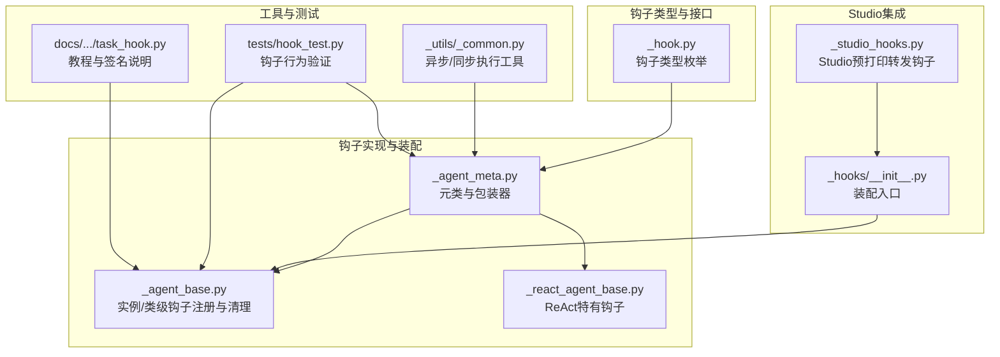
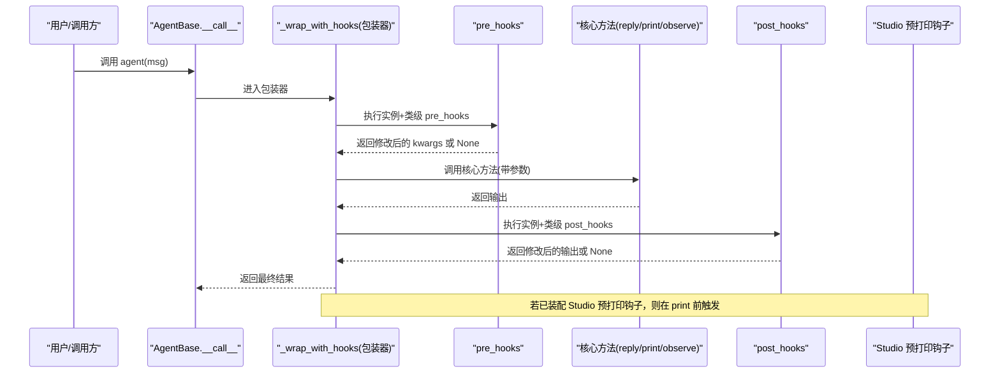
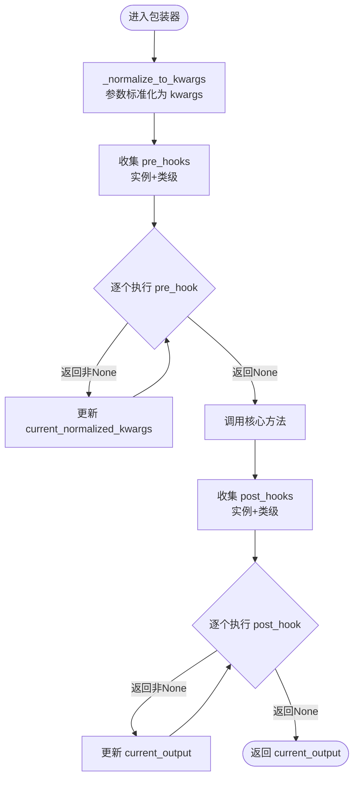
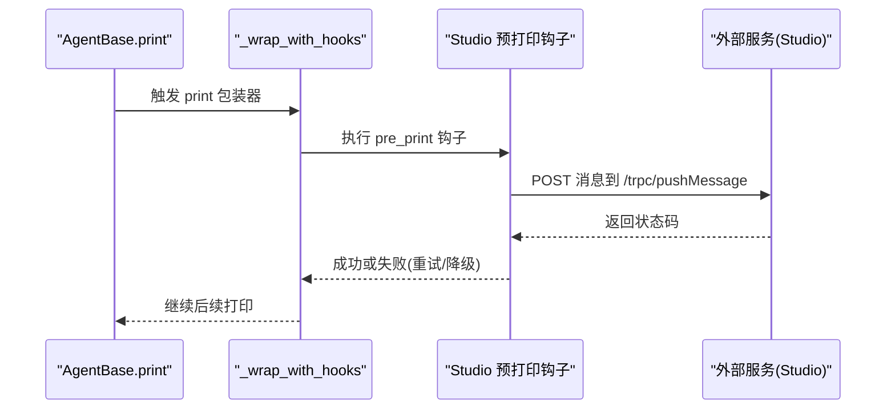
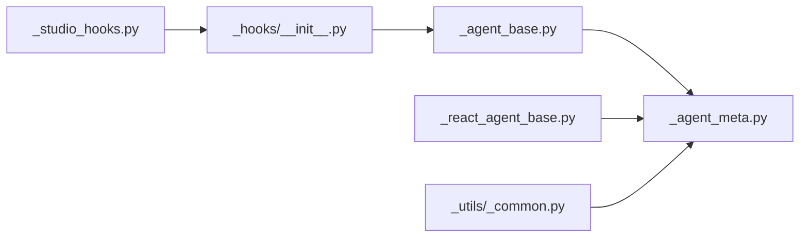

# 消息钩子机制

<cite>
**本文引用的文件列表**
- [src/agentscope/hooks/_studio_hooks.py](file://src/agentscope/hooks/_studio_hooks.py)
- [src/agentscope/hooks/__init__.py](file://src/agentscope/hooks/__init__.py)
- [src/agentscope/types/_hook.py](file://src/agentscope/types/_hook.py)
- [src/agentscope/agent/_agent_base.py](file://src/agentscope/agent/_agent_base.py)
- [src/agentscope/agent/_agent_meta.py](file://src/agentscope/agent/_agent_meta.py)
- [src/agentscope/agent/_react_agent_base.py](file://src/agentscope/agent/_react_agent_base.py)
- [src/agentscope/_utils/_common.py](file://src/agentscope/_utils/_common.py)
- [tests/hook_test.py](file://tests/hook_test.py)
- [docs/tutorial/zh_CN/src/task_hook.py](file://docs/tutorial/zh_CN/src/task_hook.py)
- [docs/tutorial/en/src/task_hook.py](file://docs/tutorial/en/src/task_hook.py)
</cite>

## 目录
1. [简介](#简介)
2. [项目结构](#项目结构)
3. [核心组件](#核心组件)
4. [架构总览](#架构总览)
5. [详细组件分析](#详细组件分析)
6. [依赖关系分析](#依赖关系分析)
7. [性能考量](#性能考量)
8. [故障排查指南](#故障排查指南)
9. [结论](#结论)
10. [附录](#附录)

## 简介
本文件系统性阐述 AgentScope 的消息钩子机制，重点覆盖：
- 钩子系统的设计理念与执行流程（注册、触发时机、执行顺序）
- StudioHooks 的具体实现（生命周期管理、数据传递、错误处理）
- 钩子接口定义与实现规范（函数签名、参数传递、返回值处理）
- 钩子在消息处理流程中的作用（发送前后钩子、中间件集成、扩展点）
- 自定义钩子的创建、注册与调试示例
- 性能优化建议与常见问题解决方案

## 项目结构
与钩子机制直接相关的核心模块与文件：
- 钩子类型与常量：types/_hook.py
- 钩子实现与装配：agent/_agent_meta.py、agent/_agent_base.py
- ReActAgent 特有钩子：agent/_react_agent_base.py
- Studio 集成钩子：hooks/_studio_hooks.py、hooks/__init__.py
- 工具函数：_utils/_common.py（异步/同步钩子执行）
- 教程与示例：docs/tutorial/*/task_hook.py
- 单元测试：tests/hook_test.py

图表来源
- [src/agentscope/types/_hook.py:1-26](file://src/agentscope/types/_hook.py#L1-L26)
- [src/agentscope/agent/_agent_meta.py:55-156](file://src/agentscope/agent/_agent_meta.py#L55-L156)
- [src/agentscope/agent/_agent_base.py:30-775](file://src/agentscope/agent/_agent_base.py#L30-L775)
- [src/agentscope/agent/_react_agent_base.py:12-117](file://src/agentscope/agent/_react_agent_base.py#L12-L117)
- [src/agentscope/hooks/_studio_hooks.py:1-59](file://src/agentscope/hooks/_studio_hooks.py#L1-L59)
- [src/agentscope/hooks/__init__.py:1-30](file://src/agentscope/hooks/__init__.py#L1-L30)
- [src/agentscope/_utils/_common.py:133-156](file://src/agentscope/_utils/_common.py#L133-L156)
- [tests/hook_test.py:1-1161](file://tests/hook_test.py#L1-L1161)
- [docs/tutorial/zh_CN/src/task_hook.py:1-287](file://docs/tutorial/zh_CN/src/task_hook.py#L1-L287)
- [docs/tutorial/en/src/task_hook.py:1-292](file://docs/tutorial/en/src/task_hook.py#L1-L292)

章节来源
- [src/agentscope/types/_hook.py:1-26](file://src/agentscope/types/_hook.py#L1-L26)
- [src/agentscope/agent/_agent_meta.py:55-156](file://src/agentscope/agent/_agent_meta.py#L55-L156)
- [src/agentscope/agent/_agent_base.py:30-775](file://src/agentscope/agent/_agent_base.py#L30-L775)
- [src/agentscope/agent/_react_agent_base.py:12-117](file://src/agentscope/agent/_react_agent_base.py#L12-L117)
- [src/agentscope/hooks/_studio_hooks.py:1-59](file://src/agentscope/hooks/_studio_hooks.py#L1-L59)
- [src/agentscope/hooks/__init__.py:1-30](file://src/agentscope/hooks/__init__.py#L1-L30)
- [src/agentscope/_utils/_common.py:133-156](file://src/agentscope/_utils/_common.py#L133-L156)
- [tests/hook_test.py:1-1161](file://tests/hook_test.py#L1-L1161)
- [docs/tutorial/zh_CN/src/task_hook.py:1-287](file://docs/tutorial/zh_CN/src/task_hook.py#L1-L287)
- [docs/tutorial/en/src/task_hook.py:1-292](file://docs/tutorial/en/src/task_hook.py#L1-L292)

## 核心组件
- 钩子类型与约束：定义了 AgentBase 支持的钩子类型集合，ReActAgentBase 在此基础上扩展推理与行动阶段的钩子。
- 元类与包装器：通过元类在运行时动态包装核心方法（reply、print、observe），并在其中注入 pre/post 钩子链。
- 实例/类级钩子注册：提供统一的注册、移除、清理接口，支持按实例或类级别生效。
- Studio 集成钩子：提供 Studio 预打印转发钩子，将消息实时推送到 Studio 平台。
- 异步/同步钩子执行：统一调度异步与同步钩子，保证兼容性与一致性。

章节来源
- [src/agentscope/types/_hook.py:1-26](file://src/agentscope/types/_hook.py#L1-L26)
- [src/agentscope/agent/_agent_meta.py:55-156](file://src/agentscope/agent/_agent_meta.py#L55-L156)
- [src/agentscope/agent/_agent_base.py:533-700](file://src/agentscope/agent/_agent_base.py#L533-L700)
- [src/agentscope/agent/_react_agent_base.py:12-117](file://src/agentscope/agent/_react_agent_base.py#L12-L117)
- [src/agentscope/hooks/_studio_hooks.py:12-59](file://src/agentscope/hooks/_studio_hooks.py#L12-L59)
- [src/agentscope/hooks/__init__.py:17-29](file://src/agentscope/hooks/__init__.py#L17-L29)
- [src/agentscope/_utils/_common.py:133-156](file://src/agentscope/_utils/_common.py#L133-L156)

## 架构总览
下图展示钩子系统在 Agent 生命周期中的关键节点与调用路径。

图表来源
- [src/agentscope/agent/_agent_base.py:448-467](file://src/agentscope/agent/_agent_base.py#L448-L467)
- [src/agentscope/agent/_agent_meta.py:55-156](file://src/agentscope/agent/_agent_meta.py#L55-L156)
- [src/agentscope/hooks/__init__.py:17-29](file://src/agentscope/hooks/__init__.py#L17-L29)
- [src/agentscope/hooks/_studio_hooks.py:12-59](file://src/agentscope/hooks/_studio_hooks.py#L12-L59)

## 详细组件分析

### 组件一：钩子类型与接口规范
- 支持的钩子类型：
  - AgentBase：pre_reply、post_reply、pre_print、post_print、pre_observe、post_observe
  - ReActAgentBase：在上述基础上新增 pre_reasoning、post_reasoning、pre_acting、post_acting
- 接口签名规范：
  - 前置钩子（pre_*）：接收 self 与 kwargs（统一为字典），返回修改后的 kwargs 或 None
  - 后置钩子（post_*）：接收 self、kwargs、output，返回修改后的 output 或 None
- 参数传递与返回值处理：
  - 所有核心方法的位置参数与关键字参数会被绑定为单一 kwargs 字典传入钩子
  - 非 None 返回值会传递给下一个钩子或核心方法；若全部返回 None，则使用原始参数副本

章节来源
- [src/agentscope/types/_hook.py:5-25](file://src/agentscope/types/_hook.py#L5-L25)
- [src/agentscope/agent/_react_agent_base.py:21-33](file://src/agentscope/agent/_react_agent_base.py#L21-L33)
- [docs/tutorial/zh_CN/src/task_hook.py:70-148](file://docs/tutorial/zh_CN/src/task_hook.py#L70-L148)
- [docs/tutorial/en/src/task_hook.py:70-148](file://docs/tutorial/en/src/task_hook.py#L70-L148)

### 组件二：元类与包装器（钩子装配）
- 元类职责：
  - 在类构建时自动包装核心方法（reply、print、observe），以及 ReAct 的 _reasoning、_acting
  - 生成钩子守卫属性，防止多重继承导致的重复执行
- 包装器逻辑要点：
  - 将原方法参数标准化为 kwargs 字典
  - 依次执行实例级与类级 pre_hooks，支持链式传递与 None 覆盖
  - 执行核心方法并捕获异常，确保守卫标志正确清理
  - 依次执行实例级与类级 post_hooks，同样支持链式传递与 None 覆盖

图表来源
- [src/agentscope/agent/_agent_meta.py:21-53](file://src/agentscope/agent/_agent_meta.py#L21-L53)
- [src/agentscope/agent/_agent_meta.py:55-156](file://src/agentscope/agent/_agent_meta.py#L55-L156)
- [src/agentscope/_utils/_common.py:133-156](file://src/agentscope/_utils/_common.py#L133-L156)

章节来源
- [src/agentscope/agent/_agent_meta.py:55-156](file://src/agentscope/agent/_agent_meta.py#L55-L156)

### 组件三：实例/类级钩子注册与生命周期管理
- 注册与移除：
  - 实例级：register_instance_hook、remove_instance_hook、clear_instance_hooks
  - 类级：register_class_hook、remove_class_hook、clear_class_hooks
- 生命周期：
  - 实例级钩子仅对当前实例生效
  - 类级钩子对类的所有实例生效
  - 清理操作可按类型或全量进行
- 测试验证：
  - 单测覆盖了多钩子链式执行、同步/异步混用、返回值传递等场景

章节来源
- [src/agentscope/agent/_agent_base.py:533-700](file://src/agentscope/agent/_agent_base.py#L533-L700)
- [tests/hook_test.py:301-620](file://tests/hook_test.py#L301-L620)

### 组件四：StudioHooks 实现与错误处理
- 功能概述：
  - 在消息打印前将消息转发到 Studio 平台，便于可视化与调试
- 关键点：
  - 使用 requests 发送 POST 请求，携带 runId、replyId、消息体等信息
  - 内置重试机制（最多3次），失败时记录警告并优雅降级，不中断主流程
- 装配入口：
  - 通过 hooks/__init__.py 的 _equip_as_studio_hooks 将钩子注册到类级 pre_print 钩子集合

图表来源
- [src/agentscope/hooks/_studio_hooks.py:12-59](file://src/agentscope/hooks/_studio_hooks.py#L12-L59)
- [src/agentscope/hooks/__init__.py:17-29](file://src/agentscope/hooks/__init__.py#L17-L29)

章节来源
- [src/agentscope/hooks/_studio_hooks.py:12-59](file://src/agentscope/hooks/_studio_hooks.py#L12-L59)
- [src/agentscope/hooks/__init__.py:17-29](file://src/agentscope/hooks/__init__.py#L17-L29)

### 组件五：ReActAgent 钩子扩展
- 新增钩子类型：
  - pre_reasoning、post_reasoning、pre_acting、post_acting
- 元类扩展：
  - ReActAgentMeta 在类构建时对 _reasoning 与 _acting 方法进行包装
- 使用场景：
  - 记录推理与行动阶段的输入输出，便于审计与调试

章节来源
- [src/agentscope/agent/_react_agent_base.py:12-117](file://src/agentscope/agent/_react_agent_base.py#L12-L117)
- [src/agentscope/agent/_agent_meta.py:177-192](file://src/agentscope/agent/_agent_meta.py#L177-L192)

### 组件六：异步/同步钩子执行工具
- 统一调度：
  - _execute_async_or_sync_func 根据函数类型自动选择异步或同步执行路径
- 兼容性保障：
  - 支持普通函数、协程函数、偏函数等不同形式的钩子

章节来源
- [src/agentscope/_utils/_common.py:133-156](file://src/agentscope/_utils/_common.py#L133-L156)
- [src/agentscope/agent/_agent_meta.py:106-117](file://src/agentscope/agent/_agent_meta.py#L106-L117)

## 依赖关系分析
- 类耦合与内聚：
  - AgentBase 与元类紧密耦合，通过元类在不侵入核心逻辑的前提下注入钩子
  - ReActAgentBase 在 AgentBase 基础上扩展，复用钩子基础设施
  - StudioHooks 通过 hooks/__init__.py 与 AgentBase 解耦装配
- 外部依赖：
  - Studio 集成依赖 requests
  - 日志记录依赖内部 logger

图表来源
- [src/agentscope/agent/_agent_base.py:30-775](file://src/agentscope/agent/_agent_base.py#L30-L775)
- [src/agentscope/agent/_agent_meta.py:159-192](file://src/agentscope/agent/_agent_meta.py#L159-L192)
- [src/agentscope/agent/_react_agent_base.py:12-117](file://src/agentscope/agent/_react_agent_base.py#L12-L117)
- [src/agentscope/hooks/__init__.py:17-29](file://src/agentscope/hooks/__init__.py#L17-L29)
- [src/agentscope/hooks/_studio_hooks.py:1-59](file://src/agentscope/hooks/_studio_hooks.py#L1-L59)
- [src/agentscope/_utils/_common.py:133-156](file://src/agentscope/_utils/_common.py#L133-L156)

章节来源
- [src/agentscope/agent/_agent_base.py:30-775](file://src/agentscope/agent/_agent_base.py#L30-L775)
- [src/agentscope/agent/_agent_meta.py:159-192](file://src/agentscope/agent/_agent_meta.py#L159-L192)
- [src/agentscope/agent/_react_agent_base.py:12-117](file://src/agentscope/agent/_react_agent_base.py#L12-L117)
- [src/agentscope/hooks/__init__.py:17-29](file://src/agentscope/hooks/__init__.py#L17-L29)
- [src/agentscope/hooks/_studio_hooks.py:1-59](file://src/agentscope/hooks/_studio_hooks.py#L1-L59)
- [src/agentscope/_utils/_common.py:133-156](file://src/agentscope/_utils/_common.py#L133-L156)

## 性能考量
- 钩子链长度控制：尽量减少单个核心方法上的钩子数量，避免过长链路带来的序列化与深拷贝开销
- 返回值处理：优先返回 None 以复用前序钩子结果，减少不必要的参数复制
- 异步钩子：合理组织异步钩子，避免阻塞事件循环；必要时使用并发执行（注意钩子间依赖关系）
- 重试与降级：Studio 钩子具备重试与降级策略，避免网络抖动影响主流程
- 参数标准化：元类在每次调用时进行参数绑定与深拷贝，应避免在钩子中频繁构造大对象

[本节为通用指导，不直接分析具体文件]

## 故障排查指南
- 钩子未生效
  - 检查是否在正确的生命周期注册（如 print 前置钩子需注册到 pre_print）
  - 确认钩子类型在 supported_hook_types 中
- 重复执行或死循环
  - 元类已内置钩子守卫属性，防止多重继承导致的重复执行；若仍出现异常，检查自定义钩子是否间接调用了核心方法
- 返回值类型错误
  - 前置钩子必须返回 dict 或 None；后置钩子返回类型需与预期一致
- 异常处理
  - 包装器在核心方法执行期间设置守卫标志，异常时也会清理，确保后续钩子可用
- Studio 集成问题
  - 网络请求失败会重试并记录警告；确认 studio_url 与 run_id 配置正确

章节来源
- [src/agentscope/agent/_agent_meta.py:77-81](file://src/agentscope/agent/_agent_meta.py#L77-L81)
- [src/agentscope/agent/_agent_meta.py:106-117](file://src/agentscope/agent/_agent_meta.py#L106-L117)
- [src/agentscope/agent/_agent_meta.py:128-137](file://src/agentscope/agent/_agent_meta.py#L128-L137)
- [src/agentscope/hooks/_studio_hooks.py:29-58](file://src/agentscope/hooks/_studio_hooks.py#L29-L58)
- [tests/hook_test.py:1001-1042](file://tests/hook_test.py#L1001-L1042)

## 结论
AgentScope 的钩子机制通过元类与包装器在不侵入核心逻辑的前提下，提供了强大的扩展能力。其统一的接口规范、严格的返回值约定与完善的错误处理策略，使得开发者可以在消息发送前后、打印、观察、推理与行动等多个关键节点进行定制化扩展。结合 Studio 集成钩子，可在开发与调试阶段获得更丰富的可观测性与交互体验。

[本节为总结性内容，不直接分析具体文件]

## 附录

### 使用示例与最佳实践
- 自定义钩子创建
  - 前置钩子：接收 self 与 kwargs，返回修改后的 kwargs 或 None
  - 后置钩子：接收 self、kwargs、output，返回修改后的 output 或 None
- 注册与调试
  - 实例级：agent.register_instance_hook(...)
  - 类级：Class.register_class_hook(...)
  - 调试：通过 records 等字段记录钩子执行顺序与状态
- 教程参考
  - 中文教程与示例：docs/tutorial/zh_CN/src/task_hook.py
  - 英文教程与示例：docs/tutorial/en/src/task_hook.py

章节来源
- [docs/tutorial/zh_CN/src/task_hook.py:210-287](file://docs/tutorial/zh_CN/src/task_hook.py#L210-L287)
- [docs/tutorial/en/src/task_hook.py:215-292](file://docs/tutorial/en/src/task_hook.py#L215-L292)
- [tests/hook_test.py:17-82](file://tests/hook_test.py#L17-L82)