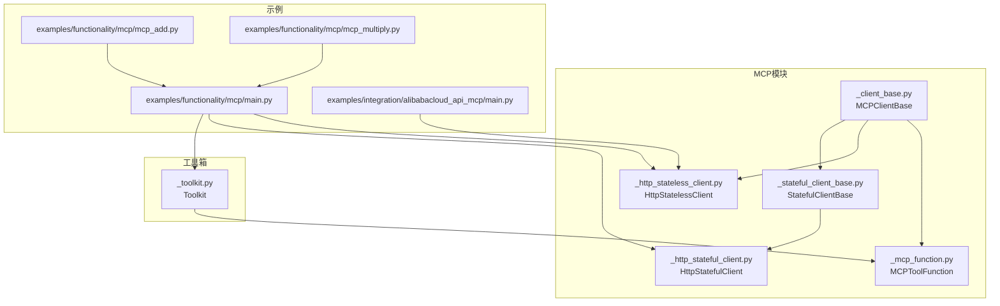
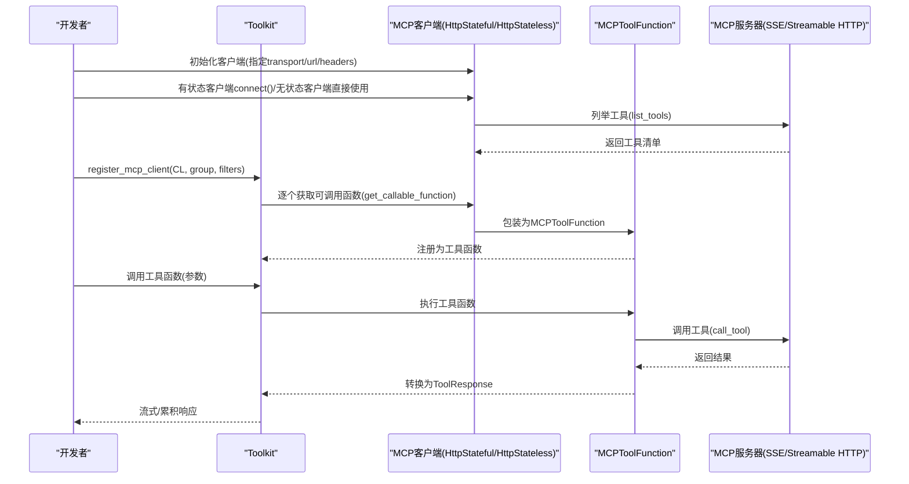
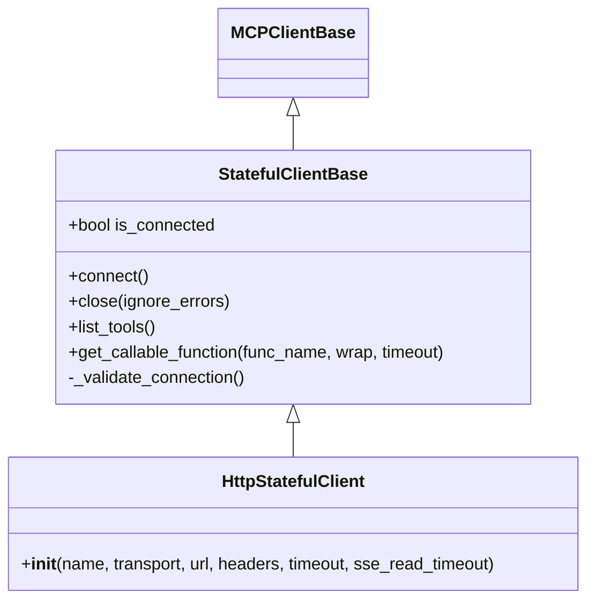
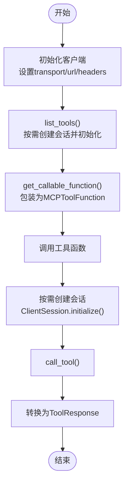
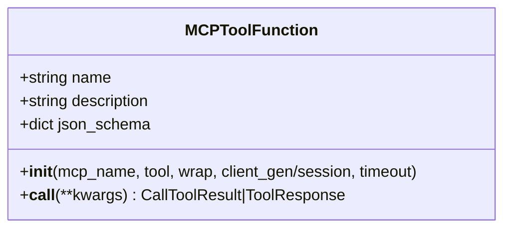
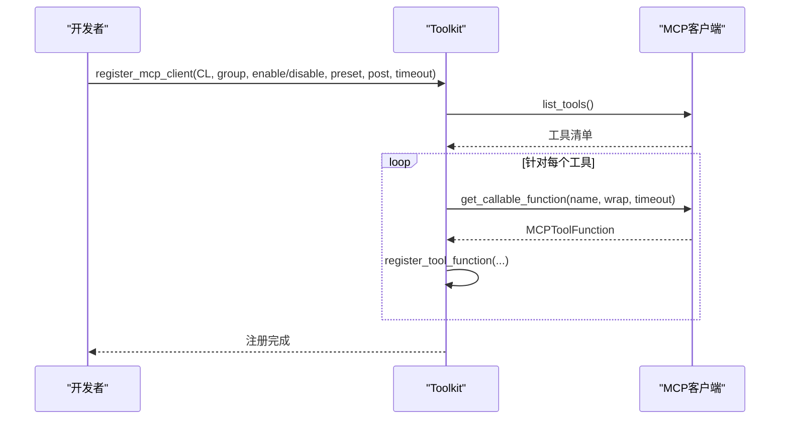
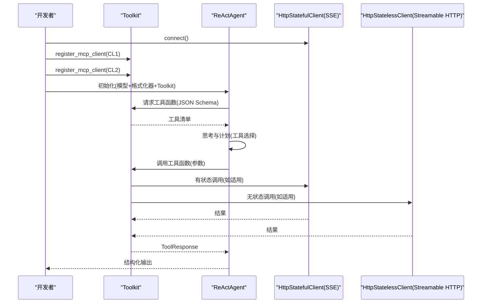
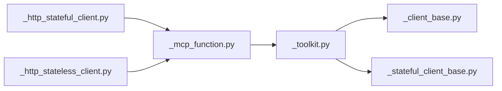

# MCP协议集成

<cite>
**本文引用的文件**
- [src/agentscope/mcp/__init__.py](file://src/agentscope/mcp/__init__.py)
- [src/agentscope/mcp/_client_base.py](file://src/agentscope/mcp/_client_base.py)
- [src/agentscope/mcp/_stateful_client_base.py](file://src/agentscope/mcp/_stateful_client_base.py)
- [src/agentscope/mcp/_http_stateful_client.py](file://src/agentscope/mcp/_http_stateful_client.py)
- [src/agentscope/mcp/_http_stateless_client.py](file://src/agentscope/mcp/_http_stateless_client.py)
- [src/agentscope/mcp/_mcp_function.py](file://src/agentscope/mcp/_mcp_function.py)
- [src/agentscope/tool/_toolkit.py](file://src/agentscope/tool/_toolkit.py)
- [examples/functionality/mcp/main.py](file://examples/functionality/mcp/main.py)
- [examples/functionality/mcp/mcp_add.py](file://examples/functionality/mcp/mcp_add.py)
- [examples/functionality/mcp/mcp_multiply.py](file://examples/functionality/mcp/mcp_multiply.py)
- [examples/integration/alibabacloud_api_mcp/main.py](file://examples/integration/alibabacloud_api_mcp/main.py)
- [docs/tutorial/zh_CN/src/task_mcp.py](file://docs/tutorial/zh_CN/src/task_mcp.py)
</cite>

## 目录
1. [简介](#简介)
2. [项目结构](#项目结构)
3. [核心组件](#核心组件)
4. [架构总览](#架构总览)
5. [详细组件分析](#详细组件分析)
6. [依赖分析](#依赖分析)
7. [性能考虑](#性能考虑)
8. [故障排除指南](#故障排除指南)
9. [结论](#结论)
10. [附录](#附录)

## 简介
本文件系统性介绍 AgentScope 对 Model Context Protocol（MCP）的集成能力，涵盖以下要点：
- 支持的客户端类型与传输协议：HTTP（Streamable HTTP 与 SSE）、StdIO；有状态与无状态两类客户端。
- 有状态/无状态的区别：是否在多次工具调用间维持会话。
- MCP 工具的注册流程、配置选项与使用方法。
- 将 MCP 工具集成到 ReAct 智能体，实现结构化输出与工具调用。
- 展示状态保持（有状态）与无状态客户端的使用差异，以及手动调用 MCP 工具函数的方法。
- 故障排除与性能优化建议。

## 项目结构
围绕 MCP 集成的相关模块与示例分布如下：
- mcp 包：MCP 客户端与工具函数封装
  - 客户端基类与具体实现：有状态/无状态、HTTP/SSE、StdIO
  - MCP 工具函数包装器
- tool 包：工具箱 Toolkit，负责注册与调度工具（含 MCP 工具）
- examples/functionality/mcp：MCP 与 ReAct 集成示例
- examples/integration/alibabacloud_api_mcp：带认证的 Streamable HTTP 示例
- docs/tutorial：中文教程，概述客户端类型与协议

图表来源
- [src/agentscope/mcp/_client_base.py:18-103](file://src/agentscope/mcp/_client_base.py#L18-L103)
- [src/agentscope/mcp/_stateful_client_base.py:16-177](file://src/agentscope/mcp/_stateful_client_base.py#L16-L177)
- [src/agentscope/mcp/_http_stateful_client.py:11-85](file://src/agentscope/mcp/_http_stateful_client.py#L11-L85)
- [src/agentscope/mcp/_http_stateless_client.py:16-153](file://src/agentscope/mcp/_http_stateless_client.py#L16-L153)
- [src/agentscope/mcp/_mcp_function.py:15-116](file://src/agentscope/mcp/_mcp_function.py#L15-L116)
- [src/agentscope/tool/_toolkit.py:1035-1178](file://src/agentscope/tool/_toolkit.py#L1035-L1178)
- [examples/functionality/mcp/main.py:34-111](file://examples/functionality/mcp/main.py#L34-L111)
- [examples/functionality/mcp/mcp_add.py:1-17](file://examples/functionality/mcp/mcp_add.py#L1-L17)
- [examples/functionality/mcp/mcp_multiply.py:1-17](file://examples/functionality/mcp/mcp_multiply.py#L1-L17)
- [examples/integration/alibabacloud_api_mcp/main.py:53-59](file://examples/integration/alibabacloud_api_mcp/main.py#L53-L59)

章节来源
- [src/agentscope/mcp/__init__.py:1-21](file://src/agentscope/mcp/__init__.py#L1-L21)
- [docs/tutorial/zh_CN/src/task_mcp.py:1-66](file://docs/tutorial/zh_CN/src/task_mcp.py#L1-L66)

## 核心组件
- MCPClientBase：MCP 客户端抽象基类，定义统一接口与内容转换逻辑。
- StatefulClientBase：有状态客户端基类，维护会话生命周期（connect/close），缓存工具列表。
- HttpStatefulClient：基于 HTTP 的有状态客户端，支持 SSE 与 Streamable HTTP 两种传输。
- HttpStatelessClient：无状态客户端，每次工具调用创建/销毁会话，适合轻量化场景。
- MCPToolFunction：MCP 工具函数包装器，支持可选超时与结果封装为 AgentScope 的 ToolResponse。
- Toolkit：工具箱，负责注册 MCP 客户端、批量导入工具函数、分组管理与执行。

章节来源
- [src/agentscope/mcp/_client_base.py:18-103](file://src/agentscope/mcp/_client_base.py#L18-L103)
- [src/agentscope/mcp/_stateful_client_base.py:16-177](file://src/agentscope/mcp/_stateful_client_base.py#L16-L177)
- [src/agentscope/mcp/_http_stateful_client.py:11-85](file://src/agentscope/mcp/_http_stateful_client.py#L11-L85)
- [src/agentscope/mcp/_http_stateless_client.py:16-153](file://src/agentscope/mcp/_http_stateless_client.py#L16-L153)
- [src/agentscope/mcp/_mcp_function.py:15-116](file://src/agentscope/mcp/_mcp_function.py#L15-L116)
- [src/agentscope/tool/_toolkit.py:1035-1178](file://src/agentscope/tool/_toolkit.py#L1035-L1178)

## 架构总览
AgentScope 的 MCP 集成采用“客户端-工具函数-工具箱”的分层设计：
- 客户端负责连接 MCP 服务器、列举工具、生成可调用的工具函数对象。
- 工具函数包装器负责在调用时建立会话、调用工具、转换返回内容。
- 工具箱负责将 MCP 工具注册为可用函数，参与智能体的计划与执行。

图表来源
- [src/agentscope/tool/_toolkit.py:1035-1178](file://src/agentscope/tool/_toolkit.py#L1035-L1178)
- [src/agentscope/mcp/_http_stateful_client.py:11-85](file://src/agentscope/mcp/_http_stateful_client.py#L11-L85)
- [src/agentscope/mcp/_http_stateless_client.py:16-153](file://src/agentscope/mcp/_http_stateless_client.py#L16-L153)
- [src/agentscope/mcp/_mcp_function.py:82-116](file://src/agentscope/mcp/_mcp_function.py#L82-L116)

## 详细组件分析

### HttpStatefulClient（有状态客户端）
- 作用：在生命周期内维持与 MCP 服务器的会话，适合需要上下文或交互的场景（如浏览器类服务器）。
- 关键点：
  - 通过 transport 参数选择 SSE 或 Streamable HTTP。
  - 需要显式调用 connect() 建立会话，close() 清理资源。
  - 多实例关闭需遵循 LIFO 原则，避免潜在错误。
- 典型使用：连接到 SSE 服务器，注册到 Toolkit 后供 ReAct 使用。

图表来源
- [src/agentscope/mcp/_client_base.py:18-103](file://src/agentscope/mcp/_client_base.py#L18-L103)
- [src/agentscope/mcp/_stateful_client_base.py:16-177](file://src/agentscope/mcp/_stateful_client_base.py#L16-L177)
- [src/agentscope/mcp/_http_stateful_client.py:11-85](file://src/agentscope/mcp/_http_stateful_client.py#L11-L85)

章节来源
- [src/agentscope/mcp/_http_stateful_client.py:11-85](file://src/agentscope/mcp/_http_stateful_client.py#L11-L85)
- [src/agentscope/mcp/_stateful_client_base.py:46-96](file://src/agentscope/mcp/_stateful_client_base.py#L46-L96)

### HttpStatelessClient（无状态客户端）
- 作用：每次工具调用时创建会话并在调用后销毁，适合轻量化、低耦合场景。
- 关键点：
  - 通过 get_client() 作为上下文管理器按需创建会话。
  - list_tools() 与 get_callable_function() 内部自动完成会话初始化。
- 典型使用：连接到 Streamable HTTP 服务器，直接注册到 Toolkit。

图表来源
- [src/agentscope/mcp/_http_stateless_client.py:16-153](file://src/agentscope/mcp/_http_stateless_client.py#L16-L153)
- [src/agentscope/mcp/_mcp_function.py:82-116](file://src/agentscope/mcp/_mcp_function.py#L82-L116)

章节来源
- [src/agentscope/mcp/_http_stateless_client.py:16-153](file://src/agentscope/mcp/_http_stateless_client.py#L16-L153)

### MCPToolFunction（工具函数包装器）
- 作用：将 MCP 工具封装为可直接调用的异步函数，支持超时控制与结果封装。
- 关键点：
  - 支持通过 client_gen 或 session 两种方式调用。
  - 可选将 MCP 结果转换为 AgentScope 的消息块集合。
  - 支持设置单次调用超时。

图表来源
- [src/agentscope/mcp/_mcp_function.py:15-116](file://src/agentscope/mcp/_mcp_function.py#L15-L116)

章节来源
- [src/agentscope/mcp/_mcp_function.py:27-116](file://src/agentscope/mcp/_mcp_function.py#L27-L116)

### Toolkit（工具箱）与 MCP 客户端注册
- 作用：将 MCP 客户端提供的工具函数注册到工具箱，支持分组、过滤、预设参数与后处理。
- 关键点：
  - register_mcp_client() 会列举工具、过滤启用/禁用列表、生成可调用函数并注册。
  - 有状态客户端在注册前必须已 connect()。
  - 支持为不同工具设置 preset_kwargs 与统一 postprocess_func。

图表来源
- [src/agentscope/tool/_toolkit.py:1035-1178](file://src/agentscope/tool/_toolkit.py#L1035-L1178)
- [src/agentscope/mcp/_http_stateful_client.py:11-85](file://src/agentscope/mcp/_http_stateful_client.py#L11-L85)
- [src/agentscope/mcp/_http_stateless_client.py:16-153](file://src/agentscope/mcp/_http_stateless_client.py#L16-L153)

章节来源
- [src/agentscope/tool/_toolkit.py:1035-1178](file://src/agentscope/tool/_toolkit.py#L1035-L1178)

### ReAct 智能体集成与结构化输出
- 步骤概览：
  - 创建有状态/无状态 MCP 客户端并连接（如需）。
  - 将客户端注册到 Toolkit。
  - 初始化 ReActAgent 并传入 Toolkit。
  - 通过 structured_model 获取结构化输出。
  - 可手动获取并调用某个 MCP 工具函数进行验证。
- 示例参考：
  - 功能演示：有状态 SSE 与无状态 Streamable HTTP 组合使用。
  - 阿里云 MCP：使用 OAuth 认证的 Streamable HTTP 客户端。

图表来源
- [examples/functionality/mcp/main.py:34-111](file://examples/functionality/mcp/main.py#L34-L111)
- [examples/integration/alibabacloud_api_mcp/main.py:70-102](file://examples/integration/alibabacloud_api_mcp/main.py#L70-L102)

章节来源
- [examples/functionality/mcp/main.py:34-111](file://examples/functionality/mcp/main.py#L34-L111)
- [examples/integration/alibabacloud_api_mcp/main.py:70-102](file://examples/integration/alibabacloud_api_mcp/main.py#L70-L102)

## 依赖分析
- 模块内聚与耦合：
  - MCP 客户端与工具函数解耦，通过 Toolkit 统一注册与调度。
  - 有状态/无状态客户端共享同一工具函数包装器，降低重复实现。
- 外部依赖：
  - mcp SDK：SSE/Streamable HTTP 客户端、ClientSession、类型定义。
  - AgentScope 工具链：Toolkit、ToolResponse、消息块等。

图表来源
- [src/agentscope/mcp/_http_stateful_client.py:11-85](file://src/agentscope/mcp/_http_stateful_client.py#L11-L85)
- [src/agentscope/mcp/_http_stateless_client.py:16-153](file://src/agentscope/mcp/_http_stateless_client.py#L16-L153)
- [src/agentscope/mcp/_mcp_function.py:15-116](file://src/agentscope/mcp/_mcp_function.py#L15-L116)
- [src/agentscope/tool/_toolkit.py:1035-1178](file://src/agentscope/tool/_toolkit.py#L1035-L1178)
- [src/agentscope/mcp/_client_base.py:18-103](file://src/agentscope/mcp/_client_base.py#L18-L103)
- [src/agentscope/mcp/_stateful_client_base.py:16-177](file://src/agentscope/mcp/_stateful_client_base.py#L16-L177)

章节来源
- [src/agentscope/mcp/_http_stateful_client.py:11-85](file://src/agentscope/mcp/_http_stateful_client.py#L11-L85)
- [src/agentscope/mcp/_http_stateless_client.py:16-153](file://src/agentscope/mcp/_http_stateless_client.py#L16-L153)
- [src/agentscope/mcp/_mcp_function.py:15-116](file://src/agentscope/mcp/_mcp_function.py#L15-L116)
- [src/agentscope/tool/_toolkit.py:1035-1178](file://src/agentscope/tool/_toolkit.py#L1035-L1178)

## 性能考虑
- 有状态 vs 无状态：
  - 有状态客户端在多工具调用间复用会话，减少握手开销，适合长交互场景。
  - 无状态客户端按需创建/销毁会话，资源占用更可控，适合短任务与高并发。
- 超时设置：
  - 为工具调用设置合理的执行超时，避免阻塞。
  - SSE 读取超时可根据实时性需求调整。
- 工具缓存：
  - 有状态客户端内部缓存工具列表，减少重复列举。
- 并发与清理：
  - 多实例关闭遵循 LIFO 原则，避免资源竞争。
  - 无状态客户端无需显式关闭，但应避免频繁创建销毁。

## 故障排除指南
- 连接与生命周期
  - 有状态客户端未连接即调用工具：在注册前确保已 connect()。
  - 多客户端关闭顺序错误：遵循 LIFO 原则，最后创建的先关闭。
- 工具不可用
  - 工具名不存在：确认工具清单与过滤条件，检查 enable/disable 列表。
  - 工具组未激活：确保对应工具组处于 active 状态。
- 结果类型不匹配
  - 工具函数返回类型不符合预期：Toolkit 要求返回 ToolResponse 或其流式生成器。
- 认证与网络
  - Streamable HTTP 需正确配置认证（如 OAuth）。
  - SSE URL 与端点需符合服务器要求（通常以特定路径结尾）。

章节来源
- [src/agentscope/mcp/_stateful_client_base.py:164-177](file://src/agentscope/mcp/_stateful_client_base.py#L164-L177)
- [src/agentscope/tool/_toolkit.py:1100-1140](file://src/agentscope/tool/_toolkit.py#L1100-L1140)
- [examples/integration/alibabacloud_api_mcp/main.py:53-59](file://examples/integration/alibabacloud_api_mcp/main.py#L53-L59)

## 结论
AgentScope 的 MCP 集成提供了灵活的客户端选择与统一的工具注册机制，既能满足需要会话状态的交互式场景，也能覆盖轻量化的按需调用场景。通过 Toolkit 的分组与过滤能力，开发者可以精细地控制工具暴露范围与行为，结合 ReAct 智能体实现结构化输出与自动化工具调用。

## 附录
- 快速上手要点
  - 选择合适的客户端：需要会话状态用 HttpStatefulClient，否则用 HttpStatelessClient。
  - 正确配置 transport 与 URL：SSE 与 Streamable HTTP 的 URL 不同。
  - 注册到 Toolkit：使用 register_mcp_client 完成工具导入与分组。
  - 结构化输出：在智能体调用时提供结构化模型，获取规范化结果。
  - 手动调用：通过 get_callable_function 获取工具函数，直接传参调用验证。

章节来源
- [docs/tutorial/zh_CN/src/task_mcp.py:1-66](file://docs/tutorial/zh_CN/src/task_mcp.py#L1-L66)
- [examples/functionality/mcp/main.py:34-111](file://examples/functionality/mcp/main.py#L34-L111)