# RAG系统集成

<cite>
**本文引用的文件**
- [src/agentscope/rag/__init__.py](file://src/agentscope/rag/__init__.py)
- [src/agentscope/rag/_document.py](file://src/agentscope/rag/_document.py)
- [src/agentscope/rag/_knowledge_base.py](file://src/agentscope/rag/_knowledge_base.py)
- [src/agentscope/rag/_simple_knowledge.py](file://src/agentscope/rag/_simple_knowledge.py)
- [src/agentscope/rag/_reader/__init__.py](file://src/agentscope/rag/_reader/__init__.py)
- [src/agentscope/rag/_reader/_reader_base.py](file://src/agentscope/rag/_reader/_reader_base.py)
- [src/agentscope/rag/_store/__init__.py](file://src/agentscope/rag/_store/__init__.py)
- [src/agentscope/rag/_store/_store_base.py](file://src/agentscope/rag/_store/_store_base.py)
- [src/agentscope/rag/_reader/_text_reader.py](file://src/agentscope/rag/_reader/_text_reader.py)
- [src/agentscope/rag/_reader/_pdf_reader.py](file://src/agentscope/rag/_reader/_pdf_reader.py)
- [src/agentscope/rag/_reader/_image_reader.py](file://src/agentscope/rag/_reader/_image_reader.py)
- [src/agentscope/rag/_reader/_word_reader.py](file://src/agentscope/rag/_reader/_word_reader.py)
- [src/agentscope/rag/_reader/_excel_reader.py](file://src/agentscope/rag/_reader/_excel_reader.py)
- [src/agentscope/rag/_reader/_ppt_reader.py](file://src/agentscope/rag/_reader/_ppt_reader.py)
- [src/agentscope/rag/_store/_qdrant_store.py](file://src/agentscope/rag/_store/_qdrant_store.py)
- [src/agentscope/rag/_store/_milvuslite_store.py](file://src/agentscope/rag/_store/_milvuslite_store.py)
- [src/agentscope/rag/_store/_oceanbase_store.py](file://src/agentscope/rag/_store/_oceanbase_store.py)
- [src/agentscope/rag/_store/_mongodb_store.py](file://src/agentscope/rag/_store/_mongodb_store.py)
- [src/agentscope/rag/_store/_alibabacloud_mysql_store.py](file://src/agentscope/rag/_store/_alibabacloud_mysql_store.py)
- [src/agentscope/embedding/_dashscope_multimodal_embedding.py](file://src/agentscope/embedding/_dashscope_multimodal_embedding.py)
- [examples/functionality/rag/README.md](file://examples/functionality/rag/README.md)
- [examples/functionality/rag/basic_usage.py](file://examples/functionality/rag/basic_usage.py)
- [examples/functionality/rag/agentic_usage.py](file://examples/functionality/rag/agentic_usage.py)
- [examples/functionality/rag/react_agent_integration.py](file://examples/functionality/rag/react_agent_integration.py)
- [examples/functionality/rag/multimodal_rag.py](file://examples/functionality/rag/multimodal_rag.py)
</cite>

## 目录
1. [引言](#引言)
2. [项目结构](#项目结构)
3. [核心组件](#核心组件)
4. [架构总览](#架构总览)
5. [详细组件分析](#详细组件分析)
6. [依赖关系分析](#依赖关系分析)
7. [性能考虑](#性能考虑)
8. [故障排除指南](#故障排除指南)
9. [结论](#结论)
10. [附录](#附录)

## 引言
本文件面向希望在AgentScope中集成与使用RAG（检索增强生成）系统的开发者与使用者，系统性介绍RAG的基本原理、数据结构、组件职责以及在智能体中的多种集成方式。文档覆盖从“基础用法”到“代理式RAG工具”、“静态集成ReAct智能体”，再到“多模态RAG”的完整实践路径，并提供知识库构建、文档读取器配置、向量存储选择与检索增强生成的端到端流程说明。同时给出性能优化、准确性提升与成本控制策略，以及部署与排障建议。

## 项目结构
AgentScope的RAG模块位于src/agentscope/rag目录下，采用分层设计：数据结构层（Document/DocMetadata）、读取器层（ReaderBase及各类Reader）、向量存储层（VDBStoreBase及各实现）、知识库抽象层（KnowledgeBase/SimpleKnowledge），并通过examples/functionality/rag提供基础用法、代理式集成、静态集成与多模态RAG示例。

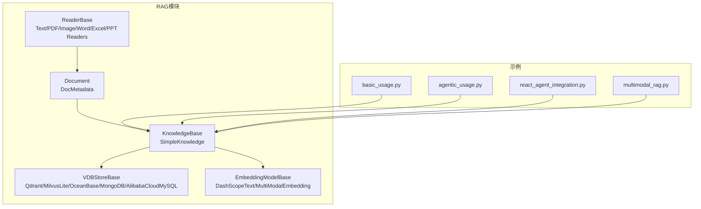

图表来源
- [src/agentscope/rag/__init__.py:1-48](file://src/agentscope/rag/__init__.py#L1-L48)
- [src/agentscope/rag/_document.py:1-52](file://src/agentscope/rag/_document.py#L1-L52)
- [src/agentscope/rag/_knowledge_base.py:1-131](file://src/agentscope/rag/_knowledge_base.py#L1-L131)
- [src/agentscope/rag/_simple_knowledge.py:1-85](file://src/agentscope/rag/_simple_knowledge.py#L1-L85)
- [src/agentscope/rag/_reader/__init__.py:1-22](file://src/agentscope/rag/_reader/__init__.py#L1-L22)
- [src/agentscope/rag/_store/__init__.py:1-21](file://src/agentscope/rag/_store/__init__.py#L1-L21)
- [examples/functionality/rag/README.md:1-41](file://examples/functionality/rag/README.md#L1-L41)

章节来源
- [src/agentscope/rag/__init__.py:1-48](file://src/agentscope/rag/__init__.py#L1-L48)
- [examples/functionality/rag/README.md:1-41](file://examples/functionality/rag/README.md#L1-L41)

## 核心组件
- 文档与元数据：用于承载文本、图像、视频等多模态内容的最小检索单元，包含唯一ID、嵌入向量与相关性得分。
- 知识库抽象：定义检索与新增文档的接口，提供便捷的工具化检索方法，便于在智能体中直接调用。
- 读取器：负责从原始文件（文本、PDF、Word、Excel、PPT、图片）中切分并产出Document对象。
- 向量数据库存储：作为嵌入向量的持久化与检索后端，支持多种实现（如Qdrant、Milvus Lite、OceanBase、MongoDB、MySQL）。
- 嵌入模型：提供文本或多模态（文本/图像/视频）向量化能力，支持缓存与批量限制等特性。

章节来源
- [src/agentscope/rag/_document.py:1-52](file://src/agentscope/rag/_document.py#L1-L52)
- [src/agentscope/rag/_knowledge_base.py:1-131](file://src/agentscope/rag/_knowledge_base.py#L1-L131)
- [src/agentscope/rag/_simple_knowledge.py:1-85](file://src/agentscope/rag/_simple_knowledge.py#L1-L85)
- [src/agentscope/rag/_reader/_reader_base.py:1-28](file://src/agentscope/rag/_reader/_reader_base.py#L1-L28)
- [src/agentscope/rag/_store/_store_base.py:1-50](file://src/agentscope/rag/_store/_store_base.py#L1-L50)
- [src/agentscope/embedding/_dashscope_multimodal_embedding.py:1-245](file://src/agentscope/embedding/_dashscope_multimodal_embedding.py#L1-L245)

## 架构总览
RAG系统以“读取器→知识库→向量存储/嵌入模型”的链路为核心，知识库封装检索与新增逻辑，并通过工具化接口与智能体集成；多模态场景下，读取器与嵌入模型可输出图像/视频等非文本内容，统一由Document承载。

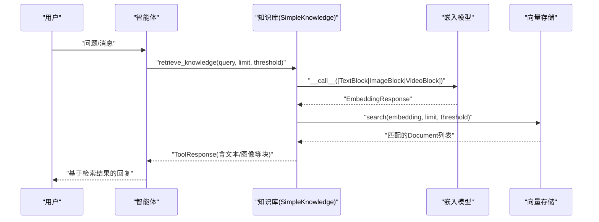

图表来源
- [src/agentscope/rag/_simple_knowledge.py:13-85](file://src/agentscope/rag/_simple_knowledge.py#L13-L85)
- [src/agentscope/rag/_knowledge_base.py:77-131](file://src/agentscope/rag/_knowledge_base.py#L77-L131)
- [src/agentscope/rag/_store/_store_base.py:23-41](file://src/agentscope/rag/_store/_store_base.py#L23-L41)
- [src/agentscope/embedding/_dashscope_multimodal_embedding.py:91-196](file://src/agentscope/embedding/_dashscope_multimodal_embedding.py#L91-L196)

## 详细组件分析

### 数据结构：Document与DocMetadata
- DocMetadata：记录内容类型（文本/图像/视频）、文档ID、分片ID与总分片数，支撑跨模态与分块检索。
- Document：封装元数据、唯一ID、嵌入向量与相关性得分，作为检索与返回结果的载体。

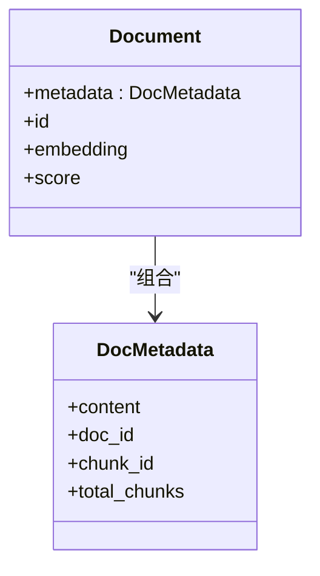

图表来源
- [src/agentscope/rag/_document.py:18-52](file://src/agentscope/rag/_document.py#L18-L52)

章节来源
- [src/agentscope/rag/_document.py:1-52](file://src/agentscope/rag/_document.py#L1-L52)

### 知识库抽象：KnowledgeBase与SimpleKnowledge
- KnowledgeBase：抽象出检索与新增文档两个核心方法，并提供便捷的retrieve_knowledge工具方法，返回包含文本块与得分的工具响应。
- SimpleKnowledge：具体实现，先对查询进行嵌入，再在向量存储中搜索，支持按阈值与数量限制返回结果；新增文档时校验嵌入模型支持的模态并写入向量存储。

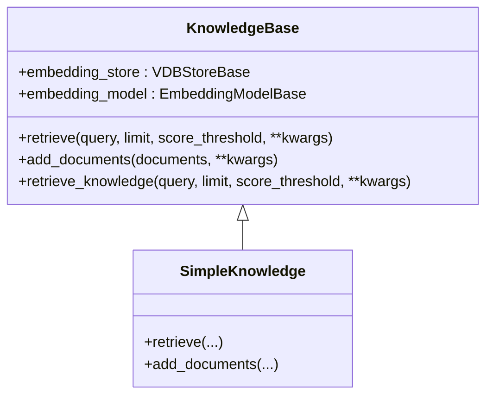

图表来源
- [src/agentscope/rag/_knowledge_base.py:13-131](file://src/agentscope/rag/_knowledge_base.py#L13-L131)
- [src/agentscope/rag/_simple_knowledge.py:10-85](file://src/agentscope/rag/_simple_knowledge.py#L10-L85)

章节来源
- [src/agentscope/rag/_knowledge_base.py:1-131](file://src/agentscope/rag/_knowledge_base.py#L1-L131)
- [src/agentscope/rag/_simple_knowledge.py:1-85](file://src/agentscope/rag/_simple_knowledge.py#L1-L85)

### 读取器体系：ReaderBase与多格式支持
- ReaderBase：定义异步调用接口与文档ID生成接口，统一产出Document列表。
- 具体读取器：TextReader、PDFReader、WordReader、ExcelReader、PowerPointReader、ImageReader等，分别处理对应格式的切分与内容提取。

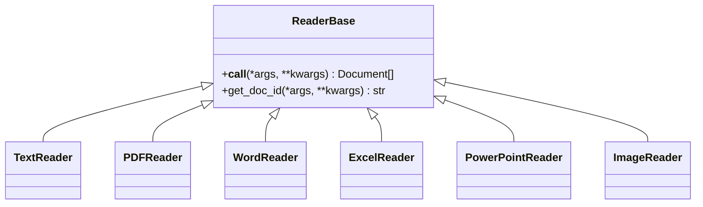

图表来源
- [src/agentscope/rag/_reader/_reader_base.py:9-28](file://src/agentscope/rag/_reader/_reader_base.py#L9-L28)
- [src/agentscope/rag/_reader/__init__.py:4-21](file://src/agentscope/rag/_reader/__init__.py#L4-L21)

章节来源
- [src/agentscope/rag/_reader/_reader_base.py:1-28](file://src/agentscope/rag/_reader/_reader_base.py#L1-L28)
- [src/agentscope/rag/_reader/__init__.py:1-22](file://src/agentscope/rag/_reader/__init__.py#L1-L22)

### 向量存储：VDBStoreBase与多实现
- VDBStoreBase：定义add/delete/search等接口，search支持limit与score_threshold参数。
- 实现包括：QdrantStore、MilvusLiteStore、OceanBaseStore、MongoDBStore、AlibabaCloudMySQLStore，满足不同部署与性能需求。

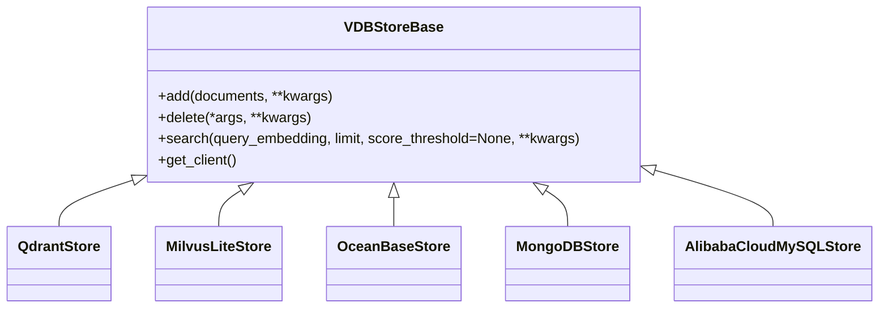

图表来源
- [src/agentscope/rag/_store/_store_base.py:10-50](file://src/agentscope/rag/_store/_store_base.py#L10-L50)
- [src/agentscope/rag/_store/__init__.py:4-21](file://src/agentscope/rag/_store/__init__.py#L4-L21)

章节来源
- [src/agentscope/rag/_store/_store_base.py:1-50](file://src/agentscope/rag/_store/_store_base.py#L1-L50)
- [src/agentscope/rag/_store/__init__.py:1-21](file://src/agentscope/rag/_store/__init__.py#L1-L21)

### 多模态嵌入：DashScopeMultiModalEmbedding
- 支持文本、图像、视频输入，内部对输入进行合法性检查与格式化，处理批大小限制与缓存命中，返回EmbeddingResponse与用量统计。

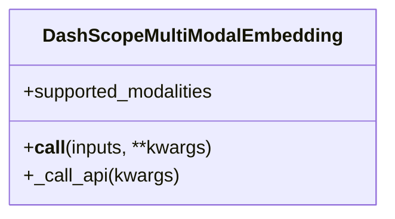

图表来源
- [src/agentscope/embedding/_dashscope_multimodal_embedding.py:17-245](file://src/agentscope/embedding/_dashscope_multimodal_embedding.py#L17-L245)

章节来源
- [src/agentscope/embedding/_dashscope_multimodal_embedding.py:1-245](file://src/agentscope/embedding/_dashscope_multimodal_embedding.py#L1-L245)

### 基础RAG用法
- 步骤概览：创建读取器（文本/PDF等）→ 读取文档 → 构建知识库（指定嵌入模型与向量存储）→ 插入文档 → 检索并打印结果。
- 关键点：chunk_size、split_by等参数影响召回质量；向量维度需与嵌入模型一致；Qdrant内存模式适合演示与小规模测试。

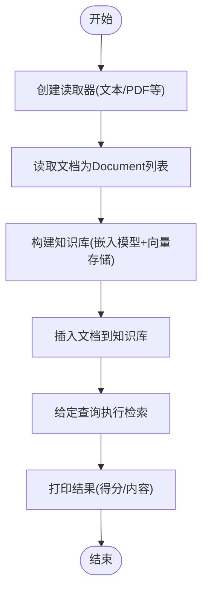

图表来源
- [examples/functionality/rag/basic_usage.py:15-80](file://examples/functionality/rag/basic_usage.py#L15-L80)

章节来源
- [examples/functionality/rag/basic_usage.py:1-80](file://examples/functionality/rag/basic_usage.py#L1-L80)

### 代理式RAG集成（工具化）
- 将知识库的retrieve_knowledge注册为智能体工具，由智能体在对话中动态调用，提升灵活性与上下文适配能力。
- 注意：工具描述需强调查询构造的重要性与阈值调整策略。

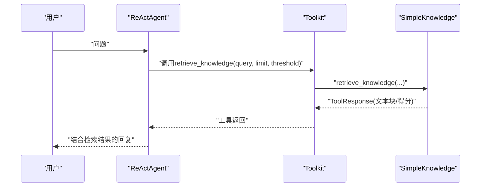

图表来源
- [examples/functionality/rag/agentic_usage.py:56-102](file://examples/functionality/rag/agentic_usage.py#L56-L102)
- [src/agentscope/rag/_knowledge_base.py:77-131](file://src/agentscope/rag/_knowledge_base.py#L77-L131)

章节来源
- [examples/functionality/rag/agentic_usage.py:1-102](file://examples/functionality/rag/agentic_usage.py#L1-L102)
- [src/agentscope/rag/_knowledge_base.py:77-131](file://src/agentscope/rag/_knowledge_base.py#L77-L131)

### 静态集成ReAct智能体
- 在ReActAgent初始化时注入知识库实例，使每次回复前自动检索相关文档，简化实现但对输入表达要求更高。
- 示例展示了离线构建知识库与在线对话的典型流程。

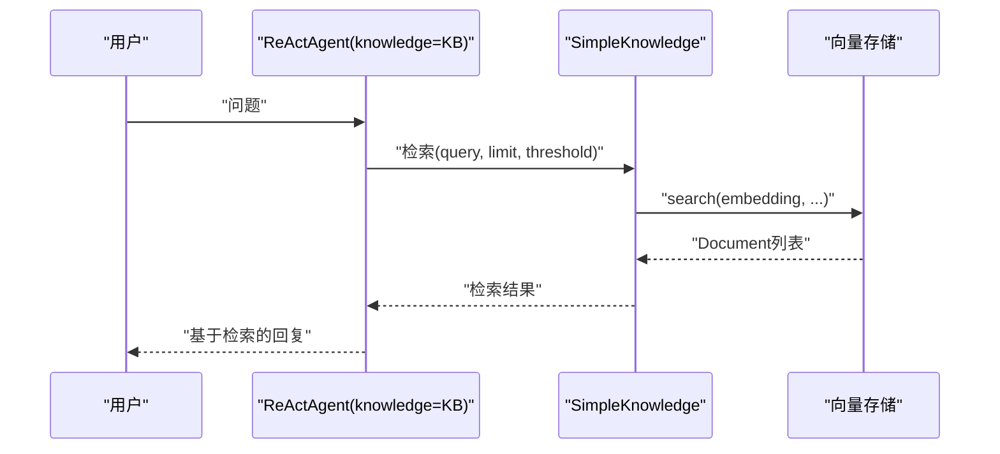

图表来源
- [examples/functionality/rag/react_agent_integration.py:52-79](file://examples/functionality/rag/react_agent_integration.py#L52-L79)

章节来源
- [examples/functionality/rag/react_agent_integration.py:1-79](file://examples/functionality/rag/react_agent_integration.py#L1-L79)

### 多模态RAG处理
- 使用ImageReader读取图像为Document，配合DashScopeMultiModalEmbedding构建多模态知识库，ReActAgent可结合视觉内容回答问题。
- 示例中通过Matplotlib生成示例图像，验证Agent从检索到的图像中识别名称的能力。

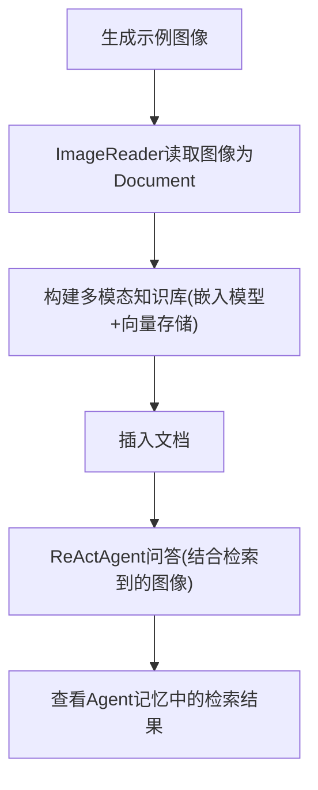

图表来源
- [examples/functionality/rag/multimodal_rag.py:25-73](file://examples/functionality/rag/multimodal_rag.py#L25-L73)
- [src/agentscope/embedding/_dashscope_multimodal_embedding.py:91-196](file://src/agentscope/embedding/_dashscope_multimodal_embedding.py#L91-L196)

章节来源
- [examples/functionality/rag/multimodal_rag.py:1-73](file://examples/functionality/rag/multimodal_rag.py#L1-L73)
- [src/agentscope/embedding/_dashscope_multimodal_embedding.py:1-245](file://src/agentscope/embedding/_dashscope_multimodal_embedding.py#L1-L245)

## 依赖关系分析
- 组件内聚与耦合：知识库聚合了嵌入模型与向量存储，读取器独立于知识库，便于替换与扩展；向量存储实现与知识库解耦，便于切换后端。
- 外部依赖：示例中使用DashScope的文本与多模态嵌入服务，向量存储默认使用Qdrant内存模式，便于快速演示。
- 可能的循环依赖：当前模块间为单向依赖，未见循环导入迹象。

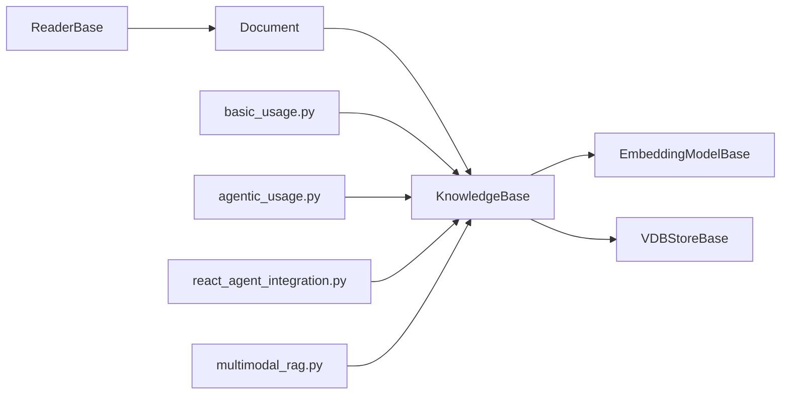

图表来源
- [src/agentscope/rag/_reader/_reader_base.py:1-28](file://src/agentscope/rag/_reader/_reader_base.py#L1-L28)
- [src/agentscope/rag/_document.py:1-52](file://src/agentscope/rag/_document.py#L1-L52)
- [src/agentscope/rag/_knowledge_base.py:1-131](file://src/agentscope/rag/_knowledge_base.py#L1-L131)
- [src/agentscope/rag/_simple_knowledge.py:1-85](file://src/agentscope/rag/_simple_knowledge.py#L1-L85)
- [examples/functionality/rag/basic_usage.py:1-80](file://examples/functionality/rag/basic_usage.py#L1-L80)
- [examples/functionality/rag/agentic_usage.py:1-102](file://examples/functionality/rag/agentic_usage.py#L1-L102)
- [examples/functionality/rag/react_agent_integration.py:1-79](file://examples/functionality/rag/react_agent_integration.py#L1-L79)
- [examples/functionality/rag/multimodal_rag.py:1-73](file://examples/functionality/rag/multimodal_rag.py#L1-L73)

章节来源
- [src/agentscope/rag/_reader/_reader_base.py:1-28](file://src/agentscope/rag/_reader/_reader_base.py#L1-L28)
- [src/agentscope/rag/_document.py:1-52](file://src/agentscope/rag/_document.py#L1-L52)
- [src/agentscope/rag/_knowledge_base.py:1-131](file://src/agentscope/rag/_knowledge_base.py#L1-L131)
- [src/agentscope/rag/_simple_knowledge.py:1-85](file://src/agentscope/rag/_simple_knowledge.py#L1-L85)
- [examples/functionality/rag/basic_usage.py:1-80](file://examples/functionality/rag/basic_usage.py#L1-L80)
- [examples/functionality/rag/agentic_usage.py:1-102](file://examples/functionality/rag/agentic_usage.py#L1-L102)
- [examples/functionality/rag/react_agent_integration.py:1-79](file://examples/functionality/rag/react_agent_integration.py#L1-L79)
- [examples/functionality/rag/multimodal_rag.py:1-73](file://examples/functionality/rag/multimodal_rag.py#L1-L73)

## 性能考虑
- 嵌入与检索参数
  - 查询构造：更具体、简洁的查询通常带来更高精度；可通过多次尝试不同查询与调整limit与score_threshold获得最佳结果。
  - 分块策略：chunk_size与split_by（字符/句子/段落）影响召回粒度与召回率，需结合文档类型与任务目标权衡。
- 向量存储
  - 选择合适的后端：内存模式适合演示；生产环境建议使用本地/云托管的Milvus/Qdrant/OceanBase/MongoDB/MySQL，关注延迟、容量与扩展性。
  - 索引与维度：确保嵌入维度与向量存储配置一致；合理设置索引参数以平衡查询速度与精度。
- 多模态与批处理
  - 多模态嵌入存在批大小限制，代码已内置分批处理与缓存机制，避免重复调用API；注意不同模型的维度约束。
- 成本控制
  - 使用缓存减少重复嵌入调用；控制查询频率与批量大小；优先使用轻量级向量存储或本地部署降低外部服务成本。
- 准确性提升
  - 调整score_threshold以过滤低相关结果；增加分块数量与更细粒度切分；在工具描述中引导智能体优化查询表达。

[本节为通用指导，无需特定文件引用]

## 故障排除指南
- 常见错误与定位
  - 嵌入模态不支持：当文档内容类型不在嵌入模型支持列表时会抛出异常，需确认读取器输出与嵌入模型配置一致。
  - 向量维度不匹配：嵌入维度与向量存储配置不一致会导致插入/检索失败，需核对模型与存储的dimensions。
  - 多模态输入非法：图像/视频输入需满足类型与来源要求（URL/base64），否则会触发校验错误。
  - 查询阈值过高：score_threshold过大可能导致无结果，应适当下调以扩大候选集。
- 排查步骤
  - 打印检索到的Document数量与得分分布，确认召回是否正常。
  - 检查嵌入缓存是否生效，避免重复调用API导致超时或限流。
  - 对比不同chunk_size与split_by策略，观察对召回的影响。
  - 在代理式集成中，检查工具描述与提示词，引导智能体正确构造查询与调整参数。

章节来源
- [src/agentscope/rag/_simple_knowledge.py:66-74](file://src/agentscope/rag/_simple_knowledge.py#L66-L74)
- [src/agentscope/embedding/_dashscope_multimodal_embedding.py:110-166](file://src/agentscope/embedding/_dashscope_multimodal_embedding.py#L110-L166)
- [src/agentscope/rag/_knowledge_base.py:90-101](file://src/agentscope/rag/_knowledge_base.py#L90-L101)

## 结论
AgentScope的RAG模块以清晰的分层设计与丰富的读取器/存储实现，为文本与多模态场景提供了灵活、可扩展的检索增强方案。通过工具化与静态集成两种方式，既能满足复杂任务的动态检索需求，也能在简单场景中快速落地。结合合理的参数调优、缓存与后端选择，可在保证准确性的同时有效控制成本与提升性能。

[本节为总结性内容，无需特定文件引用]

## 附录
- 快速开始命令
  - 基础用法：python examples/functionality/rag/basic_usage.py
  - 代理式RAG：python examples/functionality/rag/agentic_usage.py
  - ReAct静态集成：python examples/functionality/rag/react_agent_integration.py
  - 多模态RAG：python examples/functionality/rag/multimodal_rag.py
- 示例说明
  - 示例基于DashScope模型与格式化器，若更换模型需同步更新格式化器映射关系。

章节来源
- [examples/functionality/rag/README.md:18-41](file://examples/functionality/rag/README.md#L18-L41)