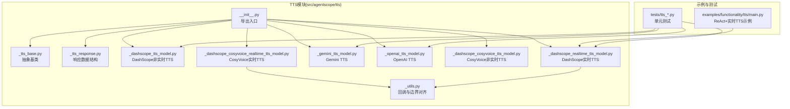
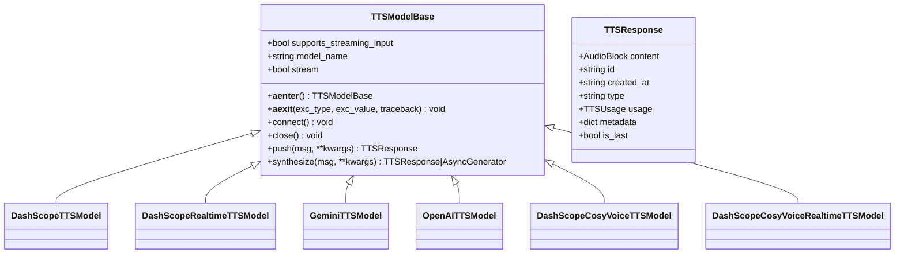
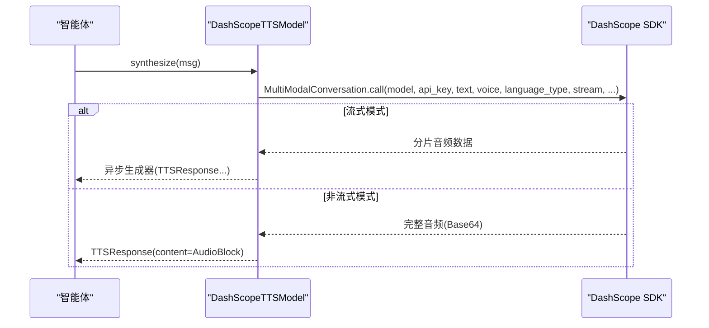
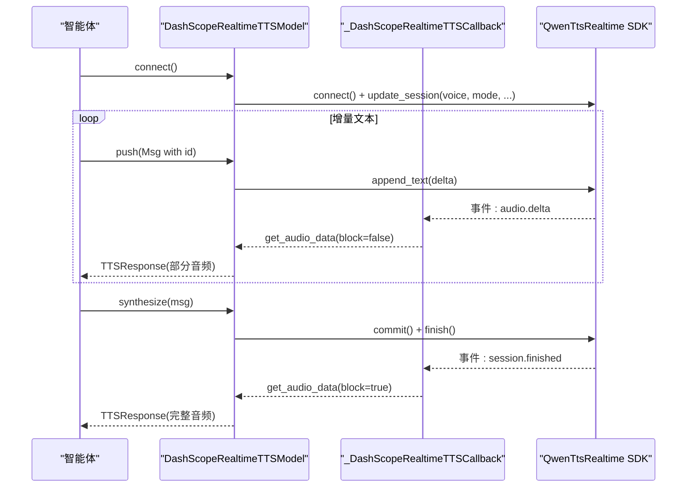
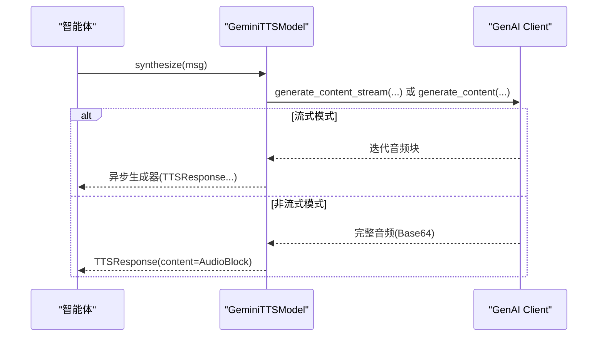
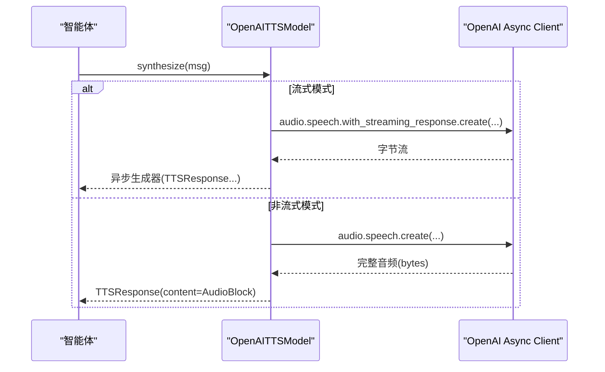
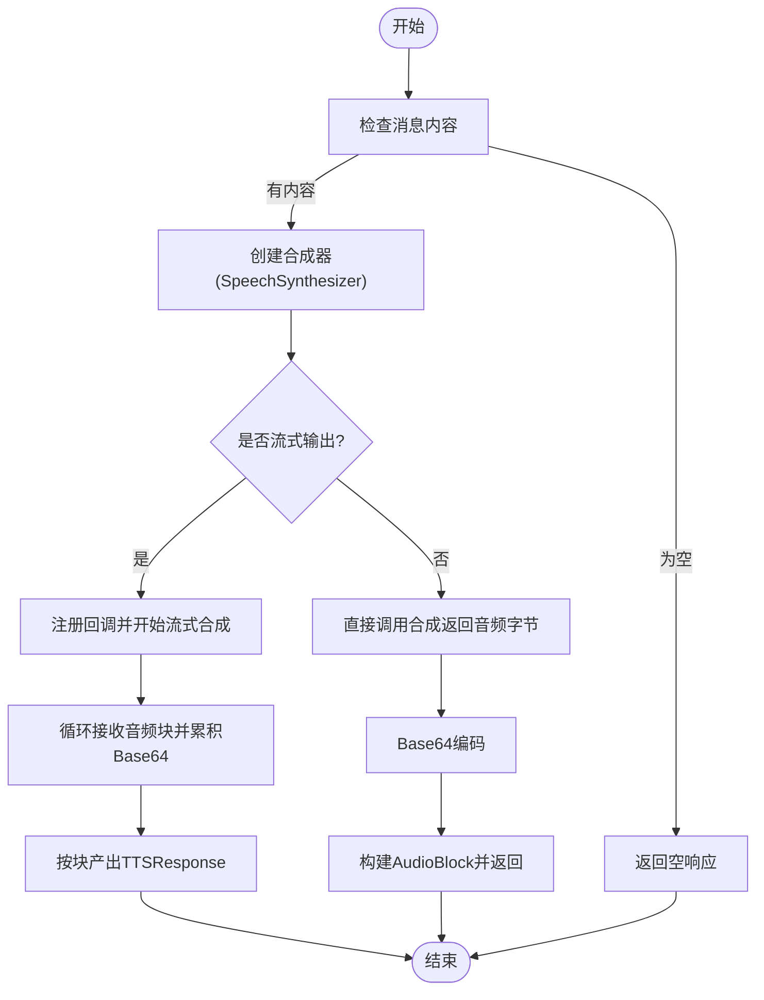
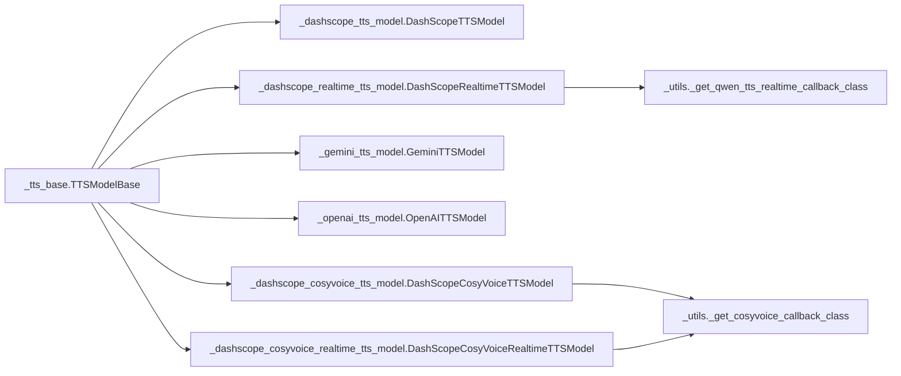

# TTS语音合成

<cite>
**本文引用的文件**   
- [src/agentscope/tts/__init__.py](file://src/agentscope/tts/__init__.py)
- [src/agentscope/tts/_tts_base.py](file://src/agentscope/tts/_tts_base.py)
- [src/agentscope/tts/_tts_response.py](file://src/agentscope/tts/_tts_response.py)
- [src/agentscope/tts/_dashscope_tts_model.py](file://src/agentscope/tts/_dashscope_tts_model.py)
- [src/agentscope/tts/_dashscope_realtime_tts_model.py](file://src/agentscope/tts/_dashscope_realtime_tts_model.py)
- [src/agentscope/tts/_gemini_tts_model.py](file://src/agentscope/tts/_gemini_tts_model.py)
- [src/agentscope/tts/_openai_tts_model.py](file://src/agentscope/tts/_openai_tts_model.py)
- [src/agentscope/tts/_dashscope_cosyvoice_tts_model.py](file://src/agentscope/tts/_dashscope_cosyvoice_tts_model.py)
- [src/agentscope/tts/_dashscope_cosyvoice_realtime_tts_model.py](file://src/agentscope/tts/_dashscope_cosyvoice_realtime_tts_model.py)
- [src/agentscope/tts/_utils.py](file://src/agentscope/tts/_utils.py)
- [examples/functionality/tts/main.py](file://examples/functionality/tts/main.py)
- [examples/functionality/tts/README.md](file://examples/functionality/tts/README.md)
- [tests/tts_dashscope_test.py](file://tests/tts_dashscope_test.py)
- [tests/tts_openai_test.py](file://tests/tts_openai_test.py)
- [tests/tts_gemini_test.py](file://tests/tts_gemini_test.py)
</cite>

## 目录
1. [简介](#简介)
2. [项目结构](#项目结构)
3. [核心组件](#核心组件)
4. [架构总览](#架构总览)
5. [详细组件分析](#详细组件分析)
6. [依赖分析](#依赖分析)
7. [性能考虑](#性能考虑)
8. [故障排查指南](#故障排查指南)
9. [结论](#结论)
10. [附录](#附录)

## 简介
本文件面向在智能体中集成TTS（文本转语音）能力的开发者，系统性介绍AgentScope的TTS模块：涵盖基本原理、与智能体的结合方式、多平台模型（DashScope CosyVoice、DashScope实时、Gemini、OpenAI）的集成方法，以及实时与非实时TTS的配置与使用要点。文档同时提供音频参数、语音风格、输出格式控制、质量优化、延迟控制与资源管理策略，并给出可直接参考的示例路径。

## 项目结构
TTS模块位于src/agentscope/tts目录下，采用“按平台/特性分文件”的组织方式，核心抽象类定义于基础模块，各平台具体实现分别封装在独立文件中；工具模块提供实时流式回调与对齐处理；示例与测试分别位于examples与tests目录。

图表来源
- [src/agentscope/tts/__init__.py:1-26](file://src/agentscope/tts/__init__.py#L1-L26)
- [src/agentscope/tts/_tts_base.py:1-144](file://src/agentscope/tts/_tts_base.py#L1-L144)
- [src/agentscope/tts/_tts_response.py:1-56](file://src/agentscope/tts/_tts_response.py#L1-L56)
- [src/agentscope/tts/_dashscope_tts_model.py:1-178](file://src/agentscope/tts/_dashscope_tts_model.py#L1-L178)
- [src/agentscope/tts/_dashscope_realtime_tts_model.py:1-446](file://src/agentscope/tts/_dashscope_realtime_tts_model.py#L1-L446)
- [src/agentscope/tts/_gemini_tts_model.py:1-211](file://src/agentscope/tts/_gemini_tts_model.py#L1-L211)
- [src/agentscope/tts/_openai_tts_model.py:1-185](file://src/agentscope/tts/_openai_tts_model.py#L1-L185)
- [src/agentscope/tts/_dashscope_cosyvoice_tts_model.py:1-166](file://src/agentscope/tts/_dashscope_cosyvoice_tts_model.py#L1-L166)
- [src/agentscope/tts/_dashscope_cosyvoice_realtime_tts_model.py:1-280](file://src/agentscope/tts/_dashscope_cosyvoice_realtime_tts_model.py#L1-L280)
- [src/agentscope/tts/_utils.py:1-198](file://src/agentscope/tts/_utils.py#L1-L198)
- [examples/functionality/tts/main.py:1-57](file://examples/functionality/tts/main.py#L1-L57)
- [tests/tts_dashscope_test.py:1-322](file://tests/tts_dashscope_test.py#L1-L322)
- [tests/tts_openai_test.py:1-136](file://tests/tts_openai_test.py#L1-L136)
- [tests/tts_gemini_test.py:1-168](file://tests/tts_gemini_test.py#L1-L168)

章节来源
- [src/agentscope/tts/__init__.py:1-26](file://src/agentscope/tts/__init__.py#L1-L26)
- [examples/functionality/tts/README.md:1-14](file://examples/functionality/tts/README.md#L1-L14)

## 核心组件
- 抽象基类：统一非实时与实时TTS生命周期与接口契约，定义synthesize、push（实时）、connect/close（实时）等方法。
- 响应对象：TTSResponse封装音频内容、时间戳、类型、用量统计与元数据，is_last用于流式结束标记。
- 平台实现：
  - DashScope非实时TTS：基于多模态对话API，支持流式与非流式，返回PCM音频。
  - DashScope实时TTS：基于WebSocket事件流，支持增量文本输入与增量音频输出，具备冷启动阈值控制。
  - Gemini TTS：通过Google GenAI客户端生成音频，支持流式与非流式。
  - OpenAI TTS：通过OpenAI客户端生成PCM音频，支持流式与非流式。
  - CosyVoice非实时/实时TTS：DashScope语音合成系列，提供回调对齐与边界处理，支持流式输出。
- 工具模块：提供回调类以确保PCM与Base64边界对齐，保障流式输出的完整性与正确性。

章节来源
- [src/agentscope/tts/_tts_base.py:1-144](file://src/agentscope/tts/_tts_base.py#L1-L144)
- [src/agentscope/tts/_tts_response.py:1-56](file://src/agentscope/tts/_tts_response.py#L1-L56)
- [src/agentscope/tts/_dashscope_tts_model.py:1-178](file://src/agentscope/tts/_dashscope_tts_model.py#L1-L178)
- [src/agentscope/tts/_dashscope_realtime_tts_model.py:1-446](file://src/agentscope/tts/_dashscope_realtime_tts_model.py#L1-L446)
- [src/agentscope/tts/_gemini_tts_model.py:1-211](file://src/agentscope/tts/_gemini_tts_model.py#L1-L211)
- [src/agentscope/tts/_openai_tts_model.py:1-185](file://src/agentscope/tts/_openai_tts_model.py#L1-L185)
- [src/agentscope/tts/_dashscope_cosyvoice_tts_model.py:1-166](file://src/agentscope/tts/_dashscope_cosyvoice_tts_model.py#L1-L166)
- [src/agentscope/tts/_dashscope_cosyvoice_realtime_tts_model.py:1-280](file://src/agentscope/tts/_dashscope_cosyvoice_realtime_tts_model.py#L1-L280)
- [src/agentscope/tts/_utils.py:1-198](file://src/agentscope/tts/_utils.py#L1-L198)

## 架构总览
TTS模块通过统一的抽象基类与响应结构，屏蔽不同平台SDK差异，向上层智能体提供一致的TTS调用接口。实时模型通过连接管理与增量推送实现低延迟播放，非实时模型适合批量合成与离线播放。

图表来源
- [src/agentscope/tts/_tts_base.py:12-144](file://src/agentscope/tts/_tts_base.py#L12-L144)
- [src/agentscope/tts/_tts_response.py:30-56](file://src/agentscope/tts/_tts_response.py#L30-L56)
- [src/agentscope/tts/_dashscope_tts_model.py:28-178](file://src/agentscope/tts/_dashscope_tts_model.py#L28-L178)
- [src/agentscope/tts/_dashscope_realtime_tts_model.py:170-446](file://src/agentscope/tts/_dashscope_realtime_tts_model.py#L170-L446)
- [src/agentscope/tts/_gemini_tts_model.py:19-211](file://src/agentscope/tts/_gemini_tts_model.py#L19-L211)
- [src/agentscope/tts/_openai_tts_model.py:17-185](file://src/agentscope/tts/_openai_tts_model.py#L17-L185)
- [src/agentscope/tts/_dashscope_cosyvoice_tts_model.py:14-166](file://src/agentscope/tts/_dashscope_cosyvoice_tts_model.py#L14-L166)
- [src/agentscope/tts/_dashscope_cosyvoice_realtime_tts_model.py:13-280](file://src/agentscope/tts/_dashscope_cosyvoice_realtime_tts_model.py#L13-L280)

## 详细组件分析

### DashScope非实时TTS（多模态对话）
- 特点：支持流式与非流式；非实时模型，适合批量合成；返回PCM音频。
- 关键参数：模型名、声音、语言类型、是否流式、额外生成参数。
- 使用流程：构造模型实例 → 调用synthesize(msg) → 非流式返回完整音频，流式返回异步生成器逐块产出。

图表来源
- [src/agentscope/tts/_dashscope_tts_model.py:78-134](file://src/agentscope/tts/_dashscope_tts_model.py#L78-L134)
- [src/agentscope/tts/_tts_response.py:30-56](file://src/agentscope/tts/_tts_response.py#L30-L56)

章节来源
- [src/agentscope/tts/_dashscope_tts_model.py:28-178](file://src/agentscope/tts/_dashscope_tts_model.py#L28-L178)
- [tests/tts_dashscope_test.py:202-322](file://tests/tts_dashscope_test.py#L202-L322)

### DashScope实时TTS（会话级事件）
- 特点：支持增量文本输入与增量音频输出；具备冷启动长度/词数阈值；一次仅处理一个消息的流式请求。
- 生命周期：connect()建立连接并更新会话；push()追加文本并返回已合成片段；synthesize()提交并等待完整音频。
- 关键参数：模型名、声音、是否流式、冷启动阈值、客户端与生成参数。

图表来源
- [src/agentscope/tts/_dashscope_realtime_tts_model.py:278-446](file://src/agentscope/tts/_dashscope_realtime_tts_model.py#L278-L446)
- [src/agentscope/tts/_dashscope_realtime_tts_model.py:24-167](file://src/agentscope/tts/_dashscope_realtime_tts_model.py#L24-L167)

章节来源
- [src/agentscope/tts/_dashscope_realtime_tts_model.py:170-446](file://src/agentscope/tts/_dashscope_realtime_tts_model.py#L170-L446)
- [tests/tts_dashscope_test.py:17-200](file://tests/tts_dashscope_test.py#L17-L200)

### Gemini TTS
- 特点：通过Google GenAI客户端生成音频；支持流式与非流式；需要预置声音配置。
- 关键参数：模型名、声音、是否流式、客户端与生成参数。
- 使用流程：构造模型 → synthesize(msg) → 非流式直接返回完整音频，流式返回迭代器。

图表来源
- [src/agentscope/tts/_gemini_tts_model.py:79-172](file://src/agentscope/tts/_gemini_tts_model.py#L79-L172)

章节来源
- [src/agentscope/tts/_gemini_tts_model.py:19-211](file://src/agentscope/tts/_gemini_tts_model.py#L19-L211)
- [tests/tts_gemini_test.py:37-168](file://tests/tts_gemini_test.py#L37-L168)

### OpenAI TTS
- 特点：通过OpenAI AsyncOpenAI客户端生成PCM音频；支持with_streaming_response与普通create两种路径。
- 关键参数：模型名、声音、是否流式、客户端与生成参数。
- 使用流程：构造模型 → synthesize(msg) → 非流式返回完整音频，流式按字节块编码后产出。

图表来源
- [src/agentscope/tts/_openai_tts_model.py:76-136](file://src/agentscope/tts/_openai_tts_model.py#L76-L136)

章节来源
- [src/agentscope/tts/_openai_tts_model.py:17-185](file://src/agentscope/tts/_openai_tts_model.py#L17-L185)
- [tests/tts_openai_test.py:19-136](file://tests/tts_openai_test.py#L19-L136)

### CosyVoice非实时/实时TTS
- 非实时：基于SpeechSynthesizer，支持回调获取流式音频；非流式直接返回PCM。
- 实时：基于SpeechSynthesizer的流式调用，配合回调进行边界对齐与增量输出；支持冷启动阈值。
- 关键参数：模型名、声音、是否流式、冷启动阈值、客户端与生成参数。

图表来源
- [src/agentscope/tts/_dashscope_cosyvoice_tts_model.py:115-166](file://src/agentscope/tts/_dashscope_cosyvoice_tts_model.py#L115-L166)
- [src/agentscope/tts/_dashscope_cosyvoice_realtime_tts_model.py:144-280](file://src/agentscope/tts/_dashscope_cosyvoice_realtime_tts_model.py#L144-L280)
- [src/agentscope/tts/_utils.py:18-198](file://src/agentscope/tts/_utils.py#L18-L198)

章节来源
- [src/agentscope/tts/_dashscope_cosyvoice_tts_model.py:14-166](file://src/agentscope/tts/_dashscope_cosyvoice_tts_model.py#L14-L166)
- [src/agentscope/tts/_dashscope_cosyvoice_realtime_tts_model.py:13-280](file://src/agentscope/tts/_dashscope_cosyvoice_realtime_tts_model.py#L13-L280)
- [src/agentscope/tts/_utils.py:18-198](file://src/agentscope/tts/_utils.py#L18-L198)

### 在智能体中的集成示例
- 示例展示了如何将DashScope实时TTS模型注入到ReActAgent中，使智能体在回答时实时发声。
- 关键点：tts_model参数传入DashScopeRealtimeTTSModel实例，配置模型名、API密钥、声音与流式开关。

章节来源
- [examples/functionality/tts/main.py:19-57](file://examples/functionality/tts/main.py#L19-L57)
- [examples/functionality/tts/README.md:1-14](file://examples/functionality/tts/README.md#L1-L14)

## 依赖分析
- 模块内聚：各平台实现均继承自TTSModelBase，职责清晰；实时模型通过回调与SDK事件解耦。
- 外部依赖：DashScope、Google GenAI、OpenAI SDK；实时模型依赖DashScope的WebSocket事件与回调。
- 耦合关系：实时模型内部耦合回调类与SDK客户端；非实时模型直接调用SDK API；工具模块提供通用边界对齐逻辑。

图表来源
- [src/agentscope/tts/_tts_base.py:12-144](file://src/agentscope/tts/_tts_base.py#L12-L144)
- [src/agentscope/tts/_dashscope_tts_model.py:28-178](file://src/agentscope/tts/_dashscope_tts_model.py#L28-L178)
- [src/agentscope/tts/_dashscope_realtime_tts_model.py:170-446](file://src/agentscope/tts/_dashscope_realtime_tts_model.py#L170-L446)
- [src/agentscope/tts/_gemini_tts_model.py:19-211](file://src/agentscope/tts/_gemini_tts_model.py#L19-L211)
- [src/agentscope/tts/_openai_tts_model.py:17-185](file://src/agentscope/tts/_openai_tts_model.py#L17-L185)
- [src/agentscope/tts/_dashscope_cosyvoice_tts_model.py:14-166](file://src/agentscope/tts/_dashscope_cosyvoice_tts_model.py#L14-L166)
- [src/agentscope/tts/_dashscope_cosyvoice_realtime_tts_model.py:13-280](file://src/agentscope/tts/_dashscope_cosyvoice_realtime_tts_model.py#L13-L280)
- [src/agentscope/tts/_utils.py:18-198](file://src/agentscope/tts/_utils.py#L18-L198)

## 性能考虑
- 延迟控制
  - 实时模型：通过冷启动阈值（字符/单词）避免首段过短导致停顿；增量推送与增量音频输出降低端到端延迟。
  - 非实时模型：一次性合成，适合批量任务；若需快速首帧，可优先选择实时模型。
- 音频质量
  - 选择合适的采样率与媒体类型（如audio/pcm;rate=24000），确保与播放端兼容。
  - 不同平台的声音选项与模型精度存在差异，建议根据场景选择高质量模型与合适的声音。
- 资源管理
  - 实时模型：使用上下文管理或显式connect/close，避免连接泄漏；注意并发限制（单实例一次仅处理一个消息的流式请求）。
  - 回调对齐：工具模块确保PCM与Base64边界对齐，减少拼接错误与重传开销。
- 流式处理
  - 流式生成器逐块产出，便于边播边播；注意is_last标记以识别流结束。
- 错误与重试
  - 实时模型可配置最大重试次数与退避延迟，提升稳定性。

[本节为通用指导，无需特定文件引用]

## 故障排查指南
- 实时模型未连接
  - 现象：调用push/synthesize时报错提示未连接。
  - 处理：先调用connect()或使用异步上下文管理器；确认API密钥与模型名正确。
- 并发流式输入冲突
  - 现象：报错提示一次只能处理一个消息的流式请求。
  - 处理：确保同一实例上所有文本块属于同一消息ID；避免跨消息交错推送。
- 冷启动阈值导致首段静音
  - 现象：输入过短时首段音频缺失。
  - 处理：适当提高冷启动长度/词数阈值；或在业务侧合并短文本。
- 非实时模型无音频
  - 现象：synthesize返回空内容。
  - 处理：检查消息文本是否为空；确认SDK返回音频数据非空。
- 流式结束判断
  - 现象：无法确定流是否结束。
  - 处理：关注is_last=True的响应；或在上层逻辑中维护消息ID与完成状态。

章节来源
- [src/agentscope/tts/_dashscope_realtime_tts_model.py:327-407](file://src/agentscope/tts/_dashscope_realtime_tts_model.py#L327-L407)
- [src/agentscope/tts/_dashscope_cosyvoice_realtime_tts_model.py:168-242](file://src/agentscope/tts/_dashscope_cosyvoice_realtime_tts_model.py#L168-L242)
- [src/agentscope/tts/_tts_response.py:54-56](file://src/agentscope/tts/_tts_response.py#L54-L56)

## 结论
AgentScope的TTS模块通过统一抽象与平台适配，为智能体提供了灵活、可扩展的语音合成能力。非实时模型适合批量与离线场景，实时模型则满足交互式低延迟需求。结合合理的音频参数、声音选择与资源管理策略，可在多语言、多风格与高并发场景下获得稳定且高质量的语音输出。

[本节为总结，无需特定文件引用]

## 附录

### 配置与使用要点清单
- 选择模型
  - 非实时：DashScope（qwen3-tts-flash等）、Gemini、OpenAI、CosyVoice（非实时）。
  - 实时：DashScope实时（qwen3-tts-flash-realtime等）、CosyVoice实时。
- 关键参数
  - API密钥、模型名、声音、是否流式、冷启动阈值（实时模型）、媒体类型与采样率。
- 输出格式
  - 统一为AudioBlock，source为Base64Source，media_type指示音频格式与采样率。
- 集成步骤
  - 构造TTS模型实例 → 注入智能体（如ReActAgent） → 在对话流程中调用synthesize/push → 播放音频。

章节来源
- [src/agentscope/tts/_dashscope_tts_model.py:37-76](file://src/agentscope/tts/_dashscope_tts_model.py#L37-L76)
- [src/agentscope/tts/_gemini_tts_model.py:28-77](file://src/agentscope/tts/_gemini_tts_model.py#L28-L77)
- [src/agentscope/tts/_openai_tts_model.py:26-74](file://src/agentscope/tts/_openai_tts_model.py#L26-L74)
- [src/agentscope/tts/_dashscope_cosyvoice_tts_model.py:29-82](file://src/agentscope/tts/_dashscope_cosyvoice_tts_model.py#L29-L82)
- [src/agentscope/tts/_dashscope_cosyvoice_realtime_tts_model.py:31-112](file://src/agentscope/tts/_dashscope_cosyvoice_realtime_tts_model.py#L31-L112)
- [src/agentscope/tts/_dashscope_realtime_tts_model.py:188-257](file://src/agentscope/tts/_dashscope_realtime_tts_model.py#L188-L257)