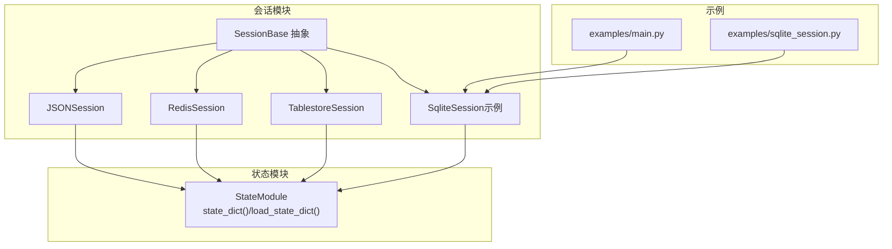
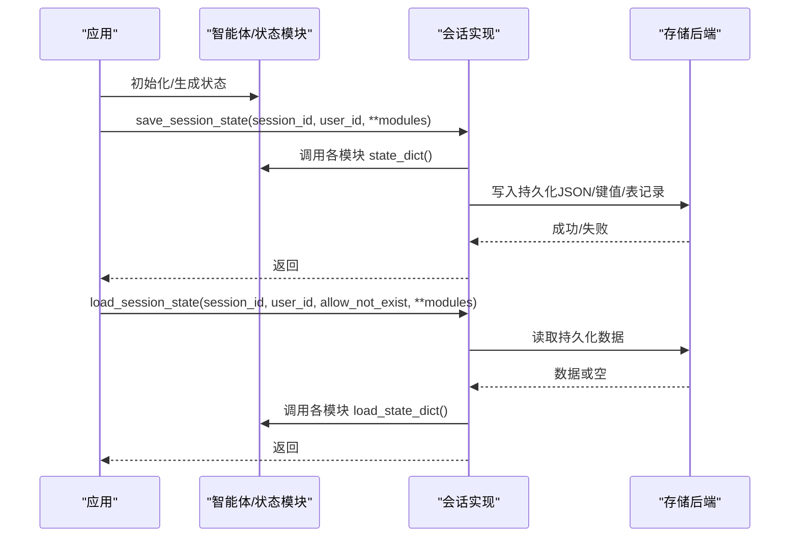
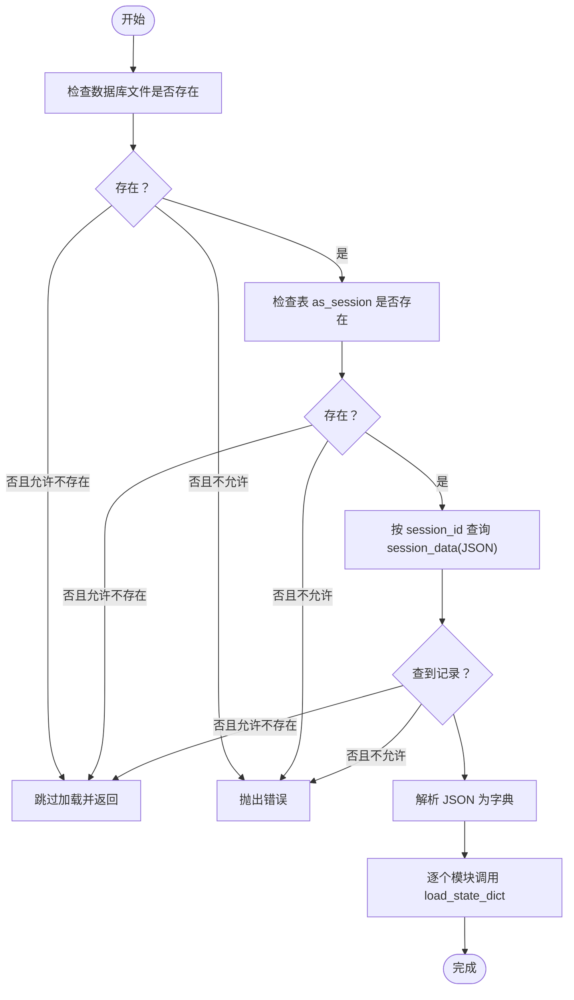
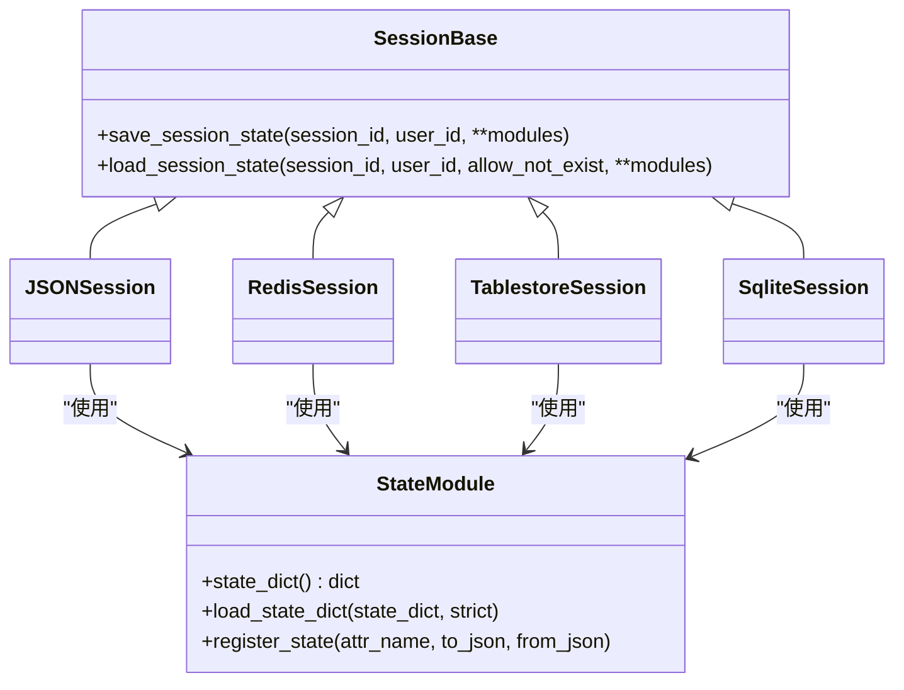

# 会话管理功能

<cite>
**本文引用的文件列表**
- [session/__init__.py](file://src/agentscope/session/__init__.py)
- [session/_session_base.py](file://src/agentscope/session/_session_base.py)
- [session/_json_session.py](file://src/agentscope/session/_json_session.py)
- [session/_redis_session.py](file://src/agentscope/session/_redis_session.py)
- [session/_tablestore_session.py](file://src/agentscope/session/_tablestore_session.py)
- [session/_json_session.py](file://src/agentscope/session/_json_session.py)
- [module/_state_module.py](file://src/agentscope/module/_state_module.py)
- [examples/functionality/session_with_sqlite/main.py](file://examples/functionality/session_with_sqlite/main.py)
- [examples/functionality/session_with_sqlite/sqlite_session.py](file://examples/functionality/session_with_sqlite/sqlite_session.py)
- [examples/functionality/session_with_sqlite/README.md](file://examples/functionality/session_with_sqlite/README.md)
- [tests/session_test.py](file://tests/session_test.py)
- [tests/tablestore_session_test.py](file://tests/tablestore_session_test.py)
</cite>

## 目录
1. [简介](#简介)
2. [项目结构](#项目结构)
3. [核心组件](#核心组件)
4. [架构总览](#架构总览)
5. [详细组件分析](#详细组件分析)
6. [依赖关系分析](#依赖关系分析)
7. [性能考量](#性能考量)
8. [故障排查指南](#故障排查指南)
9. [结论](#结论)
10. [附录](#附录)

## 简介
本文件系统性阐述 AgentScope 的会话管理能力，重点覆盖：
- 多智能体场景下会话的概念与价值：在复杂交互中保持上下文连续性、跨轮对话的记忆延续、多智能体协作的状态同步。
- 会话存储的多种实现：基于 JSON 文件、Redis、Tablestore 以及 SQLite 示例。
- SQLite 集成的完整实现：数据库表结构、数据持久化与查询路径、并发与一致性保障策略。
- 会话生命周期：创建、维护、恢复、清理。
- 分布式与并发访问控制：锁机制、初始化互斥、幂等写入。
- 性能监控、备份恢复与故障诊断建议。

## 项目结构
会话模块位于 src/agentscope/session，提供统一抽象 SessionBase 及多种具体实现；同时配合 StateModule 提供嵌套状态序列化/反序列化能力。示例工程 examples/functionality/session_with_sqlite 演示了 SQLite 的端到端使用方式。

图表来源
- [session/__init__.py:1-15](file://src/agentscope/session/__init__.py#L1-L15)
- [session/_session_base.py:1-49](file://src/agentscope/session/_session_base.py#L1-L49)
- [session/_json_session.py:1-131](file://src/agentscope/session/_json_session.py#L1-L131)
- [session/_redis_session.py:1-210](file://src/agentscope/session/_redis_session.py#L1-L210)
- [session/_tablestore_session.py:1-273](file://src/agentscope/session/_tablestore_session.py#L1-L273)
- [examples/functionality/session_with_sqlite/main.py:1-77](file://examples/functionality/session_with_sqlite/main.py#L1-L77)
- [examples/functionality/session_with_sqlite/sqlite_session.py:1-168](file://examples/functionality/session_with_sqlite/sqlite_session.py#L1-L168)

章节来源
- [session/__init__.py:1-15](file://src/agentscope/session/__init__.py#L1-L15)
- [session/_session_base.py:1-49](file://src/agentscope/session/_session_base.py#L1-L49)

## 核心组件
- SessionBase：定义异步保存与加载会话状态的抽象接口，支持 session_id、user_id、允许不存在标志及多状态模块映射。
- StateModule：提供嵌套状态序列化/反序列化能力，支持注册属性、自定义 JSON 转换函数，确保会话数据可被可靠持久化。
- 具体实现：
  - JSONSession：基于文件系统的轻量持久化，适合本地开发与小规模部署。
  - RedisSession：基于 Redis 的高性能键值存储，支持 TTL 与滑动过期。
  - TablestoreSession：面向分布式场景的云端表存储实现，具备懒初始化与并发互斥。
  - SqliteSession（示例）：基于 SQLite 的关系型持久化，演示了表结构、JSON 字段与冲突更新策略。

章节来源
- [session/_session_base.py:1-49](file://src/agentscope/session/_session_base.py#L1-L49)
- [module/_state_module.py:1-152](file://src/agentscope/module/_state_module.py#L1-L152)
- [session/_json_session.py:1-131](file://src/agentscope/session/_json_session.py#L1-L131)
- [session/_redis_session.py:1-210](file://src/agentscope/session/_redis_session.py#L1-L210)
- [session/_tablestore_session.py:1-273](file://src/agentscope/session/_tablestore_session.py#L1-L273)
- [examples/functionality/session_with_sqlite/sqlite_session.py:1-168](file://examples/functionality/session_with_sqlite/sqlite_session.py#L1-L168)

## 架构总览
会话管理围绕“状态模块”与“存储后端”解耦设计：
- 状态模块负责导出/导入自身状态；
- 会话实现负责将多个状态模块打包为字典并持久化/恢复；
- 不同后端提供一致的 API，便于替换与扩展。

图表来源
- [session/_session_base.py:11-48](file://src/agentscope/session/_session_base.py#L11-L48)
- [session/_json_session.py:47-130](file://src/agentscope/session/_json_session.py#L47-L130)
- [session/_redis_session.py:101-178](file://src/agentscope/session/_redis_session.py#L101-L178)
- [session/_tablestore_session.py:126-237](file://src/agentscope/session/_tablestore_session.py#L126-L237)
- [examples/functionality/session_with_sqlite/sqlite_session.py:27-167](file://examples/functionality/session_with_sqlite/sqlite_session.py#L27-L167)

## 详细组件分析

### 抽象层：SessionBase
- 职责：定义统一的异步保存/加载接口，支持 session_id、user_id、allow_not_exist 与多模块映射。
- 设计要点：异步接口保证高并发下的非阻塞；允许不存在标志用于容错与冷启动。

章节来源
- [session/_session_base.py:8-48](file://src/agentscope/session/_session_base.py#L8-L48)

### 状态模块：StateModule
- 职责：提供嵌套状态序列化/反序列化，支持注册属性与自定义 JSON 转换函数。
- 关键方法：
  - state_dict：递归收集模块与已注册属性的状态。
  - load_state_dict：将状态字典回填至模块，strict 控制缺失键行为。
  - register_state：注册属性并可指定自定义序列化/反序列化函数。
- 嵌套支持：子模块同样继承 StateModule，可形成树状状态结构。

章节来源
- [module/_state_module.py:20-152](file://src/agentscope/module/_state_module.py#L20-L152)

### JSON 文件会话：JSONSession
- 特点：简单易用，适合本地开发与小规模部署。
- 表达：每个 session_id 对应一个 JSON 文件，文件名可带 user_id 前缀。
- 幂等写入：直接覆盖写入，无需冲突处理。
- 容错：allow_not_exist 控制不存在时的行为。

章节来源
- [session/_json_session.py:12-131](file://src/agentscope/session/_json_session.py#L12-L131)

### Redis 会话：RedisSession
- 特点：高性能、支持 TTL 与滑动过期；键命名规范支持 user_id 与 session_id 的组合。
- 幂等写入：使用 set(ex=TTL) 实现原子写入与过期刷新。
- 容错：键不存在时可选择抛错或静默跳过。
- 生命周期：支持异步上下文管理器，自动关闭连接。

章节来源
- [session/_redis_session.py:17-210](file://src/agentscope/session/_redis_session.py#L17-L210)

### Tablestore 会话：TablestoreSession
- 特点：面向分布式场景，使用表存储元数据字段保存会话状态。
- 懒初始化：首次使用时建立客户端与索引，使用 asyncio.Lock 防止并发重复初始化。
- 幂等写入：通过更新会话记录实现 upsert。
- 容错：不存在时可选择日志提示或抛错；空状态数据亦可区分处理。
- 生命周期：支持异步上下文管理器，关闭时重置内部状态。

章节来源
- [session/_tablestore_session.py:12-273](file://src/agentscope/session/_tablestore_session.py#L12-L273)

### SQLite 会话（示例）：SqliteSession
- 表结构：as_session 表，包含 session_id（主键）、session_data（JSON）、created_at、updated_at。
- 幂等写入：INSERT ... ON CONFLICT(session_id) DO UPDATE 实现按 session_id 的 upsert。
- 查询路径：先检查数据库与表是否存在，再按 session_id 查询；不存在时根据 allow_not_exist 决策。
- 容错：不存在时记录日志并可选择抛错；模块缺失时抛出明确错误。
- 使用示例：examples/functionality/session_with_sqlite 展示了从创建智能体、聊天、保存到恢复的完整流程。

图表来源
- [examples/functionality/session_with_sqlite/sqlite_session.py:69-167](file://examples/functionality/session_with_sqlite/sqlite_session.py#L69-L167)

章节来源
- [examples/functionality/session_with_sqlite/sqlite_session.py:12-168](file://examples/functionality/session_with_sqlite/sqlite_session.py#L12-L168)
- [examples/functionality/session_with_sqlite/main.py:16-77](file://examples/functionality/session_with_sqlite/main.py#L16-L77)
- [examples/functionality/session_with_sqlite/README.md:1-25](file://examples/functionality/session_with_sqlite/README.md#L1-L25)

## 依赖关系分析
- 组件耦合：
  - 会话实现均依赖 SessionBase 接口，与 StateModule 解耦，便于替换存储后端。
  - TablestoreSession 引入外部库 tablestore 与 tablestore-for-agent-memory，并使用 asyncio.Lock 保证懒初始化的线程安全。
- 外部依赖：
  - RedisSession 依赖 redis.asyncio。
  - TablestoreSession 依赖 tablestore 与 tablestore-for-agent-memory。
  - JSONSession 依赖 aiofiles。
- 循环依赖：未发现循环依赖，模块职责清晰。

图表来源
- [session/_session_base.py:8-48](file://src/agentscope/session/_session_base.py#L8-L48)
- [module/_state_module.py:20-152](file://src/agentscope/module/_state_module.py#L20-L152)
- [session/_json_session.py:12-131](file://src/agentscope/session/_json_session.py#L12-L131)
- [session/_redis_session.py:17-210](file://src/agentscope/session/_redis_session.py#L17-L210)
- [session/_tablestore_session.py:12-273](file://src/agentscope/session/_tablestore_session.py#L12-L273)
- [examples/functionality/session_with_sqlite/sqlite_session.py:12-168](file://examples/functionality/session_with_sqlite/sqlite_session.py#L12-L168)

章节来源
- [session/_session_base.py:1-49](file://src/agentscope/session/_session_base.py#L1-L49)
- [module/_state_module.py:1-152](file://src/agentscope/module/_state_module.py#L1-L152)
- [session/_json_session.py:1-131](file://src/agentscope/session/_json_session.py#L1-L131)
- [session/_redis_session.py:1-210](file://src/agentscope/session/_redis_session.py#L1-L210)
- [session/_tablestore_session.py:1-273](file://src/agentscope/session/_tablestore_session.py#L1-L273)
- [examples/functionality/session_with_sqlite/sqlite_session.py:1-168](file://examples/functionality/session_with_sqlite/sqlite_session.py#L1-L168)

## 性能考量
- I/O 与序列化：
  - JSONSession：文件系统随机读写，适合小体量状态；注意磁盘 IO 与文件锁竞争。
  - RedisSession：内存型 KV，读写延迟低；合理设置 TTL 与滑动过期，避免热键争用。
  - TablestoreSession：云表存储，适合大规模与高可用场景；注意网络延迟与索引开销。
  - SqliteSession：单机关系型数据库，支持事务与冲突更新；适用于中小规模、需要结构化查询的场景。
- 并发与一致性：
  - TablestoreSession 使用 asyncio.Lock 防止并发初始化；懒初始化减少冷启动成本。
  - RedisSession 使用 GETEX 或 SET+EX 实现滑动过期，避免过期抖动。
  - SqliteSession 使用 INSERT ... ON CONFLICT 实现 upsert，避免重复查询。
- 压缩与分片：
  - 对大体量状态可考虑压缩存储或拆分模块，降低序列化/反序列化成本。
- 监控建议：
  - 记录保存/加载耗时、失败率、模块缺失比例，结合日志级别进行告警。
  - 对 Redis/TTL 场景关注过期命中率与重载频率。

[本节为通用指导，不直接分析具体文件]

## 故障排查指南
- 常见问题与定位：
  - 会话不存在：allow_not_exist 为 False 时会抛错；为 True 时记录 INFO 日志并跳过。
  - 模块缺失：加载时若某模块未在持久化数据中出现，会抛出明确错误，需检查保存时是否包含该模块。
  - 数据库/表不存在：SQLite 加载前检查数据库文件与表是否存在，不存在时根据配置决定行为。
  - 初始化异常：TablestoreSession 需要安装额外依赖，导入失败会抛出 ImportError。
- 测试参考：
  - 单测覆盖了保存/加载往返、不存在会话、覆盖写入、关闭与上下文管理器等关键路径。
  - TablestoreSession 单测通过 Mock 验证懒初始化、upsert、用户 ID 默认值、部分模块加载等行为。

章节来源
- [tests/session_test.py:46-436](file://tests/session_test.py#L46-L436)
- [tests/tablestore_session_test.py:1-417](file://tests/tablestore_session_test.py#L1-L417)
- [session/_tablestore_session.py:60-82](file://src/agentscope/session/_tablestore_session.py#L60-L82)
- [examples/functionality/session_with_sqlite/sqlite_session.py:86-167](file://examples/functionality/session_with_sqlite/sqlite_session.py#L86-L167)

## 结论
AgentScope 的会话管理通过 SessionBase 抽象与 StateModule 嵌套序列化，实现了对多智能体状态的可靠持久化与恢复。不同后端满足从本地开发到分布式生产的多样化需求。SQLite 示例展示了关系型存储的典型实践，包括表结构、JSON 字段与 upsert 写入；TablestoreSession 则提供了分布式场景下的懒初始化与并发互斥保障。结合测试与监控建议，可在生产环境中获得稳定、可观测的会话管理能力。

[本节为总结性内容，不直接分析具体文件]

## 附录

### A. SQLite 表结构与字段说明
- 表名：as_session
- 字段：
  - session_id：主键，唯一标识一次会话。
  - session_data：JSON 文本，保存多个状态模块的序列化结果。
  - created_at：记录创建时间，默认 CURRENT_TIMESTAMP。
  - updated_at：记录最后更新时间，默认 CURRENT_TIMESTAMP。
- 写入策略：INSERT ... ON CONFLICT(session_id) DO UPDATE 实现 upsert，确保幂等。

章节来源
- [examples/functionality/session_with_sqlite/sqlite_session.py:43-67](file://examples/functionality/session_with_sqlite/sqlite_session.py#L43-L67)

### B. 会话生命周期最佳实践
- 创建：首次运行时 allow_not_exist 为 True，避免因会话不存在而中断。
- 维护：定期保存，建议在关键节点（如用户提问后、工具调用前后）执行保存。
- 恢复：启动时优先尝试加载，若失败则进入默认状态或引导用户重新初始化。
- 清理：对不再使用的会话，可删除对应记录或设置 TTL 自动过期（Redis/TTL 场景）。

[本节为通用指导，不直接分析具体文件]

### C. 示例工程：SQLite 会话
- 示例入口：examples/functionality/session_with_sqlite/main.py
- 示例类：examples/functionality/session_with_sqlite/sqlite_session.py
- 功能要点：创建智能体、聊天、保存到 SQLite、恢复并继续对话。

章节来源
- [examples/functionality/session_with_sqlite/main.py:16-77](file://examples/functionality/session_with_sqlite/main.py#L16-L77)
- [examples/functionality/session_with_sqlite/sqlite_session.py:12-168](file://examples/functionality/session_with_sqlite/sqlite_session.py#L12-L168)
- [examples/functionality/session_with_sqlite/README.md:1-25](file://examples/functionality/session_with_sqlite/README.md#L1-L25)