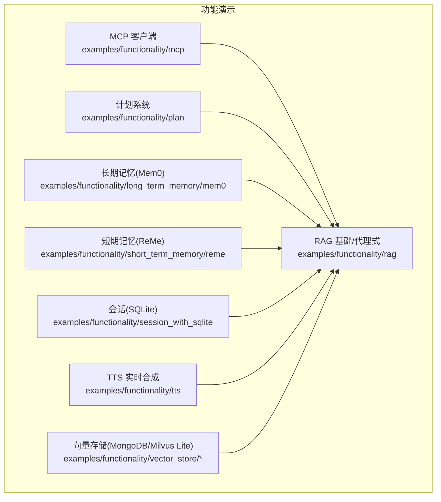
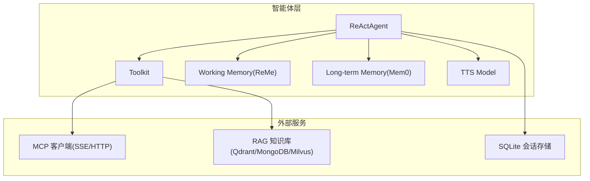
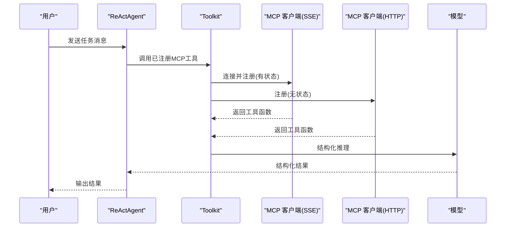
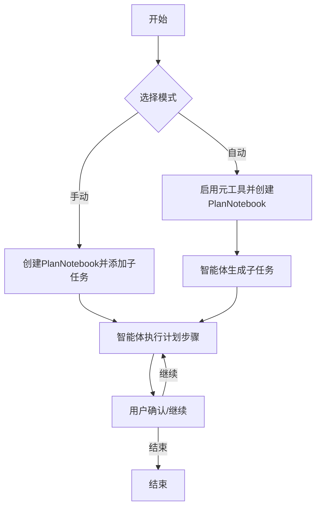
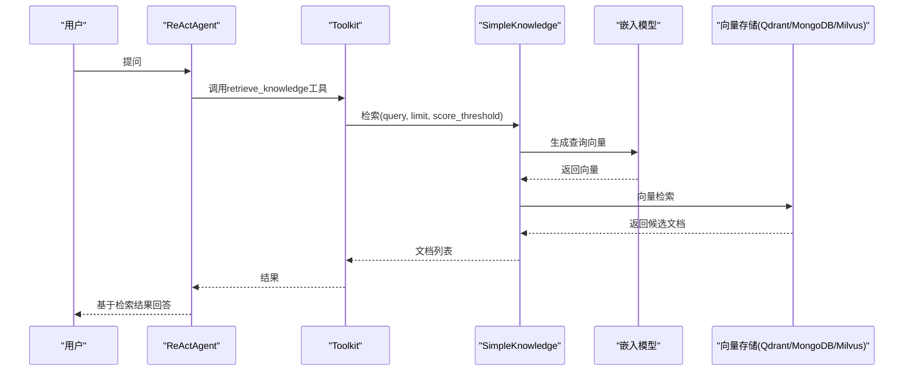
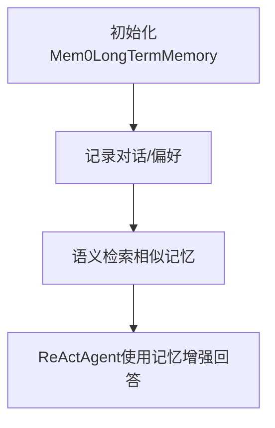
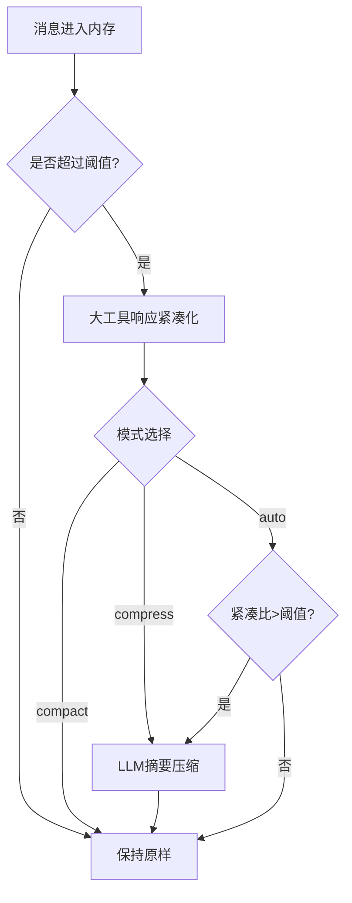
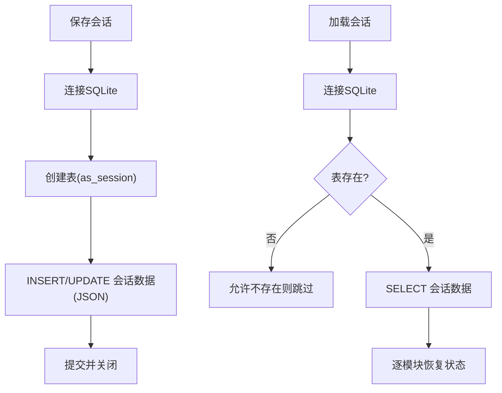
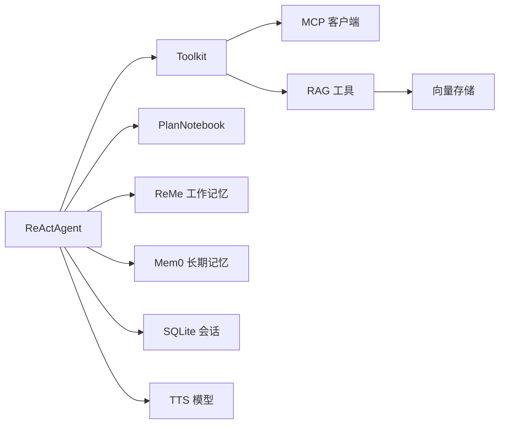

# 功能演示示例

<cite>
**本文引用的文件**
- [examples/functionality/mcp/main.py](file://examples/functionality/mcp/main.py)
- [examples/functionality/plan/main_agent_managed_plan.py](file://examples/functionality/plan/main_agent_managed_plan.py)
- [examples/functionality/plan/main_manual_plan.py](file://examples/functionality/plan/main_manual_plan.py)
- [examples/functionality/rag/basic_usage.py](file://examples/functionality/rag/basic_usage.py)
- [examples/functionality/rag/agentic_usage.py](file://examples/functionality/rag/agentic_usage.py)
- [examples/functionality/long_term_memory/mem0/memory_example.py](file://examples/functionality/long_term_memory/mem0/memory_example.py)
- [examples/functionality/short_term_memory/reme/reme_short_term_memory.py](file://examples/functionality/short_term_memory/reme/reme_short_term_memory.py)
- [examples/functionality/session_with_sqlite/sqlite_session.py](file://examples/functionality/session_with_sqlite/sqlite_session.py)
- [examples/functionality/tts/main.py](file://examples/functionality/tts/main.py)
- [examples/functionality/vector_store/mongodb/main.py](file://examples/functionality/vector_store/mongodb/main.py)
- [examples/functionality/vector_store/milvus_lite/main.py](file://examples/functionality/vector_store/milvus_lite/main.py)
- [examples/functionality/long_term_memory/mem0/README.md](file://examples/functionality/long_term_memory/mem0/README.md)
- [examples/functionality/short_term_memory/reme/README.md](file://examples/functionality/short_term_memory/reme/README.md)
- [examples/functionality/session_with_sqlite/README.md](file://examples/functionality/session_with_sqlite/README.md)
- [examples/functionality/rag/README.md](file://examples/functionality/rag/README.md)
- [examples/functionality/plan/README.md](file://examples/functionality/plan/README.md)
</cite>

## 目录
1. [简介](#简介)
2. [项目结构](#项目结构)
3. [核心组件](#核心组件)
4. [架构概览](#架构概览)
5. [详细组件分析](#详细组件分析)
6. [依赖关系分析](#依赖关系分析)
7. [性能考虑](#性能考虑)
8. [故障排查指南](#故障排查指南)
9. [结论](#结论)
10. [附录](#附录)

## 简介
本文件面向AgentScope的功能演示示例，系统性介绍以下能力与实践：  
- MCP（Model Context Protocol）客户端的集成与使用  
- 计划系统的自动与手动管理模式  
- RAG（检索增强生成）在智能体中的基础与代理式应用  
- 长期记忆与短期记忆实现（Mem0与ReMe）  
- 会话管理（SQLite数据库集成）  
- 向量存储系统（MongoDB、Milvus Lite等）  
- TTS（文本转语音）功能的集成与配置  

每个功能均提供完整示例路径、配置说明与典型应用场景，帮助开发者快速落地。

## 项目结构
AgentScope示例位于examples/functionality目录下，按功能域划分子模块，便于按需学习与复用。本次涉及的关键子模块如下：
- mcp：MCP客户端集成与ReAct智能体协作
- plan：计划系统（自动/手动）
- rag：RAG基础与代理式使用
- long_term_memory/mem0：Mem0长期记忆
- short_term_memory/reme：ReMe短期记忆
- session_with_sqlite：SQLite会话持久化
- tts：实时TTS集成
- vector_store：多种向量存储（MongoDB、Milvus Lite等）

图示来源
- [examples/functionality/mcp/main.py:1-111](file://examples/functionality/mcp/main.py#L1-L111)
- [examples/functionality/plan/main_agent_managed_plan.py:1-66](file://examples/functionality/plan/main_agent_managed_plan.py#L1-L66)
- [examples/functionality/plan/main_manual_plan.py:1-102](file://examples/functionality/plan/main_manual_plan.py#L1-L102)
- [examples/functionality/rag/basic_usage.py:1-80](file://examples/functionality/rag/basic_usage.py#L1-L80)
- [examples/functionality/rag/agentic_usage.py:1-102](file://examples/functionality/rag/agentic_usage.py#L1-L102)
- [examples/functionality/long_term_memory/mem0/memory_example.py:1-186](file://examples/functionality/long_term_memory/mem0/memory_example.py#L1-L186)
- [examples/functionality/short_term_memory/reme/reme_short_term_memory.py:1-350](file://examples/functionality/short_term_memory/reme/reme_short_term_memory.py#L1-L350)
- [examples/functionality/session_with_sqlite/sqlite_session.py:1-168](file://examples/functionality/session_with_sqlite/sqlite_session.py#L1-L168)
- [examples/functionality/tts/main.py:1-57](file://examples/functionality/tts/main.py#L1-L57)
- [examples/functionality/vector_store/mongodb/main.py:1-352](file://examples/functionality/vector_store/mongodb/main.py#L1-L352)
- [examples/functionality/vector_store/milvus_lite/main.py:1-328](file://examples/functionality/vector_store/milvus_lite/main.py#L1-L328)

章节来源
- [examples/functionality/mcp/main.py:1-111](file://examples/functionality/mcp/main.py#L1-L111)
- [examples/functionality/plan/main_agent_managed_plan.py:1-66](file://examples/functionality/plan/main_agent_managed_plan.py#L1-L66)
- [examples/functionality/plan/main_manual_plan.py:1-102](file://examples/functionality/plan/main_manual_plan.py#L1-L102)
- [examples/functionality/rag/basic_usage.py:1-80](file://examples/functionality/rag/basic_usage.py#L1-L80)
- [examples/functionality/rag/agentic_usage.py:1-102](file://examples/functionality/rag/agentic_usage.py#L1-L102)
- [examples/functionality/long_term_memory/mem0/memory_example.py:1-186](file://examples/functionality/long_term_memory/mem0/memory_example.py#L1-L186)
- [examples/functionality/short_term_memory/reme/reme_short_term_memory.py:1-350](file://examples/functionality/short_term_memory/reme/reme_short_term_memory.py#L1-L350)
- [examples/functionality/session_with_sqlite/sqlite_session.py:1-168](file://examples/functionality/session_with_sqlite/sqlite_session.py#L1-L168)
- [examples/functionality/tts/main.py:1-57](file://examples/functionality/tts/main.py#L1-L57)
- [examples/functionality/vector_store/mongodb/main.py:1-352](file://examples/functionality/vector_store/mongodb/main.py#L1-L352)
- [examples/functionality/vector_store/milvus_lite/main.py:1-328](file://examples/functionality/vector_store/milvus_lite/main.py#L1-L328)

## 核心组件
- MCP客户端：支持SSE与可流式HTTP两种传输方式，可注册为工具集，供智能体直接调用
- 计划系统：支持手动规划与由智能体自动生成与执行计划
- RAG：提供文档读取、嵌入、知识库与检索能力，并可作为工具注入智能体
- 长期记忆（Mem0）：基于向量存储的语义记忆持久化，支持记录与检索
- 短期记忆（ReMe）：自动压缩与归档工作记忆，降低上下文开销
- 会话管理（SQLite）：以JSON字段持久化状态模块映射，支持创建/更新/加载
- 向量存储：MongoDB Atlas向量索引与Milvus Lite本地向量库
- TTS：实时语音合成模型接入，配合智能体输出语音

章节来源
- [examples/functionality/mcp/main.py:34-111](file://examples/functionality/mcp/main.py#L34-L111)
- [examples/functionality/plan/main_agent_managed_plan.py:21-66](file://examples/functionality/plan/main_agent_managed_plan.py#L21-L66)
- [examples/functionality/plan/main_manual_plan.py:23-102](file://examples/functionality/plan/main_manual_plan.py#L23-L102)
- [examples/functionality/rag/basic_usage.py:15-80](file://examples/functionality/rag/basic_usage.py#L15-L80)
- [examples/functionality/rag/agentic_usage.py:33-102](file://examples/functionality/rag/agentic_usage.py#L33-L102)
- [examples/functionality/long_term_memory/mem0/memory_example.py:26-186](file://examples/functionality/long_term_memory/mem0/memory_example.py#L26-L186)
- [examples/functionality/short_term_memory/reme/reme_short_term_memory.py:17-350](file://examples/functionality/short_term_memory/reme/reme_short_term_memory.py#L17-L350)
- [examples/functionality/session_with_sqlite/sqlite_session.py:12-168](file://examples/functionality/session_with_sqlite/sqlite_session.py#L12-L168)
- [examples/functionality/tts/main.py:19-57](file://examples/functionality/tts/main.py#L19-L57)
- [examples/functionality/vector_store/mongodb/main.py:14-352](file://examples/functionality/vector_store/mongodb/main.py#L14-L352)
- [examples/functionality/vector_store/milvus_lite/main.py:12-328](file://examples/functionality/vector_store/milvus_lite/main.py#L12-L328)

## 架构概览
下图展示了从智能体到各功能模块的交互关系，以及数据在RAG与记忆系统中的流转。

图示来源
- [examples/functionality/mcp/main.py:34-111](file://examples/functionality/mcp/main.py#L34-L111)
- [examples/functionality/rag/basic_usage.py:15-80](file://examples/functionality/rag/basic_usage.py#L15-L80)
- [examples/functionality/rag/agentic_usage.py:33-102](file://examples/functionality/rag/agentic_usage.py#L33-L102)
- [examples/functionality/long_term_memory/mem0/memory_example.py:26-186](file://examples/functionality/long_term_memory/mem0/memory_example.py#L26-L186)
- [examples/functionality/short_term_memory/reme/reme_short_term_memory.py:17-350](file://examples/functionality/short_term_memory/reme/reme_short_term_memory.py#L17-L350)
- [examples/functionality/session_with_sqlite/sqlite_session.py:12-168](file://examples/functionality/session_with_sqlite/sqlite_session.py#L12-L168)
- [examples/functionality/tts/main.py:19-57](file://examples/functionality/tts/main.py#L19-L57)

## 详细组件分析

### MCP（Model Context Protocol）客户端集成
- 支持SSE与可流式HTTP两种传输方式，分别对应有状态与无状态客户端
- 将MCP工具注册至工具集，智能体可直接调用远程工具
- 提供结构化输出与手动调用工具函数的能力

图示来源
- [examples/functionality/mcp/main.py:34-111](file://examples/functionality/mcp/main.py#L34-L111)

章节来源
- [examples/functionality/mcp/main.py:34-111](file://examples/functionality/mcp/main.py#L34-L111)

### 计划系统：自动与手动管理
- 手动模式：预先定义计划与子任务，智能体按计划逐步执行
- 自动模式：启用元工具，智能体自主制定与执行计划

图示来源
- [examples/functionality/plan/main_manual_plan.py:23-102](file://examples/functionality/plan/main_manual_plan.py#L23-L102)
- [examples/functionality/plan/main_agent_managed_plan.py:21-66](file://examples/functionality/plan/main_agent_managed_plan.py#L21-L66)

章节来源
- [examples/functionality/plan/main_manual_plan.py:23-102](file://examples/functionality/plan/main_manual_plan.py#L23-L102)
- [examples/functionality/plan/main_agent_managed_plan.py:21-66](file://examples/functionality/plan/main_agent_managed_plan.py#L21-L66)

### RAG（检索增强生成）应用
- 基础用法：读取文本/PDF，构建知识库，插入文档并检索
- 代理式用法：将检索封装为工具，智能体根据查询动态调整参数

图示来源
- [examples/functionality/rag/basic_usage.py:15-80](file://examples/functionality/rag/basic_usage.py#L15-L80)
- [examples/functionality/rag/agentic_usage.py:33-102](file://examples/functionality/rag/agentic_usage.py#L33-L102)

章节来源
- [examples/functionality/rag/basic_usage.py:15-80](file://examples/functionality/rag/basic_usage.py#L15-L80)
- [examples/functionality/rag/agentic_usage.py:33-102](file://examples/functionality/rag/agentic_usage.py#L33-L102)

### 长期记忆：Mem0
- 使用DashScope模型与Qdrant向量存储，支持记录与检索
- 可与ReActAgent结合，在对话中自动记录偏好与历史

图示来源
- [examples/functionality/long_term_memory/mem0/memory_example.py:26-186](file://examples/functionality/long_term_memory/mem0/memory_example.py#L26-L186)

章节来源
- [examples/functionality/long_term_memory/mem0/memory_example.py:26-186](file://examples/functionality/long_term_memory/mem0/memory_example.py#L26-L186)
- [examples/functionality/long_term_memory/mem0/README.md:1-158](file://examples/functionality/long_term_memory/mem0/README.md#L1-L158)

### 短期记忆：ReMe
- 自动压缩与归档工作记忆，减少上下文开销
- 支持紧凑模式、压缩模式与自动模式，可配置阈值

图示来源
- [examples/functionality/short_term_memory/reme/reme_short_term_memory.py:17-350](file://examples/functionality/short_term_memory/reme/reme_short_term_memory.py#L17-L350)

章节来源
- [examples/functionality/short_term_memory/reme/reme_short_term_memory.py:17-350](file://examples/functionality/short_term_memory/reme/reme_short_term_memory.py#L17-L350)
- [examples/functionality/short_term_memory/reme/README.md:1-480](file://examples/functionality/short_term_memory/reme/README.md#L1-L480)

### 会话管理：SQLite集成
- 以JSON字段保存状态模块映射，支持创建/更新/加载
- 适配多态状态模块，便于扩展

图示来源
- [examples/functionality/session_with_sqlite/sqlite_session.py:12-168](file://examples/functionality/session_with_sqlite/sqlite_session.py#L12-L168)

章节来源
- [examples/functionality/session_with_sqlite/sqlite_session.py:12-168](file://examples/functionality/session_with_sqlite/sqlite_session.py#L12-L168)
- [examples/functionality/session_with_sqlite/README.md:1-25](file://examples/functionality/session_with_sqlite/README.md#L1-L25)

### 向量存储系统
- MongoDB：支持向量搜索、过滤、多分片文档
- Milvus Lite：轻量级本地向量库，支持过滤与多度量

章节来源
- [examples/functionality/vector_store/mongodb/main.py:14-352](file://examples/functionality/vector_store/mongodb/main.py#L14-L352)
- [examples/functionality/vector_store/milvus_lite/main.py:12-328](file://examples/functionality/vector_store/milvus_lite/main.py#L12-L328)

### TTS（文本转语音）集成
- 在智能体中配置实时TTS模型，实现语音输出
- 支持音色与非流式配置

章节来源
- [examples/functionality/tts/main.py:19-57](file://examples/functionality/tts/main.py#L19-L57)

## 依赖关系分析
- 智能体依赖工具集进行外部能力调用；工具集可封装MCP与RAG检索
- 计划系统与RAG协同，提升复杂任务的结构性与信息密度
- 长期与短期记忆共同保障上下文质量与成本控制
- 会话管理贯穿生命周期，确保状态可恢复
- 向量存储为RAG提供高效检索支撑
- TTS作为输出通道，增强交互体验

图示来源
- [examples/functionality/mcp/main.py:34-111](file://examples/functionality/mcp/main.py#L34-L111)
- [examples/functionality/rag/agentic_usage.py:33-102](file://examples/functionality/rag/agentic_usage.py#L33-L102)
- [examples/functionality/plan/main_agent_managed_plan.py:21-66](file://examples/functionality/plan/main_agent_managed_plan.py#L21-L66)
- [examples/functionality/short_term_memory/reme/reme_short_term_memory.py:17-350](file://examples/functionality/short_term_memory/reme/reme_short_term_memory.py#L17-L350)
- [examples/functionality/long_term_memory/mem0/memory_example.py:26-186](file://examples/functionality/long_term_memory/mem0/memory_example.py#L26-L186)
- [examples/functionality/session_with_sqlite/sqlite_session.py:12-168](file://examples/functionality/session_with_sqlite/sqlite_session.py#L12-L168)
- [examples/functionality/tts/main.py:19-57](file://examples/functionality/tts/main.py#L19-L57)

## 性能考虑
- 上下文窗口管理：优先采用ReMe自动压缩/归档策略，避免“上下文退化”
- 检索参数调优：RAG检索需平衡limit与score_threshold，避免噪声
- 存储维度一致性：更换嵌入模型或维度时，注意向量存储路径或重建
- 会话持久化：SQLite写入采用JSON字段，建议批量合并更新
- TTS延迟：非流式合成适合离线场景，流式合成适合实时交互

## 故障排查指南
- API密钥缺失：运行前检查环境变量（如DASHSCOPE_API_KEY），确保可用
- 向量存储维度不匹配：更换嵌入模型后需清理旧库或切换存储路径
- ReMe依赖缺失：安装reme-ai库，确保可导入ReMeApp
- SQLite表不存在：首次运行时自动建表；若删除表需重新初始化
- MCP连接失败：确认服务器地址与传输协议（SSE/HTTP）正确

章节来源
- [examples/functionality/long_term_memory/mem0/README.md:1-158](file://examples/functionality/long_term_memory/mem0/README.md#L1-L158)
- [examples/functionality/short_term_memory/reme/README.md:1-480](file://examples/functionality/short_term_memory/reme/README.md#L1-L480)
- [examples/functionality/session_with_sqlite/README.md:1-25](file://examples/functionality/session_with_sqlite/README.md#L1-L25)
- [examples/functionality/rag/README.md:1-41](file://examples/functionality/rag/README.md#L1-L41)
- [examples/functionality/plan/README.md:1-30](file://examples/functionality/plan/README.md#L1-L30)

## 结论
通过上述功能演示，AgentScope提供了从外部工具集成（MCP）、计划管理、RAG检索、记忆系统、会话持久化到语音输出的完整能力闭环。开发者可按需组合这些模块，快速搭建具备上下文工程能力的智能体系统，并在生产环境中实现稳定、可扩展与低成本的运行。

## 附录
- 示例入口与运行方式请参考各子模块README中的Quick Start与命令示例
- 如需扩展新向量存储或记忆后端，可在相应抽象接口上实现具体类，遵循现有工具/模型/格式化器契约