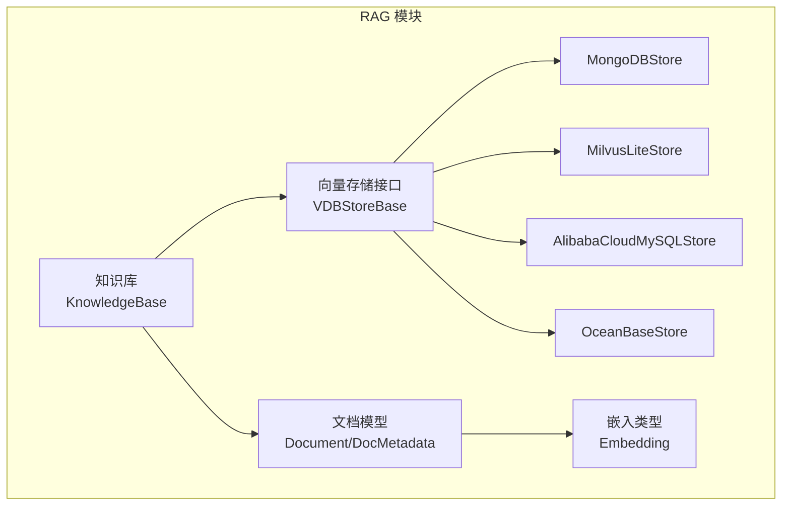
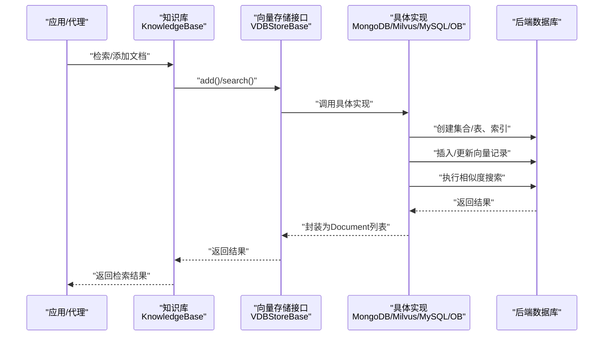
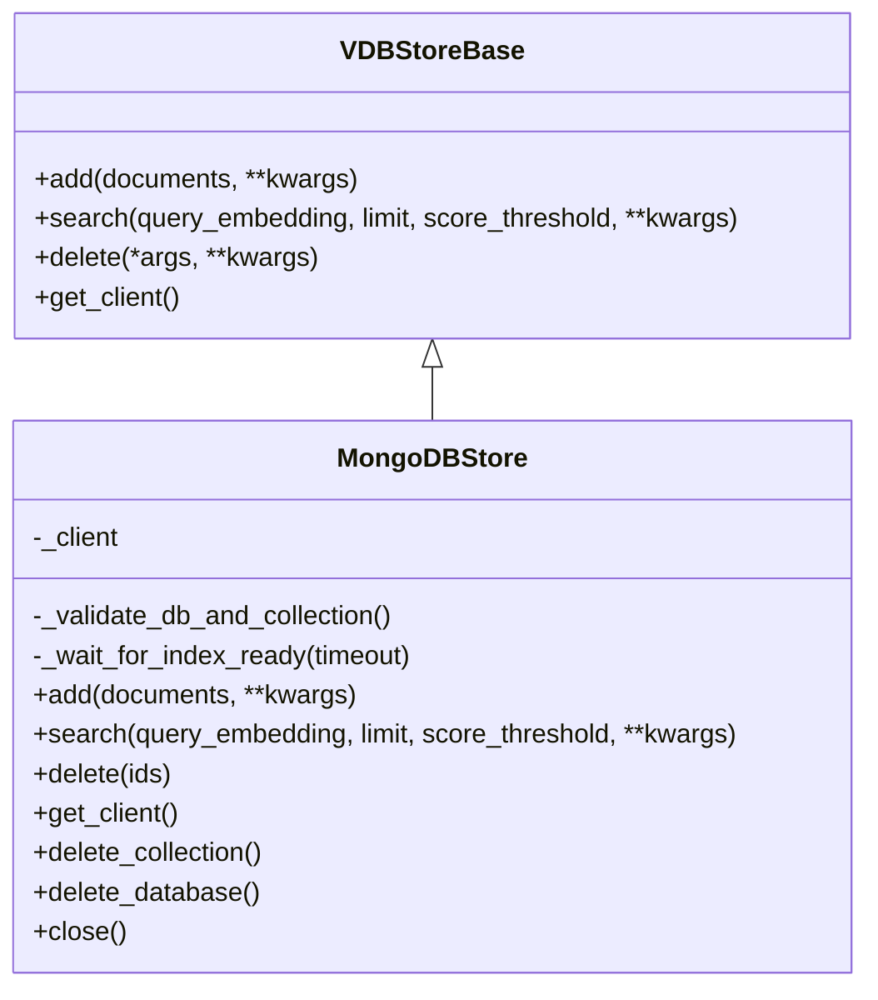
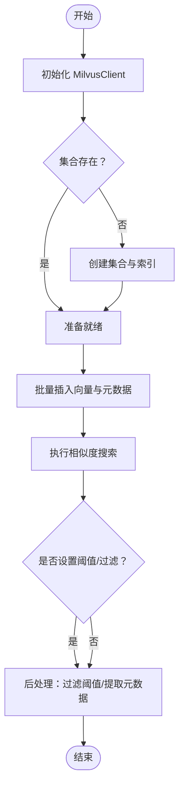
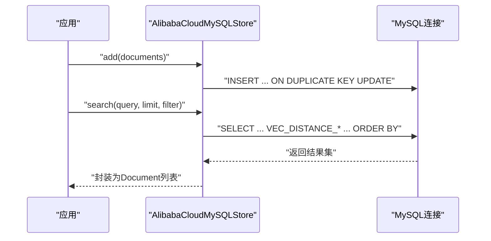
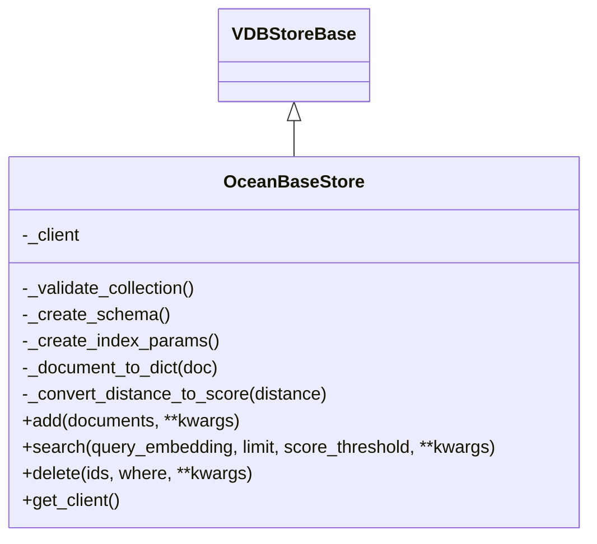
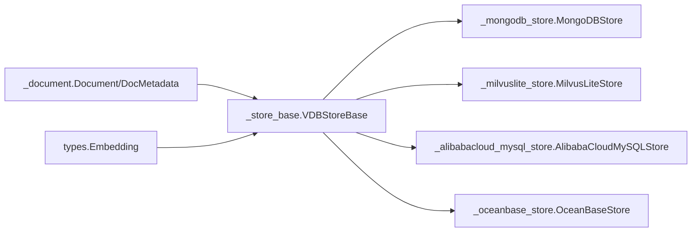
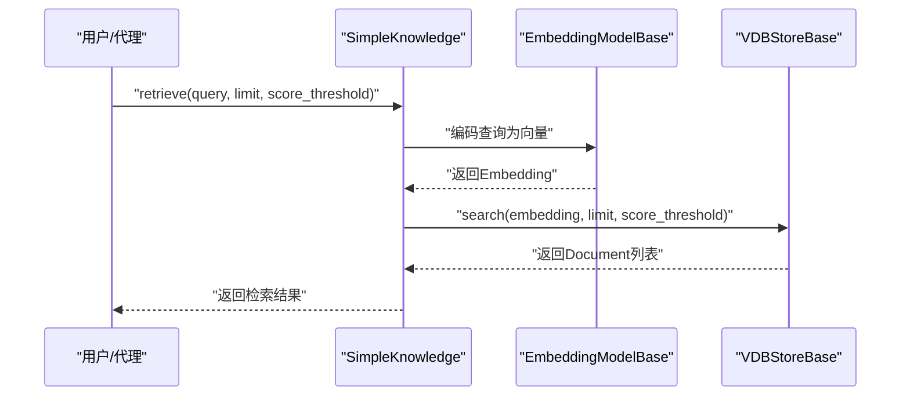

# 向量存储系统

<cite>
**本文引用的文件**
- [src/agentscope/rag/_store/__init__.py](file://src/agentscope/rag/_store/__init__.py)
- [src/agentscope/rag/_store/_store_base.py](file://src/agentscope/rag/_store/_store_base.py)
- [src/agentscope/rag/_store/_mongodb_store.py](file://src/agentscope/rag/_store/_mongodb_store.py)
- [src/agentscope/rag/_store/_milvuslite_store.py](file://src/agentscope/rag/_store/_milvuslite_store.py)
- [src/agentscope/rag/_store/_alibabacloud_mysql_store.py](file://src/agentscope/rag/_store/_alibabacloud_mysql_store.py)
- [src/agentscope/rag/_store/_oceanbase_store.py](file://src/agentscope/rag/_store/_oceanbase_store.py)
- [src/agentscope/rag/_document.py](file://src/agentscope/rag/_document.py)
- [src/agentscope/types/_object.py](file://src/agentscope/types/_object.py)
- [examples/functionality/vector_store/mongodb/README.md](file://examples/functionality/vector_store/mongodb/README.md)
- [examples/functionality/vector_store/mongodb/main.py](file://examples/functionality/vector_store/mongodb/main.py)
- [examples/functionality/vector_store/milvus_lite/README.md](file://examples/functionality/vector_store/milvus_lite/README.md)
- [examples/functionality/vector_store/milvus_lite/main.py](file://examples/functionality/vector_store/milvus_lite/main.py)
- [examples/functionality/vector_store/alibabacloud_mysql_vector/README.md](file://examples/functionality/vector_store/alibabacloud_mysql_vector/README.md)
- [examples/functionality/vector_store/alibabacloud_mysql_vector/main.py](file://examples/functionality/vector_store/alibabacloud_mysql_vector/main.py)
- [examples/functionality/vector_store/oceanbase/README.md](file://examples/functionality/vector_store/oceanbase/README.md)
- [examples/functionality/vector_store/oceanbase/main.py](file://examples/functionality/vector_store/oceanbase/main.py)
- [src/agentscope/rag/_knowledge_base.py](file://src/agentscope/rag/_knowledge_base.py)
- [src/agentscope/rag/_simple_knowledge.py](file://src/agentscope/rag/_simple_knowledge.py)
</cite>

## 目录
1. [简介](#简介)
2. [项目结构](#项目结构)
3. [核心组件](#核心组件)
4. [架构总览](#架构总览)
5. [详细组件分析](#详细组件分析)
6. [依赖分析](#依赖分析)
7. [性能考虑](#性能考虑)
8. [故障排查指南](#故障排查指南)
9. [结论](#结论)
10. [附录](#附录)

## 简介
本文件面向AgentScope的向量存储系统，系统性梳理并对比MongoDB、Milvus Lite、阿里云MySQL向量与OceanBase四种向量存储方案，覆盖以下主题：
- 存储方案特性与适用场景
- 向量数据的创建、索引建立、查询检索流程与参数
- 性能优化策略与最佳实践
- 在RAG系统中的集成方式
- 配置示例与运维要点（连接参数、认证方式、容量规划）

## 项目结构
AgentScope的向量存储位于RAG模块的store子包中，统一抽象于VDBStoreBase基类，并针对不同后端提供具体实现。示例工程位于examples/functionality/vector_store目录下，分别演示了MongoDB、Milvus Lite、阿里云MySQL向量与OceanBase的用法。

图示来源
- [src/agentscope/rag/_store/__init__.py:1-21](file://src/agentscope/rag/_store/__init__.py#L1-L21)
- [src/agentscope/rag/_store/_store_base.py:10-50](file://src/agentscope/rag/_store/_store_base.py#L10-L50)
- [src/agentscope/rag/_document.py:17-52](file://src/agentscope/rag/_document.py#L17-L52)
- [src/agentscope/types/_object.py:5-6](file://src/agentscope/types/_object.py#L5-L6)

章节来源
- [src/agentscope/rag/_store/__init__.py:1-21](file://src/agentscope/rag/_store/__init__.py#L1-L21)
- [src/agentscope/rag/_store/_store_base.py:10-50](file://src/agentscope/rag/_store/_store_base.py#L10-L50)
- [src/agentscope/rag/_document.py:17-52](file://src/agentscope/rag/_document.py#L17-L52)
- [src/agentscope/types/_object.py:5-6](file://src/agentscope/types/_object.py#L5-L6)

## 核心组件
- VDBStoreBase：定义统一的异步接口，包括add、search、delete与可选的get_client。
- Document/DocMetadata：文档数据结构，承载内容、文档ID、分片信息与可选嵌入向量。
- Embedding：嵌入向量类型别名，用于查询与存储。

关键职责与约定
- 所有实现均遵循异步API，便于在RAG流水线中非阻塞执行。
- search支持score_threshold过滤；部分实现支持额外过滤参数（如MongoDB的filter、Milvus Lite的filter表达式、OceanBase的flter）。
- get_client允许直接访问底层客户端进行高级操作或运维。

章节来源
- [src/agentscope/rag/_store/_store_base.py:10-50](file://src/agentscope/rag/_store/_store_base.py#L10-L50)
- [src/agentscope/rag/_document.py:17-52](file://src/agentscope/rag/_document.py#L17-L52)
- [src/agentscope/types/_object.py:5-6](file://src/agentscope/types/_object.py#L5-L6)

## 架构总览
下图展示了RAG知识库通过统一的VDBStoreBase接口对接多种向量存储后端的总体架构。

图示来源
- [src/agentscope/rag/_knowledge_base.py:13-44](file://src/agentscope/rag/_knowledge_base.py#L13-L44)
- [src/agentscope/rag/_store/_store_base.py:14-49](file://src/agentscope/rag/_store/_store_base.py#L14-L49)
- [src/agentscope/rag/_store/_mongodb_store.py:193-392](file://src/agentscope/rag/_store/_mongodb_store.py#L193-L392)
- [src/agentscope/rag/_store/_milvuslite_store.py:100-257](file://src/agentscope/rag/_store/_milvuslite_store.py#L100-L257)
- [src/agentscope/rag/_store/_alibabacloud_mysql_store.py:171-403](file://src/agentscope/rag/_store/_alibabacloud_mysql_store.py#L171-L403)
- [src/agentscope/rag/_store/_oceanbase_store.py:279-553](file://src/agentscope/rag/_store/_oceanbase_store.py#L279-L553)

## 详细组件分析

### MongoDB 向量存储（MongoDBStore）
- 特点
  - 基于MongoDB Atlas/自建实例的向量搜索能力，自动创建数据库、集合与向量搜索索引。
  - 支持cosine/euclidean/dotProduct三种距离度量。
  - 可通过filter_fields声明过滤字段，使用$vectorSearch进行过滤。
- 关键流程
  - add：批量upsert，自动等待索引就绪。
  - search：构建$vectorSearch聚合管道，支持score_threshold与filter。
  - delete：按doc_id删除。
- 连接与认证
  - host支持mongodb://或mongodb+srv://；可通过client_kwargs传递高级参数。
  - 示例README提供了Atlas与本地连接样例。
- 最佳实践
  - 使用filter_fields声明常用过滤字段，提升检索效率。
  - num_candidates建议设置为limit*20以上以平衡召回与性能。
  - 使用get_client进行统计与运维。

图示来源
- [src/agentscope/rag/_store/_store_base.py:10-50](file://src/agentscope/rag/_store/_store_base.py#L10-L50)
- [src/agentscope/rag/_store/_mongodb_store.py:24-392](file://src/agentscope/rag/_store/_mongodb_store.py#L24-L392)

章节来源
- [src/agentscope/rag/_store/_mongodb_store.py:193-392](file://src/agentscope/rag/_store/_mongodb_store.py#L193-L392)
- [examples/functionality/vector_store/mongodb/README.md:1-212](file://examples/functionality/vector_store/mongodb/README.md#L1-L212)
- [examples/functionality/vector_store/mongodb/main.py:14-352](file://examples/functionality/vector_store/mongodb/main.py#L14-L352)

### Milvus Lite 向量存储（MilvusLiteStore）
- 特点
  - 本地嵌入式Milvus，适合开发与小规模应用；不支持Windows。
  - 使用新的MilvusClient API，自动创建集合与HNSW索引。
  - 支持COSINE/L2/IP三种度量。
- 关键流程
  - add：生成唯一ID（字符串或整数），写入向量与元数据。
  - search：默认返回doc_id/chunk_id/content/total_chunks等元数据字段。
  - delete：支持ids或filter表达式。
- 连接与认证
  - uri支持本地文件路径或远程服务地址；token仅用于远程模式。
- 最佳实践
  - 大数据量时注意内存占用与磁盘IO；必要时迁移到远程Milvus。
  - filter表达式支持比较、逻辑运算符，便于多维过滤。

图示来源
- [src/agentscope/rag/_store/_milvuslite_store.py:86-257](file://src/agentscope/rag/_store/_milvuslite_store.py#L86-L257)

章节来源
- [src/agentscope/rag/_store/_milvuslite_store.py:100-257](file://src/agentscope/rag/_store/_milvuslite_store.py#L100-L257)
- [examples/functionality/vector_store/milvus_lite/README.md:1-129](file://examples/functionality/vector_store/milvus_lite/README.md#L1-L129)
- [examples/functionality/vector_store/milvus_lite/main.py:12-328](file://examples/functionality/vector_store/milvus_lite/main.py#L12-L328)

### 阿里云MySQL 向量存储（AlibabaCloudMySQLStore）
- 特点
  - 基于MySQL 8.0+原生VECTOR类型与向量函数（VEC_FROMTEXT、VEC_DISTANCE_*）。
  - 自动创建表与向量索引（HNSW），支持COSINE/EUCLIDEAN两种度量。
  - 支持SQL WHERE过滤，适合已有MySQL生态的企业环境。
- 关键流程
  - add：使用ON DUPLICATE KEY UPDATE保证幂等；通过VEC_FROMTEXT转换文本向量。
  - search：基于MySQL原生向量函数与ORDER BY排序，支持score_threshold转换。
  - delete：支持ids或filter WHERE表达式。
- 连接与认证
  - 支持SSL连接参数；需确保RDS白名单与安全组放通。
- 最佳实践
  - 小到中型数据集（≤10万向量）表现良好；超大规模建议专用向量DB。
  - 利用连接池与只读副本提升并发与读取性能。

图示来源
- [src/agentscope/rag/_store/_alibabacloud_mysql_store.py:171-403](file://src/agentscope/rag/_store/_alibabacloud_mysql_store.py#L171-L403)

章节来源
- [src/agentscope/rag/_store/_alibabacloud_mysql_store.py:171-403](file://src/agentscope/rag/_store/_alibabacloud_mysql_store.py#L171-L403)
- [examples/functionality/vector_store/alibabacloud_mysql_vector/README.md:1-423](file://examples/functionality/vector_store/alibabacloud_mysql_vector/README.md#L1-L423)
- [examples/functionality/vector_store/alibabacloud_mysql_vector/main.py:12-283](file://examples/functionality/vector_store/alibabacloud_mysql_vector/main.py#L12-L283)

### OceanBase 向量存储（OceanBaseStore）
- 特点
  - 基于pyobvector适配Milvus协议风格，兼容HNSW索引与多种度量（COSINE/L2/IP）。
  - 支持SQLAlchemy风格过滤（flter参数），适合复杂条件筛选。
- 关键流程
  - add：生成UUID主键，写入向量与JSON内容字段。
  - search：自动补齐输出字段，按度量类型转换距离为分数。
  - delete：支持ids与flter过滤条件。
- 连接与认证
  - 默认URI为127.0.0.1:2881，支持多租户用户名格式；可通过环境变量覆盖。
- 最佳实践
  - 适合已有OceanBase/SeekDB基础设施的用户；生产建议配合OB集群部署。

图示来源
- [src/agentscope/rag/_store/_store_base.py:10-50](file://src/agentscope/rag/_store/_store_base.py#L10-L50)
- [src/agentscope/rag/_store/_oceanbase_store.py:38-553](file://src/agentscope/rag/_store/_oceanbase_store.py#L38-L553)

章节来源
- [src/agentscope/rag/_store/_oceanbase_store.py:130-553](file://src/agentscope/rag/_store/_oceanbase_store.py#L130-L553)
- [examples/functionality/vector_store/oceanbase/README.md:1-165](file://examples/functionality/vector_store/oceanbase/README.md#L1-L165)
- [examples/functionality/vector_store/oceanbase/main.py:14-351](file://examples/functionality/vector_store/oceanbase/main.py#L14-L351)

## 依赖分析
- 组件内聚与耦合
  - VDBStoreBase提供统一抽象，降低上层对具体实现的依赖。
  - 各实现均依赖Document/DocMetadata与Embedding类型，保持数据契约一致。
- 外部依赖
  - MongoDB：pymongo（异步客户端）
  - Milvus Lite：pymilvus（含milvus_lite）
  - 阿里云MySQL：mysql-connector-python
  - OceanBase：pyobvector
- 潜在循环依赖
  - 当前实现未见循环导入；各实现独立封装外部SDK。

图示来源
- [src/agentscope/rag/_store/_store_base.py:10-50](file://src/agentscope/rag/_store/_store_base.py#L10-L50)
- [src/agentscope/rag/_store/_mongodb_store.py:24-392](file://src/agentscope/rag/_store/_mongodb_store.py#L24-L392)
- [src/agentscope/rag/_store/_milvuslite_store.py:19-257](file://src/agentscope/rag/_store/_milvuslite_store.py#L19-L257)
- [src/agentscope/rag/_store/_alibabacloud_mysql_store.py:19-403](file://src/agentscope/rag/_store/_alibabacloud_mysql_store.py#L19-L403)
- [src/agentscope/rag/_store/_oceanbase_store.py:38-553](file://src/agentscope/rag/_store/_oceanbase_store.py#L38-L553)
- [src/agentscope/rag/_document.py:17-52](file://src/agentscope/rag/_document.py#L17-L52)
- [src/agentscope/types/_object.py:5-6](file://src/agentscope/types/_object.py#L5-L6)

章节来源
- [src/agentscope/rag/_store/_store_base.py:10-50](file://src/agentscope/rag/_store/_store_base.py#L10-L50)
- [src/agentscope/rag/_store/_mongodb_store.py:85-91](file://src/agentscope/rag/_store/_mongodb_store.py#L85-L91)
- [src/agentscope/rag/_store/_milvuslite_store.py:64-70](file://src/agentscope/rag/_store/_milvuslite_store.py](file://src/agentscope/rag/_store/_milvuslite_store.py#L64-L70)
- [src/agentscope/rag/_store/_alibabacloud_mysql_store.py:83-89](file://src/agentscope/rag/_store/_alibabacloud_mysql_store.py#L83-L89)
- [src/agentscope/rag/_store/_oceanbase_store.py:90-96](file://src/agentscope/rag/_store/_oceanbase_store.py#L90-L96)

## 性能考虑
- 索引与度量选择
  - MongoDB：$vectorSearch索引自动创建；num_candidates建议≥limit*20。
  - Milvus Lite：HNSW索引，COSINE/L2/IP三选一；注意Windows限制。
  - 阿里云MySQL：HNSW M参数控制图连通性，默认16；仅支持COSINE/EUCLIDEAN。
  - OceanBase：HNSW索引，COSINE转相似度，IP使用正内积语义。
- 查询优化
  - 使用score_threshold减少无效返回；MongoDB/Milvus/OB支持阈值过滤。
  - 合理设置limit与num_candidates，避免全表扫描。
  - 阿里云MySQL通过ORDER BY与WHERE过滤，尽量利用索引列。
- 写入优化
  - 批量插入；MongoDB使用bulk_write/upsert；MySQL使用ON DUPLICATE KEY UPDATE。
- 运维与容量
  - MongoDB：可使用get_client进行统计与运维；支持删除集合/数据库。
  - Milvus Lite：.db文件即数据；注意磁盘空间与备份。
  - 阿里云MySQL：结合RDS只读实例与连接池；监控慢查询。
  - OceanBase：多租户与集群部署；通过flter进行复杂过滤。

[本节为通用指导，无需特定文件引用]

## 故障排查指南
- MongoDB
  - 现象：索引未就绪导致查询失败
  - 处理：等待自动索引就绪或检查连接参数；使用get_client验证状态
  - 参考：示例脚本与README中的索引等待逻辑
- Milvus Lite
  - 现象：Windows不支持、集合不存在
  - 处理：确认平台支持；首次调用会自动创建集合
- 阿里云MySQL
  - 现象：连接失败、向量函数不可用
  - 处理：检查RDS白名单、安全组、版本与插件启用状态；测试VEC_FROMTEXT与VECTOR索引
- OceanBase
  - 现象：flter参数与where冲突
  - 处理：使用flter传入SQLAlchemy表达式；避免where_document参数

章节来源
- [src/agentscope/rag/_store/_mongodb_store.py:164-191](file://src/agentscope/rag/_store/_mongodb_store.py#L164-L191)
- [examples/functionality/vector_store/mongodb/README.md:1-212](file://examples/functionality/vector_store/mongodb/README.md#L1-L212)
- [examples/functionality/vector_store/milvus_lite/README.md:111-124](file://examples/functionality/vector_store/milvus_lite/README.md#L111-L124)
- [examples/functionality/vector_store/alibabacloud_mysql_vector/README.md:269-334](file://examples/functionality/vector_store/alibabacloud_mysql_vector/README.md#L269-L334)
- [src/agentscope/rag/_store/_oceanbase_store.py:507-542](file://src/agentscope/rag/_store/_oceanbase_store.py#L507-L542)

## 结论
- 选择建议
  - 开发与小规模：Milvus Lite（本地轻量）
  - 已有MongoDB生态：MongoDB（Atlas/自建）
  - 已有MySQL生态且需要原生向量：阿里云MySQL（RDS）
  - 企业级向量检索与OceanBase生态：OceanBase
- 统一接口与扩展性
  - VDBStoreBase提供一致的异步API，便于在RAG系统中无缝切换后端。
- 最佳实践
  - 明确度量与阈值策略；合理设计过滤字段；关注索引与连接参数；做好容量与运维规划。

[本节为总结，无需特定文件引用]

## 附录

### RAG系统集成示例（概览）
- 知识库抽象：KnowledgeBase负责检索与文档添加，依赖VDBStoreBase与EmbeddingModelBase。
- 简单知识库：SimpleKnowledge封装检索流程，先编码查询，再调用向量存储检索。

图示来源
- [src/agentscope/rag/_simple_knowledge.py:13-44](file://src/agentscope/rag/_simple_knowledge.py#L13-L44)
- [src/agentscope/rag/_knowledge_base.py:13-44](file://src/agentscope/rag/_knowledge_base.py#L13-L44)

章节来源
- [src/agentscope/rag/_simple_knowledge.py:10-44](file://src/agentscope/rag/_simple_knowledge.py#L10-L44)
- [src/agentscope/rag/_knowledge_base.py:13-44](file://src/agentscope/rag/_knowledge_base.py#L13-L44)

### 配置与参数速查（示例路径）
- MongoDB
  - 初始化参数：host/db_name/collection_name/dimensions/index_name/distance/filter_fields/client_kwargs/db_kwargs/collection_kwargs
  - 示例参考：[examples/functionality/vector_store/mongodb/README.md:46-76](file://examples/functionality/vector_store/mongodb/README.md#L46-L76)
- Milvus Lite
  - 初始化参数：uri/collection_name/dimensions/distance/token/client_kwargs/collection_kwargs
  - 示例参考：[examples/functionality/vector_store/milvus_lite/README.md:29-38](file://examples/functionality/vector_store/milvus_lite/README.md#L29-L38)
- 阿里云MySQL
  - 初始化参数：host/port/user/password/database/table_name/dimensions/distance/hnsw_m/connection_kwargs
  - 示例参考：[examples/functionality/vector_store/alibabacloud_mysql_vector/README.md:77-93](file://examples/functionality/vector_store/alibabacloud_mysql_vector/README.md#L77-L93)
- OceanBase
  - 初始化参数：collection_name/dimensions/uri/user/password/db_name/distance/client_kwargs/collection_kwargs
  - 示例参考：[examples/functionality/vector_store/oceanbase/README.md:33-45](file://examples/functionality/vector_store/oceanbase/README.md#L33-L45)

章节来源
- [examples/functionality/vector_store/mongodb/README.md:46-76](file://examples/functionality/vector_store/mongodb/README.md#L46-L76)
- [examples/functionality/vector_store/milvus_lite/README.md:29-38](file://examples/functionality/vector_store/milvus_lite/README.md#L29-L38)
- [examples/functionality/vector_store/alibabacloud_mysql_vector/README.md:77-93](file://examples/functionality/vector_store/alibabacloud_mysql_vector/README.md#L77-L93)
- [examples/functionality/vector_store/oceanbase/README.md:33-45](file://examples/functionality/vector_store/oceanbase/README.md#L33-L45)