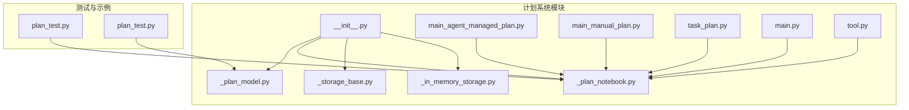
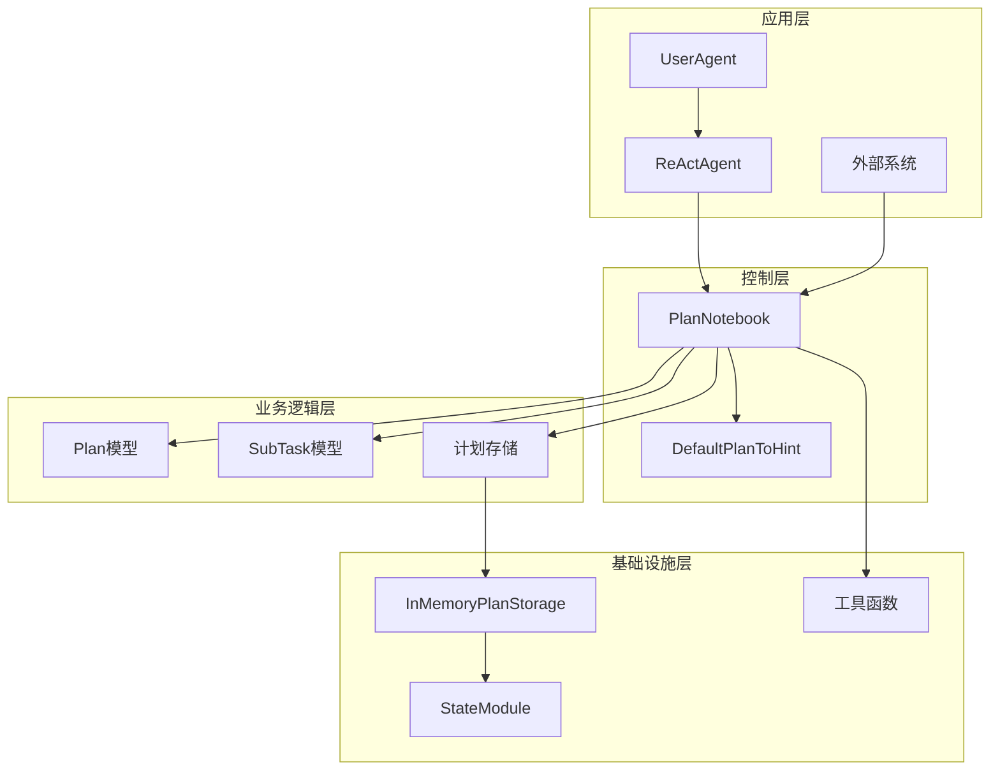
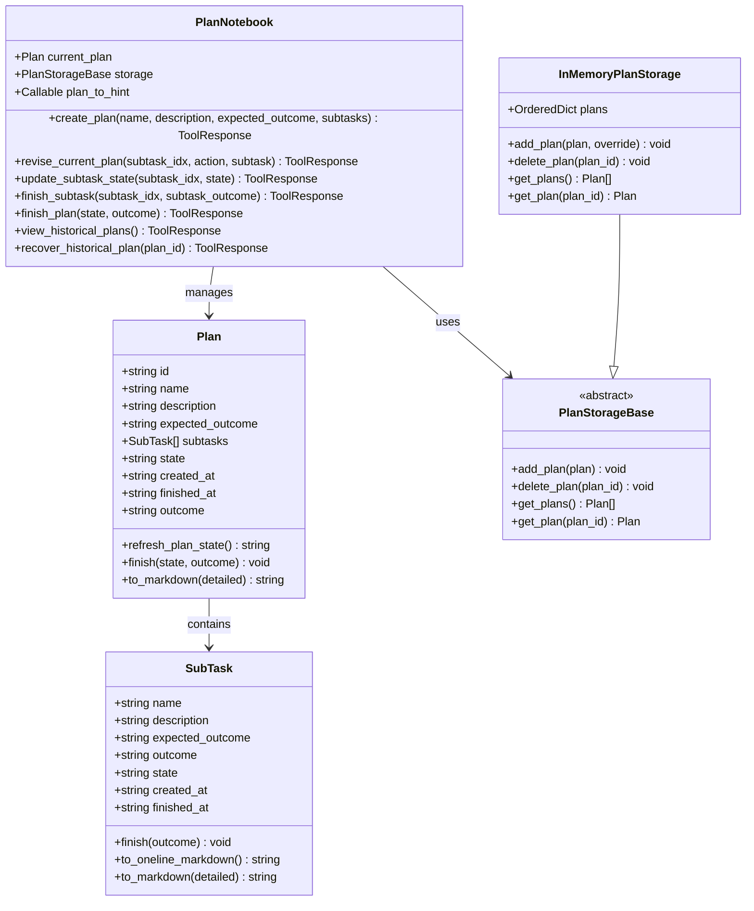
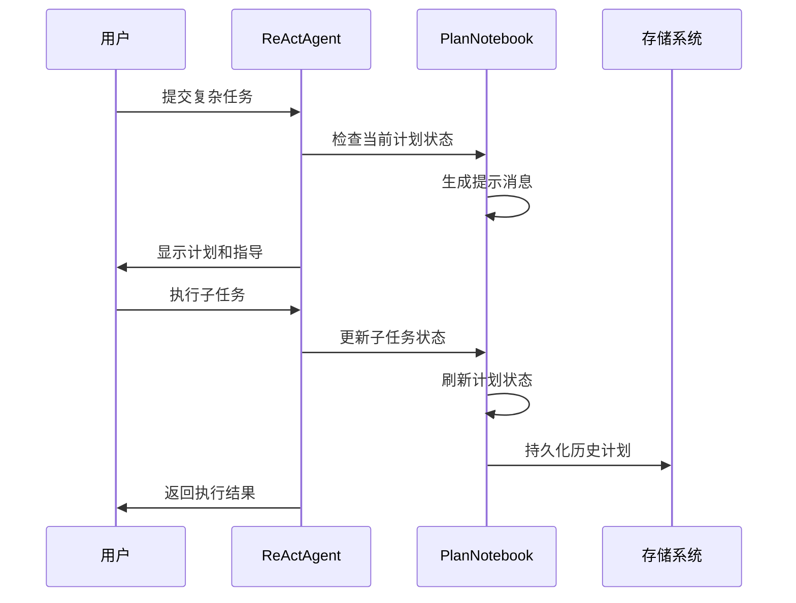
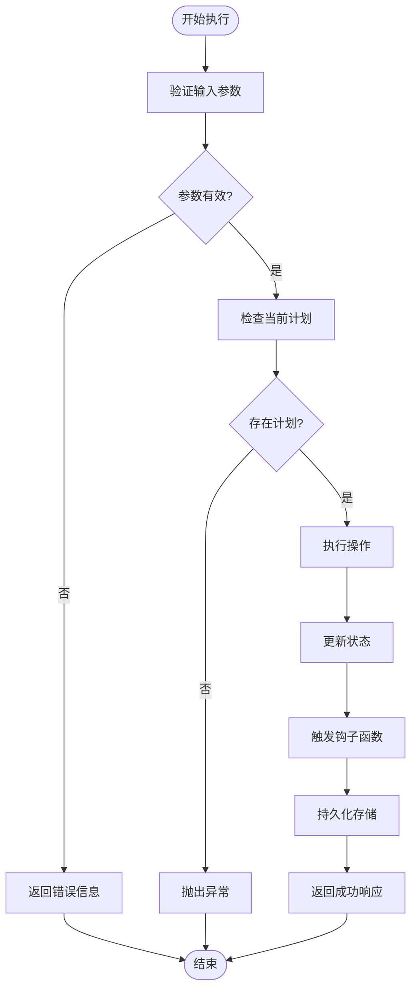
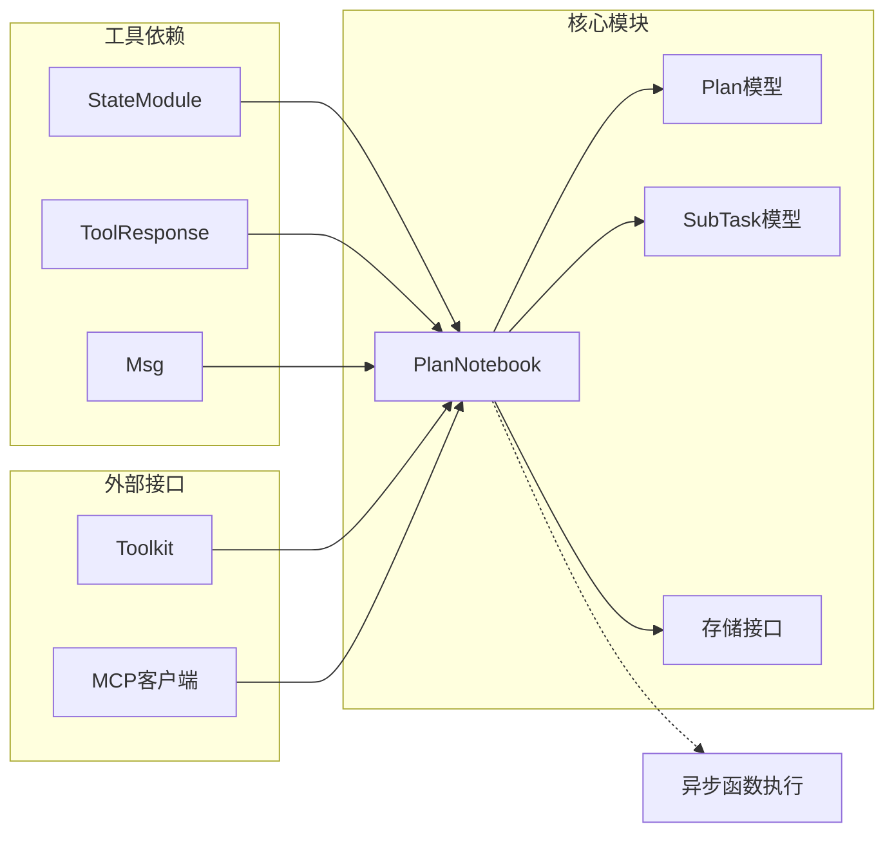

# 计划管理系统

<cite>
**本文档引用的文件**
- [src/agentscope/plan/__init__.py](file://src/agentscope/plan/__init__.py)
- [src/agentscope/plan/_plan_model.py](file://src/agentscope/plan/_plan_model.py)
- [src/agentscope/plan/_plan_notebook.py](file://src/agentscope/plan/_plan_notebook.py)
- [src/agentscope/plan/_storage_base.py](file://src/agentscope/plan/_storage_base.py)
- [src/agentscope/plan/_in_memory_storage.py](file://src/agentscope/plan/_in_memory_storage.py)
- [examples/functionality/plan/main_agent_managed_plan.py](file://examples/functionality/plan/main_agent_managed_plan.py)
- [examples/functionality/plan/main_manual_plan.py](file://examples/functionality/plan/main_manual_plan.py)
- [tests/plan_test.py](file://tests/plan_test.py)
- [docs/tutorial/zh_CN/src/task_plan.py](file://docs/tutorial/zh_CN/src/task_plan.py)
- [examples/deployment/planning_agent/main.py](file://examples/deployment/planning_agent/main.py)
- [examples/deployment/planning_agent/tool.py](file://examples/deployment/planning_agent/tool.py)
</cite>

## 目录
1. [简介](#简介)
2. [项目结构](#项目结构)
3. [核心组件](#核心组件)
4. [架构概览](#架构概览)
5. [详细组件分析](#详细组件分析)
6. [依赖关系分析](#依赖关系分析)
7. [性能考虑](#性能考虑)
8. [故障排除指南](#故障排除指南)
9. [结论](#结论)
10. [附录](#附录)

## 简介

AgentScope的计划管理系统是一个强大的任务规划和执行框架，旨在帮助智能体将复杂的多步骤任务分解为可管理的子任务，并提供完整的生命周期管理。该系统支持两种管理模式：智能体管理的计划和手动管理模式，为不同场景下的任务执行提供了灵活的解决方案。

计划管理系统的核心价值在于：
- **智能体自治**：允许智能体自动创建、管理和执行复杂的多步骤任务
- **人工干预**：提供完整的工具集供人工直接操作和控制计划执行
- **状态跟踪**：全面的状态管理和进度可视化
- **错误处理**：完善的错误处理和恢复机制
- **结果反馈**：结构化的结果收集和反馈系统

## 项目结构

计划管理系统位于`src/agentscope/plan/`目录下，采用模块化设计，包含以下核心文件：



**图表来源**
- [src/agentscope/plan/__init__.py:1-22](file://src/agentscope/plan/__init__.py#L1-L22)
- [src/agentscope/plan/_plan_model.py:1-201](file://src/agentscope/plan/_plan_model.py#L1-L201)
- [src/agentscope/plan/_plan_notebook.py:1-905](file://src/agentscope/plan/_plan_notebook.py#L1-L905)

**章节来源**
- [src/agentscope/plan/__init__.py:1-22](file://src/agentscope/plan/__init__.py#L1-L22)
- [src/agentscope/plan/_plan_model.py:1-201](file://src/agentscope/plan/_plan_model.py#L1-L201)
- [src/agentscope/plan/_plan_notebook.py:1-905](file://src/agentscope/plan/_plan_notebook.py#L1-L905)

## 核心组件

### 计划模型系统

计划系统的核心数据结构由两个主要模型组成：

#### SubTask（子任务模型）
- **状态管理**：支持"todo"、"in_progress"、"done"、"abandoned"四种状态
- **时间追踪**：自动记录创建时间和完成时间
- **输出管理**：区分预期结果和实际结果
- **Markdown支持**：提供简洁和详细两种Markdown格式化选项

#### Plan（计划模型）
- **层次结构**：包含多个子任务的有序列表
- **状态同步**：根据子任务状态自动更新整体状态
- **生命周期管理**：完整的创建、执行、完成/放弃流程
- **结果聚合**：收集和汇总所有子任务的结果

### 计划笔记本（PlanNotebook）

PlanNotebook是整个计划系统的核心控制器，提供以下功能：

- **计划管理**：创建、修改、删除、恢复计划
- **子任务控制**：状态更新、结果标记、顺序执行
- **提示生成**：基于当前状态生成智能体指导消息
- **历史记录**：存储和检索已完成的计划
- **钩子系统**：支持外部系统集成和状态监听

**章节来源**
- [src/agentscope/plan/_plan_model.py:11-201](file://src/agentscope/plan/_plan_model.py#L11-L201)
- [src/agentscope/plan/_plan_notebook.py:172-905](file://src/agentscope/plan/_plan_notebook.py#L172-L905)

## 架构概览

计划管理系统采用分层架构设计，确保了良好的模块分离和扩展性：



**图表来源**
- [src/agentscope/plan/_plan_notebook.py:172-905](file://src/agentscope/plan/_plan_notebook.py#L172-L905)
- [src/agentscope/plan/_plan_model.py:104-201](file://src/agentscope/plan/_plan_model.py#L104-L201)
- [src/agentscope/plan/_in_memory_storage.py:9-71](file://src/agentscope/plan/_in_memory_storage.py#L9-L71)

### 管理模式对比

系统支持两种不同的管理模式：

#### 智能体管理的计划模式
- **自动化程度高**：智能体自动创建和管理计划
- **适合复杂任务**：适用于需要深度思考和规划的复杂任务
- **学习能力**：智能体可以从历史经验中学习优化

#### 手动管理模式
- **人工控制**：开发者直接定义和控制计划
- **精确度高**：适合需要严格控制执行流程的任务
- **透明度好**：所有步骤都完全可见和可控

**章节来源**
- [examples/functionality/plan/main_agent_managed_plan.py:21-66](file://examples/functionality/plan/main_agent_managed_plan.py#L21-L66)
- [examples/functionality/plan/main_manual_plan.py:23-102](file://examples/functionality/plan/main_manual_plan.py#L23-L102)

## 详细组件分析

### 计划模型类图



**图表来源**
- [src/agentscope/plan/_plan_model.py:11-201](file://src/agentscope/plan/_plan_model.py#L11-L201)
- [src/agentscope/plan/_plan_notebook.py:172-905](file://src/agentscope/plan/_plan_notebook.py#L172-L905)
- [src/agentscope/plan/_storage_base.py:9-27](file://src/agentscope/plan/_storage_base.py#L9-L27)
- [src/agentscope/plan/_in_memory_storage.py:9-71](file://src/agentscope/plan/_in_memory_storage.py#L9-L71)

### 计划执行流程



**图表来源**
- [src/agentscope/plan/_plan_notebook.py:232-737](file://src/agentscope/plan/_plan_notebook.py#L232-L737)
- [src/agentscope/plan/_in_memory_storage.py:26-71](file://src/agentscope/plan/_in_memory_storage.py#L26-L71)

### 错误处理流程



**图表来源**
- [src/agentscope/plan/_plan_notebook.py:295-431](file://src/agentscope/plan/_plan_notebook.py#L295-L431)
- [src/agentscope/plan/_plan_notebook.py:433-651](file://src/agentscope/plan/_plan_notebook.py#L433-L651)

**章节来源**
- [src/agentscope/plan/_plan_model.py:11-201](file://src/agentscope/plan/_plan_model.py#L11-L201)
- [src/agentscope/plan/_plan_notebook.py:172-905](file://src/agentscope/plan/_plan_notebook.py#L172-L905)

## 依赖关系分析

### 组件耦合度分析

计划系统的设计遵循了低耦合、高内聚的原则：



**图表来源**
- [src/agentscope/plan/_plan_notebook.py:172-905](file://src/agentscope/plan/_plan_notebook.py#L172-L905)
- [src/agentscope/plan/_storage_base.py:9-27](file://src/agentscope/plan/_storage_base.py#L9-L27)

### 外部依赖关系

系统对外部依赖保持最小化，主要依赖包括：
- **Pydantic**：数据验证和序列化
- **ShortUUID**：唯一标识符生成
- **异步运行时**：事件驱动的执行模型
- **消息传递**：统一的消息格式和传输

**章节来源**
- [src/agentscope/plan/_plan_model.py:3-8](file://src/agentscope/plan/_plan_model.py#L3-L8)
- [src/agentscope/plan/_plan_notebook.py:4-14](file://src/agentscope/plan/_plan_notebook.py#L4-L14)

## 性能考虑

### 内存管理
- **有序字典存储**：使用`OrderedDict`确保计划的有序性和访问效率
- **状态序列化**：支持完整的状态序列化和反序列化
- **异步操作**：所有存储操作都是异步的，避免阻塞主线程

### 扩展性设计
- **接口抽象**：通过`PlanStorageBase`接口支持多种存储后端
- **钩子系统**：提供灵活的扩展点供外部系统集成
- **配置化**：支持通过参数调整行为和限制

### 最佳实践建议
- **合理设置子任务数量**：避免单个计划包含过多子任务
- **及时清理历史数据**：定期清理已完成的计划以节省空间
- **使用钩子进行监控**：通过钩子系统实现实时状态监控

## 故障排除指南

### 常见问题及解决方案

#### 计划状态不一致
**问题描述**：子任务状态与整体计划状态不匹配
**解决方法**：调用`refresh_plan_state()`方法自动同步状态

#### 子任务执行顺序错误
**问题描述**：尝试跳过已完成的子任务直接执行后续任务
**解决方法**：系统会自动检查前置任务状态，必须先完成前置任务

#### 存储异常
**问题描述**：存储操作失败或数据丢失
**解决方法**：检查存储后端连接状态，确保有足够磁盘空间

### 调试技巧

#### 启用详细日志
```python
# 在开发环境中启用详细日志
import logging
logging.basicConfig(level=logging.DEBUG)
```

#### 使用状态检查
```python
# 检查当前计划的完整状态
print(plan_notebook.current_plan.model_dump())
```

**章节来源**
- [tests/plan_test.py:665-785](file://tests/plan_test.py#L665-L785)
- [src/agentscope/plan/_plan_notebook.py:148-167](file://src/agentscope/plan/_plan_notebook.py#L148-L167)

## 结论

AgentScope的计划管理系统提供了一个完整、灵活且可扩展的任务规划和执行框架。通过智能体管理的计划模式和手动管理模式的结合，系统能够适应从简单到复杂的各种应用场景。

### 主要优势
- **双模式支持**：既支持智能体自治，也支持人工精确控制
- **状态完整性**：完整的状态跟踪和历史记录
- **扩展性强**：模块化设计便于功能扩展和定制
- **错误处理完善**：健壮的错误处理和恢复机制

### 应用场景
- **复杂任务分解**：将大型项目分解为可管理的小任务
- **工作流编排**：协调多个智能体或工具的执行
- **实验管理**：跟踪和管理实验过程和结果
- **项目管理**：支持项目生命周期的各个阶段

## 附录

### 快速开始示例

#### 智能体管理的计划
```python
# 创建智能体并启用计划功能
agent = ReActAgent(
    name="Friday",
    plan_notebook=PlanNotebook(),
    # 其他配置...
)
```

#### 手动创建计划
```python
# 手动创建复杂的多步骤计划
await plan_notebook.create_plan(
    name="数据分析项目",
    description="对销售数据进行全面分析",
    expected_outcome="生成详细的分析报告",
    subtasks=[
        SubTask(name="数据收集", description="收集销售数据"),
        SubTask(name="数据清洗", description="清洗和预处理数据"),
        SubTask(name="数据分析", description="执行统计分析"),
        SubTask(name="报告生成", description="生成分析报告")
    ]
)
```

### 高级功能

#### 自定义提示生成器
```python
def custom_plan_to_hint(plan):
    # 实现自定义的提示逻辑
    return "自定义提示消息"

plan_notebook = PlanNotebook(plan_to_hint=custom_plan_to_hint)
```

#### 历史计划恢复
```python
# 查看历史计划
historical = await plan_notebook.view_historical_plans()

# 恢复特定计划
await plan_notebook.recover_historical_plan(target_plan_id)
```

### 集成示例

#### Web服务集成
```python
# 在Web应用中集成计划系统
@app.route('/plan')
async def handle_plan_request():
    # 处理计划相关的HTTP请求
    pass
```

**章节来源**
- [examples/functionality/plan/main_agent_managed_plan.py:30-49](file://examples/functionality/plan/main_agent_managed_plan.py#L30-L49)
- [examples/functionality/plan/main_manual_plan.py:75-86](file://examples/functionality/plan/main_manual_plan.py#L75-L86)
- [examples/deployment/planning_agent/main.py:49-68](file://examples/deployment/planning_agent/main.py#L49-L68)