# 记忆系统实现

<cite>
**本文档引用的文件**
- [src/agentscope/memory/__init__.py](file://src/agentscope/memory/__init__.py)
- [src/agentscope/memory/_long_term_memory/__init__.py](file://src/agentscope/memory/_long_term_memory/__init__.py)
- [src/agentscope/memory/_long_term_memory/_long_term_memory_base.py](file://src/agentscope/memory/_long_term_memory/_long_term_memory_base.py)
- [src/agentscope/memory/_long_term_memory/_mem0/_mem0_long_term_memory.py](file://src/agentscope/memory/_long_term_memory/_mem0/_mem0_long_term_memory.py)
- [src/agentscope/memory/_long_term_memory/_reme/_reme_personal_long_term_memory.py](file://src/agentscope/memory/_long_term_memory/_reme/_reme_personal_long_term_memory.py)
- [src/agentscope/memory/_long_term_memory/_reme/_reme_task_long_term_memory.py](file://src/agentscope/memory/_long_term_memory/_reme/_reme_task_long_term_memory.py)
- [src/agentscope/memory/_long_term_memory/_reme/_reme_tool_long_term_memory.py](file://src/agentscope/memory/_long_term_memory/_reme/_reme_tool_long_term_memory.py)
- [src/agentscope/memory/_working_memory/__init__.py](file://src/agentscope/memory/_working_memory/__init__.py)
- [src/agentscope/memory/_working_memory/_base.py](file://src/agentscope/memory/_working_memory/_base.py)
- [src/agentscope/memory/_working_memory/_in_memory_memory.py](file://src/agentscope/memory/_working_memory/_in_memory_memory.py)
- [examples/functionality/long_term_memory/mem0/README.md](file://examples/functionality/long_term_memory/mem0/README.md)
- [examples/functionality/long_term_memory/mem0/memory_example.py](file://examples/functionality/long_term_memory/mem0/memory_example.py)
- [examples/functionality/long_term_memory/reme/README.md](file://examples/functionality/long_term_memory/reme/README.md)
- [examples/functionality/long_term_memory/reme/personal_memory_example.py](file://examples/functionality/long_term_memory/reme/personal_memory_example.py)
- [examples/functionality/long_term_memory/reme/task_memory_example.py](file://examples/functionality/long_term_memory/reme/task_memory_example.py)
- [examples/functionality/long_term_memory/reme/tool_memory_example.py](file://examples/functionality/long_term_memory/reme/tool_memory_example.py)
</cite>

## 目录
1. [简介](#简介)
2. [项目结构](#项目结构)
3. [核心组件](#核心组件)
4. [架构概览](#架构概览)
5. [详细组件分析](#详细组件分析)
6. [依赖关系分析](#依赖关系分析)
7. [性能考虑](#性能考虑)
8. [故障排除指南](#故障排除指南)
9. [结论](#结论)
10. [附录](#附录)

## 简介

AgentScope的记忆系统是一个强大的多层记忆架构，支持长期记忆和短期记忆的无缝集成。该系统提供了两种主要的长期记忆实现方案：Mem0长期记忆系统和ReMe增强记忆系统，以及多种短期记忆存储实现。

**核心特性：**
- **双模式长期记忆**：Mem0（向量数据库）和ReMe（反射记忆）两种不同的长期记忆实现
- **专用记忆类型**：个人记忆、任务记忆、工具记忆三种专业化的记忆类型
- **异步操作支持**：完整的异步/等待支持，确保非阻塞的记忆操作
- **向量化检索**：基于嵌入模型的语义相似性检索
- **持久化存储**：支持磁盘持久化和内存存储
- **智能代理集成**：与ReActAgent无缝集成，支持自动记忆管理

## 项目结构

AgentScope的记忆系统采用模块化设计，按照功能层次组织：

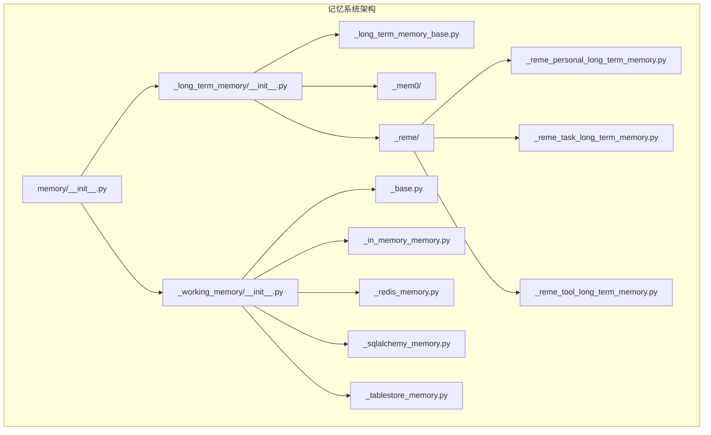

**图表来源**
- [src/agentscope/memory/__init__.py:1-34](file://src/agentscope/memory/__init__.py#L1-L34)
- [src/agentscope/memory/_long_term_memory/__init__.py:1-19](file://src/agentscope/memory/_long_term_memory/__init__.py#L1-L19)
- [src/agentscope/memory/_working_memory/__init__.py:1-19](file://src/agentscope/memory/_working_memory/__init__.py#L1-L19)

**章节来源**
- [src/agentscope/memory/__init__.py:1-34](file://src/agentscope/memory/__init__.py#L1-L34)
- [src/agentscope/memory/_long_term_memory/__init__.py:1-19](file://src/agentscope/memory/_long_term_memory/__init__.py#L1-L19)
- [src/agentscope/memory/_working_memory/__init__.py:1-19](file://src/agentscope/memory/_working_memory/__init__.py#L1-L19)

## 核心组件

### 长期记忆基础架构

长期记忆系统基于抽象基类设计，提供统一的接口规范：

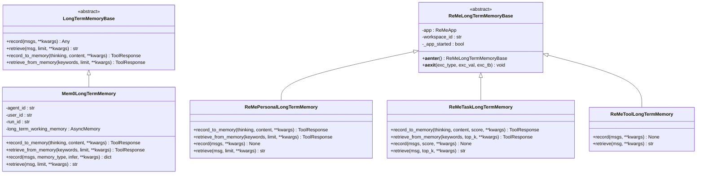

**图表来源**
- [src/agentscope/memory/_long_term_memory/_long_term_memory_base.py:11-95](file://src/agentscope/memory/_long_term_memory/_long_term_memory_base.py#L11-L95)
- [src/agentscope/memory/_long_term_memory/_mem0/_mem0_long_term_memory.py:72-747](file://src/agentscope/memory/_long_term_memory/_mem0/_mem0_long_term_memory.py#L72-L747)
- [src/agentscope/memory/_long_term_memory/_reme/_reme_personal_long_term_memory.py:17-415](file://src/agentscope/memory/_long_term_memory/_reme/_reme_personal_long_term_memory.py#L17-L415)
- [src/agentscope/memory/_long_term_memory/_reme/_reme_task_long_term_memory.py:17-437](file://src/agentscope/memory/_long_term_memory/_reme/_reme_task_long_term_memory.py#L17-L437)
- [src/agentscope/memory/_long_term_memory/_reme/_reme_tool_long_term_memory.py:17-546](file://src/agentscope/memory/_long_term_memory/_reme/_reme_tool_long_term_memory.py#L17-L546)

### 短期记忆组件

短期记忆系统提供多种存储后端，支持不同的使用场景：

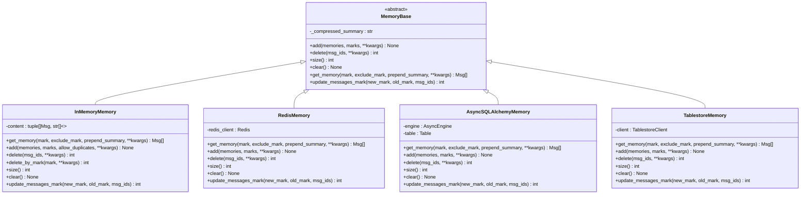

**图表来源**
- [src/agentscope/memory/_working_memory/_base.py:11-169](file://src/agentscope/memory/_working_memory/_base.py#L11-L169)
- [src/agentscope/memory/_working_memory/_in_memory_memory.py:10-306](file://src/agentscope/memory/_working_memory/_in_memory_memory.py#L10-L306)

**章节来源**
- [src/agentscope/memory/_long_term_memory/_long_term_memory_base.py:11-95](file://src/agentscope/memory/_long_term_memory/_long_term_memory_base.py#L11-L95)
- [src/agentscope/memory/_working_memory/_base.py:11-169](file://src/agentscope/memory/_working_memory/_base.py#L11-L169)

## 架构概览

AgentScope的记忆系统采用分层架构设计，实现了长期记忆和短期记忆的有机集成：

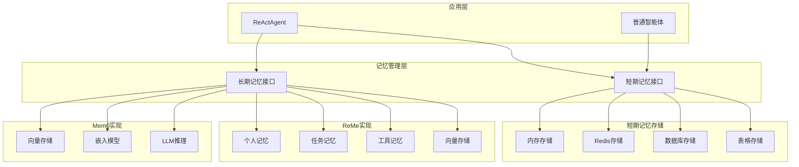

**图表来源**
- [src/agentscope/memory/_long_term_memory/_mem0/_mem0_long_term_memory.py:72-747](file://src/agentscope/memory/_long_term_memory/_mem0/_mem0_long_term_memory.py#L72-L747)
- [src/agentscope/memory/_long_term_memory/_reme/_reme_personal_long_term_memory.py:17-415](file://src/agentscope/memory/_long_term_memory/_reme/_reme_personal_long_term_memory.py#L17-L415)
- [src/agentscope/memory/_working_memory/_in_memory_memory.py:10-306](file://src/agentscope/memory/_working_memory/_in_memory_memory.py#L10-L306)

## 详细组件分析

### Mem0长期记忆系统

Mem0是基于向量数据库的长期记忆实现，提供语义相似性检索能力：

#### 核心功能特性

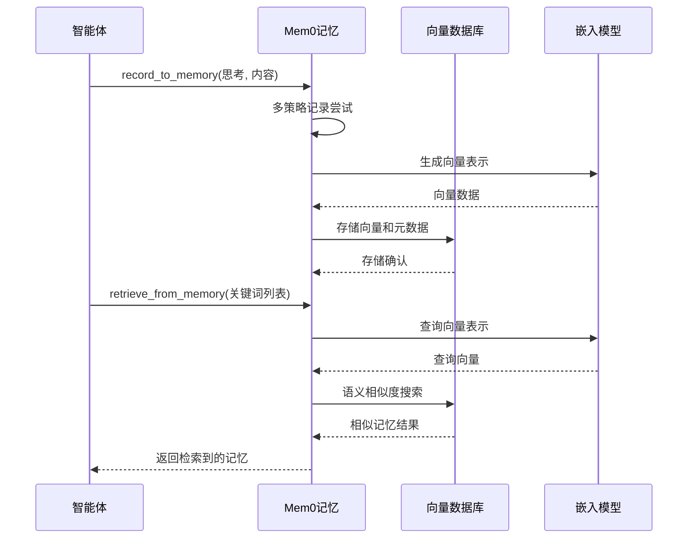

**图表来源**
- [src/agentscope/memory/_long_term_memory/_mem0/_mem0_long_term_memory.py:380-571](file://src/agentscope/memory/_long_term_memory/_mem0/_mem0_long_term_memory.py#L380-L571)

#### 配置参数详解

Mem0长期记忆系统支持灵活的配置选项：

| 参数名称 | 类型 | 默认值 | 描述 |
|---------|------|--------|------|
| agent_name | str | None | 智能体名称，用于记忆标识 |
| user_name | str | None | 用户标识符，用于记忆隔离 |
| run_name | str | None | 会话标识符，用于上下文管理 |
| model | ChatModelBase | None | 用于记忆推理的聊天模型 |
| embedding_model | EmbeddingModelBase | None | 用于向量嵌入的嵌入模型 |
| vector_store_config | VectorStoreConfig | None | 向量存储配置 |
| mem0_config | MemoryConfig | None | 完整的mem0配置对象 |
| default_memory_type | str | None | 默认记忆类型 |
| suppress_mem0_logging | bool | True | 是否抑制mem0日志输出 |

**章节来源**
- [src/agentscope/memory/_long_term_memory/_mem0/_mem0_long_term_memory.py:263-379](file://src/agentscope/memory/_long_term_memory/_mem0/_mem0_long_term_memory.py#L263-L379)

### ReMe增强记忆系统

ReMe提供三种专门的记忆类型，每种都有独特的应用场景：

#### 个人记忆系统

个人记忆专注于用户个人信息的长期存储：

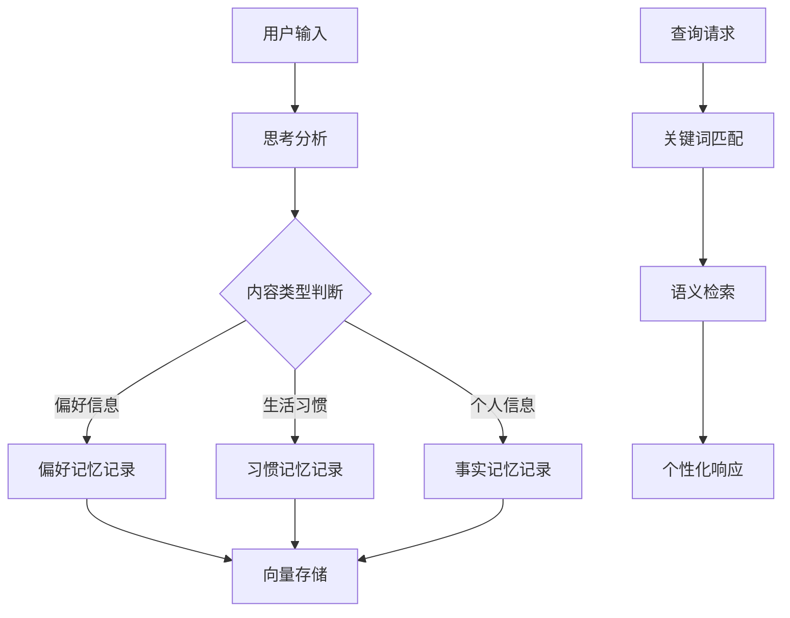

**图表来源**
- [src/agentscope/memory/_long_term_memory/_reme/_reme_personal_long_term_memory.py:20-154](file://src/agentscope/memory/_long_term_memory/_reme/_reme_personal_long_term_memory.py#L20-L154)

#### 任务记忆系统

任务记忆学习从执行轨迹中提取经验：

| 记忆类型 | 使用场景 | 关键特征 |
|---------|----------|----------|
| 项目规划 | 软件开发项目管理 | 需求分析、设计阶段、开发流程 |
| 调试经验 | 程序错误排查 | 错误识别、解决方案、预防措施 |
| 技术实践 | 开发技巧总结 | 最佳实践、性能优化、架构设计 |
| 学习过程 | 知识获取和应用 | 学习方法、理解深度、应用效果 |

#### 工具记忆系统

工具记忆记录工具使用历史并生成使用指南：

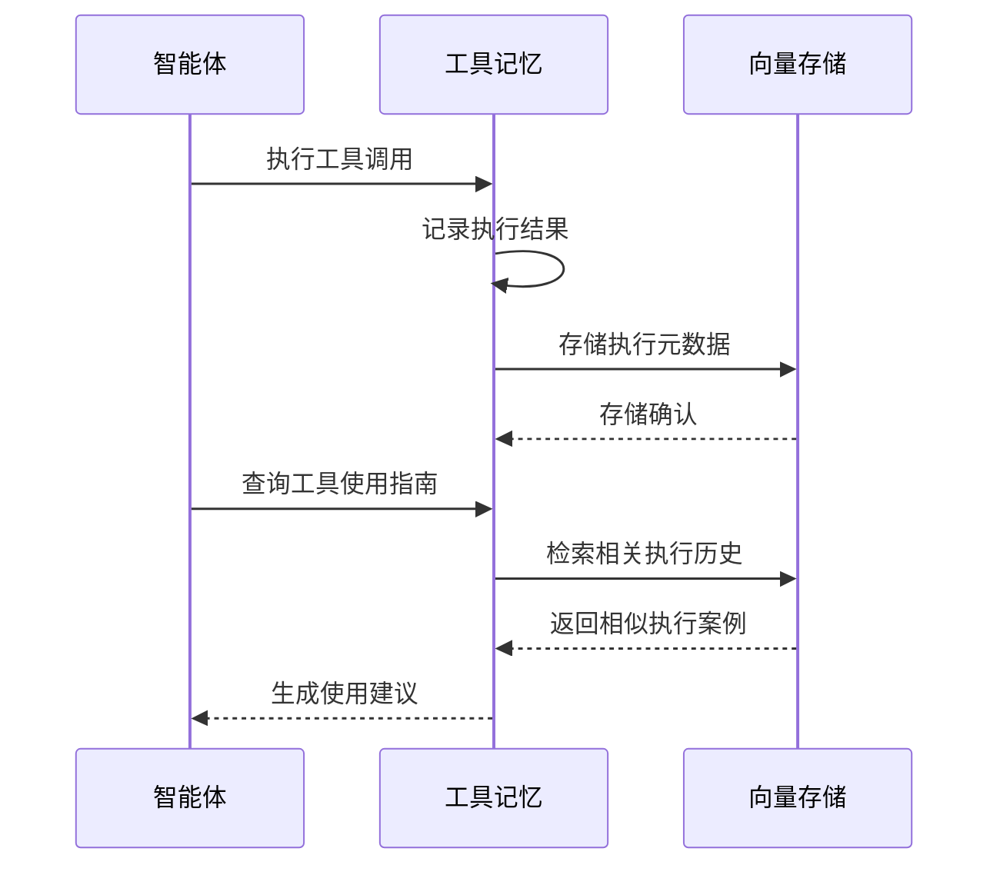

**图表来源**
- [src/agentscope/memory/_long_term_memory/_reme/_reme_tool_long_term_memory.py:25-173](file://src/agentscope/memory/_long_term_memory/_reme/_reme_tool_long_term_memory.py#L25-L173)

**章节来源**
- [src/agentscope/memory/_long_term_memory/_reme/_reme_personal_long_term_memory.py:17-415](file://src/agentscope/memory/_long_term_memory/_reme/_reme_personal_long_term_memory.py#L17-L415)
- [src/agentscope/memory/_long_term_memory/_reme/_reme_task_long_term_memory.py:17-437](file://src/agentscope/memory/_long_term_memory/_reme/_reme_task_long_term_memory.py#L17-L437)
- [src/agentscope/memory/_long_term_memory/_reme/_reme_tool_long_term_memory.py:17-546](file://src/agentscope/memory/_long_term_memory/_reme/_reme_tool_long_term_memory.py#L17-L546)

### 短期记忆系统

短期记忆系统提供多种存储后端，满足不同场景需求：

#### 内存存储实现

InMemoryMemory是最简单的短期记忆实现：

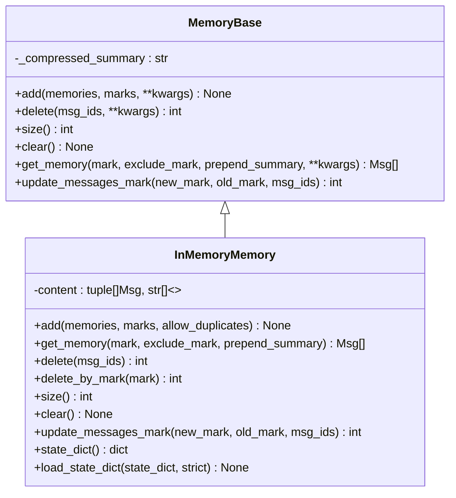

**图表来源**
- [src/agentscope/memory/_working_memory/_in_memory_memory.py:10-306](file://src/agentscope/memory/_working_memory/_in_memory_memory.py#L10-L306)

**章节来源**
- [src/agentscope/memory/_working_memory/_in_memory_memory.py:10-306](file://src/agentscope/memory/_working_memory/_in_memory_memory.py#L10-L306)

## 依赖关系分析

### 组件耦合度分析

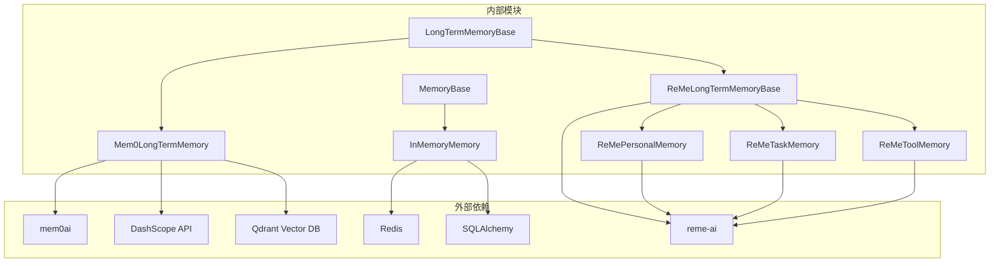

**图表来源**
- [src/agentscope/memory/_long_term_memory/_mem0/_mem0_long_term_memory.py:92-132](file://src/agentscope/memory/_long_term_memory/_mem0/_mem0_long_term_memory.py#L92-L132)
- [src/agentscope/memory/_long_term_memory/_reme/_reme_personal_long_term_memory.py:11-14](file://src/agentscope/memory/_long_term_memory/_reme/_reme_personal_long_term_memory.py#L11-L14)

### 数据流图

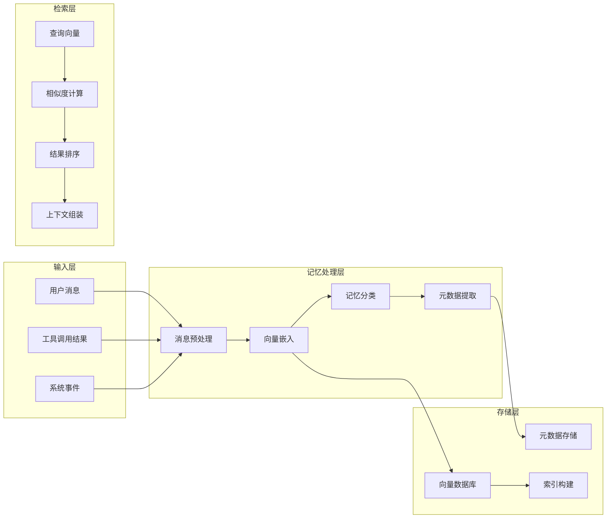

**图表来源**
- [src/agentscope/memory/_long_term_memory/_mem0/_mem0_long_term_memory.py:642-681](file://src/agentscope/memory/_long_term_memory/_mem0/_mem0_long_term_memory.py#L642-L681)

**章节来源**
- [src/agentscope/memory/_long_term_memory/_mem0/_mem0_long_term_memory.py:92-132](file://src/agentscope/memory/_long_term_memory/_mem0/_mem0_long_term_memory.py#L92-L132)

## 性能考虑

### 内存优化策略

1. **向量维度优化**
   - 嵌入模型维度选择需要与向量存储兼容
   - 不同维度需要重新初始化存储空间

2. **批量操作优化**
   - 支持批量记忆记录和检索
   - 异步并发处理提高吞吐量

3. **缓存机制**
   - 内存存储支持压缩摘要
   - 向量存储建立适当的索引

### 存储优化

1. **持久化策略**
   - 支持磁盘持久化避免数据丢失
   - 可配置的存储路径和清理策略

2. **索引优化**
   - 向量相似度搜索的索引配置
   - 查询性能监控和调优

### 并发处理

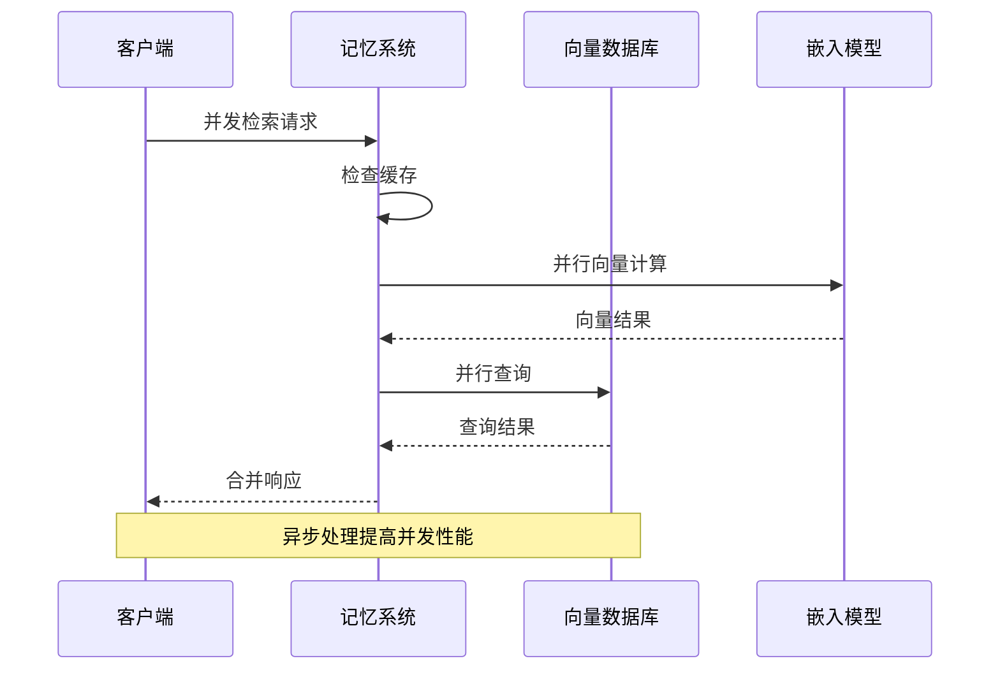

## 故障排除指南

### 常见问题及解决方案

#### Mem0相关问题

| 问题类型 | 症状 | 解决方案 |
|---------|------|----------|
| 依赖缺失 | ImportError: mem0库未安装 | 安装mem0ai库 |
| 配置错误 | ValueError: 缺少必需参数 | 检查模型和嵌入配置 |
| 日志干扰 | QDRANT验证错误警告 | 设置suppress_mem0_logging=True |
| 维度不匹配 | 向量维度错误 | 更换存储路径或删除旧数据库 |

#### ReMe相关问题

| 问题类型 | 症状 | 解决方案 |
|---------|------|----------|
| 上下文未初始化 | RuntimeError: Memory not initialized | 使用async with上下文管理器 |
| 记忆未检索到 | 返回空结果 | 检查user_name是否匹配 |
| 工具记忆无指南 | 指南为空 | 记录多个工具执行以触发总结 |

#### 短期记忆问题

| 问题类型 | 症状 | 解决方案 |
|---------|------|----------|
| 存储后端连接失败 | 连接超时或认证错误 | 检查数据库连接配置 |
| 内存泄漏 | 内存使用持续增长 | 定期清理过期消息 |
| 并发冲突 | 数据竞争或锁等待 | 使用适当的同步机制 |

**章节来源**
- [examples/functionality/long_term_memory/mem0/README.md:589-604](file://examples/functionality/long_term_memory/mem0/README.md#L589-L604)
- [examples/functionality/long_term_memory/reme/README.md:589-604](file://examples/functionality/long_term_memory/reme/README.md#L589-L604)

## 结论

AgentScope的记忆系统通过精心设计的架构实现了长期记忆和短期记忆的有效集成。系统的主要优势包括：

1. **模块化设计**：清晰的抽象层次和接口定义
2. **多实现支持**：Mem0和ReMe两种长期记忆实现满足不同需求
3. **异步架构**：完整的异步支持确保高性能
4. **向量化检索**：基于嵌入模型的语义相似性检索
5. **智能代理集成**：与ReActAgent无缝集成

未来改进方向：
- 增加更多向量存储后端支持
- 优化大规模数据的检索性能
- 提供更丰富的记忆压缩算法
- 增强隐私保护和数据安全机制

## 附录

### 快速开始示例

#### Mem0基本使用

```python
# 初始化Mem0长期记忆
long_term_memory = Mem0LongTermMemory(
    agent_name="Friday",
    user_name="user_123",
    model=DashScopeChatModel(model_name="qwen-max-latest"),
    embedding_model=DashScopeTextEmbedding(model_name="text-embedding-v3")
)

# 记录用户偏好
await long_term_memory.record_to_memory(
    thinking="用户分享旅行偏好",
    content=["我喜欢杭州的民宿", "我偏爱西湖的早晨"]
)

# 检索相关记忆
result = await long_term_memory.retrieve_from_memory(
    keywords=["旅行", "杭州"],
    limit=3
)
```

#### ReMe个人记忆使用

```python
# 初始化个人记忆
personal_memory = ReMePersonalLongTermMemory(
    agent_name="Friday",
    user_name="user_123",
    model=DashScopeChatModel(model_name="qwen3-max"),
    embedding_model=DashScopeTextEmbedding(model_name="text-embedding-v4")
)

# 使用异步上下文管理器
async with personal_memory:
    # 记录用户信息
    await personal_memory.record_to_memory(
        thinking="记录用户工作偏好",
        content=["用户是软件工程师", "喜欢远程工作"]
    )
    
    # 检索记忆
    memories = await personal_memory.retrieve_from_memory(
        keywords=["工作", "偏好"],
        limit=3
    )
```

### 配置最佳实践

1. **模型选择**
   - 嵌入模型维度需与向量存储配置一致
   - LLM模型用于记忆推理和总结

2. **存储配置**
   - Mem0推荐使用Qdrant作为向量存储
   - ReMe使用本地文件系统存储向量数据

3. **性能调优**
   - 合理设置检索limit参数
   - 使用异步操作提高并发性能
   - 定期清理过期记忆数据