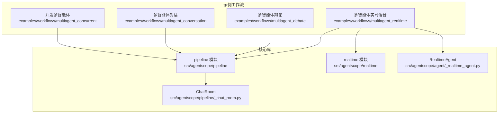
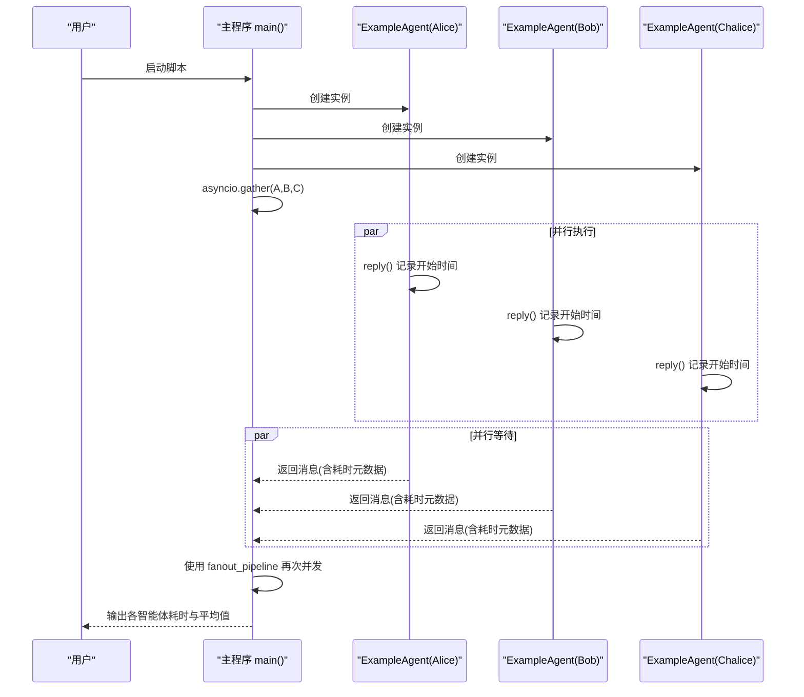
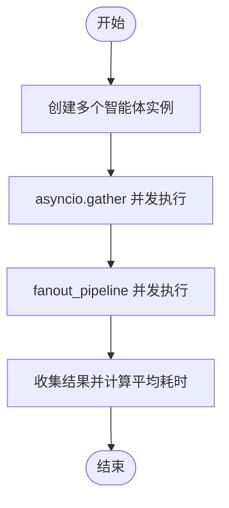
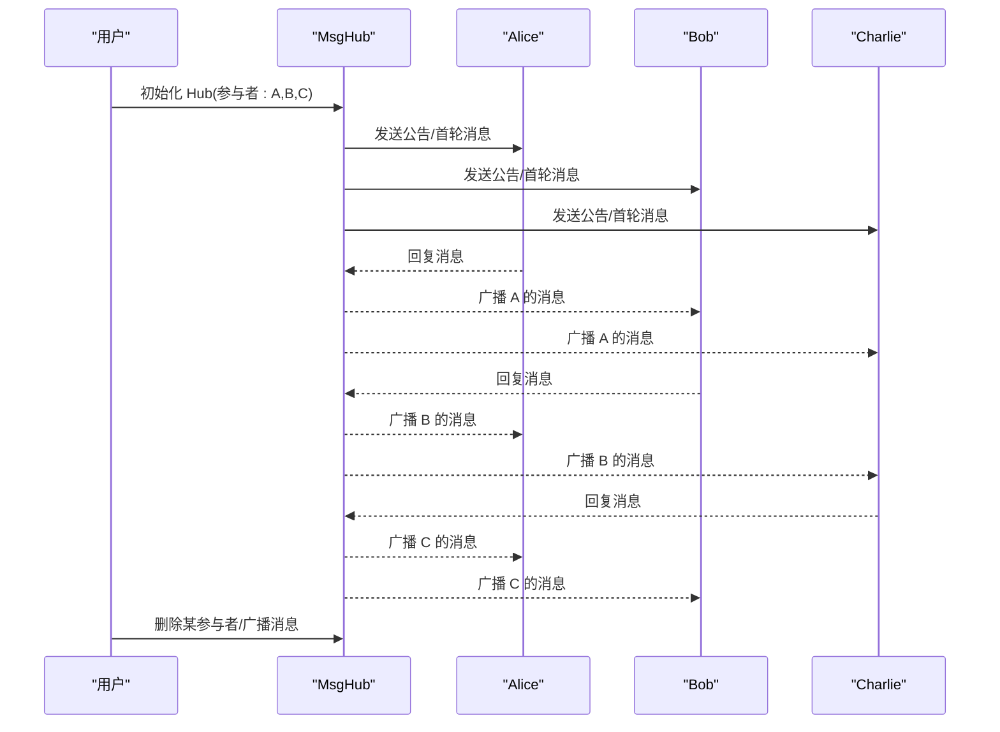
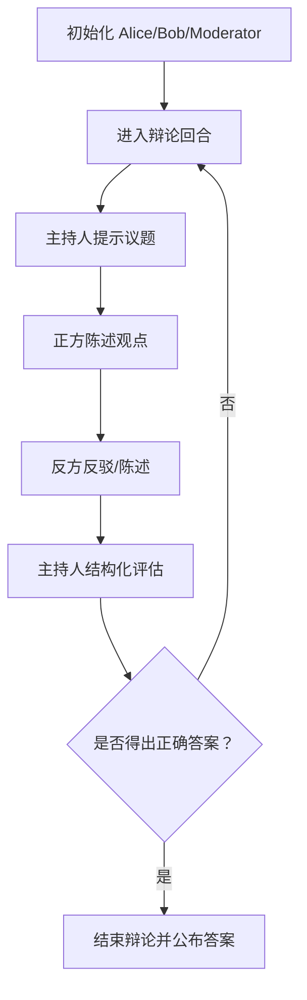
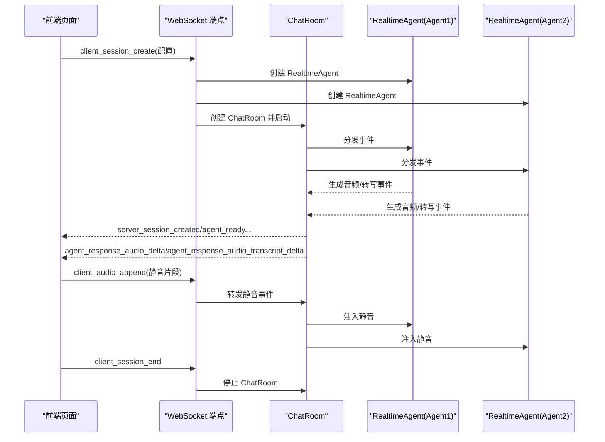
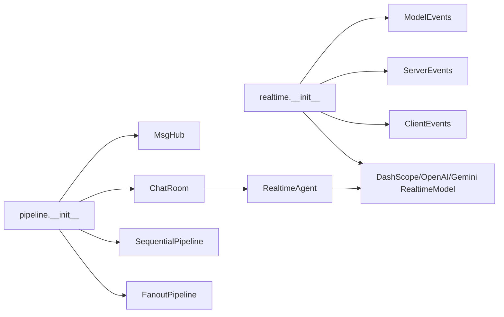

# 工作流示例

<cite>
**本文引用的文件**
- [examples/workflows/multiagent_concurrent/main.py](file://examples/workflows/multiagent_concurrent/main.py)
- [examples/workflows/multiagent_concurrent/README.md](file://examples/workflows/multiagent_concurrent/README.md)
- [examples/workflows/multiagent_conversation/main.py](file://examples/workflows/multiagent_conversation/main.py)
- [examples/workflows/multiagent_conversation/README.md](file://examples/workflows/multiagent_conversation/README.md)
- [examples/workflows/multiagent_debate/main.py](file://examples/workflows/multiagent_debate/main.py)
- [examples/workflows/multiagent_debate/README.md](file://examples/workflows/multiagent_debate/README.md)
- [examples/workflows/multiagent_realtime/run_server.py](file://examples/workflows/multiagent_realtime/run_server.py)
- [examples/workflows/multiagent_realtime/multi_agent.html](file://examples/workflows/multiagent_realtime/multi_agent.html)
- [examples/workflows/multiagent_realtime/README.md](file://examples/workflows/multiagent_realtime/README.md)
- [src/agentscope/pipeline/__init__.py](file://src/agentscope/pipeline/__init__.py)
- [src/agentscope/pipeline/_chat_room.py](file://src/agentscope/pipeline/_chat_room.py)
- [src/agentscope/agent/_realtime_agent.py](file://src/agentscope/agent/_realtime_agent.py)
- [src/agentscope/realtime/__init__.py](file://src/agentscope/realtime/__init__.py)
</cite>

## 目录
1. [引言](#引言)
2. [项目结构](#项目结构)
3. [核心组件](#核心组件)
4. [架构总览](#架构总览)
5. [详细组件分析](#详细组件分析)
6. [依赖分析](#依赖分析)
7. [性能考虑](#性能考虑)
8. [故障排查指南](#故障排查指南)
9. [结论](#结论)
10. [附录](#附录)

## 引言
本教程围绕 AgentScope 的多智能体工作流示例，系统讲解并发多智能体、多智能体对话、多智能体辩论与多智能体实时语音交互四种典型场景。文档从架构设计、代码实现、运行配置到性能优化给出完整说明，帮助读者快速上手并扩展到更复杂的协作场景。

## 项目结构
本教程涉及的示例位于 examples/workflows 下，分别对应四种工作流；核心运行时能力由 src/agentscope 下的 pipeline、agent、realtime 等模块提供。

**图表来源**
- [examples/workflows/multiagent_concurrent/main.py:1-94](file://examples/workflows/multiagent_concurrent/main.py#L1-L94)
- [examples/workflows/multiagent_conversation/main.py:1-81](file://examples/workflows/multiagent_conversation/main.py#L1-L81)
- [examples/workflows/multiagent_debate/main.py:1-131](file://examples/workflows/multiagent_debate/main.py#L1-L131)
- [examples/workflows/multiagent_realtime/run_server.py:1-221](file://examples/workflows/multiagent_realtime/run_server.py#L1-L221)
- [src/agentscope/pipeline/__init__.py:1-23](file://src/agentscope/pipeline/__init__.py#L1-L23)
- [src/agentscope/pipeline/_chat_room.py:1-98](file://src/agentscope/pipeline/_chat_room.py#L1-L98)
- [src/agentscope/agent/_realtime_agent.py:1-361](file://src/agentscope/agent/_realtime_agent.py#L1-L361)
- [src/agentscope/realtime/__init__.py:1-29](file://src/agentscope/realtime/__init__.py#L1-L29)

**章节来源**
- [examples/workflows/multiagent_concurrent/README.md:1-30](file://examples/workflows/multiagent_concurrent/README.md#L1-L30)
- [examples/workflows/multiagent_conversation/README.md:1-24](file://examples/workflows/multiagent_conversation/README.md#L1-L24)
- [examples/workflows/multiagent_debate/README.md:1-24](file://examples/workflows/multiagent_debate/README.md#L1-L24)
- [examples/workflows/multiagent_realtime/README.md:1-161](file://examples/workflows/multiagent_realtime/README.md#L1-L161)

## 核心组件
- 并发执行：使用 asyncio.gather 或 fanout_pipeline 实现多智能体并行。
- 对话编排：通过 MsgHub 维护参与者集合，支持动态增删与广播。
- 辩论聚合：通过 Moderater 聚合多方观点并做结构化判断。
- 实时语音：通过 ChatRoom 管理 RealtimeAgent，借助 WebSocket 与前端交互，实现实时音频与转写。

**章节来源**
- [examples/workflows/multiagent_concurrent/main.py:67-94](file://examples/workflows/multiagent_concurrent/main.py#L67-L94)
- [examples/workflows/multiagent_conversation/main.py:38-81](file://examples/workflows/multiagent_conversation/main.py#L38-L81)
- [examples/workflows/multiagent_debate/main.py:85-131](file://examples/workflows/multiagent_debate/main.py#L85-L131)
- [examples/workflows/multiagent_realtime/run_server.py:62-211](file://examples/workflows/multiagent_realtime/run_server.py#L62-L211)

## 架构总览
下面以“并发多智能体”为例，展示两种并发模式的调用流程。

**图表来源**
- [examples/workflows/multiagent_concurrent/main.py:67-94](file://examples/workflows/multiagent_concurrent/main.py#L67-L94)

## 详细组件分析

### 并发多智能体工作流
- 设计要点
  - 示例智能体记录开始/结束时间并返回带元数据的消息，便于统计耗时。
  - 支持两种并发模式：asyncio.gather 与 fanout_pipeline。
- 关键实现路径
  - 示例智能体类与回复逻辑：[示例智能体定义与回复:14-54](file://examples/workflows/multiagent_concurrent/main.py#L14-L54)
  - 并发入口与结果收集：[并发入口与统计:67-94](file://examples/workflows/multiagent_concurrent/main.py#L67-L94)
- 运行配置
  - 安装依赖后直接运行示例脚本即可体验并发效果。
  - 参考：[并发工作流快速开始:14-26](file://examples/workflows/multiagent_concurrent/README.md#L14-L26)

**图表来源**
- [examples/workflows/multiagent_concurrent/main.py:67-94](file://examples/workflows/multiagent_concurrent/main.py#L67-L94)

**章节来源**
- [examples/workflows/multiagent_concurrent/main.py:14-94](file://examples/workflows/multiagent_concurrent/main.py#L14-L94)
- [examples/workflows/multiagent_concurrent/README.md:1-30](file://examples/workflows/multiagent_concurrent/README.md#L1-L30)

### 多智能体对话工作流
- 设计要点
  - 使用 MsgHub 统一管理参与者，支持公告消息与动态增删。
  - 通过顺序流水线或直接调用实现轮次推进。
- 关键实现路径
  - 参与者创建与 Hub 初始化：[参与者与 Hub:14-56](file://examples/workflows/multiagent_conversation/main.py#L14-L56)
  - 会话推进与动态广播：[会话推进与广播:57-76](file://examples/workflows/multiagent_conversation/main.py#L57-L76)
- 运行配置
  - 需要 DashScope API Key，示例中使用 DashScope 多智能体格式化器。
  - 参考：[对话工作流使用说明:10-24](file://examples/workflows/multiagent_conversation/README.md#L10-L24)

**图表来源**
- [examples/workflows/multiagent_conversation/main.py:38-76](file://examples/workflows/multiagent_conversation/main.py#L38-L76)

**章节来源**
- [examples/workflows/multiagent_conversation/main.py:14-81](file://examples/workflows/multiagent_conversation/main.py#L14-L81)
- [examples/workflows/multiagent_conversation/README.md:1-24](file://examples/workflows/multiagent_conversation/README.md#L1-L24)

### 多智能体辩论工作流
- 设计要点
  - 两方辩手按固定顺序陈述观点，Moderator 聚合并做结构化判断。
  - 使用结构化输出模型（Pydantic）决定是否结束辩论并给出正确答案。
- 关键实现路径
  - 辩手与主持人的创建：[角色创建:29-68](file://examples/workflows/multiagent_debate/main.py#L29-L68)
  - 循环式辩论与结构化判断：[辩论循环:85-128](file://examples/workflows/multiagent_debate/main.py#L85-L128)
  - 结构化输出模型定义：[结构化输出模型:72-83](file://examples/workflows/multiagent_debate/main.py#L72-L83)
- 运行配置
  - 同样基于 DashScope API，需设置 API Key。
  - 参考：[辩论工作流使用说明:10-24](file://examples/workflows/multiagent_debate/README.md#L10-L24)

**图表来源**
- [examples/workflows/multiagent_debate/main.py:85-128](file://examples/workflows/multiagent_debate/main.py#L85-L128)

**章节来源**
- [examples/workflows/multiagent_debate/main.py:29-131](file://examples/workflows/multiagent_debate/main.py#L29-L131)
- [examples/workflows/multiagent_debate/README.md:1-24](file://examples/workflows/multiagent_debate/README.md#L1-L24)

### 多智能体实时工作流（WebSocket + Web 界面）
- 设计要点
  - 后端：FastAPI + WebSocket，接收前端事件，创建 ChatRoom 与 RealtimeAgent，转发服务端事件。
  - 前端：HTML + Web Audio API，播放 PCM16 音频，显示转写文本，发送静音片段维持流。
  - 实时性：通过队列与异步任务实现事件分发与串行播放。
- 关键实现路径
  - WebSocket 端点与会话生命周期：[WebSocket 端点:62-211](file://examples/workflows/multiagent_realtime/run_server.py#L62-L211)
  - ChatRoom 广播与事件分发：[ChatRoom 实现:30-98](file://src/agentscope/pipeline/_chat_room.py#L30-L98)
  - RealtimeAgent 事件处理与工具调用：[RealtimeAgent 实现:102-361](file://src/agentscope/agent/_realtime_agent.py#L102-L361)
  - 前端音频队列与播放逻辑：[前端播放与转写:918-1182](file://examples/workflows/multiagent_realtime/multi_agent.html#L918-L1182)
- 运行配置
  - 安装依赖与 API Key，启动服务器后访问 http://localhost:8000。
  - 参考：[实时语音工作流使用说明:37-61](file://examples/workflows/multiagent_realtime/README.md#L37-L61)

**图表来源**
- [examples/workflows/multiagent_realtime/run_server.py:62-211](file://examples/workflows/multiagent_realtime/run_server.py#L62-L211)
- [src/agentscope/pipeline/_chat_room.py:30-98](file://src/agentscope/pipeline/_chat_room.py#L30-L98)
- [src/agentscope/agent/_realtime_agent.py:102-361](file://src/agentscope/agent/_realtime_agent.py#L102-L361)
- [examples/workflows/multiagent_realtime/multi_agent.html:813-903](file://examples/workflows/multiagent_realtime/multi_agent.html#L813-L903)

**章节来源**
- [examples/workflows/multiagent_realtime/run_server.py:1-221](file://examples/workflows/multiagent_realtime/run_server.py#L1-L221)
- [examples/workflows/multiagent_realtime/multi_agent.html:1-1274](file://examples/workflows/multiagent_realtime/multi_agent.html#L1-L1274)
- [examples/workflows/multiagent_realtime/README.md:1-161](file://examples/workflows/multiagent_realtime/README.md#L1-L161)
- [src/agentscope/pipeline/_chat_room.py:1-98](file://src/agentscope/pipeline/_chat_room.py#L1-L98)
- [src/agentscope/agent/_realtime_agent.py:1-361](file://src/agentscope/agent/_realtime_agent.py#L1-L361)
- [src/agentscope/realtime/__init__.py:1-29](file://src/agentscope/realtime/__init__.py#L1-L29)

## 依赖分析
- 工作流与核心模块的关系
  - 并发工作流依赖 pipeline 的 fanout_pipeline 与 asyncio.gather。
  - 对话/辩论工作流依赖 MsgHub 与顺序/并行流水线。
  - 实时工作流依赖 ChatRoom、RealtimeAgent 与实时模型。
- 关键导出与接口
  - pipeline 模块导出 MsgHub、ChatRoom、Sequential/FanoutPipeline 与函数式流水线。
  - realtime 模块导出事件类型与实时模型实现。

**图表来源**
- [src/agentscope/pipeline/__init__.py:1-23](file://src/agentscope/pipeline/__init__.py#L1-L23)
- [src/agentscope/realtime/__init__.py:1-29](file://src/agentscope/realtime/__init__.py#L1-L29)

**章节来源**
- [src/agentscope/pipeline/__init__.py:1-23](file://src/agentscope/pipeline/__init__.py#L1-L23)
- [src/agentscope/realtime/__init__.py:1-29](file://src/agentscope/realtime/__init__.py#L1-L29)

## 性能考虑
- 并发多智能体
  - 使用 fanout_pipeline 可减少重复输入分发成本，适合“同一输入多路输出”的场景。
  - 注意资源上限与模型并发配额，避免阻塞。
- 多智能体对话
  - MsgHub 的广播为 O(n) 分发，参与者过多时可考虑分组 Hub 或引入路由策略。
  - 动态增删参与者会触发状态重置，建议在回合边界操作。
- 多智能体辩论
  - 结构化输出可降低无效对话轮次，提高收敛速度。
  - 将 Moderator 的判断逻辑下沉为规则/模板，减少大模型负担。
- 实时语音
  - 前端静音片段维持流，避免模型端超时；注意音频采样率与格式一致性。
  - ChatRoom 的事件转发采用异步队列，避免阻塞；建议对音频队列长度与超时做限制。
  - 合理拆分音频块大小，平衡延迟与内存占用。

[本节为通用指导，不直接分析具体文件]

## 故障排查指南
- 并发多智能体
  - 若出现未收集到结果，检查 fanout_pipeline 的 enable_gather 参数与返回值收集逻辑。
- 多智能体对话
  - 参与者无法收到消息：确认 MsgHub 的 add/delete/broadcast 调用时机与参与者列表。
  - 格式器与模型不匹配：切换 formatter 与 model 时需同步调整。
- 多智能体辩论
  - 结构化输出失败：检查 Pydantic 模型字段与模型输出格式，确保可解析。
- 实时语音
  - 无音频播放：检查浏览器 Web Audio API 支持、音频格式与采样率。
  - 连接异常：核对 API Key、端口与防火墙设置；查看服务器日志。
  - 代理/网络问题：确认 WebSocket 能正常建立与心跳维持。

**章节来源**
- [examples/workflows/multiagent_concurrent/README.md:1-30](file://examples/workflows/multiagent_concurrent/README.md#L1-L30)
- [examples/workflows/multiagent_conversation/README.md:1-24](file://examples/workflows/multiagent_conversation/README.md#L1-L24)
- [examples/workflows/multiagent_debate/README.md:1-24](file://examples/workflows/multiagent_debate/README.md#L1-L24)
- [examples/workflows/multiagent_realtime/README.md:137-153](file://examples/workflows/multiagent_realtime/README.md#L137-L153)

## 结论
通过以上四种工作流示例，可以覆盖多智能体在并发执行、对话协作、观点交锋与实时语音方面的典型需求。建议根据业务场景选择合适的编排模式（顺序/并行/广播），并在实时场景中重视音频格式、静音维持与前端播放的稳定性。

[本节为总结性内容，不直接分析具体文件]

## 附录
- 快速运行
  - 并发多智能体：参考 [并发工作流快速开始:14-26](file://examples/workflows/multiagent_concurrent/README.md#L14-L26)
  - 多智能体对话：参考 [对话工作流使用说明:10-24](file://examples/workflows/multiagent_conversation/README.md#L10-L24)
  - 多智能体辩论：参考 [辩论工作流使用说明:10-24](file://examples/workflows/multiagent_debate/README.md#L10-L24)
  - 多智能体实时语音：参考 [实时语音工作流使用说明:37-61](file://examples/workflows/multiagent_realtime/README.md#L37-L61)

[本节为补充信息，不直接分析具体文件]