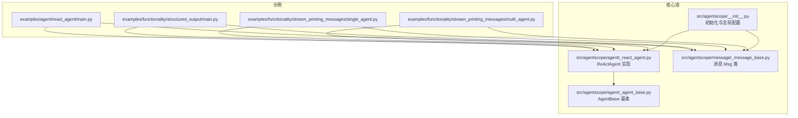
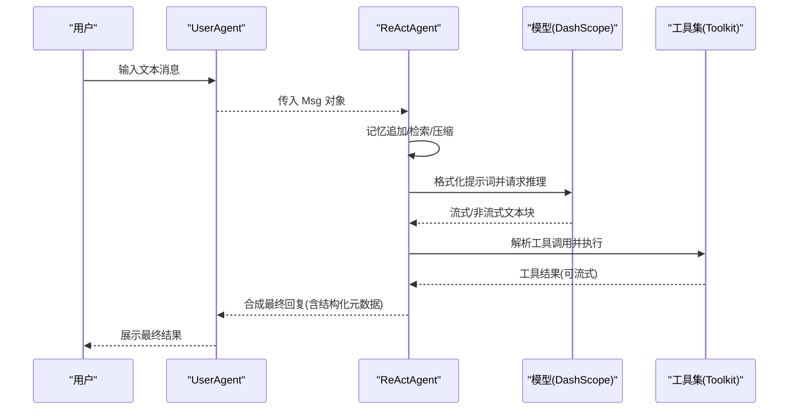
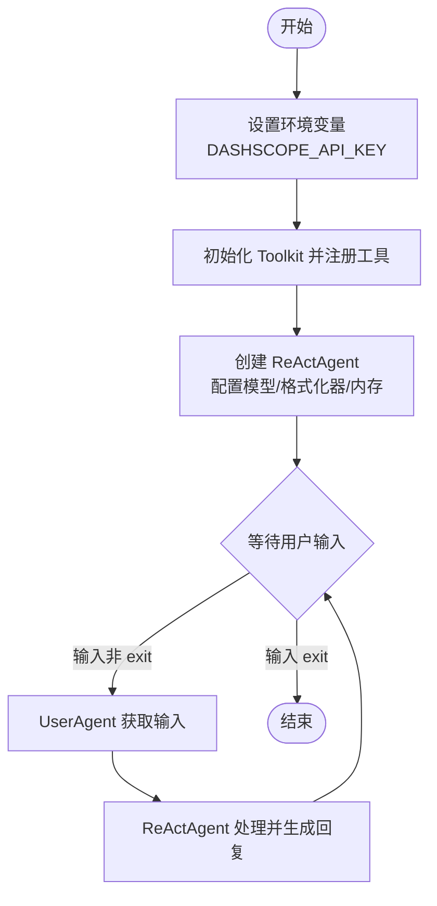
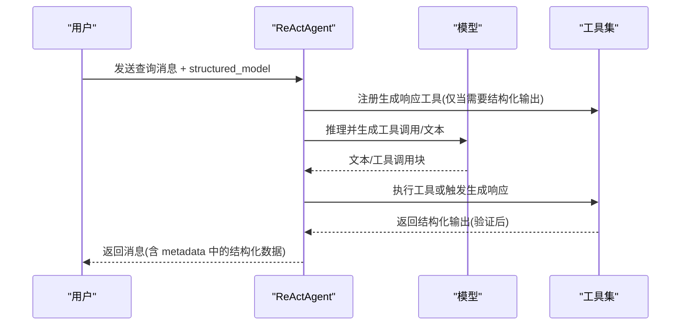
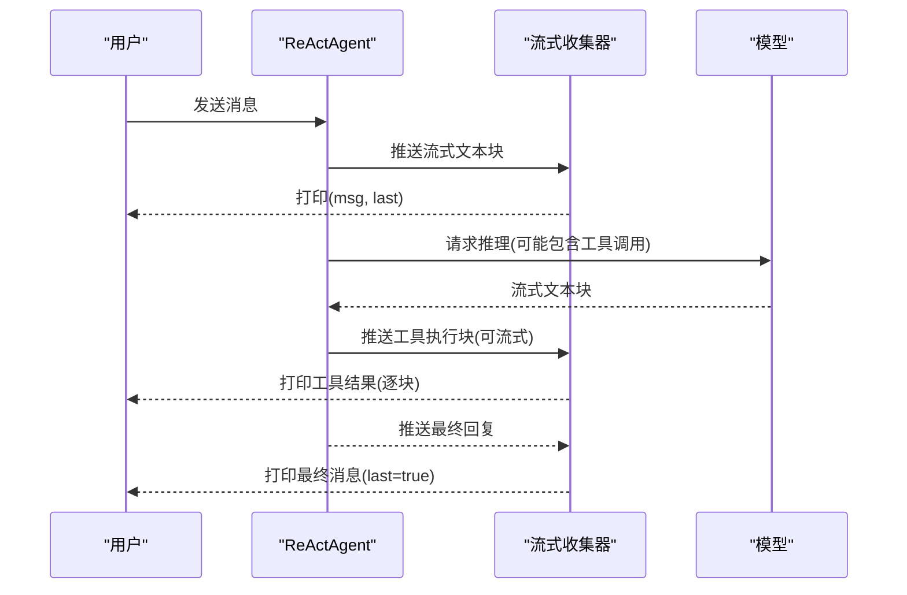
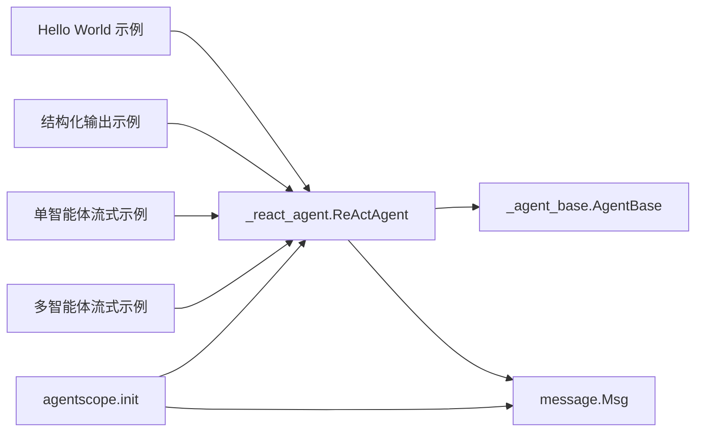

# 快速开始示例

<cite>
**本文引用的文件**
- [examples/agent/react_agent/main.py](file://examples/agent/react_agent/main.py)
- [examples/functionality/structured_output/main.py](file://examples/functionality/structured_output/main.py)
- [examples/functionality/structured_output/README.md](file://examples/functionality/structured_output/README.md)
- [examples/functionality/stream_printing_messages/single_agent.py](file://examples/functionality/stream_printing_messages/single_agent.py)
- [examples/functionality/stream_printing_messages/multi_agent.py](file://examples/functionality/stream_printing_messages/multi_agent.py)
- [examples/functionality/stream_printing_messages/README.md](file://examples/functionality/stream_printing_messages/README.md)
- [src/agentscope/__init__.py](file://src/agentscope/__init__.py)
- [src/agentscope/agent/_react_agent.py](file://src/agentscope/agent/_react_agent.py)
- [src/agentscope/agent/_agent_base.py](file://src/agentscope/agent/_agent_base.py)
- [src/agentscope/message/_message_base.py](file://src/agentscope/message/_message_base.py)
</cite>

## 目录
1. [简介](#简介)
2. [项目结构](#项目结构)
3. [核心组件](#核心组件)
4. [架构总览](#架构总览)
5. [详细组件分析](#详细组件分析)
6. [依赖分析](#依赖分析)
7. [性能考虑](#性能考虑)
8. [故障排查指南](#故障排查指南)
9. [结论](#结论)
10. [附录](#附录)

## 简介
本教程面向初学者，带你通过三个“快速开始”示例掌握 AgentScope 的核心能力与基本用法：
- Hello World：初始化 AgentScope 环境，创建第一个 ReAct 智能体，配置基础参数并运行简单任务。
- 结构化输出：演示如何使用 Pydantic 模型约束 LLM 输出，获取格式化的结构化结果。
- 单智能体流式消息：展示如何以流式方式实时获取智能体的中间输出与最终回复。

每个示例均包含运行步骤、关键代码解析与预期输出说明，帮助你快速理解 AgentScope 的消息模型、智能体生命周期与工具调用机制。

## 项目结构
本次教程涉及的示例与核心模块如下图所示：

图表来源
- [examples/agent/react_agent/main.py:1-51](file://examples/agent/react_agent/main.py#L1-L51)
- [examples/functionality/structured_output/main.py:1-81](file://examples/functionality/structured_output/main.py#L1-L81)
- [examples/functionality/stream_printing_messages/single_agent.py:1-63](file://examples/functionality/stream_printing_messages/single_agent.py#L1-L63)
- [examples/functionality/stream_printing_messages/multi_agent.py:1-63](file://examples/functionality/stream_printing_messages/multi_agent.py#L1-L63)
- [src/agentscope/__init__.py:72-157](file://src/agentscope/__init__.py#L72-L157)
- [src/agentscope/agent/_react_agent.py:98-362](file://src/agentscope/agent/_react_agent.py#L98-L362)
- [src/agentscope/agent/_agent_base.py:30-200](file://src/agentscope/agent/_agent_base.py#L30-L200)
- [src/agentscope/message/_message_base.py:21-100](file://src/agentscope/message/_message_base.py#L21-L100)

章节来源
- [examples/agent/react_agent/main.py:1-51](file://examples/agent/react_agent/main.py#L1-L51)
- [examples/functionality/structured_output/main.py:1-81](file://examples/functionality/structured_output/main.py#L1-L81)
- [examples/functionality/stream_printing_messages/single_agent.py:1-63](file://examples/functionality/stream_printing_messages/single_agent.py#L1-L63)
- [examples/functionality/stream_printing_messages/multi_agent.py:1-63](file://examples/functionality/stream_printing_messages/multi_agent.py#L1-L63)
- [src/agentscope/__init__.py:72-157](file://src/agentscope/__init__.py#L72-L157)
- [src/agentscope/agent/_react_agent.py:98-362](file://src/agentscope/agent/_react_agent.py#L98-L362)
- [src/agentscope/agent/_agent_base.py:30-200](file://src/agentscope/agent/_agent_base.py#L30-L200)
- [src/agentscope/message/_message_base.py:21-100](file://src/agentscope/message/_message_base.py#L21-L100)

## 核心组件
- 初始化与全局配置
  - 使用全局初始化函数设置项目名、运行名、日志级别、是否连接 Studio 或 Tracing 等，确保后续示例的运行环境一致。
- ReActAgent
  - 支持推理-行动循环、工具并行/串行调用、长短期记忆、RAG 检索、结构化输出、实时语音等能力。
- 消息模型 Msg
  - 统一承载文本、工具调用、工具结果、图像、音频、视频等多模态内容块，并支持元数据字段用于结构化输出。
- 用户代理 UserAgent
  - 提供交互输入，便于在命令行中与智能体进行对话。

章节来源
- [src/agentscope/__init__.py:72-157](file://src/agentscope/__init__.py#L72-L157)
- [src/agentscope/agent/_react_agent.py:98-362](file://src/agentscope/agent/_react_agent.py#L98-L362)
- [src/agentscope/message/_message_base.py:21-100](file://src/agentscope/message/_message_base.py#L21-L100)

## 架构总览
下图展示了“Hello World”示例从用户输入到智能体回复的整体流程，包括消息传递、工具调用与流式输出的关键节点。

图表来源
- [examples/agent/react_agent/main.py:18-50](file://examples/agent/react_agent/main.py#L18-L50)
- [src/agentscope/agent/_react_agent.py:376-537](file://src/agentscope/agent/_react_agent.py#L376-L537)

章节来源
- [examples/agent/react_agent/main.py:18-50](file://examples/agent/react_agent/main.py#L18-L50)
- [src/agentscope/agent/_react_agent.py:376-537](file://src/agentscope/agent/_react_agent.py#L376-L537)

## 详细组件分析

### Hello World：初始化环境与创建第一个 ReAct 智能体
目标
- 在本地运行一个可交互的 ReAct 智能体，支持工具调用与流式输出。

运行步骤
- 准备环境变量：设置模型 API 密钥（示例使用 DashScope）。
- 运行脚本：启动示例程序，进入交互循环。
- 输入“exit”退出。

关键代码解析
- 创建工具集并注册常用工具（如执行 Shell 命令、执行 Python 代码、查看文本文件）。
- 初始化 ReActAgent：指定名称、系统提示词、模型、格式化器、工具集与内存。
- 初始化 UserAgent 并进入循环：用户输入消息后交由智能体处理，直到收到退出指令。

预期输出
- 控制台将显示智能体的流式回复与工具执行过程；输入“exit”后结束。

图表来源
- [examples/agent/react_agent/main.py:18-50](file://examples/agent/react_agent/main.py#L18-L50)

章节来源
- [examples/agent/react_agent/main.py:18-50](file://examples/agent/react_agent/main.py#L18-L50)

### 结构化输出：获取格式化的结果
目标
- 使用 Pydantic 模型约束智能体输出，确保返回结构化 JSON 数据。

运行步骤
- 定义 Pydantic 模型（如人员信息表模型、枚举选择模型）。
- 调用智能体时传入 structured_model 参数。
- 从返回消息的 metadata 字段读取验证后的结构化数据。

关键代码解析
- 定义结构化模型：包含字段描述、类型与范围约束。
- 调用智能体：传入查询消息与结构化模型，智能体会自动触发“生成响应”的工具以产出符合 Schema 的结果。
- 读取结果：res.metadata 中包含已验证的 JSON 数据。

图表来源
- [examples/functionality/structured_output/main.py:37-78](file://examples/functionality/structured_output/main.py#L37-L78)
- [src/agentscope/agent/_react_agent.py:407-427](file://src/agentscope/agent/_react_agent.py#L407-L427)

章节来源
- [examples/functionality/structured_output/main.py:37-78](file://examples/functionality/structured_output/main.py#L37-L78)
- [examples/functionality/structured_output/README.md:32-60](file://examples/functionality/structured_output/README.md#L32-L60)
- [src/agentscope/agent/_react_agent.py:407-427](file://src/agentscope/agent/_react_agent.py#L407-L427)

### 单智能体流式消息：实时反馈机制
目标
- 以流式方式获取智能体的中间输出与最终回复，实现“所见即所得”的实时反馈。

运行步骤
- 关闭智能体默认控制台输出，避免干扰流式打印。
- 使用流式收集器聚合消息：逐条打印消息与其“是否最后一块”的标记。
- 观察同一 invocation_id 下的消息累积过程。

关键代码解析
- 关闭控制台输出：set_console_output_enabled(false)，避免终端混杂输出。
- 流式收集：通过流式迭代器逐条获取消息块与“是否最后一块”的标志位。
- 多智能体扩展：示例同时提供了多智能体场景下的流式收集方法。

图表来源
- [examples/functionality/stream_printing_messages/single_agent.py:21-60](file://examples/functionality/stream_printing_messages/single_agent.py#L21-L60)
- [examples/functionality/stream_printing_messages/multi_agent.py:48-59](file://examples/functionality/stream_printing_messages/multi_agent.py#L48-L59)

章节来源
- [examples/functionality/stream_printing_messages/single_agent.py:21-60](file://examples/functionality/stream_printing_messages/single_agent.py#L21-L60)
- [examples/functionality/stream_printing_messages/multi_agent.py:48-59](file://examples/functionality/stream_printing_messages/multi_agent.py#L48-L59)
- [examples/functionality/stream_printing_messages/README.md:9-28](file://examples/functionality/stream_printing_messages/README.md#L9-L28)

## 依赖分析
- 示例与核心模块的依赖关系
  - Hello World 示例依赖 ReActAgent 与消息模型 Msg。
  - 结构化输出示例依赖 ReActAgent 的结构化输出能力与消息的 metadata 字段。
  - 流式消息示例依赖 ReActAgent 的流式输出机制与流式收集器。
- 初始化与全局配置
  - 全局初始化函数负责日志、Studio 集成与追踪配置，为示例提供统一运行环境。

图表来源
- [examples/agent/react_agent/main.py:18-50](file://examples/agent/react_agent/main.py#L18-L50)
- [examples/functionality/structured_output/main.py:37-78](file://examples/functionality/structured_output/main.py#L37-L78)
- [examples/functionality/stream_printing_messages/single_agent.py:21-60](file://examples/functionality/stream_printing_messages/single_agent.py#L21-L60)
- [examples/functionality/stream_printing_messages/multi_agent.py:48-59](file://examples/functionality/stream_printing_messages/multi_agent.py#L48-L59)
- [src/agentscope/__init__.py:72-157](file://src/agentscope/__init__.py#L72-L157)
- [src/agentscope/agent/_react_agent.py:98-362](file://src/agentscope/agent/_react_agent.py#L98-L362)
- [src/agentscope/agent/_agent_base.py:30-200](file://src/agentscope/agent/_agent_base.py#L30-L200)
- [src/agentscope/message/_message_base.py:21-100](file://src/agentscope/message/_message_base.py#L21-L100)

章节来源
- [src/agentscope/__init__.py:72-157](file://src/agentscope/__init__.py#L72-L157)
- [src/agentscope/agent/_react_agent.py:98-362](file://src/agentscope/agent/_react_agent.py#L98-L362)
- [src/agentscope/agent/_agent_base.py:30-200](file://src/agentscope/agent/_agent_base.py#L30-L200)
- [src/agentscope/message/_message_base.py:21-100](file://src/agentscope/message/_message_base.py#L21-L100)

## 性能考虑
- 流式输出
  - 开启模型流式输出可降低首字延迟，提升交互体验；但需注意网络与终端渲染开销。
- 工具调用
  - 并行工具调用可缩短总耗时，但会增加并发资源占用；串行调用更稳定，适合复杂工具链。
- 记忆与压缩
  - 长上下文会带来额外成本；合理配置记忆压缩阈值与保留近期记录可平衡效果与性能。
- 日志与追踪
  - 生产环境中建议关闭不必要的控制台输出，减少 I/O 干扰；按需开启 Studio/Tracing。

## 故障排查指南
- 环境变量未设置
  - 症状：模型初始化失败或认证错误。
  - 处理：确保已设置正确的 API 密钥环境变量。
- 模型与格式化器不匹配
  - 症状：报错提示格式化器与模型不兼容。
  - 处理：根据示例注释，确保模型与格式化器成对使用。
- 流式输出异常
  - 症状：终端输出混乱或消息重复。
  - 处理：关闭智能体默认控制台输出，使用流式收集器统一打印。
- 结构化输出未生效
  - 症状：返回消息缺少 metadata 或字段未按 Schema 验证。
  - 处理：确认调用时传入了 structured_model 参数，并检查模型是否支持结构化输出功能。

章节来源
- [examples/functionality/structured_output/README.md:32-60](file://examples/functionality/structured_output/README.md#L32-L60)
- [examples/functionality/stream_printing_messages/README.md:26-28](file://examples/functionality/stream_printing_messages/README.md#L26-L28)

## 结论
通过本教程的三个示例，你已经掌握了：
- 如何初始化 AgentScope 环境并创建第一个 ReAct 智能体；
- 如何配置模型、格式化器、工具集与内存；
- 如何获取结构化输出并读取验证后的 JSON 数据；
- 如何以流式方式实时接收中间与最终输出。

这些能力构成了 AgentScope 的核心使用路径，建议在实践中结合工具与记忆模块进一步扩展智能体的能力边界。

## 附录
- 运行前准备
  - 安装依赖并配置 DashScope API 密钥。
  - 参考各示例的 README 获取更详细的运行说明与最佳实践。