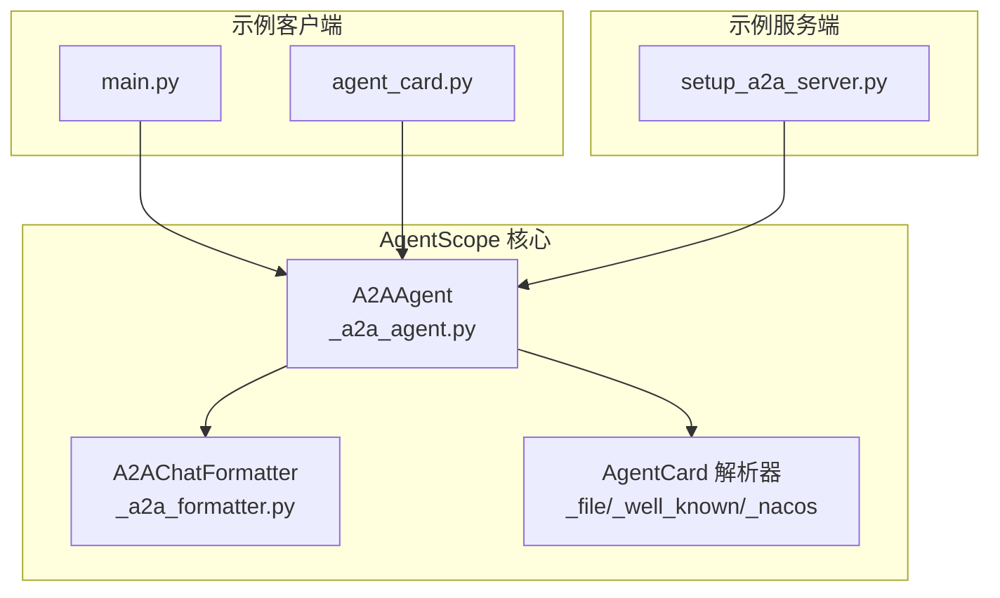
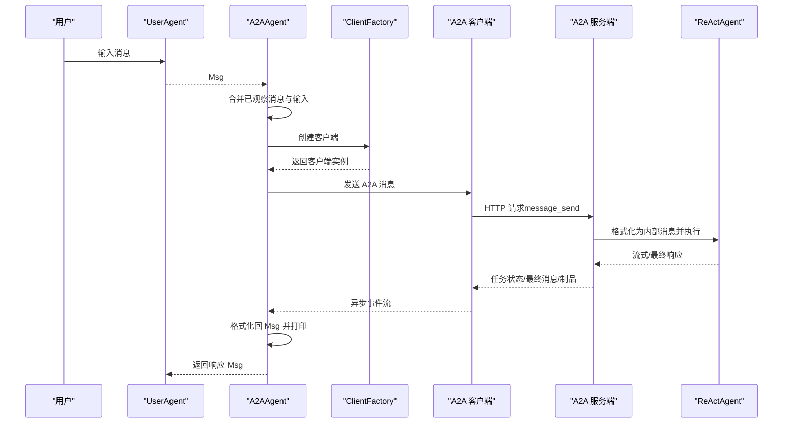
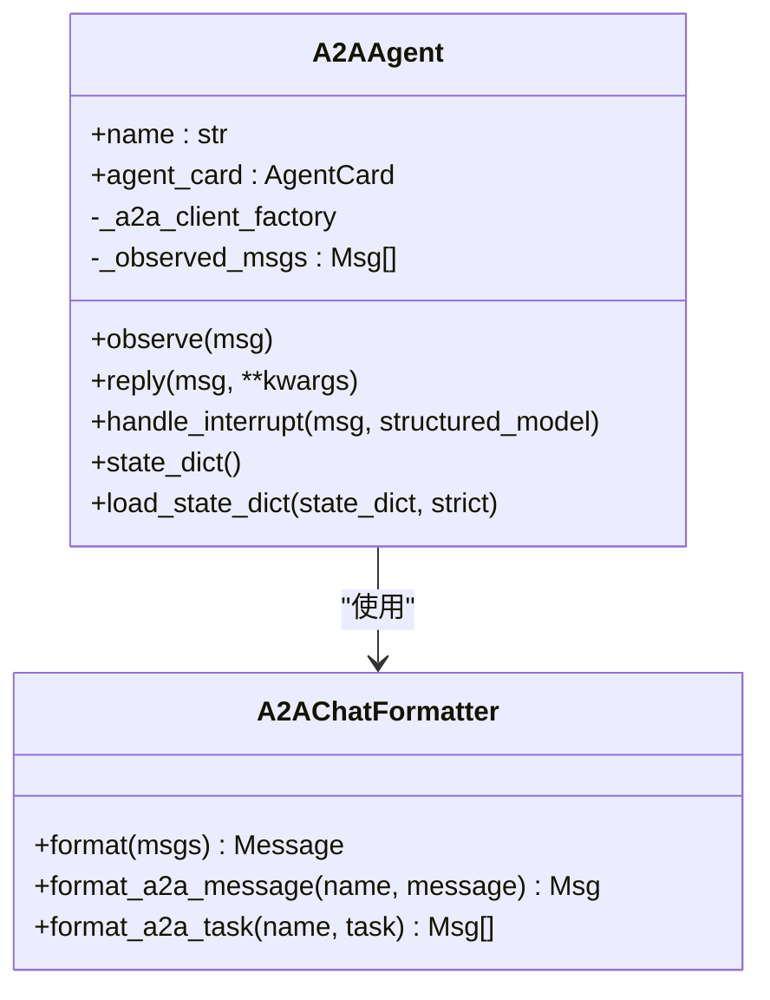
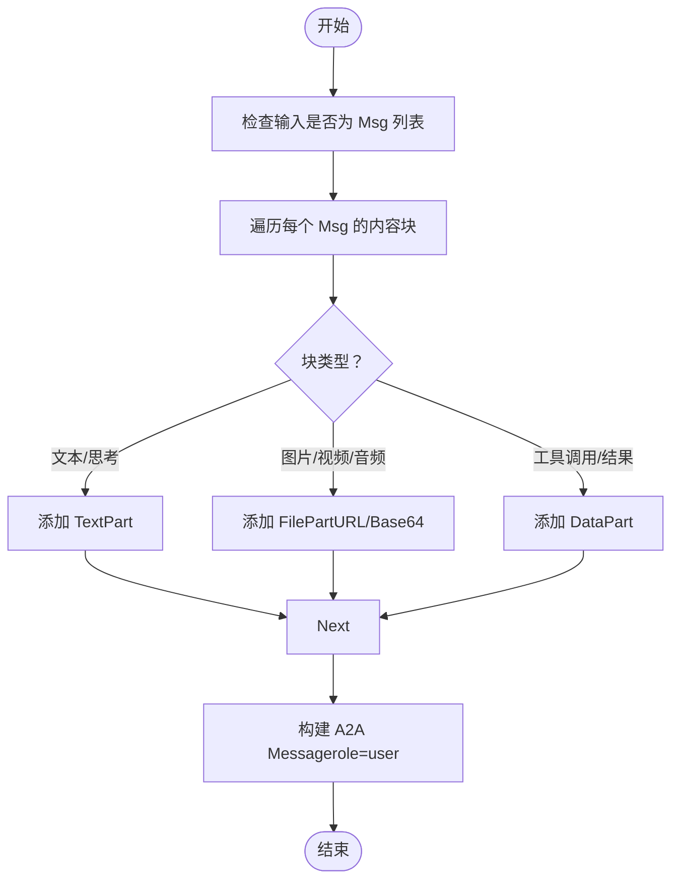
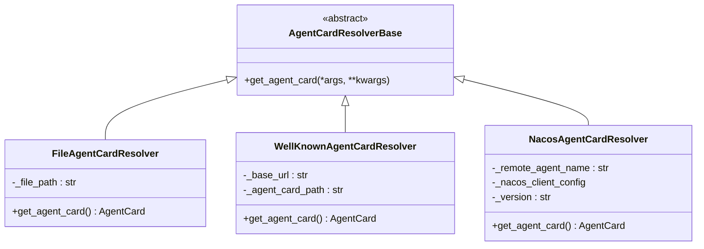
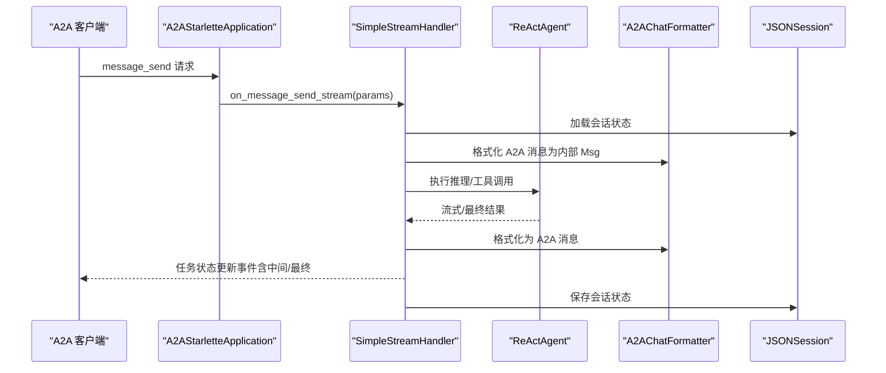
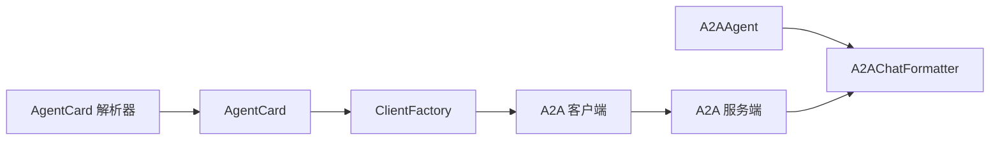

# A2A智能体示例

<cite>
**本文引用的文件**
- [examples/agent/a2a_agent/README.md](file://examples/agent/a2a_agent/README.md)
- [examples/agent/a2a_agent/main.py](file://examples/agent/a2a_agent/main.py)
- [examples/agent/a2a_agent/setup_a2a_server.py](file://examples/agent/a2a_agent/setup_a2a_server.py)
- [examples/agent/a2a_agent/agent_card.py](file://examples/agent/a2a_agent/agent_card.py)
- [examples/agent/a2ui_agent/samples/client/a2a_client.py](file://examples/agent/a2ui_agent/samples/client/a2a_client.py)
- [src/agentscope/agent/_a2a_agent.py](file://src/agentscope/agent/_a2a_agent.py)
- [src/agentscope/a2a/__init__.py](file://src/agentscope/a2a/__init__.py)
- [src/agentscope/a2a/_base.py](file://src/agentscope/a2a/_base.py)
- [src/agentscope/a2a/_file_resolver.py](file://src/agentscope/a2a/_file_resolver.py)
- [src/agentscope/a2a/_well_known_resolver.py](file://src/agentscope/a2a/_well_known_resolver.py)
- [src/agentscope/a2a/_nacos_resolver.py](file://src/agentscope/a2a/_nacos_resolver.py)
- [src/agentscope/formatter/_a2a_formatter.py](file://src/agentscope/formatter/_a2a_formatter.py)
- [tests/a2a_agent_test.py](file://tests/a2a_agent_test.py)
- [tests/a2a_resolver_test.py](file://tests/a2a_resolver_test.py)
</cite>

## 目录
1. [简介](#简介)
2. [项目结构](#项目结构)
3. [核心组件](#核心组件)
4. [架构总览](#架构总览)
5. [组件详解](#组件详解)
6. [依赖关系分析](#依赖关系分析)
7. [性能与扩展性](#性能与扩展性)
8. [故障排查指南](#故障排查指南)
9. [结论](#结论)
10. [附录：完整示例与部署步骤](#附录完整示例与部署步骤)

## 简介
本示例围绕 AgentScope 中的 Agent-to-Agent（A2A）协议，演示如何在客户端侧使用 A2AAgent 与远端 A2A 服务端进行消息传递、状态同步与任务协作。示例涵盖：
- A2A 智能体卡片（AgentCard）的定义与管理
- A2A 服务器的搭建与配置（含服务发现、连接管理、数据传输）
- 客户端与服务端的完整交互流程
- 在分布式智能体系统、微服务架构、多智能体协作中的应用价值与部署建议

## 项目结构
A2A 示例位于 examples/agent/a2a_agent 目录，核心文件如下：
- main.py：客户端主程序，构建用户与 A2AAgent 的对话循环
- setup_a2a_server.py：服务端应用，基于 ReActAgent 提供 A2A 能力
- agent_card.py：A2A Agent 的卡片定义（名称、URL、能力、技能等）
- README.md：示例说明与运行指引

此外，AgentScope 内部提供了 A2A 协议相关的核心实现与格式化器：
- src/agentscope/agent/_a2a_agent.py：A2AAgent 实现，负责消息转换、远程调用与状态跟踪
- src/agentscope/formatter/_a2a_formatter.py：A2A 消息格式化器，双向转换 AgentScope 与 A2A 消息
- src/agentscope/a2a/：A2A 卡片解析器集合（文件解析、Well-Known 解析、Nacos 解析）

**图表来源**
- [examples/agent/a2a_agent/main.py:1-28](file://examples/agent/a2a_agent/main.py#L1-L28)
- [examples/agent/a2a_agent/agent_card.py:1-38](file://examples/agent/a2a_agent/agent_card.py#L1-L38)
- [examples/agent/a2a_agent/setup_a2a_server.py:1-131](file://examples/agent/a2a_agent/setup_a2a_server.py#L1-L131)
- [src/agentscope/agent/_a2a_agent.py:1-289](file://src/agentscope/agent/_a2a_agent.py#L1-L289)
- [src/agentscope/formatter/_a2a_formatter.py:1-365](file://src/agentscope/formatter/_a2a_formatter.py#L1-L365)
- [src/agentscope/a2a/_file_resolver.py:1-79](file://src/agentscope/a2a/_file_resolver.py#L1-L79)
- [src/agentscope/a2a/_well_known_resolver.py:1-91](file://src/agentscope/a2a/_well_known_resolver.py#L1-L91)
- [src/agentscope/a2a/_nacos_resolver.py:1-99](file://src/agentscope/a2a/_nacos_resolver.py#L1-L99)

**章节来源**
- [examples/agent/a2a_agent/README.md:1-49](file://examples/agent/a2a_agent/README.md#L1-L49)
- [examples/agent/a2a_agent/main.py:1-28](file://examples/agent/a2a_agent/main.py#L1-L28)
- [examples/agent/a2a_agent/agent_card.py:1-38](file://examples/agent/a2a_agent/agent_card.py#L1-L38)
- [examples/agent/a2a_agent/setup_a2a_server.py:1-131](file://examples/agent/a2a_agent/setup_a2a_server.py#L1-L131)

## 核心组件
- A2AAgent：在客户端侧封装 A2A 协议调用，负责消息合并、远程发送、状态轮询/流式接收、结果格式化与上下文清理
- A2AChatFormatter：双向消息格式化器，将 AgentScope 的 Msg 转换为 A2A Message，或将 A2A 的 Message/Task 转回 Msg
- AgentCard：描述远端智能体的元信息（名称、URL、版本、能力、默认输入/输出模式、技能列表），用于客户端初始化与服务发现
- AgentCard 解析器：支持从文件、Well-Known URL、Nacos 等来源获取 AgentCard，便于动态服务发现与配置管理

典型职责与约束（来自源码注释与实现）：
- 仅支持聊天机器人场景（用户与单个助手），多智能体协作需服务端正确处理消息中的名称字段
- 不支持结构化输出（structured_model 参数在 reply 中被拒绝）
- 会将已观察到的消息保存在本地，并在 reply 时与新输入合并；处理完成后清空

**章节来源**
- [src/agentscope/agent/_a2a_agent.py:29-46](file://src/agentscope/agent/_a2a_agent.py#L29-L46)
- [src/agentscope/agent/_a2a_agent.py:177-211](file://src/agentscope/agent/_a2a_agent.py#L177-L211)
- [src/agentscope/agent/_a2a_agent.py:154-176](file://src/agentscope/agent/_a2a_agent.py#L154-L176)
- [src/agentscope/formatter/_a2a_formatter.py:31-51](file://src/agentscope/formatter/_a2a_formatter.py#L31-L51)
- [examples/agent/a2a_agent/agent_card.py:5-37](file://examples/agent/a2a_agent/agent_card.py#L5-L37)

## 架构总览
下图展示了客户端 A2AAgent 与服务端 A2A 应用之间的交互路径，以及消息格式化与卡片解析的关键环节。

**图表来源**
- [examples/agent/a2a_agent/main.py:10-27](file://examples/agent/a2a_agent/main.py#L10-L27)
- [src/agentscope/agent/_a2a_agent.py:224-253](file://src/agentscope/agent/_a2a_agent.py#L224-L253)
- [examples/agent/a2a_agent/setup_a2a_server.py:34-122](file://examples/agent/a2a_agent/setup_a2a_server.py#L34-L122)
- [src/agentscope/formatter/_a2a_formatter.py:147-184](file://src/agentscope/formatter/_a2a_formatter.py#L147-L184)

## 组件详解

### A2AAgent 类与消息处理流程
- 初始化：接收 AgentCard，创建 ClientFactory（可配置 httpx 客户端与消费者），注册额外传输生产者
- observe：接收消息但不回复，存储于本地列表，用于后续 reply 合并
- reply：将已观察消息与输入消息合并，经 A2AChatFormatter 转换为 A2A Message，通过客户端发送；异步消费事件流，格式化回 Msg 并打印；完成后清空已观察消息
- handle_interrupt：当回复被中断时，生成提示消息并加入已观察消息以保留上下文

**图表来源**
- [src/agentscope/agent/_a2a_agent.py:29-113](file://src/agentscope/agent/_a2a_agent.py#L29-L113)
- [src/agentscope/agent/_a2a_agent.py:154-289](file://src/agentscope/agent/_a2a_agent.py#L154-L289)
- [src/agentscope/formatter/_a2a_formatter.py:31-365](file://src/agentscope/formatter/_a2a_formatter.py#L31-L365)

**章节来源**
- [src/agentscope/agent/_a2a_agent.py:48-113](file://src/agentscope/agent/_a2a_agent.py#L48-L113)
- [src/agentscope/agent/_a2a_agent.py:154-289](file://src/agentscope/agent/_a2a_agent.py#L154-L289)

### A2A 消息格式化器
- format：将多个 Msg 合并为单个 A2A Message，角色统一为 user；支持文本、图像/视频/音频（URL/Base64）、工具调用/结果等块类型
- format_a2a_message：将 A2A Message 转回 Msg，处理角色映射与内容块重建
- format_a2a_task：将 A2A Task 的状态消息与制品合并为 Msg 列表，必要时合并同角色内容块
- _format_a2a_part：根据 Part 类型选择合适的 ContentBlock 表达

**图表来源**
- [src/agentscope/formatter/_a2a_formatter.py:35-145](file://src/agentscope/formatter/_a2a_formatter.py#L35-L145)
- [src/agentscope/formatter/_a2a_formatter.py:147-184](file://src/agentscope/formatter/_a2a_formatter.py#L147-L184)
- [src/agentscope/formatter/_a2a_formatter.py:224-271](file://src/agentscope/formatter/_a2a_formatter.py#L224-L271)
- [src/agentscope/formatter/_a2a_formatter.py:273-365](file://src/agentscope/formatter/_a2a_formatter.py#L273-L365)

**章节来源**
- [src/agentscope/formatter/_a2a_formatter.py:31-365](file://src/agentscope/formatter/_a2a_formatter.py#L31-L365)

### AgentCard 与解析器
- AgentCard：描述远端智能体的元信息，包括 URL、能力、默认输入/输出模式、技能等
- FileAgentCardResolver：从 JSON 文件加载 AgentCard
- WellKnownAgentCardResolver：从 Well-Known URL 获取 AgentCard
- NacosAgentCardResolver：从 Nacos 服务订阅 AgentCard，支持版本与生命周期管理

**图表来源**
- [src/agentscope/a2a/_base.py:12-25](file://src/agentscope/a2a/_base.py#L12-L25)
- [src/agentscope/a2a/_file_resolver.py:15-78](file://src/agentscope/a2a/_file_resolver.py#L15-L78)
- [src/agentscope/a2a/_well_known_resolver.py:15-90](file://src/agentscope/a2a/_well_known_resolver.py#L15-L90)
- [src/agentscope/a2a/_nacos_resolver.py:17-98](file://src/agentscope/a2a/_nacos_resolver.py#L17-L98)

**章节来源**
- [examples/agent/a2a_agent/agent_card.py:5-37](file://examples/agent/a2a_agent/agent_card.py#L5-L37)
- [src/agentscope/a2a/_file_resolver.py:15-78](file://src/agentscope/a2a/_file_resolver.py#L15-L78)
- [src/agentscope/a2a/_well_known_resolver.py:15-90](file://src/agentscope/a2a/_well_known_resolver.py#L15-L90)
- [src/agentscope/a2a/_nacos_resolver.py:17-98](file://src/agentscope/a2a/_nacos_resolver.py#L17-L98)

### 服务端应用与工具集成
服务端示例基于 ReActAgent，提供工具集（代码执行、Shell 命令、查看文本文件），并通过 A2A 星舰应用封装消息流式返回与任务状态更新事件。

关键点：
- 使用 A2AStarletteApplication 构建应用，注入 AgentCard 与请求处理器
- 请求处理器 on_message_send_stream 接收 MessageSendParams，创建 ReActAgent，格式化 A2A 消息为内部 Msg，执行后通过 A2AChatFormatter 转回 A2A 消息并持续产出任务状态更新事件
- 会话状态通过 JSONSession 保存/恢复，便于长对话与状态延续

**图表来源**
- [examples/agent/a2a_agent/setup_a2a_server.py:31-122](file://examples/agent/a2a_agent/setup_a2a_server.py#L31-L122)
- [src/agentscope/formatter/_a2a_formatter.py:92-122](file://src/agentscope/formatter/_a2a_formatter.py#L92-L122)

**章节来源**
- [examples/agent/a2a_agent/setup_a2a_server.py:31-122](file://examples/agent/a2a_agent/setup_a2a_server.py#L31-L122)

## 依赖关系分析
- A2AAgent 依赖 A2AChatFormatter 进行消息双向转换
- A2AAgent 通过 ClientFactory 创建 A2A 客户端，客户端基于 AgentCard 的 URL 与能力进行连接
- 服务端通过 A2AStarletteApplication 与 A2AChatFormatter 协作，结合 ReActAgent 与工具集完成任务执行
- AgentCard 解析器为客户端提供动态服务发现能力，支持文件、Well-Known URL、Nacos 等多种来源

**图表来源**
- [src/agentscope/agent/_a2a_agent.py:88-98](file://src/agentscope/agent/_a2a_agent.py#L88-L98)
- [examples/agent/a2a_agent/setup_a2a_server.py:126-130](file://examples/agent/a2a_agent/setup_a2a_server.py#L126-L130)
- [src/agentscope/a2a/__init__.py:3-14](file://src/agentscope/a2a/__init__.py#L3-L14)

**章节来源**
- [src/agentscope/agent/_a2a_agent.py:88-98](file://src/agentscope/agent/_a2a_agent.py#L88-L98)
- [src/agentscope/a2a/__init__.py:3-14](file://src/agentscope/a2a/__init__.py#L3-L14)

## 性能与扩展性
- 流式传输：服务端通过事件流持续推送任务状态，客户端按事件增量渲染，降低等待时间
- 会话持久化：通过 JSONSession 保存/恢复会话状态，减少重复计算与上下文丢失
- 工具链扩展：服务端工具集可按需扩展，支持更丰富的外部能力（如数据库查询、文件系统操作等）
- 解析器扩展：支持从 Nacos 等服务发现平台动态拉取 AgentCard，便于灰度发布与版本治理

[本节为通用指导，无需特定文件引用]

## 故障排查指南
常见问题与定位建议：
- 无法连接远端服务端
  - 检查 AgentCard 的 URL 是否可达，网络连通性与端口开放情况
  - 若使用 Well-Known 解析器，请确认 .well-known 路径与权限
- 消息格式错误
  - 确认 A2AChatFormatter 支持的内容块类型（文本、URL/Base64 文件、工具调用/结果）
  - 检查 Msg 的内容块结构与类型是否匹配
- 无响应或超时
  - 调整 ClientFactory 的 httpx 客户端超时设置
  - 检查服务端是否正确返回任务状态更新事件
- 状态未保存/恢复
  - 确认 JSONSession 的 save_dir 与会话 ID 设置
  - 检查会话状态的序列化/反序列化逻辑

**章节来源**
- [src/agentscope/agent/_a2a_agent.py:93-96](file://src/agentscope/agent/_a2a_agent.py#L93-L96)
- [examples/agent/a2a_agent/setup_a2a_server.py:72-76](file://examples/agent/a2a_agent/setup_a2a_server.py#L72-L76)
- [tests/a2a_agent_test.py:149-177](file://tests/a2a_agent_test.py#L149-L177)

## 结论
A2A 智能体示例展示了在 AgentScope 中通过 A2AAgent 与远端服务端进行消息传递、状态同步与任务协作的完整流程。借助 AgentCard 与多种解析器，系统实现了灵活的服务发现与配置管理；通过 A2AChatFormatter，实现了跨协议的消息双向转换。该方案适用于分布式智能体系统、微服务架构与多智能体协作场景，具备良好的扩展性与可维护性。

[本节为总结，无需特定文件引用]

## 附录：完整示例与部署步骤
- 环境准备与运行
  - 安装依赖：参考示例说明文档中的安装命令
  - 启动服务端：使用 uvicorn 启动示例服务端应用
  - 运行客户端：执行示例主程序，进入与 A2A Agent 的对话
- 关键配置
  - AgentCard：定义远端智能体的 URL、能力与技能
  - 客户端工厂：可配置 httpx 客户端与消费者，支持扩展传输生产者
  - 服务端工具集：按需注册工具函数，结合 ReActAgent 完成复杂任务
- 参考实现
  - 客户端示例：展示了从 Well-Known URL 获取 AgentCard 并发送消息的流程
  - 服务端示例：展示了基于 ReActAgent 的消息处理与事件流式返回

**章节来源**
- [examples/agent/a2a_agent/README.md:25-48](file://examples/agent/a2a_agent/README.md#L25-L48)
- [examples/agent/a2a_agent/main.py:10-27](file://examples/agent/a2a_agent/main.py#L10-L27)
- [examples/agent/a2a_agent/setup_a2a_server.py:126-130](file://examples/agent/a2a_agent/setup_a2a_server.py#L126-L130)
- [examples/agent/a2ui_agent/samples/client/a2a_client.py:22-156](file://examples/agent/a2ui_agent/samples/client/a2a_client.py#L22-L156)