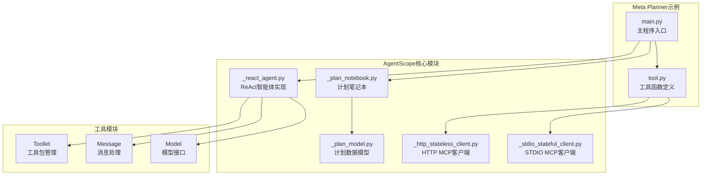
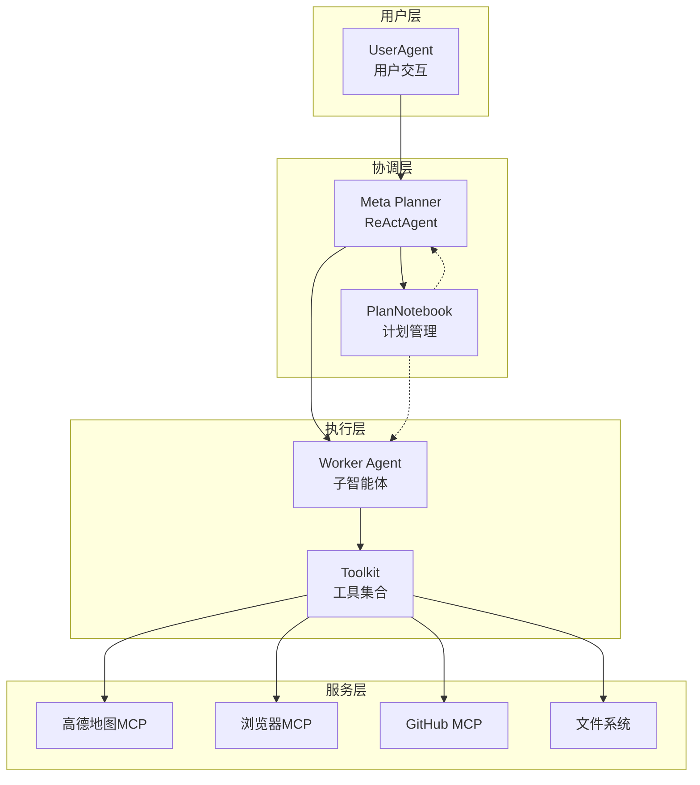
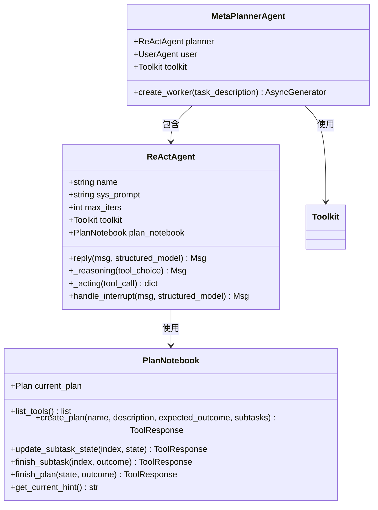
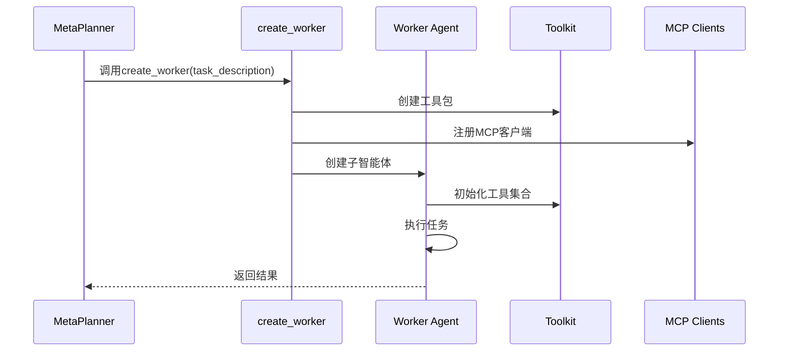
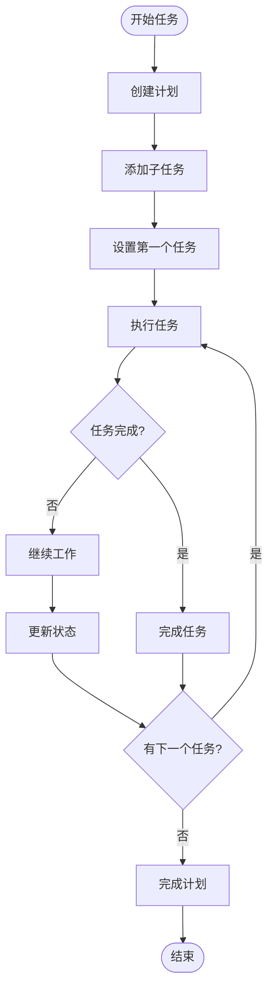
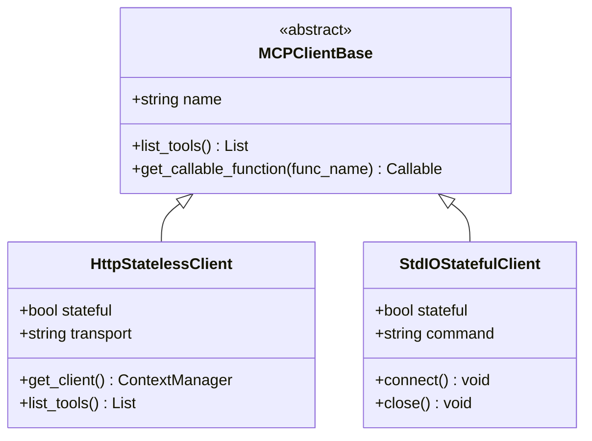
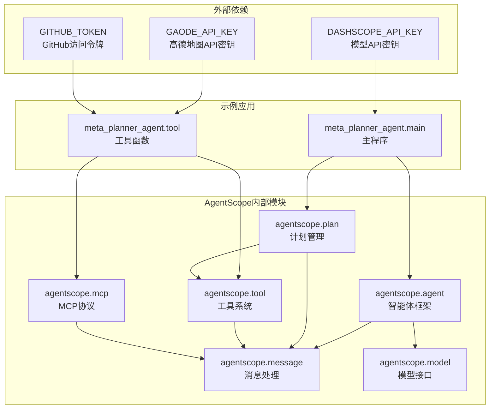

# Meta Planner智能体示例

<cite>
**本文档引用的文件**
- [main.py](file://examples/agent/meta_planner_agent/main.py)
- [tool.py](file://examples/agent/meta_planner_agent/tool.py)
- [_plan_notebook.py](file://src/agentscope/plan/_plan_notebook.py)
- [_react_agent.py](file://src/agentscope/agent/_react_agent.py)
- [_http_stateless_client.py](file://src/agentscope/mcp/_http_stateless_client.py)
- [_stdio_stateful_client.py](file://src/agentscope/mcp/_stdio_stateful_client.py)
- [_plan_model.py](file://src/agentscope/plan/_plan_model.py)
- [task_plan.py](file://docs/tutorial/en/src/task_plan.py)
</cite>

## 目录
1. [简介](#简介)
2. [项目结构](#项目结构)
3. [核心组件](#核心组件)
4. [架构概览](#架构概览)
5. [详细组件分析](#详细组件分析)
6. [依赖关系分析](#依赖关系分析)
7. [性能考虑](#性能考虑)
8. [故障排除指南](#故障排除指南)
9. [结论](#结论)

## 简介

Meta Planner智能体示例展示了如何构建一个具备元认知思维的智能体系统，能够分析用户需求、制定详细执行计划、分配任务给不同工作智能体，并监控执行进度。该示例基于AgentScope框架，实现了复杂的任务协调、多智能体协作和动态任务调度功能。

该智能体的核心特点包括：
- 元认知思维模式：通过ReAct算法实现推理-行动循环
- 动态任务规划：支持创建、修改和执行复杂任务计划
- 多智能体协作：能够创建子工作智能体并协调其执行
- 工具函数集成：支持多种外部工具和服务的无缝集成
- 实时监控：提供任务执行进度的实时跟踪和可视化

## 项目结构

Meta Planner智能体示例位于`examples/agent/meta_planner_agent/`目录下，主要包含以下文件：

**图表来源**
- [main.py:1-60](file://examples/agent/meta_planner_agent/main.py#L1-L60)
- [tool.py:1-221](file://examples/agent/meta_planner_agent/tool.py#L1-L221)

**章节来源**
- [main.py:1-60](file://examples/agent/meta_planner_agent/main.py#L1-L60)
- [tool.py:1-221](file://examples/agent/meta_planner_agent/tool.py#L1-L221)

## 核心组件

Meta Planner智能体示例由以下几个核心组件构成：

### 1. 主程序组件
- **ReActAgent实例**：作为Meta Planner智能体，负责整体任务协调和决策
- **UserAgent实例**：模拟用户输入，提供交互界面
- **PlanNotebook实例**：管理任务计划的创建、修改和执行

### 2. 工具函数组件
- **create_worker函数**：动态创建子工作智能体
- **MCP客户端**：集成高德地图、浏览器、GitHub等外部服务
- **文件操作工具**：支持文本文件的读写和插入操作

### 3. 计划管理系统
- **PlanNotebook类**：提供计划相关的工具函数
- **Plan和SubTask模型**：定义任务计划的数据结构
- **默认提示生成器**：根据当前计划状态提供指导建议

**章节来源**
- [main.py:24-48](file://examples/agent/meta_planner_agent/main.py#L24-L48)
- [_react_agent.py:98-1137](file://src/agentscope/agent/_react_agent.py#L98-L1137)
- [_plan_notebook.py:172-200](file://src/agentscope/plan/_plan_notebook.py#L172-L200)

## 架构概览

Meta Planner智能体采用分层架构设计，实现了智能体间的层次化协作：

**图表来源**
- [main.py:27-49](file://examples/agent/meta_planner_agent/main.py#L27-L49)
- [tool.py:139-157](file://examples/agent/meta_planner_agent/tool.py#L139-L157)

该架构实现了以下关键特性：
- **分层协作**：Meta Planner负责高层决策，子智能体处理具体任务
- **动态创建**：根据任务需求动态创建合适的子智能体
- **工具集成**：统一的工具接口支持多种外部服务
- **状态管理**：完整的计划状态跟踪和恢复机制

## 详细组件分析

### Meta Planner智能体实现

Meta Planner智能体基于ReAct算法实现，具备强大的推理和行动能力：

**图表来源**
- [_react_agent.py:98-1137](file://src/agentscope/agent/_react_agent.py#L98-L1137)
- [_plan_notebook.py:172-200](file://src/agentscope/plan/_plan_notebook.py#L172-L200)

**章节来源**
- [_react_agent.py:98-1137](file://src/agentscope/agent/_react_agent.py#L98-L1137)
- [_plan_notebook.py:172-200](file://src/agentscope/plan/_plan_notebook.py#L172-L200)

### 工具函数实现

工具函数是Meta Planner智能体的核心扩展点，提供了丰富的外部服务集成能力：

**图表来源**
- [tool.py:61-221](file://examples/agent/meta_planner_agent/tool.py#L61-L221)

工具函数的主要功能包括：
- **MCP客户端注册**：自动配置高德地图、浏览器、GitHub等服务
- **子智能体创建**：动态生成专门处理特定任务的工作智能体
- **流式响应处理**：支持实时的任务执行进度反馈
- **结构化结果输出**：统一的任务完成结果格式

**章节来源**
- [tool.py:61-221](file://examples/agent/meta_planner_agent/tool.py#L61-L221)

### 计划管理系统

计划管理系统提供了完整的任务规划和执行跟踪能力：

**图表来源**
- [_plan_model.py:104-200](file://src/agentscope/plan/_plan_model.py#L104-L200)

计划管理系统的特性：
- **状态跟踪**：完整跟踪每个子任务的状态变化
- **自动激活**：完成后自动激活下一个相关任务
- **历史记录**：保存已完成计划的历史信息
- **恢复机制**：支持从历史计划中恢复执行

**章节来源**
- [_plan_model.py:104-200](file://src/agentscope/plan/_plan_model.py#L104-L200)
- [_plan_notebook.py:172-200](file://src/agentscope/plan/_plan_notebook.py#L172-L200)

### MCP客户端集成

MCP（Model Context Protocol）客户端提供了与外部服务的标准化接口：

**图表来源**
- [_http_stateless_client.py:16-153](file://src/agentscope/mcp/_http_stateless_client.py#L16-L153)
- [_stdio_stateful_client.py:11-35](file://src/agentscope/mcp/_stdio_stateful_client.py#L11-L35)

MCP客户端的特点：
- **无状态HTTP客户端**：适合一次性任务调用
- **有状态STDIO客户端**：适合需要保持会话状态的服务
- **流式传输**：支持Server-Sent Events和可流式HTTP传输
- **统一接口**：提供一致的工具函数调用接口

**章节来源**
- [_http_stateless_client.py:16-153](file://src/agentscope/mcp/_http_stateless_client.py#L16-L153)
- [_stdio_stateful_client.py:11-35](file://src/agentscope/mcp/_stdio_stateful_client.py#L11-L35)

## 依赖关系分析

Meta Planner智能体示例展现了清晰的模块化依赖关系：

**图表来源**
- [main.py:40-43](file://examples/agent/meta_planner_agent/main.py#L40-L43)
- [tool.py:77-131](file://examples/agent/meta_planner_agent/tool.py#L77-L131)

依赖关系的关键特征：
- **环境变量驱动**：通过环境变量控制外部服务的可用性
- **模块化设计**：各组件职责明确，耦合度低
- **可扩展性**：易于添加新的工具和服务
- **向后兼容**：保持API稳定性

**章节来源**
- [main.py:40-43](file://examples/agent/meta_planner_agent/main.py#L40-L43)
- [tool.py:77-131](file://examples/agent/meta_planner_agent/tool.py#L77-L131)

## 性能考虑

Meta Planner智能体在设计时充分考虑了性能优化：

### 1. 异步执行优化
- **流式响应**：支持实时的任务执行进度反馈
- **并发处理**：子智能体可以并行执行独立任务
- **内存管理**：自动压缩长期对话历史以节省内存

### 2. 工具调用优化
- **批量工具调用**：支持并行执行多个工具函数
- **缓存机制**：复用已注册的MCP客户端连接
- **超时控制**：为工具调用设置合理的超时时间

### 3. 计划执行优化
- **状态预计算**：预先计算计划状态以减少重复计算
- **增量更新**：只更新发生变化的任务状态
- **延迟加载**：按需加载和初始化子智能体

## 故障排除指南

### 常见问题及解决方案

#### 1. API密钥配置问题
**问题**：无法连接到外部服务
**解决方案**：
- 确保环境变量正确设置
- 检查API密钥的有效性和权限
- 验证网络连接是否正常

#### 2. 子智能体创建失败
**问题**：create_worker函数抛出异常
**解决方案**：
- 检查MCP客户端连接状态
- 验证工具函数注册是否成功
- 查看子智能体的初始化参数

#### 3. 计划执行异常
**问题**：任务状态更新失败
**解决方案**：
- 检查子任务索引是否有效
- 验证任务状态转换的合法性
- 查看计划存储的完整性

#### 4. 内存使用过高
**问题**：长时间运行后内存占用增加
**解决方案**：
- 调整记忆压缩配置
- 限制最大迭代次数
- 定期清理临时数据

**章节来源**
- [tool.py:89-92](file://examples/agent/meta_planner_agent/tool.py#L89-L92)
- [_react_agent.py:433-452](file://src/agentscope/agent/_react_agent.py#L433-L452)

## 结论

Meta Planner智能体示例展示了现代AI智能体系统的核心设计理念和技术实现。通过元认知思维模式、动态任务规划和多智能体协作，该示例为复杂任务的自动化处理提供了完整的解决方案。

### 主要优势

1. **高度模块化**：清晰的组件分离和职责划分
2. **强大扩展性**：支持无限数量的外部服务集成
3. **智能协作**：多智能体间的高效协作和通信
4. **实时监控**：完整的任务执行进度跟踪
5. **稳定可靠**：完善的错误处理和恢复机制

### 应用场景

该智能体示例适用于以下应用场景：
- **复杂任务自动化**：需要多步骤、多智能体协作的任务
- **动态服务集成**：需要灵活接入各种外部服务的场景
- **实时协作系统**：需要实时反馈和监控的应用
- **知识密集型任务**：需要大量工具和资源协调的工作

通过进一步的定制和扩展，Meta Planner智能体可以适应更广泛的业务需求，为企业级应用提供强大的智能化解决方案。