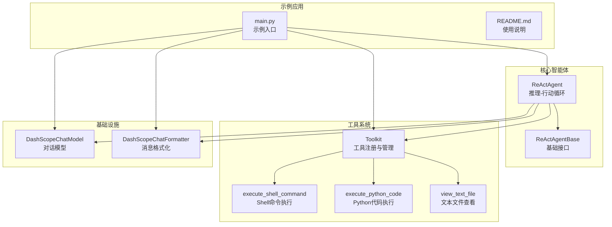
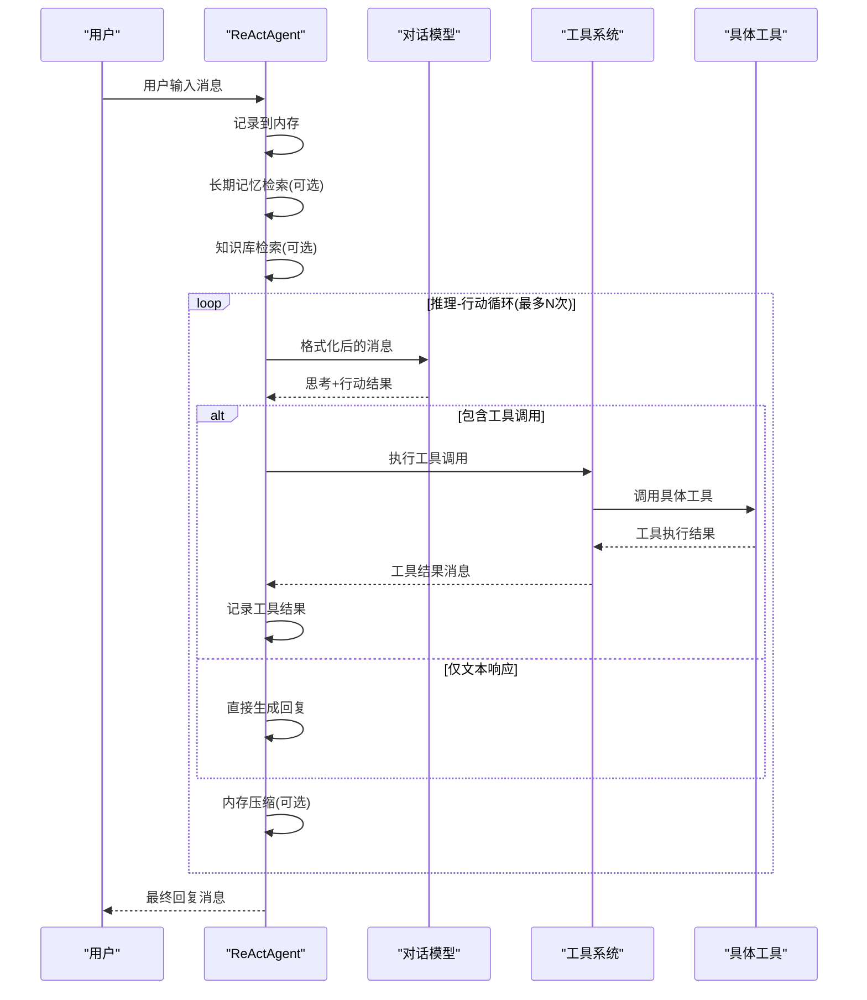
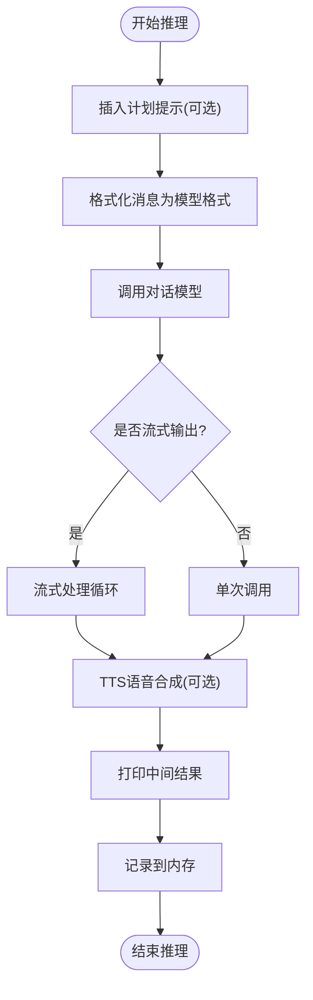
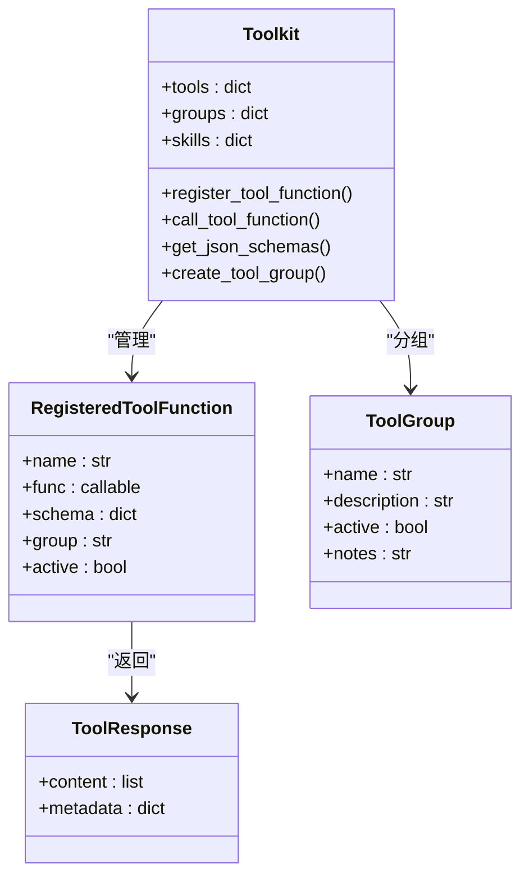
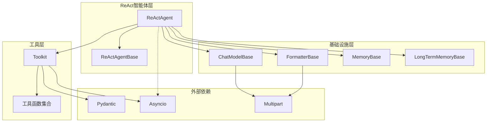

# ReAct智能体示例

<cite>
**本文档引用的文件**
- [examples/agent/react_agent/main.py](file://examples/agent/react_agent/main.py)
- [examples/agent/react_agent/README.md](file://examples/agent/react_agent/README.md)
- [src/agentscope/agent/_react_agent.py](file://src/agentscope/agent/_react_agent.py)
- [src/agentscope/agent/_react_agent_base.py](file://src/agentscope/agent/_react_agent_base.py)
- [src/agentscope/tool/_coding/_shell.py](file://src/agentscope/tool/_coding/_shell.py)
- [src/agentscope/tool/_coding/_python.py](file://src/agentscope/tool/_coding/_python.py)
- [src/agentscope/tool/_text_file/_view_text_file.py](file://src/agentscope/tool/_text_file/_view_text_file.py)
- [src/agentscope/tool/_toolkit.py](file://src/agentscope/tool/_toolkit.py)
- [src/agentscope/model/_dashscope_model.py](file://src/agentscope/model/_dashscope_model.py)
- [src/agentscope/formatter/_dashscope_formatter.py](file://src/agentscope/formatter/_dashscope_formatter.py)
- [tests/react_agent_test.py](file://tests/react_agent_test.py)
</cite>

## 目录
1. [简介](#简介)
2. [项目结构](#项目结构)
3. [核心组件](#核心组件)
4. [架构概览](#架构概览)
5. [详细组件分析](#详细组件分析)
6. [依赖关系分析](#依赖关系分析)
7. [性能考虑](#性能考虑)
8. [故障排除指南](#故障排除指南)
9. [结论](#结论)
10. [附录](#附录)

## 简介
本文件为AgentScope中ReAct智能体示例的详细功能演示文档。ReAct（Reasoning and Acting）智能体通过推理-行动循环机制实现与用户的智能交互，包含思考(Thinking)、观察(Observation)、行动(Action)三个阶段。本文将深入讲解ReAct智能体的工作原理，展示如何配置ReActAgent，演示工具函数的注册与使用，并提供完整的运行步骤和最佳实践。

## 项目结构
ReAct智能体示例位于examples/agent/react_agent目录下，核心代码组织如下：
- 示例入口：main.py - 展示ReActAgent的基本使用方法
- 示例说明：README.md - 提供快速开始和运行指导
- 核心实现：src/agentscope/agent/_react_agent.py - ReAct智能体的主要逻辑
- 基类定义：src/agentscope/agent/_react_agent_base.py - ReAct智能体的基础接口
- 工具函数：src/agentscope/tool/ 下的各类工具实现
- 配置组件：模型(DashScopeChatModel)与格式化器(DashScopeChatFormatter)

**图表来源**
- [examples/agent/react_agent/main.py:1-51](file://examples/agent/react_agent/main.py#L1-L51)
- [src/agentscope/agent/_react_agent.py:98-360](file://src/agentscope/agent/_react_agent.py#L98-L360)
- [src/agentscope/tool/_toolkit.py:117-200](file://src/agentscope/tool/_toolkit.py#L117-L200)

**章节来源**
- [examples/agent/react_agent/main.py:1-51](file://examples/agent/react_agent/main.py#L1-L51)
- [examples/agent/react_agent/README.md:1-20](file://examples/agent/react_agent/README.md#L1-L20)

## 核心组件
ReAct智能体的核心由以下关键组件构成：

### ReActAgent类
ReActAgent是AgentScope中ReAct算法的具体实现，支持：
- 实时控制与中断处理
- 并行工具调用
- 推理、行动、回复、观察等钩子函数
- 结构化输出生成

### ReActAgentBase基类
定义了ReAct算法所需的基础接口，包括抽象的reasoning和acting方法，并支持多种钩子类型：
- pre/post reasoning hooks
- pre/post acting hooks  
- pre/post print hooks
- pre/post observe hooks

### 工具系统
Toolkit提供统一的工具注册、管理和执行接口，支持：
- 工具函数注册与分组
- 中间件链式处理
- 异步生成器工具执行
- MCP客户端工具集成

**章节来源**
- [src/agentscope/agent/_react_agent.py:98-360](file://src/agentscope/agent/_react_agent.py#L98-L360)
- [src/agentscope/agent/_react_agent_base.py:12-117](file://src/agentscope/agent/_react_agent_base.py#L12-L117)
- [src/agentscope/tool/_toolkit.py:117-200](file://src/agentscope/tool/_toolkit.py#L117-L200)

## 架构概览
ReAct智能体采用模块化设计，各组件职责清晰：

**图表来源**
- [src/agentscope/agent/_react_agent.py:376-537](file://src/agentscope/agent/_react_agent.py#L376-L537)
- [src/agentscope/agent/_react_agent.py:540-655](file://src/agentscope/agent/_react_agent.py#L540-L655)
- [src/agentscope/agent/_react_agent.py:657-715](file://src/agentscope/agent/_react_agent.py#L657-L715)

## 详细组件分析

### ReAct智能体工作流详解

#### 推理阶段(_reasoning)
推理阶段负责：
1. 插入计划提示(如果启用)
2. 格式化消息为模型API所需的格式
3. 调用模型生成思考内容
4. 处理流式输出和TTS合成
5. 记录推理结果到内存

**图表来源**
- [src/agentscope/agent/_react_agent.py:540-655](file://src/agentscope/agent/_react_agent.py#L540-L655)

#### 行动阶段(_acting)
行动阶段负责：
1. 执行工具调用
2. 处理异步生成器返回的增量结果
3. 支持中断处理
4. 返回结构化输出(如果生成完成)

#### 观察阶段(observe)
观察阶段仅接收消息而不生成回复，用于记录外部输入或工具结果。

**章节来源**
- [src/agentscope/agent/_react_agent.py:540-796](file://src/agentscope/agent/_react_agent.py#L540-L796)

### 工具系统架构

**图表来源**
- [src/agentscope/tool/_toolkit.py:117-200](file://src/agentscope/tool/_toolkit.py#L117-L200)

### 工具函数实现

#### Shell命令执行工具
execute_shell_command提供安全的Shell命令执行能力：
- 支持超时控制
- 安全的进程管理
- 标准输出和错误捕获
- 统一的XML格式输出

#### Python代码执行工具
execute_python_code支持动态代码执行：
- 临时文件隔离
- UTF-8编码支持
- 超时保护机制
- 标准I/O重定向

#### 文本文件查看工具
view_text_file提供文件内容查看：
- 支持行范围选择
- 文件存在性验证
- 错误处理和异常捕获
- 格式化输出显示

**章节来源**
- [src/agentscope/tool/_coding/_shell.py:12-78](file://src/agentscope/tool/_coding/_shell.py#L12-L78)
- [src/agentscope/tool/_coding/_python.py:17-91](file://src/agentscope/tool/_coding/_python.py#L17-L91)
- [src/agentscope/tool/_text_file/_view_text_file.py:13-83](file://src/agentscope/tool/_text_file/_view_text_file.py#L13-L83)

### 配置与集成

#### ReActAgent配置参数
ReActAgent支持丰富的配置选项：
- 基础配置：name, sys_prompt, model, formatter
- 工具配置：toolkit, parallel_tool_calls
- 记忆配置：memory, long_term_memory, long_term_memory_mode
- 高级功能：knowledge, enable_rewrite_query, plan_notebook
- 性能优化：max_iters, compression_config

#### 模型与格式化器
- DashScopeChatModel：支持流式输出、思维模式、多模态
- DashScopeChatFormatter：消息格式化、媒体块处理、工具API支持

**章节来源**
- [src/agentscope/agent/_react_agent.py:177-360](file://src/agentscope/agent/_react_agent.py#L177-L360)
- [src/agentscope/model/_dashscope_model.py:51-200](file://src/agentscope/model/_dashscope_model.py#L51-L200)
- [src/agentscope/formatter/_dashscope_formatter.py:159-200](file://src/agentscope/formatter/_dashscope_formatter.py#L159-L200)

## 依赖关系分析

**图表来源**
- [src/agentscope/agent/_react_agent.py:12-31](file://src/agentscope/agent/_react_agent.py#L12-L31)
- [src/agentscope/tool/_toolkit.py:23-54](file://src/agentscope/tool/_toolkit.py#L23-L54)

**章节来源**
- [src/agentscope/agent/_react_agent.py:12-31](file://src/agentscope/agent/_react_agent.py#L12-L31)
- [src/agentscope/tool/_toolkit.py:23-54](file://src/agentscope/tool/_toolkit.py#L23-L54)

## 性能考虑
ReAct智能体在设计时充分考虑了性能优化：

### 内存管理
- 自动内存压缩：当token计数超过阈值时自动压缩历史消息
- 分段保留：保留最近的若干条消息不压缩
- 标记系统：区分提示消息、压缩消息等不同类型

### 工具执行优化
- 并行工具调用：支持多个工具同时执行
- 流式处理：工具执行结果的增量返回
- 超时控制：防止长时间阻塞操作

### 推理循环控制
- 最大迭代次数限制：避免无限循环
- 条件退出：当满足条件时提前结束

## 故障排除指南

### 常见问题与解决方案

#### 1. 环境变量配置
- 确保设置了DASHSCOPE_API_KEY
- 检查网络连接和API可用性

#### 2. 工具执行失败
- 检查工具权限和路径
- 验证输入参数的有效性
- 查看超时设置是否合理

#### 3. 内存溢出问题
- 调整compression_config参数
- 减少max_iters限制
- 检查工具输出大小

#### 4. 中断处理
- 支持Ctrl+C中断
- 智能体会生成中断提示消息
- 可自定义中断处理逻辑

**章节来源**
- [examples/agent/react_agent/README.md:9-20](file://examples/agent/react_agent/README.md#L9-L20)
- [src/agentscope/agent/_react_agent.py:799-800](file://src/agentscope/agent/_react_agent.py#L799-L800)

## 结论
ReAct智能体示例展示了AgentScope框架的强大功能和灵活性。通过模块化设计和丰富的配置选项，ReAct智能体能够：
- 实现高效的推理-行动循环
- 支持多样化的工具集成
- 提供良好的用户体验和可控性
- 具备扩展性和可维护性

该示例为开发者提供了完整的ReAct智能体实现参考，可以作为构建复杂AI应用的基础模板。

## 附录

### 运行步骤
1. 安装依赖并设置环境变量
2. 运行示例程序
3. 与智能体进行交互
4. 观察工具执行结果

### 配置建议
- 根据任务需求调整max_iters
- 合理设置工具超时时间
- 配置适当的内存压缩阈值
- 根据模型特性调整格式化器

### 扩展方向
- 添加新的工具函数
- 集成更多模型提供商
- 实现自定义记忆策略
- 开发可视化界面