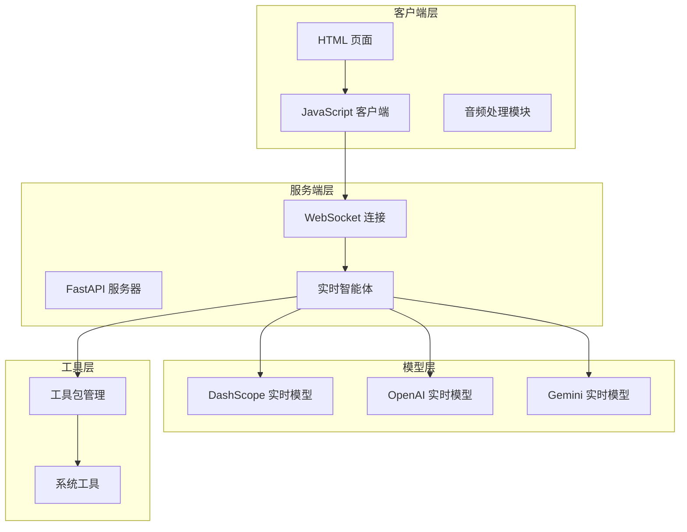
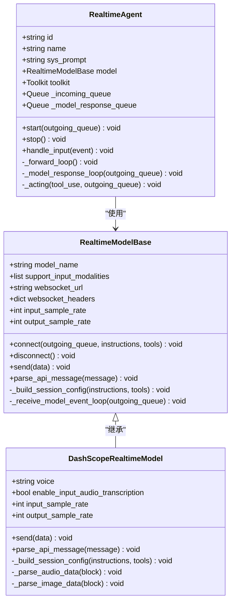
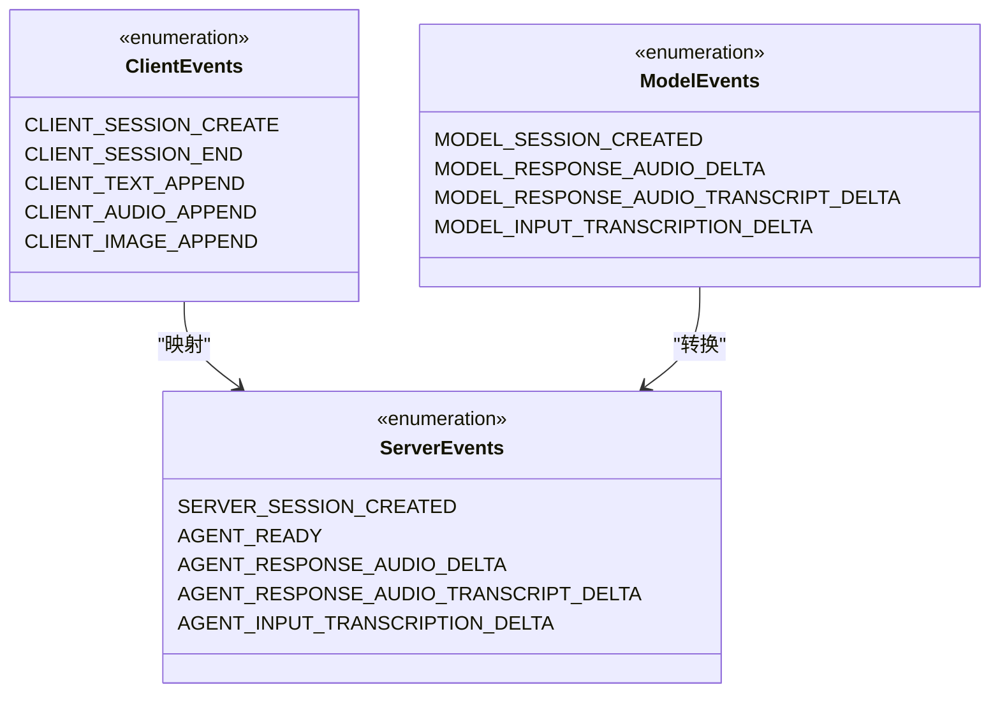
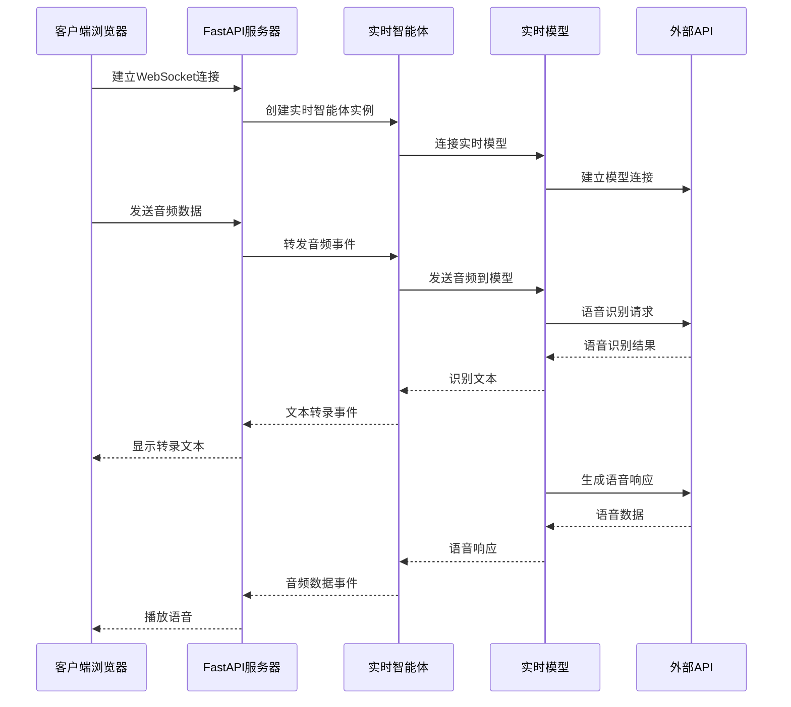
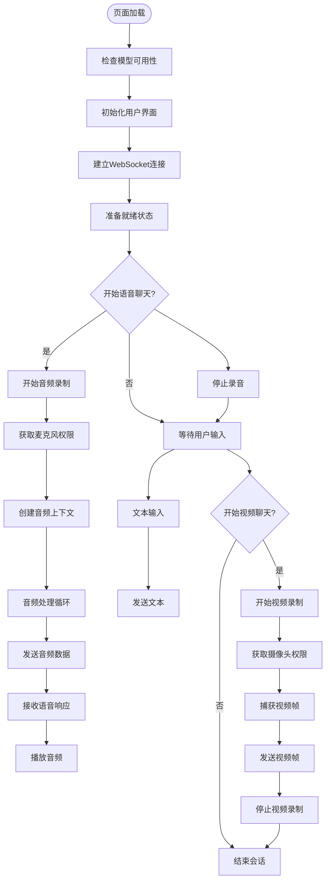
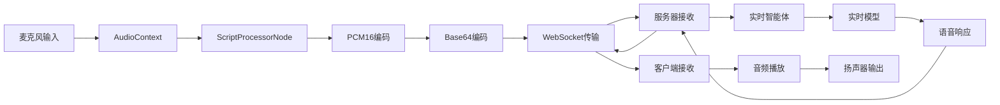
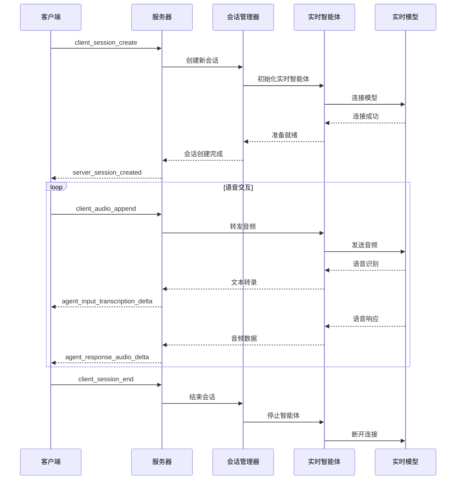
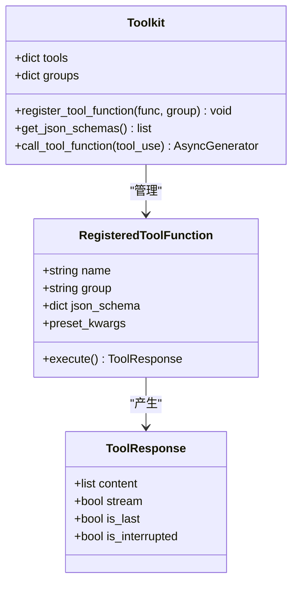
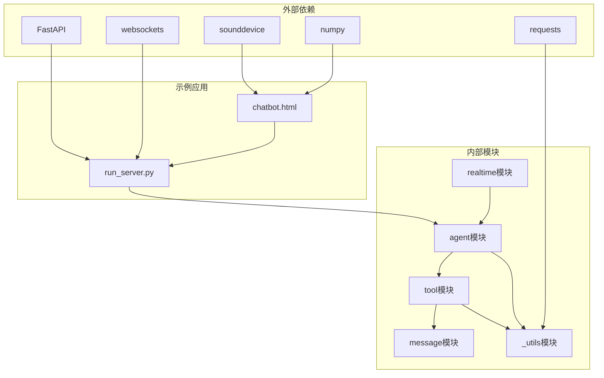

# 实时语音智能体示例

<cite>
**本文档引用的文件**
- [README.md](file://examples/agent/realtime_voice_agent/README.md)
- [run_server.py](file://examples/agent/realtime_voice_agent/run_server.py)
- [chatbot.html](file://examples/agent/realtime_voice_agent/chatbot.html)
- [_base.py](file://src/agentscope/realtime/_base.py)
- [_dashscope_realtime_model.py](file://src/agentscope/realtime/_dashscope_realtime_model.py)
- [_realtime_agent.py](file://src/agentscope/agent/_realtime_agent.py)
- [_client_event.py](file://src/agentscope/realtime/_events/_client_event.py)
- [_server_event.py](file://src/agentscope/realtime/_events/_server_event.py)
- [_toolkit.py](file://src/agentscope/tool/_toolkit.py)
- [_common.py](file://src/agentscope/_utils/_common.py)
</cite>

## 目录
1. [简介](#简介)
2. [项目结构](#项目结构)
3. [核心组件](#核心组件)
4. [架构概览](#架构概览)
5. [详细组件分析](#详细组件分析)
6. [依赖关系分析](#依赖关系分析)
7. [性能考虑](#性能考虑)
8. [故障排除指南](#故障排除指南)
9. [结论](#结论)
10. [应用场景](#应用场景)

## 简介

实时语音智能体示例展示了基于 AgentScope 构建的双向语音对话系统，支持低延迟、自然的语音交互和实时语音转写。该系统集成了完整的音频处理能力，包括音频录制、实时转录、智能体响应和语音播放，并提供了直观的 Web 界面。

该示例的核心特性包括：
- 实时语音到文本转换
- 文本到语音合成
- 双向音频流传输
- WebSocket 通信协议
- 多模型支持（DashScope、OpenAI、Gemini）
- 工具函数调用能力
- WebRTC 音频处理

## 项目结构

实时语音智能体示例采用分层架构设计，主要包含以下组件：



**图表来源**
- [run_server.py:1-188](file://examples/agent/realtime_voice_agent/run_server.py#L1-L188)
- [chatbot.html:1-800](file://examples/agent/realtime_voice_agent/chatbot.html#L1-L800)

**章节来源**
- [README.md:1-117](file://examples/agent/realtime_voice_agent/README.md#L1-L117)
- [run_server.py:1-188](file://examples/agent/realtime_voice_agent/run_server.py#L1-L188)

## 核心组件

### 实时智能体引擎

实时智能体是整个系统的核心，负责处理音频数据流和与模型进行交互。



**图表来源**
- [_realtime_agent.py:28-361](file://src/agentscope/agent/_realtime_agent.py#L28-L361)
- [_base.py:13-174](file://src/agentscope/realtime/_base.py#L13-L174)
- [_dashscope_realtime_model.py:15-405](file://src/agentscope/realtime/_dashscope_realtime_model.py#L15-L405)

### 事件通信系统

系统采用统一的事件模型来处理客户端、服务端和模型之间的通信。



**图表来源**
- [_client_event.py:12-199](file://src/agentscope/realtime/_events/_client_event.py#L12-L199)
- [_server_event.py:13-525](file://src/agentscope/realtime/_events/_server_event.py#L13-L525)

**章节来源**
- [_realtime_agent.py:28-361](file://src/agentscope/agent/_realtime_agent.py#L28-L361)
- [_client_event.py:45-199](file://src/agentscope/realtime/_events/_client_event.py#L45-L199)
- [_server_event.py:91-525](file://src/agentscope/realtime/_events/_server_event.py#L91-L525)

## 架构概览

实时语音智能体采用客户端-服务器架构，通过 WebSocket 实现实时双向通信。



**图表来源**
- [run_server.py:66-177](file://examples/agent/realtime_voice_agent/run_server.py#L66-L177)
- [_realtime_agent.py:134-306](file://src/agentscope/agent/_realtime_agent.py#L134-L306)

## 详细组件分析

### Web 界面实现

Web 界面提供了完整的用户交互体验，包括音频录制、视频录制和实时聊天功能。



**图表来源**
- [chatbot.html:559-1308](file://examples/agent/realtime_voice_agent/chatbot.html#L559-L1308)

#### 音频处理流程

音频处理是系统的核心功能之一，涉及多个阶段的数据转换和传输。



**图表来源**
- [chatbot.html:931-1115](file://examples/agent/realtime_voice_agent/chatbot.html#L931-L1115)
- [_realtime_agent.py:149-173](file://src/agentscope/agent/_realtime_agent.py#L149-L173)

**章节来源**
- [chatbot.html:559-1308](file://examples/agent/realtime_voice_agent/chatbot.html#L559-L1308)

### 服务器端实现

服务器端采用 FastAPI 和 WebSocket 提供实时通信服务。

```mermaid
classDiagram
class FastAPIApp {
+get("/") FileResponse
+get("/api/check-models") dict
+websocket("/ws/{user_id}/{session_id}") void
}
class WebSocketEndpoint {
+accept() void
+receive_json() dict
+send_json(data) void
-frontend_receive() void
-handle_client_events() void
}
class RealtimeAgentManager {
+create_agent() RealtimeAgent
+handle_session() void
+stop_agent() void
}
FastAPIApp --> WebSocketEndpoint : "路由"
WebSocketEndpoint --> RealtimeAgentManager : "管理"
```

**图表来源**
- [run_server.py:29-188](file://examples/agent/realtime_voice_agent/run_server.py#L29-L188)

#### 会话管理流程



**图表来源**
- [run_server.py:49-177](file://examples/agent/realtime_voice_agent/run_server.py#L49-L177)
- [_realtime_agent.py:102-133](file://src/agentscope/agent/_realtime_agent.py#L102-L133)

**章节来源**
- [run_server.py:1-188](file://examples/agent/realtime_voice_agent/run_server.py#L1-L188)

### 工具函数集成

系统支持工具函数调用，增强智能体的功能能力。



**图表来源**
- [_toolkit.py:117-800](file://src/agentscope/tool/_toolkit.py#L117-L800)

**章节来源**
- [_toolkit.py:117-800](file://src/agentscope/tool/_toolkit.py#L117-L800)

## 依赖关系分析

系统采用模块化设计，各组件之间具有清晰的职责分离和依赖关系。



**图表来源**
- [run_server.py:8-27](file://examples/agent/realtime_voice_agent/run_server.py#L8-L27)
- [chatbot.html:559-576](file://examples/agent/realtime_voice_agent/chatbot.html#L559-L576)

**章节来源**
- [run_server.py:1-188](file://examples/agent/realtime_voice_agent/run_server.py#L1-L188)
- [chatbot.html:559-576](file://examples/agent/realtime_voice_agent/chatbot.html#L559-L576)

## 性能考虑

### 音频处理优化

系统在音频处理方面采用了多项优化策略：

1. **采样率适配**：根据不同的实时模型自动调整音频采样率
2. **缓冲区管理**：使用适当的缓冲区大小平衡延迟和稳定性
3. **音频格式转换**：高效的 PCM16 编码和 Base64 编码
4. **并发处理**：异步音频处理避免阻塞主线程

### 网络通信优化

1. **WebSocket 连接池**：复用连接减少握手开销
2. **事件压缩**：合并相似事件减少网络传输
3. **流量控制**：根据网络状况动态调整音频质量
4. **错误重试**：自动重连机制保证连接稳定性

### 内存管理

1. **音频队列限制**：防止内存溢出的队列长度控制
2. **资源清理**：及时释放音频设备和 WebSocket 连接
3. **垃圾回收**：定期清理未使用的对象引用

## 故障排除指南

### 常见问题及解决方案

#### WebSocket 连接失败
- **症状**：无法连接到服务器
- **原因**：网络问题或服务器未启动
- **解决**：检查服务器状态和网络连接

#### 音频权限被拒绝
- **症状**：麦克风无法访问
- **原因**：浏览器权限设置或安全策略
- **解决**：检查浏览器权限设置和 HTTPS 环境

#### 音频播放异常
- **症状**：音频播放卡顿或无声
- **原因**：浏览器音频上下文状态或设备冲突
- **解决**：重启音频上下文或更换音频设备

#### 模型连接失败
- **症状**：实时模型无法连接
- **原因**：API 密钥配置错误或网络问题
- **解决**：验证 API 密钥和网络连接

**章节来源**
- [README.md:5-117](file://examples/agent/realtime_voice_agent/README.md#L5-L117)

## 结论

实时语音智能体示例展示了现代 AI 应用的完整技术栈，从底层的音频处理到高层的智能对话，都体现了良好的架构设计和工程实践。该系统的主要优势包括：

1. **技术完整性**：涵盖了从音频采集到智能响应的完整链路
2. **架构清晰**：模块化设计便于维护和扩展
3. **用户体验**：低延迟的实时交互体验
4. **可扩展性**：支持多种实时模型和工具函数

该示例为构建更复杂的实时语音应用提供了坚实的基础，可以作为企业级语音助手、客服系统和远程协作工具的参考实现。

## 应用场景

### 客服系统
- **智能语音客服**：24/7 自动回复客户咨询
- **语音质检**：实时监控通话质量和合规性
- **情感分析**：分析客户情绪状态提供个性化服务

### 语音助手
- **智能家居控制**：语音控制家电设备
- **信息查询**：快速获取天气、新闻等信息
- **日程管理**：语音添加和管理日程安排

### 远程协作
- **虚拟会议**：实时语音翻译和字幕生成
- **远程教学**：语音互动和实时反馈
- **技术支持**：远程故障诊断和指导

### 医疗健康
- **健康监测**：语音记录和分析健康数据
- **康复训练**：语音指导运动康复练习
- **老年关怀**：语音陪伴和紧急呼叫

这些应用场景都充分利用了实时语音智能体的低延迟、高可靠性和自然交互特性，为用户提供更加便捷和智能的服务体验。