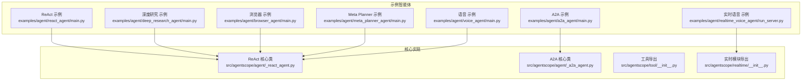
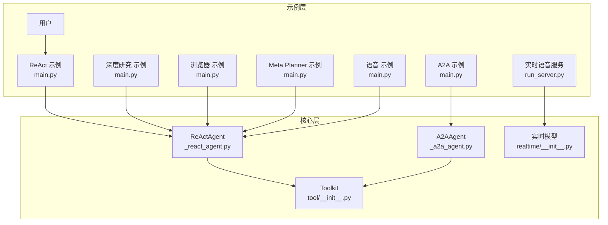
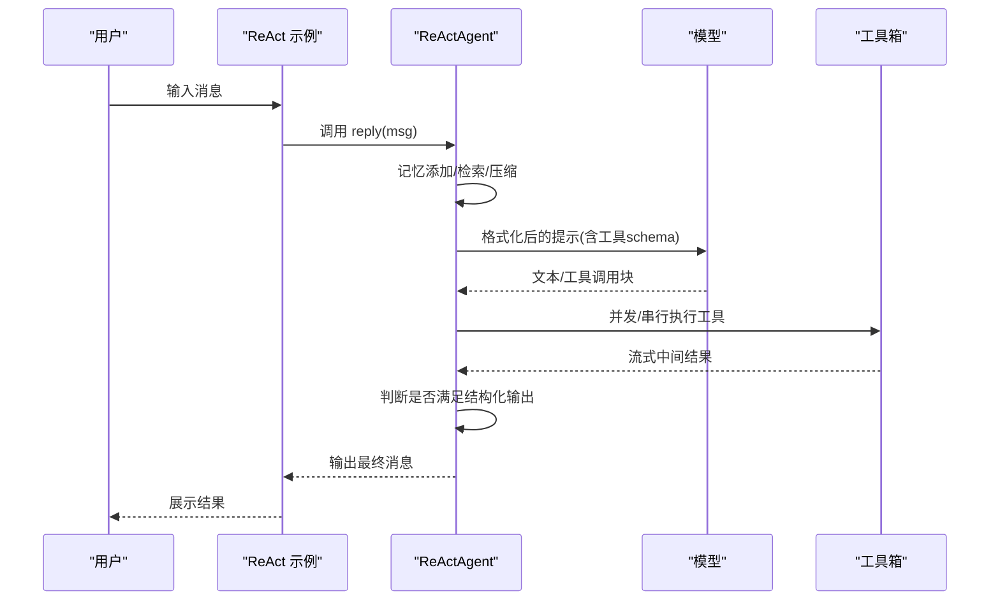
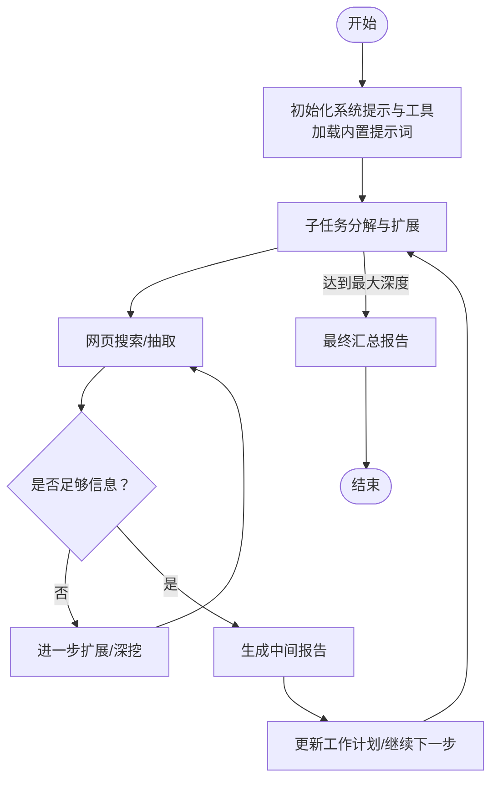
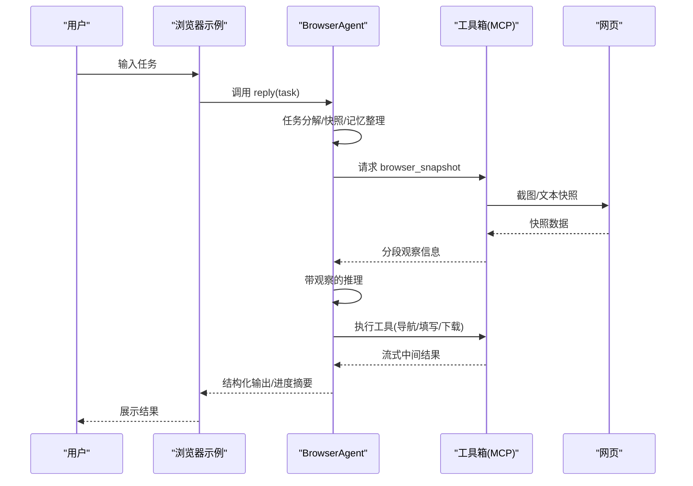
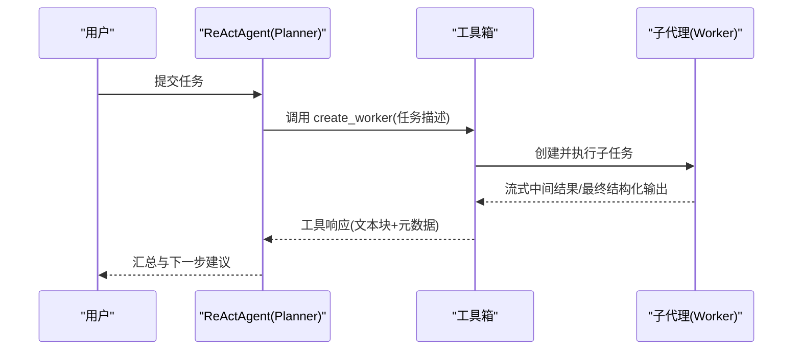
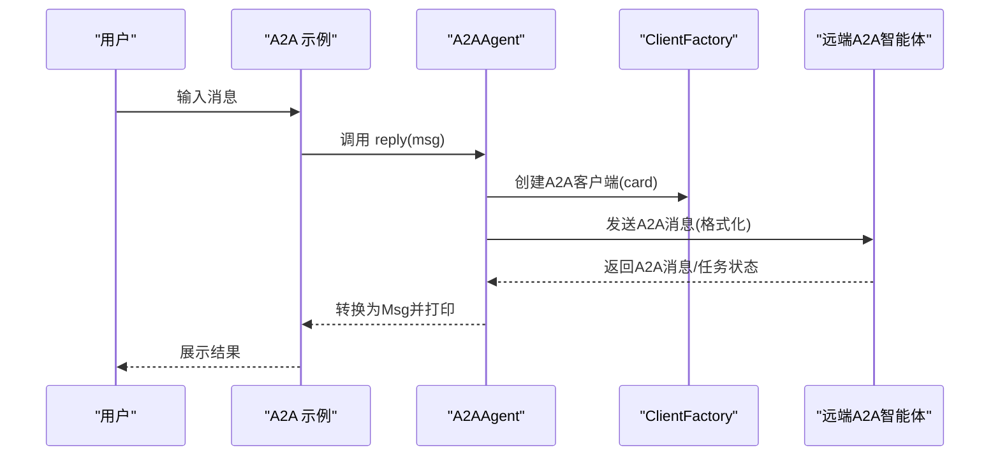
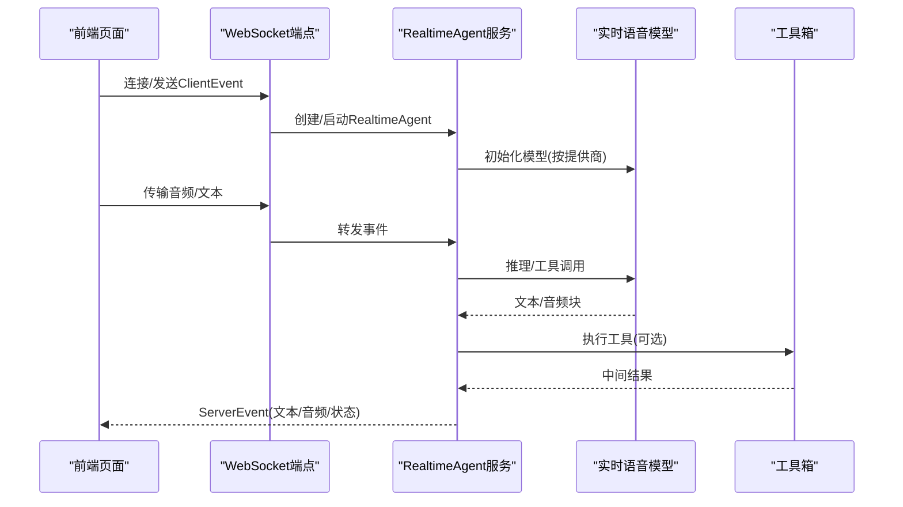
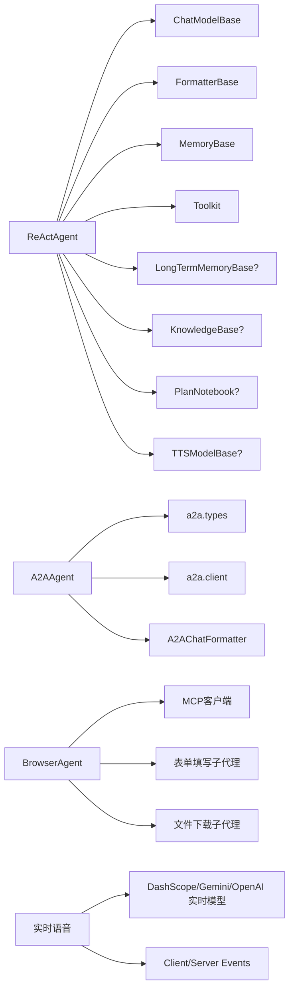

# 智能体示例

<cite>
**本文引用的文件**
- [examples/agent/react_agent/main.py](file://examples/agent/react_agent/main.py)
- [examples/agent/deep_research_agent/main.py](file://examples/agent/deep_research_agent/main.py)
- [examples/agent/deep_research_agent/deep_research_agent.py](file://examples/agent/deep_research_agent/deep_research_agent.py)
- [examples/agent/deep_research_agent/utils.py](file://examples/agent/deep_research_agent/utils.py)
- [examples/agent/browser_agent/main.py](file://examples/agent/browser_agent/main.py)
- [examples/agent/browser_agent/browser_agent.py](file://examples/agent/browser_agent/browser_agent.py)
- [examples/agent/browser_agent/build_in_helper/_form_filling.py](file://examples/agent/browser_agent/build_in_helper/_form_filling.py)
- [examples/agent/browser_agent/build_in_helper/_file_download.py](file://examples/agent/browser_agent/build_in_helper/_file_download.py)
- [examples/agent/meta_planner_agent/main.py](file://examples/agent/meta_planner_agent/main.py)
- [examples/agent/meta_planner_agent/tool.py](file://examples/agent/meta_planner_agent/tool.py)
- [examples/agent/a2a_agent/main.py](file://examples/agent/a2a_agent/main.py)
- [examples/agent/a2a_agent/agent_card.py](file://examples/agent/a2a_agent/agent_card.py)
- [examples/agent/realtime_voice_agent/run_server.py](file://examples/agent/realtime_voice_agent/run_server.py)
- [examples/agent/voice_agent/main.py](file://examples/agent/voice_agent/main.py)
- [src/agentscope/agent/_react_agent.py](file://src/agentscope/agent/_react_agent.py)
- [src/agentscope/agent/_a2a_agent.py](file://src/agentscope/agent/_a2a_agent.py)
- [src/agentscope/tool/__init__.py](file://src/agentscope/tool/__init__.py)
- [src/agentscope/realtime/__init__.py](file://src/agentscope/realtime/__init__.py)
</cite>

## 目录
1. [简介](#简介)
2. [项目结构](#项目结构)
3. [核心组件](#核心组件)
4. [架构总览](#架构总览)
5. [详细组件分析](#详细组件分析)
6. [依赖分析](#依赖分析)
7. [性能考虑](#性能考虑)
8. [故障排查指南](#故障排查指南)
9. [结论](#结论)
10. [附录](#附录)

## 简介
本文件面向AgentScope智能体示例，系统性讲解以下智能体的实现原理与使用方法：
- ReAct智能体：推理-行动循环的工作机制与多轮交互
- 深度研究智能体：多轮对话与信息检索能力
- 浏览器使用智能体：网页浏览、表单填写、文件下载等
- Meta Planner智能体：任务规划与子代理编排
- A2A智能体：Agent-to-Agent通信协议与双向消息转换
- 实时语音智能体与语音智能体：音频处理与实时对话

每个智能体均提供完整实现路径、配置说明、运行示例与应用场景分析。

## 项目结构
本节聚焦与示例智能体直接相关的目录与文件组织方式，帮助快速定位实现与运行入口。

图示来源
- [examples/agent/react_agent/main.py:1-51](file://examples/agent/react_agent/main.py#L1-L51)
- [examples/agent/deep_research_agent/main.py:1-84](file://examples/agent/deep_research_agent/main.py#L1-L84)
- [examples/agent/browser_agent/main.py:1-137](file://examples/agent/browser_agent/main.py#L1-L137)
- [examples/agent/meta_planner_agent/main.py:1-60](file://examples/agent/meta_planner_agent/main.py#L1-L60)
- [examples/agent/a2a_agent/main.py:1-28](file://examples/agent/a2a_agent/main.py#L1-L28)
- [examples/agent/realtime_voice_agent/run_server.py:1-188](file://examples/agent/realtime_voice_agent/run_server.py#L1-L188)
- [examples/agent/voice_agent/main.py:1-51](file://examples/agent/voice_agent/main.py#L1-L51)
- [src/agentscope/agent/_react_agent.py:1-800](file://src/agentscope/agent/_react_agent.py#L1-L800)
- [src/agentscope/agent/_a2a_agent.py:1-289](file://src/agentscope/agent/_a2a_agent.py#L1-L289)
- [src/agentscope/tool/__init__.py:1-45](file://src/agentscope/tool/__init__.py#L1-L45)
- [src/agentscope/realtime/__init__.py:1-29](file://src/agentscope/realtime/__init__.py#L1-L29)

章节来源
- [examples/agent/react_agent/main.py:1-51](file://examples/agent/react_agent/main.py#L1-L51)
- [examples/agent/deep_research_agent/main.py:1-84](file://examples/agent/deep_research_agent/main.py#L1-L84)
- [examples/agent/browser_agent/main.py:1-137](file://examples/agent/browser_agent/main.py#L1-L137)
- [examples/agent/meta_planner_agent/main.py:1-60](file://examples/agent/meta_planner_agent/main.py#L1-L60)
- [examples/agent/a2a_agent/main.py:1-28](file://examples/agent/a2a_agent/main.py#L1-L28)
- [examples/agent/realtime_voice_agent/run_server.py:1-188](file://examples/agent/realtime_voice_agent/run_server.py#L1-L188)
- [examples/agent/voice_agent/main.py:1-51](file://examples/agent/voice_agent/main.py#L1-L51)
- [src/agentscope/agent/_react_agent.py:1-800](file://src/agentscope/agent/_react_agent.py#L1-L800)
- [src/agentscope/agent/_a2a_agent.py:1-289](file://src/agentscope/agent/_a2a_agent.py#L1-L289)
- [src/agentscope/tool/__init__.py:1-45](file://src/agentscope/tool/__init__.py#L1-L45)
- [src/agentscope/realtime/__init__.py:1-29](file://src/agentscope/realtime/__init__.py#L1-L29)

## 核心组件
- ReAct智能体：基于推理-行动循环的通用智能体框架，支持工具并行调用、结构化输出、长短期记忆、计划工具组与RAG检索等。
- A2A智能体：遵循Agent-to-Agent协议，实现与远端智能体的双向消息格式转换、任务生命周期管理与产物追踪。
- 工具体系：统一的工具注册与调用接口，支持代码执行、文件读写、多模态能力等。
- 实时模块：提供DashScope、OpenAI、Gemini等厂商的实时语音模型与事件类型。

章节来源
- [src/agentscope/agent/_react_agent.py:98-537](file://src/agentscope/agent/_react_agent.py#L98-L537)
- [src/agentscope/agent/_a2a_agent.py:29-289](file://src/agentscope/agent/_a2a_agent.py#L29-L289)
- [src/agentscope/tool/__init__.py:1-45](file://src/agentscope/tool/__init__.py#L1-L45)
- [src/agentscope/realtime/__init__.py:1-29](file://src/agentscope/realtime/__init__.py#L1-L29)

## 架构总览
下图展示了各智能体示例与其核心实现的关系，以及典型运行流程（以ReAct为例）。

图示来源
- [examples/agent/react_agent/main.py:18-50](file://examples/agent/react_agent/main.py#L18-L50)
- [examples/agent/deep_research_agent/main.py:39-66](file://examples/agent/deep_research_agent/main.py#L39-L66)
- [examples/agent/browser_agent/main.py:45-79](file://examples/agent/browser_agent/main.py#L45-L79)
- [examples/agent/meta_planner_agent/main.py:27-57](file://examples/agent/meta_planner_agent/main.py#L27-L57)
- [examples/agent/a2a_agent/main.py:10-25](file://examples/agent/a2a_agent/main.py#L10-L25)
- [examples/agent/realtime_voice_agent/run_server.py:66-177](file://examples/agent/realtime_voice_agent/run_server.py#L66-L177)
- [examples/agent/voice_agent/main.py:15-48](file://examples/agent/voice_agent/main.py#L15-L48)
- [src/agentscope/agent/_react_agent.py:376-537](file://src/agentscope/agent/_react_agent.py#L376-L537)
- [src/agentscope/agent/_a2a_agent.py:177-260](file://src/agentscope/agent/_a2a_agent.py#L177-L260)
- [src/agentscope/tool/__init__.py:25-44](file://src/agentscope/tool/__init__.py#L25-L44)
- [src/agentscope/realtime/__init__.py:13-27](file://src/agentscope/realtime/__init__.py#L13-L27)

## 详细组件分析

### ReAct智能体：推理-行动循环详解
- 工作机制
  - 推理阶段：将系统提示、历史消息与可选计划提示打包，调用模型生成文本或工具调用块。
  - 行动阶段：并发/串行执行工具调用，流式打印中间结果；当需要结构化输出时，通过“生成响应”工具完成。
  - 退出条件：达到最大迭代次数或满足结构化输出要求。
- 关键特性
  - 并行工具调用、内存压缩、长短期记忆、知识库检索、计划工具组、TTS集成。
- 典型使用
  - 注册工具函数（如代码执行、文件读写），构建模型与格式化器，创建ReActAgent并进入对话循环。

图示来源
- [examples/agent/react_agent/main.py:18-50](file://examples/agent/react_agent/main.py#L18-L50)
- [src/agentscope/agent/_react_agent.py:376-537](file://src/agentscope/agent/_react_agent.py#L376-L537)

章节来源
- [examples/agent/react_agent/main.py:18-50](file://examples/agent/react_agent/main.py#L18-L50)
- [src/agentscope/agent/_react_agent.py:376-537](file://src/agentscope/agent/_react_agent.py#L376-L537)

### 深度研究智能体：多轮对话与信息检索
- 能力概述
  - 子任务分解与扩展、网页搜索与抽取、中间报告生成、失败反思与继续探索。
  - 通过MCP客户端接入外部工具（如Tavily搜索），并进行结果截断与结构化输出。
- 运行流程
  - 初始化系统提示与工具，接收用户查询，分解子任务，逐步检索与抽取，按需生成中间报告，最终汇总形成报告。
- 关键点
  - 使用工具注册与动态JSON Schema生成，支持结构化输出。
  - 提供工具调用流式打印与中断处理，便于调试与可观测性。

图示来源
- [examples/agent/deep_research_agent/deep_research_agent.py:220-312](file://examples/agent/deep_research_agent/deep_research_agent.py#L220-L312)
- [examples/agent/deep_research_agent/deep_research_agent.py:614-760](file://examples/agent/deep_research_agent/deep_research_agent.py#L614-L760)
- [examples/agent/deep_research_agent/utils.py:164-330](file://examples/agent/deep_research_agent/utils.py#L164-L330)

章节来源
- [examples/agent/deep_research_agent/main.py:39-66](file://examples/agent/deep_research_agent/main.py#L39-L66)
- [examples/agent/deep_research_agent/deep_research_agent.py:62-192](file://examples/agent/deep_research_agent/deep_research_agent.py#L62-L192)
- [examples/agent/deep_research_agent/utils.py:164-330](file://examples/agent/deep_research_agent/utils.py#L164-L330)

### 浏览器使用智能体：网页浏览、表单填写、文件下载
- 能力概述
  - 基于Playwright MCP的浏览器自动化：导航、截图、快照、表单填写、文件下载等。
  - 支持多模态（图片/视频理解）与结构化输出，具备任务分解与进度汇报能力。
- 运行流程
  - 初始化工具箱并注册MCP浏览器客户端，启动用户-智能体对话循环；在每轮中进行纯推理或带观察的推理，执行工具调用并更新记忆。
- 关键点
  - 任务分解与反思：将复杂任务拆分为子任务，并根据页面快照分段推理。
  - 辅助子代理：表单填写与文件下载分别由轻量子代理完成，统一结构化输出。

图示来源
- [examples/agent/browser_agent/main.py:27-79](file://examples/agent/browser_agent/main.py#L27-L79)
- [examples/agent/browser_agent/browser_agent.py:165-281](file://examples/agent/browser_agent/browser_agent.py#L165-L281)
- [examples/agent/browser_agent/browser_agent.py:473-514](file://examples/agent/browser_agent/browser_agent.py#L473-L514)

章节来源
- [examples/agent/browser_agent/main.py:27-79](file://examples/agent/browser_agent/main.py#L27-L79)
- [examples/agent/browser_agent/browser_agent.py:90-156](file://examples/agent/browser_agent/browser_agent.py#L90-L156)
- [examples/agent/browser_agent/browser_agent.py:165-281](file://examples/agent/browser_agent/browser_agent.py#L165-L281)
- [examples/agent/browser_agent/browser_agent.py:473-514](file://examples/agent/browser_agent/browser_agent.py#L473-L514)
- [examples/agent/browser_agent/build_in_helper/_form_filling.py:141-221](file://examples/agent/browser_agent/build_in_helper/_form_filling.py#L141-L221)
- [examples/agent/browser_agent/build_in_helper/_file_download.py:160-238](file://examples/agent/browser_agent/build_in_helper/_file_download.py#L160-L238)

### Meta Planner智能体：任务规划与子代理编排
- 能力概述
  - 将复杂任务分解为子任务，动态创建子代理（Worker）执行具体工作，协调执行顺序与状态。
  - 通过工具函数创建子代理并封装为可流式输出的工具，支持中断与结构化结果。
- 运行流程
  - 用户输入目标，Planner基于系统提示与计划工具组生成工作计划；调用create_worker工具创建子代理，子代理完成任务后返回结构化结果。

图示来源
- [examples/agent/meta_planner_agent/main.py:15-57](file://examples/agent/meta_planner_agent/main.py#L15-L57)
- [examples/agent/meta_planner_agent/tool.py:61-221](file://examples/agent/meta_planner_agent/tool.py#L61-L221)

章节来源
- [examples/agent/meta_planner_agent/main.py:15-57](file://examples/agent/meta_planner_agent/main.py#L15-L57)
- [examples/agent/meta_planner_agent/tool.py:61-221](file://examples/agent/meta_planner_agent/tool.py#L61-L221)

### A2A智能体：Agent-to-Agent通信协议
- 协议要点
  - 使用A2A标准协议与远端智能体通信，支持消息格式双向转换、任务生命周期管理、产物追踪与状态更新。
  - 不支持结构化输出（协议限制），但支持观察消息合并与中断处理。
- 运行流程
  - 通过AgentCard描述远端能力，创建A2A客户端，将消息转换为A2A消息发送，接收并转换回AgentScope消息。

图示来源
- [examples/agent/a2a_agent/main.py:10-25](file://examples/agent/a2a_agent/main.py#L10-L25)
- [examples/agent/a2a_agent/agent_card.py:5-37](file://examples/agent/a2a_agent/agent_card.py#L5-L37)
- [src/agentscope/agent/_a2a_agent.py:177-260](file://src/agentscope/agent/_a2a_agent.py#L177-L260)

章节来源
- [examples/agent/a2a_agent/main.py:10-25](file://examples/agent/a2a_agent/main.py#L10-L25)
- [examples/agent/a2a_agent/agent_card.py:5-37](file://examples/agent/a2a_agent/agent_card.py#L5-L37)
- [src/agentscope/agent/_a2a_agent.py:29-289](file://src/agentscope/agent/_a2a_agent.py#L29-L289)

### 实时语音智能体与语音智能体：音频处理
- 实时语音智能体
  - 提供WebSocket服务端，接收前端事件，根据模型提供商选择实时语音模型（DashScope/Gemini/OpenAI），支持工具调用与流式音频合成。
- 语音智能体
  - 在普通ReAct智能体基础上启用音频输出（如多模态文本-音频），适合需要语音反馈的场景。

图示来源
- [examples/agent/realtime_voice_agent/run_server.py:66-177](file://examples/agent/realtime_voice_agent/run_server.py#L66-L177)
- [src/agentscope/realtime/__init__.py:13-27](file://src/agentscope/realtime/__init__.py#L13-L27)

章节来源
- [examples/agent/realtime_voice_agent/run_server.py:1-188](file://examples/agent/realtime_voice_agent/run_server.py#L1-L188)
- [examples/agent/voice_agent/main.py:15-48](file://examples/agent/voice_agent/main.py#L15-L48)
- [src/agentscope/realtime/__init__.py:1-29](file://src/agentscope/realtime/__init__.py#L1-L29)

## 依赖分析
- ReAct智能体依赖
  - 模型与格式化器：ChatModelBase、FormatterBase
  - 内存与工具：MemoryBase、Toolkit
  - 可选：长短期记忆、知识库、计划笔记本、TTS模型
- A2A智能体依赖
  - a2a.types、a2a.client：AgentCard、ClientConfig、ClientFactory
  - 消息格式转换：A2AChatFormatter
- 浏览器智能体依赖
  - MCP客户端（Playwright）、图像/视频理解、文件下载、表单填写辅助子代理
- 实时语音智能体依赖
  - DashScope/Gemini/OpenAI实时模型、事件类型、工具调用

图示来源
- [src/agentscope/agent/_react_agent.py:177-354](file://src/agentscope/agent/_react_agent.py#L177-L354)
- [src/agentscope/agent/_a2a_agent.py:48-112](file://src/agentscope/agent/_a2a_agent.py#L48-L112)
- [examples/agent/browser_agent/browser_agent.py:90-156](file://examples/agent/browser_agent/browser_agent.py#L90-L156)
- [examples/agent/realtime_voice_agent/run_server.py:14-27](file://examples/agent/realtime_voice_agent/run_server.py#L14-L27)

章节来源
- [src/agentscope/agent/_react_agent.py:177-354](file://src/agentscope/agent/_react_agent.py#L177-L354)
- [src/agentscope/agent/_a2a_agent.py:48-112](file://src/agentscope/agent/_a2a_agent.py#L48-L112)
- [examples/agent/browser_agent/browser_agent.py:90-156](file://examples/agent/browser_agent/browser_agent.py#L90-L156)
- [examples/agent/realtime_voice_agent/run_server.py:14-27](file://examples/agent/realtime_voice_agent/run_server.py#L14-L27)

## 性能考虑
- 推理-行动循环
  - 合理设置最大迭代次数，避免无限循环；对长上下文采用内存压缩策略。
- 工具调用
  - 并行工具调用可提升吞吐，但需关注资源竞争与超时；对耗时工具建议流式输出与中断处理。
- 浏览器自动化
  - 控制截图与快照频率，避免上下文过大；分段观察与任务分解有助于降低单次推理负担。
- 实时语音
  - 选择合适的模型提供商与音频参数，平衡延迟与质量；注意网络稳定性与事件队列容量。

## 故障排查指南
- 深度研究智能体
  - 搜索结果过多导致上下文溢出：使用工具结果截断与中间报告生成。
  - 工具调用异常：检查MCP客户端连接状态与权限配置。
- 浏览器智能体
  - 页面快照失败：确认MCP浏览器客户端可用性与URL合法性；必要时减少截图频率。
  - 工具流中断：捕获取消异常并记录工具调用结果。
- A2A智能体
  - 结构化输出不支持：遵循协议限制，改用文本摘要或状态更新。
  - 远端无响应：检查AgentCard配置与网络连通性。
- 实时语音
  - WebSocket连接失败：检查端口占用与CORS配置；验证模型API Key。
  - 音频合成异常：确认TTS模型支持与音频参数正确。

章节来源
- [examples/agent/deep_research_agent/deep_research_agent.py:314-457](file://examples/agent/deep_research_agent/deep_research_agent.py#L314-L457)
- [examples/agent/browser_agent/browser_agent.py:473-514](file://examples/agent/browser_agent/browser_agent.py#L473-L514)
- [src/agentscope/agent/_a2a_agent.py:206-211](file://src/agentscope/agent/_a2a_agent.py#L206-L211)
- [examples/agent/realtime_voice_agent/run_server.py:174-177](file://examples/agent/realtime_voice_agent/run_server.py#L174-L177)

## 结论
本文件系统梳理了AgentScope中多个智能体示例的实现与使用方法，重点阐述了ReAct推理-行动循环、深度研究的信息检索与报告生成、浏览器自动化的能力边界、Meta Planner的任务编排、A2A协议的通信规范，以及实时语音与语音智能体的音频处理路径。通过合理配置工具、模型与格式化器，结合示例中的运行脚本，可在不同场景中快速落地Agent应用。

## 附录
- 运行示例与配置要点
  - ReAct示例：准备DashScope API Key，注册常用工具（代码执行、文件读写），启动主程序进入对话循环。
  - 深度研究示例：准备Tavily API Key，设置工作目录，启动主程序并传入用户查询。
  - 浏览器示例：安装Playwright MCP，设置起始URL与最大迭代次数，启动主程序。
  - Meta Planner示例：准备高德/GitHub等MCP客户端（可选），启动主程序并与Planner交互。
  - A2A示例：准备AgentCard与远端智能体地址，启动主程序进行双向消息交互。
  - 实时语音示例：准备对应模型API Key，启动服务端并通过前端页面进行测试。
  - 语音示例：启用多模态文本-音频输出，配置声音与格式参数，启动主程序。

章节来源
- [examples/agent/react_agent/main.py:26-38](file://examples/agent/react_agent/main.py#L26-L38)
- [examples/agent/deep_research_agent/main.py:20-53](file://examples/agent/deep_research_agent/main.py#L20-L53)
- [examples/agent/browser_agent/main.py:34-57](file://examples/agent/browser_agent/main.py#L34-L57)
- [examples/agent/meta_planner_agent/main.py:24-48](file://examples/agent/meta_planner_agent/main.py#L24-L48)
- [examples/agent/a2a_agent/agent_card.py:5-37](file://examples/agent/a2a_agent/agent_card.py#L5-L37)
- [examples/agent/realtime_voice_agent/run_server.py:180-187](file://examples/agent/realtime_voice_agent/run_server.py#L180-L187)
- [examples/agent/voice_agent/main.py:18-38](file://examples/agent/voice_agent/main.py#L18-L38)