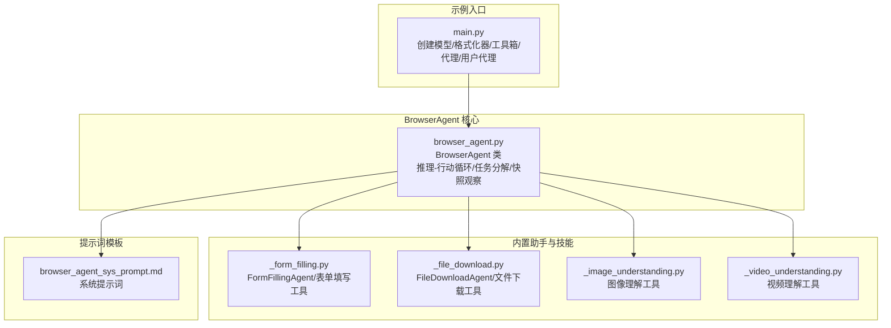
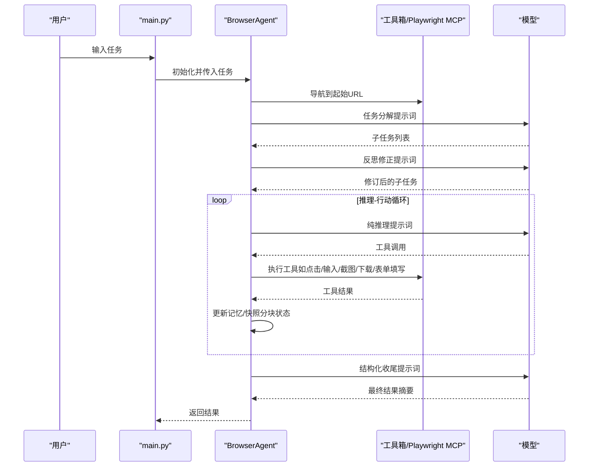
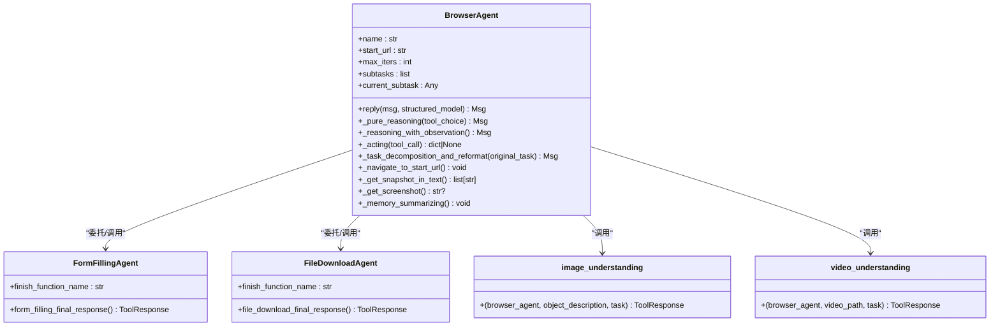
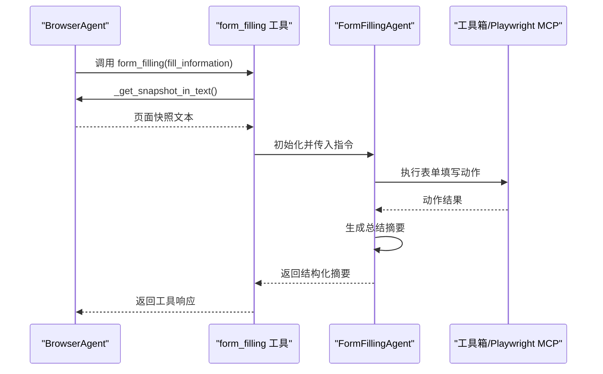
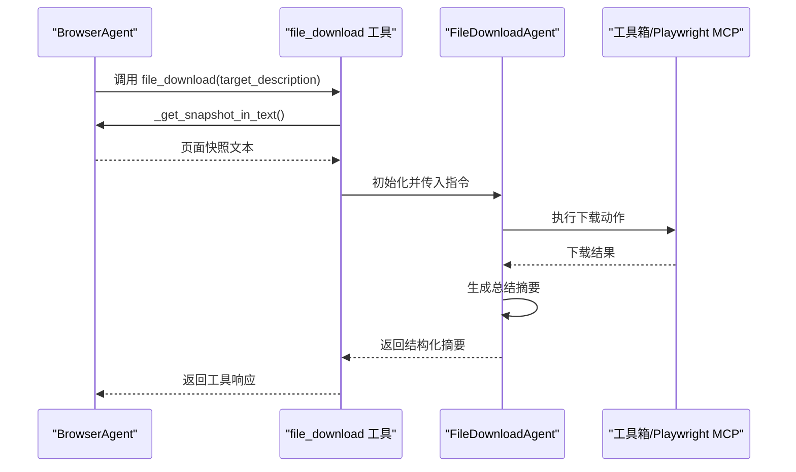
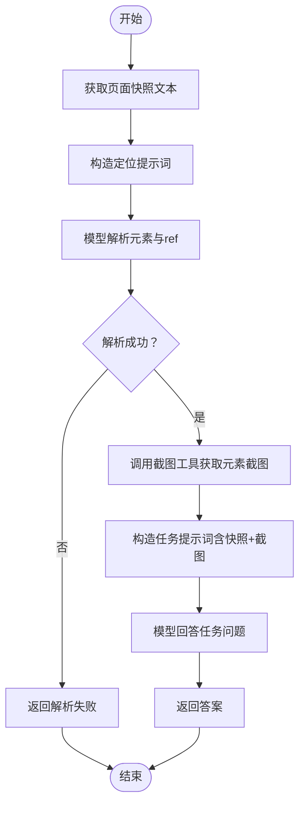
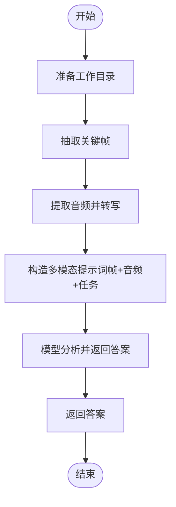
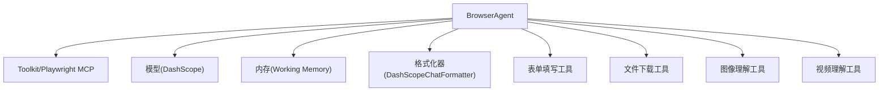

# 浏览器使用智能体示例

<cite>
**本文引用的文件**
- [README.md](file://examples/agent/browser_agent/README.md)
- [main.py](file://examples/agent/browser_agent/main.py)
- [browser_agent.py](file://examples/agent/browser_agent/browser_agent.py)
- [build_in_helper/_file_download.py](file://examples/agent/browser_agent/build_in_helper/_file_download.py)
- [build_in_helper/_form_filling.py](file://examples/agent/browser_agent/build_in_helper/_form_filling.py)
- [build_in_helper/_image_understanding.py](file://examples/agent/browser_agent/build_in_helper/_image_understanding.py)
- [build_in_helper/_video_understanding.py](file://examples/agent/browser_agent/build_in_helper/_video_understanding.py)
- [build_in_prompt/browser_agent_sys_prompt.md](file://examples/agent/browser_agent/build_in_prompt/browser_agent_sys_prompt.md)
</cite>

## 目录
1. [简介](#简介)
2. [项目结构](#项目结构)
3. [核心组件](#核心组件)
4. [架构总览](#架构总览)
5. [详细组件分析](#详细组件分析)
6. [依赖关系分析](#依赖关系分析)
7. [性能考虑](#性能考虑)
8. [故障排查指南](#故障排查指南)
9. [结论](#结论)
10. [附录](#附录)

## 简介
本示例展示了如何使用 AgentScope 的 BrowserAgent 完成网页自动化任务。BrowserAgent 通过 Model Context Protocol（MCP）连接由 Playwright 驱动的浏览器工具，实现网页导航、内容解析、表单填写、文件下载以及图像/视频理解等能力。示例提供了完整的启动流程、提示词模板设计思路、子任务分解与反思修正机制，并覆盖自动化测试、数据采集、在线服务使用等典型应用场景。

## 项目结构
BrowserAgent 示例位于 examples/agent/browser_agent 目录，主要包含：
- 入口脚本：main.py
- 核心智能体：browser_agent.py
- 内置助手与技能：
  - 表单填写：build_in_helper/_form_filling.py
  - 文件下载：build_in_helper/_file_download.py
  - 图像理解：build_in_helper/_image_understanding.py
  - 视频理解：build_in_helper/_video_understanding.py
- 提示词模板：build_in_prompt/*.md

**图表来源**
- [main.py:1-137](file://examples/agent/browser_agent/main.py#L1-L137)
- [browser_agent.py:90-164](file://examples/agent/browser_agent/browser_agent.py#L90-L164)
- [build_in_helper/_form_filling.py:38-61](file://examples/agent/browser_agent/build_in_helper/_form_filling.py#L38-L61)
- [build_in_helper/_file_download.py:40-77](file://examples/agent/browser_agent/build_in_helper/_file_download.py#L40-L77)
- [build_in_helper/_image_understanding.py:23-49](file://examples/agent/browser_agent/build_in_helper/_image_understanding.py#L23-L49)
- [build_in_helper/_video_understanding.py:27-44](file://examples/agent/browser_agent/build_in_helper/_video_understanding.py#L27-L44)
- [build_in_prompt/browser_agent_sys_prompt.md:1-58](file://examples/agent/browser_agent/build_in_prompt/browser_agent_sys_prompt.md#L1-L58)

**章节来源**
- [README.md:1-51](file://examples/agent/browser_agent/README.md#L1-L51)
- [main.py:1-137](file://examples/agent/browser_agent/main.py#L1-L137)
- [browser_agent.py:90-164](file://examples/agent/browser_agent/browser_agent.py#L90-L164)

## 核心组件
- BrowserAgent：继承 ReActAgent，扩展浏览器专用能力，负责任务分解、纯推理、带观察推理、快照分块观察、工具调用与结构化输出收尾。
- 内置助手与技能：
  - FormFillingAgent：专注表单填写，支持字段定位、值填充、提交确认与总结。
  - FileDownloadAgent：专注文件下载，支持定位下载元素、触发下载、状态汇总。
  - image_understanding：基于页面快照定位元素并截图，结合多模态模型进行视觉问答或检测。
  - video_understanding：本地视频理解，抽取关键帧与音频转写，构建多模态输入并返回任务解答。
- 提示词模板：系统提示词、纯推理提示、观察推理提示、任务分解提示、反思修正提示、子任务修订提示、文件下载系统提示、表单填写系统提示、任务总结提示等。

**章节来源**
- [browser_agent.py:90-164](file://examples/agent/browser_agent/browser_agent.py#L90-L164)
- [build_in_helper/_form_filling.py:38-61](file://examples/agent/browser_agent/build_in_helper/_form_filling.py#L38-L61)
- [build_in_helper/_file_download.py:40-77](file://examples/agent/browser_agent/build_in_helper/_file_download.py#L40-L77)
- [build_in_helper/_image_understanding.py:23-49](file://examples/agent/browser_agent/build_in_helper/_image_understanding.py#L23-L49)
- [build_in_helper/_video_understanding.py:27-44](file://examples/agent/browser_agent/build_in_helper/_video_understanding.py#L27-L44)
- [build_in_prompt/browser_agent_sys_prompt.md:1-58](file://examples/agent/browser_agent/build_in_prompt/browser_agent_sys_prompt.md#L1-L58)

## 架构总览
BrowserAgent 通过 MCP 客户端连接 Playwright 浏览器工具，形成“模型-工具-浏览器”的闭环。其控制流包括：
- 初始化：连接 MCP、注册工具、加载提示词模板。
- 初始导航：访问起始 URL 并清理多余标签页。
- 任务分解：将原始任务拆分为子任务并进行反思修正。
- 推理-行动循环：纯推理选择工具，必要时进行带观察推理；并行/串行执行工具调用。
- 结构化收尾：当需要结构化输出时，调用收尾工具生成最终结果摘要。

**图表来源**
- [main.py:27-79](file://examples/agent/browser_agent/main.py#L27-L79)
- [browser_agent.py:165-281](file://examples/agent/browser_agent/browser_agent.py#L165-L281)
- [browser_agent.py:283-411](file://examples/agent/browser_agent/browser_agent.py#L283-L411)
- [browser_agent.py:473-515](file://examples/agent/browser_agent/browser_agent.py#L473-L515)

## 详细组件分析

### BrowserAgent 类与控制流
- 初始化与工具注册：加载系统提示词与各类提示词模板，注册内置技能（图像/视频理解、文件下载、表单填写），构建不包含截图工具的工具列表以避免不必要的截图。
- 初始导航：列出标签页并关闭多余标签，再导航到起始 URL。
- 任务分解与反思修正：使用任务分解提示词生成子任务，再用反思提示词对子任务进行修订，形成可执行的子任务序列。
- 推理阶段：
  - 纯推理：在无截图观察的情况下生成下一步工具调用。
  - 带观察推理：当需要截图时，分块获取页面快照，逐块进行观察推理，依据状态决定是否继续。
- 行动阶段：并行或串行执行工具调用，过滤冗余输出，记录工具结果到记忆。
- 结构化收尾：当要求结构化输出时，调用收尾工具生成最终摘要并返回结构化结果。

**图表来源**
- [browser_agent.py:90-164](file://examples/agent/browser_agent/browser_agent.py#L90-L164)
- [build_in_helper/_form_filling.py:38-61](file://examples/agent/browser_agent/build_in_helper/_form_filling.py#L38-L61)
- [build_in_helper/_file_download.py:40-77](file://examples/agent/browser_agent/build_in_helper/_file_download.py#L40-L77)
- [build_in_helper/_image_understanding.py:23-49](file://examples/agent/browser_agent/build_in_helper/_image_understanding.py#L23-L49)
- [build_in_helper/_video_understanding.py:27-44](file://examples/agent/browser_agent/build_in_helper/_video_understanding.py#L27-L44)

**章节来源**
- [browser_agent.py:90-164](file://examples/agent/browser_agent/browser_agent.py#L90-L164)
- [browser_agent.py:165-281](file://examples/agent/browser_agent/browser_agent.py#L165-L281)
- [browser_agent.py:283-411](file://examples/agent/browser_agent/browser_agent.py#L283-L411)
- [browser_agent.py:473-515](file://examples/agent/browser_agent/browser_agent.py#L473-L515)

### 表单填写流程
- 子代理：FormFillingAgent 负责在当前页面完成表单填写，支持字段定位、值填充、提交确认与总结。
- 主流程：BrowserAgent 调用 form_filling 工具，先获取页面快照文本，再构造初始指令，最后调用子代理执行并返回结构化摘要。

**图表来源**
- [build_in_helper/_form_filling.py:141-222](file://examples/agent/browser_agent/build_in_helper/_form_filling.py#L141-L222)
- [build_in_helper/_form_filling.py:38-61](file://examples/agent/browser_agent/build_in_helper/_form_filling.py#L38-L61)
- [browser_agent.py:676-691](file://examples/agent/browser_agent/browser_agent.py#L676-L691)

**章节来源**
- [build_in_helper/_form_filling.py:141-222](file://examples/agent/browser_agent/build_in_helper/_form_filling.py#L141-L222)
- [build_in_helper/_form_filling.py:38-61](file://examples/agent/browser_agent/build_in_helper/_form_filling.py#L38-L61)

### 文件下载流程
- 子代理：FileDownloadAgent 负责在当前页面定位并触发下载，支持状态汇总与后续建议。
- 主流程：BrowserAgent 调用 file_download 工具，先获取页面快照文本，再构造初始指令，最后调用子代理执行并返回结构化摘要。

**图表来源**
- [build_in_helper/_file_download.py:160-239](file://examples/agent/browser_agent/build_in_helper/_file_download.py#L160-L239)
- [build_in_helper/_file_download.py:40-77](file://examples/agent/browser_agent/build_in_helper/_file_download.py#L40-L77)
- [browser_agent.py:676-691](file://examples/agent/browser_agent/browser_agent.py#L676-L691)

**章节来源**
- [build_in_helper/_file_download.py:160-239](file://examples/agent/browser_agent/build_in_helper/_file_download.py#L160-L239)
- [build_in_helper/_file_download.py:40-77](file://examples/agent/browser_agent/build_in_helper/_file_download.py#L40-L77)

### 图像理解流程（截图分析与视觉问答）
- 定位元素：基于页面快照与对象描述，使用模型解析出目标元素及其引用字符串。
- 截图与分析：调用浏览器截图工具获取目标元素截图，作为多模态输入，结合任务描述生成答案。

**图表来源**
- [build_in_helper/_image_understanding.py:23-162](file://examples/agent/browser_agent/build_in_helper/_image_understanding.py#L23-L162)
- [browser_agent.py:676-691](file://examples/agent/browser_agent/browser_agent.py#L676-L691)

**章节来源**
- [build_in_helper/_image_understanding.py:23-162](file://examples/agent/browser_agent/build_in_helper/_image_understanding.py#L23-L162)

### 视频理解流程（本地视频分析）
- 准备工作：准备临时工作目录，抽取关键帧与音频转写。
- 多模态分析：将关键帧与音频转写拼接为多模态输入，交给模型进行任务分析并返回答案。

**图表来源**
- [build_in_helper/_video_understanding.py:27-331](file://examples/agent/browser_agent/build_in_helper/_video_understanding.py#L27-L331)

**章节来源**
- [build_in_helper/_video_understanding.py:27-331](file://examples/agent/browser_agent/build_in_helper/_video_understanding.py#L27-L331)

### 提示词模板与设计思路
- 系统提示词（browser_agent_sys_prompt.md）：定义行为准则、观察规则、工具调用规范与任务完成标准，强调仅基于页面元素采取行动、避免虚构 URL、正确使用 ref 引用等。
- 纯推理提示：在无截图观察时指导模型生成下一步工具调用。
- 观察推理提示：在需要截图时，指导模型基于分块快照进行逐步推理。
- 任务分解提示：将复杂任务拆分为可执行子任务。
- 反思修正提示：对子任务进行评估与修订，提升可执行性。
- 子任务修订提示：进一步细化子任务顺序与依赖。
- 文件下载系统提示：指导 FileDownloadAgent 生成下载摘要。
- 表单填写系统提示：指导 FormFillingAgent 生成填写摘要。
- 任务总结提示：在收尾阶段生成最终总结。

**章节来源**
- [build_in_prompt/browser_agent_sys_prompt.md:1-58](file://examples/agent/browser_agent/build_in_prompt/browser_agent_sys_prompt.md#L1-L58)
- [browser_agent.py:527-642](file://examples/agent/browser_agent/browser_agent.py#L527-L642)
- [browser_agent.py:644-691](file://examples/agent/browser_agent/browser_agent.py#L644-L691)
- [browser_agent.py:693-745](file://examples/agent/browser_agent/browser_agent.py#L693-L745)
- [browser_agent.py:807-820](file://examples/agent/browser_agent/browser_agent.py#L807-L820)

## 依赖关系分析
- 外部依赖：Node.js/npm（用于启动 Playwright MCP）、DashScope API Key（用于模型服务）、DashScope 音频 ASR（视频理解中的音频转写）。
- 组件耦合：
  - BrowserAgent 与工具箱 Toolkit 紧密耦合，通过工具函数注册与调用实现浏览器控制。
  - 图像/视频理解工具依赖浏览器截图与多模态模型，需满足模型多模态能力要求。
  - 文件下载与表单填写通过子代理模式复用 BrowserAgent 的模型与工具链，降低重复实现。

**图表来源**
- [main.py:45-57](file://examples/agent/browser_agent/main.py#L45-L57)
- [browser_agent.py:135-143](file://examples/agent/browser_agent/browser_agent.py#L135-L143)

**章节来源**
- [main.py:45-57](file://examples/agent/browser_agent/main.py#L45-L57)
- [browser_agent.py:135-143](file://examples/agent/browser_agent/browser_agent.py#L135-L143)

## 性能考虑
- 快照分块与增量观察：通过分块快照与状态判断减少一次性大文本上下文，提高模型响应稳定性。
- 工具调用并行化：支持并行执行多个工具调用，缩短整体等待时间。
- 记忆压缩：当记忆长度超过阈值时进行摘要化处理，避免上下文溢出。
- 截图优化：仅在需要时调用截图工具，避免不必要的图片传输与处理开销。
- 参数校验：入口脚本对起始 URL 与最大迭代次数进行校验，防止无效配置导致资源浪费。

**章节来源**
- [browser_agent.py:427-472](file://examples/agent/browser_agent/browser_agent.py#L427-L472)
- [browser_agent.py:219-229](file://examples/agent/browser_agent/browser_agent.py#L219-L229)
- [browser_agent.py:693-745](file://examples/agent/browser_agent/browser_agent.py#L693-L745)
- [browser_agent.py:746-775](file://examples/agent/browser_agent/browser_agent.py#L746-L775)
- [main.py:125-131](file://examples/agent/browser_agent/main.py#L125-L131)

## 故障排查指南
- MCP 服务不可用：在运行示例前，先通过 npx @playwright/mcp@latest 测试本地 MCP 服务是否可用。
- API Key 未配置：确保环境变量 DASHSCOPE_API_KEY 已正确设置。
- URL 不合法：入口脚本会对起始 URL 进行合法性校验，确保为 http/https 开头。
- 迭代次数异常：最大迭代次数必须为正整数，否则会退出程序。
- 工具调用中断：若用户中断工具执行，系统会记录中断状态并清理工具结果，避免消息序列断裂。
- 截图失败：当截图工具返回空数据时，图像理解工具会降级处理，避免崩溃。
- 视频理解依赖缺失：视频理解需要 ffmpeg 与 DashScope 音频 ASR 支持，若缺失会抛出明确错误。

**章节来源**
- [README.md:33-39](file://examples/agent/browser_agent/README.md#L33-L39)
- [README.md:25-29](file://examples/agent/browser_agent/README.md#L25-L29)
- [main.py:68-79](file://examples/agent/browser_agent/main.py#L68-L79)
- [main.py:125-131](file://examples/agent/browser_agent/main.py#L125-L131)
- [browser_agent.py:322-344](file://examples/agent/browser_agent/browser_agent.py#L322-L344)
- [build_in_helper/_image_understanding.py:73-91](file://examples/agent/browser_agent/build_in_helper/_image_understanding.py#L73-L91)
- [build_in_helper/_video_understanding.py:113-133](file://examples/agent/browser_agent/build_in_helper/_video_understanding.py#L113-L133)

## 结论
BrowserAgent 示例通过 MCP 与 Playwright 的结合，实现了从网页导航、内容解析到表单填写、文件下载与图像/视频理解的完整自动化链路。其提示词模板与子代理模式提升了任务分解、反思修正与结构化收尾的能力，适用于自动化测试、数据采集、在线服务使用等多种场景。建议在生产环境中关注 MCP 服务可用性、API Key 管理与工具调用的健壮性，并根据业务需求调整迭代次数与快照策略。

## 附录
- 使用方式：进入示例目录，设置 DASHSCOPE_API_KEY，运行 python main.py 启动示例。
- 自定义参数：支持 --start-url 与 --max-iters，分别指定起始 URL 与最大迭代次数。
- 应用场景：
  - 自动化测试：模拟用户在网页上的操作，验证功能与界面一致性。
  - 数据采集：从网页中提取结构化信息，支持分页与筛选条件。
  - 在线服务使用：自动填写表单、下载文件、查询结果并生成报告。

**章节来源**
- [README.md:41-50](file://examples/agent/browser_agent/README.md#L41-L50)
- [main.py:104-136](file://examples/agent/browser_agent/main.py#L104-L136)