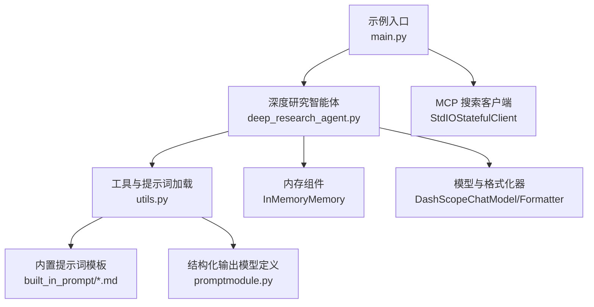
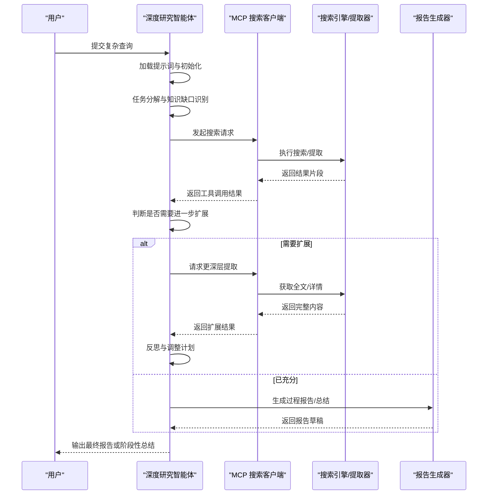
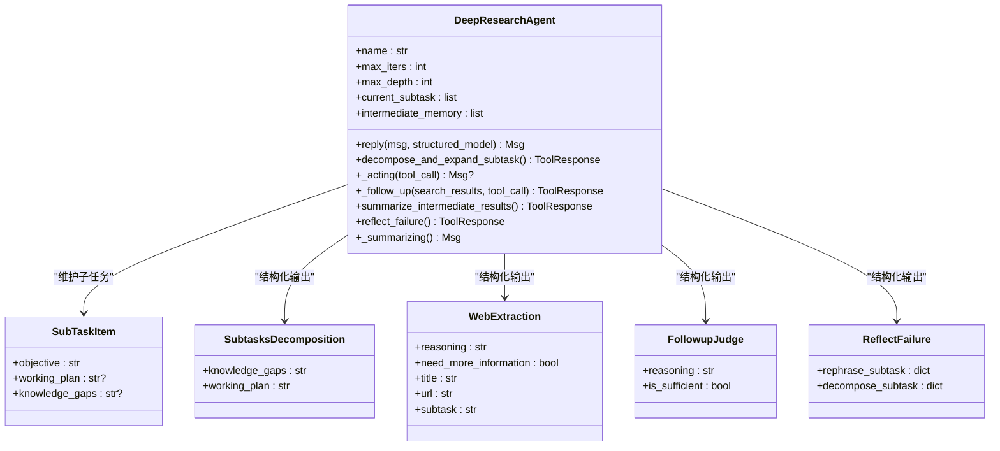
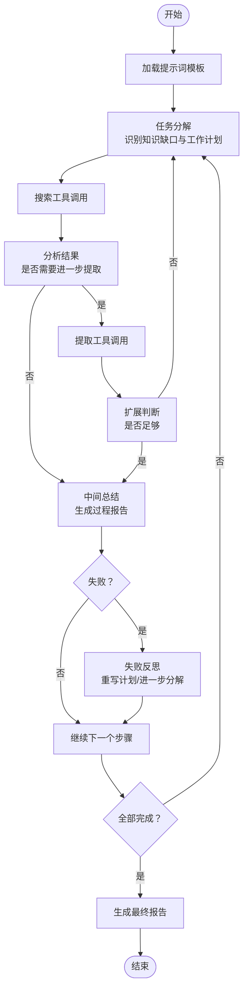
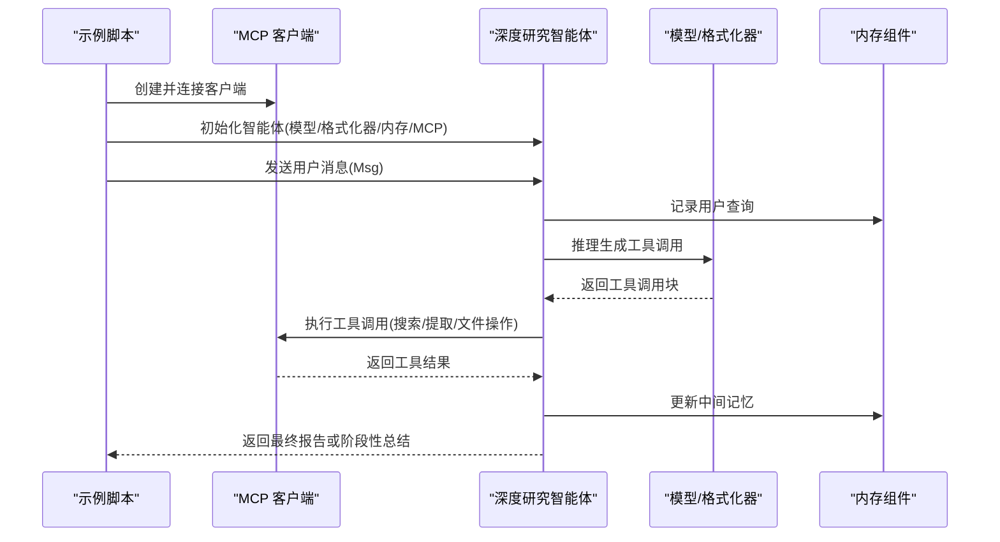
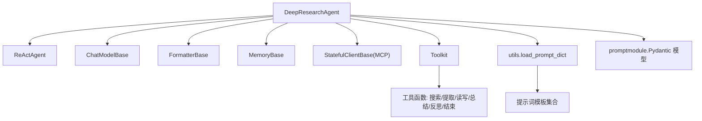

# 深度研究智能体示例

<cite>
**本文引用的文件**
- [deep_research_agent.py](file://examples/agent/deep_research_agent/deep_research_agent.py)
- [main.py](file://examples/agent/deep_research_agent/main.py)
- [utils.py](file://examples/agent/deep_research_agent/utils.py)
- [README.md](file://examples/agent/deep_research_agent/README.md)
- [promptmodule.py](file://examples/agent/deep_research_agent/built_in_prompt/promptmodule.py)
- [prompt_decompose_subtask.md](file://examples/agent/deep_research_agent/built_in_prompt/prompt_decompose_subtask.md)
- [prompt_deeper_expansion.md](file://examples/agent/deep_research_agent/built_in_prompt/prompt_deeper_expansion.md)
- [prompt_deepresearch_summary_report.md](file://examples/agent/deep_research_agent/built_in_prompt/prompt_deepresearch_summary_report.md)
- [prompt_inprocess_report.md](file://examples/agent/deep_research_agent/built_in_prompt/prompt_inprocess_report.md)
- [prompt_reflect_failure.md](file://examples/agent/deep_research_agent/built_in_prompt/prompt_reflect_failure.md)
- [prompt_tool_usage_rules.md](file://examples/agent/deep_research_agent/built_in_prompt/prompt_tool_usage_rules.md)
- [prompt_worker_additional_sys_prompt.md](file://examples/agent/deep_research_agent/built_in_prompt/prompt_worker_additional_sys_prompt.md)
- [qwen_deep_research_agent.py](file://examples/integration/qwen_deep_research_model/qwen_deep_research_agent.py)
- [main.py](file://examples/workflows/multiagent_conversation/main.py)
- [main.py](file://examples/workflows/multiagent_debate/main.py)
</cite>

## 目录
1. [简介](#简介)
2. [项目结构](#项目结构)
3. [核心组件](#核心组件)
4. [架构总览](#架构总览)
5. [详细组件分析](#详细组件分析)
6. [依赖关系分析](#依赖关系分析)
7. [性能考虑](#性能考虑)
8. [故障排查指南](#故障排查指南)
9. [结论](#结论)
10. [附录](#附录)

## 简介
本示例围绕 AgentScope 中的“深度研究智能体”展开，系统性演示其多轮对话与信息检索能力，涵盖任务分解、信息收集、深度分析与报告生成的完整流程。该智能体通过内置提示词模板驱动，实现对复杂查询任务的子任务级协作与迭代优化，适用于学术研究、市场分析等需要综合信息与深度洞察的应用场景。

## 项目结构
- 示例入口与运行：examples/agent/deep_research_agent/main.py
- 核心智能体实现：examples/agent/deep_research_agent/deep_research_agent.py
- 工具与提示词加载：examples/agent/deep_research_agent/utils.py
- 内置提示词模板：examples/agent/deep_research_agent/built_in_prompt/*.md 与 promptmodule.py
- 集成示例（可选）：examples/integration/qwen_deep_research_model/qwen_deep_research_agent.py
- 多智能体工作流示例：examples/workflows/multiagent_conversation/main.py、examples/workflows/multiagent_debate/main.py
- 使用说明与前置条件：examples/agent/deep_research_agent/README.md

图表来源
- [main.py:16-67](file://examples/agent/deep_research_agent/main.py#L16-L67)
- [deep_research_agent.py:88-192](file://examples/agent/deep_research_agent/deep_research_agent.py#L88-L192)
- [utils.py:164-331](file://examples/agent/deep_research_agent/utils.py#L164-L331)

章节来源
- [README.md:1-69](file://examples/agent/deep_research_agent/README.md#L1-L69)
- [main.py:16-67](file://examples/agent/deep_research_agent/main.py#L16-L67)

## 核心组件
- 深度研究智能体类：负责推理-行动循环、任务分解、扩展检索、中间总结与最终报告生成。
- 提示词字典加载：集中管理任务分解、深度扩展、过程报告、失败反思、工具使用规则等提示词。
- 结构化输出模型：定义任务分解、深度扩展、失败反思等结构化输出的 Pydantic 模型。
- MCP 搜索客户端：通过标准 IO 连接外部搜索工具（如 Tavily），提供网页搜索与提取能力。
- 文件读写工具：支持将中间结果保存为文本文件，便于后续总结与复用。

章节来源
- [deep_research_agent.py:62-192](file://examples/agent/deep_research_agent/deep_research_agent.py#L62-L192)
- [utils.py:164-331](file://examples/agent/deep_research_agent/utils.py#L164-L331)
- [promptmodule.py:6-141](file://examples/agent/deep_research_agent/built_in_prompt/promptmodule.py#L6-L141)

## 架构总览
深度研究智能体采用 ReAct 推理-行动范式，结合结构化提示词与 MCP 工具链，形成“计划-搜索-扩展-总结-反思”的闭环流程。系统通过消息与工具的协同，逐步填充知识缺口，最终产出结构化报告。

图表来源
- [deep_research_agent.py:220-313](file://examples/agent/deep_research_agent/deep_research_agent.py#L220-L313)
- [deep_research_agent.py:614-761](file://examples/agent/deep_research_agent/deep_research_agent.py#L614-L761)
- [utils.py:164-331](file://examples/agent/deep_research_agent/utils.py#L164-L331)

## 详细组件分析

### 深度研究智能体类（DeepResearchAgent）
- 职责
  - 维护当前子任务列表与知识缺口，生成工作计划。
  - 在每次迭代中构造推理提示，驱动模型生成工具调用。
  - 执行工具调用（搜索、提取、文件读写、中间总结、失败反思、结束输出）。
  - 控制最大迭代次数与最大深度，避免无限循环与过度扩展。
- 关键方法
  - reply：主控制流，包含计划生成、推理、行动、中间记忆与最终总结。
  - _acting：异步执行工具调用，处理分片输出、截断、中间报告与后续扩展。
  - decompose_and_expand_subtask：基于结构化提示词进行任务分解与知识缺口识别。
  - _follow_up：根据搜索结果判断是否需要进一步提取与扩展。
  - summarize_intermediate_results：将已完成步骤总结为过程报告。
  - _summarizing：在超时或未完成时生成摘要报告。
  - reflect_failure：当步骤失败时进行反思，决定重写计划或进一步分解。
- 数据结构
  - SubTaskItem：记录每个子任务的目标、工作计划与知识缺口。
  - prompt_dict：集中管理各类提示词模板与指令。

图表来源
- [deep_research_agent.py:54-192](file://examples/agent/deep_research_agent/deep_research_agent.py#L54-L192)
- [promptmodule.py:6-141](file://examples/agent/deep_research_agent/built_in_prompt/promptmodule.py#L6-L141)

章节来源
- [deep_research_agent.py:220-313](file://examples/agent/deep_research_agent/deep_research_agent.py#L220-L313)
- [deep_research_agent.py:545-613](file://examples/agent/deep_research_agent/deep_research_agent.py#L545-L613)
- [deep_research_agent.py:614-761](file://examples/agent/deep_research_agent/deep_research_agent.py#L614-L761)
- [deep_research_agent.py:762-841](file://examples/agent/deep_research_agent/deep_research_agent.py#L762-L841)
- [deep_research_agent.py:1005-1181](file://examples/agent/deep_research_agent/deep_research_agent.py#L1005-L1181)

### 提示词模板与结构化输出
- 任务分解提示词：指导智能体识别知识缺口并生成 3-5 步工作计划，包含核心与扩展步骤。
- 深度扩展提示词：从搜索结果中识别浅层但有价值的信息，决定是否进一步提取与扩展。
- 过程报告提示词：将已完成步骤整理为结构化报告，保留引用与细节。
- 失败反思提示词：在步骤失败时，决定是否重写计划或进一步分解。
- 工具使用规则：约束搜索参数、文件操作范围与效率优先策略。
- 工作流程补充提示词：强调检查清单管理、按序执行、失败处理与完成条件。

图表来源
- [utils.py:164-331](file://examples/agent/deep_research_agent/utils.py#L164-L331)
- [prompt_decompose_subtask.md:1-68](file://examples/agent/deep_research_agent/built_in_prompt/prompt_decompose_subtask.md#L1-L68)
- [prompt_deeper_expansion.md:1-54](file://examples/agent/deep_research_agent/built_in_prompt/prompt_deeper_expansion.md#L1-L54)
- [prompt_inprocess_report.md:1-21](file://examples/agent/deep_research_agent/built_in_prompt/prompt_inprocess_report.md#L1-L21)
- [prompt_deepresearch_summary_report.md:1-53](file://examples/agent/deep_research_agent/built_in_prompt/prompt_deepresearch_summary_report.md#L1-L53)
- [prompt_reflect_failure.md:1-47](file://examples/agent/deep_research_agent/built_in_prompt/prompt_reflect_failure.md#L1-L47)
- [prompt_tool_usage_rules.md:1-13](file://examples/agent/deep_research_agent/built_in_prompt/prompt_tool_usage_rules.md#L1-L13)
- [prompt_worker_additional_sys_prompt.md:1-37](file://examples/agent/deep_research_agent/built_in_prompt/prompt_worker_additional_sys_prompt.md#L1-L37)

章节来源
- [utils.py:164-331](file://examples/agent/deep_research_agent/utils.py#L164-L331)
- [promptmodule.py:6-141](file://examples/agent/deep_research_agent/built_in_prompt/promptmodule.py#L6-L141)

### 工具与运行示例
- 入口脚本：配置 DashScope 模型与格式化器、MCP 搜索客户端，创建智能体实例并发起查询。
- MCP 客户端：通过 StdIOStatefulClient 连接外部搜索工具（如 Tavily），传递环境变量与命令参数。
- 文件存储目录：通过环境变量指定工作目录，确保工具读写权限与路径约束。

图表来源
- [main.py:16-67](file://examples/agent/deep_research_agent/main.py#L16-L67)
- [deep_research_agent.py:220-313](file://examples/agent/deep_research_agent/deep_research_agent.py#L220-L313)

章节来源
- [main.py:16-67](file://examples/agent/deep_research_agent/main.py#L16-L67)

### 集成示例与多智能体工作流
- Qwen 深度研究模型集成：提供两阶段研究流程（澄清与深度研究），适合直接调用预置模型的场景。
- 多智能体对话与辩论：展示如何在消息中枢中组织多智能体交互，适合复杂议题的多方讨论与共识达成。

章节来源
- [qwen_deep_research_agent.py:17-125](file://examples/integration/qwen_deep_research_model/qwen_deep_research_agent.py#L17-L125)
- [main.py:38-81](file://examples/workflows/multiagent_conversation/main.py#L38-L81)
- [main.py:85-131](file://examples/workflows/multiagent_debate/main.py#L85-L131)

## 依赖关系分析
- 智能体依赖
  - ReActAgent：提供推理-行动框架与工具调用能力。
  - ChatModelBase/FormatterBase：统一模型与格式化器接口。
  - MemoryBase：维护对话历史与中间记忆。
  - StatefulClientBase：MCP 客户端，提供搜索与提取工具。
  - Toolkit：注册与管理工具函数（搜索、提取、文件读写、中间总结、失败反思、结束输出）。
- 提示词与结构化输出
  - utils.load_prompt_dict：集中加载各类提示词模板。
  - promptmodule：定义结构化输出的 Pydantic 模型，确保模型输出符合预期格式。

图表来源
- [deep_research_agent.py:28-42](file://examples/agent/deep_research_agent/deep_research_agent.py#L28-L42)
- [utils.py:164-331](file://examples/agent/deep_research_agent/utils.py#L164-L331)
- [promptmodule.py:6-141](file://examples/agent/deep_research_agent/built_in_prompt/promptmodule.py#L6-L141)

章节来源
- [deep_research_agent.py:28-42](file://examples/agent/deep_research_agent/deep_research_agent.py#L28-L42)
- [utils.py:164-331](file://examples/agent/deep_research_agent/utils.py#L164-L331)

## 性能考虑
- 上下文长度控制：通过工具结果截断函数限制单次工具输出的词数，避免超出模型上下文。
- 迭代与深度限制：max_iters 与 max_depth 限制推理-行动循环次数与查询扩展深度，防止资源浪费。
- 流式输出：模型与工具均支持流式输出，提升交互体验与响应速度。
- 文件操作约束：工具使用规则限定文件操作目录与大小，避免大文件频繁写入带来的性能开销。

章节来源
- [utils.py:56-75](file://examples/agent/deep_research_agent/utils.py#L56-L75)
- [deep_research_agent.py:96-99](file://examples/agent/deep_research_agent/deep_research_agent.py#L96-L99)
- [prompt_tool_usage_rules.md:1-13](file://examples/agent/deep_research_agent/built_in_prompt/prompt_tool_usage_rules.md#L1-L13)

## 故障排查指南
- MCP 客户端未连接：确认命令与环境变量已正确配置，确保外部工具可用。
- 模型输出为空或异常：检查提示词模板完整性与结构化输出模型匹配情况。
- 工具调用失败：查看工具返回元数据中的 success 字段与错误信息，必要时重试或调整输入参数。
- 超时或未完成：智能体会在达到最大迭代次数后生成摘要报告，可据此评估是否需要增加迭代或调整深度。

章节来源
- [main.py:37-67](file://examples/agent/deep_research_agent/main.py#L37-L67)
- [deep_research_agent.py:314-457](file://examples/agent/deep_research_agent/deep_research_agent.py#L314-L457)
- [prompt_worker_additional_sys_prompt.md:1-37](file://examples/agent/deep_research_agent/built_in_prompt/prompt_worker_additional_sys_prompt.md#L1-L37)

## 结论
深度研究智能体通过结构化提示词与工具链的协同，实现了复杂查询任务的自动化分解、检索、扩展与总结。其设计兼顾灵活性与可控性，既可作为独立智能体完成端到端研究，也可融入多智能体工作流以支持更复杂的协作场景。建议在实际应用中结合业务需求调整提示词模板与工具策略，持续优化迭代与深度控制，以获得更高质量的研究成果。

## 附录
- 快速开始
  - 设置环境变量：DASHSCOPE_API_KEY、TAVILY_API_KEY、AGENT_OPERATION_DIR。
  - 启动 MCP 服务：npx -y tavily-mcp@latest。
  - 运行示例：python examples/agent/deep_research_agent/main.py。
- 多轮对话改造思路
  - 参考示例中的用户代理与消息循环模式，将用户输入与智能体回复交替推进，实现持续交互与动态调整。

章节来源
- [README.md:14-69](file://examples/agent/deep_research_agent/README.md#L14-L69)