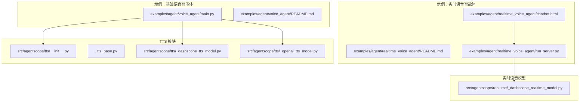
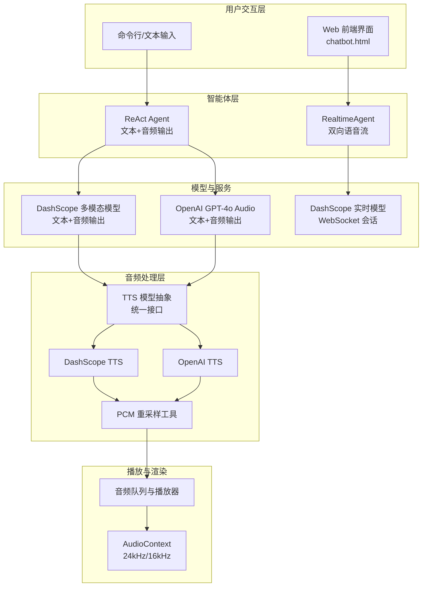
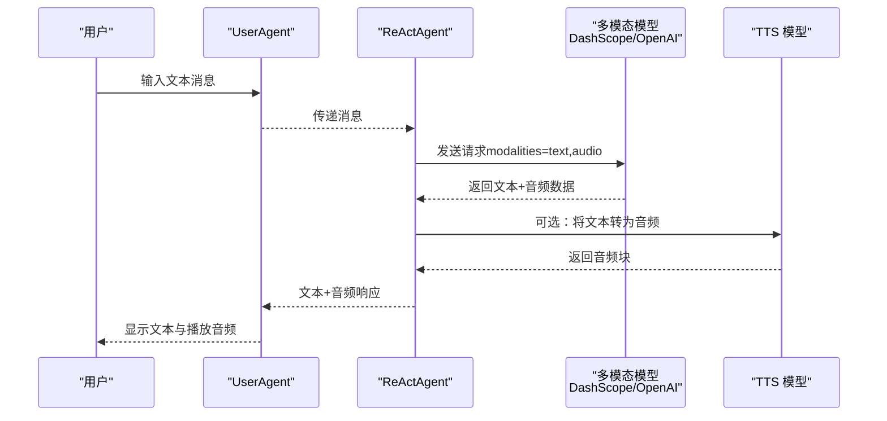
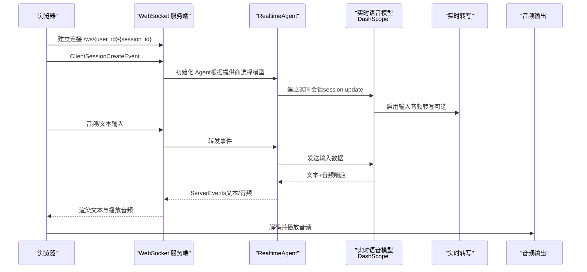
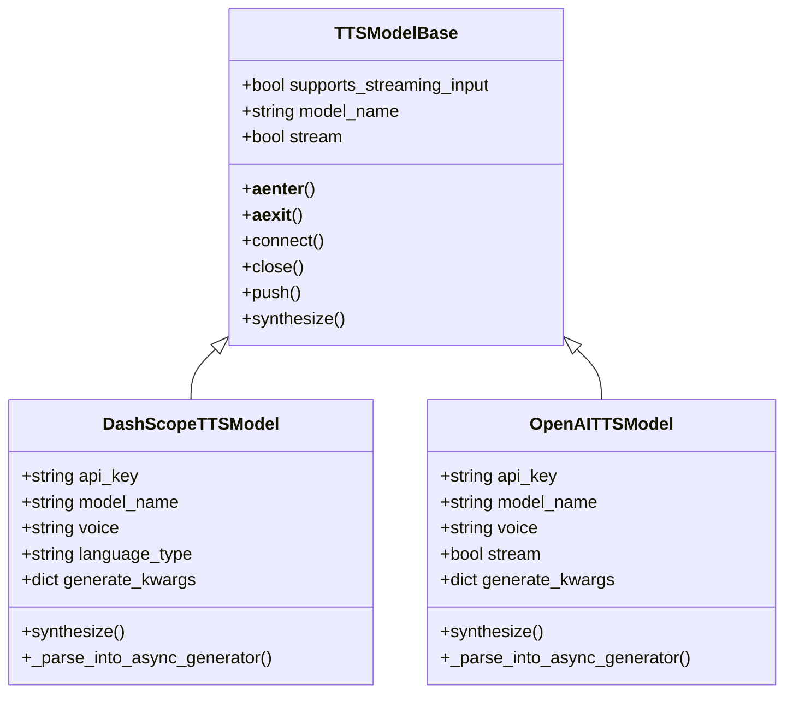
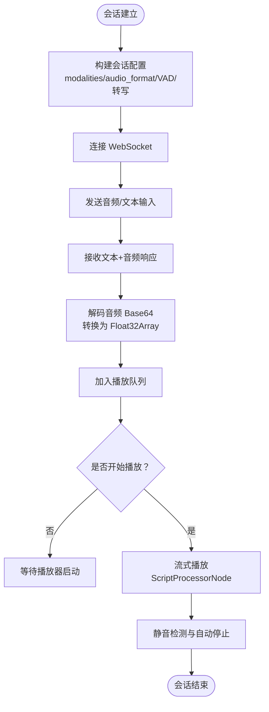
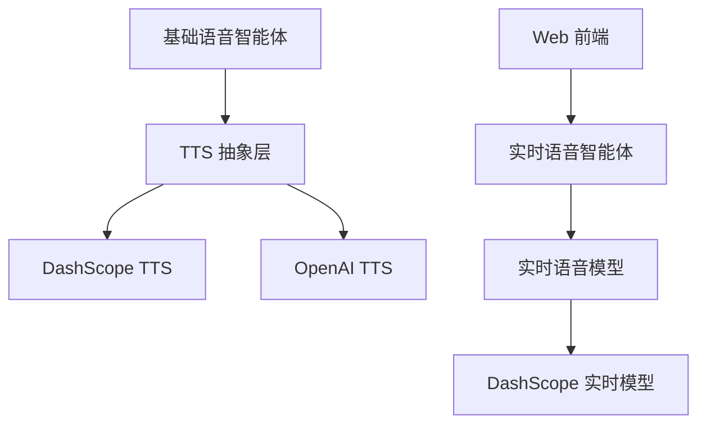

# 语音智能体示例

<cite>
**本文引用的文件**
- [examples/agent/voice_agent/main.py](file://examples/agent/voice_agent/main.py)
- [examples/agent/voice_agent/README.md](file://examples/agent/voice_agent/README.md)
- [examples/agent/realtime_voice_agent/README.md](file://examples/agent/realtime_voice_agent/README.md)
- [examples/agent/realtime_voice_agent/run_server.py](file://examples/agent/realtime_voice_agent/run_server.py)
- [examples/agent/realtime_voice_agent/chatbot.html](file://examples/agent/realtime_voice_agent/chatbot.html)
- [src/agentscope/tts/__init__.py](file://src/agentscope/tts/__init__.py)
- [src/agentscope/tts/_tts_base.py](file://src/agentscope/tts/_tts_base.py)
- [src/agentscope/tts/_dashscope_tts_model.py](file://src/agentscope/tts/_dashscope_tts_model.py)
- [src/agentscope/tts/_openai_tts_model.py](file://src/agentscope/tts/_openai_tts_model.py)
- [src/agentscope/realtime/_dashscope_realtime_model.py](file://src/agentscope/realtime/_dashscope_realtime_model.py)
- [src/agentscope/_utils/_common.py](file://src/agentscope/_utils/_common.py)
</cite>

## 目录
1. [简介](#简介)
2. [项目结构](#项目结构)
3. [核心组件](#核心组件)
4. [架构概览](#架构概览)
5. [详细组件分析](#详细组件分析)
6. [依赖分析](#依赖分析)
7. [性能考虑](#性能考虑)
8. [故障排除指南](#故障排除指南)
9. [结论](#结论)
10. [附录](#附录)

## 简介
本文件面向语音智能体示例的完整功能演示，重点讲解以下内容：
- 语音智能体的基础音频处理能力：语音识别（ASR）、语音合成（TTS）、音频播放
- 语音智能体与传统文本智能体的差异与优势，以及在不同场景下的选择策略
- 语音智能体的配置与使用方法：音频设备设置、音频质量优化
- 完整的运行步骤与代码示例路径，覆盖智能家居、车载系统、无障碍应用等典型领域

## 项目结构
该示例仓库提供了两类语音智能体能力：
- 基础语音智能体（ReAct Agent + 文本+音频输出）：位于 examples/agent/voice_agent
- 实时语音智能体（RealtimeAgent + 双向语音流 + 实时转写）：位于 examples/agent/realtime_voice_agent

**图表来源**
- [examples/agent/voice_agent/main.py:1-51](file://examples/agent/voice_agent/main.py#L1-L51)
- [examples/agent/realtime_voice_agent/run_server.py:1-188](file://examples/agent/realtime_voice_agent/run_server.py#L1-L188)
- [src/agentscope/tts/__init__.py:1-26](file://src/agentscope/tts/__init__.py#L1-L26)
- [src/agentscope/realtime/_dashscope_realtime_model.py:1-200](file://src/agentscope/realtime/_dashscope_realtime_model.py#L1-L200)

**章节来源**
- [examples/agent/voice_agent/main.py:1-51](file://examples/agent/voice_agent/main.py#L1-L51)
- [examples/agent/realtime_voice_agent/README.md:1-117](file://examples/agent/realtime_voice_agent/README.md#L1-L117)

## 核心组件
- 基础语音智能体（ReAct Agent + 文本+音频输出）
  - 使用 DashScope 或 OpenAI 的多模态模型，支持同时输出文本与音频
  - 用户通过文本输入发起对话，Agent 输出文本回答并携带音频数据
- 实时语音智能体（RealtimeAgent + 双向语音流）
  - 基于 WebSocket 的实时语音会话，支持低延迟双向语音传输与实时转写
  - 提供 Web 前端界面，支持麦克风/摄像头采集、音频播放队列管理
- TTS 模块
  - 统一的 TTS 抽象基类，支持非实时与实时两种模式
  - 提供 DashScope、OpenAI、CosyVoice 等多家厂商的 TTS 实现
- 实时语音模型
  - DashScope 实时模型封装，负责会话配置、输入格式、采样率、VAD 等

**章节来源**
- [examples/agent/voice_agent/README.md:1-21](file://examples/agent/voice_agent/README.md#L1-L21)
- [examples/agent/realtime_voice_agent/README.md:1-117](file://examples/agent/realtime_voice_agent/README.md#L1-L117)
- [src/agentscope/tts/_tts_base.py:1-144](file://src/agentscope/tts/_tts_base.py#L1-L144)
- [src/agentscope/realtime/_dashscope_realtime_model.py:1-200](file://src/agentscope/realtime/_dashscope_realtime_model.py#L1-L200)

## 架构概览
下面的图展示了两类语音智能体的整体架构与数据流：

**图表来源**
- [examples/agent/voice_agent/main.py:15-51](file://examples/agent/voice_agent/main.py#L15-L51)
- [examples/agent/realtime_voice_agent/run_server.py:66-177](file://examples/agent/realtime_voice_agent/run_server.py#L66-L177)
- [examples/agent/realtime_voice_agent/chatbot.html:1052-1144](file://examples/agent/realtime_voice_agent/chatbot.html#L1052-L1144)
- [src/agentscope/tts/_tts_base.py:12-144](file://src/agentscope/tts/_tts_base.py#L12-L144)
- [src/agentscope/_utils/_common.py:458-502](file://src/agentscope/_utils/_common.py#L458-L502)

## 详细组件分析

### 基础语音智能体（ReAct Agent + 文本+音频输出）
- 功能概述
  - 使用多模态模型（DashScope Qwen-Omni 或 OpenAI GPT-4o Audio），在一次推理中同时生成文本回答与音频
  - 用户循环输入文本，Agent 输出文本与音频，支持退出命令
- 关键要点
  - 启用音频输出时，某些模型可能不生成工具调用
  - 支持通过修改模型参数切换不同提供商与模型
- 运行步骤
  - 设置环境变量 DASHSCOPE_API_KEY（或相应提供商的 API Key）
  - 运行示例脚本，按提示输入文本，查看控制台输出与音频

**图表来源**
- [examples/agent/voice_agent/main.py:15-51](file://examples/agent/voice_agent/main.py#L15-L51)

**章节来源**
- [examples/agent/voice_agent/main.py:15-51](file://examples/agent/voice_agent/main.py#L15-L51)
- [examples/agent/voice_agent/README.md:7-21](file://examples/agent/voice_agent/README.md#L7-L21)

### 实时语音智能体（RealtimeAgent + 双向语音流）
- 功能概述
  - 基于 WebSocket 的实时语音会话，支持低延迟双向语音传输与实时转写
  - 提供 Web 前端界面，支持麦克风/摄像头采集、音频播放队列管理
- 关键要点
  - 支持切换模型提供商（DashScope、OpenAI、Gemini）
  - 会话配置包含输入/输出音频格式、VAD、转录等
- 运行步骤
  - 启动服务端：python run_server.py
  - 浏览器访问 http://localhost:8000
  - 点击“开始录音”，按提示授权麦克风权限
  - Agent 将返回语音与文本响应

**图表来源**
- [examples/agent/realtime_voice_agent/run_server.py:66-177](file://examples/agent/realtime_voice_agent/run_server.py#L66-L177)
- [examples/agent/realtime_voice_agent/chatbot.html:1052-1144](file://examples/agent/realtime_voice_agent/chatbot.html#L1052-L1144)
- [src/agentscope/realtime/_dashscope_realtime_model.py:96-131](file://src/agentscope/realtime/_dashscope_realtime_model.py#L96-L131)

**章节来源**
- [examples/agent/realtime_voice_agent/README.md:1-117](file://examples/agent/realtime_voice_agent/README.md#L1-L117)
- [examples/agent/realtime_voice_agent/run_server.py:1-188](file://examples/agent/realtime_voice_agent/run_server.py#L1-L188)
- [examples/agent/realtime_voice_agent/chatbot.html:1052-1144](file://examples/agent/realtime_voice_agent/chatbot.html#L1052-L1144)

### TTS 模块与音频处理
- TTS 抽象基类
  - 定义统一接口：synthesize、push/connect/close 等
  - 支持非实时与实时两种生命周期管理
- DashScope TTS
  - 使用 MultiModalConversation API，支持流式与非流式合成
  - 输出 PCM 音频，媒体类型包含采样率信息
- OpenAI TTS
  - 使用 OpenAI Speech API，支持流式与非流式
  - 输出 PCM 音频，支持指定声音与模型
- PCM 重采样工具
  - 将输入 PCM Base64 数据重采样为目标采样率
  - 用于适配不同模型输出的采样率（如 24kHz/16kHz）

**图表来源**
- [src/agentscope/tts/_tts_base.py:12-144](file://src/agentscope/tts/_tts_base.py#L12-L144)
- [src/agentscope/tts/_dashscope_tts_model.py:28-178](file://src/agentscope/tts/_dashscope_tts_model.py#L28-L178)
- [src/agentscope/tts/_openai_tts_model.py:17-185](file://src/agentscope/tts/_openai_tts_model.py#L17-L185)

**章节来源**
- [src/agentscope/tts/__init__.py:1-26](file://src/agentscope/tts/__init__.py#L1-L26)
- [src/agentscope/tts/_tts_base.py:12-144](file://src/agentscope/tts/_tts_base.py#L12-L144)
- [src/agentscope/tts/_dashscope_tts_model.py:28-178](file://src/agentscope/tts/_dashscope_tts_model.py#L28-L178)
- [src/agentscope/tts/_openai_tts_model.py:17-185](file://src/agentscope/tts/_openai_tts_model.py#L17-L185)
- [src/agentscope/_utils/_common.py:458-502](file://src/agentscope/_utils/_common.py#L458-L502)

### 实时语音模型与会话配置
- DashScope 实时模型
  - 输入采样率固定为 16kHz
  - 输出采样率根据模型名称决定（如 24kHz 或 16kHz）
  - 会话配置包含输出模态、音频格式、VAD、输入转写等
- 事件与消息
  - 会话更新、输入音频转写完成、输入开始/结束等事件解析
- 前端播放逻辑
  - 使用 Web Audio API 的 ScriptProcessorNode 实现流式播放
  - 将解码后的浮点数组写入输出缓冲区，支持静音检测与自动停止

**图表来源**
- [src/agentscope/realtime/_dashscope_realtime_model.py:96-131](file://src/agentscope/realtime/_dashscope_realtime_model.py#L96-L131)
- [examples/agent/realtime_voice_agent/chatbot.html:1052-1144](file://examples/agent/realtime_voice_agent/chatbot.html#L1052-L1144)

**章节来源**
- [src/agentscope/realtime/_dashscope_realtime_model.py:1-200](file://src/agentscope/realtime/_dashscope_realtime_model.py#L1-L200)
- [examples/agent/realtime_voice_agent/chatbot.html:1052-1144](file://examples/agent/realtime_voice_agent/chatbot.html#L1052-L1144)

## 依赖分析
- 组件耦合与内聚
  - 基础语音智能体与 TTS 模块松耦合：通过统一的 TTS 抽象接口调用不同提供商实现
  - 实时语音智能体与前端播放器通过 WebSocket 事件解耦，便于扩展与替换
- 外部依赖
  - DashScope SDK、OpenAI SDK、websockets、FastAPI、Uvicorn、Web Audio API
- 潜在循环依赖
  - 当前结构清晰，未发现循环依赖；TTS 模块与实时模型分别独立存在

**图表来源**
- [src/agentscope/tts/__init__.py:15-25](file://src/agentscope/tts/__init__.py#L15-L25)
- [src/agentscope/realtime/_dashscope_realtime_model.py:15-33](file://src/agentscope/realtime/_dashscope_realtime_model.py#L15-L33)

**章节来源**
- [src/agentscope/tts/__init__.py:1-26](file://src/agentscope/tts/__init__.py#L1-L26)
- [src/agentscope/realtime/_dashscope_realtime_model.py:1-200](file://src/agentscope/realtime/_dashscope_realtime_model.py#L1-L200)

## 性能考虑
- 采样率与音频质量
  - 不同模型输出采样率为 16kHz 或 24kHz，建议在播放前进行重采样以匹配目标设备
  - 重采样工具支持将输入 PCM Base64 数据转换为目标采样率
- 流式合成与播放
  - TTS 支持流式合成，前端使用 ScriptProcessorNode 实现低延迟播放
  - 队列管理避免音频中断，静音检测与自动停止减少资源占用
- 网络与延迟
  - 实时语音采用 WebSocket，建议在本地网络或低延迟环境中部署
  - 适当调整 VAD 阈值与静默时长以平衡延迟与准确性

**章节来源**
- [src/agentscope/_utils/_common.py:458-502](file://src/agentscope/_utils/_common.py#L458-L502)
- [examples/agent/realtime_voice_agent/chatbot.html:1052-1144](file://examples/agent/realtime_voice_agent/chatbot.html#L1052-L1144)

## 故障排除指南
- 环境变量未设置
  - 基础语音智能体：确保 DASHSCOPE_API_KEY（或相应提供商 API Key）已设置
  - 实时语音智能体：确保对应提供商 API Key 已设置，服务端检查接口可返回可用状态
- 麦克风/摄像头权限
  - 浏览器需授权麦克风与摄像头权限；若被拒绝，前端会提示授权
- 工具调用不可用
  - 基础语音智能体启用音频输出时，某些模型可能不生成工具调用，建议仅在需要纯文本输出时禁用音频
- 播放异常
  - 若浏览器 AudioContext 处于 suspended 状态，需用户交互后恢复
  - 检查音频队列是否为空或播放器是否正确启动

**章节来源**
- [examples/agent/voice_agent/README.md:7-21](file://examples/agent/voice_agent/README.md#L7-L21)
- [examples/agent/realtime_voice_agent/README.md:5-117](file://examples/agent/realtime_voice_agent/README.md#L5-L117)
- [examples/agent/realtime_voice_agent/run_server.py:39-46](file://examples/agent/realtime_voice_agent/run_server.py#L39-L46)

## 结论
- 语音智能体在用户体验上显著优于传统文本智能体：自然的语音交互、更低的认知负担、更好的无障碍支持
- 选择策略
  - 对于简单问答与文本优先场景：使用基础语音智能体（ReAct Agent + 文本+音频输出）
  - 对于低延迟、自然对话与实时转写需求：使用实时语音智能体（RealtimeAgent + WebSocket）
- 应用潜力
  - 智能家居：语音控制设备、播报信息
  - 车载系统：免提交互、安全驾驶
  - 无障碍应用：听障人士辅助、老年人友好界面

## 附录
- 快速开始（基础语音智能体）
  - 设置环境变量：DASHSCOPE_API_KEY
  - 运行命令：python examples/agent/voice_agent/main.py
- 快速开始（实时语音智能体）
  - 启动服务端：cd examples/agent/realtime_voice_agent && python run_server.py
  - 访问前端：http://localhost:8000
  - 开始录音并授权麦克风权限

**章节来源**
- [examples/agent/voice_agent/README.md:12-21](file://examples/agent/voice_agent/README.md#L12-L21)
- [examples/agent/realtime_voice_agent/README.md:18-70](file://examples/agent/realtime_voice_agent/README.md#L18-L70)