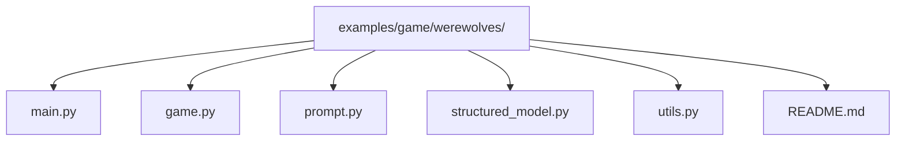
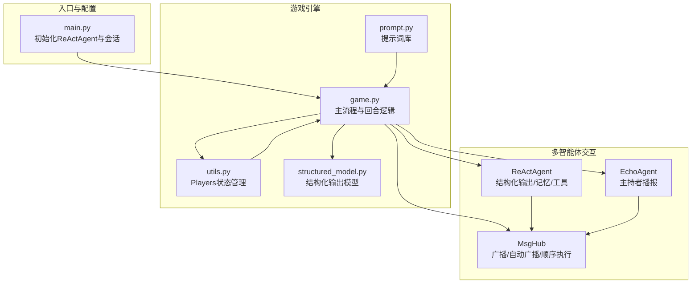
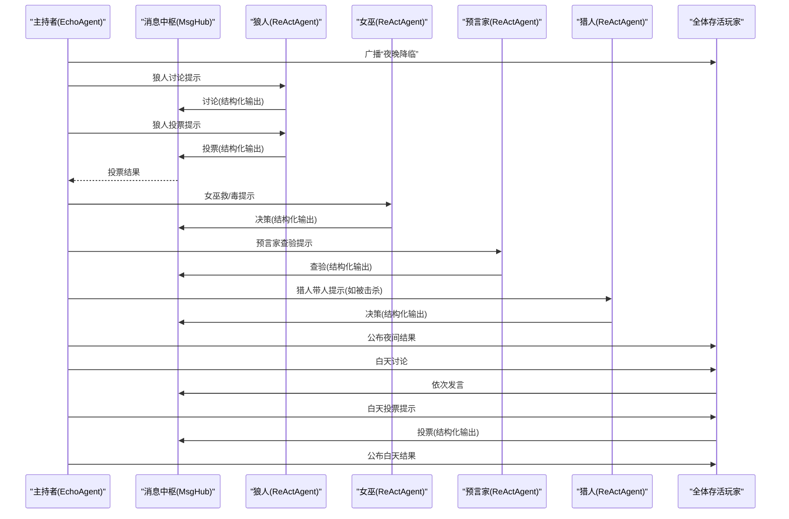
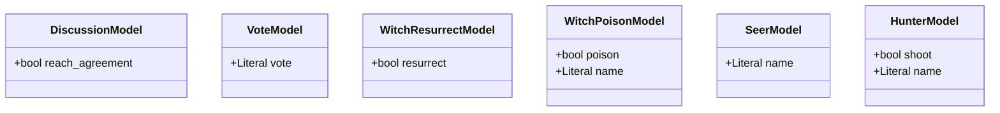
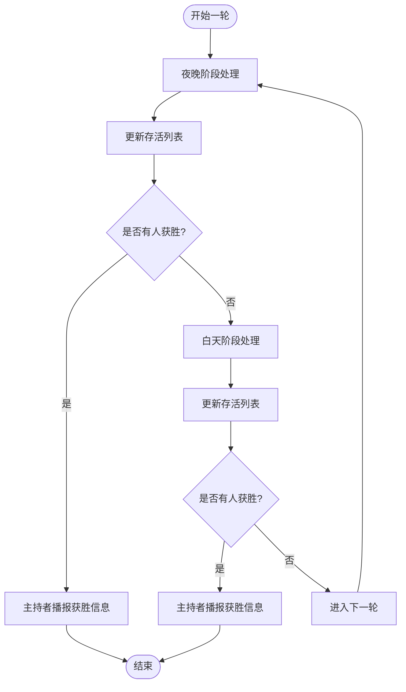
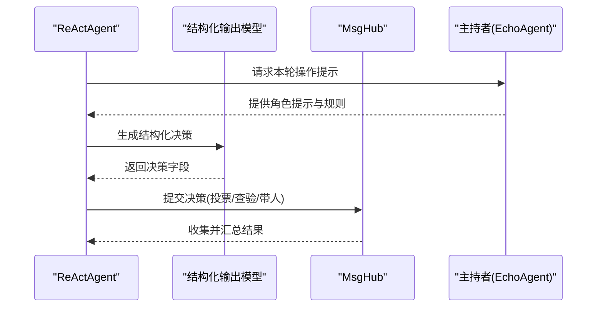
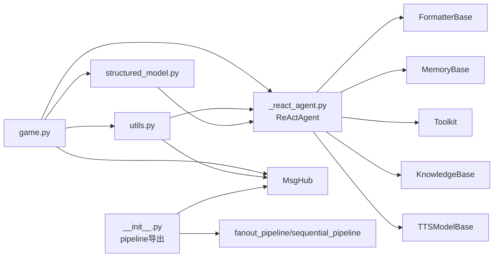

# 游戏示例

<cite>
**本文引用的文件**
- [README.md](file://examples/game/werewolves/README.md)
- [game.py](file://examples/game/werewolves/game.py)
- [main.py](file://examples/game/werewolves/main.py)
- [prompt.py](file://examples/game/werewolves/prompt.py)
- [structured_model.py](file://examples/game/werewolves/structured_model.py)
- [utils.py](file://examples/game/werewolves/utils.py)
- [_react_agent.py](file://src/agentscope/agent/_react_agent.py)
- [__init__.py](file://src/agentscope/pipeline/__init__.py)
- [workflow_conversation.py](file://docs/tutorial/en/src/workflow_conversation.py)
</cite>

## 目录
1. [简介](#简介)
2. [项目结构](#项目结构)
3. [核心组件](#核心组件)
4. [架构总览](#架构总览)
5. [详细组件分析](#详细组件分析)
6. [依赖关系分析](#依赖关系分析)
7. [性能考量](#性能考量)
8. [故障排查指南](#故障排查指南)
9. [结论](#结论)
10. [附录](#附录)

## 简介
本教程围绕 AgentScope 的“九人狼人杀”游戏示例，系统讲解多智能体博弈的完整实现。内容涵盖：
- 游戏规则与角色分配（三狼、三民、预言家、女巫、猎人）
- 回合制玩法（夜晚阶段与白天阶段）
- 胜负判定机制
- 智能体在游戏中的决策流程（信息收集、推理分析、策略制定）
- 游戏状态管理、玩家互动与实时反馈
- 结构化模型在游戏决策中的应用
- 提示词工程在游戏场景中的作用
- 调试、性能优化与扩展新游戏模式的实践建议

## 项目结构
九人狼人杀示例位于 examples/game/werewolves，核心文件如下：
- game.py：主流程与回合逻辑
- main.py：入口脚本与智能体初始化
- prompt.py：中英双语提示词
- structured_model.py：结构化输出模型定义
- utils.py：工具函数与玩家状态管理
- README.md：快速开始与高级用法说明

图表来源
- [main.py:1-124](file://examples/game/werewolves/main.py#L1-L124)
- [game.py:1-364](file://examples/game/werewolves/game.py#L1-L364)
- [prompt.py:1-192](file://examples/game/werewolves/prompt.py#L1-L192)
- [structured_model.py:1-125](file://examples/game/werewolves/structured_model.py#L1-L125)
- [utils.py:1-181](file://examples/game/werewolves/utils.py#L1-L181)
- [README.md:1-116](file://examples/game/werewolves/README.md#L1-L116)

章节来源
- [README.md:1-116](file://examples/game/werewolves/README.md#L1-L116)

## 核心组件
- ReActAgent：多智能体核心，支持结构化输出、记忆、工具调用等能力
- MsgHub：消息中枢，用于控制广播、自动广播与讨论顺序
- 结构化输出模型：Vote、Witch、Seer、Hunter 等模型，约束智能体输出格式
- EchoAgent：主持者代理，负责播报与回显
- Players：玩家状态管理器，维护角色映射、存活列表与胜负判断

章节来源
- [main.py:18-88](file://examples/game/werewolves/main.py#L18-L88)
- [game.py:28-48](file://examples/game/werewolves/game.py#L28-L48)
- [structured_model.py:9-125](file://examples/game/werewolves/structured_model.py#L9-L125)
- [utils.py:48-181](file://examples/game/werewolves/utils.py#L48-L181)

## 架构总览
下图展示了九人狼人杀的整体架构：入口脚本初始化九个 ReActAgent，通过 MsgHub 协调夜晚与白天阶段的消息传播；结构化输出模型约束各角色的决策；Players 维护状态并判定胜负；EchoAgent 作为主持者播报关键节点。

图表来源
- [main.py:91-124](file://examples/game/werewolves/main.py#L91-L124)
- [game.py:67-364](file://examples/game/werewolves/game.py#L67-L364)
- [utils.py:88-181](file://examples/game/werewolves/utils.py#L88-L181)
- [prompt.py:5-192](file://examples/game/werewolves/prompt.py#L5-L192)
- [structured_model.py:1-125](file://examples/game/werewolves/structured_model.py#L1-L125)

## 详细组件分析

### 主流程与回合制玩法
- 角色分配：随机打乱九个智能体与九个角色（三狼、三民、预言家、女巫、猎人），私聊告知身份
- 夜晚阶段：
  - 狼人讨论与投票，使用 DiscussionModel 与 Vote 模型
  - 女巫可选择救或毒，使用 WitchResurrectModel 与 get_poison_model
  - 预言家查验身份，使用 get_seer_model
  - 猎人若被击杀且非毒杀，可带人同归于尽，使用 get_hunter_model
- 白天阶段：
  - 公布夜间死亡情况，首夜被击杀玩家可发表遗言
  - 全体讨论与投票，使用 fanout_pipeline 并行收集投票
  - 若被投出局且为猎人，可带人同归于尽
- 胜负判定：当狼人数量≥半数或全部狼人被击杀时宣布胜负

图表来源
- [game.py:111-358](file://examples/game/werewolves/game.py#L111-L358)
- [utils.py:19-27](file://examples/game/werewolves/utils.py#L19-L27)
- [structured_model.py:17-125](file://examples/game/werewolves/structured_model.py#L17-L125)

章节来源
- [game.py:67-364](file://examples/game/werewolves/game.py#L67-L364)

### 结构化输出模型
- DiscussionModel：狼人讨论是否达成一致
- get_vote_model：白天/夜晚投票，限定候选人为存活玩家
- WitchResurrectModel：女巫是否救活
- get_poison_model：女巫是否毒人及目标
- get_seer_model：预言家查验目标
- get_hunter_model：猎人是否带人及目标

图表来源
- [structured_model.py:9-125](file://examples/game/werewolves/structured_model.py#L9-L125)

章节来源
- [structured_model.py:1-125](file://examples/game/werewolves/structured_model.py#L1-L125)

### 玩家状态管理与胜负判定
- Players 类维护角色映射、存活列表、各角色集合，并在每轮结束后更新
- 胜负判定逻辑：
  - 狼人数量≥半数：狼人获胜
  - 存活玩家中无狼人：村民获胜
  - 否则继续游戏

图表来源
- [utils.py:132-181](file://examples/game/werewolves/utils.py#L132-L181)
- [game.py:244-358](file://examples/game/werewolves/game.py#L244-L358)

章节来源
- [utils.py:88-181](file://examples/game/werewolves/utils.py#L88-L181)

### 智能体决策流程（信息收集、推理分析、策略制定）
- 信息收集：夜晚阶段通过结构化输出模型获取狼人讨论、女巫决策、预言家查验结果
- 推理分析：基于夜晚结果调整策略（例如女巫使用药水后的线索、预言家暴露风险）
- 策略制定：白天投票阶段综合发言与夜晚线索，形成投票策略

图表来源
- [game.py:137-346](file://examples/game/werewolves/game.py#L137-L346)
- [structured_model.py:17-125](file://examples/game/werewolves/structured_model.py#L17-L125)

章节来源
- [game.py:111-358](file://examples/game/werewolves/game.py#L111-L358)

### 实时反馈与主持者机制
- EchoAgent 负责播报关键节点（夜晚、白天、投票结果、获胜信息）
- 可选启用 TTS，将播报内容转语音，提升沉浸感
- 白天讨论阶段启用自动广播，结束后关闭以避免泄露信息

章节来源
- [utils.py:48-86](file://examples/game/werewolves/utils.py#L48-L86)
- [README.md:68-107](file://examples/game/werewolves/README.md#L68-L107)

### 提示词工程在游戏场景中的作用
- 中英双语提示词库，覆盖夜晚阶段、白天阶段、角色私聊提示
- 通过明确的字段约束（如 reach_agreement、vote、resurrect、poison、name 等）引导智能体输出符合预期的结构化数据
- 在不同角色阶段提供差异化提示，帮助智能体聚焦当前任务

章节来源
- [prompt.py:5-192](file://examples/game/werewolves/prompt.py#L5-L192)
- [structured_model.py:17-125](file://examples/game/werewolves/structured_model.py#L17-L125)

## 依赖关系分析
- ReActAgent 依赖模型、格式化器、工具包、记忆与长记忆等组件
- MsgHub 提供广播与顺序执行能力，配合 fanout_pipeline 实现并行收集
- 结构化输出模型通过 Pydantic BaseModel 约束输出字段，确保一致性
- Players 与 EchoAgent 分别承担状态管理与主持职责

图表来源
- [_react_agent.py:98-200](file://src/agentscope/agent/_react_agent.py#L98-L200)
- [__init__.py:1-23](file://src/agentscope/pipeline/__init__.py#L1-L23)
- [game.py:28-48](file://examples/game/werewolves/game.py#L28-L48)
- [structured_model.py:1-125](file://examples/game/werewolves/structured_model.py#L1-L125)
- [utils.py:1-181](file://examples/game/werewolves/utils.py#L1-L181)

章节来源
- [_react_agent.py:98-200](file://src/agentscope/agent/_react_agent.py#L98-L200)
- [__init__.py:1-23](file://src/agentscope/pipeline/__init__.py#L1-L23)

## 性能考量
- 并行执行：白天投票阶段使用 fanout_pipeline 并行收集，缩短等待时间
- 自动广播控制：白天讨论启用自动广播，投票后关闭，减少冗余信息
- 结构化输出校验：通过 Pydantic 校验，降低无效输出带来的重试成本
- 会话持久化：支持加载/保存会话状态，便于连续游戏与策略迭代

章节来源
- [game.py:149-158](file://examples/game/werewolves/game.py#L149-L158)
- [game.py:289-294](file://examples/game/werewolves/game.py#L289-L294)
- [main.py:107-120](file://examples/game/werewolves/main.py#L107-L120)

## 故障排查指南
- 角色分配异常：确认 agents 数量为 9，角色列表长度也为 9
- 结构化输出失败：检查对应模型字段是否与提示词一致，必要时调整提示词或模型
- 投票结果异常：核对 majority_vote 输入是否为字符串列表，确保所有智能体均返回合法候选
- 会话加载/保存问题：确认 JSONSession 的路径与 session_id 正确，避免并发写入冲突
- TTS 未生效：检查环境变量与导入语句，确保启用相应代码段

章节来源
- [game.py:74-75](file://examples/game/werewolves/game.py#L74-L75)
- [utils.py:19-27](file://examples/game/werewolves/utils.py#L19-L27)
- [main.py:107-120](file://examples/game/werewolves/main.py#L107-L120)
- [README.md:68-107](file://examples/game/werewolves/README.md#L68-L107)

## 结论
九人狼人杀示例通过 ReActAgent、MsgHub、结构化输出模型与 Players 状态管理，构建了一个完整的多智能体博弈系统。它展示了如何在复杂交互中利用结构化输出约束决策、通过主持者实现有序播报、并通过会话持久化支持连续学习与优化。该范式可作为扩展更多游戏模式与复杂博弈场景的参考模板。

## 附录
- 快速开始：运行入口脚本，确保已设置模型 API 密钥
- 高级用法：切换语言、替换部分智能体为人类玩家、更换模型与格式化器、启用 TTS

章节来源
- [README.md:21-116](file://examples/game/werewolves/README.md#L21-L116)
- [main.py:91-124](file://examples/game/werewolves/main.py#L91-L124)