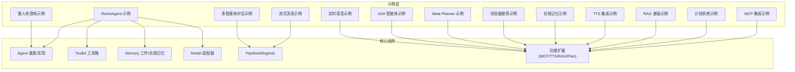
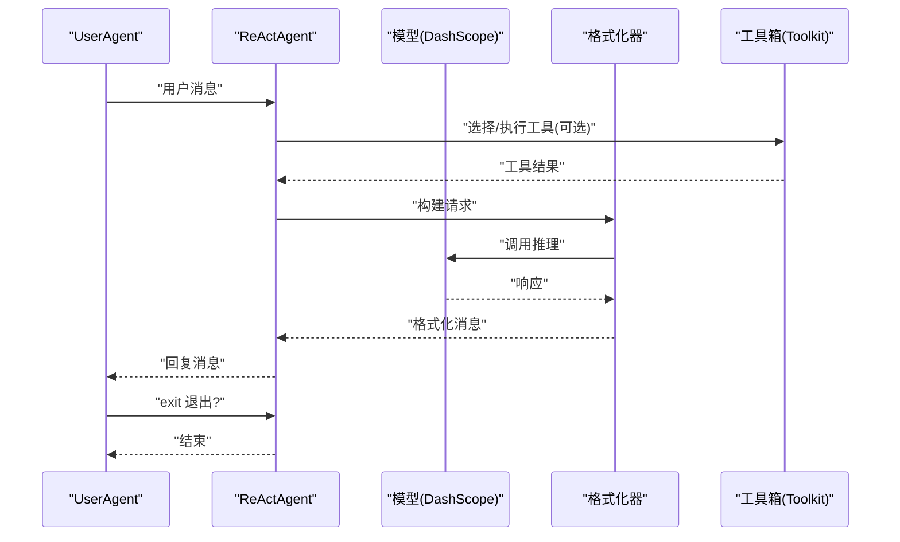
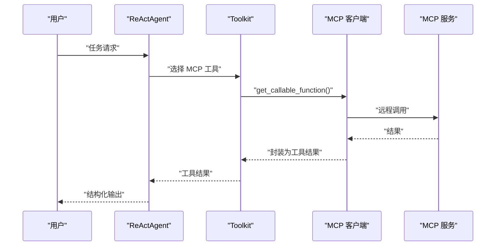
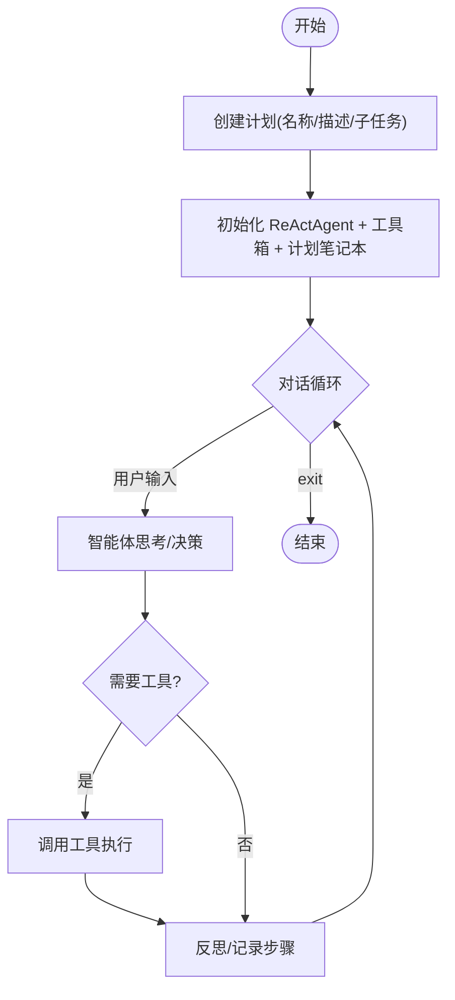
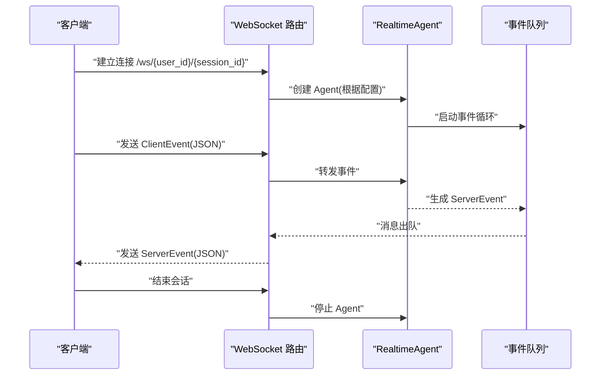
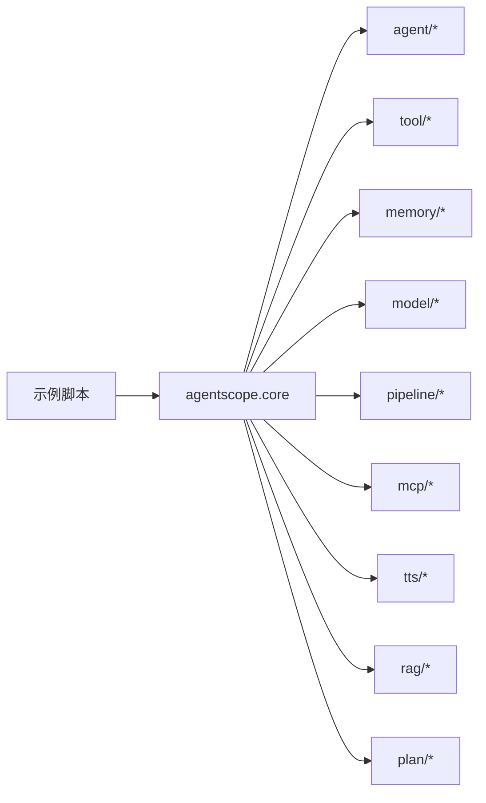

# 示例与教程

<cite>
**本文引用的文件**   
- [README.md](file://README.md)
- [main.py](file://examples/agent/react_agent/main.py)
- [main.py](file://examples/functionality/mcp/main.py)
- [main_manual_plan.py](file://examples/functionality/plan/main_manual_plan.py)
- [basic_usage.py](file://examples/functionality/rag/basic_usage.py)
- [single_agent.py](file://examples/functionality/stream_printing_messages/single_agent.py)
- [main.py](file://examples/functionality/tts/main.py)
- [main.py](file://examples/game/werewolves/main.py)
- [main.py](file://examples/agent/deep_research_agent/main.py)
- [main.py](file://examples/agent/browser_agent/main.py)
- [main.py](file://examples/agent/meta_planner_agent/main.py)
- [main.py](file://examples/agent/a2a_agent/main.py)
- [run_server.py](file://examples/agent/realtime_voice_agent/run_server.py)
- [main.py](file://examples/workflows/multiagent_conversation/main.py)
- [main.py](file://examples/functionality/structured_output/main.py)
- [personal_memory_example.py](file://examples/functionality/long_term_memory/reme/personal_memory_example.py)
</cite>

## 目录
1. [简介](#简介)
2. [项目结构](#项目结构)
3. [核心组件](#核心组件)
4. [架构总览](#架构总览)
5. [详细组件分析](#详细组件分析)
6. [依赖关系分析](#依赖关系分析)
7. [性能考虑](#性能考虑)
8. [故障排除指南](#故障排除指南)
9. [结论](#结论)
10. [附录](#附录)

## 简介
本指南面向希望系统学习 AgentScope 的开发者与使用者，提供从入门到进阶的完整学习路径。内容覆盖：
- 基础示例：Hello World（ReAct 智能体）、多智能体对话工作流
- 功能演示：MCP 集成、计划系统、结构化输出、RAG 应用、长短期记忆、会话管理、流式消息、TTS 集成
- 智能体示例：ReAct Agent、语音智能体、深度研究智能体、浏览器使用智能体、Meta Planner 智能体、A2A 智能体、实时语音智能体
- 游戏示例：九人狼人杀的多智能体博弈
- 部署与评估：示例与使用要点
- 故障排除与调试技巧

## 项目结构
AgentScope 示例与教程主要分布在 examples 目录下，按“功能/智能体/工作流/游戏/部署/评估”分类组织，便于循序渐进学习。

```mermaid
graph TB
root["根目录"] --> examples["examples/"]
examples --> agent["agent/"]
examples --> functionality["functionality/"]
examples --> workflows["workflows/"]
examples --> game["game/"]
examples --> deployment["deployment/"]
examples --> evaluation["evaluation/"]
agent --> react["react_agent/"]
agent --> voice["voice_agent/"]
agent --> deep_research["deep_research_agent/"]
agent --> browser["browser_agent/"]
agent --> meta_planner["meta_planner_agent/"]
agent --> a2a["a2a_agent/"]
agent --> realtime_voice["realtime_voice_agent/"]
functionality --> mcp["mcp/"]
functionality --> plan["plan/"]
functionality --> rag["rag/"]
functionality --> ltm["long_term_memory/"]
functionality --> stm["short_term_memory/"]
functionality --> session_sqlite["session_with_sqlite/"]
functionality --> stream["stream_printing_messages/"]
functionality --> structured["structured_output/"]
functionality --> tts["tts/"]
functionality --> vector_store["vector_store/"]
workflows --> multi_conv["multiagent_conversation/"]
workflows --> multi_debate["multiagent_debate/"]
workflows --> multi_concurrent["multiagent_concurrent/"]
workflows --> multi_realtime["multiagent_realtime/"]
game --> werewolves["werewolves/"]
deployment --> planning_agent["planning_agent/"]
evaluation --> ace_bench["ace_bench/"]
```

图示来源
- [README.md:321-366](file://README.md#L321-L366)

章节来源
- [README.md:168-366](file://README.md#L168-L366)

## 核心组件
- 智能体基类与实现：ReActAgent、UserAgent、RealtimeAgent、A2AAgent 等
- 工具系统：Toolkit、工具注册与异步包装
- 记忆模块：工作记忆 InMemoryMemory、长程记忆 ReMePersonalLongTermMemory 等
- 模型适配器：DashScopeChatModel、DashScopeRealtimeModel 等
- 流水线与消息中枢：MsgHub、sequential_pipeline、stream_printing_messages
- 功能扩展：MCP 客户端、TTS 实时合成、RAG 知识库、计划笔记本 PlanNotebook

章节来源
- [main.py:18-51](file://examples/agent/react_agent/main.py#L18-L51)
- [main.py:37-81](file://examples/functionality/structured_output/main.py#L37-L81)
- [main.py:245-296](file://examples/functionality/long_term_memory/reme/personal_memory_example.py#L245-L296)

## 架构总览
AgentScope 的示例遵循“智能体 + 工具 + 记忆 + 模型”的组合模式，通过消息驱动与流水线编排实现多智能体协作与复杂任务处理。

图示来源
- [main.py:18-51](file://examples/agent/react_agent/main.py#L18-L51)
- [main.py:34-111](file://examples/functionality/mcp/main.py#L34-L111)
- [main_manual_plan.py:23-102](file://examples/functionality/plan/main_manual_plan.py#L23-L102)
- [basic_usage.py:15-80](file://examples/functionality/rag/basic_usage.py#L15-L80)
- [single_agent.py:21-63](file://examples/functionality/stream_printing_messages/single_agent.py#L21-L63)
- [main.py:19-57](file://examples/functionality/tts/main.py#L19-L57)
- [personal_memory_example.py:245-296](file://examples/functionality/long_term_memory/reme/personal_memory_example.py#L245-L296)
- [main.py:27-80](file://examples/agent/browser_agent/main.py#L27-L80)
- [main.py:15-60](file://examples/agent/meta_planner_agent/main.py#L15-L60)
- [main.py:10-28](file://examples/agent/a2a_agent/main.py#L10-L28)
- [main.py:91-124](file://examples/game/werewolves/main.py#L91-L124)
- [run_server.py:49-188](file://examples/agent/realtime_voice_agent/run_server.py#L49-L188)
- [main.py:38-81](file://examples/workflows/multiagent_conversation/main.py#L38-L81)

## 详细组件分析

### Hello World 示例（ReAct 智能体）
- 目标：快速上手，体验用户与 ReAct 智能体的对话循环
- 关键点：初始化模型、格式化器、工作记忆、工具箱；用户代理与智能体交替输入输出；退出条件判断

图示来源
- [main.py:18-51](file://examples/agent/react_agent/main.py#L18-L51)

章节来源
- [main.py:18-51](file://examples/agent/react_agent/main.py#L18-L51)

### ReAct 智能体使用（工具系统集成）
- 目标：在 ReAct 中注册并使用本地工具（如执行 Shell/Python、查看文本文件）
- 关键点：工具注册、消息驱动的工具调用、内存状态保持

章节来源
- [main.py:18-51](file://examples/agent/react_agent/main.py#L18-L51)

### MCP 集成
- 目标：将外部 MCP 工具作为本地可调用函数接入智能体
- 支持传输：SSE、Streamable HTTP、StdIO
- 关键点：客户端连接/断开、注册到工具箱、结构化输出

图示来源
- [main.py:34-111](file://examples/functionality/mcp/main.py#L34-L111)

章节来源
- [main.py:34-111](file://examples/functionality/mcp/main.py#L34-L111)

### 计划系统（Plan Notebook）
- 目标：手动或自动构建子任务计划，指导智能体完成复杂任务
- 关键点：创建计划、注册工具、与智能体绑定、逐步执行

图示来源
- [main_manual_plan.py:23-102](file://examples/functionality/plan/main_manual_plan.py#L23-L102)

章节来源
- [main_manual_plan.py:23-102](file://examples/functionality/plan/main_manual_plan.py#L23-L102)

### 结构化输出
- 目标：引导智能体输出符合 Pydantic 模型的结构化数据
- 关键点：定义输出模型、调用智能体并传入 structured_model 参数

章节来源
- [main.py:37-81](file://examples/functionality/structured_output/main.py#L37-L81)

### RAG 应用（基础用法）
- 目标：文档读取、向量化、知识库构建与检索
- 关键点：文本/PDF 读取器、嵌入模型、向量存储、检索阈值与数量限制

章节来源
- [basic_usage.py:15-80](file://examples/functionality/rag/basic_usage.py#L15-L80)

### 长短期记忆（ReMe 个人记忆）
- 目标：展示 ReMe 个人记忆的五大接口：显式记录、关键词检索、直接记录/检索、与 ReAct 集成
- 关键点：异步上下文管理、嵌入模型维度、检索策略

章节来源
- [personal_memory_example.py:245-296](file://examples/functionality/long_term_memory/reme/personal_memory_example.py#L245-L296)

### 会话管理（SQLite 示例）
- 目标：基于 SQLite 的会话持久化与加载
- 关键点：会话保存/加载、状态恢复

章节来源
- [main.py:1-200](file://examples/functionality/session_with_sqlite/main.py#L1-L200)

### 流式消息打印
- 目标：以流式方式获取智能体输出，便于实时显示
- 关键点：禁用控制台输出、逐条消费 stream_printing_messages

章节来源
- [single_agent.py:21-63](file://examples/functionality/stream_printing_messages/single_agent.py#L21-L63)

### TTS 集成
- 目标：实时语音合成，配合 ReAct 智能体进行语音交互
- 关键点：配置实时 TTS 模型、语音参数、与智能体结合

章节来源
- [main.py:19-57](file://examples/functionality/tts/main.py#L19-L57)

### 语音智能体
- 目标：支持语音输入/输出的 ReAct 智能体
- 关键点：TTS/STT 集成、语音能力启用

章节来源
- [main.py:1-200](file://examples/agent/voice_agent/main.py#L1-L200)

### 深度研究智能体
- 目标：通过 MCP 搜索工具进行信息收集与整合
- 关键点：StdIO Stateful MCP 客户端、临时文件存储、最大工具结果长度

章节来源
- [main.py:16-84](file://examples/agent/deep_research_agent/main.py#L16-L84)

### 浏览器使用智能体
- 目标：通过 Playwright MCP 在网页上执行操作（导航、填写表单、下载等）
- 关键点：MCP 客户端连接、注册到工具箱、结构化输出最终结果

章节来源
- [main.py:27-80](file://examples/agent/browser_agent/main.py#L27-L80)

### Meta Planner 智能体
- 目标：将复杂任务分解为子任务，协调工作智能体完成
- 关键点：计划笔记本、工具函数 create_worker、最大迭代次数

章节来源
- [main.py:15-60](file://examples/agent/meta_planner_agent/main.py#L15-L60)

### A2A 智能体
- 目标：Agent-to-Agent 协议下的智能体交互
- 关键点：AgentCard 配置、用户与 A2A Agent 对话

章节来源
- [main.py:10-28](file://examples/agent/a2a_agent/main.py#L10-L28)

### 实时语音智能体（服务端）
- 目标：提供 WebSocket 接口，支持多模型实时语音交互
- 关键点：FastAPI + WebSocket、根据模型提供商选择模型与工具、事件分发

图示来源
- [run_server.py:49-188](file://examples/agent/realtime_voice_agent/run_server.py#L49-L188)

章节来源
- [run_server.py:49-188](file://examples/agent/realtime_voice_agent/run_server.py#L49-L188)

### 多智能体工作流（对话）
- 目标：使用 MsgHub 和流水线实现多智能体有序对话
- 关键点：参与者管理、广播消息、顺序流水线

章节来源
- [main.py:38-81](file://examples/workflows/multiagent_conversation/main.py#L38-L81)

### 游戏示例：九人狼人杀
- 目标：多智能体博弈，包含角色规则、回合制流程、状态持久化
- 关键点：角色系统提示词、多轮讨论与投票、JSON 会话存档

章节来源
- [main.py:91-124](file://examples/game/werewolves/main.py#L91-L124)

## 依赖关系分析
- 组件耦合：示例层通过统一的 Agent/Toolkit/Memory/Model 抽象与核心模块解耦
- 直接依赖：各示例直接依赖 agentscope.core 子模块（agent、tool、memory、model、pipeline、mcp、tts、rag、plan 等）
- 外部集成：MCP（HTTP/SSE/StdIO）、实时语音模型（DashScope/Gemini/OpenAI）、向量存储（Qdrant/MongoDB/OceanBase 等）

图示来源
- [main.py:6-15](file://examples/agent/react_agent/main.py#L6-L15)
- [main.py:20-25](file://examples/functionality/mcp/main.py#L20-L25)
- [main.py:6-12](file://examples/functionality/rag/basic_usage.py#L6-L12)

章节来源
- [main.py:6-15](file://examples/agent/react_agent/main.py#L6-L15)
- [main.py:20-25](file://examples/functionality/mcp/main.py#L20-L25)
- [basic_usage.py:6-12](file://examples/functionality/rag/basic_usage.py#L6-L12)

## 性能考虑
- 流式输出：开启模型流式输出可降低首字节延迟，适合实时交互
- 工具调用：合理拆分工具粒度，避免一次性调用过多外部服务
- 记忆与检索：长程记忆需注意嵌入维度与检索阈值，避免无关噪声
- 并发与会话：多智能体并发时建议使用消息中枢与队列，避免阻塞
- 模型选择：不同模型在推理速度与成本上有差异，按场景权衡

## 故障排除指南
- API Key 缺失：确认环境变量（如 DASHSCOPE_API_KEY、GAODE_API_KEY 等）已正确设置
- MCP 连接失败：检查 MCP 服务地址与传输协议（SSE/HTTP/StdIO），确保服务可用
- 浏览器 MCP 异常：确保 npx playwright-mcp 可用，示例中包含参数校验与资源清理逻辑
- 实时语音模型不可用：检查模型提供商与对应 API Key，服务端会检测可用性
- 会话加载失败：确认 JSON 会话文件存在且格式正确，检查会话 ID 与玩家映射
- 工具调用超时：适当增加超时时间或减少工具链路复杂度

章节来源
- [main.py:34-111](file://examples/functionality/mcp/main.py#L34-L111)
- [main.py:68-80](file://examples/agent/browser_agent/main.py#L68-L80)
- [run_server.py:39-47](file://examples/agent/realtime_voice_agent/run_server.py#L39-L47)
- [main.py:107-121](file://examples/game/werewolves/main.py#L107-L121)

## 结论
通过本指南，您可以从 Hello World 开始，逐步掌握 AgentScope 的核心能力：工具系统、记忆、计划、RAG、MCP、TTS、实时语音与多智能体工作流，并在狼人杀游戏中体验多智能体博弈。建议按“功能 → 智能体 → 工作流 → 游戏 → 部署/评估”的路径推进学习，结合源码注释与示例脚本理解关键流程。

## 附录
- 快速开始与安装参考：[README.md:135-166](file://README.md#L135-L166)
- 更多示例索引：[README.md:321-366](file://README.md#L321-L366)