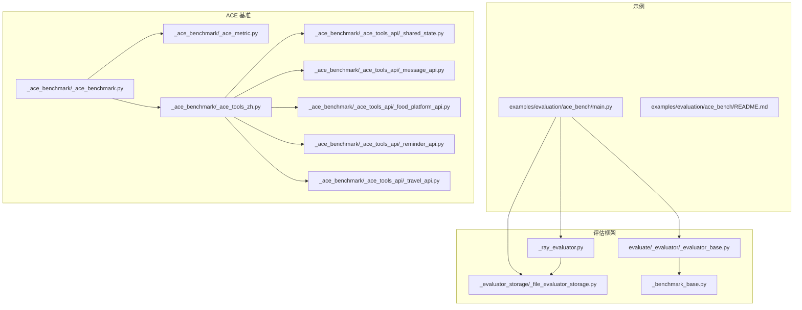
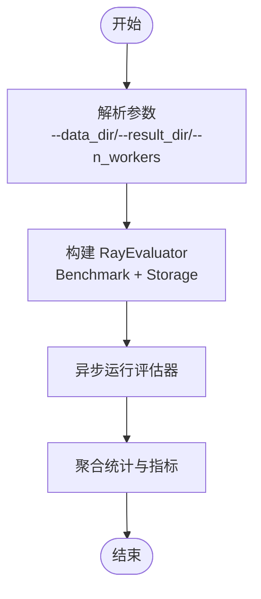
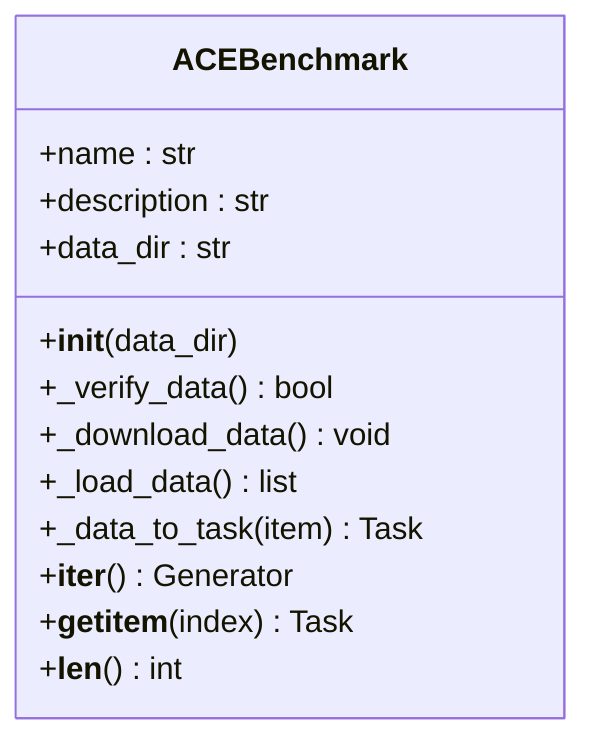
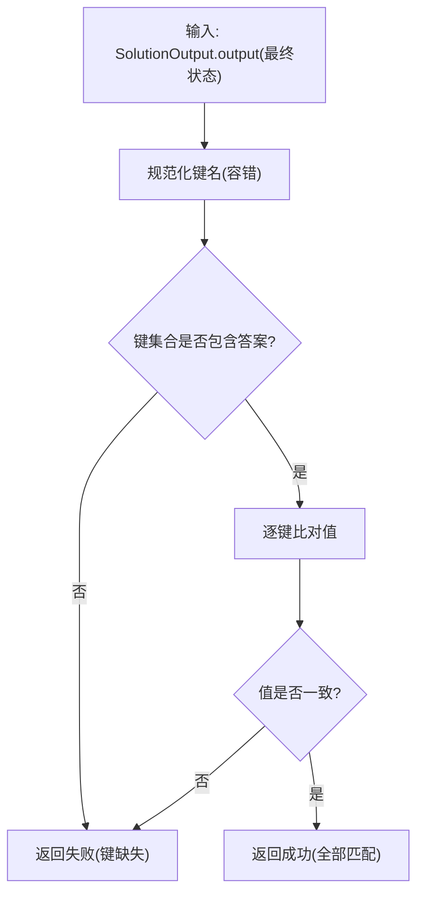
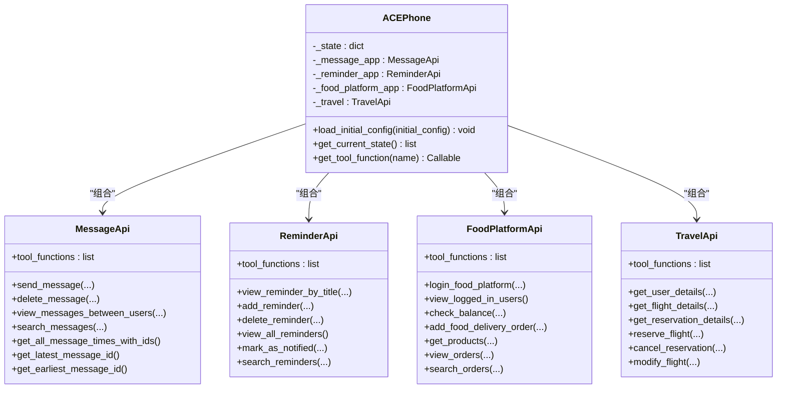
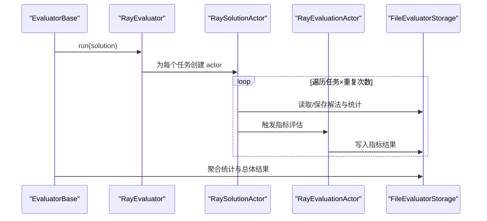
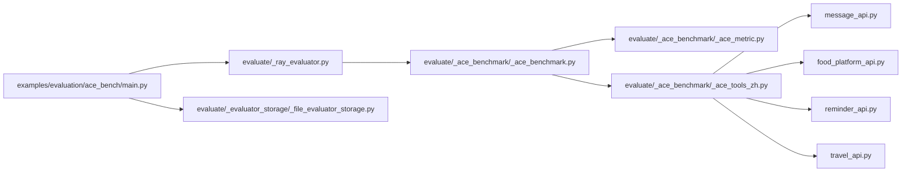

# 评估示例

<cite>
**本文引用的文件**
- [examples/evaluation/ace_bench/README.md](file://examples/evaluation/ace_bench/README.md)
- [examples/evaluation/ace_bench/main.py](file://examples/evaluation/ace_bench/main.py)
- [src/agentscope/evaluate/_ace_benchmark/__init__.py](file://src/agentscope/evaluate/_ace_benchmark/__init__.py)
- [src/agentscope/evaluate/_ace_benchmark/_ace_benchmark.py](file://src/agentscope/evaluate/_ace_benchmark/_ace_benchmark.py)
- [src/agentscope/evaluate/_ace_benchmark/_ace_metric.py](file://src/agentscope/evaluate/_ace_benchmark/_ace_metric.py)
- [src/agentscope/evaluate/_ace_benchmark/_ace_tools_zh.py](file://src/agentscope/evaluate/_ace_benchmark/_ace_tools_zh.py)
- [src/agentscope/evaluate/_ace_benchmark/_ace_tools_api/_food_platform_api.py](file://src/agentscope/evaluate/_ace_benchmark/_ace_tools_api/_food_platform_api.py)
- [src/agentscope/evaluate/_ace_benchmark/_ace_tools_api/_message_api.py](file://src/agentscope/evaluate/_ace_benchmark/_ace_tools_api/_message_api.py)
- [src/agentscope/evaluate/_ace_benchmark/_ace_tools_api/_reminder_api.py](file://src/agentscope/evaluate/_ace_benchmark/_ace_tools_api/_reminder_api.py)
- [src/agentscope/evaluate/_ace_benchmark/_ace_tools_api/_travel_api.py](file://src/agentscope/evaluate/_ace_benchmark/_ace_tools_api/_travel_api.py)
- [src/agentscope/evaluate/_ace_benchmark/_ace_tools_api/_shared_state.py](file://src/agentscope/evaluate/_ace_benchmark/_ace_tools_api/_shared_state.py)
- [src/agentscope/evaluate/_evaluator/_evaluator_base.py](file://src/agentscope/evaluate/_evaluator/_evaluator_base.py)
- [src/agentscope/evaluate/_evaluator/_ray_evaluator.py](file://src/agentscope/evaluate/_evaluator/_ray_evaluator.py)
- [src/agentscope/evaluate/_evaluator_storage/_file_evaluator_storage.py](file://src/agentscope/evaluate/_evaluator_storage/_file_evaluator_storage.py)
- [src/agentscope/evaluate/_benchmark_base.py](file://src/agentscope/evaluate/_benchmark_base.py)
</cite>

## 目录
1. [简介](#简介)
2. [项目结构](#项目结构)
3. [核心组件](#核心组件)
4. [架构总览](#架构总览)
5. [详细组件分析](#详细组件分析)
6. [依赖分析](#依赖分析)
7. [性能考量](#性能考量)
8. [故障排查指南](#故障排查指南)
9. [结论](#结论)
10. [附录](#附录)

## 简介
本教程面向使用 AgentScope 的评估与基准测试实践，聚焦于 ACE（AgentScope Challenge Evaluation）基准测试的实现与使用。ACEBench 是一个面向多步、多轮、原子能力与偏好等场景的智能体评测基准，AgentScope 在其上提供了完整的数据下载、任务构造、指标计算、分布式评估与结果聚合能力。

通过本教程，您将学会：
- 如何准备 ACEBench 测试数据与运行环境
- 如何配置并运行基于 Ray 的分布式评估器
- 如何理解并计算评估指标（准确率、过程准确率等）
- 如何自定义评估任务与扩展评估标准
- 如何进行结果可视化与报告生成
- 如何定位常见问题并进行性能优化

## 项目结构
ACE 评估示例位于 examples/evaluation/ace_bench，核心评估代码位于 src/agentscope/evaluate 下，围绕以下模块组织：
- 评估示例入口与运行脚本
- ACE 基准数据加载与任务构造
- 评估指标与工具模拟
- 分布式评估器与存储



图示来源
- [examples/evaluation/ace_bench/main.py:1-131](file://examples/evaluation/ace_bench/main.py#L1-L131)
- [src/agentscope/evaluate/_evaluator/_evaluator_base.py:1-305](file://src/agentscope/evaluate/_evaluator/_evaluator_base.py#L1-L305)
- [src/agentscope/evaluate/_evaluator/_ray_evaluator.py:1-268](file://src/agentscope/evaluate/_evaluator/_ray_evaluator.py#L1-L268)
- [src/agentscope/evaluate/_evaluator_storage/_file_evaluator_storage.py:1-461](file://src/agentscope/evaluate/_evaluator_storage/_file_evaluator_storage.py#L1-L461)
- [src/agentscope/evaluate/_benchmark_base.py:1-44](file://src/agentscope/evaluate/_benchmark_base.py#L1-L44)
- [src/agentscope/evaluate/_ace_benchmark/_ace_benchmark.py:1-241](file://src/agentscope/evaluate/_ace_benchmark/_ace_benchmark.py#L1-L241)
- [src/agentscope/evaluate/_ace_benchmark/_ace_metric.py:1-132](file://src/agentscope/evaluate/_ace_benchmark/_ace_metric.py#L1-L132)
- [src/agentscope/evaluate/_ace_benchmark/_ace_tools_zh.py:1-123](file://src/agentscope/evaluate/_ace_benchmark/_ace_tools_zh.py#L1-L123)
- [src/agentscope/evaluate/_ace_benchmark/_ace_tools_api/_shared_state.py:1-21](file://src/agentscope/evaluate/_ace_benchmark/_ace_tools_api/_shared_state.py#L1-L21)
- [src/agentscope/evaluate/_ace_benchmark/_ace_tools_api/_message_api.py:1-341](file://src/agentscope/evaluate/_ace_benchmark/_ace_tools_api/_message_api.py#L1-L341)
- [src/agentscope/evaluate/_ace_benchmark/_ace_tools_api/_food_platform_api.py:1-303](file://src/agentscope/evaluate/_ace_benchmark/_ace_tools_api/_food_platform_api.py#L1-L303)
- [src/agentscope/evaluate/_ace_benchmark/_ace_tools_api/_reminder_api.py:1-215](file://src/agentscope/evaluate/_ace_benchmark/_ace_tools_api/_reminder_api.py#L1-L215)
- [src/agentscope/evaluate/_ace_benchmark/_ace_tools_api/_travel_api.py:1-835](file://src/agentscope/evaluate/_ace_benchmark/_ace_tools_api/_travel_api.py#L1-L835)

章节来源
- [examples/evaluation/ace_bench/README.md:1-19](file://examples/evaluation/ace_bench/README.md#L1-L19)
- [examples/evaluation/ace_bench/main.py:1-131](file://examples/evaluation/ace_bench/main.py#L1-L131)

## 核心组件
- 评估示例入口：负责解析参数、构建评估器、调用评测流程与结果聚合。
- 基准类 ACEBenchmark：负责下载/校验数据、加载数据集、构造 Task、注入指标与工具。
- 指标类 ACEAccuracy、ACEProcessAccuracy：分别计算最终状态准确率与里程碑过程准确率。
- 工具模拟 ACEPhone 与四大应用 API：消息、提醒、美食平台、旅行预订，提供智能体可调用的工具函数。
- 评估器 EvaluatorBase 与 RayEvaluator：统一评估流程、分布式执行、指标评估与统计聚合。
- 存储 FileEvaluatorStorage：以文件系统持久化方案保存解法、指标、元信息与统计。

章节来源
- [src/agentscope/evaluate/_ace_benchmark/_ace_benchmark.py:19-241](file://src/agentscope/evaluate/_ace_benchmark/_ace_benchmark.py#L19-L241)
- [src/agentscope/evaluate/_ace_benchmark/_ace_metric.py:8-132](file://src/agentscope/evaluate/_ace_benchmark/_ace_metric.py#L8-L132)
- [src/agentscope/evaluate/_ace_benchmark/_ace_tools_zh.py:42-123](file://src/agentscope/evaluate/_ace_benchmark/_ace_tools_zh.py#L42-L123)
- [src/agentscope/evaluate/_evaluator/_evaluator_base.py:18-305](file://src/agentscope/evaluate/_evaluator/_evaluator_base.py#L18-L305)
- [src/agentscope/evaluate/_evaluator/_ray_evaluator.py:189-268](file://src/agentscope/evaluate/_evaluator/_ray_evaluator.py#L189-L268)
- [src/agentscope/evaluate/_evaluator_storage/_file_evaluator_storage.py:16-461](file://src/agentscope/evaluate/_evaluator_storage/_file_evaluator_storage.py#L16-L461)

## 架构总览
下图展示了从示例入口到评估器、指标与存储的整体流程。

```mermaid
sequenceDiagram
participant CLI as "命令行"
participant Main as "示例入口 main.py"
participant Eval as "RayEvaluator"
participant Actor as "RaySolutionActor/RayEvaluationActor"
participant Bench as "ACEBenchmark"
participant Task as "Task"
participant Metric as "指标(ACC/ProcACC)"
participant Store as "FileEvaluatorStorage"
CLI->>Main : 解析参数(--data_dir, --result_dir, --n_workers)
Main->>Eval : 创建评估器(RayEvaluator)
Eval->>Bench : 初始化基准(下载/加载数据)
Eval->>Actor : 并行调度任务(多 worker)
loop 遍历每个 Task × 重复次数
Actor->>Task : 生成 SolutionOutput
Task->>Metric : 计算指标
Metric-->>Store : 写入指标结果
Actor-->>Store : 写入解法与统计
end
Eval->>Store : 聚合统计与总体结果
Store-->>CLI : 输出评估元信息/聚合结果
```

图示来源
- [examples/evaluation/ace_bench/main.py:86-131](file://examples/evaluation/ace_bench/main.py#L86-L131)
- [src/agentscope/evaluate/_evaluator/_ray_evaluator.py:222-268](file://src/agentscope/evaluate/_evaluator/_ray_evaluator.py#L222-L268)
- [src/agentscope/evaluate/_evaluator/_evaluator_base.py:96-305](file://src/agentscope/evaluate/_evaluator/_evaluator_base.py#L96-L305)
- [src/agentscope/evaluate/_evaluator_storage/_file_evaluator_storage.py:258-329](file://src/agentscope/evaluate/_evaluator_storage/_file_evaluator_storage.py#L258-L329)

## 详细组件分析

### 示例入口与运行流程
- 参数解析：支持数据目录、结果目录与工作进程数。
- 评估器构建：使用 RayEvaluator 包装 Benchmark 与存储，支持分布式并行。
- 评测执行：异步运行评估器，自动聚合与落盘。



图示来源
- [examples/evaluation/ace_bench/main.py:86-131](file://examples/evaluation/ace_bench/main.py#L86-L131)

章节来源
- [examples/evaluation/ace_bench/main.py:86-131](file://examples/evaluation/ace_bench/main.py#L86-L131)

### 基准类 ACEBenchmark
- 数据下载与完整性校验：从远端仓库拉取中文数据与答案，确保本地存在后加载。
- 数据装载：合并问题、答案、里程碑与标签，形成统一数据集。
- 任务构造：将每条样本转换为 Task，注入工具函数与指标，并携带初始配置。
- 迭代访问：支持按索引与迭代器两种方式访问任务集合。



图示来源
- [src/agentscope/evaluate/_ace_benchmark/_ace_benchmark.py:19-241](file://src/agentscope/evaluate/_ace_benchmark/_ace_benchmark.py#L19-L241)

章节来源
- [src/agentscope/evaluate/_ace_benchmark/_ace_benchmark.py:58-241](file://src/agentscope/evaluate/_ace_benchmark/_ace_benchmark.py#L58-L241)

### 评估指标：准确率与过程准确率
- ACEAccuracy：比较智能体输出的最终状态与标准答案，容忍部分键名大小写差异，要求键集合一致且值完全相等。
- ACEProcessAccuracy：将工具调用轨迹序列化为字符串形式，校验是否包含所有里程碑步骤；缺失即判为失败。



图示来源
- [src/agentscope/evaluate/_ace_benchmark/_ace_metric.py:70-132](file://src/agentscope/evaluate/_ace_benchmark/_ace_metric.py#L70-L132)

章节来源
- [src/agentscope/evaluate/_ace_benchmark/_ace_metric.py:8-132](file://src/agentscope/evaluate/_ace_benchmark/_ace_metric.py#L8-L132)

### 工具模拟：ACEPhone 与四大应用 API
- ACEPhone：统一状态容器，聚合 WiFi、登录态与各应用状态；提供工具函数映射。
- 四大应用 API：
  - MessageApi：消息收发、检索、搜索、时间查询等。
  - ReminderApi：提醒创建、删除、查询、搜索与标记。
  - FoodPlatformApi：用户余额、下单、商品查询、订单查询与搜索。
  - TravelApi：用户认证、航班查询、预订、改签、取消与费用计算。
- 共享状态：通过 SharedState 统一访问 WiFi 与登录态。



图示来源
- [src/agentscope/evaluate/_ace_benchmark/_ace_tools_zh.py:42-123](file://src/agentscope/evaluate/_ace_benchmark/_ace_tools_zh.py#L42-L123)
- [src/agentscope/evaluate/_ace_benchmark/_ace_tools_api/_message_api.py:8-341](file://src/agentscope/evaluate/_ace_benchmark/_ace_tools_api/_message_api.py#L8-L341)
- [src/agentscope/evaluate/_ace_benchmark/_ace_tools_api/_reminder_api.py:8-215](file://src/agentscope/evaluate/_ace_benchmark/_ace_tools_api/_reminder_api.py#L8-L215)
- [src/agentscope/evaluate/_ace_benchmark/_ace_tools_api/_food_platform_api.py:7-303](file://src/agentscope/evaluate/_ace_benchmark/_ace_tools_api/_food_platform_api.py#L7-L303)
- [src/agentscope/evaluate/_ace_benchmark/_ace_tools_api/_travel_api.py:13-835](file://src/agentscope/evaluate/_ace_benchmark/_ace_tools_api/_travel_api.py#L13-L835)
- [src/agentscope/evaluate/_ace_benchmark/_ace_tools_api/_shared_state.py:5-21](file://src/agentscope/evaluate/_ace_benchmark/_ace_tools_api/_shared_state.py#L5-L21)

章节来源
- [src/agentscope/evaluate/_ace_benchmark/_ace_tools_zh.py:42-123](file://src/agentscope/evaluate/_ace_benchmark/_ace_tools_zh.py#L42-L123)
- [src/agentscope/evaluate/_ace_benchmark/_ace_tools_api/_message_api.py:1-341](file://src/agentscope/evaluate/_ace_benchmark/_ace_tools_api/_message_api.py#L1-L341)
- [src/agentscope/evaluate/_ace_benchmark/_ace_tools_api/_reminder_api.py:1-215](file://src/agentscope/evaluate/_ace_benchmark/_ace_tools_api/_reminder_api.py#L1-L215)
- [src/agentscope/evaluate/_ace_benchmark/_ace_tools_api/_food_platform_api.py:1-303](file://src/agentscope/evaluate/_ace_benchmark/_ace_tools_api/_food_platform_api.py#L1-L303)
- [src/agentscope/evaluate/_ace_benchmark/_ace_tools_api/_travel_api.py:1-835](file://src/agentscope/evaluate/_ace_benchmark/_ace_tools_api/_travel_api.py#L1-L835)
- [src/agentscope/evaluate/_ace_benchmark/_ace_tools_api/_shared_state.py:1-21](file://src/agentscope/evaluate/_ace_benchmark/_ace_tools_api/_shared_state.py#L1-L21)

### 评估器与存储
- EvaluatorBase：统一评估生命周期，保存元信息与任务元数据，聚合指标分布与统计。
- RayEvaluator：基于 Ray 的分布式执行，SolutionActor 生成解法，EvaluationActor 评估指标，支持并发与断点续跑。
- FileEvaluatorStorage：以文件系统组织解法、指标、统计与聚合结果，提供读写与存在性检查。



图示来源
- [src/agentscope/evaluate/_evaluator/_evaluator_base.py:96-305](file://src/agentscope/evaluate/_evaluator/_evaluator_base.py#L96-L305)
- [src/agentscope/evaluate/_evaluator/_ray_evaluator.py:189-268](file://src/agentscope/evaluate/_evaluator/_ray_evaluator.py#L189-L268)
- [src/agentscope/evaluate/_evaluator_storage/_file_evaluator_storage.py:16-461](file://src/agentscope/evaluate/_evaluator_storage/_file_evaluator_storage.py#L16-L461)

章节来源
- [src/agentscope/evaluate/_evaluator/_evaluator_base.py:18-305](file://src/agentscope/evaluate/_evaluator/_evaluator_base.py#L18-L305)
- [src/agentscope/evaluate/_evaluator/_ray_evaluator.py:14-268](file://src/agentscope/evaluate/_evaluator/_ray_evaluator.py#L14-L268)
- [src/agentscope/evaluate/_evaluator_storage/_file_evaluator_storage.py:16-461](file://src/agentscope/evaluate/_evaluator_storage/_file_evaluator_storage.py#L16-L461)

## 依赖分析
- 组件内聚与耦合
  - ACEBenchmark 与指标、工具紧密耦合，便于在任务构造阶段注入评估所需信息。
  - 评估器与存储解耦，便于替换不同存储后端（如数据库）。
  - RayEvaluator 通过 Actor 模式实现分布式执行，避免共享状态竞争。
- 外部依赖
  - Ray：用于分布式并行执行与 Actor 管理。
  - 文件系统：作为默认存储介质，支持断点续跑与结果复现。
  - 第三方模型服务：示例中使用 DashScope 模型，可替换为其他模型适配器。



图示来源
- [examples/evaluation/ace_bench/main.py:12-20](file://examples/evaluation/ace_bench/main.py#L12-L20)
- [src/agentscope/evaluate/_evaluator/_ray_evaluator.py:189-268](file://src/agentscope/evaluate/_evaluator/_ray_evaluator.py#L189-L268)
- [src/agentscope/evaluate/_evaluator_storage/_file_evaluator_storage.py:16-461](file://src/agentscope/evaluate/_evaluator_storage/_file_evaluator_storage.py#L16-L461)
- [src/agentscope/evaluate/_ace_benchmark/_ace_benchmark.py:13-227](file://src/agentscope/evaluate/_ace_benchmark/_ace_benchmark.py#L13-L227)
- [src/agentscope/evaluate/_ace_benchmark/_ace_tools_zh.py:6-118](file://src/agentscope/evaluate/_ace_benchmark/_ace_tools_zh.py#L6-L118)
- [src/agentscope/evaluate/_ace_benchmark/_ace_tools_api/_message_api.py:1-341](file://src/agentscope/evaluate/_ace_benchmark/_ace_tools_api/_message_api.py#L1-L341)
- [src/agentscope/evaluate/_ace_benchmark/_ace_tools_api/_food_platform_api.py:1-303](file://src/agentscope/evaluate/_ace_benchmark/_ace_tools_api/_food_platform_api.py#L1-L303)
- [src/agentscope/evaluate/_ace_benchmark/_ace_tools_api/_reminder_api.py:1-215](file://src/agentscope/evaluate/_ace_benchmark/_ace_tools_api/_reminder_api.py#L1-L215)
- [src/agentscope/evaluate/_ace_benchmark/_ace_tools_api/_travel_api.py:1-835](file://src/agentscope/evaluate/_ace_benchmark/_ace_tools_api/_travel_api.py#L1-L835)

章节来源
- [src/agentscope/evaluate/_ace_benchmark/__init__.py:1-17](file://src/agentscope/evaluate/_ace_benchmark/__init__.py#L1-L17)

## 性能考量
- 并行度控制：通过 n_workers 控制 Ray 并发度，平衡吞吐与资源占用。
- I/O 优化：文件存储采用分层目录结构，避免单目录文件过多；建议在高并发时使用更高性能存储。
- 指标计算：过程准确率对轨迹字符串化有开销，建议在保证可读性的前提下简化轨迹字段。
- 模型调用：示例中使用非流式模型，可结合流式输出与缓存策略降低延迟。
- 断点续跑：存储层支持存在性检查，可在中断后恢复评估，减少重复计算。

## 故障排查指南
- Ray 未安装
  - 现象：导入 RayEvaluator 抛出 ImportError。
  - 处理：安装 Ray 后重试。
- 数据目录非法
  - 现象：传入的 data_dir 不是目录导致异常。
  - 处理：确认路径存在且为目录，或允许自动创建。
- 任务未完成
  - 现象：聚合阶段发现某些任务缺少评估结果。
  - 处理：检查存储中对应文件是否存在与非空，必要时重新运行对应任务。
- 指标计算异常
  - 现象：最终状态指标报错“键缺失”或“值不一致”。
  - 处理：核对智能体输出键集合与值，修正工具调用逻辑或输出格式。
- 工具函数不可用
  - 现象：get_tool_function 抛出未找到工具异常。
  - 处理：确认 Task.metadata 中注册的工具名称与应用 API 的 tool_functions 列表一致。

章节来源
- [src/agentscope/evaluate/_evaluator/_ray_evaluator.py:14-36](file://src/agentscope/evaluate/_evaluator/_ray_evaluator.py#L14-L36)
- [src/agentscope/evaluate/_ace_benchmark/_ace_benchmark.py:130-148](file://src/agentscope/evaluate/_ace_benchmark/_ace_benchmark.py#L130-L148)
- [src/agentscope/evaluate/_evaluator_storage/_file_evaluator_storage.py:206-257](file://src/agentscope/evaluate/_evaluator_storage/_file_evaluator_storage.py#L206-L257)
- [src/agentscope/evaluate/_ace_benchmark/_ace_metric.py:90-115](file://src/agentscope/evaluate/_ace_benchmark/_ace_metric.py#L90-L115)
- [src/agentscope/evaluate/_ace_benchmark/_ace_tools_zh.py:120-123](file://src/agentscope/evaluate/_ace_benchmark/_ace_tools_zh.py#L120-L123)

## 结论
本教程系统梳理了 AgentScope 上 ACE 基准的评估实现与使用方法，覆盖数据准备、评测流程、指标计算、分布式执行与结果存储。通过示例入口与 RayEvaluator 的组合，可快速搭建可扩展、可观测、可复现的智能体评测体系，并在此基础上定制任务与指标，满足多样化的评估需求。

## 附录

### 运行步骤速览
- 安装依赖：确保已安装 AgentScope 与 Ray。
- 准备数据：首次运行会自动下载 ACEBench 数据至 data_dir。
- 运行评估：使用示例入口脚本，指定数据目录、结果目录与并行工作数。
- 查看结果：在结果目录中查看评估元信息、任务元信息、解法、指标与聚合统计。

章节来源
- [examples/evaluation/ace_bench/README.md:9-19](file://examples/evaluation/ace_bench/README.md#L9-L19)
- [examples/evaluation/ace_bench/main.py:86-131](file://examples/evaluation/ace_bench/main.py#L86-L131)