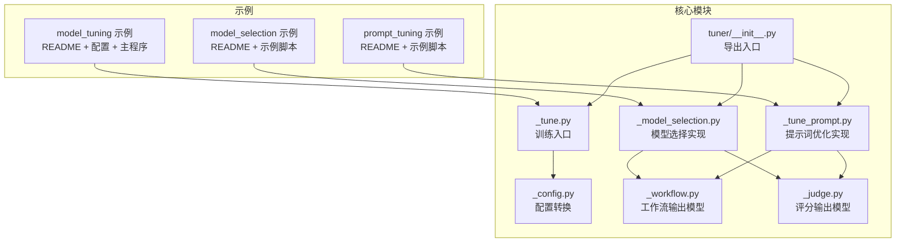
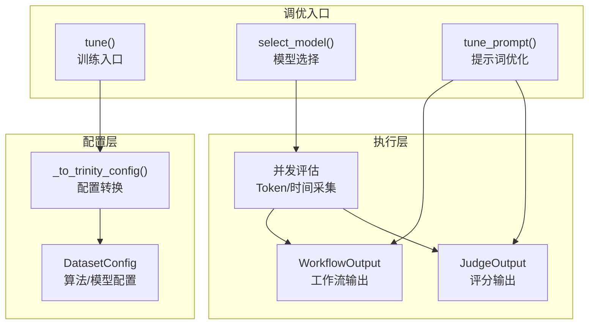
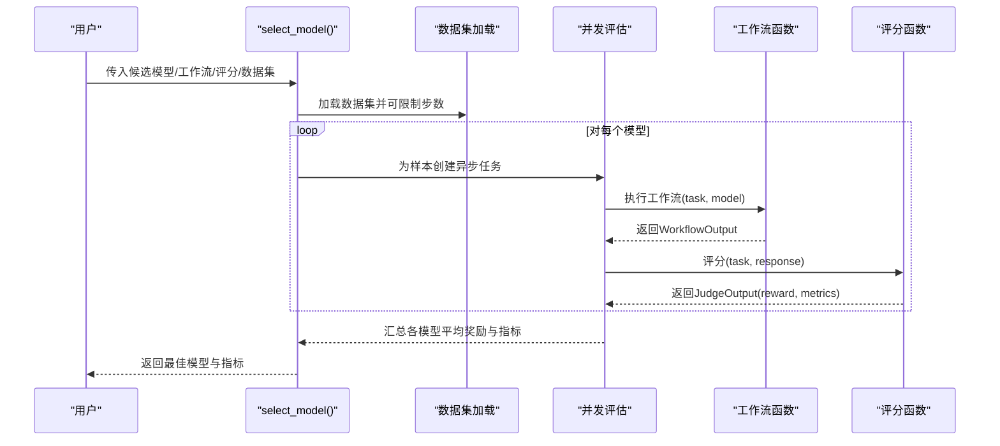
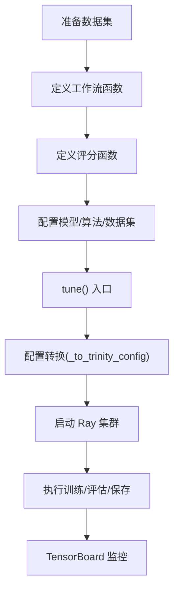
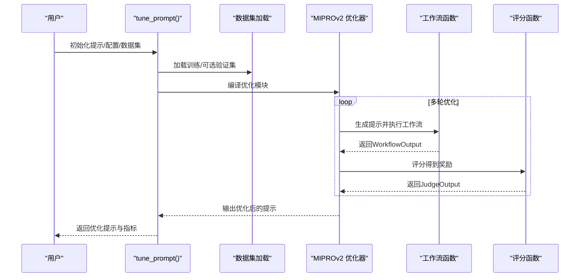
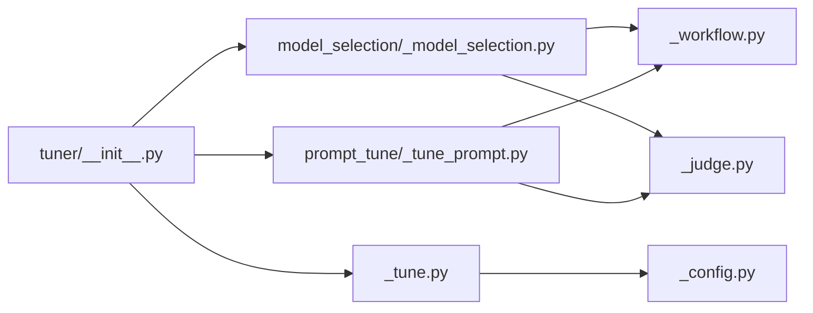

# 调优示例

<cite>
**本文引用的文件**
- [README.md](file://examples/tuner/model_selection/README.md)
- [example_bleu.py](file://examples/tuner/model_selection/example_bleu.py)
- [example_token_usage.py](file://examples/tuner/model_selection/example_token_usage.py)
- [README.md](file://examples/tuner/model_tuning/README.md)
- [config.yaml](file://examples/tuner/model_tuning/config.yaml)
- [main.py](file://examples/tuner/model_tuning/main.py)
- [README.md](file://examples/tuner/prompt_tuning/README.md)
- [example.py](file://examples/tuner/prompt_tuning/example.py)
- [__init__.py](file://src/agentscope/tuner/__init__.py)
- [_tune.py](file://src/agentscope/tuner/_tune.py)
- [_config.py](file://src/agentscope/tuner/_config.py)
- [_model_selection.py](file://src/agentscope/tuner/model_selection/_model_selection.py)
- [_tune_prompt.py](file://src/agentscope/tuner/prompt_tune/_tune_prompt.py)
- [_judge.py](file://src/agentscope/tuner/_judge.py)
- [_workflow.py](file://src/agentscope/tuner/_workflow.py)
</cite>

## 目录
1. [简介](#简介)
2. [项目结构](#项目结构)
3. [核心组件](#核心组件)
4. [架构总览](#架构总览)
5. [详细组件分析](#详细组件分析)
6. [依赖关系分析](#依赖关系分析)
7. [性能考量](#性能考量)
8. [故障排查指南](#故障排查指南)
9. [结论](#结论)
10. [附录](#附录)

## 简介
本教程围绕 AgentScope 的调优示例，系统讲解三类调优能力：模型选择（基于 BLEU 分数与 Token 使用量）、模型微调（强化学习训练）、提示词调优（系统提示优化）。内容涵盖：
- 模型选择：如何通过工作流函数、评分函数与数据集自动挑选最优模型，并支持 BLEU 与 Token 使用等指标。
- 模型微调：从配置文件到训练参数，再到效果评估的完整流程。
- 提示词调优：系统提示模板设计、参数搜索与性能对比。
- 实验管理与最佳实践：实验命名、监控、日志与复现实验。

## 项目结构
调优示例位于 examples/tuner 下，分别对应三种调优方式：
- model_selection：模型选择示例与指南
- model_tuning：模型微调示例与指南
- prompt_tuning：提示词调优示例与指南

同时，核心调优模块位于 src/agentscope/tuner 及其子包中，提供统一的接口与配置转换能力。

图表来源
- [README.md:1-294](file://examples/tuner/model_selection/README.md#L1-L294)
- [README.md:1-367](file://examples/tuner/model_tuning/README.md#L1-L367)
- [README.md:1-349](file://examples/tuner/prompt_tuning/README.md#L1-L349)
- [__init__.py:1-31](file://src/agentscope/tuner/__init__.py#L1-L31)
- [_tune.py:1-97](file://src/agentscope/tuner/_tune.py#L1-L97)
- [_config.py:1-268](file://src/agentscope/tuner/_config.py#L1-L268)
- [_model_selection.py:1-404](file://src/agentscope/tuner/model_selection/_model_selection.py#L1-L404)
- [_tune_prompt.py:1-254](file://src/agentscope/tuner/prompt_tune/_tune_prompt.py#L1-L254)
- [_workflow.py:1-55](file://src/agentscope/tuner/_workflow.py#L1-L55)
- [_judge.py:1-40](file://src/agentscope/tuner/_judge.py#L1-L40)

章节来源
- [README.md:1-294](file://examples/tuner/model_selection/README.md#L1-L294)
- [README.md:1-367](file://examples/tuner/model_tuning/README.md#L1-L367)
- [README.md:1-349](file://examples/tuner/prompt_tuning/README.md#L1-L349)

## 核心组件
- 统一接口导出：tuner/__init__.py 导出 tune、select_model、tune_prompt 等主入口，以及配置类与类型定义。
- 工作流与评分模型：WorkflowOutput、JudgeOutput 作为工作流与评分函数的标准返回结构，便于在不同调优场景复用。
- 配置转换：_config.py 将 AgentScope 的配置对象转换为 Trinity-RFT 所需的配置，并支持从 YAML 加载或默认模板生成。
- 训练入口：_tune.py 校验函数签名、构建配置并启动训练流程，内部集成 Ray 集群与监控器。
- 模型选择：_model_selection.py 支持并发评估候选模型，自动采集执行时间与 Token 使用，聚合指标并选择最优模型。
- 提示词优化：_tune_prompt.py 基于 DSPy 的 MIPROv2 进行系统提示优化，支持基线对比与评估。

章节来源
- [__init__.py:1-31](file://src/agentscope/tuner/__init__.py#L1-L31)
- [_workflow.py:1-55](file://src/agentscope/tuner/_workflow.py#L1-L55)
- [_judge.py:1-40](file://src/agentscope/tuner/_judge.py#L1-L40)
- [_config.py:1-268](file://src/agentscope/tuner/_config.py#L1-L268)
- [_tune.py:1-97](file://src/agentscope/tuner/_tune.py#L1-L97)
- [_model_selection.py:1-404](file://src/agentscope/tuner/model_selection/_model_selection.py#L1-L404)
- [_tune_prompt.py:1-254](file://src/agentscope/tuner/prompt_tune/_tune_prompt.py#L1-L254)

## 架构总览
AgentScope 调优的整体架构由“工作流函数 + 评分函数 + 数据集 + 模型/提示”构成，通过统一入口完成配置转换与执行。

图表来源
- [_tune.py:16-97](file://src/agentscope/tuner/_tune.py#L16-L97)
- [_config.py:20-121](file://src/agentscope/tuner/_config.py#L20-L121)
- [_model_selection.py:75-241](file://src/agentscope/tuner/model_selection/_model_selection.py#L75-L241)
- [_tune_prompt.py:102-254](file://src/agentscope/tuner/prompt_tune/_tune_prompt.py#L102-L254)
- [_workflow.py:7-28](file://src/agentscope/tuner/_workflow.py#L7-L28)
- [_judge.py:7-17](file://src/agentscope/tuner/_judge.py#L7-L17)

## 详细组件分析

### 模型选择（BLEU 与 Token 使用）
- 目标：在候选模型集合中，依据任务指标（如 BLEU 或平均 Token 消耗）选择最优模型。
- 关键流程：
  - 准备数据集：支持本地文件与远程数据源，可限制采样步数。
  - 定义工作流函数：接收 task 与 model，返回 WorkflowOutput。
  - 定义评分函数：接收 task 与 response，返回 JudgeOutput；可自定义 BLEU、时间、Token 等指标。
  - 并发评估：对每个样本与每个模型进行异步评估，收集执行时间与 Token 使用，聚合指标后比较平均奖励。
  - 选择最优：按平均奖励选择最佳模型，并返回详细指标。

图表来源
- [_model_selection.py:75-241](file://src/agentscope/tuner/model_selection/_model_selection.py#L75-L241)
- [_model_selection.py:304-404](file://src/agentscope/tuner/model_selection/_model_selection.py#L304-L404)
- [_workflow.py:7-28](file://src/agentscope/tuner/_workflow.py#L7-L28)
- [_judge.py:7-17](file://src/agentscope/tuner/_judge.py#L7-L17)

章节来源
- [README.md:1-294](file://examples/tuner/model_selection/README.md#L1-L294)
- [example_bleu.py:1-183](file://examples/tuner/model_selection/example_bleu.py#L1-L183)
- [example_token_usage.py:1-107](file://examples/tuner/model_selection/example_token_usage.py#L1-L107)
- [_model_selection.py:1-404](file://src/agentscope/tuner/model_selection/_model_selection.py#L1-L404)

### 模型微调（强化学习）
- 目标：通过 RL 训练 Agent 工作流，优化模型权重以提升任务性能。
- 关键流程：
  - 准备数据集：支持本地与远程数据集，可预览样本结构。
  - 定义工作流函数：接收 task、model、auxiliary_models，返回 WorkflowOutput。
  - 定义评分函数：接收 task、response、auxiliary_models，返回 JudgeOutput。
  - 配置训练：通过 AlgorithmConfig、TunerModelConfig、DatasetConfig 指定算法、模型与数据集。
  - 启动训练：tune() 内部转换为 Trinity-RFT 配置，启动 Ray 集群并运行训练，保存检查点与 TensorBoard 日志。

图表来源
- [README.md:1-367](file://examples/tuner/model_tuning/README.md#L1-L367)
- [_tune.py:16-97](file://src/agentscope/tuner/_tune.py#L16-L97)
- [_config.py:20-121](file://src/agentscope/tuner/_config.py#L20-L121)
- [config.yaml:1-54](file://examples/tuner/model_tuning/config.yaml#L1-L54)
- [main.py:1-149](file://examples/tuner/model_tuning/main.py#L1-L149)

章节来源
- [README.md:1-367](file://examples/tuner/model_tuning/README.md#L1-L367)
- [config.yaml:1-54](file://examples/tuner/model_tuning/config.yaml#L1-L54)
- [main.py:1-149](file://examples/tuner/model_tuning/main.py#L1-L149)
- [_tune.py:1-97](file://src/agentscope/tuner/_tune.py#L1-L97)
- [_config.py:1-268](file://src/agentscope/tuner/_config.py#L1-L268)

### 提示词调优（系统提示优化）
- 目标：在不修改模型权重的前提下，自动优化系统提示以提升性能。
- 关键流程：
  - 准备数据集：支持本地文件与远程数据集。
  - 定义工作流函数：接收 task 与 system_prompt，返回 WorkflowOutput。
  - 定义评分函数：接收 task 与 response，返回 JudgeOutput。
  - 配置优化：PromptTuneConfig 指定教师模型、优化强度、并可开启基线对比。
  - 执行优化：tune_prompt() 基于 DSPy 的 MIPROv2 进行优化，并可对验证集进行对比评估。

图表来源
- [README.md:1-349](file://examples/tuner/prompt_tuning/README.md#L1-L349)
- [_tune_prompt.py:102-254](file://src/agentscope/tuner/prompt_tune/_tune_prompt.py#L102-L254)
- [example.py:1-124](file://examples/tuner/prompt_tuning/example.py#L1-L124)

章节来源
- [README.md:1-349](file://examples/tuner/prompt_tuning/README.md#L1-L349)
- [example.py:1-124](file://examples/tuner/prompt_tuning/example.py#L1-L124)
- [_tune_prompt.py:1-254](file://src/agentscope/tuner/prompt_tune/_tune_prompt.py#L1-L254)

## 依赖关系分析
- 统一导出：tuner/__init__.py 将 select_model、tune_prompt、tune 等入口集中导出，便于外部直接调用。
- 配置转换：_config.py 将 AgentScope 的 DatasetConfig、AlgorithmConfig、TunerModelConfig 转换为 Trinity-RFT 的 Config，支持从 YAML 加载或默认模板生成。
- 训练入口：_tune.py 在启动前校验工作流与评分函数签名，随后调用 Trinity-RFT 的 run_stage 执行训练。
- 模型选择：_model_selection.py 内部使用并发与 OpenTelemetry 追踪，自动采集执行时间与 Token 使用，聚合指标后选择最佳模型。
- 提示词优化：_tune_prompt.py 内部封装工作流与评分函数，基于 DSPy 的 MIPROv2 进行优化，并支持基线对比。

图表来源
- [__init__.py:1-31](file://src/agentscope/tuner/__init__.py#L1-L31)
- [_tune.py:1-97](file://src/agentscope/tuner/_tune.py#L1-L97)
- [_config.py:1-268](file://src/agentscope/tuner/_config.py#L1-L268)
- [_model_selection.py:1-404](file://src/agentscope/tuner/model_selection/_model_selection.py#L1-L404)
- [_tune_prompt.py:1-254](file://src/agentscope/tuner/prompt_tune/_tune_prompt.py#L1-L254)
- [_workflow.py:1-55](file://src/agentscope/tuner/_workflow.py#L1-L55)
- [_judge.py:1-40](file://src/agentscope/tuner/_judge.py#L1-L40)

章节来源
- [__init__.py:1-31](file://src/agentscope/tuner/__init__.py#L1-L31)
- [_tune.py:1-97](file://src/agentscope/tuner/_tune.py#L1-L97)
- [_config.py:1-268](file://src/agentscope/tuner/_config.py#L1-L268)
- [_model_selection.py:1-404](file://src/agentscope/tuner/model_selection/_model_selection.py#L1-L404)
- [_tune_prompt.py:1-254](file://src/agentscope/tuner/prompt_tune/_tune_prompt.py#L1-L254)

## 性能考量
- 模型选择
  - 并发度控制：通过信号量限制最大并发评估数，避免资源争抢。
  - 指标聚合：对执行时间与 Token 使用进行平均，减少噪声影响。
  - 数据集规模：可通过 total_steps 控制评估样本数量，平衡速度与稳定性。
- 模型微调
  - 硬件要求：多 GPU、Ray 集群与 Trinity-RFT 环境。
  - 配置调优：batch_size、group_size、learning_rate 等直接影响收敛速度与稳定性。
  - 监控：TensorBoard 日志便于观察奖励曲线与损失变化。
- 提示词优化
  - 优化强度：light/medium/heavy 影响计算成本与优化深度。
  - 教师模型：lm_model_name 决定优化器的推理能力与稳定性。
  - 基线对比：开启 compare_performance 可量化优化收益。

[本节为通用指导，无需特定文件来源]

## 故障排查指南
- 函数签名错误
  - 工作流/评分函数必须满足必需参数与允许参数约束，否则会抛出异常。请确保参数名与类型符合要求。
- 缺少依赖
  - 模型选择需要 datasets；模型微调需要安装 Trinity-RFT；提示词优化需要 dspy。
- Ray 集群问题
  - _tune.py 中会尝试启动/停止 Ray 集群，若失败请检查环境变量与网络配置。
- Token 使用与执行时间未采集
  - 模型选择内部通过追踪器与计数器采集 Token 使用，若未出现请确认使用的模型与格式化器支持统计。

章节来源
- [_config.py:184-268](file://src/agentscope/tuner/_config.py#L184-L268)
- [_tune.py:61-97](file://src/agentscope/tuner/_tune.py#L61-L97)
- [_model_selection.py:1-404](file://src/agentscope/tuner/model_selection/_model_selection.py#L1-L404)

## 结论
本教程展示了 AgentScope 在模型选择、模型微调与提示词优化三方面的完整实践路径。通过统一的接口与配置转换，用户可以快速搭建评估与训练流程，并结合 BLEU、Token 使用与奖励曲线等指标进行系统性优化。建议在实际项目中结合硬件条件与业务目标，合理选择调优策略并建立规范的实验管理流程。

[本节为总结性内容，无需特定文件来源]

## 附录
- 快速开始
  - 模型选择：参考 model_selection 示例脚本与 README，准备数据集与评分函数后直接运行。
  - 模型微调：准备数据集与配置文件，设置 Ray 集群后运行主程序。
  - 提示词优化：准备训练/验证数据集与初始提示，运行示例脚本即可获得优化提示。
- 最佳实践
  - 明确目标指标：BLEU、Token 消耗、延迟、成本等，优先选择与业务强相关的指标。
  - 规范实验管理：为每次实验指定唯一名称，记录配置与结果，便于复现与对比。
  - 渐进式优化：先做提示词优化（低成本），再考虑模型微调（高成本）。

[本节为补充说明，无需特定文件来源]