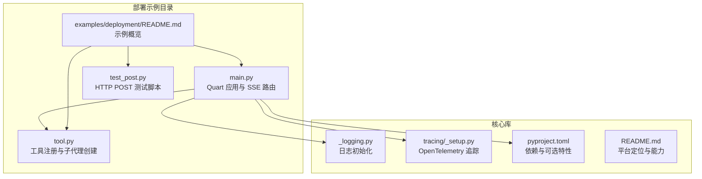
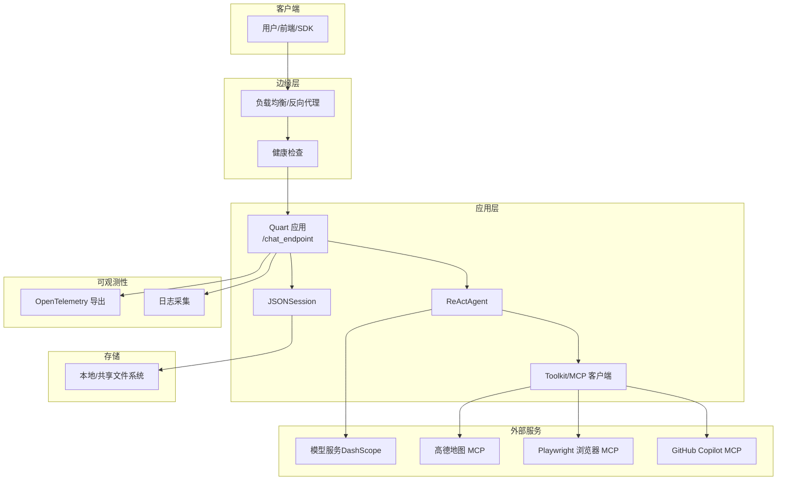
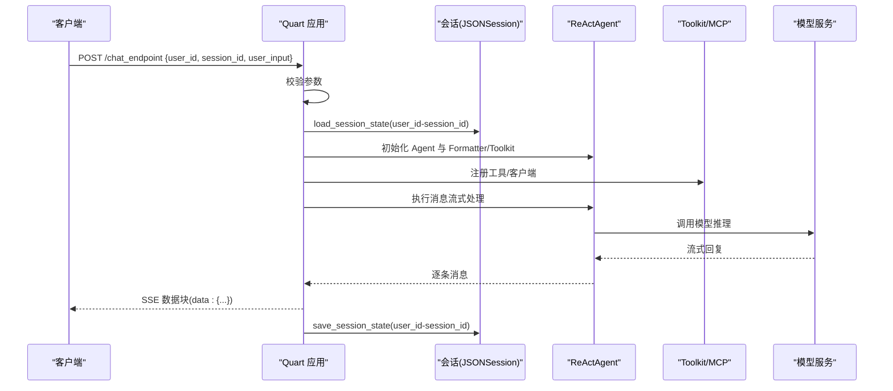
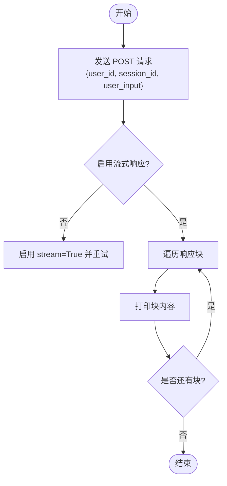
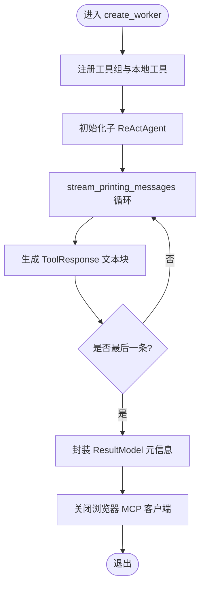
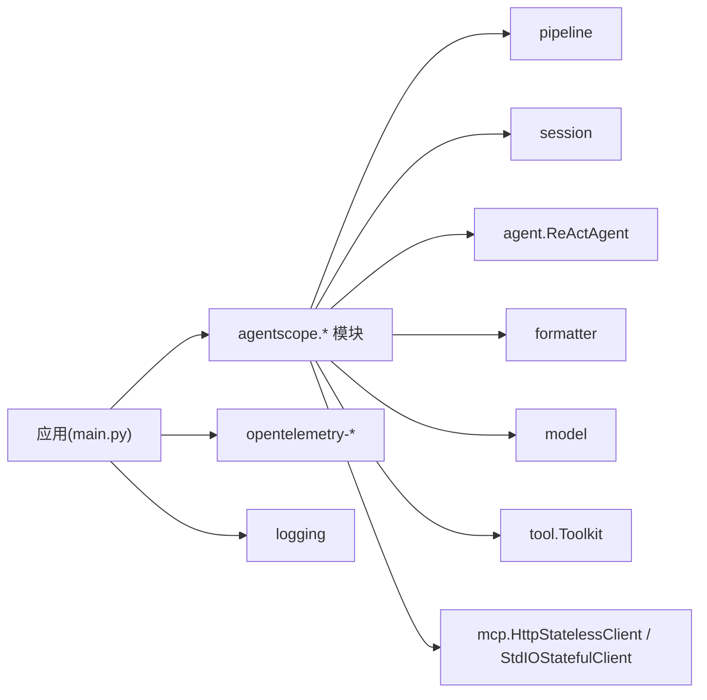

# 部署示例

<cite>
**本文引用的文件**   
- [examples/deployment/planning_agent/main.py](file://examples/deployment/planning_agent/main.py)
- [examples/deployment/planning_agent/test_post.py](file://examples/deployment/planning_agent/test_post.py)
- [examples/deployment/planning_agent/tool.py](file://examples/deployment/planning_agent/tool.py)
- [examples/deployment/README.md](file://examples/deployment/README.md)
- [examples/agent/a2a_agent/setup_a2a_server.py](file://examples/agent/a2a_agent/setup_a2a_server.py)
- [pyproject.toml](file://pyproject.toml)
- [README.md](file://README.md)
- [src/agentscope/_logging.py](file://src/agentscope/_logging.py)
- [src/agentscope/tracing/_setup.py](file://src/agentscope/tracing/_setup.py)
- [.github/workflows/sphinx_docs.yml](file://.github/workflows/sphinx_docs.yml)
</cite>

## 目录
1. [简介](#简介)
2. [项目结构](#项目结构)
3. [核心组件](#核心组件)
4. [架构总览](#架构总览)
5. [详细组件分析](#详细组件分析)
6. [依赖分析](#依赖分析)
7. [性能考量](#性能考量)
8. [故障排查指南](#故障排查指南)
9. [结论](#结论)
10. [附录](#附录)

## 简介
本指南面向在生产环境中部署 AgentScope 规划智能体的工程团队，目标是帮助您从零完成以下工作：
- 设计与实现 RESTful API（以 HTTP POST 流式返回为主）
- 使用真实请求进行测试与调试
- 选择部署架构（单机与分布式）
- 容器化与服务编排最佳实践（镜像构建、环境配置、编排）
- 负载均衡、健康检查与监控告警配置
- 安全配置、权限控制与数据备份策略
- 性能调优、故障排查与运维管理建议

本指南严格基于仓库中的部署示例与核心模块，确保可操作性与可追溯性。

## 项目结构
本次部署示例位于 examples/deployment/planning_agent，核心文件包括：
- 主服务入口：main.py
- 工具函数与子代理：tool.py
- HTTP POST 测试脚本：test_post.py
- 示例说明：examples/deployment/README.md

此外，A2A 协议的服务端示例可用于理解 AgentScope 在不同协议下的服务形态：examples/agent/a2a_agent/setup_a2a_server.py。

**图表来源**
- [examples/deployment/planning_agent/main.py:1-130](file://examples/deployment/planning_agent/main.py#L1-L130)
- [examples/deployment/planning_agent/tool.py:1-227](file://examples/deployment/planning_agent/tool.py#L1-L227)
- [examples/deployment/planning_agent/test_post.py:1-36](file://examples/deployment/planning_agent/test_post.py#L1-L36)
- [examples/deployment/README.md:1-6](file://examples/deployment/README.md#L1-L6)
- [src/agentscope/_logging.py:1-48](file://src/agentscope/_logging.py#L1-L48)
- [src/agentscope/tracing/_setup.py:1-50](file://src/agentscope/tracing/_setup.py#L1-L50)
- [pyproject.toml:1-214](file://pyproject.toml#L1-L214)
- [README.md:1-409](file://README.md#L1-L409)

**章节来源**
- [examples/deployment/README.md:1-6](file://examples/deployment/README.md#L1-L6)
- [examples/deployment/planning_agent/main.py:1-130](file://examples/deployment/planning_agent/main.py#L1-L130)
- [examples/deployment/planning_agent/tool.py:1-227](file://examples/deployment/planning_agent/tool.py#L1-L227)
- [examples/deployment/planning_agent/test_post.py:1-36](file://examples/deployment/planning_agent/test_post.py#L1-L36)
- [examples/agent/a2a_agent/setup_a2a_server.py:1-131](file://examples/agent/a2a_agent/setup_a2a_server.py#L1-L131)

## 核心组件
- Quart 应用与路由
  - 提供 /chat_endpoint 的 POST 接口，接收 user_id、session_id、user_input，并通过 SSE 返回流式消息。
  - 参考路径：[examples/deployment/planning_agent/main.py:91-122](file://examples/deployment/planning_agent/main.py#L91-L122)
- 会话与状态持久化
  - 使用 JSONSession 保存/加载会话状态，键为 user_id-session_id 组合。
  - 参考路径：[examples/deployment/planning_agent/main.py:46-88](file://examples/deployment/planning_agent/main.py#L46-L88)
- ReActAgent 与工具链
  - 注册工具函数与 MCP 客户端（高德地图、浏览器、GitHub），构建子代理执行具体任务。
  - 参考路径：[examples/deployment/planning_agent/tool.py:63-227](file://examples/deployment/planning_agent/tool.py#L63-L227)
- 流式输出与结构化结果
  - 通过 stream_printing_messages 获取中间过程，最终以结构化模型 ResultModel 输出摘要。
  - 参考路径：[examples/deployment/planning_agent/tool.py:174-224](file://examples/deployment/planning_agent/tool.py#L174-L224)
- 日志与追踪
  - 默认 INFO 级别日志；支持 OpenTelemetry 追踪导出到指定端点。
  - 参考路径：[src/agentscope/_logging.py:1-48](file://src/agentscope/_logging.py#L1-L48)、[src/agentscope/tracing/_setup.py:11-39](file://src/agentscope/tracing/_setup.py#L11-L39)

**章节来源**
- [examples/deployment/planning_agent/main.py:22-89](file://examples/deployment/planning_agent/main.py#L22-L89)
- [examples/deployment/planning_agent/tool.py:63-227](file://examples/deployment/planning_agent/tool.py#L63-L227)
- [src/agentscope/_logging.py:15-44](file://src/agentscope/_logging.py#L15-L44)
- [src/agentscope/tracing/_setup.py:11-39](file://src/agentscope/tracing/_setup.py#L11-L39)

## 架构总览
下图展示了规划智能体的生产部署架构要点：单机模式与分布式扩展思路、外部模型与工具服务集成、以及可观测性与安全边界。

**图表来源**
- [examples/deployment/planning_agent/main.py:91-122](file://examples/deployment/planning_agent/main.py#L91-L122)
- [examples/deployment/planning_agent/tool.py:79-136](file://examples/deployment/planning_agent/tool.py#L79-L136)
- [src/agentscope/tracing/_setup.py:11-39](file://src/agentscope/tracing/_setup.py#L11-L39)
- [src/agentscope/_logging.py:15-44](file://src/agentscope/_logging.py#L15-L44)

## 详细组件分析

### RESTful API 设计与实现
- 接口定义
  - 方法：POST
  - 路径：/chat_endpoint
  - 请求体字段：user_id、session_id、user_input
  - 响应：text/event-stream，逐条发送 Msg 的字典序列化字符串
- 控制流
  - 解析请求 → 校验必填项 → 初始化 Toolkit 与 ReActAgent → 加载会话 → 流式执行 → 保存会话 → 返回 SSE
- 关键实现位置
  - 路由与 SSE 返回：[examples/deployment/planning_agent/main.py:91-122](file://examples/deployment/planning_agent/main.py#L91-L122)
  - 会话加载/保存：[examples/deployment/planning_agent/main.py:70-88](file://examples/deployment/planning_agent/main.py#L70-L88)
  - 流式处理与消息生成：[examples/deployment/planning_agent/main.py:76-82](file://examples/deployment/planning_agent/main.py#L76-L82)

**图表来源**
- [examples/deployment/planning_agent/main.py:91-122](file://examples/deployment/planning_agent/main.py#L91-L122)
- [examples/deployment/planning_agent/main.py:46-88](file://examples/deployment/planning_agent/main.py#L46-L88)

**章节来源**
- [examples/deployment/planning_agent/main.py:91-122](file://examples/deployment/planning_agent/main.py#L91-L122)
- [examples/deployment/planning_agent/main.py:70-88](file://examples/deployment/planning_agent/main.py#L70-L88)

### HTTP POST 请求测试与调试
- 测试脚本行为
  - 向 http://127.0.0.1:5000/chat_endpoint 发送 JSON 请求，启用流式响应
  - 分三次请求：初次自我介绍、会话状态验证、任务委托
- 调试建议
  - 使用 stream=True 并遍历 iter_content，逐块打印响应内容
  - 关注 400 错误（缺少 user_id 或 session_id）
  - 检查 SSE 前缀 data: 与双换行分隔符
- 参考路径
  - [examples/deployment/planning_agent/test_post.py:7-36](file://examples/deployment/planning_agent/test_post.py#L7-L36)

**图表来源**
- [examples/deployment/planning_agent/test_post.py:7-36](file://examples/deployment/planning_agent/test_post.py#L7-L36)

**章节来源**
- [examples/deployment/planning_agent/test_post.py:7-36](file://examples/deployment/planning_agent/test_post.py#L7-L36)

### 工具与子代理：多源工具与结构化输出
- 工具注册
  - MCP 客户端：高德地图、Playwright 浏览器、GitHub Copilot（按环境变量开关）
  - 本地读写工具：写文件、插入文件、查看文件
- 子代理流程
  - 创建子代理 ReActAgent，禁用控制台输出，收集中间消息
  - 使用 stream_printing_messages 实时产出文本块
  - 最终以 ResultModel 结构化输出元信息
- 参考路径
  - [examples/deployment/planning_agent/tool.py:79-136](file://examples/deployment/planning_agent/tool.py#L79-L136)
  - [examples/deployment/planning_agent/tool.py:144-162](file://examples/deployment/planning_agent/tool.py#L144-L162)
  - [examples/deployment/planning_agent/tool.py:174-224](file://examples/deployment/planning_agent/tool.py#L174-L224)

**图表来源**
- [examples/deployment/planning_agent/tool.py:63-227](file://examples/deployment/planning_agent/tool.py#L63-L227)

**章节来源**
- [examples/deployment/planning_agent/tool.py:63-227](file://examples/deployment/planning_agent/tool.py#L63-L227)

### A2A 协议服务端参考
- 该示例展示了如何基于 A2A 协议构建服务端应用，使用 A2AStarletteApplication 与事件流式传输任务状态。
- 适用于需要遵循 A2A 协议的多智能体协作场景。
- 参考路径
  - [examples/agent/a2a_agent/setup_a2a_server.py:126-131](file://examples/agent/a2a_agent/setup_a2a_server.py#L126-L131)

**章节来源**
- [examples/agent/a2a_agent/setup_a2a_server.py:126-131](file://examples/agent/a2a_agent/setup_a2a_server.py#L126-L131)

## 依赖分析
- 运行时依赖
  - Quart：ASGI Web 框架，提供 SSE 支持
  - AgentScope 核心模块：pipeline、session、agent、formatter、model、tool、mcp
  - OpenTelemetry：追踪导出
  - 日志：标准库 logging
- 可选依赖（按需启用）
  - A2A 协议、实时语音、模型生态、内存后端、RAG 向量库等
- 参考路径
  - [pyproject.toml:22-45](file://pyproject.toml#L22-L45)
  - [pyproject.toml:47-170](file://pyproject.toml#L47-L170)

**图表来源**
- [examples/deployment/planning_agent/main.py:7-17](file://examples/deployment/planning_agent/main.py#L7-L17)
- [examples/deployment/planning_agent/tool.py:13-23](file://examples/deployment/planning_agent/tool.py#L13-L23)
- [pyproject.toml:22-45](file://pyproject.toml#L22-L45)

**章节来源**
- [pyproject.toml:22-45](file://pyproject.toml#L22-L45)
- [pyproject.toml:47-170](file://pyproject.toml#L47-L170)

## 性能考量
- 流式输出优化
  - 使用 SSE 逐条推送，降低首字节延迟；确保每条 data: 行后有空行分隔
  - 参考路径：[examples/deployment/planning_agent/main.py:111-122](file://examples/deployment/planning_agent/main.py#L111-L122)
- 会话状态管理
  - 仅在必要时保存/加载会话，避免频繁 IO；合理设置 sessions 目录权限与容量
  - 参考路径：[examples/deployment/planning_agent/main.py:46-88](file://examples/deployment/planning_agent/main.py#L46-L88)
- 工具链并发
  - MCP 客户端连接与关闭时机要正确；浏览器 MCP 需要显式 close，避免资源泄漏
  - 参考路径：[examples/deployment/planning_agent/tool.py:103-112](file://examples/deployment/planning_agent/tool.py#L103-L112)、[examples/deployment/planning_agent/tool.py:226-227](file://examples/deployment/planning_agent/tool.py#L226-L227)
- 模型调用成本
  - 合理设置模型参数（温度、最大 tokens），减少无效往返
  - 参考路径：[examples/deployment/planning_agent/main.py:62-67](file://examples/deployment/planning_agent/main.py#L62-L67)
- 日志与追踪
  - 生产环境建议调整日志级别与落盘策略；追踪批量导出提升吞吐
  - 参考路径：[src/agentscope/_logging.py:15-44](file://src/agentscope/_logging.py#L15-L44)、[src/agentscope/tracing/_setup.py:26-38](file://src/agentscope/tracing/_setup.py#L26-L38)

**章节来源**
- [examples/deployment/planning_agent/main.py:62-67](file://examples/deployment/planning_agent/main.py#L62-L67)
- [examples/deployment/planning_agent/main.py:111-122](file://examples/deployment/planning_agent/main.py#L111-L122)
- [examples/deployment/planning_agent/main.py:46-88](file://examples/deployment/planning_agent/main.py#L46-L88)
- [examples/deployment/planning_agent/tool.py:103-112](file://examples/deployment/planning_agent/tool.py#L103-L112)
- [examples/deployment/planning_agent/tool.py:226-227](file://examples/deployment/planning_agent/tool.py#L226-L227)
- [src/agentscope/_logging.py:15-44](file://src/agentscope/_logging.py#L15-L44)
- [src/agentscope/tracing/_setup.py:26-38](file://src/agentscope/tracing/_setup.py#L26-L38)

## 故障排查指南
- 常见错误与定位
  - 400 缺少参数：确认请求体包含 user_id 与 session_id
    - 参考路径：[examples/deployment/planning_agent/main.py:104-109](file://examples/deployment/planning_agent/main.py#L104-L109)
  - SSE 格式异常：检查 data: 前缀与双换行分隔
    - 参考路径：[examples/deployment/planning_agent/main.py:81-82](file://examples/deployment/planning_agent/main.py#L81-L82)
  - 工具不可用：检查环境变量（如 GAODE_API_KEY、GITHUB_TOKEN）与 MCP 客户端注册
    - 参考路径：[examples/deployment/planning_agent/tool.py:80-96](file://examples/deployment/planning_agent/tool.py#L80-L96)、[examples/deployment/planning_agent/tool.py:115-136](file://examples/deployment/planning_agent/tool.py#L115-L136)
- 日志与追踪
  - 设置日志级别与文件输出，便于定位问题
    - 参考路径：[src/agentscope/_logging.py:15-44](file://src/agentscope/_logging.py#L15-L44)
  - 配置 OpenTelemetry 导出端点，统一采集追踪数据
    - 参考路径：[src/agentscope/tracing/_setup.py:11-39](file://src/agentscope/tracing/_setup.py#L11-L39)
- 文档与 CI 参考
  - 文档构建与环境变量注入示例可作为生产环境变量管理参考
    - 参考路径：[.github/workflows/sphinx_docs.yml:35-46](file://.github/workflows/sphinx_docs.yml#L35-L46)、[.github/workflows/sphinx_docs.yml:82-94](file://.github/workflows/sphinx_docs.yml#L82-L94)

**章节来源**
- [examples/deployment/planning_agent/main.py:104-109](file://examples/deployment/planning_agent/main.py#L104-L109)
- [examples/deployment/planning_agent/main.py:81-82](file://examples/deployment/planning_agent/main.py#L81-L82)
- [examples/deployment/planning_agent/tool.py:80-96](file://examples/deployment/planning_agent/tool.py#L80-L96)
- [examples/deployment/planning_agent/tool.py:115-136](file://examples/deployment/planning_agent/tool.py#L115-L136)
- [src/agentscope/_logging.py:15-44](file://src/agentscope/_logging.py#L15-L44)
- [src/agentscope/tracing/_setup.py:11-39](file://src/agentscope/tracing/_setup.py#L11-L39)
- [.github/workflows/sphinx_docs.yml:35-46](file://.github/workflows/sphinx_docs.yml#L35-L46)
- [.github/workflows/sphinx_docs.yml:82-94](file://.github/workflows/sphinx_docs.yml#L82-L94)

## 结论
通过本指南，您可以基于 AgentScope 的部署示例快速搭建生产级的规划智能体服务：
- 使用 Quart 提供 /chat_endpoint 的 SSE 接口，结合会话持久化与工具链，实现可扩展的多轮对话与任务编排
- 采用 MCP 客户端接入外部能力，按需启用高德地图、浏览器与 GitHub Copilot
- 通过日志与 OpenTelemetry 追踪完善可观测性，配合健康检查与负载均衡实现高可用
- 在生产中关注流式输出格式、会话 IO、工具连接生命周期与模型调用成本，持续优化性能与稳定性

## 附录

### 部署架构选择
- 单机部署
  - 适合开发、测试与小规模生产
  - 建议：使用 systemd 或 Docker 管理进程；开启健康检查；配置日志切割
- 分布式部署
  - 适合高并发与弹性扩缩容
  - 建议：前置 Nginx/Envoy 负载均衡；多实例共享会话存储（如网络文件系统或数据库）；启用灰度发布与熔断降级

### Docker 容器化最佳实践
- 镜像构建
  - 基于官方 Python 3.10+ 镜像，安装项目依赖与可选特性
  - 参考路径：[pyproject.toml:22-45](file://pyproject.toml#L22-L45)、[pyproject.toml:47-170](file://pyproject.toml#L47-L170)
- 环境配置
  - 必需环境变量：DASHSCOPE_API_KEY（模型访问）、GAODE_API_KEY（可选）、GITHUB_TOKEN（可选）
  - 参考路径：[examples/deployment/planning_agent/main.py:64-65](file://examples/deployment/planning_agent/main.py#L64-L65)、[examples/deployment/planning_agent/tool.py:80-96](file://examples/deployment/planning_agent/tool.py#L80-L96)、[examples/deployment/planning_agent/tool.py:115-136](file://examples/deployment/planning_agent/tool.py#L115-L136)
- 服务编排
  - 使用 Compose/Kubernetes 管理；暴露 /chat_endpoint 端口；挂载 sessions 目录；配置健康检查与重启策略
  - 参考路径：[examples/deployment/planning_agent/main.py:125-129](file://examples/deployment/planning_agent/main.py#L125-L129)

### 负载均衡、健康检查与监控告警
- 负载均衡
  - Nginx/HAProxy/云负载均衡器；基于 IP/会话亲和策略（视业务而定）
- 健康检查
  - HTTP GET /health（建议新增）或探测 /chat_endpoint 是否可流式返回
  - 参考路径：[examples/deployment/planning_agent/main.py:91-122](file://examples/deployment/planning_agent/main.py#L91-L122)
- 监控告警
  - 指标：QPS、P95/P99 延迟、错误率、会话 IO 速率、MCP 调用耗时
  - 追踪：OpenTelemetry 导出至集中式后端（Jaeger/Zipkin/Langfuse/Arize Phoenix）

### 安全配置、权限控制与数据备份
- 安全配置
  - 限制请求体大小、超时时间、速率限制；启用 HTTPS 与访问控制
  - 参考路径：[examples/deployment/planning_agent/main.py:91-122](file://examples/deployment/planning_agent/main.py#L91-L122)
- 权限控制
  - 在网关或应用层增加鉴权中间件；对敏感工具（如文件写入、命令执行）实施细粒度授权
  - 参考路径：[examples/deployment/planning_agent/tool.py:138-141](file://examples/deployment/planning_agent/tool.py#L138-L141)
- 数据备份
  - 定期备份 sessions 目录；对关键配置与证书进行版本化管理；制定灾难恢复预案

### 性能调优与运维管理
- 调优建议
  - 合理设置 Quart 的并发与线程池；预热模型与工具客户端；缓存热点工具调用
- 运维管理
  - 制定变更流程与回滚策略；建立值班与应急响应机制；定期演练与复盘