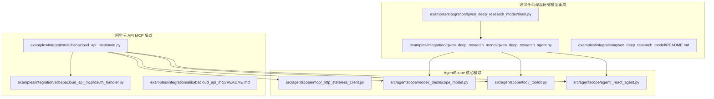
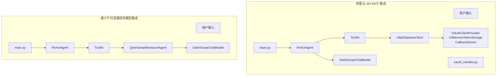
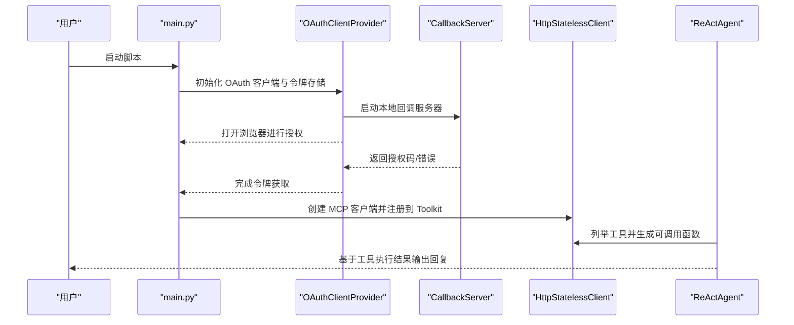
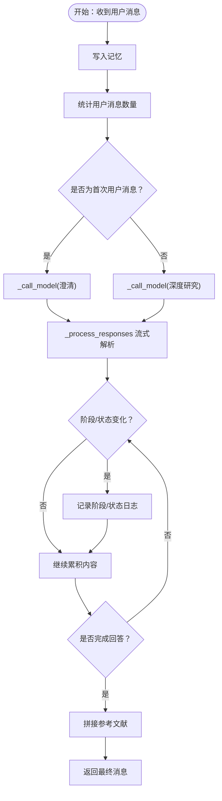
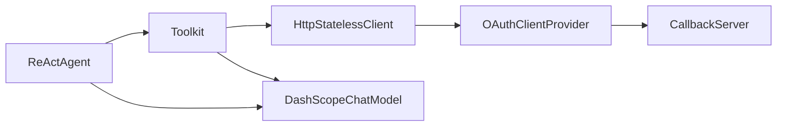

# 集成示例

<cite>
**本文引用的文件**
- [examples/integration/alibabacloud_api_mcp/main.py](file://examples/integration/alibabacloud_api_mcp/main.py)
- [examples/integration/alibabacloud_api_mcp/oauth_handler.py](file://examples/integration/alibabacloud_api_mcp/oauth_handler.py)
- [examples/integration/alibabacloud_api_mcp/README.md](file://examples/integration/alibabacloud_api_mcp/README.md)
- [examples/integration/qwen_deep_research_model/main.py](file://examples/integration/qwen_deep_research_model/main.py)
- [examples/integration/qwen_deep_research_model/qwen_deep_research_agent.py](file://examples/integration/qwen_deep_research_model/qwen_deep_research_agent.py)
- [examples/integration/qwen_deep_research_model/README.md](file://examples/integration/qwen_deep_research_model/README.md)
- [src/agentscope/mcp/_http_stateless_client.py](file://src/agentscope/mcp/_http_stateless_client.py)
- [src/agentscope/mcp/__init__.py](file://src/agentscope/mcp/__init__.py)
- [src/agentscope/model/_dashscope_model.py](file://src/agentscope/model/_dashscope_model.py)
- [src/agentscope/tool/_toolkit.py](file://src/agentscope/tool/_toolkit.py)
- [src/agentscope/agent/_react_agent.py](file://src/agentscope/agent/_react_agent.py)
</cite>

## 目录
1. [简介](#简介)
2. [项目结构](#项目结构)
3. [核心组件](#核心组件)
4. [架构总览](#架构总览)
5. [详细组件分析](#详细组件分析)
6. [依赖关系分析](#依赖关系分析)
7. [性能考量](#性能考量)
8. [故障排除指南](#故障排除指南)
9. [结论](#结论)
10. [附录](#附录)

## 简介
本教程面向希望在 AgentScope 中集成第三方服务的开发者，重点涵盖以下两个集成示例：
- 阿里云 API MCP 的 OAuth 认证与工具调用集成，展示如何通过 ReAct 智能体使用 MCP 工具完成云资源操作。
- 通义千问深度研究模型（Qwen-Deep-Research）的集成，展示如何基于 AgentScope 构建两阶段研究流程（澄清问题与深度研究），并解析流式响应。

教程将从系统架构、组件关系、数据流与处理逻辑入手，逐步深入到关键实现细节，并提供安全、性能与稳定性方面的最佳实践与排障建议。

## 项目结构
该集成示例位于 examples 目录下，分别包含两个独立的集成案例：
- 阿里云 API MCP 集成：包含主程序、OAuth 处理器与使用说明。
- 通义千问深度研究模型集成：包含主程序与自定义智能体实现。

图示来源
- [examples/integration/alibabacloud_api_mcp/main.py:1-102](file://examples/integration/alibabacloud_api_mcp/main.py#L1-L102)
- [examples/integration/alibabacloud_api_mcp/oauth_handler.py:1-267](file://examples/integration/alibabacloud_api_mcp/oauth_handler.py#L1-L267)
- [examples/integration/qwen_deep_research_model/main.py:1-52](file://examples/integration/qwen_deep_research_model/main.py#L1-L52)
- [examples/integration/qwen_deep_research_model/qwen_deep_research_agent.py:1-389](file://examples/integration/qwen_deep_research_model/qwen_deep_research_agent.py#L1-L389)
- [src/agentscope/mcp/_http_stateless_client.py:1-153](file://src/agentscope/mcp/_http_stateless_client.py#L1-L153)
- [src/agentscope/model/_dashscope_model.py:1-643](file://src/agentscope/model/_dashscope_model.py#L1-L643)
- [src/agentscope/tool/_toolkit.py:1-800](file://src/agentscope/tool/_toolkit.py#L1-L800)
- [src/agentscope/agent/_react_agent.py:1-800](file://src/agentscope/agent/_react_agent.py#L1-L800)

章节来源
- [examples/integration/alibabacloud_api_mcp/README.md:1-50](file://examples/integration/alibabacloud_api_mcp/README.md#L1-L50)
- [examples/integration/qwen_deep_research_model/README.md:1-23](file://examples/integration/qwen_deep_research_model/README.md#L1-L23)

## 核心组件
- ReAct 智能体：负责推理-行动循环，支持工具并行调用、结构化输出与记忆管理。
- 工具箱（Toolkit）：统一注册与管理工具函数、MCP 客户端与代理技能；支持中间件链路与异步任务管理。
- DashScope 聊天模型：统一文本与多模态生成接口，支持流式输出与工具调用解析。
- MCP 客户端（HttpStatelessClient）：封装流式 HTTP/SSE 传输，动态列举工具并生成可调用的工具函数包装器。
- 自定义深度研究智能体：基于 Qwen-Deep-Research 模型，实现两阶段研究流程与流式响应解析。

章节来源
- [src/agentscope/agent/_react_agent.py:98-537](file://src/agentscope/agent/_react_agent.py#L98-L537)
- [src/agentscope/tool/_toolkit.py:117-800](file://src/agentscope/tool/_toolkit.py#L117-L800)
- [src/agentscope/model/_dashscope_model.py:51-643](file://src/agentscope/model/_dashscope_model.py#L51-L643)
- [src/agentscope/mcp/_http_stateless_client.py:16-153](file://src/agentscope/mcp/_http_stateless_client.py#L16-L153)
- [examples/integration/qwen_deep_research_model/qwen_deep_research_agent.py:17-389](file://examples/integration/qwen_deep_research_model/qwen_deep_research_agent.py#L17-L389)

## 架构总览
下图展示了两个集成示例在 AgentScope 中的整体交互关系：ReAct 智能体通过 Toolkit 注册 MCP 客户端或自定义工具，DashScope 模型提供对话与工具调用能力，OAuth 处理器负责 MCP 的认证与令牌存储，深度研究智能体直接调用 DashScope 的深度研究模型。

图示来源
- [examples/integration/alibabacloud_api_mcp/main.py:70-101](file://examples/integration/alibabacloud_api_mcp/main.py#L70-L101)
- [examples/integration/alibabacloud_api_mcp/oauth_handler.py:72-267](file://examples/integration/alibabacloud_api_mcp/oauth_handler.py#L72-L267)
- [examples/integration/qwen_deep_research_model/main.py:10-52](file://examples/integration/qwen_deep_research_model/main.py#L10-L52)
- [examples/integration/qwen_deep_research_model/qwen_deep_research_agent.py:17-389](file://examples/integration/qwen_deep_research_model/qwen_deep_research_agent.py#L17-L389)
- [src/agentscope/mcp/_http_stateless_client.py:16-153](file://src/agentscope/mcp/_http_stateless_client.py#L16-L153)
- [src/agentscope/model/_dashscope_model.py:51-643](file://src/agentscope/model/_dashscope_model.py#L51-L643)
- [src/agentscope/tool/_toolkit.py:117-800](file://src/agentscope/tool/_toolkit.py#L117-L800)
- [src/agentscope/agent/_react_agent.py:98-537](file://src/agentscope/agent/_react_agent.py#L98-L537)

## 详细组件分析

### 阿里云 API MCP 集成（OAuth 认证、工具封装与错误处理）
- OAuth 认证流程
  - 使用 OAuthClientProvider 初始化客户端元数据与令牌存储，配置重定向与回调处理器。
  - CallbackServer 提供本地 HTTP 回调服务器，接收授权码与错误信息，支持超时控制与状态返回。
  - InMemoryTokenStorage 实现 TokenStorage 接口，用于内存中持久化令牌与客户端信息。
- MCP 客户端与工具注册
  - HttpStatelessClient 支持 SSE 与流式 HTTP 两种传输方式，动态列举工具并生成可调用的工具函数包装器。
  - ReActAgent 通过 Toolkit 注册 MCP 客户端，形成可用工具集合，供模型在推理-行动循环中调用。
- 错误处理机制
  - 回调服务器对成功、错误与内部异常页面进行统一渲染与状态码返回。
  - 超时与缺失授权码场景抛出明确异常，便于上层捕获与提示。
  - MCP 工具执行过程中捕获 McpError 并转换为 ToolResponse，保证智能体继续运行。

图示来源
- [examples/integration/alibabacloud_api_mcp/main.py:39-73](file://examples/integration/alibabacloud_api_mcp/main.py#L39-L73)
- [examples/integration/alibabacloud_api_mcp/oauth_handler.py:162-267](file://examples/integration/alibabacloud_api_mcp/oauth_handler.py#L162-L267)
- [src/agentscope/mcp/_http_stateless_client.py:139-153](file://src/agentscope/mcp/_http_stateless_client.py#L139-L153)
- [src/agentscope/tool/_toolkit.py:649-684](file://src/agentscope/tool/_toolkit.py#L649-L684)
- [src/agentscope/agent/_react_agent.py:376-537](file://src/agentscope/agent/_react_agent.py#L376-L537)

章节来源
- [examples/integration/alibabacloud_api_mcp/main.py:39-73](file://examples/integration/alibabacloud_api_mcp/main.py#L39-L73)
- [examples/integration/alibabacloud_api_mcp/oauth_handler.py:72-267](file://examples/integration/alibabacloud_api_mcp/oauth_handler.py#L72-L267)
- [src/agentscope/mcp/_http_stateless_client.py:16-153](file://src/agentscope/mcp/_http_stateless_client.py#L16-L153)
- [src/agentscope/tool/_toolkit.py:649-800](file://src/agentscope/tool/_toolkit.py#L649-L800)
- [src/agentscope/agent/_react_agent.py:376-537](file://src/agentscope/agent/_react_agent.py#L376-L537)

### 通义千问深度研究模型集成（模型配置、参数调整与结果解析）
- 模型配置与参数
  - QwenDeepResearchAgent 通过 DashScopeChatModel 调用 qwen-deep-research 模型，支持流式输出与长请求超时。
  - 内置两阶段流程：澄清（Clarification）与深度研究（Deep Research），依据记忆中的用户消息数量自动切换阶段。
- 结果解析与状态追踪
  - _process_responses 异步遍历流式响应，按 phase/status 解析内容，记录参考文献列表并在完成后拼接引用链接。
  - 支持“KeepAlive”阶段提示与进度日志，便于调试与可视化。
- 异常处理
  - 统一捕获调用异常并记录错误信息，返回可读的错误消息，避免中断智能体运行。

图示来源
- [examples/integration/qwen_deep_research_model/qwen_deep_research_agent.py:60-124](file://examples/integration/qwen_deep_research_model/qwen_deep_research_agent.py#L60-L124)
- [examples/integration/qwen_deep_research_model/qwen_deep_research_agent.py:165-281](file://examples/integration/qwen_deep_research_model/qwen_deep_research_agent.py#L165-L281)

章节来源
- [examples/integration/qwen_deep_research_model/qwen_deep_research_agent.py:17-389](file://examples/integration/qwen_deep_research_model/qwen_deep_research_agent.py#L17-L389)
- [examples/integration/qwen_deep_research_model/main.py:10-52](file://examples/integration/qwen_deep_research_model/main.py#L10-L52)

### 接口设计、数据转换与异常处理（跨组件）
- 数据转换
  - DashScopeChatModel 将模型输出解析为内容块（文本/工具调用/思考），并注入 Token 使用统计。
  - Toolkit 在注册工具时根据组激活状态与扩展模型动态生成 JSON Schema，确保模型仅看到可用工具。
- 异常处理
  - OAuth 回调服务器对错误与内部异常进行统一页面渲染与状态码返回。
  - MCP 工具执行捕获 McpError 并转换为 ToolResponse，避免中断智能体。
  - 深度研究模型调用异常被捕获并记录，返回错误消息。

章节来源
- [src/agentscope/model/_dashscope_model.py:300-591](file://src/agentscope/model/_dashscope_model.py#L300-L591)
- [src/agentscope/tool/_toolkit.py:737-755](file://src/agentscope/tool/_toolkit.py#L737-L755)
- [examples/integration/qwen_deep_research_model/qwen_deep_research_agent.py:160-163](file://examples/integration/qwen_deep_research_model/qwen_deep_research_agent.py#L160-L163)

## 依赖关系分析
- 组件耦合与内聚
  - ReActAgent 与 Toolkit 高内聚，通过工具 JSON Schema 与流式工具执行解耦外部服务。
  - HttpStatelessClient 与 DashScopeChatModel 分别负责外部工具与模型调用，职责清晰。
- 外部依赖与集成点
  - MCP 服务通过 OAuthClientProvider 与本地回调服务器对接，令牌存储与回调处理解耦。
  - 深度研究模型直接依赖 DashScope SDK，通过异步生成器实现流式解析。
- 可能的循环依赖
  - 当前模块间为单向依赖（Agent -> Toolkit -> MCP/Model），无明显循环。

图示来源
- [src/agentscope/agent/_react_agent.py:98-537](file://src/agentscope/agent/_react_agent.py#L98-L537)
- [src/agentscope/tool/_toolkit.py:117-800](file://src/agentscope/tool/_toolkit.py#L117-L800)
- [src/agentscope/mcp/_http_stateless_client.py:16-153](file://src/agentscope/mcp/_http_stateless_client.py#L16-L153)
- [examples/integration/alibabacloud_api_mcp/oauth_handler.py:162-267](file://examples/integration/alibabacloud_api_mcp/oauth_handler.py#L162-L267)

章节来源
- [src/agentscope/mcp/__init__.py:1-21](file://src/agentscope/mcp/__init__.py#L1-L21)
- [src/agentscope/mcp/_http_stateless_client.py:16-153](file://src/agentscope/mcp/_http_stateless_client.py#L16-L153)
- [src/agentscope/tool/_toolkit.py:117-800](file://src/agentscope/tool/_toolkit.py#L117-L800)

## 性能考量
- 流式输出与并发
  - DashScopeChatModel 默认启用流式增量输出，降低首字延迟；ReActAgent 支持并行工具调用以提升吞吐。
- 超时与资源释放
  - MCP SSE 读取与请求超时可配置；深度研究模型请求超时较长以适应复杂检索与生成。
- 日志与可观测性
  - 智能体与工具执行均提供日志钩子，便于定位性能瓶颈与异常路径。

[本节为通用指导，无需列出具体文件来源]

## 故障排除指南
- OAuth 回调失败
  - 确认本地回调服务器已启动且端口未被占用；检查授权码是否正确返回，错误页面会显示错误码与描述。
  - 若超时，请检查网络连通性与 MCP 服务端配置。
- MCP 工具不可用
  - 确认已成功注册 MCP 客户端并完成工具列举；检查工具名称与权限范围。
  - 如出现 McpError，查看回调服务器返回的错误详情。
- 深度研究模型调用异常
  - 检查 DASHSCOPE_API_KEY 是否设置；确认模型名称与流式参数配置正确。
  - 关注流式解析中的阶段与状态变化，必要时开启详细日志。

章节来源
- [examples/integration/alibabacloud_api_mcp/oauth_handler.py:195-220](file://examples/integration/alibabacloud_api_mcp/oauth_handler.py#L195-L220)
- [examples/integration/qwen_deep_research_model/qwen_deep_research_agent.py:160-163](file://examples/integration/qwen_deep_research_model/qwen_deep_research_agent.py#L160-L163)

## 结论
通过以上两个集成示例，AgentScope 展示了将第三方服务（MCP 与 DashScope）无缝接入智能体的能力：
- OAuth 认证与 MCP 工具封装提供了安全可控的外部服务访问路径；
- 深度研究模型集成体现了复杂工作流的两阶段设计与流式结果解析；
- 依托 Toolkit 与 ReActAgent，开发者可以快速构建具备工具调用、记忆与结构化输出能力的智能体。

[本节为总结性内容，无需列出具体文件来源]

## 附录
- 运行与配置要点
  - 阿里云 API MCP：在 MCP 控制台创建服务后替换示例中的 server_url；确保使用支持流式 HTTP 的地址。
  - 通义千问深度研究模型：设置 DASHSCOPE_API_KEY 后运行示例脚本。
- 最佳实践
  - 安全：优先使用 OAuth 令牌存储与本地回调服务器，避免明文密钥；限制回调端口与重定向 URI。
  - 性能：启用流式输出与并行工具调用；合理设置超时与日志级别。
  - 稳定性：在工具执行与模型调用处增加异常捕获与降级策略；对流式响应进行阶段与状态校验。

章节来源
- [examples/integration/alibabacloud_api_mcp/README.md:18-48](file://examples/integration/alibabacloud_api_mcp/README.md#L18-L48)
- [examples/integration/qwen_deep_research_model/README.md:9-22](file://examples/integration/qwen_deep_research_model/README.md#L9-L22)