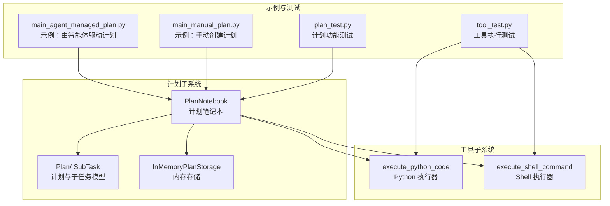
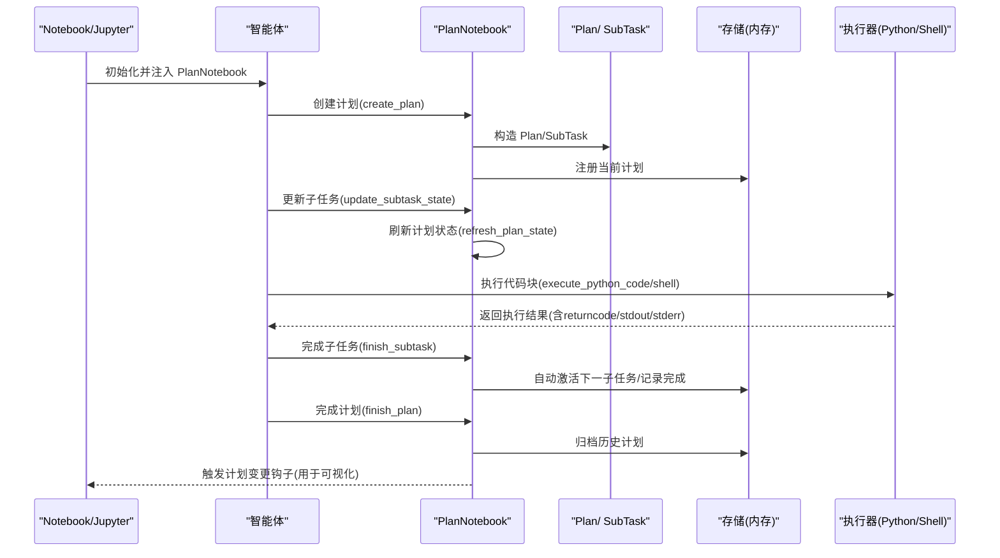
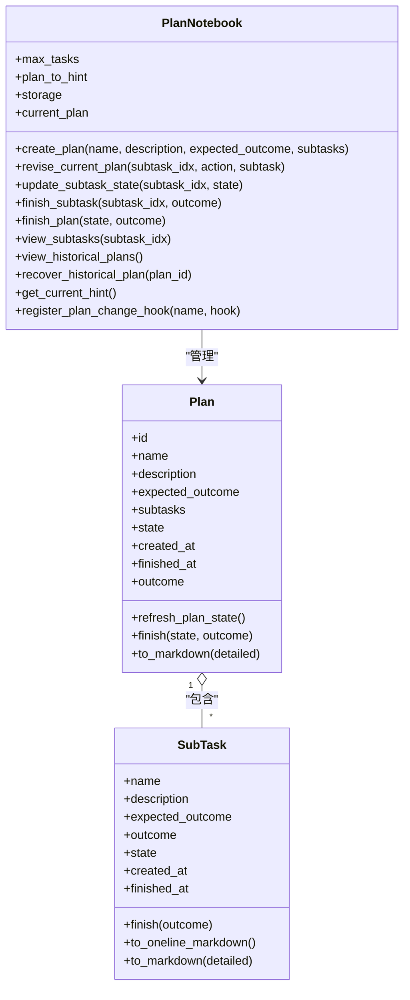
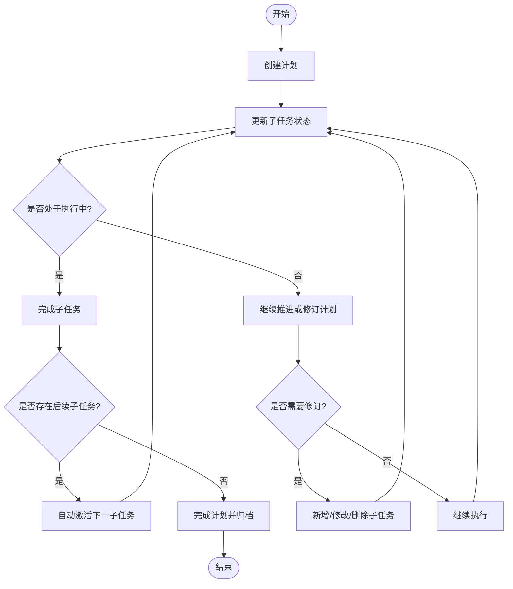
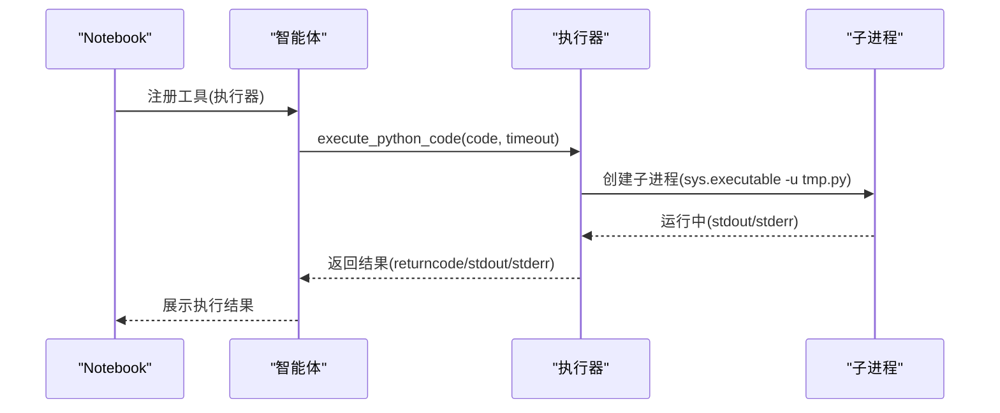
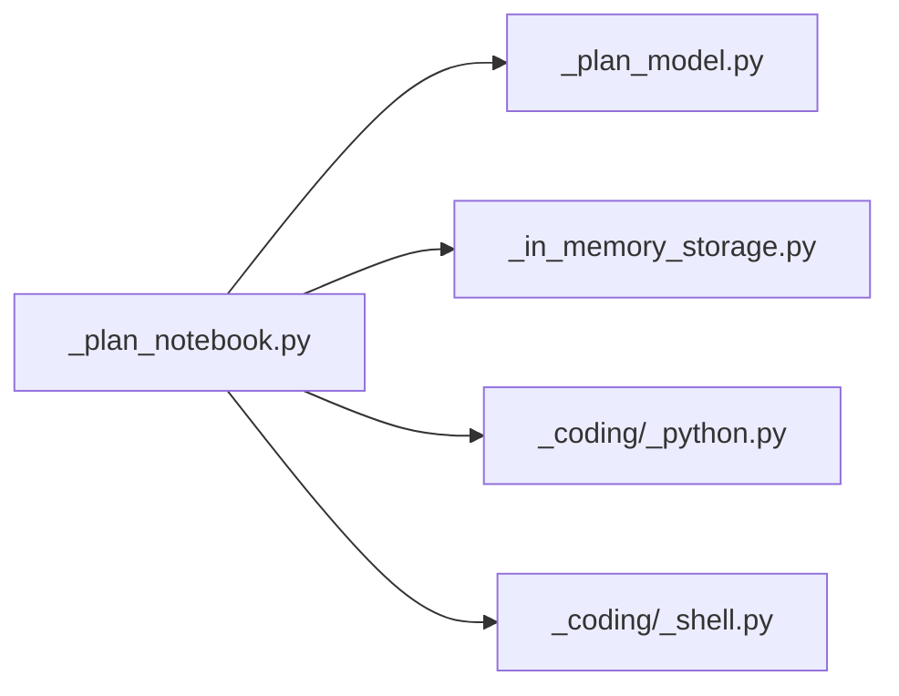

# 笔记本集成

<cite>
**本文引用的文件**   
- [src/agentscope/plan/_plan_notebook.py](file://src/agentscope/plan/_plan_notebook.py)
- [src/agentscope/plan/_plan_model.py](file://src/agentscope/plan/_plan_model.py)
- [src/agentscope/plan/_in_memory_storage.py](file://src/agentscope/plan/_in_memory_storage.py)
- [src/agentscope/tool/_coding/_python.py](file://src/agentscope/tool/_coding/_python.py)
- [src/agentscope/tool/_coding/_shell.py](file://src/agentscope/tool/_coding/_shell.py)
- [examples/functionality/plan/main_agent_managed_plan.py](file://examples/functionality/plan/main_agent_managed_plan.py)
- [examples/functionality/plan/main_manual_plan.py](file://examples/functionality/plan/main_manual_plan.py)
- [tests/plan_test.py](file://tests/plan_test.py)
- [tests/tool_test.py](file://tests/tool_test.py)
- [docs/tutorial/zh_CN/src/task_plan.py](file://docs/tutorial/zh_CN/src/task_plan.py)
</cite>

## 目录
1. [简介](#简介)
2. [项目结构](#项目结构)
3. [核心组件](#核心组件)
4. [架构总览](#架构总览)
5. [详细组件分析](#详细组件分析)
6. [依赖分析](#依赖分析)
7. [性能考虑](#性能考虑)
8. [故障排除指南](#故障排除指南)
9. [结论](#结论)
10. [附录](#附录)

## 简介
本技术文档面向需要在 Jupyter Notebook 中集成 AgentScope 计划（Plan）能力的用户与开发者，系统性说明以下内容：
- 计划笔记本（PlanNotebook）在 Notebook 环境中的职责与接口
- 计划生命周期管理：创建、修订、执行监控、完成与历史恢复
- 代码块执行引擎：Python 与 Shell 的安全执行、超时控制与结果封装
- Notebook 集成实践：如何在 Notebook 中创建计划、执行与调试、可视化展示
- 环境配置、依赖安装与内核设置建议
- 故障排除、性能优化与错误处理策略
- 完整的集成 API 参考与部署建议

## 项目结构
与笔记本集成直接相关的模块主要位于 plan 子系统与工具子系统中，并通过示例脚本演示在 Notebook 场景下的使用方式。

图表来源
- [src/agentscope/plan/_plan_notebook.py:172-905](file://src/agentscope/plan/_plan_notebook.py#L172-L905)
- [src/agentscope/plan/_plan_model.py:11-201](file://src/agentscope/plan/_plan_model.py#L11-L201)
- [src/agentscope/plan/_in_memory_storage.py:9-71](file://src/agentscope/plan/_in_memory_storage.py#L9-L71)
- [src/agentscope/tool/_coding/_python.py:17-91](file://src/agentscope/tool/_coding/_python.py#L17-L91)
- [src/agentscope/tool/_coding/_shell.py:12-78](file://src/agentscope/tool/_coding/_shell.py#L12-L78)
- [examples/functionality/plan/main_agent_managed_plan.py:21-66](file://examples/functionality/plan/main_agent_managed_plan.py#L21-L66)
- [examples/functionality/plan/main_manual_plan.py:23-102](file://examples/functionality/plan/main_manual_plan.py#L23-L102)
- [tests/plan_test.py:422-823](file://tests/plan_test.py#L422-L823)
- [tests/tool_test.py:49-164](file://tests/tool_test.py#L49-L164)

章节来源
- [src/agentscope/plan/_plan_notebook.py:172-905](file://src/agentscope/plan/_plan_notebook.py#L172-L905)
- [src/agentscope/plan/_plan_model.py:11-201](file://src/agentscope/plan/_plan_model.py#L11-L201)
- [src/agentscope/plan/_in_memory_storage.py:9-71](file://src/agentscope/plan/_in_memory_storage.py#L9-L71)
- [src/agentscope/tool/_coding/_python.py:17-91](file://src/agentscope/tool/_coding/_python.py#L17-L91)
- [src/agentscope/tool/_coding/_shell.py:12-78](file://src/agentscope/tool/_coding/_shell.py#L12-L78)
- [examples/functionality/plan/main_agent_managed_plan.py:21-66](file://examples/functionality/plan/main_agent_managed_plan.py#L21-L66)
- [examples/functionality/plan/main_manual_plan.py:23-102](file://examples/functionality/plan/main_manual_plan.py#L23-L102)
- [tests/plan_test.py:422-823](file://tests/plan_test.py#L422-L823)
- [tests/tool_test.py:49-164](file://tests/tool_test.py#L49-L164)

## 核心组件
- 计划笔记本（PlanNotebook）
  - 负责计划的创建、修订、子任务状态更新、完成与历史管理
  - 提供“系统提示”生成器，辅助智能体按步骤推进
  - 支持注册计划变更钩子，便于前端或 Notebook 展示层同步状态
- 计划与子任务模型（Plan/ SubTask）
  - 统一的数据结构，支持 Markdown 导出、状态机刷新与完成标记
- 内存存储（InMemoryPlanStorage）
  - 提供计划的历史记录持久化（内存态），支持序列化/反序列化
- Python/Shell 执行器
  - 在 Notebook 中安全执行代码块，支持超时控制与结果封装
  - 通过临时文件与子进程隔离，避免对宿主环境的污染

章节来源
- [src/agentscope/plan/_plan_notebook.py:172-905](file://src/agentscope/plan/_plan_notebook.py#L172-L905)
- [src/agentscope/plan/_plan_model.py:11-201](file://src/agentscope/plan/_plan_model.py#L11-L201)
- [src/agentscope/plan/_in_memory_storage.py:9-71](file://src/agentscope/plan/_in_memory_storage.py#L9-L71)
- [src/agentscope/tool/_coding/_python.py:17-91](file://src/agentscope/tool/_coding/_python.py#L17-L91)
- [src/agentscope/tool/_coding/_shell.py:12-78](file://src/agentscope/tool/_coding/_shell.py#L12-L78)

## 架构总览
下图展示了 Notebook 集成的整体交互：智能体通过 PlanNotebook 管理计划，借助工具子系统执行代码块，同时通过存储与钩子实现状态同步与可视化展示。

图表来源
- [src/agentscope/plan/_plan_notebook.py:232-737](file://src/agentscope/plan/_plan_notebook.py#L232-L737)
- [src/agentscope/plan/_plan_model.py:148-178](file://src/agentscope/plan/_plan_model.py#L148-L178)
- [src/agentscope/plan/_in_memory_storage.py:26-71](file://src/agentscope/plan/_in_memory_storage.py#L26-L71)
- [src/agentscope/tool/_coding/_python.py:17-91](file://src/agentscope/tool/_coding/_python.py#L17-L91)
- [src/agentscope/tool/_coding/_shell.py:12-78](file://src/agentscope/tool/_coding/_shell.py#L12-L78)

## 详细组件分析

### 计划笔记本（PlanNotebook）
- 主要职责
  - 计划创建、修订、完成与历史管理
  - 子任务状态机：todo → in_progress → done，约束并发与顺序
  - 自动生成系统提示，指导智能体下一步操作
  - 计划变更钩子，支持前端或 Notebook 展示层同步
- 关键方法
  - create_plan / revise_current_plan / finish_plan
  - update_subtask_state / finish_subtask / view_subtasks
  - view_historical_plans / recover_historical_plan
  - get_current_hint / register_plan_change_hook
- 状态与数据流
  - 当前计划以 Pydantic 模型形式保存，支持序列化/反序列化
  - 计划状态刷新仅在子任务 in_progress 时切换到 in_progress；完成后归档至历史存储

图表来源
- [src/agentscope/plan/_plan_notebook.py:172-905](file://src/agentscope/plan/_plan_notebook.py#L172-L905)
- [src/agentscope/plan/_plan_model.py:104-201](file://src/agentscope/plan/_plan_model.py#L104-L201)

章节来源
- [src/agentscope/plan/_plan_notebook.py:172-905](file://src/agentscope/plan/_plan_notebook.py#L172-L905)
- [src/agentscope/plan/_plan_model.py:11-201](file://src/agentscope/plan/_plan_model.py#L11-L201)
- [docs/tutorial/zh_CN/src/task_plan.py:74-110](file://docs/tutorial/zh_CN/src/task_plan.py#L74-L110)

### 计划生命周期管理流程
- 创建：构造 Plan 并写入当前计划，触发钩子
- 修订：支持新增、修改、删除子任务，校验索引与动作合法性
- 执行监控：单个子任务 in_progress 时，严格约束前置任务已完成
- 结果收集：完成子任务后自动激活下一个子任务，或结束计划
- 状态同步：通过钩子通知外部展示层更新 UI
- 历史管理：完成计划归档，支持查询与恢复

图表来源
- [src/agentscope/plan/_plan_notebook.py:232-737](file://src/agentscope/plan/_plan_notebook.py#L232-L737)

章节来源
- [tests/plan_test.py:422-823](file://tests/plan_test.py#L422-L823)

### 代码块执行引擎（Python/Shell）
- Python 执行器
  - 将代码写入临时文件，在独立子进程中执行，捕获返回码、标准输出与错误
  - 支持超时控制，超时后终止进程并返回截断的 stdout 与错误信息
  - 输出格式统一为包含 returncode/stdout/stderr 的文本块
- Shell 执行器
  - 通过 shell 方式执行命令，行为与 Python 执行器一致
- Notebook 集成要点
  - 在 Notebook 中通过工具注册将执行器暴露给智能体
  - 使用超时参数控制长时间运行任务的风险

图表来源
- [src/agentscope/tool/_coding/_python.py:17-91](file://src/agentscope/tool/_coding/_python.py#L17-L91)
- [src/agentscope/tool/_coding/_shell.py:12-78](file://src/agentscope/tool/_coding/_shell.py#L12-L78)

章节来源
- [src/agentscope/tool/_coding/_python.py:17-91](file://src/agentscope/tool/_coding/_python.py#L17-L91)
- [src/agentscope/tool/_coding/_shell.py:12-78](file://src/agentscope/tool/_coding/_shell.py#L12-L78)
- [tests/tool_test.py:49-164](file://tests/tool_test.py#L49-L164)

### Notebook 集成使用示例
- 示例一：由智能体驱动计划
  - 在 Notebook 中初始化 PlanNotebook，并将其注入 ReActAgent
  - 通过对话逐步创建与推进计划，执行器用于代码块执行
- 示例二：手动创建计划
  - 在 Notebook 中直接创建 Plan 与 SubTask 列表
  - 注册工具后交由智能体执行，适合预定义任务流场景

章节来源
- [examples/functionality/plan/main_agent_managed_plan.py:21-66](file://examples/functionality/plan/main_agent_managed_plan.py#L21-L66)
- [examples/functionality/plan/main_manual_plan.py:23-102](file://examples/functionality/plan/main_manual_plan.py#L23-L102)

## 依赖分析
- 组件耦合
  - PlanNotebook 依赖 Plan/ SubTask 数据模型与存储抽象
  - 执行器作为工具被智能体调用，与 Notebook 解耦
- 外部依赖
  - Python 执行器依赖子进程与临时目录
  - Shell 执行器依赖系统 shell
- 循环依赖
  - 未发现循环导入；模块职责清晰

图表来源
- [src/agentscope/plan/_plan_notebook.py:1-14](file://src/agentscope/plan/_plan_notebook.py#L1-L14)
- [src/agentscope/plan/_plan_model.py:1-12](file://src/agentscope/plan/_plan_model.py#L1-L12)
- [src/agentscope/plan/_in_memory_storage.py:1-8](file://src/agentscope/plan/_in_memory_storage.py#L1-L8)
- [src/agentscope/tool/_coding/_python.py:1-15](file://src/agentscope/tool/_coding/_python.py#L1-L15)
- [src/agentscope/tool/_coding/_shell.py:1-10](file://src/agentscope/tool/_coding/_shell.py#L1-L10)

章节来源
- [src/agentscope/plan/_plan_notebook.py:1-14](file://src/agentscope/plan/_plan_notebook.py#L1-L14)
- [src/agentscope/plan/_plan_model.py:1-12](file://src/agentscope/plan/_plan_model.py#L1-L12)
- [src/agentscope/plan/_in_memory_storage.py:1-8](file://src/agentscope/plan/_in_memory_storage.py#L1-L8)
- [src/agentscope/tool/_coding/_python.py:1-15](file://src/agentscope/tool/_coding/_python.py#L1-L15)
- [src/agentscope/tool/_coding/_shell.py:1-10](file://src/agentscope/tool/_coding/_shell.py#L1-L10)

## 性能考虑
- 执行器超时控制
  - 合理设置 timeout，避免长时间阻塞 Notebook
  - 对于可能耗时的任务，建议拆分为多个子任务并通过计划推进
- I/O 与编码
  - Python 执行器显式设置 UTF-8 环境变量，确保多语言输出稳定
- 存储与序列化
  - 内存存储适用于 Notebook 本地场景；若需跨会话持久化，建议实现自定义存储

## 故障排除指南
- 计划状态异常
  - 子任务状态更新失败：检查前置子任务是否已完成，避免并发 in_progress
  - 完成子任务失败：确认索引合法且前置子任务已完成
- 执行器超时
  - 超时返回 returncode=-1 与截断的 stdout/stderr；适当提高 timeout 或拆分任务
  - 异常捕获：异常堆栈会出现在 stderr 中，便于定位
- 钩子未触发
  - 确认已注册钩子并在计划变更时触发；注意钩子名称唯一性

章节来源
- [tests/plan_test.py:686-712](file://tests/plan_test.py#L686-L712)
- [tests/tool_test.py:73-96](file://tests/tool_test.py#L73-L96)

## 结论
通过 PlanNotebook 与工具子系统的配合，AgentScope 能够在 Jupyter Notebook 中提供完整的计划驱动执行体验。结合 Python/Shell 执行器与超时控制，可在 Notebook 中安全地执行代码块并可视化展示进度。建议在生产环境中引入更健壮的存储与安全隔离策略，并根据任务复杂度合理拆分子任务以提升稳定性与可观测性。

## 附录

### Notebook 环境配置与依赖安装
- 建议使用与 AgentScope 相同的 Python 版本与虚拟环境
- 安装 AgentScope 及其依赖（如模型 SDK、工具库）
- 在 Notebook 中安装并选择合适的内核（如 Python 3.x）

### 内核设置建议
- 为 Notebook 创建专用内核，确保执行器与 Notebook 共享同一 Python 环境
- 若需访问系统命令，请确保 Notebook 内核具备相应权限

### 集成 API 参考
- 计划笔记本（PlanNotebook）
  - 创建计划：create_plan(name, description, expected_outcome, subtasks)
  - 修订计划：revise_current_plan(subtask_idx, action, subtask)
  - 更新子任务状态：update_subtask_state(subtask_idx, state)
  - 完成子任务：finish_subtask(subtask_idx, outcome)
  - 完成计划：finish_plan(state, outcome)
  - 查看子任务详情：view_subtasks(subtask_idx)
  - 查看历史计划：view_historical_plans()
  - 恢复历史计划：recover_historical_plan(plan_id)
  - 获取系统提示：get_current_hint()
  - 注册计划变更钩子：register_plan_change_hook(name, hook)
- Python 执行器
  - execute_python_code(code, timeout)
- Shell 执行器
  - execute_shell_command(command, timeout)

章节来源
- [src/agentscope/plan/_plan_notebook.py:232-843](file://src/agentscope/plan/_plan_notebook.py#L232-L843)
- [src/agentscope/tool/_coding/_python.py:17-91](file://src/agentscope/tool/_coding/_python.py#L17-L91)
- [src/agentscope/tool/_coding/_shell.py:12-78](file://src/agentscope/tool/_coding/_shell.py#L12-L78)
- [docs/tutorial/zh_CN/src/task_plan.py:74-110](file://docs/tutorial/zh_CN/src/task_plan.py#L74-L110)