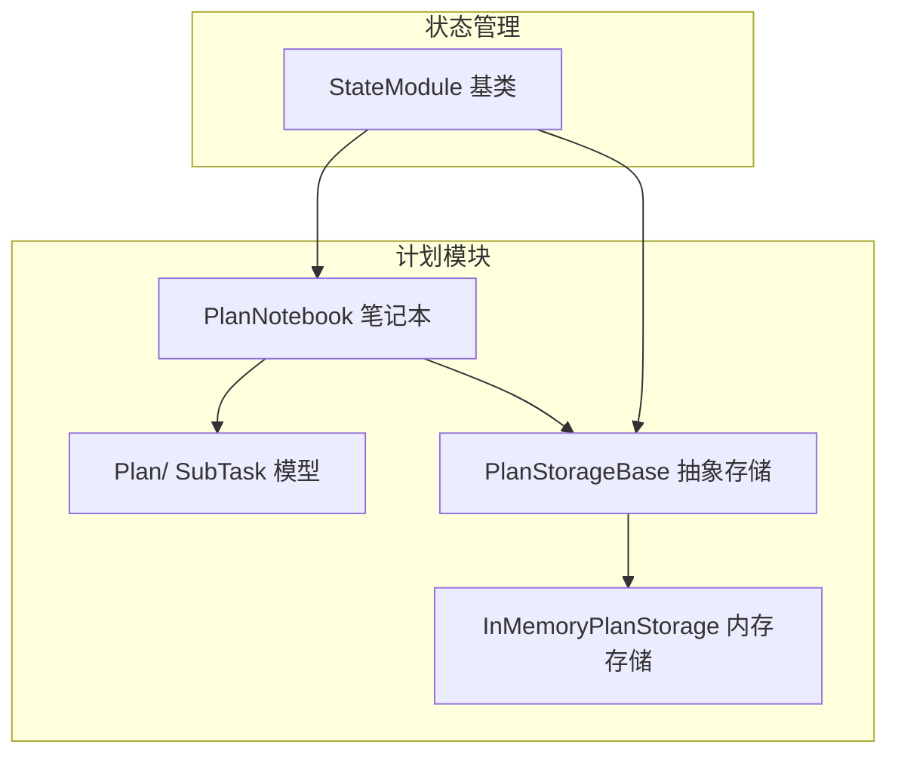
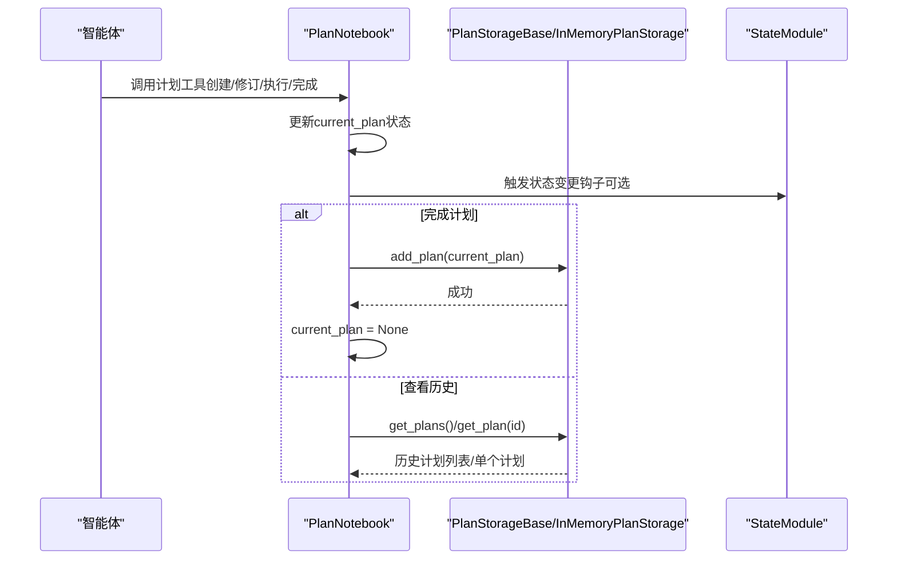
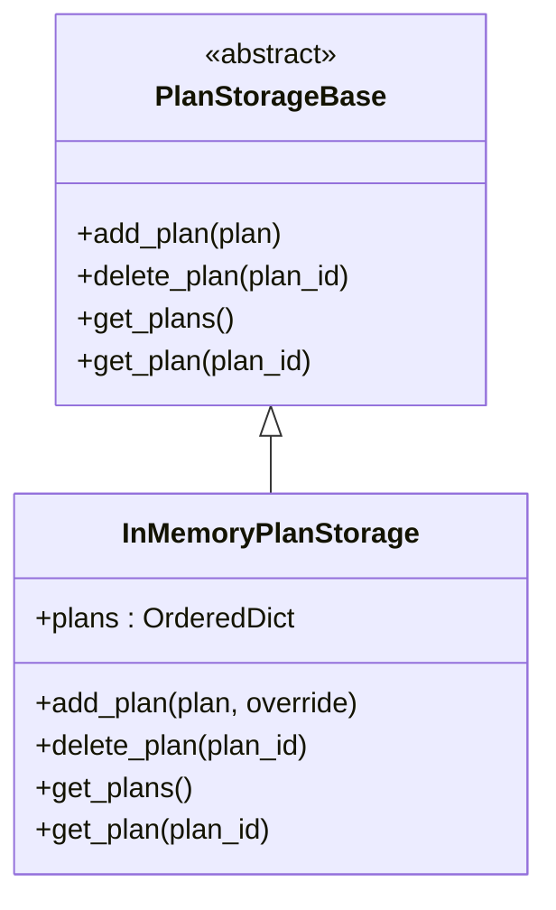
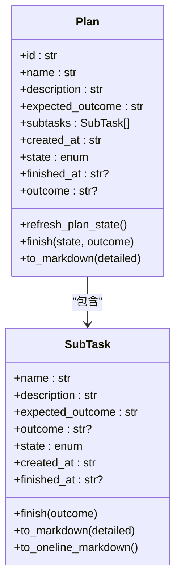
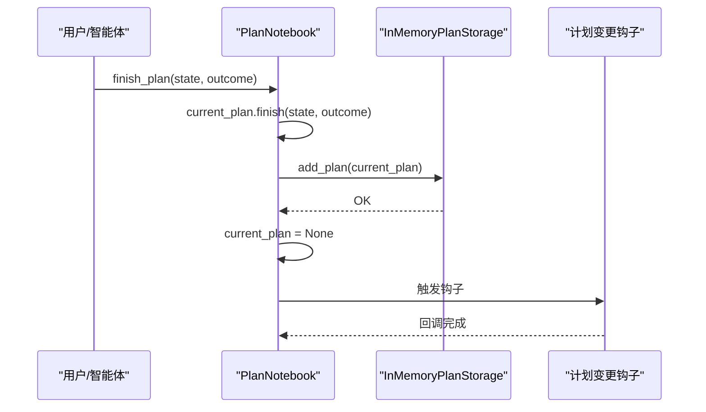
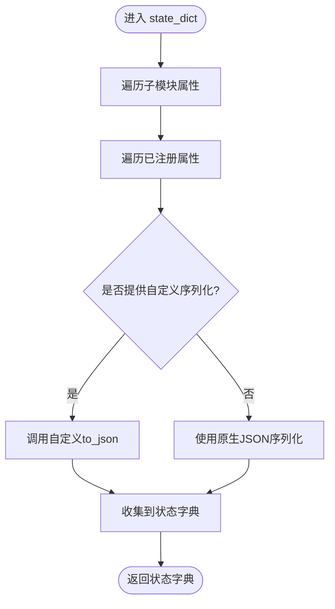
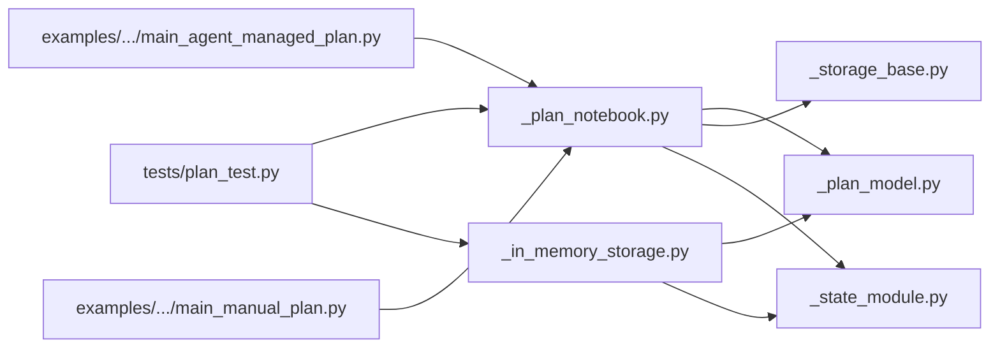

# 计划存储

<cite>
**本文引用的文件**
- [src/agentscope/plan/_storage_base.py](file://src/agentscope/plan/_storage_base.py)
- [src/agentscope/plan/_in_memory_storage.py](file://src/agentscope/plan/_in_memory_storage.py)
- [src/agentscope/plan/_plan_model.py](file://src/agentscope/plan/_plan_model.py)
- [src/agentscope/plan/_plan_notebook.py](file://src/agentscope/plan/_plan_notebook.py)
- [src/agentscope/module/_state_module.py](file://src/agentscope/module/_state_module.py)
- [src/agentscope/plan/__init__.py](file://src/agentscope/plan/__init__.py)
- [tests/plan_test.py](file://tests/plan_test.py)
- [examples/functionality/plan/main_agent_managed_plan.py](file://examples/functionality/plan/main_agent_managed_plan.py)
- [examples/functionality/plan/main_manual_plan.py](file://examples/functionality/plan/main_manual_plan.py)
</cite>

## 目录
1. [简介](#简介)
2. [项目结构](#项目结构)
3. [核心组件](#核心组件)
4. [架构总览](#架构总览)
5. [组件详解](#组件详解)
6. [依赖关系分析](#依赖关系分析)
7. [性能考量](#性能考量)
8. [故障排除指南](#故障排除指南)
9. [结论](#结论)
10. [附录](#附录)

## 简介
本文件面向AgentScope的“计划存储”子系统，提供从架构设计到实现细节、配置选项、扩展指南、性能优化与故障排除的完整技术文档。重点覆盖：
- 存储接口的抽象设计与统一规范
- 内存存储的实现机制（数据结构、并发控制、序列化/反序列化）
- 配置选项（如内存限制、缓存策略、历史清理等）
- 典型操作示例（增删改查、批量操作、事务处理）
- 自定义存储后端扩展、数据迁移与备份恢复策略
- 性能调优建议与最佳实践

## 项目结构
计划存储位于plan模块内，围绕“模型-笔记本-存储”的分层组织：
- 模型层：Plan与SubTask，定义计划与子任务的数据结构与行为
- 笔记本层：PlanNotebook，提供计划生命周期管理、工具函数、提示生成与状态钩子
- 存储层：PlanStorageBase抽象基类与InMemoryPlanStorage实现，负责历史计划的持久化与检索
- 状态管理：基于StateModule的嵌套序列化/反序列化能力，贯穿模型与存储

图表来源
- [src/agentscope/plan/_plan_notebook.py:172-231](file://src/agentscope/plan/_plan_notebook.py#L172-L231)
- [src/agentscope/plan/_storage_base.py:9-26](file://src/agentscope/plan/_storage_base.py#L9-L26)
- [src/agentscope/plan/_in_memory_storage.py:9-24](file://src/agentscope/plan/_in_memory_storage.py#L9-L24)
- [src/agentscope/module/_state_module.py:20-48](file://src/agentscope/module/_state_module.py#L20-L48)

章节来源
- [src/agentscope/plan/_plan_notebook.py:172-231](file://src/agentscope/plan/_plan_notebook.py#L172-L231)
- [src/agentscope/plan/_storage_base.py:9-26](file://src/agentscope/plan/_storage_base.py#L9-L26)
- [src/agentscope/plan/_in_memory_storage.py:9-24](file://src/agentscope/plan/_in_memory_storage.py#L9-L24)
- [src/agentscope/module/_state_module.py:20-48](file://src/agentscope/module/_state_module.py#L20-L48)

## 核心组件
- 抽象存储接口：PlanStorageBase，定义统一的异步增删改查方法
- 内存存储实现：InMemoryPlanStorage，基于有序字典存储历史计划，并提供状态注册用于序列化/反序列化
- 计划模型：Plan与SubTask，包含状态机、完成逻辑与Markdown导出
- 计划笔记本：PlanNotebook，封装计划生命周期、工具函数、历史计划管理与状态钩子
- 状态管理：StateModule，支持嵌套状态序列化/反序列化与自定义转换函数

章节来源
- [src/agentscope/plan/_storage_base.py:9-26](file://src/agentscope/plan/_storage_base.py#L9-L26)
- [src/agentscope/plan/_in_memory_storage.py:9-70](file://src/agentscope/plan/_in_memory_storage.py#L9-L70)
- [src/agentscope/plan/_plan_model.py:104-201](file://src/agentscope/plan/_plan_model.py#L104-L201)
- [src/agentscope/plan/_plan_notebook.py:172-231](file://src/agentscope/plan/_plan_notebook.py#L172-L231)
- [src/agentscope/module/_state_module.py:20-152](file://src/agentscope/module/_state_module.py#L20-L152)

## 架构总览
下图展示PlanNotebook与存储层的交互流程，以及状态管理在其中的作用。

图表来源
- [src/agentscope/plan/_plan_notebook.py:694-737](file://src/agentscope/plan/_plan_notebook.py#L694-L737)
- [src/agentscope/plan/_plan_notebook.py:739-760](file://src/agentscope/plan/_plan_notebook.py#L739-L760)
- [src/agentscope/plan/_plan_notebook.py:762-819](file://src/agentscope/plan/_plan_notebook.py#L762-L819)
- [src/agentscope/plan/_in_memory_storage.py:26-70](file://src/agentscope/plan/_in_memory_storage.py#L26-L70)
- [src/agentscope/module/_state_module.py:49-107](file://src/agentscope/module/_state_module.py#L49-L107)

## 组件详解

### 抽象存储接口：PlanStorageBase
- 设计目标：为不同存储后端提供统一的异步接口，屏蔽具体实现差异
- 关键方法：
  - add_plan(plan): 异步添加计划
  - delete_plan(plan_id): 异步删除计划
  - get_plans(): 异步获取全部历史计划
  - get_plan(plan_id): 异步按ID获取计划
- 实现约束：所有方法均为抽象，需由具体存储类实现

章节来源
- [src/agentscope/plan/_storage_base.py:9-26](file://src/agentscope/plan/_storage_base.py#L9-L26)

### 内存存储：InMemoryPlanStorage
- 数据结构：使用有序字典保存历史计划，保证插入顺序与遍历一致性
- 并发控制：当前实现未内置锁；若需要多线程/多协程并发写入，建议在上层加锁或使用线程安全容器
- 序列化/反序列化：通过StateModule注册“plans”状态，提供自定义序列化/反序列化函数，支持Plan模型的model_dump/model_validate
- 行为特性：
  - add_plan(plan, override=True)：默认允许覆盖同ID计划；override=False时重复ID抛出异常
  - delete_plan(plan_id)：按ID删除，不存在不报错
  - get_plans()：返回全部历史计划
  - get_plan(plan_id)：按ID查询，不存在返回None

图表来源
- [src/agentscope/plan/_storage_base.py:9-26](file://src/agentscope/plan/_storage_base.py#L9-L26)
- [src/agentscope/plan/_in_memory_storage.py:9-70](file://src/agentscope/plan/_in_memory_storage.py#L9-L70)

章节来源
- [src/agentscope/plan/_in_memory_storage.py:9-70](file://src/agentscope/plan/_in_memory_storage.py#L9-L70)

### 计划模型：Plan与SubTask
- SubTask字段与行为：
  - 名称、描述、期望结果、实际结果、状态（todo/in_progress/done/abandoned）、时间戳
  - finish(outcome)：标记完成并记录完成时间
  - to_markdown/to_oneline_markdown：输出Markdown格式
- Plan字段与行为：
  - 包含多个SubTask，状态刷新refresh_plan_state（仅在todo与in_progress之间切换）
  - finish(state, outcome)：完成或废弃计划
  - to_markdown：输出完整计划Markdown

图表来源
- [src/agentscope/plan/_plan_model.py:11-102](file://src/agentscope/plan/_plan_model.py#L11-L102)
- [src/agentscope/plan/_plan_model.py:104-201](file://src/agentscope/plan/_plan_model.py#L104-L201)

章节来源
- [src/agentscope/plan/_plan_model.py:11-201](file://src/agentscope/plan/_plan_model.py#L11-L201)

### 计划笔记本：PlanNotebook
- 职责：
  - 生命周期管理：创建、修订、执行、完成计划
  - 工具函数：视图、状态更新、完成子任务、查看历史、恢复历史
  - 提示生成：根据当前计划状态生成系统提示
  - 状态钩子：计划变更时触发回调
- 关键流程：
  - 完成计划：将current_plan写入历史存储，清空current_plan
  - 恢复历史：从历史存储读取指定ID计划，替换current_plan
  - 状态注册：current_plan通过StateModule注册，支持序列化/反序列化

图表来源
- [src/agentscope/plan/_plan_notebook.py:694-737](file://src/agentscope/plan/_plan_notebook.py#L694-L737)
- [src/agentscope/plan/_plan_notebook.py:897-905](file://src/agentscope/plan/_plan_notebook.py#L897-L905)

章节来源
- [src/agentscope/plan/_plan_notebook.py:172-231](file://src/agentscope/plan/_plan_notebook.py#L172-L231)
- [src/agentscope/plan/_plan_notebook.py:694-737](file://src/agentscope/plan/_plan_notebook.py#L694-L737)
- [src/agentscope/plan/_plan_notebook.py:762-819](file://src/agentscope/plan/_plan_notebook.py#L762-L819)
- [src/agentscope/plan/_plan_notebook.py:897-905](file://src/agentscope/plan/_plan_notebook.py#L897-L905)

### 状态管理：StateModule
- 能力：
  - 嵌套序列化/反序列化：自动递归子StateModule属性
  - 注册状态：register_state(attr_name, custom_to_json, custom_from_json)
  - 默认JSON可序列化检查：未提供自定义函数时要求原生可JSON序列化
- 在计划存储中的应用：
  - InMemoryPlanStorage注册“plans”状态，提供Plan序列化/反序列化
  - PlanNotebook注册“current_plan”状态，提供Plan序列化/反序列化

图表来源
- [src/agentscope/module/_state_module.py:49-72](file://src/agentscope/module/_state_module.py#L49-L72)
- [src/agentscope/module/_state_module.py:108-152](file://src/agentscope/module/_state_module.py#L108-L152)

章节来源
- [src/agentscope/module/_state_module.py:20-152](file://src/agentscope/module/_state_module.py#L20-L152)
- [src/agentscope/plan/_in_memory_storage.py:17-24](file://src/agentscope/plan/_in_memory_storage.py#L17-L24)
- [src/agentscope/plan/_plan_notebook.py:225-230](file://src/agentscope/plan/_plan_notebook.py#L225-L230)

## 依赖关系分析
- PlanNotebook依赖：
  - Plan/ SubTask：用于计划数据结构与行为
  - PlanStorageBase：用于历史计划的持久化与检索
  - StateModule：用于current_plan与storage的状态管理
- InMemoryPlanStorage依赖：
  - Plan：用于序列化/反序列化
  - StateModule：用于plans状态注册
- 测试与示例：
  - tests/plan_test.py：覆盖计划模型、序列化/反序列化、历史计划管理、错误路径
  - examples/functionality/plan/*：演示Agent托管与手动计划两种使用模式

图表来源
- [src/agentscope/plan/_plan_notebook.py:1-14](file://src/agentscope/plan/_plan_notebook.py#L1-L14)
- [src/agentscope/plan/_in_memory_storage.py:1-6](file://src/agentscope/plan/_in_memory_storage.py#L1-L6)
- [tests/plan_test.py:1-10](file://tests/plan_test.py#L1-L10)
- [examples/functionality/plan/main_agent_managed_plan.py:1-18](file://examples/functionality/plan/main_agent_managed_plan.py#L1-L18)
- [examples/functionality/plan/main_manual_plan.py:1-18](file://examples/functionality/plan/main_manual_plan.py#L1-L18)

章节来源
- [src/agentscope/plan/_plan_notebook.py:1-14](file://src/agentscope/plan/_plan_notebook.py#L1-L14)
- [src/agentscope/plan/_in_memory_storage.py:1-6](file://src/agentscope/plan/_in_memory_storage.py#L1-L6)
- [tests/plan_test.py:1-10](file://tests/plan_test.py#L1-L10)
- [examples/functionality/plan/main_agent_managed_plan.py:1-18](file://examples/functionality/plan/main_agent_managed_plan.py#L1-L18)
- [examples/functionality/plan/main_manual_plan.py:1-18](file://examples/functionality/plan/main_manual_plan.py#L1-L18)

## 性能考量
- 时间复杂度
  - add_plan：O(1)摊还（有序字典插入）
  - delete_plan：O(1)（pop）
  - get_plans：O(n)（复制值列表）
  - get_plan：O(1)平均（字典查找）
- 空间复杂度
  - O(n)存储历史计划，n为历史计划数量
- 并发与锁
  - 当前实现未内置锁；高并发写入建议在上层加锁或采用线程安全容器
- 序列化开销
  - 使用model_dump/model_validate进行深度序列化/反序列化，适合小到中等规模数据；大规模历史数据建议考虑压缩或外部存储
- 建议
  - 对频繁读取的历史计划，可引入只读缓存
  - 对超大历史集，建议实现持久化存储后端（如数据库/文件系统），并在内存存储中加入容量上限与LRU淘汰策略

[本节为通用性能讨论，无需特定文件来源]

## 故障排除指南
- 常见问题与定位
  - 重复ID添加失败：当override=False且同ID存在时抛出异常
  - 无效索引/状态：修订子任务、更新状态、完成子任务时对索引与状态进行严格校验
  - 历史计划恢复失败：ID不存在时返回无法找到
  - 状态序列化异常：未提供自定义序列化函数时，原属性必须原生可JSON序列化
- 单元测试覆盖点
  - 计划模型与Markdown输出
  - 序列化/反序列化与状态字典一致性
  - 历史计划创建、恢复与完成
  - 错误路径与边界条件

章节来源
- [src/agentscope/plan/_in_memory_storage.py:35-38](file://src/agentscope/plan/_in_memory_storage.py#L35-L38)
- [src/agentscope/plan/_plan_notebook.py:331-388](file://src/agentscope/plan/_plan_notebook.py#L331-L388)
- [src/agentscope/plan/_plan_notebook.py:458-490](file://src/agentscope/plan/_plan_notebook.py#L458-L490)
- [src/agentscope/plan/_plan_notebook.py:586-615](file://src/agentscope/plan/_plan_notebook.py#L586-L615)
- [src/agentscope/plan/_plan_notebook.py:771-780](file://src/agentscope/plan/_plan_notebook.py#L771-L780)
- [src/agentscope/module/_state_module.py:132-141](file://src/agentscope/module/_state_module.py#L132-L141)
- [tests/plan_test.py:665-716](file://tests/plan_test.py#L665-L716)
- [tests/plan_test.py:717-766](file://tests/plan_test.py#L717-L766)

## 结论
计划存储系统以清晰的分层设计实现了“模型-笔记本-存储”的解耦，通过StateModule提供了强大的状态管理能力，使计划的创建、执行、完成与历史管理具备良好的可维护性与可扩展性。内存存储适合作为默认实现，满足开发与小规模生产场景；对于高并发、大数据量与持久化需求，建议扩展自定义存储后端并结合缓存与清理策略进行优化。

[本节为总结性内容，无需特定文件来源]

## 附录

### 存储接口与标准规范
- 接口方法
  - add_plan(plan): 添加计划
  - delete_plan(plan_id): 删除计划
  - get_plans(): 返回全部历史计划
  - get_plan(plan_id): 按ID返回计划或None
- 行为约定
  - 异步方法，返回None或工具响应对象
  - 计划ID唯一性由上层保证；存储层不强制去重
  - 历史计划应支持序列化/反序列化

章节来源
- [src/agentscope/plan/_storage_base.py:12-26](file://src/agentscope/plan/_storage_base.py#L12-L26)

### 内存存储实现要点
- 数据结构：OrderedDict
- 并发：无内置锁，需上层保护
- 序列化：注册“plans”状态，使用Plan.model_dump/Plan.model_validate
- 行为：override参数控制重复ID策略

章节来源
- [src/agentscope/plan/_in_memory_storage.py:9-70](file://src/agentscope/plan/_in_memory_storage.py#L9-L70)

### 配置选项与最佳实践
- 配置项
  - max_subtasks：计划最大子任务数（在PlanNotebook构造时传入）
  - plan_to_hint：提示生成器（默认DefaultPlanToHint）
  - storage：存储后端（默认InMemoryPlanStorage）
- 最佳实践
  - 在高并发场景为PlanNotebook与存储层增加互斥锁
  - 对历史计划容量设定上限，定期清理过期计划
  - 使用自定义存储后端（如数据库）替代纯内存存储，确保重启后数据不丢失

章节来源
- [src/agentscope/plan/_plan_notebook.py:195-219](file://src/agentscope/plan/_plan_notebook.py#L195-L219)

### 存储操作示例（路径指引）
- 创建并完成计划
  - 创建：[src/agentscope/plan/_plan_notebook.py:232-293](file://src/agentscope/plan/_plan_notebook.py#L232-L293)
  - 完成：[src/agentscope/plan/_plan_notebook.py:694-737](file://src/agentscope/plan/_plan_notebook.py#L694-L737)
- 查看与恢复历史
  - 查看历史：[src/agentscope/plan/_plan_notebook.py:739-760](file://src/agentscope/plan/_plan_notebook.py#L739-L760)
  - 恢复历史：[src/agentscope/plan/_plan_notebook.py:762-819](file://src/agentscope/plan/_plan_notebook.py#L762-L819)
- 单元测试示例（覆盖序列化/反序列化与历史管理）
  - [tests/plan_test.py:277-603](file://tests/plan_test.py#L277-L603)

章节来源
- [src/agentscope/plan/_plan_notebook.py:232-293](file://src/agentscope/plan/_plan_notebook.py#L232-L293)
- [src/agentscope/plan/_plan_notebook.py:694-737](file://src/agentscope/plan/_plan_notebook.py#L694-L737)
- [src/agentscope/plan/_plan_notebook.py:739-760](file://src/agentscope/plan/_plan_notebook.py#L739-L760)
- [src/agentscope/plan/_plan_notebook.py:762-819](file://src/agentscope/plan/_plan_notebook.py#L762-L819)
- [tests/plan_test.py:277-603](file://tests/plan_test.py#L277-L603)

### 扩展指南：自定义存储后端
- 实现步骤
  - 继承PlanStorageBase，实现四个抽象方法
  - 在构造函数中注册状态（如“plans”），提供序列化/反序列化函数
  - 在PlanNotebook中注入自定义存储实例
- 数据迁移
  - 从InMemoryPlanStorage导出历史计划（get_plans）
  - 将导出数据导入新存储后端
  - 校验一致性后清理旧存储
- 备份与恢复
  - 定期导出storage.state_dict()中的“plans”
  - 恢复时通过load_state_dict()重建历史计划集合

章节来源
- [src/agentscope/plan/_storage_base.py:9-26](file://src/agentscope/plan/_storage_base.py#L9-L26)
- [src/agentscope/plan/_in_memory_storage.py:17-24](file://src/agentscope/plan/_in_memory_storage.py#L17-L24)
- [src/agentscope/plan/_plan_notebook.py:195-219](file://src/agentscope/plan/_plan_notebook.py#L195-L219)

### API参考
- PlanNotebook
  - 工具函数：create_plan、revise_current_plan、update_subtask_state、finish_subtask、view_subtasks、finish_plan、view_historical_plans、recover_historical_plan
  - 状态钩子：register_plan_change_hook、remove_plan_change_hook
  - 提示：get_current_hint
- PlanStorageBase
  - add_plan、delete_plan、get_plans、get_plan
- StateModule
  - register_state、state_dict、load_state_dict

章节来源
- [src/agentscope/plan/_plan_notebook.py:821-843](file://src/agentscope/plan/_plan_notebook.py#L821-L843)
- [src/agentscope/plan/_plan_notebook.py:866-895](file://src/agentscope/plan/_plan_notebook.py#L866-L895)
- [src/agentscope/plan/_plan_notebook.py:845-864](file://src/agentscope/plan/_plan_notebook.py#L845-L864)
- [src/agentscope/plan/_storage_base.py:12-26](file://src/agentscope/plan/_storage_base.py#L12-L26)
- [src/agentscope/module/_state_module.py:108-152](file://src/agentscope/module/_state_module.py#L108-L152)

### 部署与使用示例
- Agent托管计划示例
  - [examples/functionality/plan/main_agent_managed_plan.py:30-49](file://examples/functionality/plan/main_agent_managed_plan.py#L30-L49)
- 手动计划示例
  - [examples/functionality/plan/main_manual_plan.py:27-64](file://examples/functionality/plan/main_manual_plan.py#L27-L64)

章节来源
- [examples/functionality/plan/main_agent_managed_plan.py:30-49](file://examples/functionality/plan/main_agent_managed_plan.py#L30-L49)
- [examples/functionality/plan/main_manual_plan.py:27-64](file://examples/functionality/plan/main_manual_plan.py#L27-L64)