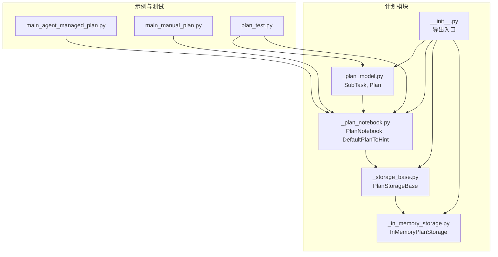
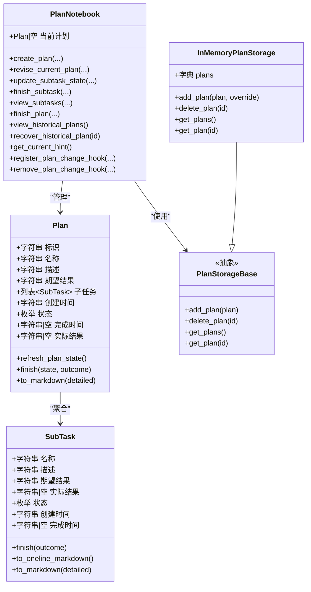
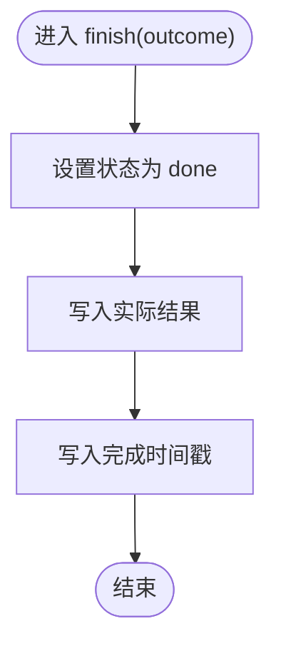
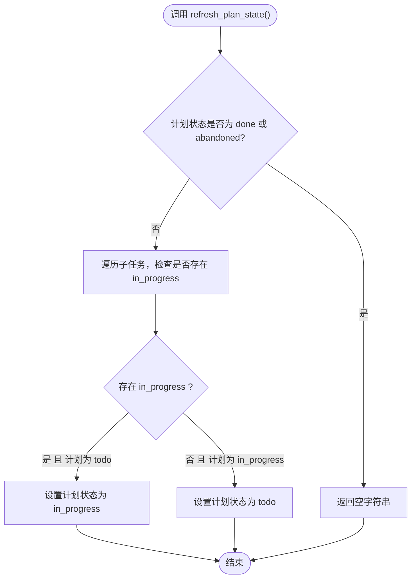
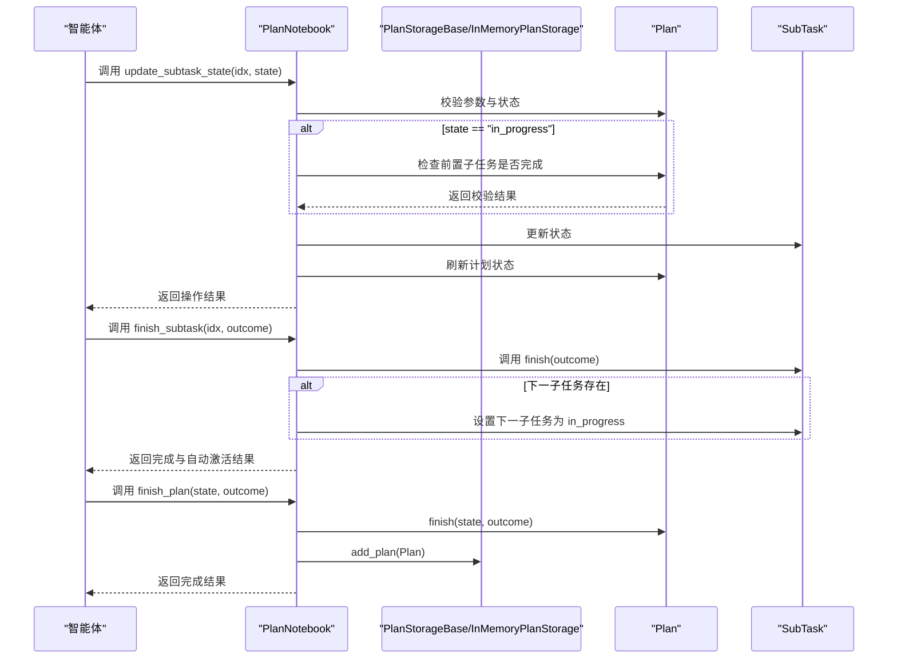
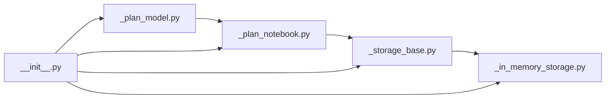

# 计划模型

<cite>
**本文引用的文件**
- [src/agentscope/plan/_plan_model.py](file://src/agentscope/plan/_plan_model.py)
- [src/agentscope/plan/_plan_notebook.py](file://src/agentscope/plan/_plan_notebook.py)
- [src/agentscope/plan/_storage_base.py](file://src/agentscope/plan/_storage_base.py)
- [src/agentscope/plan/_in_memory_storage.py](file://src/agentscope/plan/_in_memory_storage.py)
- [src/agentscope/plan/__init__.py](file://src/agentscope/plan/__init__.py)
- [examples/functionality/plan/main_agent_managed_plan.py](file://examples/functionality/plan/main_agent_managed_plan.py)
- [examples/functionality/plan/main_manual_plan.py](file://examples/functionality/plan/main_manual_plan.py)
- [tests/plan_test.py](file://tests/plan_test.py)
</cite>

## 目录
1. [简介](#简介)
2. [项目结构](#项目结构)
3. [核心组件](#核心组件)
4. [架构总览](#架构总览)
5. [详细组件分析](#详细组件分析)
6. [依赖关系分析](#依赖关系分析)
7. [性能考量](#性能考量)
8. [故障排查指南](#故障排查指南)
9. [结论](#结论)
10. [附录：API 参考与最佳实践](#附录api-参考与最佳实践)

## 简介
本文件面向 AgentScope 的“计划模型”模块，系统性地解析 Plan 与 SubTask 两大核心数据模型的设计与实现，涵盖字段定义、数据验证规则、状态管理机制、生命周期流程、Markdown 报告输出、序列化/反序列化、以及与 PlanNotebook 工具集的集成方式。文档同时提供使用示例、API 参考、错误处理指南与最佳实践建议，帮助开发者在实际项目中正确、安全、高效地使用计划模型。

## 项目结构
计划模型位于 src/agentscope/plan 目录下，主要由以下文件组成：
- 模型定义：_plan_model.py
- 计划笔记本与工具集：_plan_notebook.py
- 存储接口与内存存储：_storage_base.py、_in_memory_storage.py
- 包导出：__init__.py
- 示例与测试：examples/functionality/plan/*、tests/plan_test.py

图表来源
- [src/agentscope/plan/_plan_model.py:11-201](file://src/agentscope/plan/_plan_model.py#L11-L201)
- [src/agentscope/plan/_plan_notebook.py:16-905](file://src/agentscope/plan/_plan_notebook.py#L16-L905)
- [src/agentscope/plan/_storage_base.py:9-27](file://src/agentscope/plan/_storage_base.py#L9-L27)
- [src/agentscope/plan/_in_memory_storage.py:9-71](file://src/agentscope/plan/_in_memory_storage.py#L9-L71)
- [src/agentscope/plan/__init__.py:3-22](file://src/agentscope/plan/__init__.py#L3-L22)
- [examples/functionality/plan/main_agent_managed_plan.py:1-66](file://examples/functionality/plan/main_agent_managed_plan.py#L1-L66)
- [examples/functionality/plan/main_manual_plan.py:1-102](file://examples/functionality/plan/main_manual_plan.py#L1-L102)
- [tests/plan_test.py:1-824](file://tests/plan_test.py#L1-L824)

章节来源
- [src/agentscope/plan/__init__.py:3-22](file://src/agentscope/plan/__init__.py#L3-L22)

## 核心组件
- SubTask：单个子任务的数据模型，包含名称、描述、期望结果、实际结果、状态、时间戳等字段，并提供完成标记与 Markdown 输出能力。
- Plan：计划模型，聚合多个 SubTask，维护自身状态与完成时间戳，并提供刷新计划状态与完成/放弃的能力。
- PlanNotebook：计划笔记本，提供一系列工具函数供智能体调用，如创建计划、修订计划、更新子任务状态、完成子任务、查看历史计划、恢复历史计划等；并内置默认提示生成器 DefaultPlanToHint。
- 存储层：PlanStorageBase 定义抽象接口，InMemoryPlanStorage 提供基于内存的实现，支持序列化/反序列化。

章节来源
- [src/agentscope/plan/_plan_model.py:11-201](file://src/agentscope/plan/_plan_model.py#L11-L201)
- [src/agentscope/plan/_plan_notebook.py:172-905](file://src/agentscope/plan/_plan_notebook.py#L172-L905)
- [src/agentscope/plan/_storage_base.py:9-27](file://src/agentscope/plan/_storage_base.py#L9-L27)
- [src/agentscope/plan/_in_memory_storage.py:9-71](file://src/agentscope/plan/_in_memory_storage.py#L9-L71)

## 架构总览
计划模型采用“数据模型 + 工具集 + 存储”的分层设计：
- 数据模型层：SubTask/Plan 使用 Pydantic BaseModel 进行字段校验与序列化。
- 工具集层：PlanNotebook 封装了计划生命周期管理与提示生成，暴露可被智能体调用的工具函数。
- 存储层：通过 PlanStorageBase 抽象，InMemoryPlanStorage 提供内存持久化，便于会话内保存已完成计划。

图表来源
- [src/agentscope/plan/_plan_model.py:11-201](file://src/agentscope/plan/_plan_model.py#L11-L201)
- [src/agentscope/plan/_plan_notebook.py:172-905](file://src/agentscope/plan/_plan_notebook.py#L172-L905)
- [src/agentscope/plan/_storage_base.py:9-27](file://src/agentscope/plan/_storage_base.py#L9-L27)
- [src/agentscope/plan/_in_memory_storage.py:9-71](file://src/agentscope/plan/_in_memory_storage.py#L9-L71)

## 详细组件分析

### SubTask 数据模型
- 字段与约束
  - 名称：简洁、可读、不超过限定词数。
  - 描述：清晰、具体、可衡量，包含约束、目标与预期成果。
  - 期望结果：具体、可验证。
  - 实际结果：完成后填充。
  - 状态：枚举值，仅允许 todo、in_progress、done、abandoned。
  - 时间戳：创建时间默认使用通用时间函数生成；完成时自动记录完成时间。
- 方法
  - finish(outcome)：将状态置为 done，写入实际结果与完成时间。
  - to_oneline_markdown()：输出一行 Markdown 复选框样式。
  - to_markdown(detailed)：输出详细 Markdown，包含各字段；当状态为 done 时追加完成时间与实际结果。

图表来源
- [src/agentscope/plan/_plan_model.py:52-57](file://src/agentscope/plan/_plan_model.py#L52-L57)

章节来源
- [src/agentscope/plan/_plan_model.py:11-102](file://src/agentscope/plan/_plan_model.py#L11-L102)

### Plan 数据模型
- 字段与约束
  - 标识：自动生成唯一 ID。
  - 名称/描述/期望结果：与 SubTask 类似，强调可衡量性。
  - 子任务：有序列表，按顺序执行。
  - 状态：todo、in_progress、done、abandoned。
  - 时间戳：创建时间与完成时间。
- 方法
  - refresh_plan_state()：根据子任务状态刷新计划状态，仅在 todo 与 in_progress 之间切换。
  - finish(state, outcome)：完成或放弃计划，记录完成时间与结果。
  - to_markdown(detailed)：输出包含标题、描述、期望结果、状态、创建时间与子任务列表的 Markdown 报告。

图表来源
- [src/agentscope/plan/_plan_model.py:148-167](file://src/agentscope/plan/_plan_model.py#L148-L167)

章节来源
- [src/agentscope/plan/_plan_model.py:104-201](file://src/agentscope/plan/_plan_model.py#L104-L201)

### PlanNotebook 工具集与提示生成
- 默认提示生成器 DefaultPlanToHint
  - 基于当前计划状态生成引导消息，覆盖“无计划”、“初始阶段”、“有子任务进行中”、“部分完成但无进行中”、“全部完成”等场景。
- 主要工具函数
  - create_plan：创建新计划，若已有当前计划则替换。
  - revise_current_plan：在指定索引处新增、修订或删除子任务。
  - update_subtask_state：更新子任务状态，限制同一时刻仅一个子任务处于 in_progress，并遵循“先完成再开始”的顺序约束。
  - finish_subtask：完成子任务，自动激活下一个子任务（若存在）。
  - view_subtasks：查看指定索引的子任务详情。
  - finish_plan：完成或放弃当前计划，写入历史存储。
  - view_historical_plans / recover_historical_plan：查看与恢复历史计划。
  - get_current_hint：获取当前提示消息。
  - 钩子注册：register_plan_change_hook/remove_plan_change_hook，用于前端或其他组件订阅计划变更事件。
- 状态管理
  - PlanNotebook 继承 StateModule，对 current_plan 进行注册，支持序列化/反序列化，确保智能体状态可持久化。

图表来源
- [src/agentscope/plan/_plan_notebook.py:433-737](file://src/agentscope/plan/_plan_notebook.py#L433-L737)
- [src/agentscope/plan/_in_memory_storage.py:26-40](file://src/agentscope/plan/_in_memory_storage.py#L26-L40)

章节来源
- [src/agentscope/plan/_plan_notebook.py:16-905](file://src/agentscope/plan/_plan_notebook.py#L16-L905)

### 存储层
- PlanStorageBase：定义 add_plan/delete_plan/get_plans/get_plan 四个抽象方法。
- InMemoryPlanStorage：基于有序字典存储，支持序列化/反序列化，键为计划 ID，值为 Plan 实例；提供 override 控制重复 ID 的行为。

章节来源
- [src/agentscope/plan/_storage_base.py:9-27](file://src/agentscope/plan/_storage_base.py#L9-L27)
- [src/agentscope/plan/_in_memory_storage.py:9-71](file://src/agentscope/plan/_in_memory_storage.py#L9-L71)

## 依赖关系分析
- 模块间依赖
  - _plan_model.py 被 _plan_notebook.py 引用，提供 SubTask/Plan 类型。
  - _plan_notebook.py 依赖 _storage_base.py 与 _in_memory_storage.py，以实现历史计划的存取。
  - __init__.py 导出 SubTask、Plan、PlanNotebook、DefaultPlanToHint、PlanStorageBase、InMemoryPlanStorage。
- 外部依赖
  - Pydantic BaseModel 用于字段校验与序列化。
  - shortuuid 用于生成唯一标识。
  - 通用时间函数用于时间戳生成。

图表来源
- [src/agentscope/plan/__init__.py:3-22](file://src/agentscope/plan/__init__.py#L3-L22)
- [src/agentscope/plan/_plan_model.py:1-10](file://src/agentscope/plan/_plan_model.py#L1-L10)
- [src/agentscope/plan/_plan_notebook.py:1-14](file://src/agentscope/plan/_plan_notebook.py#L1-L14)
- [src/agentscope/plan/_storage_base.py:1-7](file://src/agentscope/plan/_storage_base.py#L1-L7)
- [src/agentscope/plan/_in_memory_storage.py:1-7](file://src/agentscope/plan/_in_memory_storage.py#L1-L7)

## 性能考量
- 序列化/反序列化
  - SubTask/Plan 使用 Pydantic 的 model_dump()/model_validate，开销较低，适合频繁状态同步。
  - InMemoryPlanStorage 对 plans 字典进行注册，避免额外拷贝，提升读写效率。
- 状态刷新
  - refresh_plan_state() 遍历子任务，复杂度 O(n)，在子任务数量合理范围内影响可忽略。
- 并发与异步
  - PlanNotebook 的工具函数均为异步，适配智能体并发执行场景；内部通过状态钩子触发外部回调，注意避免阻塞。

[本节为通用指导，不直接分析具体文件，故无章节来源]

## 故障排查指南
- 常见错误路径与提示
  - 未创建计划即调用修订/更新/完成：抛出异常或返回错误文本，需先调用 create_plan。
  - 子任务索引越界：返回“无效索引”提示。
  - 状态非法：返回“无效状态”提示。
  - 更新为 in_progress 但前置子任务未完成：提示需先完成前置任务。
  - finish_subtask 时前置子任务未完成：提示需先完成前置任务。
  - finish_plan 时无当前计划：提示“无计划可完成”。
- 边界与回归
  - 测试覆盖了历史计划查看/恢复、钩子注册/移除、状态序列化/反序列化、自动激活下一子任务等场景，建议在集成时复用这些断言逻辑。

章节来源
- [tests/plan_test.py:665-785](file://tests/plan_test.py#L665-L785)

## 结论
计划模型通过清晰的数据结构与严格的工具集约束，实现了从“计划创建—子任务执行—计划收尾”的完整闭环。配合 PlanNotebook 的提示生成与存储能力，能够有效支撑复杂任务的分解与执行。建议在生产环境中：
- 明确子任务粒度与顺序约束，避免 in_progress 并发。
- 使用历史计划功能归档已完成计划，便于审计与复盘。
- 合理利用状态钩子，驱动前端或日志系统实时更新。

[本节为总结性内容，不直接分析具体文件，故无章节来源]

## 附录：API 参考与最佳实践

### API 参考

- SubTask
  - 字段
    - name: 字符串，必填
    - description: 字符串，必填
    - expected_outcome: 字符串，必填
    - outcome: 字符串或空，可选
    - state: 枚举 "todo"|"in_progress"|"done"|"abandoned"，默认 "todo"
    - created_at: 字符串，创建时间，默认工厂函数生成
    - finished_at: 字符串或空，完成时间，默认空
  - 方法
    - finish(outcome): 将状态置为 done，写入实际结果与完成时间
    - to_oneline_markdown(): 一行 Markdown 输出
    - to_markdown(detailed=False/True): 详细/简略 Markdown 输出

- Plan
  - 字段
    - id: 字符串，唯一标识，自动生成
    - name/description/expected_outcome: 字符串，必填
    - subtasks: SubTask 列表，必填
    - created_at/state/outcome/finished_at: 时间戳与状态，可选
  - 方法
    - refresh_plan_state(): 刷新计划状态
    - finish(state, outcome): 完成或放弃计划
    - to_markdown(detailed): 生成 Markdown 报告

- PlanNotebook
  - 工具函数
    - create_plan(name, description, expected_outcome, subtasks)
    - revise_current_plan(subtask_idx, action, subtask=None)
      - action: "add"|"revise"|"delete"
    - update_subtask_state(subtask_idx, state)
      - state: "todo"|"in_progress"|"abandoned"
    - finish_subtask(subtask_idx, subtask_outcome)
    - view_subtasks(subtask_idx: list[int])
    - finish_plan(state, outcome)
      - state: "done"|"abandoned"
    - view_historical_plans()
    - recover_historical_plan(plan_id)
    - get_current_hint()
    - list_tools()
    - register_plan_change_hook(name, hook)
    - remove_plan_change_hook(name)
  - 状态管理
    - 注册 current_plan 的序列化/反序列化钩子

- 存储接口
  - PlanStorageBase
    - add_plan(plan)
    - delete_plan(plan_id)
    - get_plans() -> list[Plan]
    - get_plan(plan_id) -> Plan|None
  - InMemoryPlanStorage
    - add_plan(plan, override=True)
    - delete_plan(plan_id)
    - get_plans()
    - get_plan(plan_id)

章节来源
- [src/agentscope/plan/_plan_model.py:11-201](file://src/agentscope/plan/_plan_model.py#L11-L201)
- [src/agentscope/plan/_plan_notebook.py:172-905](file://src/agentscope/plan/_plan_notebook.py#L172-L905)
- [src/agentscope/plan/_storage_base.py:9-27](file://src/agentscope/plan/_storage_base.py#L9-L27)
- [src/agentscope/plan/_in_memory_storage.py:9-71](file://src/agentscope/plan/_in_memory_storage.py#L9-L71)

### 最佳实践
- 字段约束
  - 名称与描述应简洁明确，避免歧义；期望结果必须可衡量。
  - 状态枚举严格控制，避免非法状态传播。
- 生命周期管理
  - 严格遵循“先完成前置任务再开始下一个”的顺序，避免 in_progress 并发。
  - 使用 finish_subtask 自动激活下一子任务，减少手动干预。
- 报告与可视化
  - 使用 to_markdown 生成报告，结合 DefaultPlanToHint 的提示消息，提升可读性。
- 序列化与恢复
  - 在智能体状态保存/加载时，确保 PlanNotebook 的 current_plan 与 InMemoryPlanStorage 的 plans 正确序列化/反序列化。
- 错误处理
  - 对索引越界、状态非法、前置任务未完成等情况，PlanNotebook 已提供明确提示；建议在上层统一捕获并反馈给用户。

### 使用示例

- 手动创建计划并交给智能体执行
  - 参考示例：examples/functionality/plan/main_manual_plan.py
  - 关键步骤
    - 使用 Toolkit 注册工具函数（如 shell/python/文件读写）。
    - 创建 ReActAgent 并注入 PlanNotebook。
    - 调用 plan_notebook.create_plan(...) 创建计划。
    - 通过 update_subtask_state/finish_subtask 管理子任务。
    - 通过 finish_plan 完成或放弃计划。

- 由智能体自动管理计划
  - 参考示例：examples/functionality/plan/main_agent_managed_plan.py
  - 关键步骤
    - 创建 ReActAgent 时启用 plan_notebook。
    - 通过智能体对话逐步生成与执行计划。

- 单元测试中的典型用法
  - 参考测试：tests/plan_test.py
  - 关键点
    - 创建 SubTask/Plan 实例，调用 to_markdown 生成报告。
    - 使用 PlanNotebook 的工具函数进行计划修订、状态更新、完成与历史管理。
    - 验证序列化/反序列化后的状态一致性。

章节来源
- [examples/functionality/plan/main_manual_plan.py:20-102](file://examples/functionality/plan/main_manual_plan.py#L20-L102)
- [examples/functionality/plan/main_agent_managed_plan.py:21-66](file://examples/functionality/plan/main_agent_managed_plan.py#L21-L66)
- [tests/plan_test.py:119-277](file://tests/plan_test.py#L119-L277)