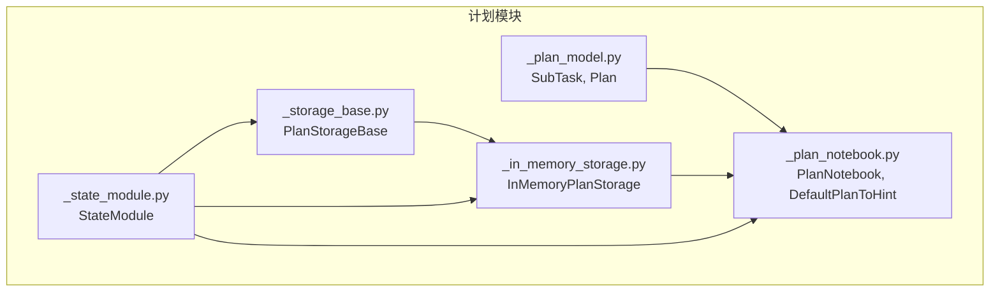
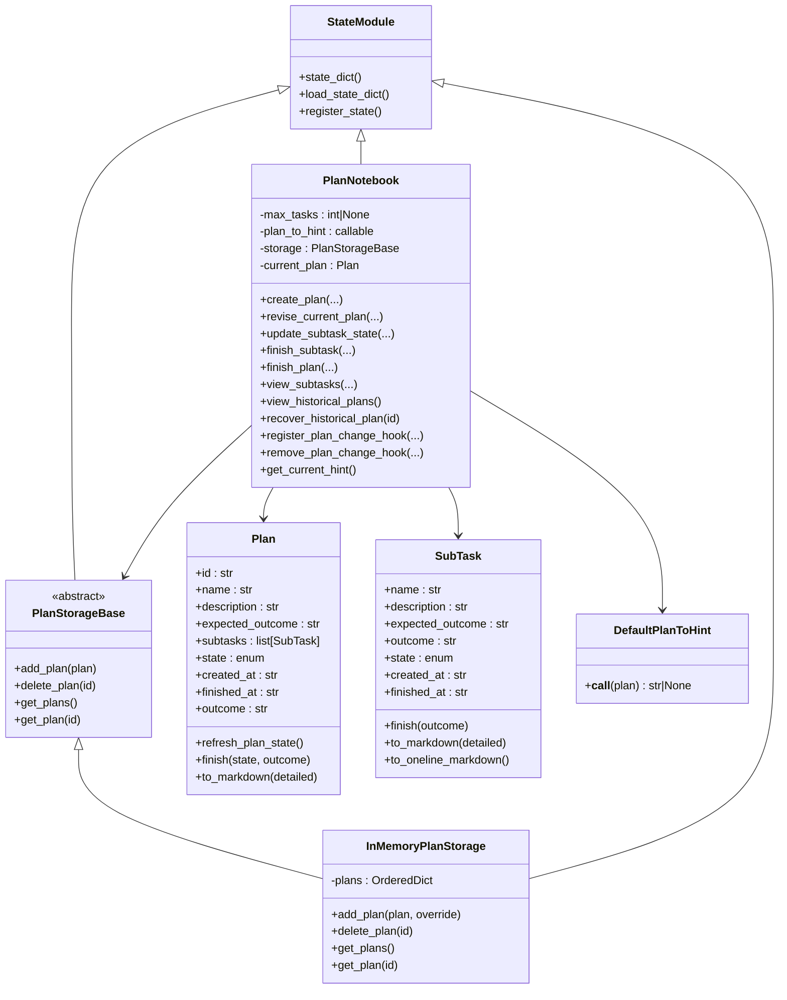
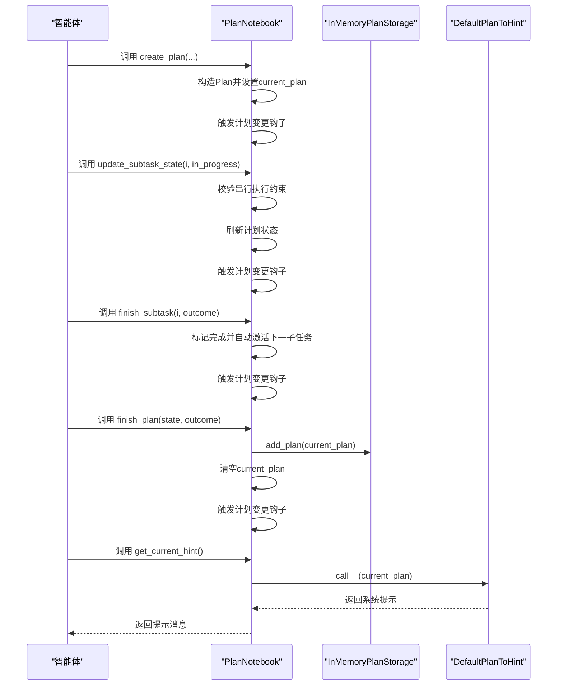
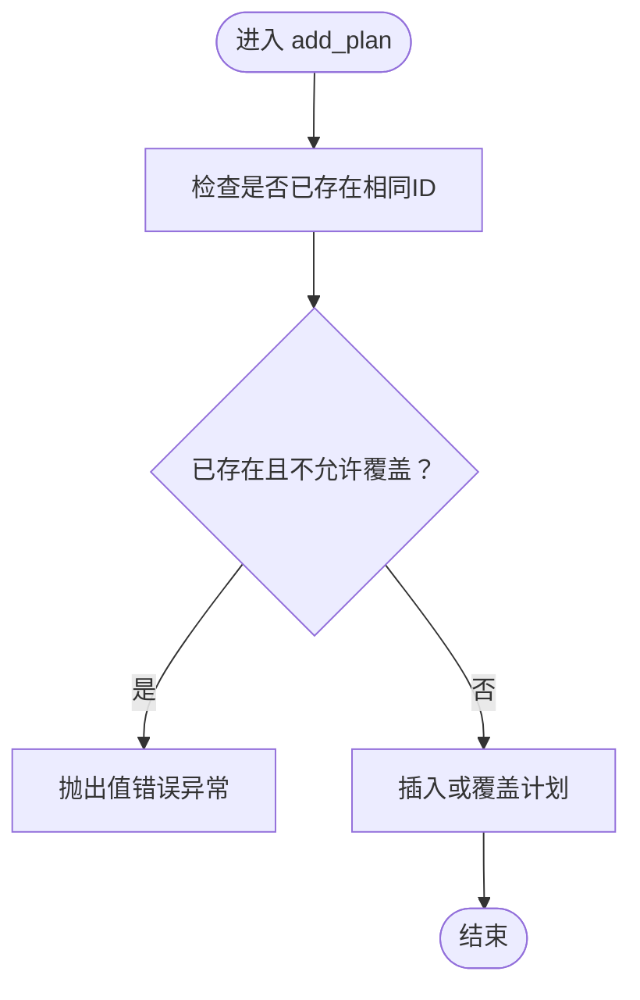
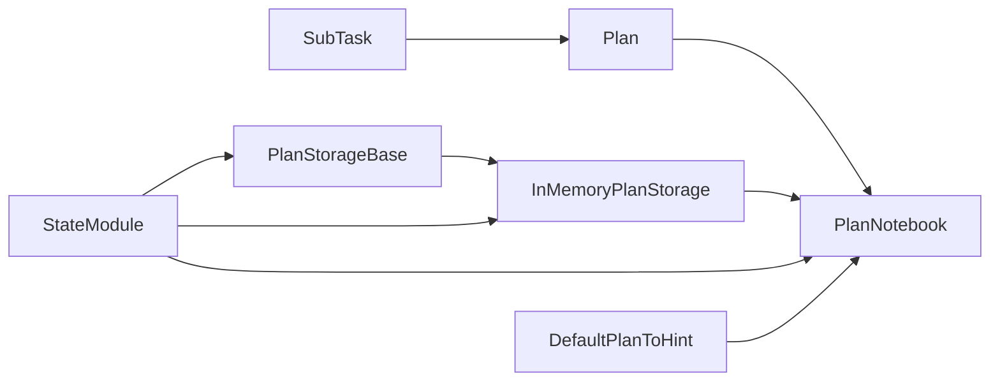

# 计划系统

<cite>
**本文档引用的文件**
- [plan/__init__.py](file://src/agentscope/plan/__init__.py)
- [plan/_plan_model.py](file://src/agentscope/plan/_plan_model.py)
- [plan/_plan_notebook.py](file://src/agentscope/plan/_plan_notebook.py)
- [plan/_storage_base.py](file://src/agentscope/plan/_storage_base.py)
- [plan/_in_memory_storage.py](file://src/agentscope/plan/_in_memory_storage.py)
- [module/_state_module.py](file://src/agentscope/module/_state_module.py)
- [examples/functionality/plan/main_agent_managed_plan.py](file://examples/functionality/plan/main_agent_managed_plan.py)
- [examples/functionality/plan/main_manual_plan.py](file://examples/functionality/plan/main_manual_plan.py)
- [docs/tutorial/zh_CN/src/task_plan.py](file://docs/tutorial/zh_CN/src/task_plan.py)
- [tests/plan_test.py](file://tests/plan_test.py)
</cite>

## 目录
1. [简介](#简介)
2. [项目结构](#项目结构)
3. [核心组件](#核心组件)
4. [架构总览](#架构总览)
5. [组件详解](#组件详解)
6. [依赖关系分析](#依赖关系分析)
7. [性能考量](#性能考量)
8. [故障排除指南](#故障排除指南)
9. [结论](#结论)
10. [附录](#附录)

## 简介
本文件面向AgentScope计划系统，围绕“计划模型设计、存储系统、笔记本计划（PlanNotebook）与提示工程、配置与最佳实践”等维度，提供从架构到实现细节的完整技术文档。读者将了解：
- 计划结构定义与状态流转
- 存储层抽象与内存/持久化存储的统一接口
- 计划笔记本如何与智能体协作，提供提示与工具函数
- 配置项、性能优化与数据迁移策略
- 使用示例、设计模式与排障建议

## 项目结构
计划系统位于src/agentscope/plan目录，核心文件包括：
- 计划模型：SubTask、Plan
- 计划笔记本：PlanNotebook及其默认提示生成器DefaultPlanToHint
- 存储接口：PlanStorageBase
- 内存存储实现：InMemoryPlanStorage
- 状态模块基类：StateModule（用于序列化/反序列化）

图表来源
- [plan/_plan_model.py:11-201](file://src/agentscope/plan/_plan_model.py#L11-L201)
- [plan/_plan_notebook.py:172-800](file://src/agentscope/plan/_plan_notebook.py#L172-L800)
- [plan/_storage_base.py:9-27](file://src/agentscope/plan/_storage_base.py#L9-L27)
- [plan/_in_memory_storage.py:9-71](file://src/agentscope/plan/_in_memory_storage.py#L9-L71)
- [module/_state_module.py:20-152](file://src/agentscope/module/_state_module.py#L20-L152)

章节来源
- [plan/__init__.py:1-22](file://src/agentscope/plan/__init__.py#L1-L22)
- [plan/_plan_model.py:11-201](file://src/agentscope/plan/_plan_model.py#L11-L201)
- [plan/_plan_notebook.py:172-800](file://src/agentscope/plan/_plan_notebook.py#L172-L800)
- [plan/_storage_base.py:9-27](file://src/agentscope/plan/_storage_base.py#L9-L27)
- [plan/_in_memory_storage.py:9-71](file://src/agentscope/plan/_in_memory_storage.py#L9-L71)
- [module/_state_module.py:20-152](file://src/agentscope/module/_state_module.py#L20-L152)

## 核心组件
- 计划模型
  - SubTask：子任务实体，包含名称、描述、期望产出、实际产出、状态、时间戳等字段；提供完成标记与Markdown渲染能力。
  - Plan：计划实体，包含唯一ID、名称、描述、期望产出、子任务列表、状态、时间戳等；提供刷新计划状态与完成标记能力。
- 计划笔记本
  - PlanNotebook：提供计划生命周期管理工具函数（创建、修订、更新状态、完成子任务、完成计划、查看历史、恢复历史），并注入提示消息以指导智能体。
  - DefaultPlanToHint：默认提示生成器，根据当前计划状态动态生成系统提示，覆盖“无计划、初始阶段、有子任务进行中、无子任务进行中、全部完成”等场景。
- 存储系统
  - PlanStorageBase：抽象存储接口，定义添加、删除、查询全部、按ID查询计划的方法。
  - InMemoryPlanStorage：基于有序字典的内存存储，支持序列化/反序列化，便于会话级持久化。
- 状态模块
  - StateModule：通用状态序列化/反序列化框架，PlanNotebook与存储均继承自该基类，确保状态可保存与恢复。

章节来源
- [plan/_plan_model.py:11-201](file://src/agentscope/plan/_plan_model.py#L11-L201)
- [plan/_plan_notebook.py:16-170](file://src/agentscope/plan/_plan_notebook.py#L16-L170)
- [plan/_storage_base.py:9-27](file://src/agentscope/plan/_storage_base.py#L9-L27)
- [plan/_in_memory_storage.py:9-71](file://src/agentscope/plan/_in_memory_storage.py#L9-L71)
- [module/_state_module.py:20-152](file://src/agentscope/module/_state_module.py#L20-L152)

## 架构总览
计划系统采用“模型-笔记本-存储-状态模块”的分层架构：
- 模型层：定义计划与子任务的数据结构与行为
- 笔记本层：封装计划管理工具函数与提示生成逻辑
- 存储层：抽象历史计划的增删查能力，内存实现便于开发调试
- 状态层：统一序列化/反序列化，支撑跨会话恢复

图表来源
- [plan/_plan_model.py:11-201](file://src/agentscope/plan/_plan_model.py#L11-L201)
- [plan/_plan_notebook.py:16-170](file://src/agentscope/plan/_plan_notebook.py#L16-L170)
- [plan/_storage_base.py:9-27](file://src/agentscope/plan/_storage_base.py#L9-L27)
- [plan/_in_memory_storage.py:9-71](file://src/agentscope/plan/_in_memory_storage.py#L9-L71)
- [module/_state_module.py:20-152](file://src/agentscope/module/_state_module.py#L20-L152)

## 组件详解

### 计划模型：SubTask与Plan
- 字段与约束
  - SubTask：名称、描述、期望产出、实际产出、状态（todo/in_progress/done/abandoned）、创建/完成时间戳；提供完成标记与Markdown渲染。
  - Plan：唯一ID、名称、描述、期望产出、子任务列表、状态、创建/完成时间戳、最终产出；提供刷新计划状态与完成标记。
- 状态机与刷新逻辑
  - Plan.refresh_plan_state：根据子任务状态自动在“todo/in_progress”间切换，保证计划状态与子任务执行进度一致。
- 渲染与输出
  - SubTask.to_markdown/to_oneline_markdown：支持简洁/详细两种Markdown格式输出，便于提示与展示。

章节来源
- [plan/_plan_model.py:11-201](file://src/agentscope/plan/_plan_model.py#L11-L201)

### 计划笔记本：PlanNotebook与DefaultPlanToHint
- 角色与职责
  - PlanNotebook：提供计划生命周期管理工具函数，维护当前计划current_plan，与存储交互保存历史计划；通过注册钩子实现可视化与监控。
  - DefaultPlanToHint：根据计划状态生成系统提示，覆盖“无计划、初始、进行中、无进行中、全部完成”等场景，指导智能体下一步操作。
- 关键流程
  - 创建计划：create_plan
  - 修订计划：revise_current_plan（支持新增、修订、删除子任务）
  - 更新子任务状态：update_subtask_state（严格约束串行执行，仅允许一个子任务处于进行中）
  - 完成子任务：finish_subtask（自动激活下一个子任务）
  - 完成/放弃计划：finish_plan（完成后写入历史）
  - 历史管理：view_historical_plans、recover_historical_plan
  - 提示生成：get_current_hint（委托DefaultPlanToHint）
- 状态管理
  - 通过StateModule.register_state注册current_plan与存储状态，支持state_dict/load_state_dict实现跨会话恢复。

图表来源
- [plan/_plan_notebook.py:232-737](file://src/agentscope/plan/_plan_notebook.py#L232-L737)
- [plan/_in_memory_storage.py:26-71](file://src/agentscope/plan/_in_memory_storage.py#L26-L71)
- [plan/_plan_model.py:148-178](file://src/agentscope/plan/_plan_model.py#L148-L178)

章节来源
- [plan/_plan_notebook.py:16-170](file://src/agentscope/plan/_plan_notebook.py#L16-L170)
- [plan/_plan_notebook.py:195-231](file://src/agentscope/plan/_plan_notebook.py#L195-L231)
- [plan/_plan_notebook.py:232-737](file://src/agentscope/plan/_plan_notebook.py#L232-L737)
- [plan/_in_memory_storage.py:12-24](file://src/agentscope/plan/_in_memory_storage.py#L12-L24)

### 存储系统：PlanStorageBase与InMemoryPlanStorage
- 接口契约
  - add_plan(plan)：添加计划
  - delete_plan(id)：删除计划
  - get_plans()：获取全部历史计划
  - get_plan(id)：按ID获取计划
- 内存实现
  - InMemoryPlanStorage：内部以有序字典存储，支持序列化/反序列化（注册plans状态，转换为Plan模型字典再还原）。
  - 默认覆盖策略：若重复ID且不覆盖，抛出异常；否则替换。
- 状态模块集成
  - 通过StateModule实现状态注册，确保存储状态可保存与恢复。

图表来源
- [plan/_in_memory_storage.py:26-39](file://src/agentscope/plan/_in_memory_storage.py#L26-L39)

章节来源
- [plan/_storage_base.py:9-27](file://src/agentscope/plan/_storage_base.py#L9-L27)
- [plan/_in_memory_storage.py:9-71](file://src/agentscope/plan/_in_memory_storage.py#L9-L71)
- [module/_state_module.py:108-152](file://src/agentscope/module/_state_module.py#L108-L152)

### 状态模块：StateModule
- 功能要点
  - state_dict/load_state_dict：递归序列化/反序列化嵌套模块与注册属性
  - register_state：注册需要序列化的属性，支持自定义JSON转换函数
- 在计划系统中的应用
  - PlanNotebook注册current_plan
  - InMemoryPlanStorage注册plans
  - PlanStorageBase继承自StateModule，确保存储具备状态能力

章节来源
- [module/_state_module.py:20-152](file://src/agentscope/module/_state_module.py#L20-L152)
- [plan/_plan_notebook.py:226-230](file://src/agentscope/plan/_plan_notebook.py#L226-L230)
- [plan/_in_memory_storage.py:18-24](file://src/agentscope/plan/_in_memory_storage.py#L18-L24)

### 提示工程：DefaultPlanToHint
- 场景化提示
  - 无计划：引导创建计划
  - 初始阶段：显示计划概览与首个子任务操作指引
  - 进行中：聚焦当前子任务详情与下一步操作
  - 无进行中：提示激活下一个子任务
  - 全部完成：引导完成/总结/修订
- 输出包装
  - 使用系统提示标签包裹，便于智能体识别与处理

章节来源
- [plan/_plan_notebook.py:16-170](file://src/agentscope/plan/_plan_notebook.py#L16-L170)

## 依赖关系分析
- 组件耦合
  - PlanNotebook依赖SubTask/Plan模型与存储接口；默认使用InMemoryPlanStorage；通过StateModule实现状态管理。
  - PlanStorageBase为抽象接口，InMemoryPlanStorage为其具体实现。
  - DefaultPlanToHint与PlanNotebook配合，形成“提示生成-工具函数-状态管理”的闭环。
- 外部依赖
  - 消息与工具响应类型来自消息与工具模块（在笔记本中用于封装返回内容）
  - 时间戳生成来自公共工具函数

图表来源
- [plan/_plan_model.py:11-201](file://src/agentscope/plan/_plan_model.py#L11-L201)
- [plan/_plan_notebook.py:16-170](file://src/agentscope/plan/_plan_notebook.py#L16-L170)
- [plan/_storage_base.py:9-27](file://src/agentscope/plan/_storage_base.py#L9-L27)
- [plan/_in_memory_storage.py:9-71](file://src/agentscope/plan/_in_memory_storage.py#L9-L71)
- [module/_state_module.py:20-152](file://src/agentscope/module/_state_module.py#L20-L152)

章节来源
- [plan/_plan_model.py:11-201](file://src/agentscope/plan/_plan_model.py#L11-L201)
- [plan/_plan_notebook.py:16-170](file://src/agentscope/plan/_plan_notebook.py#L16-L170)
- [plan/_storage_base.py:9-27](file://src/agentscope/plan/_storage_base.py#L9-L27)
- [plan/_in_memory_storage.py:9-71](file://src/agentscope/plan/_in_memory_storage.py#L9-L71)
- [module/_state_module.py:20-152](file://src/agentscope/module/_state_module.py#L20-L152)

## 性能考量
- 内存存储
  - InMemoryPlanStorage使用有序字典，适合开发与小规模场景；大规模历史计划建议实现持久化存储（如基于文件/数据库的PlanStorageBase子类）。
- 序列化开销
  - 状态序列化/反序列化涉及模型字典转换，建议在高频调用场景下减少不必要的状态落盘。
- 并发与异步
  - 所有存储与笔记本操作均为异步，注意在高并发场景下避免竞态条件（例如同一时刻多次更新子任务状态）。
- 提示生成
  - DefaultPlanToHint为纯计算逻辑，开销极低；若自定义提示函数，建议缓存热点计划摘要以降低重复计算。

[本节为通用性能建议，不直接分析具体文件]

## 故障排除指南
- 常见错误与定位
  - 未创建计划即调用修订/更新/完成：抛出值错误，需先调用create_plan。
  - 子任务索引越界或类型错误：返回工具响应并提示合法范围。
  - 同时存在多个“进行中”子任务：拒绝更新，需先完成当前子任务。
  - 完成子任务前序子任务未完成：拒绝更新，提示先完成前置任务。
  - 恢复历史计划失败：ID不存在时返回提示信息。
- 单元测试覆盖
  - 测试涵盖计划模型渲染、工具函数清单、提示生成场景、状态序列化/反序列化、历史计划恢复与钩子触发等关键路径。

章节来源
- [tests/plan_test.py:665-785](file://tests/plan_test.py#L665-L785)
- [plan/_plan_notebook.py:295-393](file://src/agentscope/plan/_plan_notebook.py#L295-L393)
- [plan/_plan_notebook.py:433-546](file://src/agentscope/plan/_plan_notebook.py#L433-L546)
- [plan/_plan_notebook.py:548-651](file://src/agentscope/plan/_plan_notebook.py#L548-L651)
- [plan/_plan_notebook.py:762-800](file://src/agentscope/plan/_plan_notebook.py#L762-L800)

## 结论
AgentScope计划系统以清晰的模型-笔记本-存储三层架构，结合StateModule的状态管理能力，提供了从计划创建、执行监控到历史恢复的完整闭环。DefaultPlanToHint与工具函数共同构成智能体的“计划执行助手”，既满足开发者手动规划的需求，也支持智能体自主管理计划。通过抽象存储接口，系统具备良好的扩展性，便于接入持久化存储与多会话恢复。

[本节为总结性内容，不直接分析具体文件]

## 附录

### 使用示例
- 智能体管理的计划执行
  - 示例展示了如何将PlanNotebook注入ReActAgent，由智能体自行创建与管理计划。
- 手动规范计划
  - 示例展示了如何手动创建计划并通过PlanNotebook初始化智能体，随后与用户交互完成任务。

章节来源
- [examples/functionality/plan/main_agent_managed_plan.py:21-66](file://examples/functionality/plan/main_agent_managed_plan.py#L21-L66)
- [examples/functionality/plan/main_manual_plan.py:23-102](file://examples/functionality/plan/main_manual_plan.py#L23-L102)

### API参考（计划模块）
- PlanNotebook
  - 构造参数：max_subtasks、plan_to_hint、storage
  - 核心方法：create_plan、revise_current_plan、update_subtask_state、finish_subtask、finish_plan、view_subtasks、view_historical_plans、recover_historical_plan、register_plan_change_hook、remove_plan_change_hook、get_current_hint
- PlanStorageBase
  - 抽象方法：add_plan、delete_plan、get_plans、get_plan
- InMemoryPlanStorage
  - 实现方法：add_plan、delete_plan、get_plans、get_plan
- Plan/ SubTask
  - Plan.refresh_plan_state、Plan.finish、SubTask.finish、to_markdown、to_oneline_markdown
- DefaultPlanToHint
  - __call__(plan): 根据计划状态生成提示

章节来源
- [plan/__init__.py:3-21](file://src/agentscope/plan/__init__.py#L3-L21)
- [plan/_plan_notebook.py:195-231](file://src/agentscope/plan/_plan_notebook.py#L195-L231)
- [plan/_plan_notebook.py:232-737](file://src/agentscope/plan/_plan_notebook.py#L232-L737)
- [plan/_storage_base.py:12-26](file://src/agentscope/plan/_storage_base.py#L12-L26)
- [plan/_in_memory_storage.py:26-71](file://src/agentscope/plan/_in_memory_storage.py#L26-L71)
- [plan/_plan_model.py:148-201](file://src/agentscope/plan/_plan_model.py#L148-L201)
- [plan/_plan_model.py:52-101](file://src/agentscope/plan/_plan_model.py#L52-L101)
- [plan/_plan_notebook.py:16-170](file://src/agentscope/plan/_plan_notebook.py#L16-L170)

### 配置与最佳实践
- 存储后端选择
  - 开发/演示：使用默认InMemoryPlanStorage
  - 生产/长期运行：实现PlanStorageBase子类，接入文件/数据库等持久化方案
- 性能优化
  - 控制计划数量（max_subtasks），避免过长链路
  - 合理使用提示生成，必要时缓存计划摘要
  - 避免频繁状态落盘，批量更新后再持久化
- 数据迁移
  - 通过StateModule的state_dict/load_state_dict实现跨会话迁移
  - 历史计划恢复：recover_historical_plan
- 计划管理最佳实践
  - 明确子任务边界与期望产出，确保可度量
  - 严格遵循串行执行约束，避免并发冲突
  - 使用钩子实现前端可视化与监控
  - 定期备份存储状态，防止意外丢失

章节来源
- [docs/tutorial/zh_CN/src/task_plan.py:53-119](file://docs/tutorial/zh_CN/src/task_plan.py#L53-L119)
- [plan/_plan_notebook.py:195-231](file://src/agentscope/plan/_plan_notebook.py#L195-L231)
- [plan/_in_memory_storage.py:18-24](file://src/agentscope/plan/_in_memory_storage.py#L18-L24)
- [module/_state_module.py:108-152](file://src/agentscope/module/_state_module.py#L108-L152)