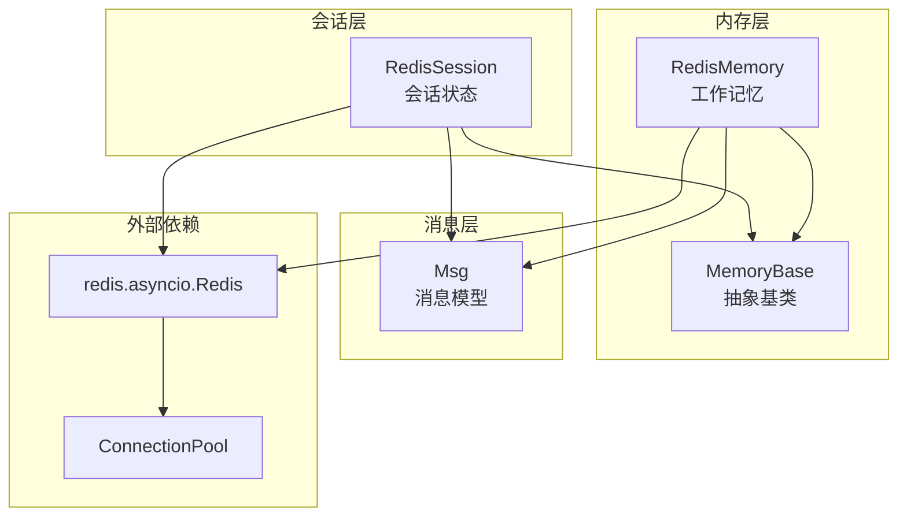
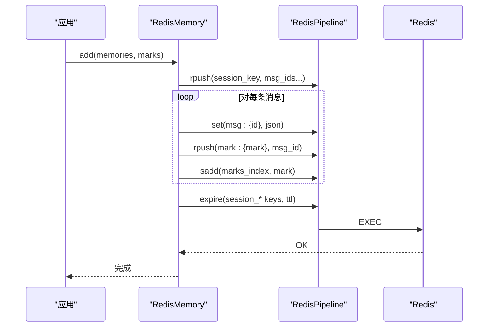
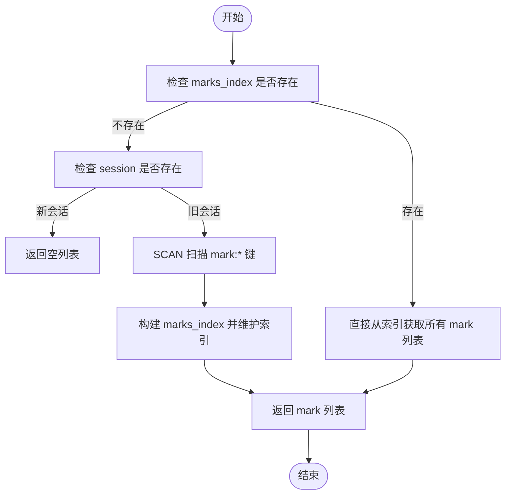
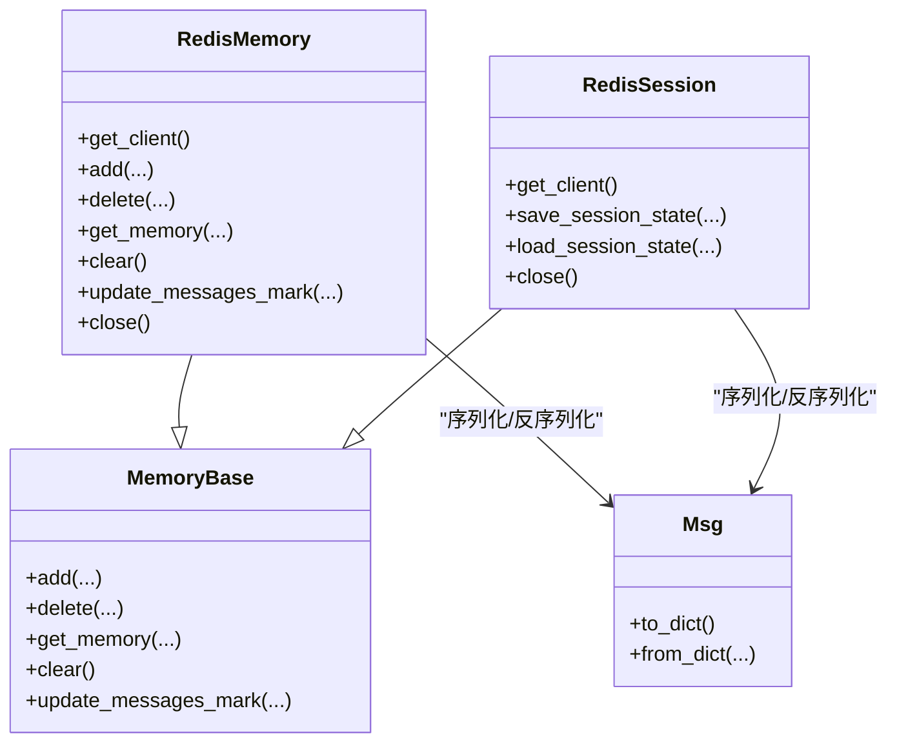

# Redis存储

<cite>
**本文引用的文件**
- [RedisMemory 实现](file://src/agentscope/memory/_working_memory/_redis_memory.py)
- [Redis 会话实现](file://src/agentscope/session/_redis_session.py)
- [内存基类](file://src/agentscope/memory/_working_memory/_base.py)
- [消息模型](file://src/agentscope/message/_message_base.py)
- [Redis 内存单元测试](file://tests/memory_test.py)
- [教程示例：Redis 内存](file://docs/tutorial/en/src/task_memory.py)
</cite>

## 目录
1. [简介](#简介)
2. [项目结构](#项目结构)
3. [核心组件](#核心组件)
4. [架构总览](#架构总览)
5. [详细组件分析](#详细组件分析)
6. [依赖关系分析](#依赖关系分析)
7. [性能与可靠性特性](#性能与可靠性特性)
8. [部署与配置指南](#部署与配置指南)
9. [故障排查](#故障排查)
10. [结论](#结论)

## 简介
本文件面向 AgentScope 的 Redis 存储实现，系统性解析 RedisMemory 类的分布式存储架构与运行机制，涵盖：
- 连接管理与连接池复用
- 数据序列化与键空间设计
- 配置参数（主机、端口、认证、数据库、前缀、TTL）
- 优势与适用场景（持久化、多租户隔离、滑动过期）
- 部署示例（单机、Sentinel、Cluster）
- 连接池管理、超时与重试、错误恢复策略
- 备份、监控告警与性能调优建议

## 项目结构
与 Redis 存储相关的核心文件位于 memory 与 session 模块中，分别提供“工作记忆”与“会话状态”的 Redis 后端实现；消息模型用于统一序列化/反序列化。

图表来源
- [RedisMemory 实现:15-143](file://src/agentscope/memory/_working_memory/_redis_memory.py#L15-L143)
- [Redis 会话实现:17-88](file://src/agentscope/session/_redis_session.py#L17-L88)
- [内存基类:11-169](file://src/agentscope/memory/_working_memory/_base.py#L11-L169)
- [消息模型:21-99](file://src/agentscope/message/_message_base.py#L21-L99)

章节来源
- [RedisMemory 实现:1-143](file://src/agentscope/memory/_working_memory/_redis_memory.py#L1-L143)
- [Redis 会话实现:1-88](file://src/agentscope/session/_redis_session.py#L1-L88)

## 核心组件
- RedisMemory：基于 Redis 的工作记忆实现，支持按用户与会话隔离、标记索引、滑动过期等。
- RedisSession：基于 Redis 的会话状态持久化与加载，支持滑动过期。
- MemoryBase：内存接口抽象，定义 add/delete/get_memory/clear/update_messages_mark 等方法。
- Msg：消息对象，提供 to_dict/from_dict 序列化/反序列化。

章节来源
- [RedisMemory 实现:15-143](file://src/agentscope/memory/_working_memory/_redis_memory.py#L15-L143)
- [Redis 会话实现:17-88](file://src/agentscope/session/_redis_session.py#L17-L88)
- [内存基类:11-169](file://src/agentscope/memory/_working_memory/_base.py#L11-L169)
- [消息模型:21-99](file://src/agentscope/message/_message_base.py#L21-L99)

## 架构总览
RedisMemory 将“消息列表”“消息体”“标记索引”“会话键扫描”等以键空间模式组织，配合 RedisPipeline 提升批量操作原子性与吞吐；RedisSession 则将“会话状态字典”整体序列化存储，便于快速恢复。

图表来源
- [RedisMemory 实现:471-554](file://src/agentscope/memory/_working_memory/_redis_memory.py#L471-L554)

## 详细组件分析

### RedisMemory：键空间与序列化
- 键空间设计
  - 会话消息 ID 列表：user_id:{user_id}:session:{session_id}:messages
  - 消息体存储：user_id:{user_id}:session:{session_id}:msg:{msg_id}
  - 标记索引集合：user_id:{user_id}:session:{session_id}:marks_index
  - 标记消息 ID 列表：user_id:{user_id}:session:{session_id}:mark:{mark}
  - 支持 key_prefix 前缀，实现多环境/多应用隔离
- 序列化机制
  - 消息体以 JSON 字符串存储，使用 Msg.to_dict()/from_dict
  - decode_responses=True，内部统一解码为字符串；同时提供 _decode_if_bytes/_decode_list 兼容 bytes/bytearray
- 滑动过期
  - key_ttl 设置后，每次访问/写入均刷新会话相关键的过期时间（scan 批量更新）
- 标记兼容迁移
  - 新旧数据结构兼容：若无 marks_index，则首次扫描并迁移至新结构

图表来源
- [RedisMemory 实现:315-377](file://src/agentscope/memory/_working_memory/_redis_memory.py#L315-L377)

章节来源
- [RedisMemory 实现:43-63](file://src/agentscope/memory/_working_memory/_redis_memory.py#L43-L63)
- [RedisMemory 实现:145-172](file://src/agentscope/memory/_working_memory/_redis_memory.py#L145-L172)
- [RedisMemory 实现:277-314](file://src/agentscope/memory/_working_memory/_redis_memory.py#L277-L314)
- [RedisMemory 实现:315-377](file://src/agentscope/memory/_working_memory/_redis_memory.py#L315-L377)

### RedisSession：会话状态持久化
- 键空间设计
  - user_id:{user_id}:session:{session_id}:state
- 序列化机制
  - 使用 JSON 序列化状态字典，保存时可设置过期时间
  - 加载时支持 GETEX 原子获取并刷新过期时间
- 生命周期
  - 支持异步上下文管理器，自动关闭连接

章节来源
- [Redis 会话实现:17-88](file://src/agentscope/session/_redis_session.py#L17-L88)
- [Redis 会话实现:90-178](file://src/agentscope/session/_redis_session.py#L90-L178)
- [Redis 会话实现:180-209](file://src/agentscope/session/_redis_session.py#L180-L209)

### MemoryBase 接口与 Msg 模型
- MemoryBase 定义了 add/delete/get_memory/clear/update_messages_mark 等抽象方法，RedisMemory/RedisSession 均继承该接口
- Msg 提供 to_dict/from_dict，确保消息在 Redis 中以稳定格式存储与恢复

章节来源
- [内存基类:11-169](file://src/agentscope/memory/_working_memory/_base.py#L11-L169)
- [消息模型:21-99](file://src/agentscope/message/_message_base.py#L21-L99)

## 依赖关系分析
- RedisMemory 依赖 redis.asyncio.Redis 与 ConnectionPool，通过 Pipeline 提升批量操作效率
- RedisSession 同样依赖 Redis，但侧重于状态字典的序列化存储
- 两者均通过 MemoryBase 统一接口，便于替换与扩展

图表来源
- [RedisMemory 实现:15-143](file://src/agentscope/memory/_working_memory/_redis_memory.py#L15-L143)
- [Redis 会话实现:17-88](file://src/agentscope/session/_redis_session.py#L17-L88)
- [内存基类:11-169](file://src/agentscope/memory/_working_memory/_base.py#L11-L169)
- [消息模型:21-99](file://src/agentscope/message/_message_base.py#L21-L99)

## 性能与可靠性特性
- 持久化能力
  - 消息与标记数据持久化到 Redis，重启后可恢复
- 多租户与隔离
  - 通过 user_id/session_id 与 key_prefix 实现天然隔离
- 高可用与扩展
  - 可结合 Redis 集群/哨兵部署提升可用性与扩展性
- 性能表现
  - 使用 Pipeline 批量执行命令，减少 RTT
  - mget 批量读取消息体，避免 N+1 查询
  - 滑动过期 refresh_session_ttl 在访问时批量刷新，降低过期抖动
- 兼容性
  - decode_responses=True 与 _decode_if_bytes/_decode_list 兼容 bytes/bytearray 场景

章节来源
- [RedisMemory 实现:444-458](file://src/agentscope/memory/_working_memory/_redis_memory.py#L444-L458)
- [RedisMemory 实现:277-314](file://src/agentscope/memory/_working_memory/_redis_memory.py#L277-L314)
- [RedisMemory 实现:145-172](file://src/agentscope/memory/_working_memory/_redis_memory.py#L145-L172)

## 部署与配置指南

### Redis 配置参数说明
- 主机地址 host：Redis 服务器地址，默认本地回环
- 端口 port：Redis 服务端口，默认 6379
- 数据库 db：逻辑数据库索引，默认 0
- 密码 password：认证密码（如启用）
- 连接池 connection_pool：可传入已有的连接池实例，便于复用
- key_prefix：键前缀，用于多环境/多应用隔离
- key_ttl：键过期时间（秒），开启后对会话相关键进行滑动过期刷新

章节来源
- [RedisMemory 实现:65-110](file://src/agentscope/memory/_working_memory/_redis_memory.py#L65-L110)
- [Redis 会话实现:25-59](file://src/agentscope/session/_redis_session.py#L25-L59)

### 单机 Redis 部署
- 使用默认 host/port/db/password 初始化 RedisMemory/RedisSession
- 生产环境建议显式传入 connection_pool，避免重复建立连接

章节来源
- [教程示例：Redis 内存:352-413](file://docs/tutorial/en/src/task_memory.py#L352-L413)

### Redis Sentinel 部署
- 使用 redis.asyncio.Sentinel 创建主从切换感知的连接池
- 将 connection_pool 传给 RedisMemory/RedisSession，即可透明接入高可用

章节来源
- [RedisMemory 实现:73-76](file://src/agentscope/memory/_working_memory/_redis_memory.py#L73-L76)
- [Redis 会话实现:31-34](file://src/agentscope/session/_redis_session.py#L31-L34)

### Redis Cluster 部署
- 使用 redis.asyncio.RedisCluster 或 ConnectionPool + Cluster 支持
- 注意键空间设计与分片键一致性，确保 user_id/session_id 能正确路由到同一节点或跨节点键不混用

章节来源
- [RedisMemory 实现:73-76](file://src/agentscope/memory/_working_memory/_redis_memory.py#L73-L76)
- [Redis 会话实现:31-34](file://src/agentscope/session/_redis_session.py#L31-L34)

### 连接池管理、超时与重连
- 连接池复用：通过 connection_pool 参数传入全局连接池，减少连接开销
- 超时与重试：可通过 redis.asyncio.Redis 的超时参数与重试策略配置（在上层框架中设置）
- 自动关闭：RedisMemory/RedisSession 支持异步上下文管理器与 close 方法，确保连接释放

章节来源
- [RedisMemory 实现:800-800](file://src/agentscope/memory/_working_memory/_redis_memory.py#L800-L800)
- [Redis 会话实现:180-209](file://src/agentscope/session/_redis_session.py#L180-L209)
- [教程示例：Redis 内存:352-413](file://docs/tutorial/en/src/task_memory.py#L352-L413)

### 错误恢复策略
- 读写失败：在业务层捕获异常并重试；对于 TTL 刷新与 Pipeline 执行，可在失败时记录日志并降级处理
- 数据迁移：旧版本无 marks_index 的场景会自动扫描并迁移，仅首次触发
- bytes 解码：当 decode_responses=False 时，内部提供解码工具保证兼容

章节来源
- [RedisMemory 实现:315-377](file://src/agentscope/memory/_working_memory/_redis_memory.py#L315-L377)
- [RedisMemory 实现:145-172](file://src/agentscope/memory/_working_memory/_redis_memory.py#L145-L172)

### 备份、监控与性能调优
- 备份
  - 使用 Redis RDB/AOF 持久化策略；定期快照与 AOF fsync 策略需根据数据重要性权衡
- 监控与告警
  - 关注连接数、内存使用、慢查询、过期键比例、Pipeline 命令耗时
- 性能调优
  - 合理设置 key_ttl，避免大会话频繁刷新导致抖动
  - 使用 Pipeline 批量写入，减少网络往返
  - 控制消息体大小，避免单键过大影响传输与序列化

[本节为通用实践建议，无需特定文件引用]

## 故障排查
- 无法连接 Redis
  - 检查 host/port/db/password 配置是否正确
  - 若使用 Sentinel/Cluster，确认主从拓扑与连接池初始化方式
- 消息为空或过期
  - 检查 key_ttl 是否过短；确认 refresh_session_ttl 是否正常执行
- bytes/解码问题
  - decode_responses=True 时不会出现 bytes；若 decode_responses=False，需确保 _decode_if_bytes/_decode_list 正常工作
- 标记索引缺失
  - 首次访问旧数据会触发扫描与迁移，若未迁移成功，检查 marks_index 键是否存在

章节来源
- [Redis 内存单元测试:744-764](file://tests/memory_test.py#L744-L764)
- [Redis 内存单元测试:819-839](file://tests/memory_test.py#L819-L839)
- [RedisMemory 实现:277-314](file://src/agentscope/memory/_working_memory/_redis_memory.py#L277-L314)
- [RedisMemory 实现:315-377](file://src/agentscope/memory/_working_memory/_redis_memory.py#L315-L377)

## 结论
RedisMemory 通过清晰的键空间设计、Pipeline 批处理与滑动过期机制，在 AgentScope 中提供了高性能、可扩展且易隔离的记忆存储方案。结合连接池复用、Sentinel/Cluster 部署与完善的监控告警体系，可在生产环境中稳定支撑多用户、多会话的对话记忆需求。