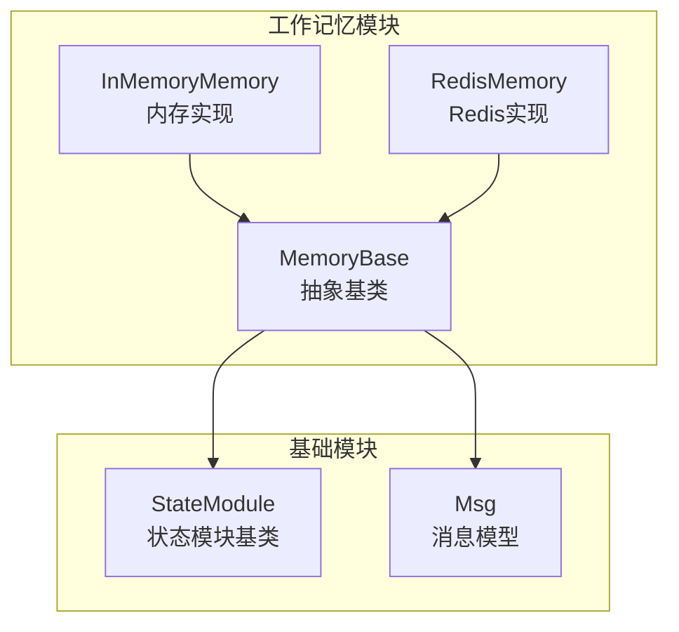
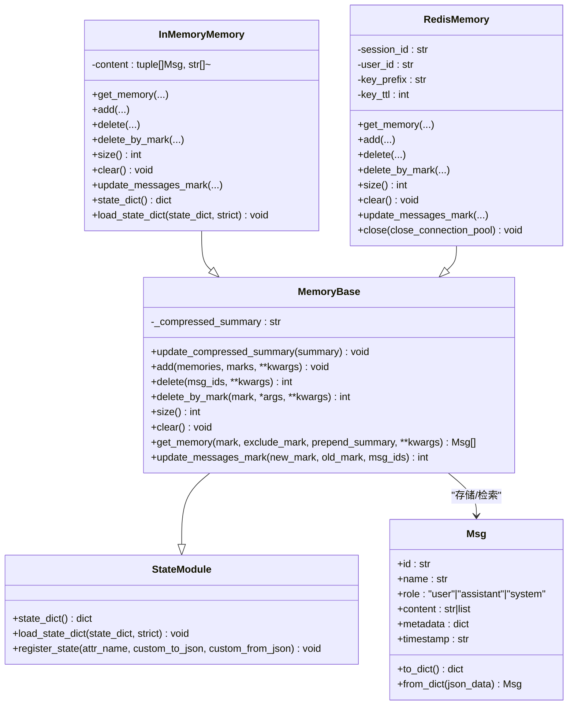
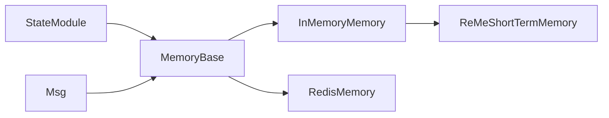

# 内存基类

<cite>
**本文引用的文件**
- [memory/_working_memory/_base.py](file://src/agentscope/memory/_working_memory/_base.py)
- [memory/_working_memory/_in_memory_memory.py](file://src/agentscope/memory/_working_memory/_in_memory_memory.py)
- [memory/_working_memory/_redis_memory.py](file://src/agentscope/memory/_working_memory/_redis_memory.py)
- [module/_state_module.py](file://src/agentscope/module/_state_module.py)
- [message/_message_base.py](file://src/agentscope/message/_message_base.py)
- [memory/__init__.py](file://src/agentscope/memory/__init__.py)
- [examples/functionality/short_term_memory/reme/reme_short_term_memory.py](file://examples/functionality/short_term_memory/reme/reme_short_term_memory.py)
</cite>

## 目录
1. [简介](#简介)
2. [项目结构](#项目结构)
3. [核心组件](#核心组件)
4. [架构总览](#架构总览)
5. [详细组件分析](#详细组件分析)
6. [依赖分析](#依赖分析)
7. [性能考虑](#性能考虑)
8. [故障排查指南](#故障排查指南)
9. [结论](#结论)
10. [附录](#附录)

## 简介
本文件面向AgentScope工作记忆（短期记忆）基类MemoryBase，提供从架构设计到API规范、标记系统、状态管理与实现细节的完整技术文档。重点覆盖：
- MemoryBase抽象基类的设计与职责
- StateModule继承体系与状态管理机制
- 标记系统与消息过滤、标记更新策略
- 所有抽象方法的接口规范与行为约束
- 完整API参考（参数、返回值、异常）
- 使用示例与最佳实践，指导开发者正确继承并实现自定义存储后端

## 项目结构
工作记忆模块位于agentscope.memory._working_memory，核心文件如下：
- MemoryBase：抽象基类，定义统一的异步API与标记系统
- InMemoryMemory：基于内存列表的轻量实现
- RedisMemory：基于Redis的分布式实现，支持会话与用户上下文隔离
- StateModule：状态模块基类，提供嵌套序列化/反序列化能力
- Msg：消息模型，作为MemoryBase操作的基本数据单元

图表来源
- [memory/_working_memory/_base.py:11-169](file://src/agentscope/memory/_working_memory/_base.py#L11-L169)
- [memory/_working_memory/_in_memory_memory.py:10-306](file://src/agentscope/memory/_working_memory/_in_memory_memory.py#L10-L306)
- [memory/_working_memory/_redis_memory.py:16-828](file://src/agentscope/memory/_working_memory/_redis_memory.py#L16-L828)
- [module/_state_module.py:20-152](file://src/agentscope/module/_state_module.py#L20-L152)
- [message/_message_base.py:21-242](file://src/agentscope/message/_message_base.py#L21-L242)

章节来源
- [memory/__init__.py:1-33](file://src/agentscope/memory/__init__.py#L1-L33)
- [memory/_working_memory/__init__.py:1-18](file://src/agentscope/memory/_working_memory/__init__.py#L1-L18)

## 核心组件
- MemoryBase：定义工作记忆的统一抽象，提供异步API（add、delete、size、clear、get_memory），以及标记系统（marks）与压缩摘要（_compressed_summary）的状态管理。
- StateModule：为MemoryBase提供状态注册与序列化能力，确保内容可持久化与恢复。
- Msg：消息实体，包含id、name、role、content、metadata、timestamp等字段，是所有存储操作的数据载体。

章节来源
- [memory/_working_memory/_base.py:11-169](file://src/agentscope/memory/_working_memory/_base.py#L11-L169)
- [module/_state_module.py:20-152](file://src/agentscope/module/_state_module.py#L20-L152)
- [message/_message_base.py:21-242](file://src/agentscope/message/_message_base.py#L21-L242)

## 架构总览
MemoryBase继承自StateModule，扩展了工作记忆的生命周期与状态管理；具体实现类（如InMemoryMemory、RedisMemory）负责不同存储后端的细节。消息以Msg形式在存储中管理，并通过marks进行分组与过滤。

图表来源
- [memory/_working_memory/_base.py:11-169](file://src/agentscope/memory/_working_memory/_base.py#L11-L169)
- [memory/_working_memory/_in_memory_memory.py:10-306](file://src/agentscope/memory/_working_memory/_in_memory_memory.py#L10-L306)
- [memory/_working_memory/_redis_memory.py:16-828](file://src/agentscope/memory/_working_memory/_redis_memory.py#L16-L828)
- [module/_state_module.py:20-152](file://src/agentscope/module/_state_module.py#L20-L152)
- [message/_message_base.py:21-242](file://src/agentscope/message/_message_base.py#L21-L242)

## 详细组件分析

### MemoryBase抽象基类
- 继承关系：MemoryBase(StateModule)
- 关键状态：
  - _compressed_summary：压缩摘要字符串，可通过update_compressed_summary更新
  - 通过register_state注册为状态变量，支持序列化/反序列化
- 异步API：
  - add：添加消息或消息列表，支持marks参数关联标记
  - delete：按消息ID批量删除，返回删除数量
  - delete_by_mark：按标记删除（默认抛出NotImplementedError，具体实现需覆盖）
  - size：返回消息数量
  - clear：清空存储
  - get_memory：按标记过滤检索消息，支持排除标记与前置摘要
  - update_messages_mark：统一的标记更新入口（新增/移除/替换），默认抛出NotImplementedError
- 标记系统：
  - marks参数支持字符串或字符串列表，用于对消息进行分组与检索
  - get_memory支持mark/exclude_mark组合过滤
  - update_messages_mark提供灵活的标记变更策略

章节来源
- [memory/_working_memory/_base.py:11-169](file://src/agentscope/memory/_working_memory/_base.py#L11-L169)

### InMemoryMemory实现
- 存储结构：content为(消息, 标记列表)的有序列表
- 特性：
  - get_memory：支持mark/exclude_mark过滤，prepend_summary可将压缩摘要作为第一条消息
  - add：支持allow_duplicates控制重复消息；marks归一化为列表；去重逻辑
  - delete：按msg_ids删除，返回删除数量
  - delete_by_mark：按标记删除，支持字符串或列表
  - update_messages_mark：支持msg_ids与old_mark过滤，new_mark为None时移除旧标记
  - 状态序列化：state_dict/load_state_dict兼容历史格式

章节来源
- [memory/_working_memory/_in_memory_memory.py:10-306](file://src/agentscope/memory/_working_memory/_in_memory_memory.py#L10-L306)

### RedisMemory实现
- 上下文：session_id与user_id限定作用域，key_prefix支持多租户隔离
- 键空间：
  - 会话键：存储消息ID顺序列表
  - 消息键：存储消息payload
  - 标记键：每个标记维护消息ID列表
  - marks_index：集合，记录会话内所有标记名称
- 特性：
  - get_memory：支持按标记检索，exclude_mark过滤，批量mget提升性能
  - add：支持skip_duplicated去重，pipeline原子写入，TTL滑动刷新
  - delete：删除消息数据、会话列表与各标记列表，统计实际删除数
  - delete_by_mark：先按标记获取ID再委托delete
  - update_messages_mark：支持old_mark与msg_ids过滤，批量lrem/rpush/srem
  - close：关闭Redis客户端连接

章节来源
- [memory/_working_memory/_redis_memory.py:16-828](file://src/agentscope/memory/_working_memory/_redis_memory.py#L16-L828)

### StateModule状态管理机制
- 职责：提供嵌套状态序列化/反序列化能力，支持模块属性与注册属性
- 关键点：
  - register_state：注册属性为状态，可提供自定义JSON转换函数
  - state_dict/load_state_dict：递归遍历模块与已注册属性，严格模式校验缺失键
  - __setattr__/__delattr__：自动跟踪StateModule子模块

章节来源
- [module/_state_module.py:20-152](file://src/agentscope/module/_state_module.py#L20-L152)

### Msg消息模型
- 字段：id、name、role、content、metadata、timestamp、invocation_id
- 能力：to_dict/from_dict序列化/反序列化，文本块提取与工具调用块解析

章节来源
- [message/_message_base.py:21-242](file://src/agentscope/message/_message_base.py#L21-L242)

## 依赖分析
- MemoryBase依赖StateModule（状态管理）与Msg（数据模型）
- InMemoryMemory与RedisMemory均继承MemoryBase，前者依赖列表与深拷贝，后者依赖Redis客户端与键空间设计
- ReMeShortTermMemory继承InMemoryMemory，扩展压缩与编排逻辑

图表来源
- [memory/_working_memory/_base.py:7-8](file://src/agentscope/memory/_working_memory/_base.py#L7-L8)
- [memory/_working_memory/_in_memory_memory.py:6-7](file://src/agentscope/memory/_working_memory/_in_memory_memory.py#L6-L7)
- [memory/_working_memory/_redis_memory.py:6-7](file://src/agentscope/memory/_working_memory/_redis_memory.py#L6-L7)
- [examples/functionality/short_term_memory/reme/reme_short_term_memory.py:11-17](file://examples/functionality/short_term_memory/reme/reme_short_term_memory.py#L11-L17)

## 性能考虑
- InMemoryMemory
  - 过滤与去重：线性扫描content，时间复杂度O(n)，适合小规模短记忆
  - 深拷贝：add/delete涉及deepcopy，注意大消息体的内存占用
- RedisMemory
  - 批量mget减少网络往返，提高检索吞吐
  - pipeline原子写入，保证一致性
  - marks_index避免全表扫描，提升标记检索效率
  - key_ttl滑动过期，注意大规模会话的TTL刷新开销

[本节为通用性能讨论，不直接分析具体文件]

## 故障排查指南
- 类型错误
  - get_memory/delete_by_mark/update_messages_mark等方法对mark/exclude_mark类型进行严格检查，若传入非字符串或列表元素类型非法，将抛出TypeError
- 未实现方法
  - 若调用delete_by_mark或update_messages_mark且未在子类中覆盖，默认抛出NotImplementedError
- Redis连接
  - 初始化失败或缺少redis包时抛出ImportError
  - close方法用于释放连接池，避免资源泄漏
- 状态序列化
  - load_state_dict(strict=True)时，若state_dict缺少必要键，将抛出KeyError

章节来源
- [memory/_working_memory/_in_memory_memory.py:46-64](file://src/agentscope/memory/_working_memory/_in_memory_memory.py#L46-L64)
- [memory/_working_memory/_in_memory_memory.py:160-197](file://src/agentscope/memory/_working_memory/_in_memory_memory.py#L160-L197)
- [memory/_working_memory/_in_memory_memory.py:212-271](file://src/agentscope/memory/_working_memory/_in_memory_memory.py#L212-L271)
- [memory/_working_memory/_redis_memory.py:111-118](file://src/agentscope/memory/_working_memory/_redis_memory.py#L111-L118)
- [memory/_working_memory/_redis_memory.py:608-651](file://src/agentscope/memory/_working_memory/_redis_memory.py#L608-L651)
- [memory/_working_memory/_redis_memory.py:790-800](file://src/agentscope/memory/_working_memory/_redis_memory.py#L790-L800)
- [module/_state_module.py:74-106](file://src/agentscope/module/_state_module.py#L74-L106)

## 结论
MemoryBase通过统一的异步API与标记系统，为AgentScope工作记忆提供了清晰的抽象层；结合StateModule的状态管理与Msg消息模型，既保证了实现的一致性，又便于扩展不同存储后端。InMemoryMemory与RedisMemory分别满足本地开发与生产部署的需求；ReMeShortTermMemory进一步展示了如何在InMemoryMemory基础上集成压缩与编排能力。开发者应遵循接口规范与类型约束，合理选择存储后端，并充分利用标记系统与压缩摘要功能优化上下文管理。

[本节为总结性内容，不直接分析具体文件]

## 附录

### API参考：MemoryBase
- update_compressed_summary(summary: str) -> None
  - 更新压缩摘要
  - 参数：summary（str）
  - 返回：无
- add(memories: Msg | list[Msg] | None, marks: str | list[str] | None = None, **kwargs) -> None
  - 添加消息或消息列表，marks为可选标记
  - 参数：memories（可为单个Msg、消息列表或None）、marks（字符串或字符串列表或None）
  - 返回：无
- delete(msg_ids: list[str], **kwargs) -> int
  - 按消息ID删除，返回删除数量
  - 参数：msg_ids（消息ID列表）
  - 返回：int
- delete_by_mark(mark: str | list[str], *args, **kwargs) -> int
  - 按标记删除，未覆盖时抛出NotImplementedError
  - 参数：mark（字符串或字符串列表）
  - 返回：int
- size() -> int
  - 返回消息数量
  - 返回：int
- clear() -> None
  - 清空存储
  - 返回：无
- get_memory(mark: str | None = None, exclude_mark: str | None = None, prepend_summary: bool = True, **kwargs) -> list[Msg]
  - 检索消息，支持mark/exclude_mark过滤与前置摘要
  - 参数：mark（可选）、exclude_mark（可选）、prepend_summary（可选）
  - 返回：list[Msg]
- update_messages_mark(new_mark: str | None, old_mark: str | None = None, msg_ids: list[str] | None = None) -> int
  - 统一标记更新（新增/移除/替换），未覆盖时抛出NotImplementedError
  - 参数：new_mark（可选）、old_mark（可选）、msg_ids（可选）
  - 返回：int

章节来源
- [memory/_working_memory/_base.py:22-169](file://src/agentscope/memory/_working_memory/_base.py#L22-L169)

### API参考：InMemoryMemory
- get_memory(...)：同上，支持mark/exclude_mark与前置摘要
- add(..., allow_duplicates: bool = False)：支持去重控制
- delete(...)：返回删除数量
- delete_by_mark(...)：支持字符串或列表
- size()：返回content长度
- clear()：清空content
- update_messages_mark(...)：支持msg_ids与old_mark过滤
- state_dict()/load_state_dict()：支持序列化/反序列化

章节来源
- [memory/_working_memory/_in_memory_memory.py:22-306](file://src/agentscope/memory/_working_memory/_in_memory_memory.py#L22-L306)

### API参考：RedisMemory
- get_memory(...)：支持mark/exclude_mark，批量mget
- add(..., skip_duplicated: bool = True)：pipeline写入，TTL滑动刷新
- delete(...)：统计实际删除数
- delete_by_mark(...)：委托delete
- size()：返回会话列表长度
- clear()：删除会话与所有标记键
- update_messages_mark(...)：批量lrem/rpush/srem
- close(close_connection_pool)：关闭客户端

章节来源
- [memory/_working_memory/_redis_memory.py:379-800](file://src/agentscope/memory/_working_memory/_redis_memory.py#L379-L800)

### 使用示例与最佳实践
- 自定义存储后端
  - 继承MemoryBase，至少实现add、delete、size、clear、get_memory
  - 如需按标记删除或统一标记更新，覆盖delete_by_mark与update_messages_mark
  - 使用register_state注册需要持久化的状态字段
- 标记系统最佳实践
  - 使用字符串或字符串列表表示marks，保持语义清晰
  - get_memory同时使用mark与exclude_mark时，确保两者不重叠
  - 使用update_messages_mark进行批量标记变更，避免多次循环
- InMemoryMemory
  - 大消息建议开启allow_duplicates=False以避免重复
  - 需要跨会话共享时，考虑使用RedisMemory
- RedisMemory
  - 合理设置key_ttl，避免大量键同时过期
  - 使用key_prefix隔离多租户或多应用
  - 利用marks_index避免全表扫描
- ReMeShortTermMemory
  - 基于InMemoryMemory扩展压缩与编排，适合长上下文场景
  - 注意store_dir与keep_recent_count配置，平衡上下文长度与信息保留

章节来源
- [examples/functionality/short_term_memory/reme/reme_short_term_memory.py:17-350](file://examples/functionality/short_term_memory/reme/reme_short_term_memory.py#L17-L350)