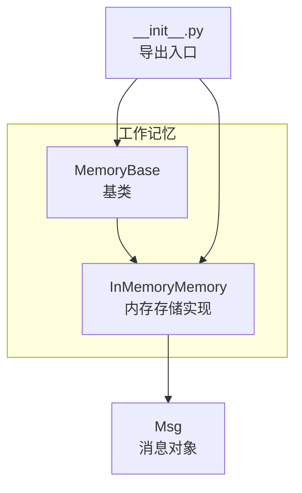
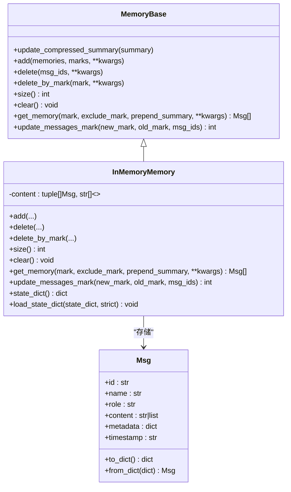
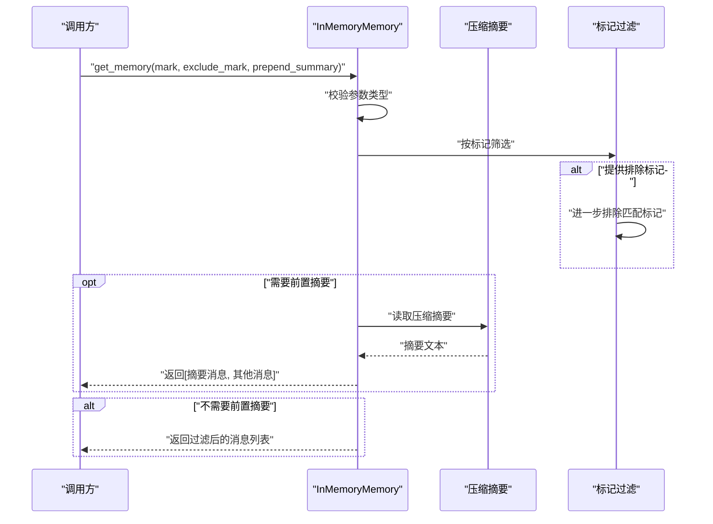
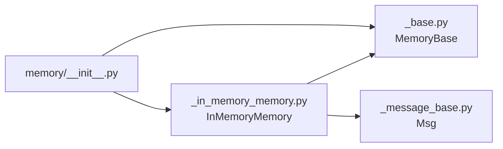

# 内存存储

<cite>
**本文引用的文件**
- [src/agentscope/memory/_working_memory/_in_memory_memory.py](file://src/agentscope/memory/_working_memory/_in_memory_memory.py)
- [src/agentscope/memory/_working_memory/_base.py](file://src/agentscope/memory/_working_memory/_base.py)
- [src/agentscope/message/_message_base.py](file://src/agentscope/message/_message_base.py)
- [src/agentscope/memory/__init__.py](file://src/agentscope/memory/__init__.py)
- [tests/memory_test.py](file://tests/memory_test.py)
- [docs/tutorial/en/src/task_memory.py](file://docs/tutorial/en/src/task_memory.py)
- [examples/functionality/short_term_memory/memory_compression/main.py](file://examples/functionality/short_term_memory/memory_compression/main.py)
- [examples/functionality/short_term_memory/memory_compression/README.md](file://examples/functionality/short_term_memory/memory_compression/README.md)
- [src/agentscope/agent/_react_agent.py](file://src/agentscope/agent/_react_agent.py)
</cite>

## 目录
1. [简介](#简介)
2. [项目结构](#项目结构)
3. [核心组件](#核心组件)
4. [架构总览](#架构总览)
5. [详细组件分析](#详细组件分析)
6. [依赖分析](#依赖分析)
7. [性能考量](#性能考量)
8. [故障排查指南](#故障排查指南)
9. [结论](#结论)
10. [附录](#附录)

## 简介
本文件面向AgentScope工作记忆模块中的“内存存储”实现，系统性解析InMemoryMemory类的设计理念、数据结构与消息存储机制，并结合测试用例与示例代码，给出配置参数、初始化流程、消息索引方式、并发安全性、性能特征、使用示例与最佳实践。目标是帮助开发者在正确理解实现细节的基础上，做出合适的技术选型。

## 项目结构
与“内存存储”直接相关的核心文件如下：
- 工作记忆基类：定义统一接口与通用状态管理（压缩摘要）
- InMemoryMemory：基于Python列表的内存存储实现
- 消息对象：Msg类及其序列化/反序列化能力
- 导出入口：memory模块导出工作记忆相关类型
- 测试与示例：覆盖基本功能、标记过滤、序列化/反序列化、压缩集成等

图表来源
- [src/agentscope/memory/_working_memory/_base.py:11-169](file://src/agentscope/memory/_working_memory/_base.py#L11-L169)
- [src/agentscope/memory/_working_memory/_in_memory_memory.py:10-306](file://src/agentscope/memory/_working_memory/_in_memory_memory.py#L10-L306)
- [src/agentscope/message/_message_base.py:21-100](file://src/agentscope/message/_message_base.py#L21-L100)
- [src/agentscope/memory/__init__.py:4-10](file://src/agentscope/memory/__init__.py#L4-L10)

章节来源
- [src/agentscope/memory/_working_memory/_base.py:11-169](file://src/agentscope/memory/_working_memory/_base.py#L11-L169)
- [src/agentscope/memory/_working_memory/_in_memory_memory.py:10-306](file://src/agentscope/memory/_working_memory/_in_memory_memory.py#L10-L306)
- [src/agentscope/message/_message_base.py:21-100](file://src/agentscope/message/_message_base.py#L21-L100)
- [src/agentscope/memory/__init__.py:4-10](file://src/agentscope/memory/__init__.py#L4-L10)

## 核心组件
- MemoryBase：工作记忆抽象基类，定义统一接口与状态注册（如压缩摘要），并提供默认未实现方法占位。
- InMemoryMemory：具体实现，采用列表存储消息元组（消息对象, 标记列表），支持消息增删查改、标记更新、序列化/反序列化。
- Msg：消息实体，具备唯一ID、角色、内容、时间戳、元数据等字段，并提供to_dict/from_dict用于持久化。

章节来源
- [src/agentscope/memory/_working_memory/_base.py:11-169](file://src/agentscope/memory/_working_memory/_base.py#L11-L169)
- [src/agentscope/memory/_working_memory/_in_memory_memory.py:10-306](file://src/agentscope/memory/_working_memory/_in_memory_memory.py#L10-L306)
- [src/agentscope/message/_message_base.py:21-100](file://src/agentscope/message/_message_base.py#L21-L100)

## 架构总览
InMemoryMemory继承自MemoryBase，通过组合Msg与标记列表实现消息存储；其核心数据结构为列表，元素为二元组（消息, 标记列表）。该设计使得消息检索、标记过滤、批量更新等操作以线性扫描为主，适合小到中等规模的会话或临时上下文。

图表来源
- [src/agentscope/memory/_working_memory/_base.py:11-169](file://src/agentscope/memory/_working_memory/_base.py#L11-L169)
- [src/agentscope/memory/_working_memory/_in_memory_memory.py:10-306](file://src/agentscope/memory/_working_memory/_in_memory_memory.py#L10-L306)
- [src/agentscope/message/_message_base.py:21-100](file://src/agentscope/message/_message_base.py#L21-L100)

## 详细组件分析

### InMemoryMemory类设计与实现
- 数据结构
  - 使用列表存储二元组：(消息对象, 标记列表)。标记列表用于消息分类与过滤。
  - 压缩摘要作为独立字符串状态，可通过update_compressed_summary更新。
- 初始化
  - 调用父类构造函数完成状态注册；注册“content”状态以便序列化。
- 关键方法
  - add：支持单条或多条消息；可指定标记；可选择去重；内部对消息与标记进行深拷贝，避免外部修改影响存储。
  - delete：按消息ID删除，返回删除数量。
  - delete_by_mark：按标记删除，支持字符串或字符串列表；返回删除数量。
  - get_memory：按标记过滤，支持排除标记；可选择在结果前插入压缩摘要消息。
  - update_messages_mark：统一的标记更新入口，支持按ID或旧标记筛选，新增/替换/移除标记。
  - size/clear：统计消息数与清空存储。
  - 序列化/反序列化：state_dict将content转为消息字典与标记列表；load_state_dict兼容新旧格式。
- 并发与一致性
  - 当前实现未显式加锁；在多协程并发调用时，需注意列表遍历与写入的竞态风险。建议在上层协调或配合应用级锁使用。

章节来源
- [src/agentscope/memory/_working_memory/_in_memory_memory.py:10-306](file://src/agentscope/memory/_working_memory/_in_memory_memory.py#L10-L306)

### MemoryBase基类要点
- 统一接口：定义add/delete/get_memory等抽象方法，供各存储后端实现。
- 状态管理：注册压缩摘要状态，便于跨实现的一致性。
- 默认行为：部分方法提供默认实现或抛出未实现异常，提示子类覆盖。

章节来源
- [src/agentscope/memory/_working_memory/_base.py:11-169](file://src/agentscope/memory/_working_memory/_base.py#L11-L169)

### Msg消息对象
- 字段：名称、角色、内容、元数据、时间戳、唯一ID。
- 序列化：to_dict/from_dict支持JSON化与恢复，为InMemoryMemory的持久化提供基础。

章节来源
- [src/agentscope/message/_message_base.py:21-100](file://src/agentscope/message/_message_base.py#L21-L100)

### 使用示例与接口验证
- 基础用法：添加消息、按标记检索、删除标记消息、序列化/反序列化。
- 标记过滤：支持mark/exclude_mark组合过滤。
- 集成压缩：ReActAgent在生成压缩摘要后更新内存标记，体现与压缩模块的协作。

章节来源
- [docs/tutorial/en/src/task_memory.py:106-148](file://docs/tutorial/en/src/task_memory.py#L106-L148)
- [tests/memory_test.py:17-200](file://tests/memory_test.py#L17-L200)
- [tests/memory_test.py:628-703](file://tests/memory_test.py#L628-L703)
- [src/agentscope/agent/_react_agent.py:1089-1123](file://src/agentscope/agent/_react_agent.py#L1089-L1123)

### 方法调用时序（序列图）
以下序列图展示典型的消息检索流程，包括可选的压缩摘要前置与标记过滤。

图表来源
- [src/agentscope/memory/_working_memory/_in_memory_memory.py:22-91](file://src/agentscope/memory/_working_memory/_in_memory_memory.py#L22-L91)

## 依赖分析
- 组件耦合
  - InMemoryMemory强依赖Msg对象的to_dict/from_dict能力，用于序列化/反序列化。
  - 通过MemoryBase统一接口，便于替换为其他存储实现（如数据库、Redis等）。
- 外部依赖
  - 无硬性第三方依赖，仅依赖标准库与框架内消息模型。

图表来源
- [src/agentscope/memory/_working_memory/_in_memory_memory.py:10-306](file://src/agentscope/memory/_working_memory/_in_memory_memory.py#L10-L306)
- [src/agentscope/memory/_working_memory/_base.py:11-169](file://src/agentscope/memory/_working_memory/_base.py#L11-L169)
- [src/agentscope/message/_message_base.py:21-100](file://src/agentscope/message/_message_base.py#L21-L100)
- [src/agentscope/memory/__init__.py:4-10](file://src/agentscope/memory/__init__.py#L4-L10)

章节来源
- [src/agentscope/memory/_working_memory/_in_memory_memory.py:10-306](file://src/agentscope/memory/_working_memory/_in_memory_memory.py#L10-L306)
- [src/agentscope/memory/_working_memory/_base.py:11-169](file://src/agentscope/memory/_working_memory/_base.py#L11-L169)
- [src/agentscope/message/_message_base.py:21-100](file://src/agentscope/message/_message_base.py#L21-L100)
- [src/agentscope/memory/__init__.py:4-10](file://src/agentscope/memory/__init__.py#L4-L10)

## 性能考量
- 访问速度
  - get_memory按标记过滤采用线性扫描，时间复杂度O(N)；N为消息总数。适合中小规模会话。
- 内存占用
  - 存储每个消息与其标记列表，额外开销主要来自消息对象与标记列表；消息越多，线性遍历成本越高。
- 并发安全
  - 当前实现未内置锁，存在多协程同时写入的风险。建议在应用层串行化关键路径或引入外部同步机制。
- 压缩与标记更新
  - 压缩摘要前置与标记更新均为线性处理，大规模消息集上可能成为瓶颈。可结合分页/缓存策略优化。

[本节为通用性能讨论，不直接分析特定文件]

## 故障排查指南
- 类型错误
  - 标记参数必须为字符串或字符串列表，否则抛出类型错误。请检查传入值类型。
- 删除与过滤
  - delete按消息ID删除；delete_by_mark按标记删除。确认ID与标记是否正确。
- 序列化/反序列化
  - load_state_dict严格模式下要求包含content键；若版本不兼容，注意旧格式的向后兼容分支。
- 压缩摘要
  - 若get_memory返回的列表包含摘要消息，请确认是否设置了压缩摘要以及prepend_summary参数。

章节来源
- [src/agentscope/memory/_working_memory/_in_memory_memory.py:54-64](file://src/agentscope/memory/_working_memory/_in_memory_memory.py#L54-L64)
- [src/agentscope/memory/_working_memory/_in_memory_memory.py:130-133](file://src/agentscope/memory/_working_memory/_in_memory_memory.py#L130-L133)
- [src/agentscope/memory/_working_memory/_in_memory_memory.py:179-189](file://src/agentscope/memory/_working_memory/_in_memory_memory.py#L179-L189)
- [src/agentscope/memory/_working_memory/_in_memory_memory.py:280-305](file://src/agentscope/memory/_working_memory/_in_memory_memory.py#L280-L305)

## 结论
InMemoryMemory以简洁的列表+元组结构实现了工作记忆的核心能力，具备良好的易用性与可扩展性。对于小中规模的会话与临时上下文，它提供了快速、直观的存储方案；但在高并发与超大规模消息场景下，需结合应用层同步与性能优化策略使用。通过统一的MemoryBase接口，未来可平滑迁移到更强大的持久化实现。

[本节为总结性内容，不直接分析特定文件]

## 附录

### 完整使用示例（步骤说明）
- 创建实例并添加消息
  - 参考：[docs/tutorial/en/src/task_memory.py:106-148](file://docs/tutorial/en/src/task_memory.py#L106-L148)
- 按标记检索与排除检索
  - 参考：[tests/memory_test.py:106-200](file://tests/memory_test.py#L106-L200)
- 删除标记消息与清理
  - 参考：[tests/memory_test.py:17-105](file://tests/memory_test.py#L17-L105)
- 序列化/反序列化
  - 参考：[src/agentscope/memory/_working_memory/_in_memory_memory.py:273-305](file://src/agentscope/memory/_working_memory/_in_memory_memory.py#L273-L305)
- 与压缩模块集成
  - 参考：[src/agentscope/agent/_react_agent.py:1089-1123](file://src/agentscope/agent/_react_agent.py#L1089-L1123)

### 性能优化建议
- 控制消息总量：通过定期清理与标记管理降低线性扫描成本。
- 批量操作：合并多次add/delete为批量调用，减少频繁深拷贝与列表重建。
- 分页与缓存：对高频检索结果进行缓存；必要时拆分大列表为分页视图。
- 并发控制：在应用层对关键写路径加锁，避免竞态。

[本节为通用建议，不直接分析特定文件]

### 适用场景与限制
- 适用场景
  - 小中型对话会话、原型开发、临时上下文存储。
- 限制
  - 单机内存上限；线性扫描在大数据量下效率较低；无内置并发保护。
- 技术选型建议
  - 需要持久化与高并发：考虑数据库或Redis实现。
  - 需要自动压缩与长期保存：考虑长记忆实现或ReMe短记忆封装。

[本节为概念性说明，不直接分析特定文件]