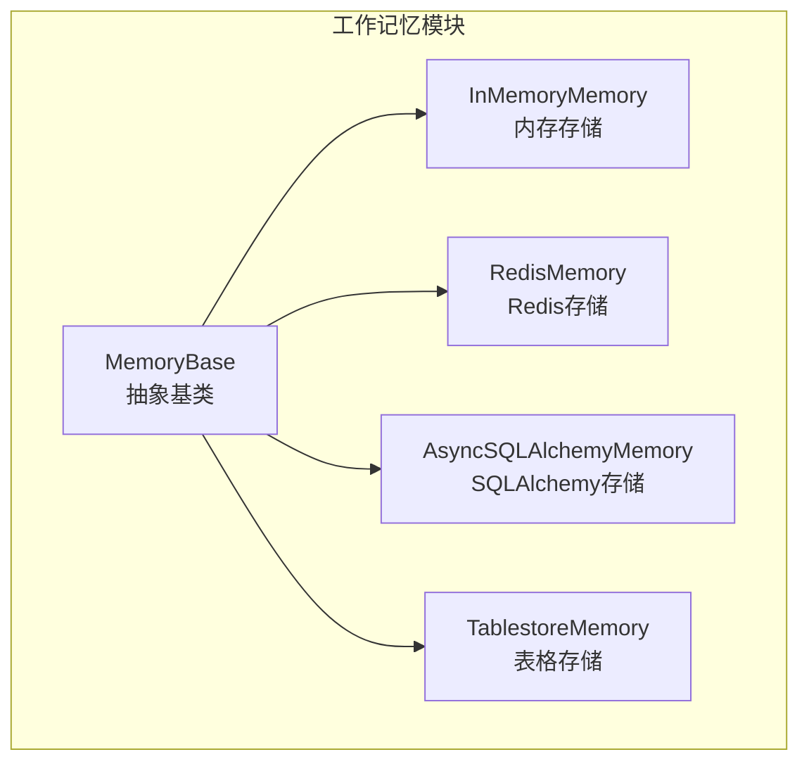
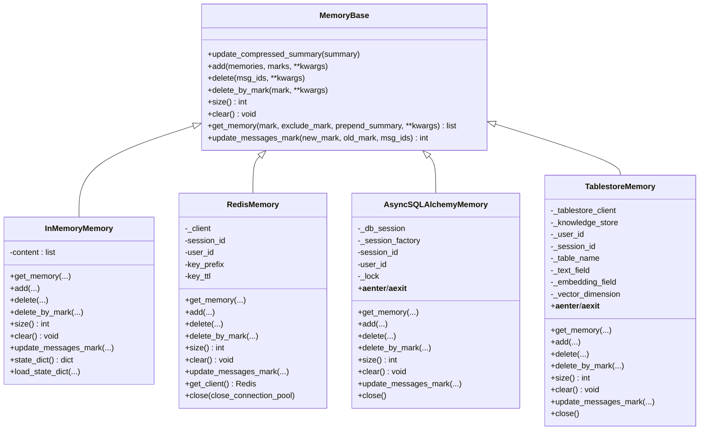
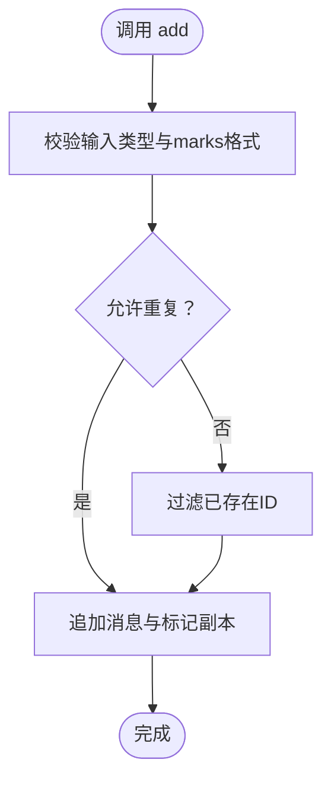
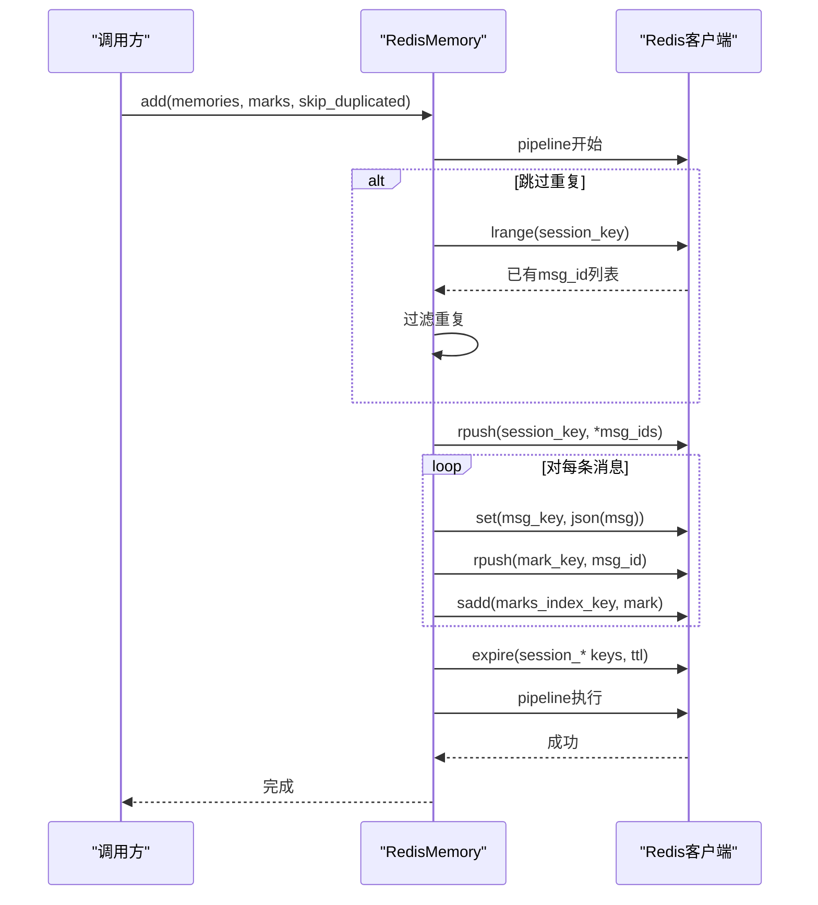
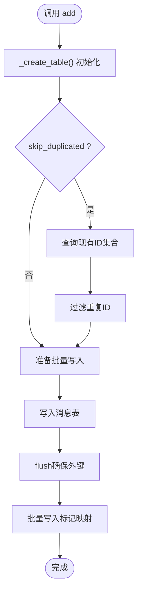
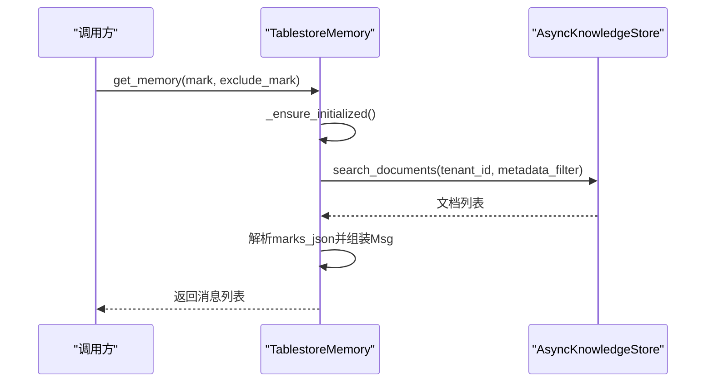
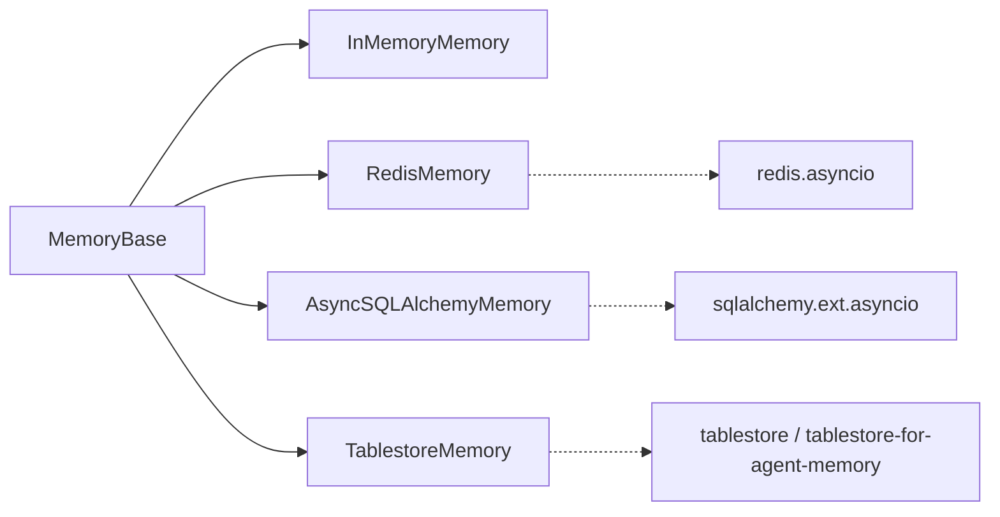

# 工作记忆

<cite>
**本文引用的文件**
- [src/agentscope/memory/_working_memory/_base.py](file://src/agentscope/memory/_working_memory/_base.py)
- [src/agentscope/memory/_working_memory/_in_memory_memory.py](file://src/agentscope/memory/_working_memory/_in_memory_memory.py)
- [src/agentscope/memory/_working_memory/_redis_memory.py](file://src/agentscope/memory/_working_memory/_redis_memory.py)
- [src/agentscope/memory/_working_memory/_sqlalchemy_memory.py](file://src/agentscope/memory/_working_memory/_sqlalchemy_memory.py)
- [src/agentscope/memory/_working_memory/_tablestore_memory.py](file://src/agentscope/memory/_working_memory/_tablestore_memory.py)
- [src/agentscope/memory/__init__.py](file://src/agentscope/memory/__init__.py)
- [tests/memory_test.py](file://tests/memory_test.py)
- [docs/tutorial/zh_CN/src/task_memory.py](file://docs/tutorial/zh_CN/src/task_memory.py)
</cite>

## 目录
1. [简介](#简介)
2. [项目结构](#项目结构)
3. [核心组件](#核心组件)
4. [架构总览](#架构总览)
5. [详细组件分析](#详细组件分析)
6. [依赖关系分析](#依赖关系分析)
7. [性能考量](#性能考量)
8. [故障排查指南](#故障排查指南)
9. [结论](#结论)
10. [附录](#附录)

## 简介
本文件面向AgentScope工作记忆系统，聚焦“短期记忆”（工作记忆）子模块，系统性梳理MemoryBase基类的设计理念与接口规范，深入解析四种存储实现：内存存储（InMemoryMemory）、Redis存储（RedisMemory）、SQLAlchemy存储（AsyncSQLAlchemyMemory）、表格存储（TablestoreMemory）。文档覆盖：
- 基础架构与接口契约
- 各存储实现的配置参数、连接方式、性能特征与适用场景
- 使用模式：消息存储、状态更新、查询检索
- 配置示例、性能对比与故障处理策略
- 完整API参考与部署建议

## 项目结构
工作记忆位于memory/_working_memory目录，对外通过memory模块导出，核心文件如下：
- 基类：_base.py
- 实现：_in_memory_memory.py、_redis_memory.py、_sqlalchemy_memory.py、_tablestore_memory.py
- 导出入口：__init__.py

图表来源
- [src/agentscope/memory/_working_memory/_base.py:11-169](file://src/agentscope/memory/_working_memory/_base.py#L11-L169)
- [src/agentscope/memory/_working_memory/_in_memory_memory.py:10-306](file://src/agentscope/memory/_working_memory/_in_memory_memory.py#L10-L306)
- [src/agentscope/memory/_working_memory/_redis_memory.py:16-828](file://src/agentscope/memory/_working_memory/_redis_memory.py#L16-L828)
- [src/agentscope/memory/_working_memory/_sqlalchemy_memory.py:32-890](file://src/agentscope/memory/_working_memory/_sqlalchemy_memory.py#L32-L890)
- [src/agentscope/memory/_working_memory/_tablestore_memory.py:14-852](file://src/agentscope/memory/_working_memory/_tablestore_memory.py#L14-L852)

章节来源
- [src/agentscope/memory/__init__.py:4-34](file://src/agentscope/memory/__init__.py#L4-L34)
- [src/agentscope/memory/_working_memory/__init__.py:1-19](file://src/agentscope/memory/_working_memory/__init__.py#L1-L19)

## 核心组件
- MemoryBase：定义工作记忆的统一接口与状态管理（压缩摘要），要求子类实现add/delete/size/clear/get_memory/update_messages_mark等方法。
- InMemoryMemory：基于进程内列表的轻量实现，适合单机、低延迟、无持久化需求场景。
- RedisMemory：基于Redis的高性能键值/列表存储，支持会话/用户隔离、标记索引、滑动TTL。
- AsyncSQLAlchemyMemory：基于SQLAlchemy ORM的异步关系型数据库存储，支持SQLite/PG/MySQL等，具备事务与并发写保护。
- TablestoreMemory：基于阿里云Tablestore的分布式知识存储，支持多租户/多会话隔离与语义检索。

章节来源
- [src/agentscope/memory/_working_memory/_base.py:11-169](file://src/agentscope/memory/_working_memory/_base.py#L11-L169)
- [src/agentscope/memory/_working_memory/_in_memory_memory.py:10-306](file://src/agentscope/memory/_working_memory/_in_memory_memory.py#L10-L306)
- [src/agentscope/memory/_working_memory/_redis_memory.py:16-828](file://src/agentscope/memory/_working_memory/_redis_memory.py#L16-L828)
- [src/agentscope/memory/_working_memory/_sqlalchemy_memory.py:32-890](file://src/agentscope/memory/_working_memory/_sqlalchemy_memory.py#L32-L890)
- [src/agentscope/memory/_working_memory/_tablestore_memory.py:14-852](file://src/agentscope/memory/_working_memory/_tablestore_memory.py#L14-L852)

## 架构总览
工作记忆采用“基类+多实现”的分层设计，统一接口屏蔽底层差异；各实现通过会话ID与用户ID实现多租户/多会话隔离；部分实现引入索引/缓存/连接池提升性能与可靠性。

图表来源
- [src/agentscope/memory/_working_memory/_base.py:11-169](file://src/agentscope/memory/_working_memory/_base.py#L11-L169)
- [src/agentscope/memory/_working_memory/_in_memory_memory.py:10-306](file://src/agentscope/memory/_working_memory/_in_memory_memory.py#L10-L306)
- [src/agentscope/memory/_working_memory/_redis_memory.py:16-828](file://src/agentscope/memory/_working_memory/_redis_memory.py#L16-L828)
- [src/agentscope/memory/_working_memory/_sqlalchemy_memory.py:32-890](file://src/agentscope/memory/_working_memory/_sqlalchemy_memory.py#L32-L890)
- [src/agentscope/memory/_working_memory/_tablestore_memory.py:14-852](file://src/agentscope/memory/_working_memory/_tablestore_memory.py#L14-L852)

## 详细组件分析

### MemoryBase 基类
- 设计要点
  - 继承StateModule，注册压缩摘要状态字段，支持序列化/反序列化。
  - 抽象方法：add/delete/size/clear/get_memory/update_messages_mark，确保实现一致性。
  - 提供delete_by_mark与update_messages_mark的默认未实现抛错，鼓励子类按需实现。
- 使用建议
  - 新增存储实现时，优先复用基类状态管理，保证与上层模块的兼容性。

章节来源
- [src/agentscope/memory/_working_memory/_base.py:11-169](file://src/agentscope/memory/_working_memory/_base.py#L11-L169)

### InMemoryMemory（内存存储）
- 存储结构
  - 内部以列表保存(消息, 标记列表)元组，便于顺序遍历与标记过滤。
  - 注册content状态，支持state_dict/load_state_dict。
- 接口行为
  - get_memory：支持按mark/exclude_mark过滤，prepend_summary可前置压缩摘要。
  - add：支持去重（allow_duplicates）与批量插入。
  - delete/delete_by_mark：按ID或标记删除，返回删除数量。
  - update_messages_mark：支持新增、移除、替换标记，返回更新数量。
  - size/clear：统计与清空。
- 性能与限制
  - O(n)过滤与O(n)删除，适合小规模、低延迟场景。
  - 不具备持久化，进程重启即丢失。
- 适用场景
  - 单机调试、单元测试、极简应用。

图表来源
- [src/agentscope/memory/_working_memory/_in_memory_memory.py:93-136](file://src/agentscope/memory/_working_memory/_in_memory_memory.py#L93-L136)

章节来源
- [src/agentscope/memory/_working_memory/_in_memory_memory.py:10-306](file://src/agentscope/memory/_working_memory/_in_memory_memory.py#L10-L306)

### RedisMemory（Redis存储）
- 连接与隔离
  - 支持host/port/db/password/connection_pool，key_prefix实现多应用/多环境隔离。
  - 通过user_id/session_id构建键前缀，确保多租户/多会话隔离。
- 键空间设计
  - 会话键：有序列表存储消息ID，维护插入顺序。
  - 标记索引：集合marks_index记录当前会话存在的所有mark，避免全表扫描。
  - 标记键：每个mark对应有序列表存储消息ID。
  - 消息键：JSON存储消息字典。
- 接口行为
  - get_memory：支持按mark或排除标记检索，批量mget减少往返。
  - add：pipeline原子写入，支持跳过重复（skip_duplicated）。
  - delete/delete_by_mark：清理会话列表、消息数据、标记列表与索引。
  - update_messages_mark：在旧标记列表中移除，在新标记列表中添加，必要时维护索引。
  - size：读取会话列表长度。
  - TTL：可选滑动TTL，refresh_session_ttl周期刷新。
- 性能与特性
  - O(1)标记索引查找，O(n)列表操作；批量mget降低网络开销。
  - 支持TTL，适合短期会话与临时上下文。
- 适用场景
  - 分布式服务、高并发、需要会话隔离与滑动TTL的场景。

图表来源
- [src/agentscope/memory/_working_memory/_redis_memory.py:471-554](file://src/agentscope/memory/_working_memory/_redis_memory.py#L471-L554)

章节来源
- [src/agentscope/memory/_working_memory/_redis_memory.py:16-828](file://src/agentscope/memory/_working_memory/_redis_memory.py#L16-L828)

### AsyncSQLAlchemyMemory（SQLAlchemy存储）
- 数据模型
  - 用户表(users)、会话表(sessions)、消息表(messages)、消息标记表(message_mark)。
  - 复合主键：{user_id}-{session_id}-{message_id}，确保跨用户/会话唯一性。
  - 消息表含索引列，保证插入顺序检索。
- 连接与并发
  - 支持传入AsyncEngine或AsyncSession；内部使用async_sessionmaker与锁(_lock)串行写入，避免并发写冲突。
  - 提供上下文管理器协议，自动commit/rollback与关闭。
- 接口行为
  - get_memory：先按session_id过滤，再按mark/exclude_mark过滤，最后按index排序。
  - add：去重（skip_duplicated），批量写入消息与标记，flush后批量插入标记映射。
  - delete/delete_by_mark：先删标记，再删消息，确保外键约束与一致性。
  - update_messages_mark：支持新增、移除、替换标记，返回更新数量。
  - size/clear：基于SQL聚合与删除。
- 性能与特性
  - 事务安全，索引优化；并发写通过锁串行化，避免竞态。
  - 支持多种关系数据库，适合生产级持久化与复杂查询。
- 适用场景
  - 需要关系型数据库、事务与并发控制的生产系统。

图表来源
- [src/agentscope/memory/_working_memory/_sqlalchemy_memory.py:381-510](file://src/agentscope/memory/_working_memory/_sqlalchemy_memory.py#L381-L510)

章节来源
- [src/agentscope/memory/_working_memory/_sqlalchemy_memory.py:32-890](file://src/agentscope/memory/_working_memory/_sqlalchemy_memory.py#L32-L890)

### TablestoreMemory（表格存储）
- 客户端与初始化
  - 通过AsyncTablestoreClient与AsyncKnowledgeStore封装，首次使用时惰性初始化表结构与搜索索引。
  - 支持多租户（tenant_id=user_id）、多会话（session_id）隔离。
- 文档模型
  - 文档ID：{msg_id}:::{session_id}，确保同会话内唯一。
  - 文档元数据包含session_id、名称、角色、时间戳、调用ID、marks_json等。
- 接口行为
  - get_memory：基于marks_json字段的In/not_in过滤，结合session_id与tenant_id检索。
  - add：批量put_documents，支持去重检查。
  - delete/delete_by_mark：按文档ID删除或按标记检索后删除。
  - update_messages_mark：检索目标消息ID及其当前标记，更新marks_json后批量更新。
  - size/clear：遍历搜索结果统计或批量删除。
- 性能与特性
  - 基于搜索索引的高效过滤；支持向量化（可选维度）与语义检索。
  - 适合大规模、高并发、需要可搜索与多租户隔离的场景。
- 适用场景
  - 分布式系统、需要可搜索与向量检索的工作记忆。

图表来源
- [src/agentscope/memory/_working_memory/_tablestore_memory.py:603-659](file://src/agentscope/memory/_working_memory/_tablestore_memory.py#L603-L659)

章节来源
- [src/agentscope/memory/_working_memory/_tablestore_memory.py:14-852](file://src/agentscope/memory/_working_memory/_tablestore_memory.py#L14-L852)

## 依赖关系分析
- 组件耦合
  - MemoryBase提供统一接口，四类实现均遵循相同契约，便于替换与扩展。
  - Redis/SQLAlchemy/Tablestore实现各自依赖外部库（redis、sqlalchemy、tablestore），InMemoryMemory无外部依赖。
- 外部依赖
  - Redis：redis.asyncio
  - SQLAlchemy：sqlalchemy.ext.asyncio
  - Tablestore：tablestore、tablestore-for-agent-memory
- 潜在循环依赖
  - 当前实现为单向依赖（实现依赖基类），无循环依赖风险。

图表来源
- [src/agentscope/memory/_working_memory/_base.py:11-169](file://src/agentscope/memory/_working_memory/_base.py#L11-L169)
- [src/agentscope/memory/_working_memory/_redis_memory.py:16-118](file://src/agentscope/memory/_working_memory/_redis_memory.py#L16-L118)
- [src/agentscope/memory/_working_memory/_sqlalchemy_memory.py:32-28](file://src/agentscope/memory/_working_memory/_sqlalchemy_memory.py#L32-L28)
- [src/agentscope/memory/_working_memory/_tablestore_memory.py:14-86](file://src/agentscope/memory/_working_memory/_tablestore_memory.py#L14-L86)

章节来源
- [src/agentscope/memory/_working_memory/_redis_memory.py:16-118](file://src/agentscope/memory/_working_memory/_redis_memory.py#L16-L118)
- [src/agentscope/memory/_working_memory/_sqlalchemy_memory.py:32-28](file://src/agentscope/memory/_working_memory/_sqlalchemy_memory.py#L32-L28)
- [src/agentscope/memory/_working_memory/_tablestore_memory.py:14-86](file://src/agentscope/memory/_working_memory/_tablestore_memory.py#L14-L86)

## 性能考量
- InMemoryMemory
  - 时间复杂度：get_memory/filter O(n)，delete O(n)，适合小规模数据。
  - 空间复杂度：O(n)。
  - 优点：零依赖、低延迟。
  - 缺点：无持久化、无并发写保护。
- RedisMemory
  - 时间复杂度：get_memory批量mget O(k)；add/pipeline原子写入；TTL刷新O(m)。
  - 优点：高性能、支持TTL、标记索引加速。
  - 缺点：依赖Redis，大会话设置TTL可能带来额外开销。
- AsyncSQLAlchemyMemory
  - 时间复杂度：查询走索引，批量写入优化；并发写通过锁串行化。
  - 优点：事务安全、跨数据库、可扩展。
  - 缺点：锁可能成为瓶颈；需要正确配置连接池。
- TablestoreMemory
  - 时间复杂度：基于搜索索引过滤；批量put/search。
  - 优点：分布式、可搜索、多租户隔离、可选向量检索。
  - 缺点：依赖阿里云Tablestore，网络开销与初始化成本。

[本节为通用性能讨论，不直接分析具体文件]

## 故障排查指南
- RedisMemory
  - TTL问题：若key_ttl设置过小且频繁访问，refresh_session_ttl可能导致大量expire命令；建议评估会话规模与TTL设置。
  - 字节解码：当decode_responses=False时，需确保字节/字符串解码逻辑正确。
  - 标记索引迁移：旧数据无marks_index时会触发一次性扫描迁移，注意首次访问延迟。
- AsyncSQLAlchemyMemory
  - 并发写冲突：多个协程同时调用add可能产生重复主键冲突；内部通过锁与去重策略缓解，仍建议合理拆分会话或使用连接池。
  - 事务异常：异常时自动回滚，确认session是否处于活跃状态。
- TablestoreMemory
  - 初始化失败：首次懒加载需网络可达与权限正确；检查endpoint、实例名、密钥与STS token。
  - 文档ID格式：确保document_id格式为{msg_id}:::{session_id}，否则日志会记录错误。
- 通用
  - 状态序列化：InMemoryMemory/state_dict/load_state_dict用于持久化/恢复，注意strict模式与字段完整性。
  - 测试验证：参考tests/memory_test.py中的多租户/多会话隔离与标记操作测试，定位问题范围。

章节来源
- [tests/memory_test.py:691-840](file://tests/memory_test.py#L691-L840)
- [src/agentscope/memory/_working_memory/_redis_memory.py:277-314](file://src/agentscope/memory/_working_memory/_redis_memory.py#L277-L314)
- [src/agentscope/memory/_working_memory/_tablestore_memory.py:115-144](file://src/agentscope/memory/_working_memory/_tablestore_memory.py#L115-L144)

## 结论
- MemoryBase统一了工作记忆的接口与状态管理，确保实现一致性与可替换性。
- 四种存储各有侧重：InMemoryMemory适合单机与测试；RedisMemory适合高并发与短期会话；AsyncSQLAlchemyMemory适合生产级关系型持久化；TablestoreMemory适合分布式与可搜索场景。
- 建议依据业务规模、持久化需求、并发与网络条件选择合适实现，并在生产中配套连接池、事务与监控。

[本节为总结性内容，不直接分析具体文件]

## 附录

### 使用模式与最佳实践
- 消息存储
  - add支持单条或多条消息，marks可为字符串或字符串列表；Redis/SQLAlchemy/Tablestore均支持去重与批量写入。
- 状态更新
  - update_compressed_summary用于设置压缩摘要，get_memory可选择prepend_summary前置显示。
- 查询检索
  - get_memory支持mark/exclude_mark组合过滤；Redis/SQLAlchemy/Tablestore均提供相应索引/过滤路径。
- 标记管理
  - update_messages_mark支持新增、移除、替换标记；delete_by_mark按标记批量删除。

章节来源
- [src/agentscope/memory/_working_memory/_base.py:104-168](file://src/agentscope/memory/_working_memory/_base.py#L104-L168)
- [src/agentscope/memory/_working_memory/_redis_memory.py:379-469](file://src/agentscope/memory/_working_memory/_redis_memory.py#L379-L469)
- [src/agentscope/memory/_working_memory/_sqlalchemy_memory.py:279-379](file://src/agentscope/memory/_working_memory/_sqlalchemy_memory.py#L279-L379)
- [src/agentscope/memory/_working_memory/_tablestore_memory.py:603-659](file://src/agentscope/memory/_working_memory/_tablestore_memory.py#L603-L659)

### API参考（方法与关键参数）
- MemoryBase
  - update_compressed_summary(summary)
  - add(memories, marks=None, **kwargs)
  - delete(msg_ids, **kwargs) -> int
  - delete_by_mark(mark, **kwargs) -> int
  - size() -> int
  - clear() -> None
  - get_memory(mark=None, exclude_mark=None, prepend_summary=True, **kwargs) -> list[Msg]
  - update_messages_mark(new_mark=None, old_mark=None, msg_ids=None) -> int
- InMemoryMemory
  - state_dict()/load_state_dict()
- RedisMemory
  - get_client()/close()
  - 关键参数：session_id, user_id, host, port, db, password, connection_pool, key_prefix, key_ttl
- AsyncSQLAlchemyMemory
  - close()/__aenter__/__aexit__()
  - 关键参数：engine_or_session, session_id, user_id
- TablestoreMemory
  - close()/__aenter__/__aexit__()
  - 关键参数：end_point, instance_name, access_key_id, access_key_secret, user_id, session_id, sts_token, table_name, text_field, embedding_field, vector_dimension

章节来源
- [src/agentscope/memory/_working_memory/_base.py:11-169](file://src/agentscope/memory/_working_memory/_base.py#L11-L169)
- [src/agentscope/memory/_working_memory/_in_memory_memory.py:273-306](file://src/agentscope/memory/_working_memory/_in_memory_memory.py#L273-L306)
- [src/agentscope/memory/_working_memory/_redis_memory.py:65-134](file://src/agentscope/memory/_working_memory/_redis_memory.py#L65-L134)
- [src/agentscope/memory/_working_memory/_sqlalchemy_memory.py:120-174](file://src/agentscope/memory/_working_memory/_sqlalchemy_memory.py#L120-L174)
- [src/agentscope/memory/_working_memory/_tablestore_memory.py:26-114](file://src/agentscope/memory/_working_memory/_tablestore_memory.py#L26-L114)

### 配置示例与部署建议
- 内存存储（InMemoryMemory）
  - 适合本地开发与单元测试，无需外部依赖。
- 关系数据库（AsyncSQLAlchemyMemory）
  - SQLite内存：sqlite+aiosqlite:///:memory:，适合测试。
  - 生产建议：使用连接池（pool_size/max_overflow/pool_timeout），配合FastAPI生命周期管理会话。
- Redis（RedisMemory）
  - 开发可用fakeredis；生产建议使用连接池，设置合理的key_ttl与key_prefix。
- 表格存储（TablestoreMemory）
  - 安装依赖：pip install tablestore tablestore-for-agent-memory。
  - 生产建议：配置endpoint/instance_name/access_key与STS token，启用多租户隔离与搜索索引。

章节来源
- [docs/tutorial/zh_CN/src/task_memory.py:87-551](file://docs/tutorial/zh_CN/src/task_memory.py#L87-L551)
- [tests/memory_test.py:604-689](file://tests/memory_test.py#L604-L689)