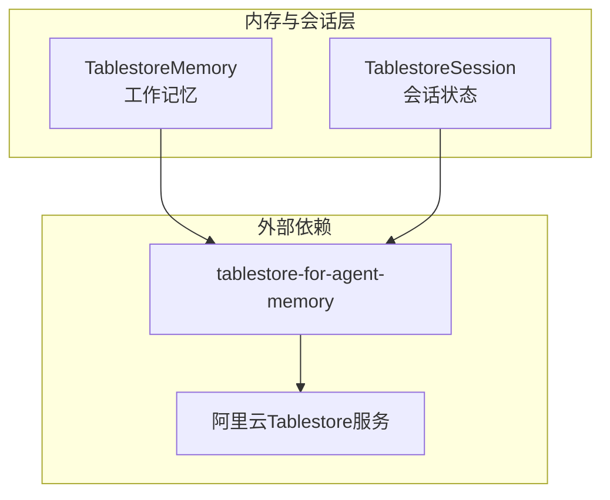
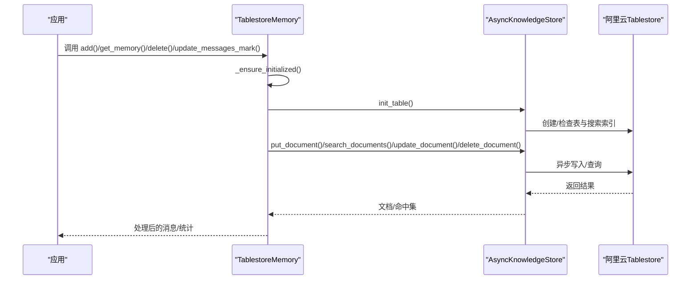
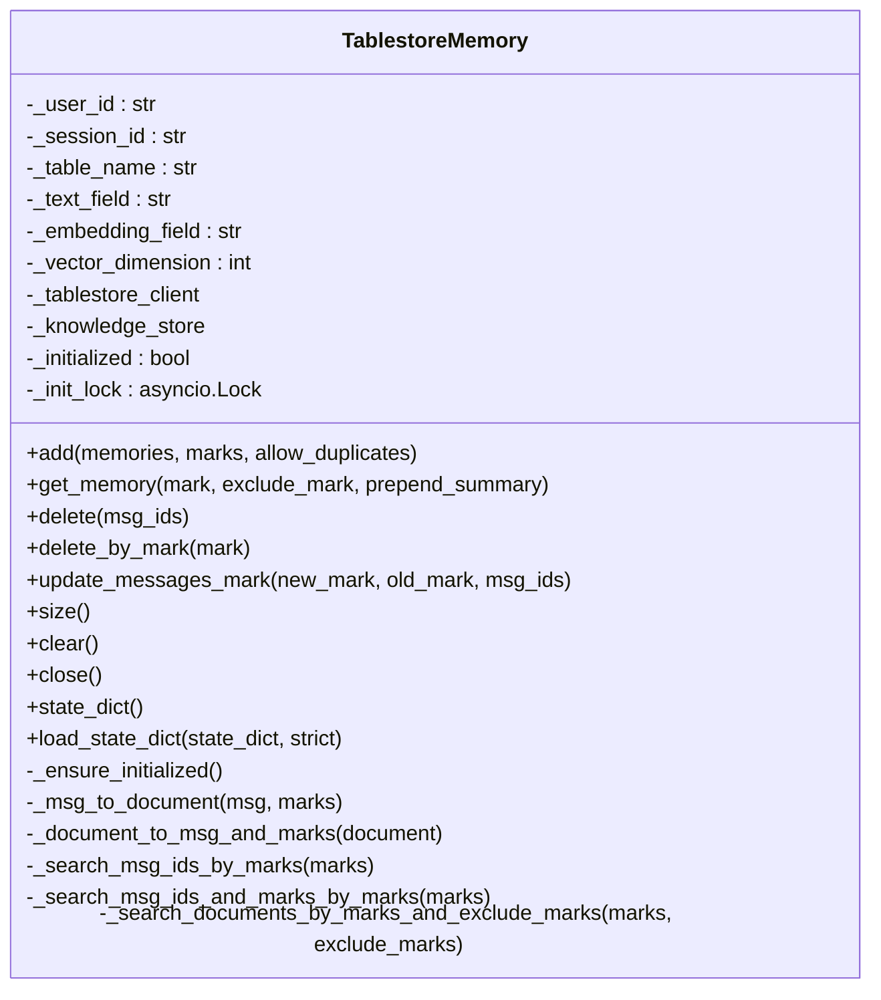
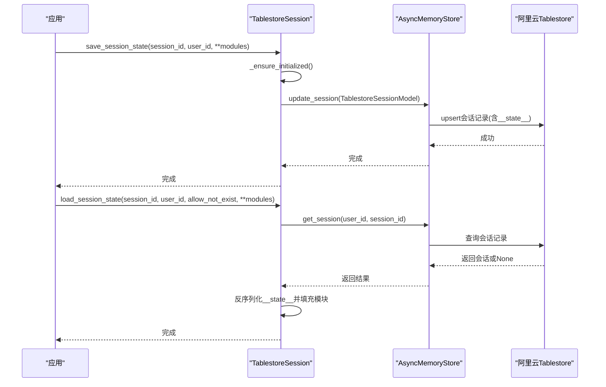
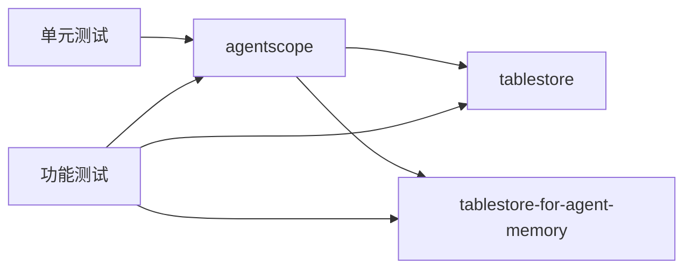

# 表格存储

<cite>
**本文引用的文件列表**
- [tablestore_memory.py](file://src/agentscope/memory/_working_memory/_tablestore_memory.py)
- [tablestore_session.py](file://src/agentscope/session/_tablestore_session.py)
- [tablestore_memory_test.py](file://tests/tablestore_memory_test.py)
- [tablestore_memory_ft_test.py](file://tests/tablestore_memory_ft_test.py)
- [tablestore_session_test.py](file://tests/tablestore_session_test.py)
- [tablestore_session_ft_test.py](file://tests/tablestore_session_ft_test.py)
- [pyproject.toml](file://pyproject.toml)
- [README.md](file://README.md)
</cite>

## 目录
1. [简介](#简介)
2. [项目结构与定位](#项目结构与定位)
3. [核心组件](#核心组件)
4. [架构总览](#架构总览)
5. [详细组件分析](#详细组件分析)
6. [依赖关系分析](#依赖关系分析)
7. [性能与并发特性](#性能与并发特性)
8. [部署与配置指南](#部署与配置指南)
9. [监控与告警](#监控与告警)
10. [故障排查与运维最佳实践](#故障排查与运维最佳实践)
11. [结论](#结论)

## 简介
本技术文档聚焦于AgentScope中基于阿里云表格存储（Tablestore）的“工作记忆”与“会话状态”实现，系统性阐述TablestoreMemory与TablestoreSession两类组件的架构、数据模型、高并发处理机制、配置参数、部署与运维要点，并给出开发/生产环境的完整配置示例与优化建议。文档同时覆盖读写性能优化、成本控制、监控与告警、故障排查等工程化实践。

## 项目结构与定位
- 表格存储相关实现位于工作记忆模块与会话模块：
  - 工作记忆：TablestoreMemory（消息持久化、标记过滤、去重、压缩摘要）
  - 会话管理：TablestoreSession（会话元数据持久化、状态序列化/反序列化）
- 测试用例覆盖单元测试与端到端功能测试，验证初始化、增删改查、标记更新、上下文管理、索引同步等待等关键行为。

图表来源
- [tablestore_memory.py:14-114](file://src/agentscope/memory/_working_memory/_tablestore_memory.py#L14-L114)
- [tablestore_session.py:12-90](file://src/agentscope/session/_tablestore_session.py#L12-L90)

章节来源
- [tablestore_memory.py:14-114](file://src/agentscope/memory/_working_memory/_tablestore_memory.py#L14-L114)
- [tablestore_session.py:12-90](file://src/agentscope/session/_tablestore_session.py#L12-L90)

## 核心组件
- TablestoreMemory：基于异步知识库的表格存储工作记忆，支持消息去重、标记过滤、时间戳排序、压缩摘要前置、向量维度可选。
- TablestoreSession：基于异步内存存储的会话管理，将状态模块序列化为JSON并存入会话表元数据字段，支持多模块加载/保存、上下文管理器、空会话容错。

章节来源
- [tablestore_memory.py:14-114](file://src/agentscope/memory/_working_memory/_tablestore_memory.py#L14-L114)
- [tablestore_session.py:12-90](file://src/agentscope/session/_tablestore_session.py#L12-L90)

## 架构总览
- 初始化策略：惰性初始化，首次使用时建立客户端与知识库/内存存储实例，并初始化表与搜索索引。
- 并发控制：通过异步锁避免并发重复初始化；批量写入采用gather并发提交。
- 数据模型：消息以文档形式存储，文档ID由消息ID与会话ID拼接；元数据包含会话标识、角色、时间戳、标记数组等；文本字段存储消息的JSON序列化内容。
- 搜索与过滤：基于搜索索引与元数据过滤器进行条件查询，支持包含/排除标记、按会话隔离、按时间戳排序返回。

图表来源
- [tablestore_memory.py:115-144](file://src/agentscope/memory/_working_memory/_tablestore_memory.py#L115-L144)
- [tablestore_memory.py:261-316](file://src/agentscope/memory/_working_memory/_tablestore_memory.py#L261-L316)
- [tablestore_memory.py:413-493](file://src/agentscope/memory/_working_memory/_tablestore_memory.py#L413-L493)

章节来源
- [tablestore_memory.py:115-144](file://src/agentscope/memory/_working_memory/_tablestore_memory.py#L115-L144)
- [tablestore_memory.py:261-316](file://src/agentscope/memory/_working_memory/_tablestore_memory.py#L261-L316)
- [tablestore_memory.py:413-493](file://src/agentscope/memory/_working_memory/_tablestore_memory.py#L413-L493)

## 详细组件分析

### TablestoreMemory 组件
- 关键职责
  - 消息持久化：将消息转换为文档并写入表，支持去重与批量写入。
  - 标记管理：支持添加、替换、移除标记，基于元数据字段marks_json进行更新。
  - 查询与过滤：按会话隔离、按标记包含/排除过滤、按时间戳排序。
  - 生命周期：惰性初始化、关闭释放资源、状态序列化/反序列化。
- 数据模型
  - 文档ID：{msg.id}:::{session_id}，确保同一会话内唯一。
  - 元数据字段：session_id、name、role、timestamp、invocation_id、marks_json。
  - 文本字段：消息的JSON序列化内容，便于全文检索或语义检索。
- 并发与一致性
  - 写入：批量写入使用gather并发提交，提升吞吐。
  - 读取：搜索采用分页游标next_token遍历，最终按时间戳排序。
  - 去重：在允许去重为false时，先查询已存在ID再过滤。
- 高级能力
  - 向量维度可配置，启用向量搜索能力（当vector_dimension > 0时）。
  - 压缩摘要前置：在获取记忆时可将压缩摘要作为第一条消息插入。

图表来源
- [tablestore_memory.py:14-114](file://src/agentscope/memory/_working_memory/_tablestore_memory.py#L14-L114)
- [tablestore_memory.py:191-259](file://src/agentscope/memory/_working_memory/_tablestore_memory.py#L191-L259)
- [tablestore_memory.py:392-493](file://src/agentscope/memory/_working_memory/_tablestore_memory.py#L392-L493)
- [tablestore_memory.py:758-823](file://src/agentscope/memory/_working_memory/_tablestore_memory.py#L758-L823)

章节来源
- [tablestore_memory.py:14-114](file://src/agentscope/memory/_working_memory/_tablestore_memory.py#L14-L114)
- [tablestore_memory.py:191-259](file://src/agentscope/memory/_working_memory/_tablestore_memory.py#L191-L259)
- [tablestore_memory.py:392-493](file://src/agentscope/memory/_working_memory/_tablestore_memory.py#L392-L493)
- [tablestore_memory.py:758-823](file://src/agentscope/memory/_working_memory/_tablestore_memory.py#L758-L823)

### TablestoreSession 组件
- 关键职责
  - 会话状态持久化：将状态模块的state_dict序列化为JSON，写入会话表元数据字段。
  - 会话状态恢复：从元数据字段读取JSON并反序列化到对应模块。
  - 容错处理：支持会话不存在时的宽松/严格模式。
  - 生命周期：惰性初始化、上下文管理器自动关闭。
- 数据模型
  - 会话表：包含会话ID、用户ID、元数据（含__state__键）。
  - 元数据键：__state__，值为各模块名称到其state_dict的映射JSON。
- 并发与一致性
  - 惰性初始化+互斥锁，避免并发重复初始化。
  - 更新采用upsert语义，覆盖旧状态。

图表来源
- [tablestore_session.py:91-124](file://src/agentscope/session/_tablestore_session.py#L91-L124)
- [tablestore_session.py:126-237](file://src/agentscope/session/_tablestore_session.py#L126-L237)

章节来源
- [tablestore_session.py:12-90](file://src/agentscope/session/_tablestore_session.py#L12-L90)
- [tablestore_session.py:91-124](file://src/agentscope/session/_tablestore_session.py#L91-L124)
- [tablestore_session.py:126-237](file://src/agentscope/session/_tablestore_session.py#L126-L237)

## 依赖关系分析
- 运行时依赖
  - tablestore：阿里云表格存储SDK（异步客户端、重试策略）
  - tablestore-for-agent-memory：封装知识库/内存存储、过滤器、搜索辅助工具
- 项目打包依赖
  - 可选依赖：agentscope[tablestore_memory] 包含上述两个包
- 测试依赖
  - 单元测试：对内部逻辑进行断言（mock知识库/内存存储）
  - 功能测试：真实环境变量驱动，等待搜索索引就绪后执行CRUD与标记操作

图表来源
- [pyproject.toml:76-91](file://pyproject.toml#L76-L91)
- [tablestore_memory.py:73-85](file://src/agentscope/memory/_working_memory/_tablestore_memory.py#L73-L85)
- [tablestore_session.py:60-73](file://src/agentscope/session/_tablestore_session.py#L60-L73)

章节来源
- [pyproject.toml:76-91](file://pyproject.toml#L76-L91)
- [tablestore_memory.py:73-85](file://src/agentscope/memory/_working_memory/_tablestore_memory.py#L73-L85)
- [tablestore_session.py:60-73](file://src/agentscope/session/_tablestore_session.py#L60-L73)

## 性能与并发特性
- 高并发写入
  - 批量写入使用asyncio.gather并发提交，显著提升吞吐。
  - 写入重试策略：使用WriteRetryPolicy降低瞬时失败影响。
- 搜索与过滤
  - 使用元数据过滤器（包含/排除标记、会话ID、租户ID）进行高效筛选。
  - 分页游标next_token遍历，避免一次性拉取大量结果。
  - 结果按时间戳排序，保证输出顺序稳定。
- 去重与幂等
  - 允许去重为false时，先查询已存在ID再过滤，避免重复写入。
  - 同一消息ID在同会话下upsert语义，保证幂等。
- 索引与延迟
  - 搜索索引异步构建，功能测试中通过TablestoreHelper等待索引就绪，确保查询一致性。

章节来源
- [tablestore_memory.py:309-316](file://src/agentscope/memory/_working_memory/_tablestore_memory.py#L309-L316)
- [tablestore_memory.py:413-493](file://src/agentscope/memory/_working_memory/_tablestore_memory.py#L413-L493)
- [tablestore_memory.py:800-823](file://src/agentscope/memory/_working_memory/_tablestore_memory.py#L800-L823)
- [tablestore_memory_ft_test.py:51-74](file://tests/tablestore_memory_ft_test.py#L51-L74)

## 部署与配置指南

### 配置参数总览
- Endpoint：Tablestore实例访问地址
- InstanceName：Tablestore实例名
- AccessKeyId / AccessKeySecret：鉴权凭据
- StsToken（可选）：临时凭证
- Table相关参数（工作记忆）：
  - TableName：存储消息的表名
  - TextField：文本字段名（默认text）
  - EmbeddingField：向量字段名（默认embedding）
  - VectorDimension：向量维度（默认0，不启用向量搜索）
  - UserId / SessionId：多租户与会话隔离标识
- 表相关参数（会话）：
  - SessionTableName：会话表名
  - MessageTableName：消息表名

章节来源
- [tablestore_memory.py:26-70](file://src/agentscope/memory/_working_memory/_tablestore_memory.py#L26-L70)
- [tablestore_session.py:26-58](file://src/agentscope/session/_tablestore_session.py#L26-L58)

### 开发环境配置
- 安装可选依赖
  - pip install 'agentscope[tablestore_memory]'
- 设置环境变量（用于功能测试）
  - TABLESTORE_ENDPOINT
  - TABLESTORE_INSTANCE_NAME
  - TABLESTORE_ACCESS_KEY_ID
  - TABLESTORE_ACCESS_KEY_SECRET
- 初始化与使用
  - 工作记忆：TablestoreMemory(user_id, session_id, table_name, vector_dimension, end_point, instance_name, access_key_id, access_key_secret)
  - 会话：TablestoreSession(session_table_name, message_table_name, end_point, instance_name, access_key_id, access_key_secret)

章节来源
- [pyproject.toml:76-91](file://pyproject.toml#L76-L91)
- [tablestore_memory_ft_test.py:28-48](file://tests/tablestore_memory_ft_test.py#L28-L48)
- [tablestore_session_ft_test.py:30-50](file://tests/tablestore_session_ft_test.py#L30-L50)

### 生产环境配置
- 凭据管理
  - 推荐使用STS临时凭证或RAM子账号+最小权限策略，避免长期密钥泄露风险。
- 网络与可用区
  - 将应用部署在与Tablestore实例相同地域，降低网络延迟。
- 表与索引
  - 为消息表创建合适的主键与索引，确保会话ID、租户ID、标记字段被覆盖。
  - 搜索索引需等待就绪后再进行查询，功能测试中演示了等待逻辑。
- 扩展与成本
  - 根据QPS与容量选择合适规格，结合自动分片与弹性扩缩容策略。
  - 控制向量维度与索引规模，避免不必要的存储与查询开销。

章节来源
- [tablestore_memory_ft_test.py:51-74](file://tests/tablestore_memory_ft_test.py#L51-L74)
- [tablestore_session.py:111-124](file://src/agentscope/session/_tablestore_session.py#L111-L124)

## 监控与告警
- 建议监控指标
  - 写入延迟/错误率、读取延迟/错误率、搜索索引就绪状态、表容量与查询耗时
  - 并发初始化锁等待时间、批量写入任务完成时间
- 告警阈值
  - 写入错误率超过阈值触发告警
  - 搜索索引就绪等待超时触发告警
- 日志
  - 记录文档ID格式异常、会话不存在、状态加载失败等关键事件

章节来源
- [tablestore_memory.py:182-188](file://src/agentscope/memory/_working_memory/_tablestore_memory.py#L182-L188)
- [tablestore_session.py:200-211](file://src/agentscope/session/_tablestore_session.py#L200-L211)

## 故障排查与运维最佳实践
- 常见问题
  - 文档ID格式异常：检查会话ID是否匹配，日志会记录错误并回退。
  - 会话不存在：根据allow_not_exist参数决定抛出异常或跳过。
  - 搜索索引未就绪：功能测试中展示了等待索引就绪的方法。
- 最佳实践
  - 使用惰性初始化与互斥锁，避免并发重复初始化。
  - 批量写入使用gather并发提交，但注意限流与重试策略。
  - 对标记更新与删除操作，建议等待索引同步后再进行查询。
  - 定期清理历史会话与消息，控制表规模与查询成本。

章节来源
- [tablestore_memory.py:182-188](file://src/agentscope/memory/_working_memory/_tablestore_memory.py#L182-L188)
- [tablestore_session.py:200-211](file://src/agentscope/session/_tablestore_session.py#L200-L211)
- [tablestore_memory_ft_test.py:51-74](file://tests/tablestore_memory_ft_test.py#L51-L74)

## 结论
AgentScope的表格存储实现通过TablestoreMemory与TablestoreSession，提供了高并发、可扩展、可运维的消息与会话持久化能力。借助惰性初始化、并发写入、元数据过滤与索引等待机制，系统在保证一致性的同时兼顾性能与成本控制。结合本文提供的配置、监控与运维建议，可在开发与生产环境中稳定落地。