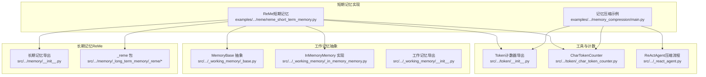
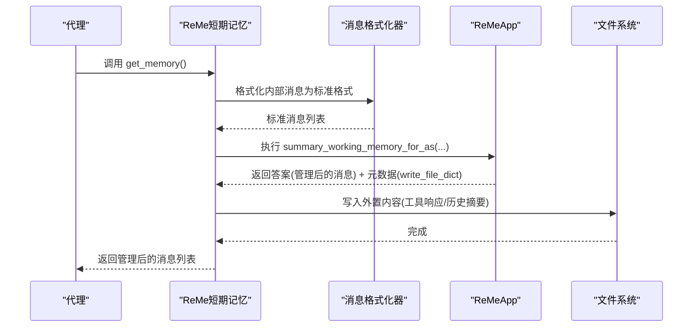
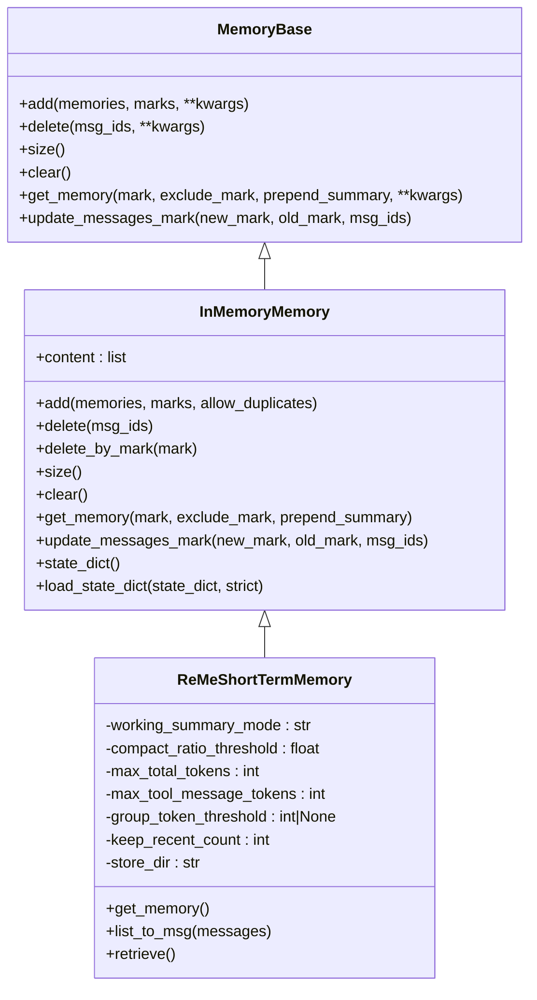
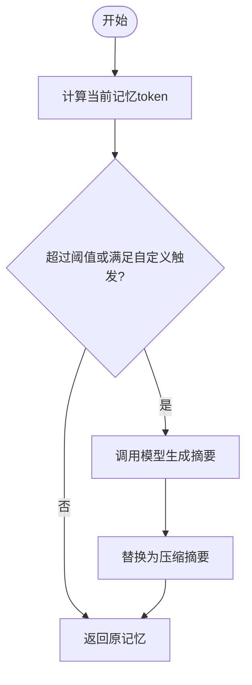
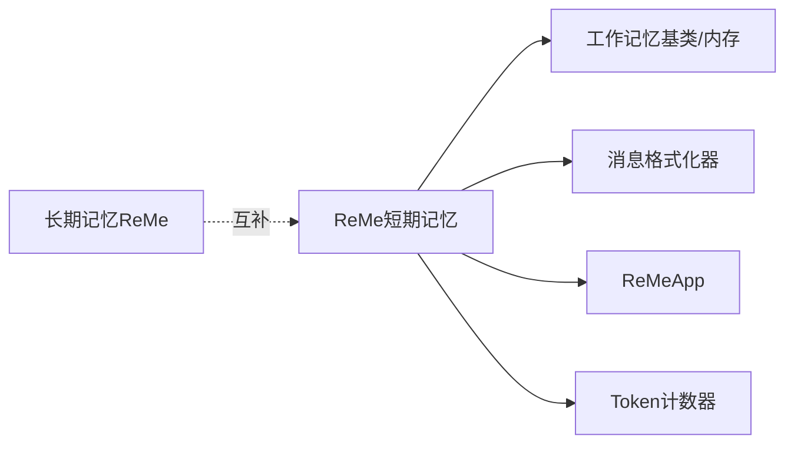

# 短期记忆

<cite>
**本文引用的文件**
- [src/agentscope/memory/_working_memory/__init__.py](file://src/agentscope/memory/_working_memory/__init__.py)
- [src/agentscope/memory/_working_memory/_base.py](file://src/agentscope/memory/_working_memory/_base.py)
- [src/agentscope/memory/_working_memory/_in_memory_memory.py](file://src/agentscope/memory/_working_memory/_in_memory_memory.py)
- [src/agentscope/memory/__init__.py](file://src/agentscope/memory/__init__.py)
- [src/agentscope/token/__init__.py](file://src/agentscope/token/__init__.py)
- [src/agentscope/token/_char_token_counter.py](file://src/agentscope/token/_char_token_counter.py)
- [src/agentscope/agent/_react_agent.py](file://src/agentscope/agent/_react_agent.py)
- [examples/functionality/short_term_memory/reme/reme_short_term_memory.py](file://examples/functionality/short_term_memory/reme/reme_short_term_memory.py)
- [examples/functionality/short_term_memory/reme/short_term_memory_example.py](file://examples/functionality/short_term_memory/reme/short_term_memory_example.py)
- [examples/functionality/short_term_memory/reme/README.md](file://examples/functionality/short_term_memory/reme/README.md)
- [examples/functionality/short_term_memory/memory_compression/main.py](file://examples/functionality/short_term_memory/memory_compression/main.py)
- [examples/functionality/short_term_memory/memory_compression/README.md](file://examples/functionality/short_term_memory/memory_compression/README.md)
- [tests/memory_reme_test.py](file://tests/memory_reme_test.py)
</cite>

## 目录
1. [简介](#简介)
2. [项目结构](#项目结构)
3. [核心组件](#核心组件)
4. [架构总览](#架构总览)
5. [详细组件分析](#详细组件分析)
6. [依赖关系分析](#依赖关系分析)
7. [性能考量](#性能考量)
8. [故障排除指南](#故障排除指南)
9. [结论](#结论)
10. [附录](#附录)

## 简介
本文件面向AgentScope短期记忆系统，聚焦于ReMe短期记忆的实现与使用，系统性阐述短期记忆的管理机制（压缩、存储优化、访问模式）、与工作记忆/长期记忆的协同方式、配置选项、使用模式、性能测试与故障排除，并提供API参考与部署建议。ReMe短期记忆通过“紧缩（Compaction）+可选压缩（Compression）”的多阶段流水线，在保证上下文连贯的同时，将大体量工具响应与历史消息外置或摘要化，从而在有限上下文窗口内维持高效对话。

## 项目结构
短期记忆相关代码主要分布在以下模块：
- 工作记忆基类与实现：提供通用的记忆接口与内存实现
- ReMe短期记忆：基于ReMe应用的自动紧缩与压缩实现
- 记忆压缩示例：ReActAgent内置的另一种短期记忆压缩方案
- 长期记忆ReMe：ReMe在个人/任务/工具记忆中的应用（与短期记忆互补）
- Token计数器：用于压缩触发与容量控制的令牌统计

图表来源
- [examples/functionality/short_term_memory/reme/reme_short_term_memory.py:17-350](file://examples/functionality/short_term_memory/reme/reme_short_term_memory.py#L17-L350)
- [src/agentscope/memory/_working_memory/_base.py:11-169](file://src/agentscope/memory/_working_memory/_base.py#L11-L169)
- [src/agentscope/memory/_working_memory/_in_memory_memory.py:10-306](file://src/agentscope/memory/_working_memory/_in_memory_memory.py#L10-L306)
- [src/agentscope/memory/_working_memory/__init__.py:1-19](file://src/agentscope/memory/_working_memory/__init__.py#L1-L19)
- [src/agentscope/memory/__init__.py:1-34](file://src/agentscope/memory/__init__.py#L1-L34)
- [src/agentscope/token/__init__.py:1-20](file://src/agentscope/token/__init__.py#L1-L20)
- [src/agentscope/token/_char_token_counter.py:8-43](file://src/agentscope/token/_char_token_counter.py#L8-L43)
- [src/agentscope/agent/_react_agent.py:1089-1123](file://src/agentscope/agent/_react_agent.py#L1089-L1123)
- [examples/functionality/short_term_memory/memory_compression/main.py:11-47](file://examples/functionality/short_term_memory/memory_compression/main.py#L11-L47)

章节来源
- [src/agentscope/memory/_working_memory/__init__.py:1-19](file://src/agentscope/memory/_working_memory/__init__.py#L1-L19)
- [src/agentscope/memory/_working_memory/_base.py:11-169](file://src/agentscope/memory/_working_memory/_base.py#L11-L169)
- [src/agentscope/memory/_working_memory/_in_memory_memory.py:10-306](file://src/agentscope/memory/_working_memory/_in_memory_memory.py#L10-L306)
- [src/agentscope/memory/__init__.py:1-34](file://src/agentscope/memory/__init__.py#L1-L34)
- [src/agentscope/token/__init__.py:1-20](file://src/agentscope/token/__init__.py#L1-L20)
- [src/agentscope/token/_char_token_counter.py:8-43](file://src/agentscope/token/_char_token_counter.py#L8-L43)
- [src/agentscope/agent/_react_agent.py:1089-1123](file://src/agentscope/agent/_react_agent.py#L1089-L1123)
- [examples/functionality/short_term_memory/reme/reme_short_term_memory.py:17-350](file://examples/functionality/short_term_memory/reme/reme_short_term_memory.py#L17-L350)
- [examples/functionality/short_term_memory/reme/short_term_memory_example.py:1-189](file://examples/functionality/short_term_memory/reme/short_term_memory_example.py#L1-L189)
- [examples/functionality/short_term_memory/memory_compression/main.py:11-47](file://examples/functionality/short_term_memory/memory_compression/main.py#L11-L47)

## 核心组件
- ReMe短期记忆（ReMeShortTermMemory）
  - 基于InMemoryMemory扩展，通过ReMeApp执行“紧缩+可选压缩”的工作记忆管理
  - 在get_memory时自动触发，支持紧凑模式（仅紧缩大工具响应）、压缩模式（LLM摘要）与AUTO模式（先紧缩后按阈值决定是否压缩）
  - 将超长工具响应外置到文件，将历史摘要写入外部存储目录，保持活跃上下文精简
- 工作记忆基类（MemoryBase）与内存实现（InMemoryMemory）
  - 提供统一的add/delete/clear/get_memory等接口，支持标记（marks）与压缩摘要前置
- ReActAgent内置压缩（MemoryWithCompress）
  - 另一种短期记忆压缩方案，通过LLM对历史消息进行结构化摘要，适合通用场景
- Token计数器
  - 提供多种Token计数实现（如CharTokenCounter），用于压缩触发与容量控制

章节来源
- [examples/functionality/short_term_memory/reme/reme_short_term_memory.py:17-350](file://examples/functionality/short_term_memory/reme/reme_short_term_memory.py#L17-L350)
- [src/agentscope/memory/_working_memory/_base.py:11-169](file://src/agentscope/memory/_working_memory/_base.py#L11-L169)
- [src/agentscope/memory/_working_memory/_in_memory_memory.py:10-306](file://src/agentscope/memory/_working_memory/_in_memory_memory.py#L10-L306)
- [examples/functionality/short_term_memory/memory_compression/README.md:1-318](file://examples/functionality/short_term_memory/memory_compression/README.md#L1-L318)
- [src/agentscope/token/_char_token_counter.py:8-43](file://src/agentscope/token/_char_token_counter.py#L8-L43)

## 架构总览
ReMe短期记忆的核心流程：当调用get_memory时，先将内部Msg对象格式化为标准消息列表，再交由ReMeApp执行“工作记忆摘要”操作，该操作根据配置选择紧缩或压缩策略，必要时将外置内容写入文件并更新内部消息列表。ReActAgent的内置压缩则在获取记忆时，依据token计数与阈值触发LLM摘要，生成结构化摘要并标记已压缩消息。

图表来源
- [examples/functionality/short_term_memory/reme/reme_short_term_memory.py:180-266](file://examples/functionality/short_term_memory/reme/reme_short_term_memory.py#L180-L266)
- [examples/functionality/short_term_memory/reme/README.md:126-327](file://examples/functionality/short_term_memory/reme/README.md#L126-L327)

章节来源
- [examples/functionality/short_term_memory/reme/reme_short_term_memory.py:180-266](file://examples/functionality/short_term_memory/reme/reme_short_term_memory.py#L180-L266)
- [examples/functionality/short_term_memory/reme/README.md:126-327](file://examples/functionality/short_term_memory/reme/README.md#L126-L327)

## 详细组件分析

### ReMe短期记忆（ReMeShortTermMemory）
- 继承自InMemoryMemory，复用其消息存储与标记能力
- 初始化参数
  - model：DashScopeChatModel或OpenAIChatModel，用于压缩摘要
  - working_summary_mode：紧凑/压缩/AUTO三种模式
  - compact_ratio_threshold：AUTO模式下紧缩效果阈值
  - max_total_tokens：总token阈值（不包含最近保留的消息）
  - max_tool_message_tokens：单个工具消息最大token，超过则紧缩
  - group_token_threshold：LLM压缩分组的最大token
  - keep_recent_count：最近保留的消息数量
  - store_dir：外置内容与压缩历史的存储目录
- 关键方法
  - get_memory：格式化消息，调用ReMeApp执行工作记忆摘要，写入外置文件，更新内部消息
  - list_to_msg：将标准消息列表转换回Msg对象，处理工具调用与工具结果块
  - retrieve：未实现（ReMe专注工作记忆管理）

图表来源
- [src/agentscope/memory/_working_memory/_base.py:11-169](file://src/agentscope/memory/_working_memory/_base.py#L11-L169)
- [src/agentscope/memory/_working_memory/_in_memory_memory.py:10-306](file://src/agentscope/memory/_working_memory/_in_memory_memory.py#L10-L306)
- [examples/functionality/short_term_memory/reme/reme_short_term_memory.py:17-350](file://examples/functionality/short_term_memory/reme/reme_short_term_memory.py#L17-L350)

章节来源
- [examples/functionality/short_term_memory/reme/reme_short_term_memory.py:39-152](file://examples/functionality/short_term_memory/reme/reme_short_term_memory.py#L39-L152)
- [examples/functionality/short_term_memory/reme/reme_short_term_memory.py:180-266](file://examples/functionality/short_term_memory/reme/reme_short_term_memory.py#L180-L266)
- [examples/functionality/short_term_memory/reme/reme_short_term_memory.py:268-338](file://examples/functionality/short_term_memory/reme/reme_short_term_memory.py#L268-L338)

### ReActAgent内置压缩（MemoryWithCompress）
- 通过ReActAgent的CompressionConfig启用，支持：
  - 触发阈值（trigger_threshold）
  - 最近N条消息保留（keep_recent）
  - 自定义触发函数（compression_trigger_func）
  - 压缩时机（on_add/on_get）
- 压缩流程：计算token，若超过阈值或满足自定义条件，则调用模型生成结构化摘要，替换内存内容

图表来源
- [examples/functionality/short_term_memory/memory_compression/README.md:74-84](file://examples/functionality/short_term_memory/memory_compression/README.md#L74-L84)
- [examples/functionality/short_term_memory/memory_compression/main.py:23-29](file://examples/functionality/short_term_memory/memory_compression/main.py#L23-L29)
- [src/agentscope/agent/_react_agent.py:1089-1123](file://src/agentscope/agent/_react_agent.py#L1089-L1123)

章节来源
- [examples/functionality/short_term_memory/memory_compression/README.md:1-318](file://examples/functionality/short_term_memory/memory_compression/README.md#L1-L318)
- [examples/functionality/short_term_memory/memory_compression/main.py:11-47](file://examples/functionality/short_term_memory/memory_compression/main.py#L11-L47)
- [src/agentscope/agent/_react_agent.py:1089-1123](file://src/agentscope/agent/_react_agent.py#L1089-L1123)

### 配置选项与最佳实践
- ReMe短期记忆关键参数
  - working_summary_mode：紧凑/压缩/AUTO
  - compact_ratio_threshold：AUTO模式紧缩效果阈值
  - max_total_tokens：总token阈值（建议占模型上下文的20%-50%）
  - max_tool_message_tokens：工具响应最大token
  - group_token_threshold：压缩分组大小
  - keep_recent_count：最近保留消息数
  - store_dir：外置内容存储目录
- ReActAgent压缩关键参数
  - enable、agent_token_counter、trigger_threshold、keep_recent
  - compression_on_add/compression_on_get
- 最佳实践
  - AUTO模式通常兼顾速度与空间；生产环境建议提高keep_recent_count以增强上下文连贯性
  - 合理设置max_total_tokens与max_tool_message_tokens，避免频繁压缩
  - 使用合适的Token计数器（如OpenAI/Gemini计数器）提升触发准确性

章节来源
- [examples/functionality/short_term_memory/reme/README.md:126-327](file://examples/functionality/short_term_memory/reme/README.md#L126-L327)
- [examples/functionality/short_term_memory/memory_compression/README.md:190-201](file://examples/functionality/short_term_memory/memory_compression/README.md#L190-L201)
- [examples/functionality/short_term_memory/memory_compression/README.md:290-300](file://examples/functionality/short_term_memory/memory_compression/README.md#L290-L300)

### 使用模式
- 上下文维护：通过keep_recent_count保留最新消息，结合AUTO模式自动平衡紧缩与压缩
- 历史查询：ReMe短期记忆不提供retrieve接口；可通过工具读取store_dir中保存的历史摘要与外置内容
- 状态恢复：InMemoryMemory支持state_dict/load_state_dict，便于会话持久化

章节来源
- [examples/functionality/short_term_memory/reme/reme_short_term_memory.py:268-338](file://examples/functionality/short_term_memory/reme/reme_short_term_memory.py#L268-L338)
- [src/agentscope/memory/_working_memory/_in_memory_memory.py:273-306](file://src/agentscope/memory/_working_memory/_in_memory_memory.py#L273-L306)

## 依赖关系分析
- ReMe短期记忆依赖
  - 工作记忆基类与内存实现：继承InMemoryMemory，复用消息存储与标记
  - 消息格式化器：根据所选模型（DashScope/OpenAI）选择对应格式化器
  - ReMeApp：执行工作记忆摘要（紧缩/压缩/外置）
  - Token计数器：用于压缩触发（可选）
- 与长期记忆ReMe的关系
  - ReMe短期记忆专注于工作记忆的即时管理
  - 长期记忆ReMe负责个人/任务/工具记忆的持久化与检索，二者互补

图表来源
- [examples/functionality/short_term_memory/reme/reme_short_term_memory.py:112-152](file://examples/functionality/short_term_memory/reme/reme_short_term_memory.py#L112-L152)
- [src/agentscope/memory/_working_memory/_base.py:11-169](file://src/agentscope/memory/_working_memory/_base.py#L11-L169)
- [src/agentscope/memory/_working_memory/_in_memory_memory.py:10-306](file://src/agentscope/memory/_working_memory/_in_memory_memory.py#L10-L306)
- [src/agentscope/memory/__init__.py:11-17](file://src/agentscope/memory/__init__.py#L11-L17)

章节来源
- [examples/functionality/short_term_memory/reme/reme_short_term_memory.py:112-152](file://examples/functionality/short_term_memory/reme/reme_short_term_memory.py#L112-L152)
- [src/agentscope/memory/__init__.py:11-17](file://src/agentscope/memory/__init__.py#L11-L17)

## 性能考量
- 紧缩（Compaction）：快速、无损，适合大体量工具响应；减少token占用但保留完整内容
- 压缩（Compression）：更激进，利用LLM生成摘要；适合历史消息的长期保存
- AUTO模式：先紧缩，若效果不足再压缩，兼顾吞吐与空间
- 存储优化：外置文件与压缩历史分离，降低活跃上下文负担
- Token计数：合理选择计数器与阈值，避免过度压缩导致信息丢失

[本节为通用性能讨论，无需列出具体文件来源]

## 故障排除指南
- 无法安装ReMe依赖
  - 症状：导入时报错提示缺少reme_ai库
  - 处理：安装reme-ai并确保网络可达
- 模型类型不匹配
  - 症状：初始化时报错要求DashScopeChatModel或OpenAIChatModel
  - 处理：确认传入正确的模型实例
- ReMeApp上下文未启动
  - 症状：调用record/retrieve时报RuntimeError
  - 处理：使用async with ReMeShortTermMemory作为上下文管理器
- 压缩未触发
  - 检查：compression_on_get/compression_on_add设置、trigger_threshold、token计数器
- 外置内容缺失
  - 检查：store_dir是否存在、写权限、write_file_dict是否为空

章节来源
- [examples/functionality/short_term_memory/reme/reme_short_term_memory.py:134-142](file://examples/functionality/short_term_memory/reme/reme_short_term_memory.py#L134-L142)
- [tests/memory_reme_test.py:194-206](file://tests/memory_reme_test.py#L194-L206)
- [tests/memory_reme_test.py:359-370](file://tests/memory_reme_test.py#L359-L370)

## 结论
ReMe短期记忆通过“紧缩+可选压缩”的双通道机制，在AgentScope中实现了高吞吐、低延迟的工作记忆管理。配合AUTO模式与合理的参数配置，可在不同业务场景下取得良好的上下文连贯性与空间利用率。对于需要结构化摘要与通用压缩的场景，ReActAgent的MemoryWithCompress提供了另一种可行方案。长期记忆ReMe则与短期记忆形成互补，共同支撑Agent的全生命周期记忆体系。

[本节为总结性内容，无需列出具体文件来源]

## 附录

### API参考（ReMe短期记忆）
- 类：ReMeShortTermMemory
  - 方法
    - __init__(model, reme_config_path, working_summary_mode, compact_ratio_threshold, max_total_tokens, max_tool_message_tokens, group_token_threshold, keep_recent_count, store_dir, **kwargs)
    - get_memory() -> list[Msg]
    - list_to_msg(messages) -> list[Msg]
    - retrieve() -> 未实现
  - 关键属性
    - working_summary_mode、compact_ratio_threshold、max_total_tokens、max_tool_message_tokens、group_token_threshold、keep_recent_count、store_dir

章节来源
- [examples/functionality/short_term_memory/reme/reme_short_term_memory.py:39-98](file://examples/functionality/short_term_memory/reme/reme_short_term_memory.py#L39-L98)
- [examples/functionality/short_term_memory/reme/reme_short_term_memory.py:180-266](file://examples/functionality/short_term_memory/reme/reme_short_term_memory.py#L180-L266)
- [examples/functionality/short_term_memory/reme/reme_short_term_memory.py:268-338](file://examples/functionality/short_term_memory/reme/reme_short_term_memory.py#L268-L338)

### 使用示例路径
- ReMe短期记忆示例：[示例脚本:101-110](file://examples/functionality/short_term_memory/reme/short_term_memory_example.py#L101-L110)，[示例说明:264-292](file://examples/functionality/short_term_memory/reme/README.md#L264-L292)
- ReActAgent内置压缩示例：[示例脚本:11-47](file://examples/functionality/short_term_memory/memory_compression/main.py#L11-L47)，[示例说明:94-145](file://examples/functionality/short_term_memory/memory_compression/README.md#L94-L145)

章节来源
- [examples/functionality/short_term_memory/reme/short_term_memory_example.py:101-110](file://examples/functionality/short_term_memory/reme/short_term_memory_example.py#L101-L110)
- [examples/functionality/short_term_memory/reme/README.md:264-292](file://examples/functionality/short_term_memory/reme/README.md#L264-L292)
- [examples/functionality/short_term_memory/memory_compression/main.py:11-47](file://examples/functionality/short_term_memory/memory_compression/main.py#L11-L47)
- [examples/functionality/short_term_memory/memory_compression/README.md:94-145](file://examples/functionality/short_term_memory/memory_compression/README.md#L94-L145)

### 部署建议
- 环境准备
  - 安装reme-ai依赖
  - 准备API密钥（DashScope/OpenAI）
- 参数建议
  - max_total_tokens设为模型上下文窗口的20%-50%
  - keep_recent_count生产环境建议≥10
  - store_dir指向有足够磁盘空间的路径
- 监控与日志
  - 开启ReMeApp输出日志，观察write_file_dict与压缩比例
  - 定期检查store_dir占用情况

章节来源
- [examples/functionality/short_term_memory/reme/README.md:126-161](file://examples/functionality/short_term_memory/reme/README.md#L126-L161)
- [examples/functionality/short_term_memory/reme/reme_short_term_memory.py:144-152](file://examples/functionality/short_term_memory/reme/reme_short_term_memory.py#L144-L152)