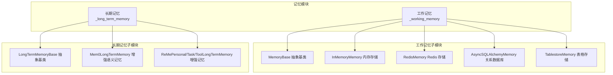
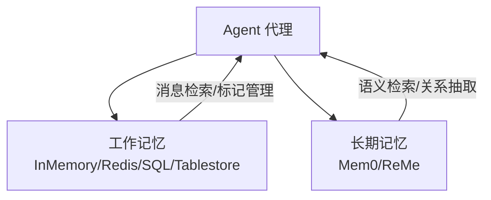
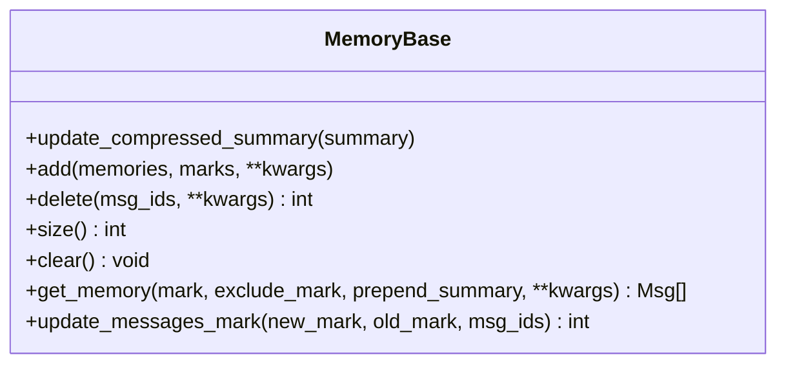
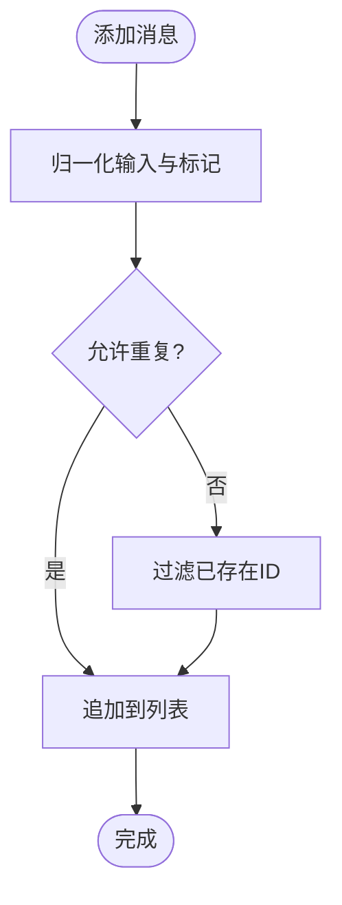
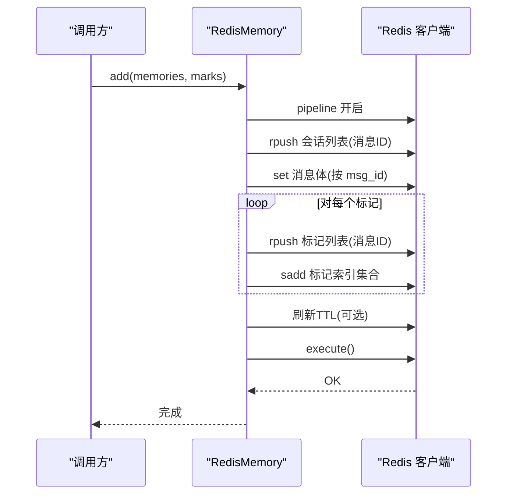
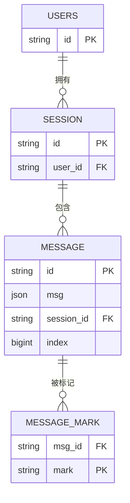
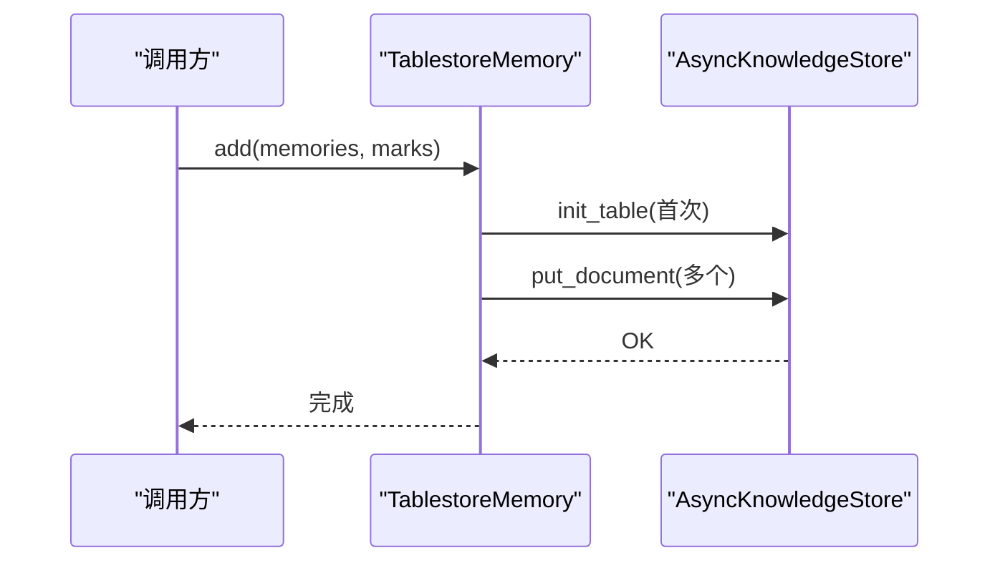
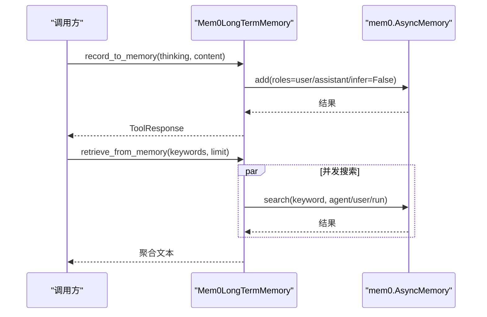
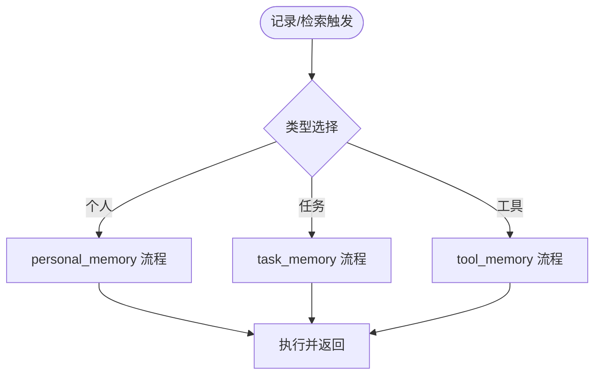
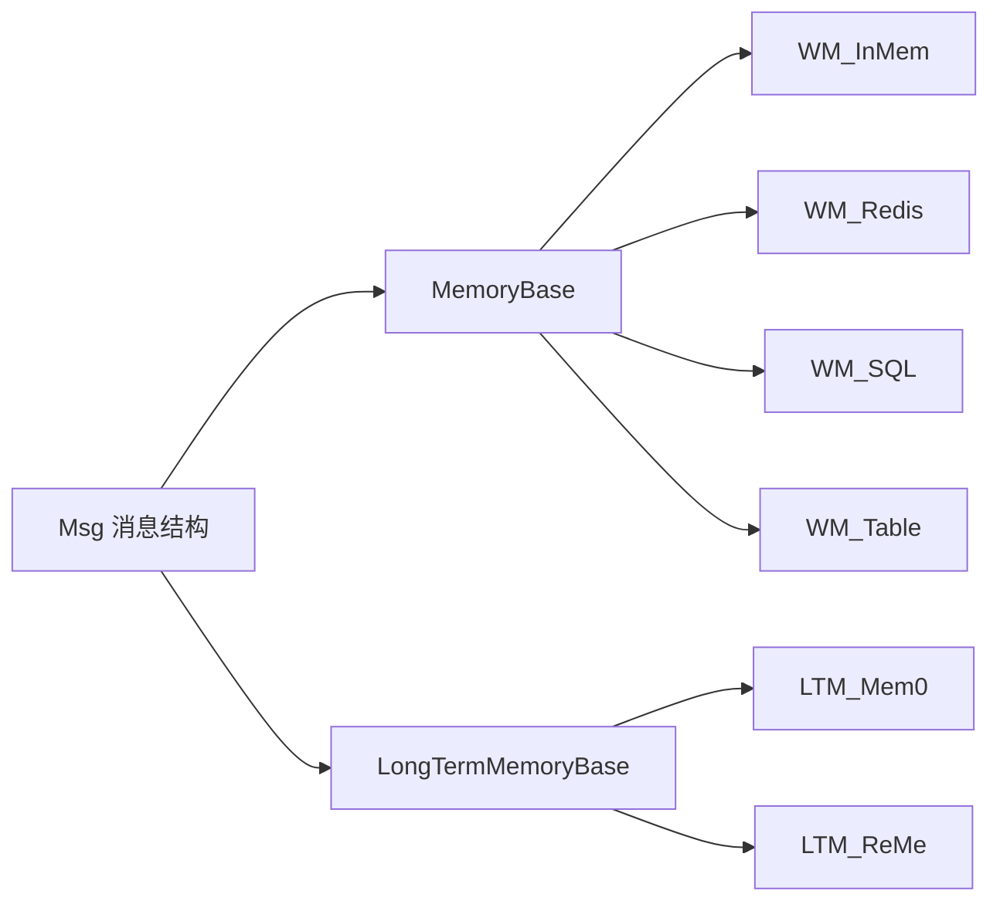

# 记忆系统

<cite>
**本文引用的文件**
- [memory/__init__.py](file://src/agentscope/memory/__init__.py)
- [memory/_working_memory/__init__.py](file://src/agentscope/memory/_working_memory/__init__.py)
- [memory/_working_memory/_base.py](file://src/agentscope/memory/_working_memory/_base.py)
- [memory/_working_memory/_in_memory_memory.py](file://src/agentscope/memory/_working_memory/_in_memory_memory.py)
- [memory/_working_memory/_redis_memory.py](file://src/agentscope/memory/_working_memory/_redis_memory.py)
- [memory/_working_memory/_sqlalchemy_memory.py](file://src/agentscope/memory/_working_memory/_sqlalchemy_memory.py)
- [memory/_working_memory/_tablestore_memory.py](file://src/agentscope/memory/_working_memory/_tablestore_memory.py)
- [memory/_long_term_memory/__init__.py](file://src/agentscope/memory/_long_term_memory/__init__.py)
- [memory/_long_term_memory/_long_term_memory_base.py](file://src/agentscope/memory/_long_term_memory/_long_term_memory_base.py)
- [memory/_long_term_memory/_mem0/_mem0_long_term_memory.py](file://src/agentscope/memory/_long_term_memory/_mem0/_mem0_long_term_memory.py)
- [memory/_long_term_memory/_reme/__init__.py](file://src/agentscope/memory/_long_term_memory/_reme/__init__.py)
- [memory/_long_term_memory/_reme/_reme_personal_long_term_memory.py](file://src/agentscope/memory/_long_term_memory/_reme/_reme_personal_long_term_memory.py)
- [memory/_long_term_memory/_reme/_reme_task_long_term_memory.py](file://src/agentscope/memory/_long_term_memory/_reme/_reme_task_long_term_memory.py)
- [memory/_long_term_memory/_reme/_reme_tool_long_term_memory.py](file://src/agentscope/memory/_long_term_memory/_reme/_reme_tool_long_term_memory.py)
- [examples/functionality/short_term_memory/memory_compression/main.py](file://examples/functionality/short_term_memory/memory_compression/main.py)
- [examples/functionality/long_term_memory/mem0/memory_example.py](file://examples/functionality/long_term_memory/mem0/memory_example.py)
- [examples/functionality/long_term_memory/reme/personal_memory_example.py](file://examples/functionality/long_term_memory/reme/personal_memory_example.py)
- [examples/functionality/long_term_memory/reme/task_memory_example.py](file://examples/functionality/long_term_memory/reme/task_memory_example.py)
- [examples/functionality/long_term_memory/reme/tool_memory_example.py](file://examples/functionality/long_term_memory/reme/tool_memory_example.py)
</cite>

## 目录
1. [简介](#简介)
2. [项目结构](#项目结构)
3. [核心组件](#核心组件)
4. [架构总览](#架构总览)
5. [详细组件分析](#详细组件分析)
6. [依赖关系分析](#依赖关系分析)
7. [性能考量](#性能考量)
8. [故障排查指南](#故障排查指南)
9. [结论](#结论)
10. [附录：API 参考与部署建议](#附录api-参考与部署建议)

## 简介
本文件系统性梳理 AgentScope 的记忆体系，覆盖工作记忆（短期）与长期记忆两大类。工作记忆提供多样的本地/远程存储后端（内存、Redis、SQLAlchemy、Tablestore），支持标记（marks）索引、去重、批量操作与会话隔离；长期记忆提供基于 Mem0 的语义增强记忆与基于 ReMe 的三类增强记忆（个人、任务、工具）。文档从架构、数据流、处理逻辑、集成点、错误处理与性能特征等维度展开，并给出使用模式、配置要点、性能对比与最佳实践。

## 项目结构
记忆模块位于 src/agentscope/memory 下，按“工作记忆”和“长期记忆”分层组织，分别在各自子包中导出统一入口。

图表来源
- [memory/__init__.py:1-34](file://src/agentscope/memory/__init__.py#L1-L34)
- [memory/_working_memory/__init__.py:1-19](file://src/agentscope/memory/_working_memory/__init__.py#L1-L19)
- [memory/_long_term_memory/__init__.py:1-19](file://src/agentscope/memory/_long_term_memory/__init__.py#L1-L19)

章节来源
- [memory/__init__.py:1-34](file://src/agentscope/memory/__init__.py#L1-L34)
- [memory/_working_memory/__init__.py:1-19](file://src/agentscope/memory/_working_memory/__init__.py#L1-L19)
- [memory/_long_term_memory/__init__.py:1-19](file://src/agentscope/memory/_long_term_memory/__init__.py#L1-L19)

## 核心组件
- 工作记忆抽象基类 MemoryBase：定义统一接口（添加、删除、清空、获取、更新标记、统计大小等），并内置压缩摘要状态字段。
- 长期记忆抽象基类 LongTermMemoryBase：定义开发者用的 record/retrieve 与工具用的 record_to_memory/retrieve_from_memory 接口。
- 各种具体实现：
  - InMemoryMemory：纯内存列表+标记集合，适合单进程、低延迟场景。
  - RedisMemory：键空间隔离（用户+会话），支持 marks 索引与滑动过期。
  - AsyncSQLAlchemyMemory：异步 ORM，支持 SQLite/PG/MySQL 等，带会话/用户隔离与并发写锁。
  - TablestoreMemory：阿里云 Tablestore 文档型存储，支持向量/关键词检索与多租户。
  - Mem0LongTermMemory：基于 mem0 的增强语义记忆，支持向量存储、推理抽取、元数据过滤。
  - ReMePersonal/Task/ToolLongTermMemory：基于 ReMe 的三类增强记忆，分别面向个人偏好、任务经验、工具使用。

章节来源
- [memory/_working_memory/_base.py:11-169](file://src/agentscope/memory/_working_memory/_base.py#L11-L169)
- [memory/_long_term_memory/_long_term_memory_base.py:11-95](file://src/agentscope/memory/_long_term_memory/_long_term_memory_base.py#L11-L95)

## 架构总览
工作记忆与长期记忆通过统一的消息 Msg 结构进行交互，前者强调高吞吐、低延迟与标记索引，后者强调语义检索与知识沉淀。

图表来源
- [memory/_working_memory/_base.py:31-169](file://src/agentscope/memory/_working_memory/_base.py#L31-L169)
- [memory/_long_term_memory/_long_term_memory_base.py:24-95](file://src/agentscope/memory/_long_term_memory/_long_term_memory_base.py#L24-L95)

## 详细组件分析

### 工作记忆：抽象与通用能力
- 统一接口职责
  - 添加/删除/清空/统计大小/获取消息（支持按标记过滤与排除标记）
  - 更新消息标记（新增、移除、替换）
  - 压缩摘要状态（可选前置到返回结果）
- 设计要点
  - 以 Msg 为最小单位，支持字符串或内容块列表
  - 标记采用字符串集合，便于多维索引
  - 提供严格类型检查与错误提示

图表来源
- [memory/_working_memory/_base.py:11-169](file://src/agentscope/memory/_working_memory/_base.py#L11-L169)

章节来源
- [memory/_working_memory/_base.py:11-169](file://src/agentscope/memory/_working_memory/_base.py#L11-L169)

### 工作记忆：内存实现 InMemoryMemory
- 数据结构：列表存储 (Msg, marks)，注册状态用于序列化
- 特性
  - 允许去重插入（可配置）
  - 支持按标记过滤与排除
  - 压缩摘要前置到结果
- 复杂度
  - 获取/过滤：O(n)
  - 删除/更新标记：O(n) 遍历
- 适用场景：单机、小规模、快速原型

图表来源
- [memory/_working_memory/_in_memory_memory.py:93-136](file://src/agentscope/memory/_working_memory/_in_memory_memory.py#L93-L136)

章节来源
- [memory/_working_memory/_in_memory_memory.py:10-306](file://src/agentscope/memory/_working_memory/_in_memory_memory.py#L10-L306)

### 工作记忆：Redis 实现 RedisMemory
- 会话/用户隔离：每个实例绑定 session_id/user_id
- 键空间设计
  - 会话消息有序列表：记录消息ID顺序
  - 消息体哈希：按 msg_id 存储完整消息
  - 标记列表：按 mark 名称维护消息ID列表
  - 标记索引集合：快速枚举所有标记
- 运行时特性
  - 批量 mget 减少往返
  - 滑动过期刷新（可选）
  - 自动扫描迁移旧结构至新索引
- 并发与一致性
  - 使用管道保证原子性
  - 删除时同步清理消息体与标记列表

图表来源
- [memory/_working_memory/_redis_memory.py:471-554](file://src/agentscope/memory/_working_memory/_redis_memory.py#L471-L554)

章节来源
- [memory/_working_memory/_redis_memory.py:16-828](file://src/agentscope/memory/_working_memory/_redis_memory.py#L16-L828)

### 工作记忆：SQLAlchemy 实现 AsyncSQLAlchemyMemory
- 数据模型
  - 用户表、会话表、消息表、消息标记表（多对多）
  - 消息按索引列保持插入顺序
- 初始化与并发
  - 懒创建表与用户/会话记录
  - 写入使用互斥锁与事务封装，异常自动回滚
- 查询策略
  - 先按会话过滤，再按标记 join，最后按索引排序
  - 排除标记通过子查询实现
- 复杂度
  - 插入：O(1) + flush/bulk_insert
  - 查询：基于索引与外键，复杂度取决于过滤条件

图表来源
- [memory/_working_memory/_sqlalchemy_memory.py:44-119](file://src/agentscope/memory/_working_memory/_sqlalchemy_memory.py#L44-L119)

章节来源
- [memory/_working_memory/_sqlalchemy_memory.py:32-890](file://src/agentscope/memory/_working_memory/_sqlalchemy_memory.py#L32-L890)

### 工作记忆：Tablestore 实现 TablestoreMemory
- 文档模型：消息作为文档，元信息含会话ID、角色、时间戳、marks_json
- 检索能力：关键词/向量混合检索，支持多租户与会话隔离
- 初始化：首次使用懒初始化知识库与表结构
- 并发：异步 gather 并发写入

图表来源
- [memory/_working_memory/_tablestore_memory.py:261-315](file://src/agentscope/memory/_working_memory/_tablestore_memory.py#L261-L315)

章节来源
- [memory/_working_memory/_tablestore_memory.py:14-852](file://src/agentscope/memory/_working_memory/_tablestore_memory.py#L14-L852)

### 长期记忆：Mem0 增强语义记忆
- 集成方式
  - 注册自定义 LLM/Embedder Provider（agentscope）
  - 支持向量存储（默认 Qdrant，可配置 on_disk）
  - 支持元数据过滤（agent/user/run）
- 录制策略
  - 三段式回退：优先 user 角色；失败则 assistant 角色；最后禁用推理直接记录
- 检索
  - 多关键词并发搜索，聚合结果与关系三元组

图表来源
- [memory/_long_term_memory/_mem0/_mem0_long_term_memory.py:380-571](file://src/agentscope/memory/_long_term_memory/_mem0/_mem0_long_term_memory.py#L380-L571)

章节来源
- [memory/_long_term_memory/_mem0/_mem0_long_term_memory.py:72-747](file://src/agentscope/memory/_long_term_memory/_mem0/_mem0_long_term_memory.py#L72-L747)

### 长期记忆：ReMe 增强记忆（个人/任务/工具）
- 个人记忆：记录用户偏好、习惯、事实，检索个性化上下文
- 任务记忆：记录执行轨迹与经验，检索同类问题解法
- 工具记忆：记录工具调用结果与最佳实践，生成使用指南
- 共同点
  - 通过 ReMe 应用上下文执行特定流程
  - 支持按关键词检索与限制返回条数
  - 记录时可携带评分（任务记忆）

图表来源
- [memory/_long_term_memory/_reme/_reme_personal_long_term_memory.py:20-154](file://src/agentscope/memory/_long_term_memory/_reme/_reme_personal_long_term_memory.py#L20-L154)
- [memory/_long_term_memory/_reme/_reme_task_long_term_memory.py:25-155](file://src/agentscope/memory/_long_term_memory/_reme/_reme_task_long_term_memory.py#L25-L155)
- [memory/_long_term_memory/_reme/_reme_tool_long_term_memory.py:25-178](file://src/agentscope/memory/_long_term_memory/_reme/_reme_tool_long_term_memory.py#L25-L178)

章节来源
- [memory/_long_term_memory/_reme/_reme_personal_long_term_memory.py:17-415](file://src/agentscope/memory/_long_term_memory/_reme/_reme_personal_long_term_memory.py#L17-L415)
- [memory/_long_term_memory/_reme/_reme_task_long_term_memory.py:17-437](file://src/agentscope/memory/_long_term_memory/_reme/_reme_task_long_term_memory.py#L17-L437)
- [memory/_long_term_memory/_reme/_reme_tool_long_term_memory.py:17-546](file://src/agentscope/memory/_long_term_memory/_reme/_reme_tool_long_term_memory.py#L17-L546)

### 短期记忆压缩与存储优化
- 压缩摘要前置：在获取消息时可将压缩摘要作为第一条用户消息返回，减少上下文冗余
- 存储优化
  - InMemoryMemory：去重插入、按标记过滤
  - RedisMemory：批量 mget、滑动过期、索引集合
  - AsyncSQLAlchemyMemory：flush/bulk_insert、索引排序、子查询排除
  - TablestoreMemory：懒初始化、并发写入、向量/关键词检索

章节来源
- [memory/_working_memory/_base.py:22-30](file://src/agentscope/memory/_working_memory/_base.py#L22-L30)
- [memory/_working_memory/_in_memory_memory.py:93-136](file://src/agentscope/memory/_working_memory/_in_memory_memory.py#L93-L136)
- [memory/_working_memory/_redis_memory.py:443-469](file://src/agentscope/memory/_working_memory/_redis_memory.py#L443-L469)
- [memory/_working_memory/_sqlalchemy_memory.py:461-510](file://src/agentscope/memory/_working_memory/_sqlalchemy_memory.py#L461-L510)
- [memory/_working_memory/_tablestore_memory.py:309-315](file://src/agentscope/memory/_working_memory/_tablestore_memory.py#L309-L315)

## 依赖关系分析
- 工作记忆内部耦合度低，均继承 MemoryBase，便于替换与组合
- 长期记忆依赖外部库（mem0、ReMe），通过工厂/适配器注入模型与向量存储
- 各实现对 Msg 的依赖一致，确保跨模块消息格式统一

图表来源
- [memory/_working_memory/_base.py:11-169](file://src/agentscope/memory/_working_memory/_base.py#L11-L169)
- [memory/_long_term_memory/_long_term_memory_base.py:11-95](file://src/agentscope/memory/_long_term_memory/_long_term_memory_base.py#L11-L95)

章节来源
- [memory/_working_memory/_base.py:11-169](file://src/agentscope/memory/_working_memory/_base.py#L11-L169)
- [memory/_long_term_memory/_long_term_memory_base.py:11-95](file://src/agentscope/memory/_long_term_memory/_long_term_memory_base.py#L11-L95)

## 性能考量
- IO 与网络
  - RedisMemory：O(1) 列表/哈希操作，批量 mget 降低 RTT；滑动过期可能带来额外扫描成本
  - AsyncSQLAlchemyMemory：基于索引的查询；flush/bulk_insert 提升批量写入效率
  - TablestoreMemory：并发写入；向量/关键词检索受索引与分片影响
- CPU 与内存
  - InMemoryMemory：纯内存，适合小规模；大规模时遍历开销显著
  - Mem0/ReMe：向量化与检索带来额外计算；建议合理 limit 与关键词粒度
- 并发与一致性
  - AsyncSQLAlchemyMemory 使用互斥锁与事务封装，避免竞态
  - RedisMemory 使用管道保证原子性

## 故障排查指南
- Redis 连接失败
  - 检查主机、端口、密码与连接池参数
  - 确认 key_prefix 与 key_ttl 设置是否合理
- SQLAlchemy 初始化失败
  - 确认引擎/会话可用，表未被外部删除
  - 查看事务回滚日志定位异常
- Mem0/ReMe 集成问题
  - 确认已安装对应库并版本兼容
  - 检查 agentscope provider 是否成功注册
  - 对于 mem0 Qdrant 版本警告，可按需抑制日志
- ReMe 应用上下文未启动
  - 使用 async with 初始化应用上下文后再调用记录/检索

章节来源
- [memory/_working_memory/_redis_memory.py:111-118](file://src/agentscope/memory/_working_memory/_redis_memory.py#L111-L118)
- [memory/_working_memory/_sqlalchemy_memory.py:146-165](file://src/agentscope/memory/_working_memory/_sqlalchemy_memory.py#L146-L165)
- [memory/_long_term_memory/_mem0/_mem0_long_term_memory.py:98-133](file://src/agentscope/memory/_long_term_memory/_mem0/_mem0_long_term_memory.py#L98-L133)
- [memory/_long_term_memory/_reme/_reme_personal_long_term_memory.py:73-78](file://src/agentscope/memory/_long_term_memory/_reme/_reme_personal_long_term_memory.py#L73-L78)

## 结论
AgentScope 记忆系统通过清晰的抽象与多样化的实现，兼顾短期与长期记忆的不同需求。工作记忆侧重高吞吐与灵活标记，长期记忆强调语义检索与知识沉淀。结合合适的后端与参数调优，可在不同场景下取得良好效果。

## 附录：API 参考与部署建议

### 使用模式与最佳实践
- 状态保存与上下文维护
  - 工作记忆：利用状态注册与序列化，保存 content 与压缩摘要
  - 长期记忆：通过 record/retrieve 或 record_to_memory/retrieve_from_memory 在合适时机调用
- 历史查询
  - 工作记忆：按标记过滤、排除标记、限制数量
  - 长期记忆：关键词检索、关系抽取、元数据过滤
- 记忆压缩
  - 将高频但低价值的历史压缩为摘要，前置到返回消息，减少上下文长度

章节来源
- [memory/_working_memory/_in_memory_memory.py:273-306](file://src/agentscope/memory/_working_memory/_in_memory_memory.py#L273-L306)
- [memory/_working_memory/_base.py:22-30](file://src/agentscope/memory/_working_memory/_base.py#L22-L30)

### 配置示例与参数说明
- RedisMemory
  - 关键参数：session_id、user_id、host、port、db、password、connection_pool、key_prefix、key_ttl
  - 建议：生产环境开启滑动过期并设置合理 TTL；使用 key_prefix 隔离多环境
- AsyncSQLAlchemyMemory
  - 关键参数：engine_or_session、session_id、user_id
  - 建议：使用 AsyncEngine + async_sessionmaker；启用索引与外键约束
- TablestoreMemory
  - 关键参数：end_point、instance_name、access_key_id、access_key_secret、sts_token、table_name、text_field、embedding_field、vector_dimension
  - 建议：首次使用懒初始化；根据业务启用向量检索
- Mem0LongTermMemory
  - 关键参数：agent_name、user_name、run_name、model、embedding_model、vector_store_config、mem0_config、default_memory_type、suppress_mem0_logging、on_disk
  - 建议：至少提供一个标识符；on_disk 控制持久化
- ReMe 系列
  - 关键参数：workspace_id、async with 初始化应用上下文
  - 建议：个人/任务/工具记忆分别针对不同领域，合理设置 top_k 与 limit

章节来源
- [memory/_working_memory/_redis_memory.py:65-110](file://src/agentscope/memory/_working_memory/_redis_memory.py#L65-L110)
- [memory/_working_memory/_sqlalchemy_memory.py:120-168](file://src/agentscope/memory/_working_memory/_sqlalchemy_memory.py#L120-L168)
- [memory/_working_memory/_tablestore_memory.py:26-70](file://src/agentscope/memory/_working_memory/_tablestore_memory.py#L26-L70)
- [memory/_long_term_memory/_mem0/_mem0_long_term_memory.py:263-379](file://src/agentscope/memory/_long_term_memory/_mem0/_mem0_long_term_memory.py#L263-L379)
- [memory/_long_term_memory/_reme/_reme_personal_long_term_memory.py:73-154](file://src/agentscope/memory/_long_term_memory/_reme/_reme_personal_long_term_memory.py#L73-L154)

### 示例参考
- 内存压缩示例
  - [examples/functionality/short_term_memory/memory_compression/main.py](file://examples/functionality/short_term_memory/memory_compression/main.py)
- Mem0 长期记忆示例
  - [examples/functionality/long_term_memory/mem0/memory_example.py](file://examples/functionality/long_term_memory/mem0/memory_example.py)
- ReMe 个人/任务/工具记忆示例
  - [examples/functionality/long_term_memory/reme/personal_memory_example.py](file://examples/functionality/long_term_memory/reme/personal_memory_example.py)
  - [examples/functionality/long_term_memory/reme/task_memory_example.py](file://examples/functionality/long_term_memory/reme/task_memory_example.py)
  - [examples/functionality/long_term_memory/reme/tool_memory_example.py](file://examples/functionality/long_term_memory/reme/tool_memory_example.py)