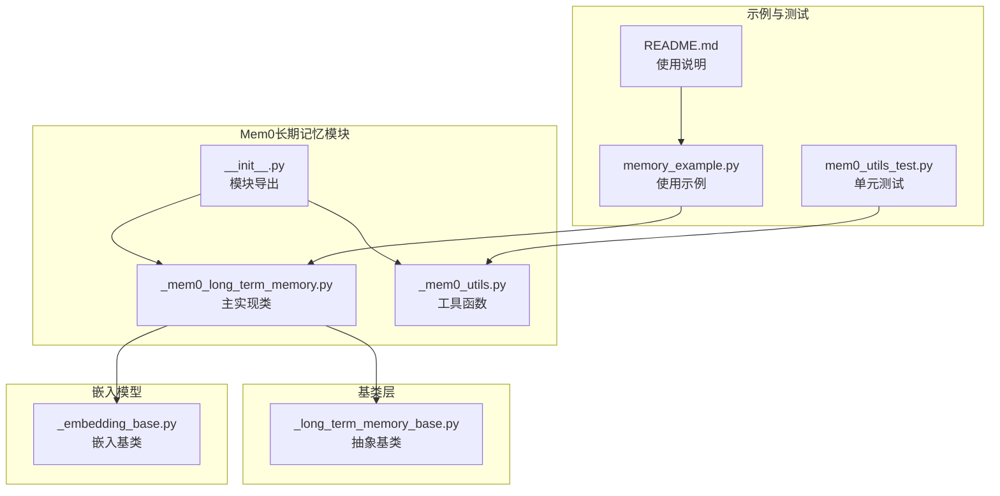
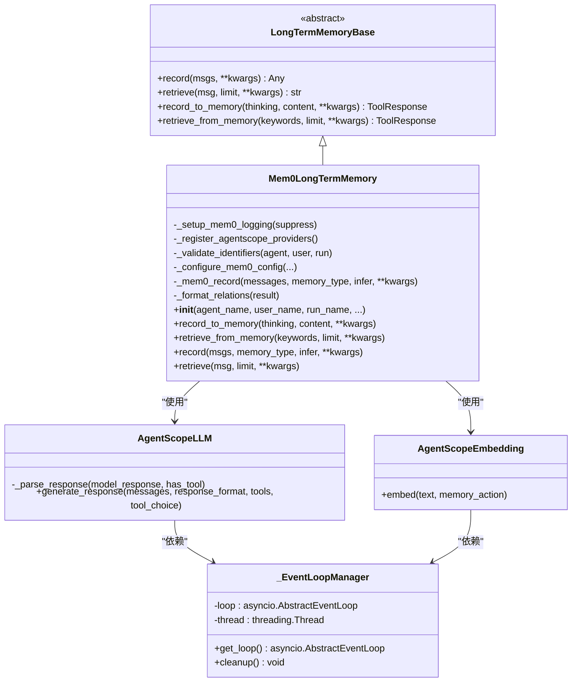
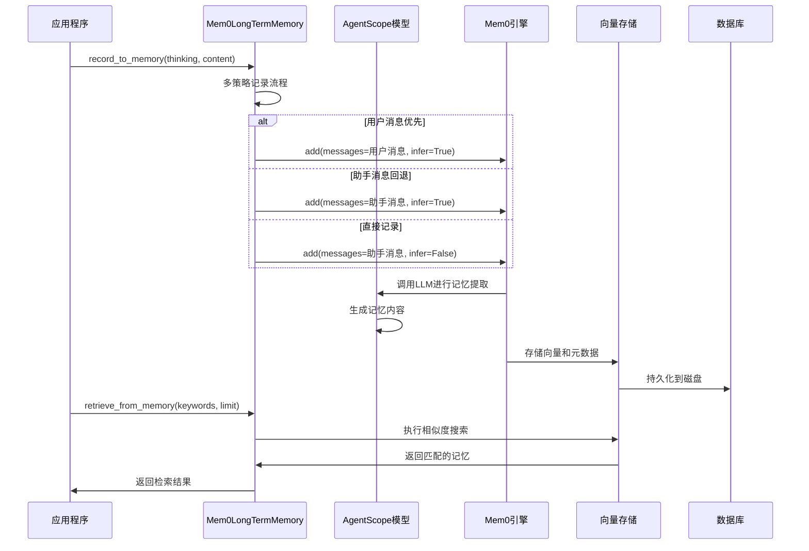
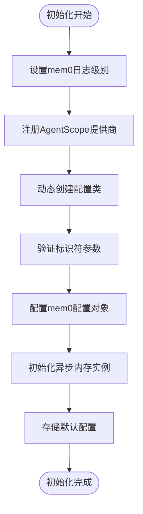
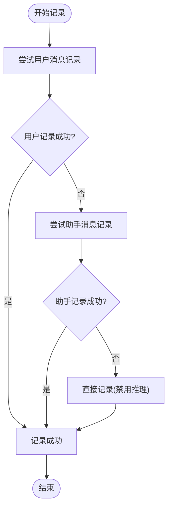
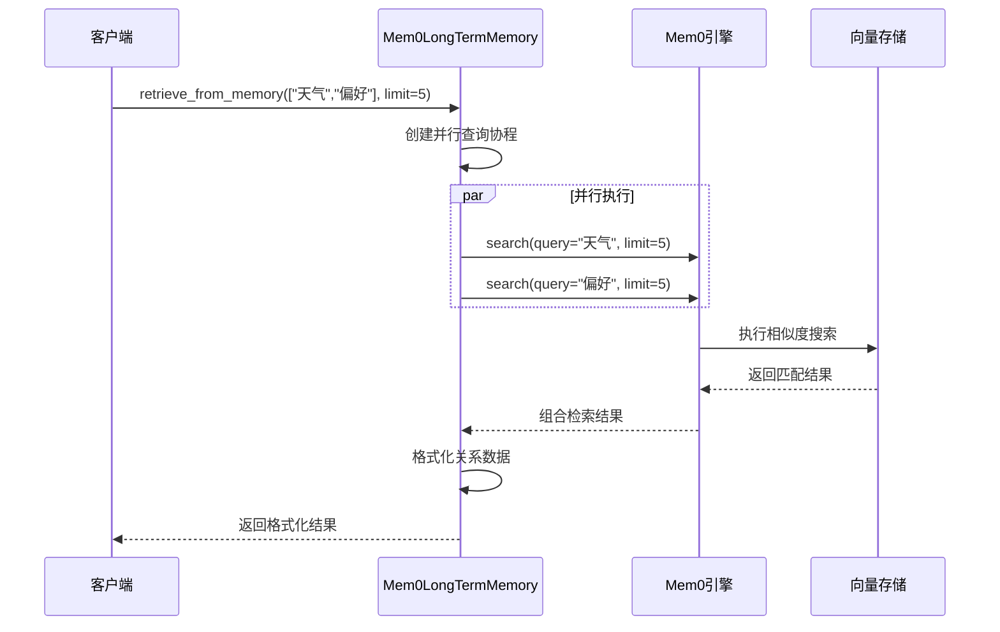
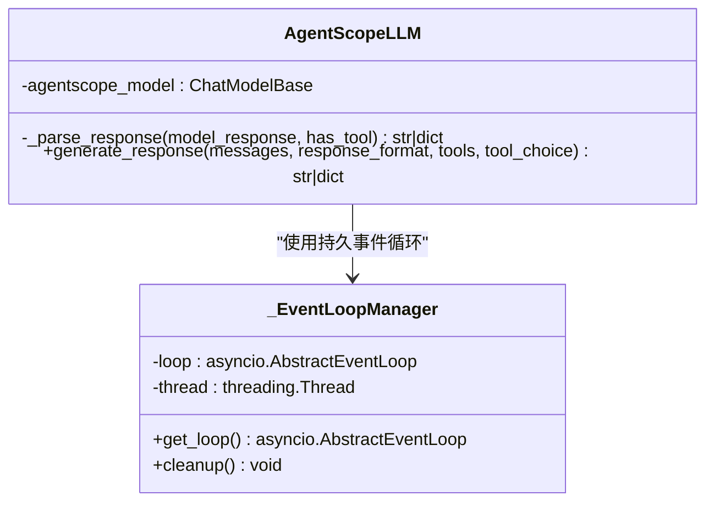
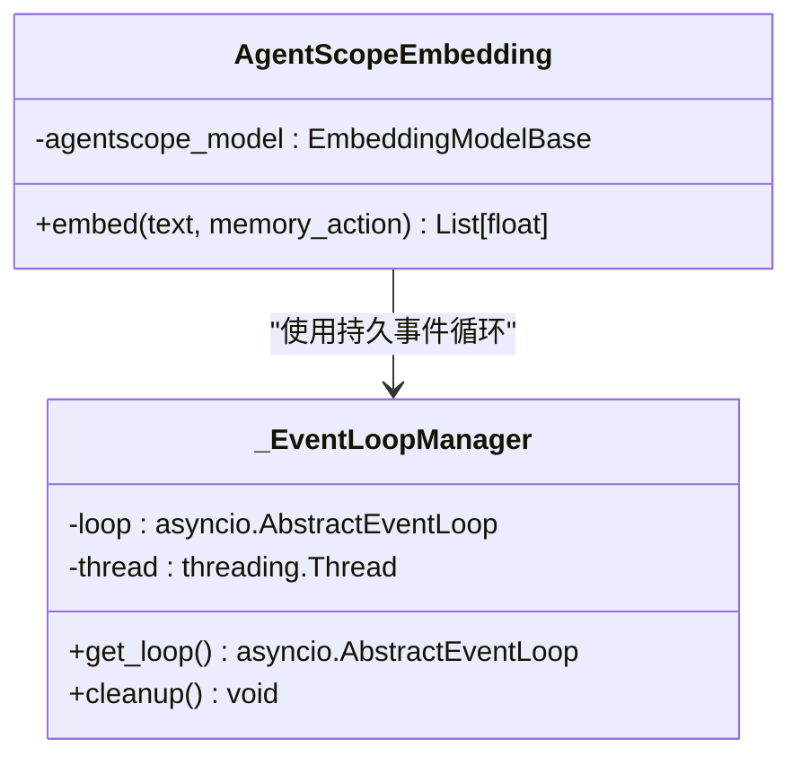
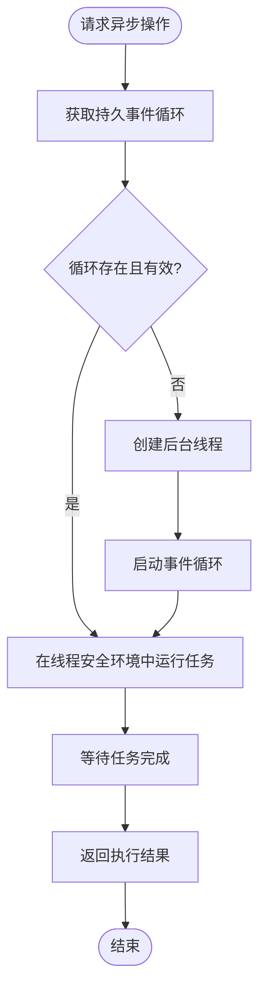
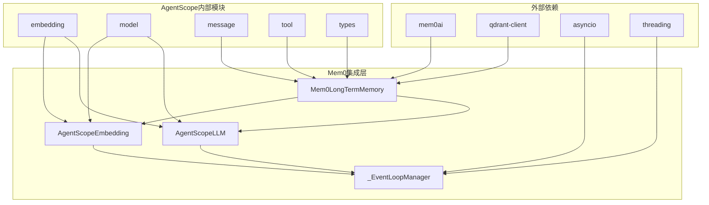

# Mem0长期记忆

<cite>
**本文引用的文件列表**
- [Mem0模块初始化](file://src/agentscope/memory/_long_term_memory/_mem0/__init__.py)
- [Mem0长期记忆实现](file://src/agentscope/memory/_long_term_memory/_mem0/_mem0_long_term_memory.py)
- [Mem0工具函数](file://src/agentscope/memory/_long_term_memory/_mem0/_mem0_utils.py)
- [Mem0长期记忆基类](file://src/agentscope/memory/_long_term_memory/_long_term_memory_base.py)
- [Mem0示例代码](file://examples/functionality/long_term_memory/mem0/memory_example.py)
- [Mem0示例说明](file://examples/functionality/long_term_memory/mem0/README.md)
- [Mem0工具函数单元测试](file://tests/mem0_utils_test.py)
- [嵌入模型基类](file://src/agentscope/embedding/_embedding_base.py)
</cite>

## 目录
1. [简介](#简介)
2. [项目结构](#项目结构)
3. [核心组件](#核心组件)
4. [架构概览](#架构概览)
5. [详细组件分析](#详细组件分析)
6. [依赖关系分析](#依赖关系分析)
7. [性能考虑](#性能考虑)
8. [故障排除指南](#故障排除指南)
9. [结论](#结论)
10. [附录](#附录)

## 简介
本文件为AgentScope中Mem0长期记忆实现的详细技术文档。Mem0是一个开源的长期记忆系统，支持语义记忆、程序性记忆和图谱记忆等多种记忆类型。在AgentScope中，Mem0通过统一的接口实现了向量化存储、嵌入向量生成、相似度检索等核心功能，并提供了灵活的配置选项以适配不同的向量数据库和嵌入模型。

Mem0长期记忆的核心优势包括：
- **多记忆类型支持**：语义记忆、程序性记忆、图谱记忆
- **向量数据库集成**：支持Qdrant、Milvus、MongoDB等多种向量存储
- **异步操作支持**：完整的异步API，适合高并发场景
- **可扩展性**：支持自定义嵌入模型和LLM提供商
- **持久化能力**：支持磁盘持久化，确保数据不丢失

## 项目结构
AgentScope的Mem0长期记忆实现位于内存管理模块的子目录中，采用清晰的分层架构：



**图表来源**
- [Mem0模块初始化:1-10](file://src/agentscope/memory/_long_term_memory/_mem0/__init__.py#L1-L10)
- [Mem0长期记忆实现:1-747](file://src/agentscope/memory/_long_term_memory/_mem0/_mem0_long_term_memory.py#L1-L747)
- [Mem0工具函数:1-364](file://src/agentscope/memory/_long_term_memory/_mem0/_mem0_utils.py#L1-L364)

**章节来源**
- [Mem0模块初始化:1-10](file://src/agentscope/memory/_long_term_memory/_mem0/__init__.py#L1-L10)
- [Mem0长期记忆实现:1-747](file://src/agentscope/memory/_long_term_memory/_mem0/_mem0_long_term_memory.py#L1-L747)
- [Mem0工具函数:1-364](file://src/agentscope/memory/_long_term_memory/_mem0/_mem0_utils.py#L1-L364)

## 核心组件
Mem0长期记忆系统由以下核心组件构成：

### 主要类层次结构


**图表来源**
- [Mem0长期记忆实现:72-747](file://src/agentscope/memory/_long_term_memory/_mem0/_mem0_long_term_memory.py#L72-L747)
- [Mem0工具函数:133-364](file://src/agentscope/memory/_long_term_memory/_mem0/_mem0_utils.py#L133-L364)
- [Mem0长期记忆基类:11-95](file://src/agentscope/memory/_long_term_memory/_long_term_memory_base.py#L11-L95)

### 配置参数详解
Mem0LongTermMemory类支持丰富的配置参数：

| 参数名称 | 类型 | 默认值 | 描述 |
|---------|------|--------|------|
| agent_name | str \| None | None | 代理标识符，用于记忆元数据 |
| user_name | str \| None | None | 用户标识符，用于记忆元数据 |
| run_name | str \| None | None | 运行会话标识符 |
| model | ChatModelBase \| None | None | 用于记忆提取的聊天模型 |
| embedding_model | EmbeddingModelBase \| None | None | 嵌入模型，生成向量表示 |
| vector_store_config | VectorStoreConfig \| None | None | 向量存储配置 |
| mem0_config | MemoryConfig \| None | None | 完整的mem0配置对象 |
| default_memory_type | str \| None | None | 默认记忆类型 |
| suppress_mem0_logging | bool | True | 是否抑制mem0日志输出 |

**章节来源**
- [Mem0长期记忆实现:263-379](file://src/agentscope/memory/_long_term_memory/_mem0/_mem0_long_term_memory.py#L263-L379)

## 架构概览
Mem0长期记忆系统采用分层架构设计，实现了从应用层到底层存储的完整数据流：



**图表来源**
- [Mem0长期记忆实现:380-571](file://src/agentscope/memory/_long_term_memory/_mem0/_mem0_long_term_memory.py#L380-L571)
- [Mem0工具函数:133-282](file://src/agentscope/memory/_long_term_memory/_mem0/_mem0_utils.py#L133-L282)

### 数据流处理
系统采用异步非阻塞的数据流处理机制：

1. **记录阶段**：多策略降级记录确保记忆成功持久化
2. **嵌入阶段**：使用AgentScope嵌入模型生成向量表示
3. **存储阶段**：向量和元数据存储到向量数据库
4. **检索阶段**：基于语义相似度的并行查询

**章节来源**
- [Mem0长期记忆实现:380-747](file://src/agentscope/memory/_long_term_memory/_mem0/_mem0_long_term_memory.py#L380-L747)

## 详细组件分析

### Mem0LongTermMemory类实现
Mem0LongTermMemory是整个系统的核心实现类，继承自LongTermMemoryBase抽象基类。

#### 初始化流程


**图表来源**
- [Mem0长期记忆实现:342-379](file://src/agentscope/memory/_long_term_memory/_mem0/_mem0_long_term_memory.py#L342-L379)

#### 记忆记录策略
系统实现了三层降级记录策略以确保记忆持久化：



**图表来源**
- [Mem0长期记忆实现:426-495](file://src/agentscope/memory/_long_term_memory/_mem0/_mem0_long_term_memory.py#L426-L495)

#### 记忆检索机制
检索功能支持关键词并行查询和关系格式化：



**图表来源**
- [Mem0长期记忆实现:507-571](file://src/agentscope/memory/_long_term_memory/_mem0/_mem0_long_term_memory.py#L507-L571)

**章节来源**
- [Mem0长期记忆实现:380-747](file://src/agentscope/memory/_long_term_memory/_mem0/_mem0_long_term_memory.py#L380-L747)

### AgentScopeLLM和AgentScopeEmbedding工具类
这两个工具类实现了AgentScope模型与mem0的无缝集成：

#### AgentScopeLLM类
负责将AgentScope的聊天模型包装为mem0可用的LLM接口：



**图表来源**
- [Mem0工具函数:133-282](file://src/agentscope/memory/_long_term_memory/_mem0/_mem0_utils.py#L133-L282)

#### AgentScopeEmbedding类
负责将AgentScope的嵌入模型包装为mem0可用的嵌入接口：



**图表来源**
- [Mem0工具函数:284-364](file://src/agentscope/memory/_long_term_memory/_mem0/_mem0_utils.py#L284-L364)

**章节来源**
- [Mem0工具函数:1-364](file://src/agentscope/memory/_long_term_memory/_mem0/_mem0_utils.py#L1-L364)

### 异步事件循环管理
为了确保异步客户端（如Ollama）的稳定运行，系统实现了全局事件循环管理器：



**图表来源**
- [Mem0工具函数:21-131](file://src/agentscope/memory/_long_term_memory/_mem0/_mem0_utils.py#L21-L131)

**章节来源**
- [Mem0工具函数:21-131](file://src/agentscope/memory/_long_term_memory/_mem0/_mem0_utils.py#L21-L131)

## 依赖关系分析
Mem0长期记忆系统的依赖关系呈现清晰的分层结构：



**图表来源**
- [Mem0长期记忆实现:1-747](file://src/agentscope/memory/_long_term_memory/_mem0/_mem0_long_term_memory.py#L1-L747)
- [Mem0工具函数:1-364](file://src/agentscope/memory/_long_term_memory/_mem0/_mem0_utils.py#L1-L364)

### 版本兼容性
系统对不同版本的mem0库提供了兼容性支持：

| mem0版本 | LLM提供商注册方式 | 嵌入模型注册方式 |
|----------|-------------------|------------------|
| ≤ 0.1.115 | 字符串路径 | 字符串路径 |
| > 0.1.115 | 元组(类, 基类) | 字符串路径 |

**章节来源**
- [Mem0长期记忆实现:99-132](file://src/agentscope/memory/_long_term_memory/_mem0/_mem0_long_term_memory.py#L99-L132)

## 性能考虑
基于Mem0长期记忆系统的实现特点，以下是关键的性能优化建议：

### 异步操作优化
1. **并行检索**：系统已实现关键词的并行查询，充分利用异步特性
2. **事件循环复用**：通过全局事件循环管理器避免重复创建事件循环
3. **内存池管理**：合理控制同时进行的异步操作数量

### 向量存储优化
1. **批量操作**：对于大量数据的写入，建议使用批量操作减少网络往返
2. **索引优化**：根据查询模式选择合适的距离度量和索引参数
3. **缓存策略**：对频繁访问的记忆内容实施缓存机制

### 内存管理
1. **及时清理**：定期清理过期或冗余的记忆条目
2. **增量更新**：支持增量更新而非全量替换
3. **资源监控**：监控向量存储的内存使用情况

## 故障排除指南

### 常见问题及解决方案

#### 1. mem0版本兼容性问题
**症状**：导入mem0时出现提供商标识错误
**原因**：mem0版本过低导致提供商注册方式不同
**解决方案**：升级mem0到最新版本或检查版本兼容性

#### 2. Qdrant向量存储维度不匹配
**症状**：启动时出现维度不匹配错误
**原因**：嵌入模型维度与现有数据库不一致
**解决方案**：修改存储路径或删除现有数据库文件

#### 3. 异步事件循环错误
**症状**：出现"Event loop is closed"错误
**原因**：异步客户端绑定到错误的事件循环
**解决方案**：使用系统提供的事件循环管理器

#### 4. API密钥认证失败
**症状**：嵌入模型或聊天模型调用失败
**原因**：API密钥配置错误或过期
**解决方案**：检查环境变量配置和密钥有效性

**章节来源**
- [Mem0长期记忆实现:76-90](file://src/agentscope/memory/_long_term_memory/_mem0/_mem0_long_term_memory.py#L76-L90)
- [Mem0示例说明](file://examples/functionality/long_term_memory/mem0/README.md#L91)

### 调试技巧
1. **启用详细日志**：临时关闭日志抑制以获取更多调试信息
2. **单元测试**：利用现有的单元测试框架验证功能正确性
3. **最小化重现**：创建最小化的测试用例快速定位问题

**章节来源**
- [Mem0工具函数单元测试:62-208](file://tests/mem0_utils_test.py#L62-L208)

## 结论
AgentScope的Mem0长期记忆实现提供了一个功能完整、性能优异的长期记忆解决方案。通过清晰的分层架构、完善的异步支持和灵活的配置选项，系统能够满足各种复杂应用场景的需求。

主要优势包括：
- **高度集成性**：与AgentScope生态系统的深度整合
- **多存储支持**：支持多种向量数据库和嵌入模型
- **性能优化**：异步操作和事件循环管理确保高效运行
- **易用性**：简洁的API设计降低使用门槛

未来可以考虑的改进方向：
- 更丰富的记忆类型支持
- 分布式部署能力
- 更精细的性能监控和调优工具

## 附录

### 使用示例
以下是最基本的使用示例，展示了如何初始化和使用Mem0长期记忆：

```python
# 初始化Mem0长期记忆
long_term_memory = Mem0LongTermMemory(
    agent_name="Friday",
    user_name="user_123",
    model=DashScopeChatModel(
        model_name="qwen-max-latest",
        api_key=os.environ.get("DASHSCOPE_API_KEY")
    ),
    embedding_model=DashScopeTextEmbedding(
        model_name="text-embedding-v3",
        api_key=os.environ.get("DASHSCOPE_API_KEY"),
        dimensions=1024
    ),
    vector_store_config=VectorStoreConfig(
        provider="qdrant",
        config={
            "on_disk": True,
            "path": "./qdrant_data",
            "embedding_model_dims": 1024
        }
    )
)

# 记录记忆
await long_term_memory.record_to_memory(
    thinking="用户表达了对特定住宿类型的偏好",
    content=["用户偏好：民宿", "地理位置：杭州西湖附近"]
)

# 检索记忆
result = await long_term_memory.retrieve_from_memory(
    keywords=["住宿偏好", "地理位置"],
    limit=5
)
```

### 配置选项参考
- **API密钥配置**：通过环境变量或构造函数参数设置
- **向量维度设置**：在嵌入模型配置中指定
- **相似度阈值**：通过向量存储配置调整
- **持久化路径**：在向量存储配置中指定

**章节来源**
- [Mem0示例代码:26-186](file://examples/functionality/long_term_memory/mem0/memory_example.py#L26-L186)
- [Mem0示例说明:56-158](file://examples/functionality/long_term_memory/mem0/README.md#L56-L158)